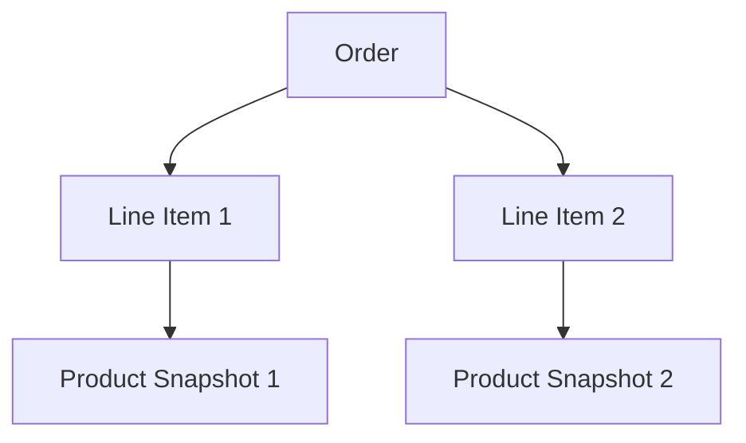
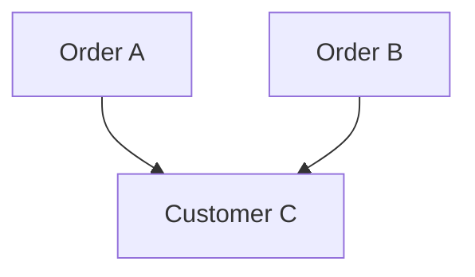
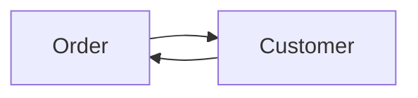
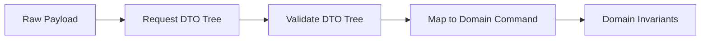
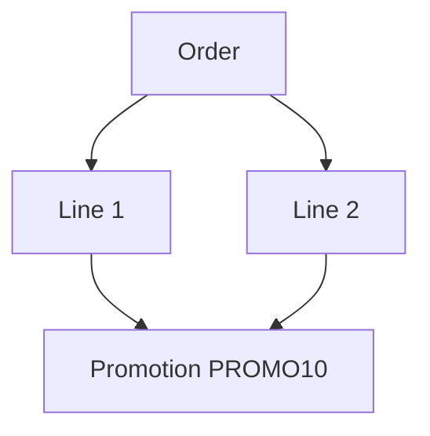
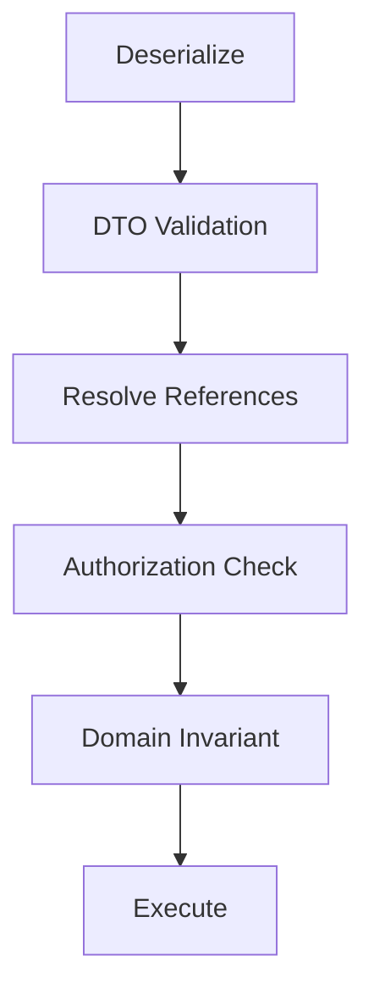
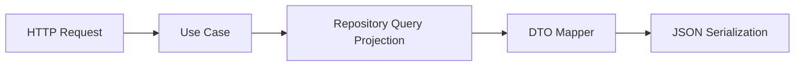
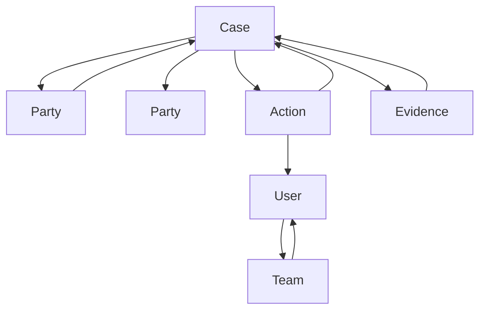

------
title: Learn Java Data Mapper, JSON/XML Processing & Validation - Part 008
description: Object graph, identity, cycle, reference handling, Jackson recursion control, MapStruct cycle context, DTO projection, and validation cascade boundaries.
series: learn-java-data-mapper-json-xml-validation
seriesTitle: Learn Java Data Mapper, JSON/XML Processing & Validation
order: 8
partTitle: Object Graphs, Identity, Cycles, and Reference Handling
tags:
- java
- data-mapper
- object-graph
- identity
- cycle
- jackson
- mapstruct
- jakarta-validation
- serialization
- contract
date: 2026-06-29
---

# Part 008 — Object Graphs, Identity, Cycles, and Reference Handling

> **Target skill:** mampu mendesain payload boundary untuk model yang memiliki relasi, identity, nested object, shared reference, dan cycle tanpa menghasilkan infinite recursion, payload raksasa, data leak, atau mapping bug.

Masalah ini sering muncul saat engineer langsung men-serialize entity/domain object:

```java
return orderRepository.findById(id);
```

Lalu modelnya punya relasi:

```txt
Order -> Customer -> Orders -> Customer -> Orders -> ...
```

Atau:

```txt
Case -> Party -> CaseRole -> Case
```

Atau:

```txt
Account -> Product -> Rules -> Product -> Rules
```

Jackson kemudian mencoba mengubah object graph menjadi JSON tree. Jika relasinya cyclic dan tidak ada rule yang jelas, hasilnya bisa:

- infinite recursion
- stack overflow
- payload terlalu besar
- lazy loading meledak
- data sensitif ikut keluar
- contract tidak stabil
- validation cascade terlalu dalam
- mapper masuk loop
- consumer menerima graph yang tidak bisa dipahami

Part ini membangun mental model yang penting:

> **Java object model can be a graph. JSON/XML payload is usually a tree. Boundary design is the act of choosing which part of the graph becomes the tree.**

---

## 1. Kaufman Deconstruction

Skill ini kita pecah menjadi beberapa subskill:

| Subskill | Kemampuan |
|---|---|
| Recognize graph shape | Tahu apakah model tree, DAG, graph, atau cyclic graph |
| Separate identity vs containment | Tahu kapan nested object berarti dimiliki, kapan hanya referensi |
| Choose projection | Mendesain DTO tree yang sengaja, bukan hasil kebetulan entity graph |
| Break cycles | Memakai DTO cut, id-reference, Jackson identity, managed/back reference, atau mapper context |
| Control serialization depth | Mencegah accidental deep traversal |
| Preserve reference semantics | Menjaga shared object tetap bermakna jika diperlukan |
| Validate cascades safely | Memakai `@Valid` tanpa membuat validation terlalu luas |
| Test graph behavior | Membuat fixture untuk cycle, shared reference, missing referenced id, deep nesting |

Latihan utama:

1. Ambil model dengan bidirectional relation.
2. Gambar graph.
3. Tentukan payload tree yang diinginkan.
4. Implement DTO projection.
5. Tambahkan test agar graph tidak bocor.
6. Tambahkan test untuk cycle.
7. Tambahkan test untuk validation cascade.

---

## 2. Graph vs Tree Mental Model

### 2.1 Tree

Tree punya satu root dan setiap node punya satu parent.



Ini mudah diserialisasi:

```json
{
  "orderId": "ORD-001",
  "items": [
    {
      "lineNo": 1,
      "product": {
        "sku": "SKU-1",
        "name": "Keyboard"
      }
    }
  ]
}
```

### 2.2 Graph

Graph bisa punya shared node.



Jika diserialisasi sebagai nested tree, customer bisa terduplikasi.

```json
{
  "orders": [
    {
      "orderId": "A",
      "customer": { "id": "C", "name": "Ana" }
    },
    {
      "orderId": "B",
      "customer": { "id": "C", "name": "Ana" }
    }
  ]
}
```

Duplikasi mungkin oke untuk read model. Tetapi jika consumer perlu tahu bahwa dua order menunjuk customer yang sama, gunakan id-reference.

### 2.3 Cyclic Graph

Cycle berarti ada jalur yang kembali ke node sebelumnya.



Payload tree tidak bisa menyatakan cycle secara natural tanpa reference mechanism.

---

## 3. Identity vs Containment

Sebelum membuat DTO, tentukan relasi ini:

| Relasi | Meaning | Boundary shape |
|---|---|---|
| containment | child adalah bagian dari aggregate/output | nested object/list |
| reference | child adalah entity lain yang hanya dirujuk | id/reference |
| snapshot | child adalah salinan state saat itu | nested immutable snapshot |
| lookup | child adalah display metadata | small embedded summary |
| link | child bisa diambil dari endpoint lain | href/id |

Contoh order:

```java
public record OrderView(
    String orderId,
    CustomerSummary customer,
    List<OrderLineView> lines
) {}
```

Ini bukan berarti `Customer` dimiliki oleh `Order`. Ini hanya projection.

Alternatif reference-only:

```java
public record OrderEvent(
    String orderId,
    String customerId,
    List<OrderLineEvent> lines
) {}
```

Mana yang benar tergantung consumer need.

---

## 4. The Dangerous Shortcut: Serializing Entities

Anti-pattern:

```java
@GetMapping("/orders/{id}")
public Order getOrder(@PathVariable UUID id) {
    return orderRepository.findById(id).orElseThrow();
}
```

Masalah:

1. Contract mengikuti entity internal.
2. Relasi lazy/eager ikut bocor.
3. Cycle bisa terjadi.
4. Sensitive field bisa ikut keluar.
5. Schema berubah saat persistence model berubah.
6. Consumer tergantung pada shape yang tidak didesain.
7. Error serialization terjadi setelah business logic sukses.
8. Observability sulit karena failure muncul di response writer.

Lebih baik:

```java
@GetMapping("/orders/{id}")
public OrderDetailResponse getOrder(@PathVariable UUID id) {
    Order order = orderService.getOrder(id);
    return orderMapper.toDetailResponse(order);
}
```

Mapper menjadi boundary projection, bukan sekadar copier.

---

## 5. Object Graph Failure Modes

| Failure Mode | Root Cause | Impact |
|---|---|---|
| infinite recursion | bidirectional relation serialized as nested object | stack overflow / request failure |
| payload explosion | deep graph traversal | latency, bandwidth, memory spike |
| accidental data leak | nested object contains sensitive fields | privacy/security incident |
| lazy loading storm | serialization touches lazy associations | N+1 query, transaction leak |
| inconsistent identity | same object serialized as duplicates with different state | consumer confusion |
| broken partial update | nested null interpreted as delete | data corruption |
| validation flood | `@Valid` cascades too far | unexpected errors/performance cost |
| mapper recursion | MapStruct recursively maps back-reference | stack overflow |
| contract instability | internal graph changes change output | consumer breakage |

---

## 6. Boundary Projection Strategy

### 6.1 Start from Consumer Question

Bad starting point:

> “What does the object contain?”

Better starting point:

> “What does the consumer need to decide or display?”

For order detail page:

```java
public record OrderDetailResponse(
    String orderId,
    String status,
    CustomerSummary customer,
    List<OrderLineResponse> lines,
    MoneyResponse total
) {}
```

For order event:

```java
public record OrderSubmittedEvent(
    String eventId,
    String orderId,
    String customerId,
    List<OrderLineEvent> lines,
    Instant occurredAt
) {}
```

For internal command:

```java
public record SubmitOrderCommand(
    CustomerId customerId,
    List<OrderLineCommand> lines,
    IdempotencyKey idempotencyKey
) {}
```

Same domain, different boundary shape.

### 6.2 Projection Depth Rule

Define depth intentionally.

```txt
OrderDetailResponse
  customer: summary only
  lines: full line detail
  product: snapshot only
  payment: summary only
  shipment: summary only
```

Do not let serializer discover depth.

---

## 7. Strategy 1: Cut the Graph with DTO

This is the most robust default.

Domain/entity:

```java
public class Customer {
    private UUID id;
    private String name;
    private List<Order> orders;
}
```

```java
public class Order {
    private UUID id;
    private Customer customer;
    private List<OrderLine> lines;
}
```

DTO:

```java
public record OrderDetailResponse(
    UUID id,
    CustomerSummary customer,
    List<OrderLineResponse> lines
) {}
```

```java
public record CustomerSummary(
    UUID id,
    String name
) {}
```

No `CustomerSummary.orders`.

Cycle removed by projection.

### 7.1 MapStruct Example

```java
@Mapper(
    unmappedTargetPolicy = ReportingPolicy.ERROR,
    uses = {MoneyMapper.class}
)
public interface OrderResponseMapper {

    @Mapping(target = "customer", source = "customer")
    OrderDetailResponse toDetail(Order order);

    CustomerSummary toCustomerSummary(Customer customer);

    OrderLineResponse toLine(OrderLine line);
}
```

DTO projection is the safest and most explicit approach for most enterprise systems.

---

## 8. Strategy 2: Reference by ID

Use when nested object is not owned by root or would cause large graph.

```java
public record CaseAssignmentEvent(
    String caseId,
    String assigneeUserId,
    String assignedByUserId,
    Instant assignedAt
) {}
```

This avoids:

```json
{
  "case": {
    "assignee": {
      "teams": [
        {
          "members": [
            ...
          ]
        }
      ]
    }
  }
}
```

Reference by ID is especially good for:

- events
- commands
- many-to-many relation
- external integration
- regulatory/audit log
- distributed systems
- avoiding stale nested snapshots

But reference-only has trade-off:

| Benefit | Cost |
|---|---|
| small payload | consumer may need extra lookup |
| stable contract | less convenient display |
| avoids cycles | referential integrity must be managed |
| better event semantics | needs resolver/materialized view |

---

## 9. Strategy 3: Snapshot

Snapshot means copy state as it was at event/time.

```java
public record InvoiceIssuedEvent(
    String invoiceId,
    CustomerSnapshot customer,
    List<InvoiceLineSnapshot> lines,
    Instant issuedAt
) {}
```

```java
public record CustomerSnapshot(
    String customerId,
    String legalName,
    String taxNumber
) {}
```

Snapshot is useful when:

- downstream needs historical facts
- referenced entity may change later
- audit/regulatory trace matters
- event must be self-contained

Snapshot is not the same as containment. It is temporal copy.

---

## 10. Strategy 4: Jackson Managed/Back Reference

Jackson provides annotations for parent-child bidirectional references.

```java
public class Parent {
    @JsonManagedReference
    private List<Child> children;
}
```

```java
public class Child {
    @JsonBackReference
    private Parent parent;
}
```

Serialized output includes managed side and omits back side.

This can work for simple parent-child relation.

Limitations:

- not ideal for complex graph
- not ideal for many-to-many relation
- couples JSON contract to object model
- can become confusing with multiple relationships
- still exposes internal model shape
- less explicit than DTO projection

Use it as tactical tool, not primary architecture.

---

## 11. Strategy 5: Jackson Identity

Jackson can serialize object identity using annotations such as `@JsonIdentityInfo`.

Conceptually:

```java
@JsonIdentityInfo(
    generator = ObjectIdGenerators.PropertyGenerator.class,
    property = "id"
)
public class Customer {
    private UUID id;
    private String name;
    private List<Order> orders;
}
```

Output can represent repeated references with id.

This is useful when you genuinely need graph-like JSON.

However, ask first:

> “Does the consumer really need graph identity, or are we leaking internal graph complexity?”

Identity-based JSON is harder for many clients than tree DTO.

Use it for:

- internal tools
- graph APIs
- specialized clients
- object graph persistence/interchange
- cases where identity preservation matters

Avoid it for simple public REST responses where projection is easier.

---

## 12. Strategy 6: Ignore or Write-Only Fields

Jackson annotations can omit fields.

```java
public class Customer {
    @JsonIgnore
    private List<Order> orders;
}
```

Or:

```java
@JsonIgnoreProperties({"orders"})
public class Customer {
}
```

This can break cycle quickly, but it is blunt.

Risks:

- hides field globally
- affects all serialization contexts
- mixes contract policy into domain/entity
- creates surprising behavior when reused

Prefer DTO projection unless local annotation is truly boundary-specific.

---

## 13. Strategy 7: Custom Serializer

Custom serializer is useful when output shape is not simple field mapping.

```java
public class CustomerRefSerializer extends JsonSerializer<Customer> {
    @Override
    public void serialize(
        Customer value,
        JsonGenerator gen,
        SerializerProvider serializers
    ) throws IOException {
        gen.writeStartObject();
        gen.writeStringField("id", value.getId().toString());
        gen.writeStringField("name", value.getName());
        gen.writeEndObject();
    }
}
```

Use custom serializer when:

- output is computed
- legacy format must be matched
- reference shape differs by type
- third-party class cannot be changed
- tree model is not enough

Do not use custom serializer to hide bad boundary design.

---

## 14. MapStruct Cycle Avoidance

MapStruct can recursively map object relationships if mapper methods exist for both directions.

Example risky model:

```java
public class Employee {
    private String name;
    private Employee reportsTo;
    private List<Employee> team;
}
```

DTO:

```java
public class EmployeeDto {
    private String name;
    private EmployeeDto reportsTo;
    private List<EmployeeDto> team;
}
```

If graph cycles, mapper can recurse.

A known pattern is cycle avoiding context:

```java
public class CycleAvoidingMappingContext {
    private final Map<Object, Object> knownInstances = new IdentityHashMap<>();

    @BeforeMapping
    public <T> T getMappedInstance(Object source, @TargetType Class<T> targetType) {
        return targetType.cast(knownInstances.get(source));
    }

    @BeforeMapping
    public void storeMappedInstance(Object source, @MappingTarget Object target) {
        knownInstances.put(source, target);
    }
}
```

Mapper:

```java
@Mapper
public interface EmployeeMapper {
    EmployeeDto toDto(Employee employee, @Context CycleAvoidingMappingContext context);
}
```

Call:

```java
EmployeeDto dto = mapper.toDto(employee, new CycleAvoidingMappingContext());
```

But do not treat this as default solution. Often the better solution is to design a DTO without cycle.

---

## 15. Validation Cascade Boundaries

Jakarta Validation supports cascaded validation with `@Valid`.

```java
public record CreateOrderRequest(
    @NotNull
    @Valid
    CustomerRequest customer,

    @NotEmpty
    List<@Valid OrderLineRequest> lines
) {}
```

This is good for request tree.

But if you place `@Valid` on a cyclic object graph carelessly, validation can traverse too much.

Question to ask:

> “Is this relation part of the validation boundary?”

For command DTO:

```java
public record CreateCaseRequest(
    @NotBlank String title,
    @Valid List<PartyRequest> parties
) {}
```

Good.

For entity graph:

```java
public class Case {
    @Valid
    private List<Party> parties;
}
```

Potentially dangerous if `Party` points back to `Case` and validation scope is unclear.

### 15.1 Validate DTO Tree, Not Whole World

Best default:



Do not validate entire persistent graph just because it is reachable.

---

## 16. XML and Graphs

XML is tree-shaped by default too.

Example:

```xml
<order id="ORD-001">
    <customer id="CUS-001">
        <name>Ana</name>
    </customer>
    <lines>
        <line>
            <sku>SKU-1</sku>
        </line>
    </lines>
</order>
```

For references, XML can use IDs/IDREF-like patterns or custom reference attributes:

```xml
<order id="ORD-001" customerRef="CUS-001">
    <lines>
        <line sku="SKU-1"/>
    </lines>
</order>
```

Avoid mapping complex bidirectional Java graphs directly to XML unless schema explicitly requires it.

Schema-first XML integrations usually care more about contract shape than Java object purity.

---

## 17. Designing Graph Boundaries by Use Case

### 17.1 Read Detail

Need display convenience.

```java
public record CaseDetailResponse(
    String caseId,
    String title,
    List<PartySummary> parties,
    List<ActionSummary> recentActions
) {}
```

### 17.2 Event

Need stable reference and audit facts.

```java
public record CaseEscalatedEvent(
    String eventId,
    String caseId,
    String previousLevel,
    String newLevel,
    String escalatedByUserId,
    Instant occurredAt
) {}
```

### 17.3 Command

Need intent, not full graph.

```java
public record EscalateCaseCommand(
    String caseId,
    String targetLevel,
    String reasonCode
) {}
```

### 17.4 Export

Need snapshot.

```java
public record CaseExportRecord(
    String caseId,
    String title,
    List<PartySnapshot> parties,
    List<ActionSnapshot> actions,
    Instant exportedAt
) {}
```

Same domain. Different graph projection.

---

## 18. Depth, Pagination, and Expansion

Graph output often needs controlled expansion.

### 18.1 Bad

```http
GET /customers/123?includeEverything=true
```

### 18.2 Better

```http
GET /customers/123
GET /customers/123/orders?page=1&size=20
GET /customers/123/contacts
```

Or explicit expansion:

```http
GET /orders/ORD-1?expand=customer,lines.product
```

If using expansion, define:

- allowed expansion paths
- max depth
- max collection size
- authorization per expansion
- performance budget
- response contract per expansion

Do not implement generic reflection-based expansion casually.

---

## 19. Object Identity and Equality

Serialization identity and Java equality are different concepts.

```java
public class Customer {
    private UUID id;

    @Override
    public boolean equals(Object other) {
        // implementation
    }
}
```

Questions:

| Concept | Question |
|---|---|
| Java identity | Is it the same object reference? |
| equality | Do two objects represent same logical value? |
| persistence identity | Do they have same DB id? |
| business identity | Do they have same business key? |
| serialization identity | How is reference represented on wire? |

Do not assume `equals()` policy should drive JSON identity policy.

---

## 20. Shared Reference Example

Suppose two order lines refer to the same promotion.

Graph:



Tree duplicate:

```json
{
  "lines": [
    { "lineNo": 1, "promotion": { "code": "PROMO10", "discount": "10.00" } },
    { "lineNo": 2, "promotion": { "code": "PROMO10", "discount": "10.00" } }
  ]
}
```

Reference style:

```json
{
  "promotions": [
    { "code": "PROMO10", "discount": "10.00" }
  ],
  "lines": [
    { "lineNo": 1, "promotionCode": "PROMO10" },
    { "lineNo": 2, "promotionCode": "PROMO10" }
  ]
}
```

Pick based on consumer need.

---

## 21. Error Handling for Graph Input

For input payload with references:

```json
{
  "caseId": "CASE-1",
  "partyIds": ["PTY-1", "PTY-2"]
}
```

Validation cannot fully prove `PTY-1` exists unless it calls repository/service. Keep structural validation separate from referential validation.



Error categories:

| Failure | Example code |
|---|---|
| invalid shape | `partyIds must not be empty` |
| invalid id format | `partyIds[0] must match PTY-*` |
| missing reference | `PARTY_NOT_FOUND` |
| unauthorized reference | `PARTY_NOT_ACCESSIBLE` |
| invalid relationship | `PARTY_ALREADY_ASSIGNED` |

Do not collapse all of these into `400 Bad Request` with vague text.

---

## 22. Security Risks

Graph traversal can leak:

- password hash
- token
- internal id
- audit notes
- regulatory flags
- risk score
- employee-only comments
- provider raw payload
- attachment metadata
- lazy internal relation

Never rely on “field is private” as serialization protection. Jackson can serialize via getters, fields, records, annotations, and configuration.

Use dedicated output DTOs for trust boundaries.

---

## 23. Performance Risks

Object graph serialization can cause:

1. Huge memory allocation.
2. High CPU due to deep traversal.
3. N+1 database queries.
4. Lazy initialization exceptions.
5. Slow JSON generation.
6. Response compression overhead.
7. Client parsing slowdown.

A projection DTO can be paired with query-level projection.

Example architecture:



For read-heavy endpoints, consider fetching projection shape directly rather than loading full aggregate graph.

---

## 24. Testing Strategy

### 24.1 Serialization Should Not Recurse

Test with bidirectional model:

```java
@Test
void orderDetailSerialization_doesNotIncludeCustomerOrdersBackReference() throws Exception {
    Order order = fixtureOrderWithCustomerBackReference();

    OrderDetailResponse response = mapper.toDetail(order);

    String json = objectMapper.writeValueAsString(response);

    assertThat(json).contains("customer");
    assertThat(json).doesNotContain("orders");
}
```

### 24.2 Payload Size Budget

```java
@Test
void orderDetailSerialization_staysWithinBudget() throws Exception {
    OrderDetailResponse response = fixtureLargeOrder();

    byte[] json = objectMapper.writeValueAsBytes(response);

    assertThat(json.length).isLessThan(100_000);
}
```

### 24.3 Mapper Cycle Test

```java
@Test
void employeeMapper_handlesCycleWhenContextUsed() {
    Employee manager = new Employee("Manager");
    Employee staff = new Employee("Staff");

    manager.setTeam(List.of(staff));
    staff.setReportsTo(manager);

    EmployeeDto dto = mapper.toDto(manager, new CycleAvoidingMappingContext());

    assertThat(dto.getTeam()).hasSize(1);
}
```

### 24.4 Validation Cascade Test

```java
@Test
void createOrderRequest_validatesLinesButNotExternalProductGraph() {
    CreateOrderRequest request = new CreateOrderRequest(
        List.of(new OrderLineRequest("", 1))
    );

    Set<ConstraintViolation<CreateOrderRequest>> violations =
        validator.validate(request);

    assertThat(violations)
        .extracting(v -> v.getPropertyPath().toString())
        .contains("lines[0].sku");
}
```

---

## 25. Decision Matrix

| Problem | Best Default | Alternative |
|---|---|---|
| bidirectional entity relation | DTO projection | `@JsonManagedReference` / `@JsonBackReference` |
| shared reference must be preserved | id-reference shape | `@JsonIdentityInfo` |
| public REST output | explicit DTO tree | Jackson views/custom serializer |
| event contract | ids + snapshots where needed | nested graph only if self-contained needed |
| many-to-many relation | reference ids | normalized embedded collection |
| deep graph display | paginated subresources | controlled expand |
| legacy XML schema | schema-first DTO | JAXB annotations |
| mapper recursion | DTO cut | MapStruct cycle context |
| validation cascade | request DTO tree | group-scoped validation |

---

## 26. Anti-Patterns

### 26.1 Entity as API Contract

This is the root of many graph bugs.

### 26.2 Annotation Whack-a-Mole

Adding random `@JsonIgnore`, `@JsonManagedReference`, `@JsonBackReference`, and `@JsonIdentityInfo` until the error disappears.

Better: redesign boundary shape.

### 26.3 Infinite Expansion

```json
{
  "customer": {
    "orders": [
      {
        "customer": {
          "orders": [
            ...
          ]
        }
      }
    ]
  }
}
```

This is not a serialization problem only. It is a boundary design problem.

### 26.4 Mapper Context Everywhere

Cycle context is useful, but if every mapper needs it, the DTO design probably mirrors internal graph too closely.

### 26.5 Validating Persistent Graph Accidentally

`@Valid` is powerful. Use it intentionally. Do not cascade through every reachable entity.

---

## 27. Production Checklist

Before exposing nested object:

- [ ] Is this containment, reference, snapshot, lookup, or link?
- [ ] Does consumer need nested data or only id?
- [ ] Can this relation create cycle?
- [ ] Is max depth defined?
- [ ] Is max collection size defined?
- [ ] Are sensitive fields excluded by DTO, not hope?
- [ ] Is lazy loading controlled?
- [ ] Is payload size tested?
- [ ] Is identity duplication acceptable?
- [ ] Are shared references meaningful to consumer?
- [ ] Does validation cascade stop at intended boundary?
- [ ] Does mapper have cycle risk?
- [ ] Does contract remain stable if internal object graph changes?

---

## 28. Mini Case Study: Regulatory Case

Domain graph:



A naive serialization of `Case` could explode.

### 28.1 Case Detail Response

```java
public record CaseDetailResponse(
    String caseId,
    String title,
    String status,
    List<PartySummary> parties,
    List<ActionSummary> recentActions,
    List<EvidenceSummary> evidence
) {}
```

### 28.2 Escalation Event

```java
public record CaseEscalatedEvent(
    String eventId,
    String caseId,
    String previousQueue,
    String newQueue,
    String escalatedByUserId,
    String reasonCode,
    Instant occurredAt
) {}
```

### 28.3 Export Snapshot

```java
public record CaseExportSnapshot(
    String caseId,
    String title,
    String status,
    List<PartySnapshot> parties,
    List<ActionSnapshot> actions,
    List<EvidenceSnapshot> evidence,
    Instant exportedAt
) {}
```

Same graph. Three boundary shapes.

This is the core lesson:

> **Boundary models are not mirrors. They are projections with purpose.**

---

## 29. Practice Drill

Given:

```java
class Department {
    UUID id;
    String name;
    List<Employee> employees;
}

class Employee {
    UUID id;
    String name;
    Department department;
    Employee manager;
    List<Employee> directReports;
}
```

Design:

1. `DepartmentDetailResponse`
2. `EmployeeSummary`
3. `EmployeeOrgChartResponse`
4. `EmployeeAssignedEvent`
5. `UpdateEmployeeManagerRequest`

For each:

- decide nested vs id-reference
- avoid cycle
- choose validation cascade
- choose mapper strategy
- write one JSON example
- define max depth
- define test for no recursion

---

## 30. Summary

Object graph handling is not just Jackson annotation trivia.

Mental model utama:

> **When crossing a boundary, choose a projection. Do not leak the graph.**

Rules:

1. Java model can be graph; payload is usually tree.
2. Cycles must be broken by design.
3. Identity and containment are different.
4. Reference by id is often better for events and commands.
5. Snapshot is useful for historical/audit truth.
6. DTO projection is safer than serializing entities.
7. Jackson managed/back reference and identity annotations are tactical tools.
8. MapStruct cycle context exists, but should not hide bad DTO design.
9. Validation cascade must stop at intended boundary.
10. Payload depth, size, sensitivity, and performance must be tested.

Next part starts the Jackson deep dive: architecture, core/databind/annotations/modules/dataformats/tree/streaming, and how to reason about `ObjectMapper` as infrastructure.

---

## References

- Jackson `@JsonIdentityInfo` Javadoc: https://javadoc.io/doc/com.fasterxml.jackson.core/jackson-annotations/latest/com/fasterxml/jackson/annotation/JsonIdentityInfo.html
- Jackson `@JsonManagedReference` Javadoc: https://javadoc.io/doc/com.fasterxml.jackson.core/jackson-annotations/latest/com/fasterxml/jackson/annotation/JsonManagedReference.html
- Jackson `@JsonBackReference` Javadoc: https://javadoc.io/doc/com.fasterxml.jackson.core/jackson-annotations/latest/com/fasterxml/jackson/annotation/JsonBackReference.html
- MapStruct Reference Guide: https://mapstruct.org/documentation/stable/reference/html/
- MapStruct cycle avoiding mapping example: https://github.com/mapstruct/mapstruct-examples/tree/master/mapstruct-mapping-with-cycles
- Jakarta Validation 3.1 Specification: https://jakarta.ee/specifications/bean-validation/3.1/jakarta-validation-spec-3.1.html
- Hibernate Validator Reference Guide: https://docs.jboss.org/hibernate/stable/validator/reference/en-US/html_single/
