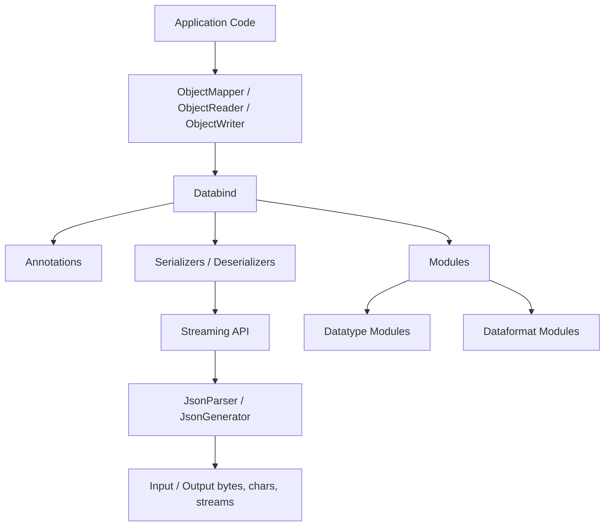
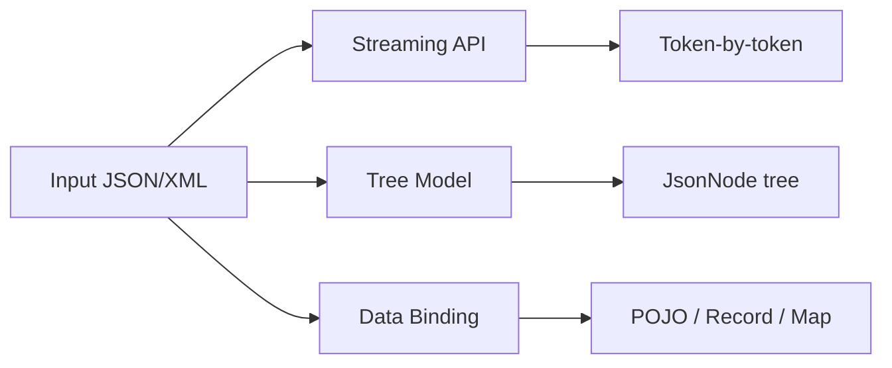
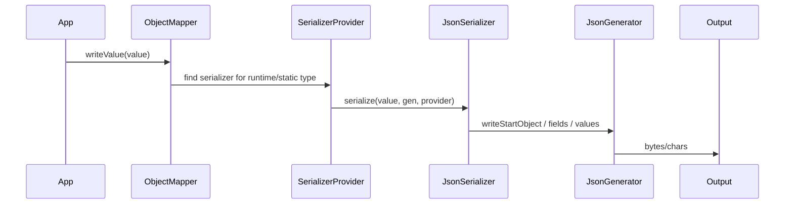
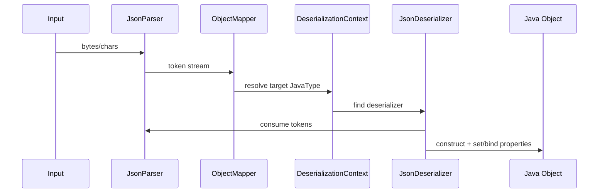
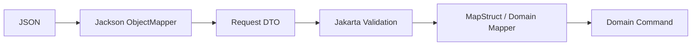
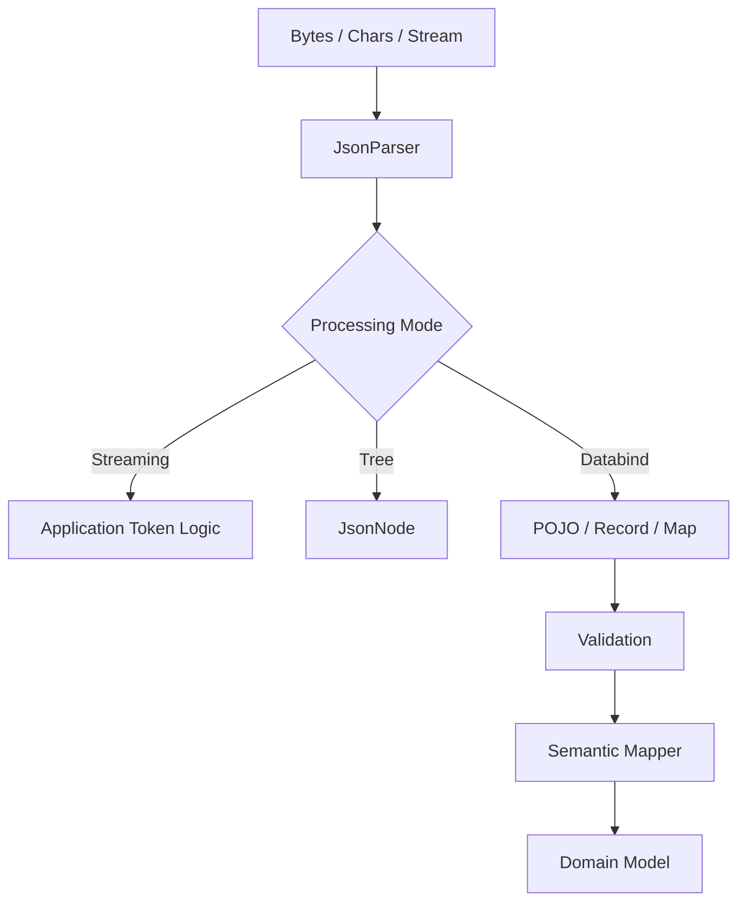

------
title: Learn Java Data Mapper, JSON/XML Processing & Validation - Part 009
description: Jackson architecture deep dive: core, databind, annotations, modules, dataformats, streaming API, tree model, data binding, ObjectCodec, JsonFactory, serializer/deserializer pipeline, and production mental model.
series: learn-java-data-mapper-json-xml-validation
seriesTitle: Learn Java Data Mapper, JSON/XML Processing & Validation
order: 9
partTitle: Jackson Architecture
tags:
- java
- jackson
- json
- serialization
- deserialization
- objectmapper
- jackson-core
- jackson-databind
- jackson-annotations
- data-binding
- jsonnode
date: 2026-06-29
---

# Part 009 — Jackson Architecture

> **Target skill:** memahami Jackson sebagai data-processing platform, bukan sekadar `objectMapper.writeValueAsString()` dan `objectMapper.readValue()`.

Jackson sering terlihat sederhana:

```java
OrderResponse response = objectMapper.readValue(json, OrderResponse.class);
String output = objectMapper.writeValueAsString(response);
```

Namun di balik dua baris itu ada beberapa lapisan:

1. tokenization/parsing
2. tree model
3. data binding
4. annotation introspection
5. serializer/deserializer discovery
6. type resolution
7. module registration
8. feature configuration
9. dataformat abstraction
10. error reporting

Jika kita hanya tahu API permukaan, kita akan bingung saat menghadapi kasus seperti:

- field hilang tetapi tidak error
- enum unknown menyebabkan request gagal
- record tidak bisa dibuat karena constructor parameter tidak terbaca
- `LocalDateTime` keluar sebagai array/timestamp
- polymorphic deserialization menjadi celah security
- XML output tidak sesuai schema
- custom serializer bekerja di satu endpoint tetapi tidak di endpoint lain
- perubahan konfigurasi `ObjectMapper` merusak consumer lain

Part ini membangun mental model arsitektur Jackson agar bagian-bagian berikutnya bisa dipahami lebih tajam.

---

## 1. Kaufman Deconstruction

Mengikuti pendekatan Josh Kaufman, kita pecah skill “menguasai Jackson” menjadi subskill yang bisa dilatih:

| Subskill | Pertanyaan Praktis |
|---|---|
| Understand processing modes | Kapan memakai streaming, tree, atau databinding? |
| Understand component stack | Apa peran `jackson-core`, `jackson-databind`, `jackson-annotations`, module, dan dataformat? |
| Understand mapper pipeline | Bagaimana value Java berubah menjadi token JSON dan sebaliknya? |
| Understand configuration surface | Feature mana global, mana per-type, mana per-property? |
| Understand module mechanism | Kapan perlu module seperti Java Time, Parameter Names, JDK8, XML, YAML? |
| Understand extension points | Kapan memakai annotation, custom serializer/deserializer, mix-in, module, atau mapper wrapper? |
| Understand failure points | Error terjadi di parsing, binding, construction, validation, atau semantic mapping? |
| Understand contract impact | Bagaimana konfigurasi Jackson memengaruhi backward/forward compatibility? |

Latihan cepat:

1. Deserialize JSON menjadi POJO.
2. Deserialize JSON yang sama menjadi `JsonNode`.
3. Parse JSON yang sama token-by-token dengan `JsonParser`.
4. Serialize object dengan default config.
5. Ubah naming strategy, inclusion, enum strategy, dan unknown property behavior.
6. Catat perubahan output dan error.

Tujuannya bukan hafal semua fitur. Tujuannya adalah tahu **di layer mana masalah harus diselesaikan**.

---

## 2. Jackson as a Data Processing Stack

Jackson bukan satu library monolitik. Ia adalah keluarga komponen.



Mental model:

| Layer | Responsibility |
|---|---|
| Application DTO/domain | Shape dan semantic data di Java |
| ObjectMapper | Entry point konfigurasi dan orchestrator |
| Databind | Mapping Java object ↔ structured data |
| Annotations | Metadata local untuk property/type/creator |
| Modules | Registrasi serializer/deserializer/introspector/type handler |
| Streaming API | Token-level read/write |
| Dataformat | JSON/XML/YAML/CBOR/Smile/CSV/etc. encoding rules |

Jackson Databind bukan parser JSON low-level; ia dibangun di atas streaming parser/generator. Tree model juga berada di databind dan menggunakan `JsonNode` sebagai representasi general-purpose.

---

## 3. The Three Jackson Modes

Jackson punya tiga mode pemrosesan utama.



### 3.1 Streaming API

Streaming API membaca/menulis token satu per satu.

Contoh token JSON:

```json
{
  "id": "ORD-1",
  "amount": 100
}
```

Token stream konseptual:

```txt
START_OBJECT
FIELD_NAME id
VALUE_STRING ORD-1
FIELD_NAME amount
VALUE_NUMBER_INT 100
END_OBJECT
```

Streaming cocok untuk:

- payload sangat besar
- proses incremental
- low memory processing
- transformasi file besar
- ingestion pipeline
- custom high-performance parser/writer

Trade-off:

- kode lebih verbose
- developer harus menjaga state parser
- lebih mudah salah jika struktur kompleks
- kurang ergonomic untuk business DTO biasa

### 3.2 Tree Model

Tree model membaca payload menjadi `JsonNode`.

```java
JsonNode root = objectMapper.readTree(json);
String id = root.path("id").asText();
BigDecimal amount = root.path("amount").decimalValue();
```

Tree cocok untuk:

- payload dinamis
- partial read
- feature flags/config
- event envelope dengan payload bervariasi
- JSON Patch-like processing
- validation/pre-processing sebelum binding
- preserving unknown fields

Trade-off:

- bukan type-safe sepenuhnya
- memory lebih besar daripada streaming
- semantic validation harus ditulis eksplisit
- mudah berubah menjadi “Map of anything” tanpa discipline

### 3.3 Data Binding

Data binding membaca payload menjadi Java type.

```java
OrderRequest request = objectMapper.readValue(json, OrderRequest.class);
```

Cocok untuk:

- API request/response
- event payload stabil
- config typed
- DTO yang contract-nya jelas
- object-to-object conversion via `convertValue` dengan hati-hati

Trade-off:

- bergantung pada shape Java
- constructor/record/builder harus benar
- konfigurasi global bisa mengubah behavior luas
- hidden coercion bisa terjadi jika tidak dikontrol

---

## 4. Choosing the Right Processing Mode

| Scenario | Best Default |
|---|---|
| Normal REST request/response DTO | Data binding |
| Event envelope dengan `payload` bervariasi | Tree + selective binding |
| File JSON ratusan MB | Streaming |
| Need preserve unknown fields | Tree or `@JsonAnySetter` |
| Need strict typed contract | Data binding + validation |
| Need partial extraction | Tree or streaming |
| Need custom protocol transformation | Streaming or tree |
| Need inspect before deciding target type | Tree, then bind subtree |

Rule praktis:

> Gunakan data binding untuk shape stabil, tree untuk shape dinamis, streaming untuk volume besar.

---

## 5. Main Components

### 5.1 `jackson-core`

`jackson-core` menyediakan low-level streaming API:

- `JsonFactory`
- `JsonParser`
- `JsonGenerator`
- token model
- low-level read/write mechanics

Ia tidak bergantung pada POJO mapping.

Contoh:

```java
JsonFactory factory = JsonFactory.builder().build();

try (JsonParser parser = factory.createParser(json)) {
    while (parser.nextToken() != null) {
        JsonToken token = parser.currentToken();
        // handle token
    }
}
```

### 5.2 `jackson-annotations`

`jackson-annotations` menyediakan metadata seperti:

- `@JsonProperty`
- `@JsonCreator`
- `@JsonIgnore`
- `@JsonInclude`
- `@JsonAlias`
- `@JsonFormat`
- `@JsonTypeInfo`
- `@JsonSubTypes`
- `@JsonValue`

Annotation bukan logic. Ia adalah metadata yang dibaca oleh databind.

### 5.3 `jackson-databind`

`jackson-databind` menyediakan:

- `ObjectMapper`
- `ObjectReader`
- `ObjectWriter`
- `JsonNode`
- serializers/deserializers
- Java type resolution
- bean introspection
- annotation interpretation
- module integration

Ini layer yang paling sering dipakai application code.

### 5.4 Datatype Modules

Datatype module menambah dukungan untuk tipe Java tertentu.

Contoh umum:

- Java Time module untuk `java.time.*`
- JDK8 module untuk tipe seperti `Optional`
- Parameter names module untuk constructor parameter names
- module untuk collection/library tertentu

### 5.5 Dataformat Modules

Jackson tidak hanya JSON. Ada module dataformat untuk format lain seperti XML, YAML, CBOR, Smile, CSV, TOML, dan lainnya.

Mental model penting:

> Databind mencoba memberi model mapping yang mirip, tetapi setiap dataformat punya semantic sendiri.

JSON object tidak sama dengan XML element/attribute/namespace. Jangan memaksa XML seperti JSON jika schema XML punya aturan berbeda.

---

## 6. `ObjectMapper` as Orchestrator

`ObjectMapper` adalah orchestrator untuk read/write.

```java
ObjectMapper mapper = JsonMapper.builder()
    .findAndAddModules()
    .build();
```

Ia memegang konfigurasi untuk:

- serialization features
- deserialization features
- mapper features
- parser/generator features
- naming strategy
- inclusion policy
- visibility
- annotation introspector
- modules
- subtype resolver
- serializer/deserializer provider
- type factory

Tetapi di production, `ObjectMapper` sebaiknya diperlakukan sebagai **infrastructure component**, bukan utility random.

Buruk:

```java
public String toJson(Object value) throws JsonProcessingException {
    ObjectMapper mapper = new ObjectMapper();
    mapper.findAndRegisterModules();
    return mapper.writeValueAsString(value);
}
```

Masalah:

- konfigurasi tidak konsisten
- module registration berulang
- performance buruk
- behavior beda antar callsite
- sulit diaudit
- sulit dites

Lebih baik:

```java
public final class JsonCodec {
    private final ObjectMapper mapper;

    public JsonCodec(ObjectMapper mapper) {
        this.mapper = mapper;
    }

    public String write(Object value) {
        try {
            return mapper.writeValueAsString(value);
        } catch (JsonProcessingException e) {
            throw new JsonEncodingException("Failed to encode JSON", e);
        }
    }
}
```

---

## 7. `ObjectReader` and `ObjectWriter`

`ObjectReader` dan `ObjectWriter` adalah immutable, reusable, pre-configured read/write views.

```java
ObjectReader orderReader = mapper.readerFor(OrderRequest.class);
ObjectWriter prettyWriter = mapper.writerWithDefaultPrettyPrinter();
```

Gunakan saat:

- type target sering dipakai
- butuh konfigurasi per use-case
- ingin menghindari mutate mapper global
- ingin membuat codec lebih eksplisit

Contoh:

```java
public final class OrderJsonCodec {
    private final ObjectReader requestReader;
    private final ObjectWriter responseWriter;

    public OrderJsonCodec(ObjectMapper mapper) {
        this.requestReader = mapper.readerFor(OrderRequest.class);
        this.responseWriter = mapper.writerFor(OrderResponse.class);
    }

    public OrderRequest readRequest(String json) throws IOException {
        return requestReader.readValue(json);
    }

    public String writeResponse(OrderResponse response) throws JsonProcessingException {
        return responseWriter.writeValueAsString(response);
    }
}
```

This reduces accidental global behavior changes.

---

## 8. The Serialization Pipeline

Serialization: Java object → output tokens.



Key questions during serialization:

| Question | Example |
|---|---|
| What is the type? | `OrderResponse`, `List<OrderResponse>`, generic type |
| What properties are visible? | getters, fields, records, annotations |
| What names are used? | `orderId` vs `order_id` |
| Which values are included? | null, empty, default |
| How are dates formatted? | ISO string vs timestamp |
| How are enums formatted? | name, code, object |
| Are custom serializers registered? | money, id, domain code |

---

## 9. The Deserialization Pipeline

Deserialization: input tokens → Java object.



Key questions:

| Question | Example |
|---|---|
| How is target type known? | `OrderRequest.class`, `TypeReference<List<OrderRequest>>` |
| How is object constructed? | no-arg constructor, canonical record constructor, `@JsonCreator`, builder |
| How are fields matched? | property name, alias, naming strategy |
| What about missing fields? | default Java value, null, constructor failure, validation later |
| What about unknown fields? | ignore, fail, capture |
| What about type mismatch? | coercion, failure, custom conversion |
| What about polymorphism? | type discriminator, registered subtype, custom resolver |

---

## 10. Type Resolution and Generics

Java erases generic type at runtime. Jackson needs explicit type information for generic containers.

Bad:

```java
List<OrderRequest> orders = objectMapper.readValue(json, List.class);
```

This yields `List<LinkedHashMap>`.

Better:

```java
List<OrderRequest> orders = objectMapper.readValue(
    json,
    new TypeReference<List<OrderRequest>>() {}
);
```

Or:

```java
JavaType type = objectMapper.getTypeFactory()
    .constructCollectionType(List.class, OrderRequest.class);

List<OrderRequest> orders = objectMapper.readValue(json, type);
```

For production codec, hide this in a typed reader:

```java
public final class OrderBatchCodec {
    private final ObjectReader reader;

    public OrderBatchCodec(ObjectMapper mapper) {
        JavaType type = mapper.getTypeFactory()
            .constructCollectionType(List.class, OrderRequest.class);
        this.reader = mapper.readerFor(type);
    }

    public List<OrderRequest> read(String json) throws IOException {
        return reader.readValue(json);
    }
}
```

---

## 11. Bean Introspection

Jackson must decide what counts as a property.

Possible sources:

- public getters
- setters
- fields
- constructor parameters
- record components
- builder methods
- annotations
- visibility configuration

Example:

```java
public record CustomerResponse(
    String customerId,
    String displayName
) {}
```

For records, the canonical constructor and components define the shape.

For mutable bean:

```java
public class CustomerResponse {
    private String customerId;
    private String displayName;

    public String getCustomerId() { return customerId; }
    public void setCustomerId(String customerId) { this.customerId = customerId; }
}
```

Property shape emerges from methods and fields.

Danger:

```java
public boolean isInternalRiskFlag() {
    return true;
}
```

A getter-like method can become a serialized property unless ignored/configured.

This is why output DTOs are safer than serializing rich domain objects.

---

## 12. Annotation Introspection

Annotations override or enrich introspection.

```java
public record CustomerResponse(
    @JsonProperty("customer_id")
    String customerId,

    @JsonInclude(JsonInclude.Include.NON_NULL)
    String displayName
) {}
```

Annotation effects can be local and explicit, but overuse creates fragmented configuration.

Use annotations when:

- property contract truly belongs to this DTO
- field has stable wire name
- one-off alias/format is local
- class is boundary-specific

Prefer global/module config when:

- convention applies across service
- date/time format is platform-wide
- naming strategy is standard
- all enums follow same pattern

Avoid putting boundary annotations on deep domain entities if the same entity is used in multiple contexts.

---

## 13. Modules as Extension Mechanism

A module can register:

- serializers
- deserializers
- key serializers/deserializers
- bean serializer modifiers
- value instantiators
- abstract type mappings
- subtype registrations

Example custom module:

```java
public final class DomainJsonModule extends SimpleModule {
    public DomainJsonModule() {
        super("DomainJsonModule");
        addSerializer(Money.class, new MoneySerializer());
        addDeserializer(Money.class, new MoneyDeserializer());
    }
}
```

Register:

```java
ObjectMapper mapper = JsonMapper.builder()
    .addModule(new JavaTimeModule())
    .addModule(new DomainJsonModule())
    .build();
```

Module is useful when behavior is type-level and repeated.

Do not create a module for every endpoint-specific output shape. Use DTOs for shape; use modules for type behavior.

---

## 14. Dataformat Abstraction

Jackson data binding can target more than JSON:

```java
XmlMapper xmlMapper = XmlMapper.builder()
    .findAndAddModules()
    .build();
```

But do not assume perfect equivalence.

| Concept | JSON | XML |
|---|---|---|
| object field | property | element or attribute |
| array | array | repeated element/wrapper |
| null | explicit `null` or absence | absence, empty element, nil depending schema |
| name | property name | element/attribute name + namespace |
| schema | optional JSON Schema/OpenAPI | XSD often strict |
| mixed content | uncommon | native XML feature |

Jackson XML is convenient for XML-ish payloads, but for schema-heavy enterprise XML, JAXB/Jakarta XML Binding may be more appropriate.

---

## 15. Error Categories in Jackson

Do not treat every `JsonProcessingException` as same.

| Error Type | Example | Layer |
|---|---|---|
| malformed input | invalid JSON syntax | parser |
| unknown property | extra field with strict config | databind config |
| missing creator property | record constructor required value absent | construction |
| invalid type | string where object expected | deserializer |
| invalid enum | unknown enum code | deserializer/conversion |
| invalid date format | wrong timestamp format | deserializer/module |
| custom error | domain-specific deserializer rejects | custom codec |

Application error design should map these into stable API error categories.

Example:

```java
try {
    return reader.readValue(json);
} catch (MismatchedInputException e) {
    throw new InvalidPayloadException("INVALID_JSON_SHAPE", e.getPathReference(), e);
} catch (JsonParseException e) {
    throw new InvalidPayloadException("MALFORMED_JSON", null, e);
}
```

Do not leak raw internal class names to API consumers.

---

## 16. Polymorphism Architecture Preview

Jackson can deserialize subtype hierarchies.

```java
@JsonTypeInfo(use = JsonTypeInfo.Id.NAME, property = "type")
@JsonSubTypes({
    @JsonSubTypes.Type(value = CardPayment.class, name = "CARD"),
    @JsonSubTypes.Type(value = BankTransferPayment.class, name = "BANK_TRANSFER")
})
public sealed interface PaymentMethod permits CardPayment, BankTransferPayment {}
```

This is powerful, but risky if type ids map to arbitrary classes.

Production rule:

> Polymorphism across external boundary must use explicit, allowlisted, semantic type ids.

Do not accept arbitrary Java class names from untrusted payloads.

Detailed treatment appears in Part 015.

---

## 17. ObjectMapper vs Domain Mapper

`ObjectMapper` is a serialization/binding tool.

MapStruct/domain mappers are semantic transformation tools.

Do not confuse them.



Jackson answers:

> “Can this structured data be represented as this Java DTO?”

MapStruct/domain mapper answers:

> “How does this boundary model become a domain model?”

Validation answers:

> “Is this value allowed by the contract/invariant?”

Keeping these concerns separate prevents accidental business logic in deserializers.

---

## 18. `convertValue`: Useful but Dangerous

Jackson can convert between Java objects through its data binding machinery.

```java
TargetDto target = objectMapper.convertValue(source, TargetDto.class);
```

This can be useful for:

- test fixture conversion
- Map-like dynamic data
- simple shape transformations
- adapter layer when semantic mapping is trivial

But avoid it as a replacement for MapStruct/domain mapping when:

- field names differ semantically
- conversion policy matters
- null/absence/default distinction matters
- enums differ by business meaning
- nested object graph needs projection
- auditability matters

`convertValue` is structural. It is not a semantic mapper.

---

## 19. Architecture Pattern: JSON Codec Per Boundary

Instead of spreading raw `ObjectMapper` calls everywhere, create boundary-specific codecs.

```java
public interface JsonCodec<T> {
    T read(String json);
    String write(T value);
}
```

```java
public final class OrderSubmittedEventCodec implements JsonCodec<OrderSubmittedEvent> {
    private final ObjectReader reader;
    private final ObjectWriter writer;

    public OrderSubmittedEventCodec(ObjectMapper mapper) {
        this.reader = mapper.readerFor(OrderSubmittedEvent.class);
        this.writer = mapper.writerFor(OrderSubmittedEvent.class);
    }

    @Override
    public OrderSubmittedEvent read(String json) {
        try {
            return reader.readValue(json);
        } catch (IOException e) {
            throw new InvalidEventPayloadException("ORDER_SUBMITTED_INVALID_JSON", e);
        }
    }

    @Override
    public String write(OrderSubmittedEvent value) {
        try {
            return writer.writeValueAsString(value);
        } catch (JsonProcessingException e) {
            throw new EventEncodingException("ORDER_SUBMITTED_ENCODING_FAILED", e);
        }
    }
}
```

Benefits:

- type is explicit
- error code is explicit
- ObjectReader/ObjectWriter reused
- tests target contract
- global mapper remains stable

---

## 20. Architecture Pattern: Envelope + Payload

For event systems:

```json
{
  "eventId": "EVT-001",
  "eventType": "ORDER_SUBMITTED",
  "schemaVersion": 3,
  "occurredAt": "2026-06-29T03:00:00Z",
  "payload": {
    "orderId": "ORD-1",
    "customerId": "CUS-1"
  }
}
```

Possible Java model:

```java
public record EventEnvelope(
    String eventId,
    String eventType,
    int schemaVersion,
    Instant occurredAt,
    JsonNode payload
) {}
```

Then bind payload selectively:

```java
OrderSubmittedPayload payload = objectMapper.treeToValue(
    envelope.payload(),
    OrderSubmittedPayload.class
);
```

This combines tree model and data binding intentionally.

---

## 21. Jackson 2.x and 3.x Awareness

Jackson 3 is a major version and not API-compatible with 2.x. Migration planning matters for platform libraries, shared starters, framework upgrades, and generated/configured mappers.

Do not hardcode learning only around one version if you are designing long-lived platform code.

Practical guidance:

- isolate `ObjectMapper` configuration
- minimize custom internals relying on non-public APIs
- prefer stable public extension points
- have contract tests for JSON shape
- avoid relying on accidental default behavior
- version shared JSON modules carefully

Detailed migration treatment appears in Part 017.

---

## 22. Testing Jackson Architecture

### 22.1 Contract Fixture Tests

```java
@Test
void orderResponse_serializesToExpectedShape() throws Exception {
    OrderResponse response = new OrderResponse("ORD-1", "APPROVED");

    String json = objectMapper.writeValueAsString(response);

    assertThatJson(json).isEqualTo("""
        {
          "orderId": "ORD-1",
          "status": "APPROVED"
        }
        """);
}
```

### 22.2 Strict Deserialization Tests

```java
@Test
void orderRequest_rejectsUnknownField() {
    String json = """
        {
          "orderId": "ORD-1",
          "unexpected": true
        }
        """;

    assertThatThrownBy(() -> objectMapper.readValue(json, OrderRequest.class))
        .isInstanceOf(UnrecognizedPropertyException.class);
}
```

### 22.3 Generic Type Tests

```java
@Test
void orderList_deserializesWithElementType() throws Exception {
    String json = "[{\"orderId\":\"ORD-1\"}]";

    List<OrderRequest> orders = objectMapper.readValue(
        json,
        new TypeReference<List<OrderRequest>>() {}
    );

    assertThat(orders.getFirst()).isInstanceOf(OrderRequest.class);
}
```

### 22.4 Module Registration Tests

```java
@Test
void mapper_supportsJavaTimeIsoString() throws Exception {
    Event event = new Event(Instant.parse("2026-06-29T03:00:00Z"));

    String json = objectMapper.writeValueAsString(event);

    assertThat(json).contains("2026-06-29T03:00:00Z");
}
```

---

## 23. Production Checklist

Before approving Jackson usage:

- [ ] Is this streaming, tree, or data binding problem?
- [ ] Is `ObjectMapper` centrally configured?
- [ ] Are modules explicit and tested?
- [ ] Are generic types handled with `TypeReference` or `JavaType`?
- [ ] Are DTOs used instead of serializing internal graph?
- [ ] Are unknown fields handled according to boundary policy?
- [ ] Are date/time types serialized in contract-defined format?
- [ ] Are enum conversion rules explicit?
- [ ] Are custom serializers/deserializers limited and tested?
- [ ] Are polymorphic types allowlisted?
- [ ] Are error categories mapped cleanly?
- [ ] Are contract fixtures stored?
- [ ] Is Jackson 2/3 compatibility risk understood?

---

## 24. Mental Model Summary

Jackson architecture can be summarized as:



The key lesson:

> Jackson is not your domain mapper. Jackson is your structured-data binding engine.

Use it deliberately:

1. Use streaming for very large/incremental data.
2. Use tree for dynamic or partially known data.
3. Use data binding for stable contracts.
4. Use modules for type behavior.
5. Use DTOs for boundary shape.
6. Use validation for constraints.
7. Use MapStruct/domain mappers for semantic transformation.
8. Use contract tests to lock behavior.

Next part focuses on `ObjectMapper` in production: lifecycle, thread-safety assumptions, configuration strategy, profiles, strictness, modules, and governance.

---

## References

- FasterXML Jackson main repository: https://github.com/FasterXML/jackson
- FasterXML Jackson Databind repository: https://github.com/FasterXML/jackson-databind
- Jackson `ObjectMapper` Javadoc: https://javadoc.io/doc/com.fasterxml.jackson.core/jackson-databind/latest/com/fasterxml/jackson/databind/ObjectMapper.html
- Jackson 3.0 release notes: https://github.com/FasterXML/jackson/wiki/Jackson-Release-3.0
- Jackson 2.x to 3.x migration guide: https://github.com/FasterXML/jackson/blob/main/jackson3/MIGRATING_TO_JACKSON_3.md
