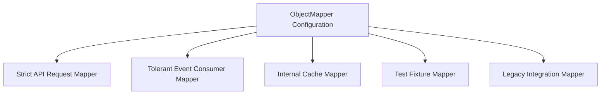

------
title: Learn Java Data Mapper, JSON/XML Processing & Validation - Part 010
description: ObjectMapper production configuration: lifecycle, thread safety, immutable readers/writers, module strategy, strict/tolerant profiles, naming, date-time, enum, unknown fields, coercion, security, performance, and governance.
series: learn-java-data-mapper-json-xml-validation
seriesTitle: Learn Java Data Mapper, JSON/XML Processing & Validation
order: 10
partTitle: ObjectMapper Production Configuration
tags:
- java
- jackson
- objectmapper
- json
- production
- configuration
- serialization
- deserialization
- contract
- api-design
date: 2026-06-29
---

# Part 010 — ObjectMapper in Production

> **Target skill:** mampu mendesain konfigurasi `ObjectMapper` yang stabil, reusable, aman, testable, dan sesuai contract boundary.

`ObjectMapper` adalah salah satu dependency kecil yang bisa memberi dampak besar.

Satu perubahan seperti:

```java
mapper.configure(DeserializationFeature.FAIL_ON_UNKNOWN_PROPERTIES, false);
```

bisa membuat API yang sebelumnya strict menjadi tolerant.

Satu perubahan seperti:

```java
mapper.setSerializationInclusion(JsonInclude.Include.NON_NULL);
```

bisa mengubah field presence di semua response.

Satu perubahan seperti:

```java
mapper.enable(SerializationFeature.WRITE_DATES_AS_TIMESTAMPS);
```

bisa mengubah timestamp dari ISO string menjadi number/array.

Part ini membahas `ObjectMapper` sebagai **platform configuration**, bukan utility object.

---

## 1. Kaufman Deconstruction

Subskill yang perlu dikuasai:

| Subskill | Output Praktis |
|---|---|
| Lifecycle discipline | Mapper dibuat, dikonfigurasi, lalu dipakai tanpa dimutasi sembarangan |
| Profile design | Strict request mapper, tolerant event mapper, internal mapper, test mapper |
| Module strategy | Java Time, domain module, XML/dataformat module, custom module |
| Feature policy | Unknown fields, nulls, coercion, enum, date/time, inclusion, naming |
| Reader/writer usage | Per-boundary `ObjectReader` / `ObjectWriter` immutable |
| Compatibility testing | Fixture tests menangkap perubahan output/input |
| Security hardening | Polymorphism, unknown type, large payload, unsafe default typing |
| Governance | Config review, versioning, shared starter, migration policy |

Tujuan latihan:

1. Buat satu mapper strict.
2. Buat satu mapper tolerant untuk event consumer.
3. Buat codec per boundary memakai `ObjectReader`/`ObjectWriter`.
4. Tambahkan fixture test.
5. Ubah satu feature dan lihat test mana yang gagal.

---

## 2. Production Rule: Configure Once, Then Reuse

`ObjectMapper` instances dirancang untuk reusable dan thread-safe jika semua konfigurasi diselesaikan sebelum operasi read/write. Karena itu, pattern production yang baik adalah:

```java
public final class JsonMapperFactory {
    private JsonMapperFactory() {}

    public static ObjectMapper createStrictApiMapper() {
        return JsonMapper.builder()
            .addModule(new JavaTimeModule())
            .disable(SerializationFeature.WRITE_DATES_AS_TIMESTAMPS)
            .enable(DeserializationFeature.FAIL_ON_UNKNOWN_PROPERTIES)
            .build();
    }
}
```

Kemudian inject mapper tersebut.

Buruk:

```java
objectMapper.configure(DeserializationFeature.FAIL_ON_UNKNOWN_PROPERTIES, false);
return objectMapper.readValue(json, SomeType.class);
```

Masalahnya bukan hanya thread-safety. Masalahnya adalah **semantic drift**: behavior mapper berubah berdasarkan callsite terakhir.

---

## 3. ObjectMapper as Infrastructure, Not Utility

Hindari:

```java
public final class JsonUtils {
    public static String toJson(Object value) {
        try {
            return new ObjectMapper().writeValueAsString(value);
        } catch (JsonProcessingException e) {
            throw new RuntimeException(e);
        }
    }
}
```

Lebih baik:

```java
public final class JsonCodec {
    private final ObjectMapper mapper;

    public JsonCodec(ObjectMapper mapper) {
        this.mapper = mapper;
    }

    public String write(Object value) {
        try {
            return mapper.writeValueAsString(value);
        } catch (JsonProcessingException e) {
            throw new JsonWriteException("JSON_WRITE_FAILED", e);
        }
    }
}
```

Lebih baik lagi untuk boundary penting:

```java
public final class PaymentRequestCodec {
    private final ObjectReader reader;
    private final ObjectWriter writer;

    public PaymentRequestCodec(ObjectMapper mapper) {
        this.reader = mapper.readerFor(CreatePaymentRequest.class);
        this.writer = mapper.writerFor(CreatePaymentRequest.class);
    }

    public CreatePaymentRequest read(String json) {
        try {
            return reader.readValue(json);
        } catch (IOException e) {
            throw new InvalidPayloadException("CREATE_PAYMENT_INVALID_JSON", e);
        }
    }

    public String write(CreatePaymentRequest request) {
        try {
            return writer.writeValueAsString(request);
        } catch (JsonProcessingException e) {
            throw new JsonWriteException("CREATE_PAYMENT_WRITE_FAILED", e);
        }
    }
}
```

---

## 4. Mapper Profiles

Satu mapper global untuk semua kebutuhan sering terlalu kasar.

Gunakan profile berdasarkan boundary.



### 4.1 Strict API Request Mapper

Cocok untuk command/request yang dikirim client internal atau public API yang contract-nya jelas.

Policy:

- fail on unknown properties
- reject ambiguous coercion
- ISO date/time
- explicit enum handling
- stable error mapping

Example:

```java
public static ObjectMapper strictApiMapper() {
    return JsonMapper.builder()
        .addModule(new JavaTimeModule())
        .disable(SerializationFeature.WRITE_DATES_AS_TIMESTAMPS)
        .enable(DeserializationFeature.FAIL_ON_UNKNOWN_PROPERTIES)
        .enable(DeserializationFeature.FAIL_ON_NULL_FOR_PRIMITIVES)
        .build();
}
```

### 4.2 Tolerant Event Consumer Mapper

Cocok untuk event dari producer yang evolve forward-compatible.

Policy:

- ignore or capture unknown fields
- tolerate new optional fields
- preserve raw payload if needed
- unknown enum strategy deliberate
- schema version considered

Example:

```java
public static ObjectMapper tolerantEventMapper() {
    return JsonMapper.builder()
        .addModule(new JavaTimeModule())
        .disable(SerializationFeature.WRITE_DATES_AS_TIMESTAMPS)
        .disable(DeserializationFeature.FAIL_ON_UNKNOWN_PROPERTIES)
        .build();
}
```

Tetapi jangan otomatis tolerant untuk semua event. Jika event adalah internal command-like message, strict bisa lebih aman.

### 4.3 Legacy Integration Mapper

Cocok untuk partner/provider lama.

Policy:

- special date format
- case-insensitive enum maybe
- custom boolean code
- XML/CSV/dataformat-specific mapping
- raw field preservation

Keep it isolated.

---

## 5. Unknown Property Policy

Unknown property adalah compatibility decision.

```json
{
  "orderId": "ORD-1",
  "status": "APPROVED",
  "newField": true
}
```

### 5.1 Fail Unknown

Good for:

- command input
- security-sensitive endpoint
- public API with strict contract
- admin action
- financial/regulatory mutation

```java
JsonMapper.builder()
    .enable(DeserializationFeature.FAIL_ON_UNKNOWN_PROPERTIES)
    .build();
```

Benefit:

- catches typo
- catches wrong client version
- avoids false assumption that field was processed

Cost:

- less forward-compatible
- adding fields can break old consumers if used on consumer side

### 5.2 Ignore Unknown

Good for:

- event consumer
- read model ingestion
- external provider payload where you only need subset

```java
@JsonIgnoreProperties(ignoreUnknown = true)
public record ProviderEvent(
    String eventId,
    String eventType
) {}
```

Cost:

- typo can be silently ignored
- consumer may think data was used
- hard to debug missing behavior

### 5.3 Capture Unknown

Best for audit/forward compatibility when unknown data matters.

```java
public final class ProviderEvent {
    private String eventId;
    private String eventType;
    private final Map<String, JsonNode> extensions = new LinkedHashMap<>();

    @JsonAnySetter
    public void extension(String name, JsonNode value) {
        extensions.put(name, value);
    }

    @JsonAnyGetter
    public Map<String, JsonNode> extensions() {
        return extensions;
    }
}
```

---

## 6. Null and Inclusion Policy

Serialization inclusion controls what gets written.

```java
@JsonInclude(JsonInclude.Include.NON_NULL)
public record CustomerResponse(
    String customerId,
    String displayName,
    String email
) {}
```

Global inclusion can be dangerous.

```java
mapper.setSerializationInclusion(JsonInclude.Include.NON_NULL);
```

If applied globally, response shape changes across all DTOs.

### 6.1 Decision Matrix

| Policy | Meaning | Risk |
|---|---|---|
| include nulls | explicit field is known but null | verbose, can expose nullable contract |
| omit nulls | absence means null/not available | ambiguity between absent and null |
| omit empty | hides empty list/string/map | consumer may not distinguish empty vs absent |
| per-field include | most explicit | more annotations |

For stable contracts, prefer per-DTO/per-field policy over sweeping global policy unless your platform standard is explicit.

---

## 7. Date-Time Policy

For modern Java, configure Java Time explicitly.

```java
ObjectMapper mapper = JsonMapper.builder()
    .addModule(new JavaTimeModule())
    .disable(SerializationFeature.WRITE_DATES_AS_TIMESTAMPS)
    .build();
```

Recommended boundary formats:

| Semantic | Java Type | Wire Format |
|---|---|---|
| event/audit timestamp | `Instant` | ISO instant, e.g. `2026-06-29T03:00:00Z` |
| provider timestamp with offset | `OffsetDateTime` | ISO offset date-time |
| business date | `LocalDate` | `YYYY-MM-DD` |
| billing period | `YearMonth` | `YYYY-MM` or explicit object |
| duration | `Duration` | ISO-8601 duration or numeric seconds by contract |

Do not leave timestamp shape to framework default.

---

## 8. Enum Policy

Default enum serialization often uses enum name.

```java
public enum PaymentStatus {
    WAITING_FOR_CUSTOMER,
    PAID,
    FAILED
}
```

Output:

```json
"WAITING_FOR_CUSTOMER"
```

This couples Java constant name to external contract.

For external stable code:

```java
public enum PaymentStatus {
    WAITING_FOR_CUSTOMER("WAITING"),
    PAID("PAID"),
    FAILED("FAILED");

    private final String code;

    PaymentStatus(String code) {
        this.code = code;
    }

    @JsonValue
    public String code() {
        return code;
    }

    @JsonCreator
    public static PaymentStatus fromCode(String raw) {
        if (raw == null) return null;
        return switch (raw.trim().toUpperCase(Locale.ROOT)) {
            case "WAITING" -> WAITING_FOR_CUSTOMER;
            case "PAID" -> PAID;
            case "FAILED" -> FAILED;
            default -> throw new IllegalArgumentException("Unknown payment status: " + raw);
        };
    }
}
```

### 8.1 Unknown Enum Decision

| Boundary | Recommended Default |
|---|---|
| create/update request | reject unknown |
| event consumer from evolving producer | preserve raw or map to explicit unknown |
| read response | only emit known contract values |
| legacy provider integration | normalize with explicit converter |

---

## 9. Naming Strategy

Global naming strategy:

```java
ObjectMapper mapper = JsonMapper.builder()
    .propertyNamingStrategy(PropertyNamingStrategies.SNAKE_CASE)
    .build();
```

This turns:

```java
customerId
```

into:

```json
customer_id
```

Useful when service standard is snake_case.

But beware:

- changing global naming strategy is breaking
- explicit `@JsonProperty` can override convention
- external legacy contracts may not follow global convention
- internal DTO and external DTO may require separate mapper/profile

For public API, make naming style part of contract governance.

---

## 10. Coercion Policy

Coercion means accepting one JSON type as another.

Examples:

```json
{ "quantity": "10" }
{ "active": "true" }
{ "tags": "single-tag" }
{ "amount": 100.0 }
```

These may or may not be allowed depending on configuration and target type.

Production guidance:

- strict for new APIs
- tolerant only for legacy/provider integration
- test coercion explicitly
- do not rely on accidental defaults

Example test:

```java
@Test
void quantity_rejectsStringWhenApiIsStrict() {
    String json = "{\"quantity\":\"10\"}";

    assertThatThrownBy(() -> mapper.readValue(json, CreateOrderRequest.class))
        .isInstanceOf(JsonMappingException.class);
}
```

If your platform allows numeric strings, document it as contract.

---

## 11. Primitive vs Wrapper Policy

Primitive fields default silently.

```java
public record CreateOrderRequest(
    int quantity,
    boolean expedited
) {}
```

If input omits both fields:

```json
{}
```

Java object can contain:

```txt
quantity = 0
expedited = false
```

This may hide absence.

For request DTOs, prefer wrappers with validation:

```java
public record CreateOrderRequest(
    @NotNull @Min(1) Integer quantity,
    @NotNull Boolean expedited
) {}
```

Use primitive in domain when default is meaningful and object cannot represent invalid absence.

---

## 12. Records, Constructors, and Creators

Records are excellent DTO candidates.

```java
public record CreateCustomerRequest(
    String customerId,
    String displayName
) {}
```

For custom construction:

```java
public record CustomerCode(String value) {
    @JsonCreator
    public CustomerCode {
        if (value == null || !value.matches("[A-Z0-9]{8}")) {
            throw new IllegalArgumentException("invalid customer code");
        }
    }

    @JsonValue
    public String value() {
        return value;
    }
}
```

Be careful not to overpack business validation into JSON creator if the type is used outside serialization. For value objects, constructor invariant is often good. For request-level policy, Jakarta Validation may be better.

---

## 13. Module Strategy

Recommended baseline for modern Java JSON mapper:

```java
public static ObjectMapper baselineMapper() {
    return JsonMapper.builder()
        .addModule(new JavaTimeModule())
        .disable(SerializationFeature.WRITE_DATES_AS_TIMESTAMPS)
        .build();
}
```

A richer platform mapper:

```java
public static ObjectMapper platformMapper() {
    return JsonMapper.builder()
        .addModule(new JavaTimeModule())
        .addModule(new DomainJsonModule())
        .disable(SerializationFeature.WRITE_DATES_AS_TIMESTAMPS)
        .enable(DeserializationFeature.FAIL_ON_UNKNOWN_PROPERTIES)
        .enable(DeserializationFeature.FAIL_ON_NULL_FOR_PRIMITIVES)
        .build();
}
```

Module guidelines:

| Module Type | Use For |
|---|---|
| Java/library datatype module | `java.time`, `Optional`, specialized collections |
| domain module | stable value objects such as Money, CustomerCode |
| integration module | provider-specific oddities |
| test module | test-only relaxed parsing or fixture behavior |

Keep provider-specific modules away from core platform mapper.

---

## 14. Custom Serializer/Deserializer Governance

Custom serializers/deserializers are powerful but increase maintenance cost.

Use when:

- value object has stable wire representation
- third-party type needs special handling
- legacy contract requires non-standard shape
- sensitive field needs controlled redaction
- performance requires specialized streaming

Avoid when:

- DTO projection would solve it
- MapStruct should perform semantic mapping
- validation should reject invalid value
- local annotation is enough

Example serializer for value object:

```java
public final class CustomerCodeSerializer extends JsonSerializer<CustomerCode> {
    @Override
    public void serialize(
        CustomerCode value,
        JsonGenerator gen,
        SerializerProvider serializers
    ) throws IOException {
        gen.writeString(value.value());
    }
}
```

Example deserializer:

```java
public final class CustomerCodeDeserializer extends JsonDeserializer<CustomerCode> {
    @Override
    public CustomerCode deserialize(
        JsonParser parser,
        DeserializationContext context
    ) throws IOException {
        return new CustomerCode(parser.getValueAsString());
    }
}
```

Register through module:

```java
public final class DomainJsonModule extends SimpleModule {
    public DomainJsonModule() {
        addSerializer(CustomerCode.class, new CustomerCodeSerializer());
        addDeserializer(CustomerCode.class, new CustomerCodeDeserializer());
    }
}
```

---

## 15. Security Hardening

### 15.1 Avoid Unsafe Default Typing

Do not accept arbitrary Java class names from untrusted payloads.

Bad pattern conceptually:

```json
{
  "@class": "some.runtime.ClassName",
  "value": "..."
}
```

Prefer explicit semantic discriminator:

```json
{
  "type": "CARD",
  "last4": "1234"
}
```

And allowlist known subtypes.

### 15.2 Limit Payload Size Outside ObjectMapper

`ObjectMapper` is not your only defense. Enforce:

- max request body size
- max file size
- stream processing for huge payload
- depth constraints where possible
- endpoint timeout
- rate limit

### 15.3 Redaction

Do not rely only on `@JsonIgnore` if object is reused in multiple contexts.

Use output DTOs:

```java
public record UserProfileResponse(
    String userId,
    String displayName
) {}
```

instead of serializing:

```java
class User {
    String passwordHash;
    String resetToken;
    String internalRiskFlag;
}
```

---

## 16. Performance Configuration

Important performance rules:

1. Reuse configured `ObjectMapper`.
2. Reuse `ObjectReader`/`ObjectWriter` for hot paths.
3. Avoid building mapper per request.
4. Use streaming for large payloads.
5. Avoid serializing large object graphs accidentally.
6. Measure before adding performance modules.
7. Keep payload shape small and purposeful.

Example hot-path writer:

```java
public final class AuditEventWriter {
    private final ObjectWriter writer;

    public AuditEventWriter(ObjectMapper mapper) {
        this.writer = mapper.writerFor(AuditEvent.class);
    }

    public byte[] writeBytes(AuditEvent event) {
        try {
            return writer.writeValueAsBytes(event);
        } catch (JsonProcessingException e) {
            throw new AuditEncodingException(e);
        }
    }
}
```

Performance starts with contract shape. A bad graph serialized efficiently is still a bad payload.

---

## 17. Framework Integration Strategy

In Spring-like environments, there is often an auto-configured `ObjectMapper`.

Production approach:

- know the framework defaults
- define application standard explicitly
- customize centrally
- avoid creating unmanaged mappers in random classes
- expose additional mappers only when profiles require it
- test actual mapper used by controllers/message converters

Bad:

```java
private final ObjectMapper mapper = new ObjectMapper();
```

inside a component when the application already has platform-configured mapper.

Better:

```java
public SomeAdapter(ObjectMapper objectMapper) {
    this.objectMapper = objectMapper;
}
```

But for legacy partner config, name it explicitly:

```java
public SomePartnerAdapter(@Qualifier("partnerLegacyObjectMapper") ObjectMapper mapper) {
    this.mapper = mapper;
}
```

---

## 18. Configuration Drift

Configuration drift happens when different parts of the code use different mappers unintentionally.

Symptoms:

- controller accepts payload that test mapper rejects
- Kafka consumer ignores fields but REST endpoint fails
- date format differs between services
- enum casing differs between tests and production
- local `new ObjectMapper()` fails on Java Time type

Controls:

| Control | Purpose |
|---|---|
| central factory/config | single source of truth |
| ban raw `new ObjectMapper()` | avoid unmanaged behavior |
| codec classes | boundary-level explicitness |
| fixture tests | catch output/input drift |
| architecture tests | enforce injection/factory usage |
| versioned shared module | consistent platform behavior |

---

## 19. Versioned Contract Mappers

For long-lived APIs/events, versioning sometimes needs mapper separation.

```java
public final class OrderEventV1Codec {
    private final ObjectReader reader;
    private final ObjectWriter writer;
}

public final class OrderEventV2Codec {
    private final ObjectReader reader;
    private final ObjectWriter writer;
}
```

Do not rely on one DTO with many optional fields forever.

If v1 and v2 have different field names, enum rules, or date format, explicit codecs are clearer.

---

## 20. Error Translation

Do not expose Jackson exception directly.

Example translator:

```java
public final class JsonErrorTranslator {
    public ApiError translate(JsonProcessingException exception) {
        if (exception instanceof JsonParseException) {
            return ApiError.badRequest("MALFORMED_JSON", "Request body is not valid JSON.");
        }
        if (exception instanceof UnrecognizedPropertyException e) {
            return ApiError.badRequest(
                "UNKNOWN_FIELD",
                "Unknown field: " + e.getPropertyName()
            );
        }
        if (exception instanceof MismatchedInputException e) {
            return ApiError.badRequest(
                "INVALID_JSON_SHAPE",
                "Invalid value at: " + e.getPathReference()
            );
        }
        return ApiError.badRequest("INVALID_JSON", "Request body is invalid.");
    }
}
```

For public APIs, keep messages stable and safe.

---

## 21. Testing ObjectMapper Configuration

### 21.1 Baseline Feature Test

```java
@Test
void apiMapper_rejectsUnknownProperties() {
    String json = """
        { "orderId": "ORD-1", "unknown": true }
        """;

    assertThatThrownBy(() -> apiMapper.readValue(json, OrderRequest.class))
        .isInstanceOf(UnrecognizedPropertyException.class);
}
```

### 21.2 Date-Time Test

```java
@Test
void apiMapper_writesInstantAsIsoString() throws Exception {
    AuditEvent event = new AuditEvent(Instant.parse("2026-06-29T03:00:00Z"));

    String json = apiMapper.writeValueAsString(event);

    assertThat(json).contains("2026-06-29T03:00:00Z");
}
```

### 21.3 Inclusion Test

```java
@Test
void response_includesOrOmitsNullAccordingToContract() throws Exception {
    CustomerResponse response = new CustomerResponse("CUS-1", null);

    String json = apiMapper.writeValueAsString(response);

    assertThatJson(json).isEqualTo("""
        {
          "customerId": "CUS-1",
          "displayName": null
        }
        """);
}
```

### 21.4 Enum Test

```java
@Test
void paymentStatus_usesExternalCode() throws Exception {
    String json = apiMapper.writeValueAsString(PaymentStatus.WAITING_FOR_CUSTOMER);

    assertThat(json).isEqualTo("\"WAITING\"");
}
```

### 21.5 Drift Test for Managed Mapper

```java
@Test
void noComponentCreatesRawObjectMapper() {
    // Use ArchUnit or similar architecture test in real project.
    // Rule: production code should not call new ObjectMapper() outside approved config package.
}
```

---

## 22. Recommended Baseline Configuration

For a strict modern JSON API baseline:

```java
public final class ApiObjectMapperConfig {
    private ApiObjectMapperConfig() {}

    public static ObjectMapper create() {
        return JsonMapper.builder()
            .addModule(new JavaTimeModule())
            .disable(SerializationFeature.WRITE_DATES_AS_TIMESTAMPS)
            .enable(DeserializationFeature.FAIL_ON_UNKNOWN_PROPERTIES)
            .enable(DeserializationFeature.FAIL_ON_NULL_FOR_PRIMITIVES)
            .build();
    }
}
```

Then add explicit policies as needed:

- naming strategy
- enum code strategy
- domain value object module
- inclusion standard
- coercion standard
- custom error translator

Do not blindly copy config from tutorials. Every feature is a contract decision.

---

## 23. Mapper Profile Example

```java
public final class ObjectMappers {
    private ObjectMappers() {}

    public static ObjectMapper strictApi() {
        return JsonMapper.builder()
            .addModule(new JavaTimeModule())
            .addModule(new DomainJsonModule())
            .disable(SerializationFeature.WRITE_DATES_AS_TIMESTAMPS)
            .enable(DeserializationFeature.FAIL_ON_UNKNOWN_PROPERTIES)
            .enable(DeserializationFeature.FAIL_ON_NULL_FOR_PRIMITIVES)
            .build();
    }

    public static ObjectMapper tolerantEvents() {
        return JsonMapper.builder()
            .addModule(new JavaTimeModule())
            .addModule(new DomainJsonModule())
            .disable(SerializationFeature.WRITE_DATES_AS_TIMESTAMPS)
            .disable(DeserializationFeature.FAIL_ON_UNKNOWN_PROPERTIES)
            .build();
    }

    public static ObjectMapper legacyPartner() {
        return JsonMapper.builder()
            .addModule(new JavaTimeModule())
            .addModule(new LegacyPartnerJsonModule())
            .disable(SerializationFeature.WRITE_DATES_AS_TIMESTAMPS)
            .disable(DeserializationFeature.FAIL_ON_UNKNOWN_PROPERTIES)
            .build();
    }
}
```

Notice: tolerant mapper is not “less correct”. It is correct for a different boundary.

---

## 24. Production Decision Matrix

| Decision | Strict API | Event Consumer | Legacy Partner |
|---|---|---|---|
| unknown fields | fail | ignore/capture | ignore/capture |
| unknown enum | reject | preserve/unknown | custom normalize |
| dates | ISO strict | ISO/versioned | provider format |
| coercion | minimal | controlled | often needed |
| nulls | explicit validation | tolerant if versioned | provider-specific |
| naming | platform standard | schema standard | partner standard |
| custom module | domain only | domain + event | partner module |
| error mapping | user-safe API errors | dead-letter/retry metadata | integration error category |

---

## 25. Anti-Patterns

### 25.1 Mapper Mutation Near Callsite

```java
mapper.disable(FAIL_ON_UNKNOWN_PROPERTIES);
return mapper.readValue(json, Type.class);
```

Use separate mapper or reader instead.

### 25.2 Raw `new ObjectMapper()` Everywhere

Creates inconsistent behavior.

### 25.3 Global Config for Local Problem

Do not change global inclusion/naming/coercion because one DTO needs special behavior.

### 25.4 Business Logic in Deserializer

Deserializer should parse/bind. Domain decisions belong in domain layer or explicit mapper/service.

### 25.5 Unreviewed Custom Modules

A module can change behavior for an entire type everywhere. Treat it as platform code.

### 25.6 Contract by Accident

If output shape is only tested manually, it is accidental.

---

## 26. Practice Drill

Design three mappers:

1. `strictApiMapper`
2. `tolerantEventMapper`
3. `legacyProviderMapper`

For this DTO:

```java
public record CustomerUpdateRequest(
    String customerId,
    String displayName,
    LocalDate birthDate,
    CustomerStatus status,
    Boolean marketingConsent
) {}
```

Write tests for:

- unknown field
- missing `marketingConsent`
- lowercase enum
- unknown enum
- date as ISO string
- date as numeric timestamp
- null primitive/wrapper behavior
- extra provider field captured or ignored

Then decide which behavior belongs to which boundary.

---

## 27. Master Checklist

Before shipping ObjectMapper config:

- [ ] Is mapper built once and reused?
- [ ] Is mutation after first use avoided?
- [ ] Are mapper profiles named by boundary?
- [ ] Are Java Time types tested?
- [ ] Are unknown property rules explicit?
- [ ] Are null inclusion rules explicit?
- [ ] Are enum rules explicit?
- [ ] Are coercion rules explicit?
- [ ] Are custom modules reviewed as platform behavior?
- [ ] Are framework auto-configured mappers aligned?
- [ ] Are `ObjectReader`/`ObjectWriter` used for hot/important boundaries?
- [ ] Are Jackson errors translated into stable application errors?
- [ ] Are contract fixtures checked into tests?
- [ ] Are raw `new ObjectMapper()` calls banned outside config/test fixtures?
- [ ] Is Jackson 2/3 migration risk isolated behind config/codecs?

---

## 28. Summary

`ObjectMapper` production configuration is not a cosmetic setup step. It is a boundary governance mechanism.

Core rules:

1. Configure once, then reuse.
2. Treat mapper as infrastructure.
3. Use profile-specific mappers for different boundary policies.
4. Use `ObjectReader` and `ObjectWriter` for stable typed operations.
5. Make unknown fields, nulls, enum, coercion, date/time, and naming decisions explicit.
6. Keep legacy/provider oddities isolated.
7. Translate Jackson errors into stable application errors.
8. Test the mapper configuration itself.
9. Avoid global changes for local problems.
10. Lock JSON contract with fixtures.

Next part focuses on the JSON tree model: `JsonNode`, partial reads, dynamic payloads, extension fields, safe traversal, and patch-like workflows.

---

## References

- Jackson `ObjectMapper` Javadoc: https://javadoc.io/doc/com.fasterxml.jackson.core/jackson-databind/latest/com/fasterxml/jackson/databind/ObjectMapper.html
- Jackson `DeserializationFeature` Javadoc: https://javadoc.io/doc/com.fasterxml.jackson.core/jackson-databind/latest/com/fasterxml/jackson/databind/DeserializationFeature.html
- Jackson Databind repository: https://github.com/FasterXML/jackson-databind
- Jackson main repository: https://github.com/FasterXML/jackson
- Jackson 3.0 release notes: https://github.com/FasterXML/jackson/wiki/Jackson-Release-3.0
- Jackson 2.x to 3.x migration guide: https://github.com/FasterXML/jackson/blob/main/jackson3/MIGRATING_TO_JACKSON_3.md
