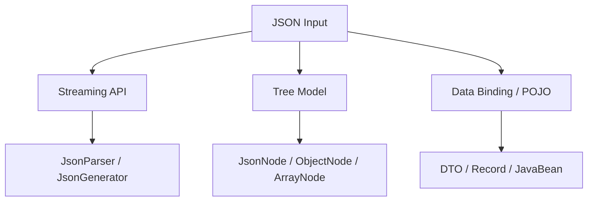

------
title: Learn Java Data Mapper, JSON/XML Processing & Validation - Part 011
description: JSON Tree Model dengan Jackson JsonNode, ObjectNode, ArrayNode, partial reads, dynamic payloads, patch-like workflows, audit envelope, dan contract-safe tree processing.
series: learn-java-data-mapper-json-xml-validation
seriesTitle: Learn Java Data Mapper, JSON/XML Processing & Validation
order: 11
partTitle: JSON Tree Model: JsonNode, Partial Reads, Dynamic Payloads, Patch-Like Workflows
tags:
- java
- jackson
- json
- jsonnode
- objectnode
- arraynode
- tree-model
- data-mapper
- serialization
- deserialization
- contract
date: 2026-06-29
---

# Part 011 — JSON Tree Model: `JsonNode`, Partial Reads, Dynamic Payloads, Patch-Like Workflows

> **Target skill:** mampu memakai Jackson Tree Model bukan sebagai “jalan pintas karena malas bikin DTO”, tetapi sebagai alat presisi untuk payload dinamis, partial processing, envelope extraction, schema-flexible integration, patch workflow, dan contract governance.

Di part sebelumnya kita membahas `ObjectMapper` sebagai infrastructure. Sekarang kita masuk ke salah satu kemampuan paling penting di Jackson: **Tree Model**.

Jackson punya tiga mode besar untuk memproses JSON:



Data binding cocok saat shape contract stabil. Streaming cocok saat payload besar dan perlu memory-safe processing. Tree model cocok saat kita butuh fleksibilitas struktural tetapi tetap ingin API Jackson yang aman dan eksplisit.

`JsonNode` adalah base class untuk JSON tree model Jackson. `ObjectNode` merepresentasikan JSON object, sedangkan `ArrayNode` merepresentasikan JSON array. Dalam praktik production, tree model sering dipakai untuk membaca envelope, menyimpan extension fields, memvalidasi dynamic section, membuat sanitized audit record, atau melakukan transformation sebelum mapping ke DTO.

---

## 1. Kaufman Deconstruction

Skill Tree Model kita pecah menjadi subskill berikut:

| Subskill | Kemampuan |
|---|---|
| Read JSON as tree | Mengubah raw JSON menjadi `JsonNode` |
| Navigate safely | Memakai `get`, `path`, `at`, dan type checks tanpa NPE/ambiguity |
| Distinguish missing/null/value | Membedakan missing node, null node, empty object, empty array |
| Convert subtree to POJO | Menggunakan `treeToValue`, `convertValue`, atau `readerFor` secara tepat |
| Modify tree | Menggunakan `ObjectNode` dan `ArrayNode` untuk enrichment/sanitization |
| Preserve extensions | Menangkap unknown fields tanpa membuang data |
| Validate dynamic shape | Membuat rules untuk area payload yang tidak statis |
| Design patch-like semantics | Memakai tree untuk membedakan absence/null/update/remove |
| Avoid tree abuse | Tidak mengganti domain model dengan `JsonNode` di seluruh codebase |

Latihan utama:

1. Ambil payload JSON dengan envelope.
2. Baca sebagai `JsonNode`.
3. Ambil metadata.
4. Ambil `payload`.
5. Convert `payload` ke DTO spesifik berdasarkan `type`.
6. Simpan unknown extension fields.
7. Sanitize field sensitif.
8. Test missing/null/type mismatch.

---

## 2. Kapan Memakai `JsonNode`

Gunakan Tree Model saat shape belum sepenuhnya statis atau kita perlu operasi struktural.

| Use Case | Kenapa Tree Model cocok |
|---|---|
| event envelope | metadata stabil, payload bervariasi |
| webhook provider | field bisa berubah tanpa versi formal |
| audit raw payload | perlu preserve bentuk asli/sanitized |
| patch request | perlu bedakan absence vs explicit null |
| partial extraction | hanya butuh beberapa field dari payload besar-menengah |
| dynamic attributes | ada `attributes`, `metadata`, `extensions` |
| transformation layer | rename/remove/enrich field sebelum mapping |
| compatibility bridge | menerima field lama dan baru |
| generic validation | validasi struktur sebelum memilih DTO |

Jangan gunakan Tree Model jika:

- contract stabil dan bisa direpresentasikan DTO
- semua field punya semantic kuat
- domain logic mulai membaca `JsonNode` langsung
- compiler type-safety lebih penting
- mapping rules makin kompleks dan tersebar

Rule praktis:

> **Use `JsonNode` at the boundary edge, not as your domain language.**

---

## 3. Basic Read

```java
ObjectMapper mapper = JsonMapper.builder()
    .findAndAddModules()
    .build();

String json = """
{
  "eventId": "evt-001",
  "type": "PAYMENT_APPROVED",
  "payload": {
    "paymentId": "pay-001",
    "amount": "100.00",
    "currency": "IDR"
  }
}
""";

JsonNode root = mapper.readTree(json);
```

Sekarang kita bisa membaca bagian tertentu:

```java
String eventId = root.path("eventId").asText();
String type = root.path("type").asText();
JsonNode payload = root.path("payload");
```

Tetapi kode seperti ini belum cukup aman. `asText()` pada missing node bisa menghasilkan string kosong, yang mungkin menyembunyikan error contract.

---

## 4. `get()` vs `path()` vs `at()`

### 4.1 `get()`

`get("field")` mengembalikan node jika field ada, atau `null` jika tidak ada.

```java
JsonNode typeNode = root.get("type");
if (typeNode == null) {
    throw new IllegalArgumentException("type is required");
}
```

Kelebihan: missing field mudah dideteksi sebagai `null`.

Kekurangan: raw `null` bisa membuat NPE jika tidak hati-hati.

### 4.2 `path()`

`path("field")` mengembalikan `MissingNode` jika field tidak ada.

```java
String type = root.path("type").asText();
```

Ini nyaman, tetapi bisa menyembunyikan bug karena missing menjadi default.

Lebih aman:

```java
JsonNode typeNode = root.path("type");
if (typeNode.isMissingNode()) {
    throw new IllegalArgumentException("type is required");
}
if (!typeNode.isTextual()) {
    throw new IllegalArgumentException("type must be string");
}
String type = typeNode.textValue();
```

### 4.3 `at()`

`at("/payload/paymentId")` memakai JSON Pointer.

```java
JsonNode paymentIdNode = root.at("/payload/paymentId");
```

Cocok untuk:

- nested path tetap
- rule engine sederhana
- validation utility
- test assertion
- field extraction dari payload provider

Hati-hati: `at()` juga bisa menghasilkan `MissingNode`.

---

## 5. Missing vs Null vs Empty

Ini bagian sangat penting.

Payload:

```json
{
  "a": null,
  "b": "",
  "c": [],
  "d": {}
}
```

Jika field `e` tidak ada, maka:

| Field | Meaning |
|---|---|
| `a` | present with JSON null |
| `b` | present with empty string |
| `c` | present with empty array |
| `d` | present with empty object |
| `e` | absent/missing |

Dengan Tree Model:

```java
JsonNode a = root.get("a");       // NullNode
JsonNode e = root.get("e");       // null
JsonNode e2 = root.path("e");     // MissingNode
```

Utility production:

```java
public enum JsonPresence {
    MISSING,
    NULL,
    VALUE
}
```

```java
public final class JsonNodes {
    private JsonNodes() {}

    public static JsonPresence presence(JsonNode object, String field) {
        JsonNode value = object.get(field);
        if (value == null) {
            return JsonPresence.MISSING;
        }
        if (value.isNull()) {
            return JsonPresence.NULL;
        }
        return JsonPresence.VALUE;
    }

    public static String requiredText(JsonNode object, String field) {
        JsonNode value = object.get(field);
        if (value == null) {
            throw new IllegalArgumentException(field + " is required");
        }
        if (!value.isTextual()) {
            throw new IllegalArgumentException(field + " must be a string");
        }
        String text = value.textValue();
        if (text.isBlank()) {
            throw new IllegalArgumentException(field + " must not be blank");
        }
        return text;
    }
}
```

Jangan memakai `asText()` untuk required field tanpa type check.

---

## 6. Type-Safe Extraction

`JsonNode` memiliki methods seperti:

```java
isTextual()
isNumber()
isIntegralNumber()
isBoolean()
isObject()
isArray()
isNull()
isMissingNode()
```

Contoh extractor:

```java
public static BigDecimal requiredDecimal(JsonNode object, String field) {
    JsonNode value = object.get(field);
    if (value == null) {
        throw new IllegalArgumentException(field + " is required");
    }

    if (value.isTextual()) {
        try {
            return new BigDecimal(value.textValue());
        } catch (NumberFormatException ex) {
            throw new IllegalArgumentException(field + " must be decimal string", ex);
        }
    }

    if (value.isNumber()) {
        return value.decimalValue();
    }

    throw new IllegalArgumentException(field + " must be decimal");
}
```

Policy harus jelas: apakah decimal boleh JSON number, string, atau keduanya?

Untuk money, sering lebih aman hanya menerima string decimal.

```java
public static BigDecimal requiredDecimalString(JsonNode object, String field) {
    JsonNode value = object.get(field);
    if (value == null) {
        throw new IllegalArgumentException(field + " is required");
    }
    if (!value.isTextual()) {
        throw new IllegalArgumentException(field + " must be decimal string");
    }
    return new BigDecimal(value.textValue());
}
```

---

## 7. Envelope Pattern

Banyak event/webhook punya shape seperti ini:

```json
{
  "eventId": "evt-001",
  "eventType": "payment.approved",
  "occurredAt": "2026-06-29T03:00:00Z",
  "producer": "payment-service",
  "payload": {
    "paymentId": "pay-001",
    "amount": "100.00",
    "currency": "IDR"
  }
}
```

Model:

```java
public record EventEnvelope(
    String eventId,
    String eventType,
    Instant occurredAt,
    String producer,
    JsonNode payload
) {}
```

Parser:

```java
public EventEnvelope parseEnvelope(JsonNode root) {
    return new EventEnvelope(
        JsonNodes.requiredText(root, "eventId"),
        JsonNodes.requiredText(root, "eventType"),
        Instant.parse(JsonNodes.requiredText(root, "occurredAt")),
        JsonNodes.requiredText(root, "producer"),
        requiredObject(root, "payload")
    );
}

private JsonNode requiredObject(JsonNode root, String field) {
    JsonNode node = root.get(field);
    if (node == null) {
        throw new IllegalArgumentException(field + " is required");
    }
    if (!node.isObject()) {
        throw new IllegalArgumentException(field + " must be object");
    }
    return node;
}
```

Dispatcher:

```java
public void handle(JsonNode root) throws JsonProcessingException {
    EventEnvelope envelope = parseEnvelope(root);

    switch (envelope.eventType()) {
        case "payment.approved" -> {
            PaymentApprovedPayload payload =
                objectMapper.treeToValue(envelope.payload(), PaymentApprovedPayload.class);
            paymentHandler.handle(envelope, payload);
        }
        case "payment.rejected" -> {
            PaymentRejectedPayload payload =
                objectMapper.treeToValue(envelope.payload(), PaymentRejectedPayload.class);
            rejectionHandler.handle(envelope, payload);
        }
        default -> unknownEventHandler.handle(envelope);
    }
}
```

Ini memisahkan:

- envelope parsing
- payload type dispatch
- payload DTO mapping
- unknown event handling

---

## 8. `treeToValue()` vs `convertValue()` vs `readValue()`

### 8.1 `treeToValue`

Gunakan saat sudah punya `JsonNode` dan ingin convert subtree ke class.

```java
PaymentApprovedPayload payload =
    objectMapper.treeToValue(payloadNode, PaymentApprovedPayload.class);
```

### 8.2 `convertValue`

Gunakan untuk convert antar object/tree tanpa raw JSON string.

```java
PaymentApprovedPayload payload =
    objectMapper.convertValue(payloadNode, PaymentApprovedPayload.class);
```

`convertValue` sangat nyaman, tetapi bisa menyembunyikan boundary karena tidak ada raw JSON parse. Untuk boundary parsing, `readValue` atau `treeToValue` sering lebih jelas.

### 8.3 `readerFor`

Gunakan jika ingin reusable reader dengan target type.

```java
ObjectReader paymentReader =
    objectMapper.readerFor(PaymentApprovedPayload.class);

PaymentApprovedPayload payload =
    paymentReader.readValue(payloadNode);
```

`ObjectReader` cocok untuk hot path dan konfigurasi target spesifik.

---

## 9. Dynamic Attributes

Payload:

```json
{
  "customerId": "CUS-001",
  "name": "Ana",
  "attributes": {
    "riskSegment": "LOW",
    "preferredLanguage": "id",
    "providerScore": 734
  }
}
```

DTO hybrid:

```java
public record CustomerProfileRequest(
    @NotBlank String customerId,
    @NotBlank String name,
    JsonNode attributes
) {}
```

Ini valid jika attributes memang dynamic.

Tapi jangan berhenti di sini. Tetapkan policy:

| Concern | Rule |
|---|---|
| max depth | misalnya 3 |
| max fields | misalnya 50 |
| allowed value types | string/number/boolean only |
| forbidden keys | password, token, secret |
| naming | camelCase atau provider-specific |
| storage | raw JSON, normalized map, atau flattened |
| queryability | apakah perlu indexing? |

Validator:

```java
public final class AttributeValidator {
    private static final int MAX_DEPTH = 3;
    private static final int MAX_FIELDS = 50;

    public void validate(JsonNode attributes) {
        if (attributes == null || attributes.isNull()) {
            return;
        }
        if (!attributes.isObject()) {
            throw new IllegalArgumentException("attributes must be object");
        }
        validateObject((ObjectNode) attributes, 0);
    }

    private void validateObject(ObjectNode node, int depth) {
        if (depth > MAX_DEPTH) {
            throw new IllegalArgumentException("attributes depth exceeded");
        }

        int count = 0;
        Iterator<Map.Entry<String, JsonNode>> fields = node.fields();

        while (fields.hasNext()) {
            Map.Entry<String, JsonNode> field = fields.next();
            count++;

            if (count > MAX_FIELDS) {
                throw new IllegalArgumentException("too many attributes");
            }

            String key = field.getKey();
            JsonNode value = field.getValue();

            if (key.equalsIgnoreCase("password") || key.equalsIgnoreCase("token")) {
                throw new IllegalArgumentException("forbidden attribute key: " + key);
            }

            if (value.isObject()) {
                validateObject((ObjectNode) value, depth + 1);
            } else if (value.isArray()) {
                validateArray((ArrayNode) value, depth + 1);
            } else if (!(value.isTextual() || value.isNumber() || value.isBoolean() || value.isNull())) {
                throw new IllegalArgumentException("unsupported attribute value for key: " + key);
            }
        }
    }

    private void validateArray(ArrayNode node, int depth) {
        if (depth > MAX_DEPTH) {
            throw new IllegalArgumentException("attributes depth exceeded");
        }

        for (JsonNode item : node) {
            if (item.isObject()) {
                validateObject((ObjectNode) item, depth + 1);
            } else if (item.isArray()) {
                validateArray((ArrayNode) item, depth + 1);
            }
        }
    }
}
```

Dynamic tidak berarti ungoverned.

---

## 10. Extension Fields

Untuk forward compatibility, kita bisa menangkap unknown fields.

```java
public final class ProviderCustomerEvent {
    private String eventId;
    private String customerId;
    private final Map<String, JsonNode> extensions = new LinkedHashMap<>();

    @JsonAnySetter
    public void putExtension(String name, JsonNode value) {
        extensions.put(name, value);
    }

    @JsonAnyGetter
    public Map<String, JsonNode> extensions() {
        return extensions;
    }
}
```

Ini berguna saat provider menambah field baru dan kita tidak ingin kehilangan data.

Tetapi perlu aturan:

- extension tidak boleh override canonical fields
- extension tidak boleh berisi secret
- extension size dibatasi
- extension tidak boleh langsung menjadi domain decision
- extension field harus diamati untuk calon contract evolution

---

## 11. Sanitizing JSON Tree

Untuk audit/logging, raw payload sering perlu disimpan, tetapi field sensitif harus dihapus/masking.

```java
public final class JsonSanitizer {
    private static final Set<String> SENSITIVE_KEYS = Set.of(
        "password",
        "token",
        "accessToken",
        "refreshToken",
        "secret",
        "cardNumber",
        "cvv"
    );

    public JsonNode sanitize(JsonNode input) {
        if (input == null || input.isNull()) {
            return input;
        }

        JsonNode copy = input.deepCopy();
        sanitizeInPlace(copy);
        return copy;
    }

    private void sanitizeInPlace(JsonNode node) {
        if (node instanceof ObjectNode objectNode) {
            Iterator<Map.Entry<String, JsonNode>> fields = objectNode.fields();
            List<String> toMask = new ArrayList<>();

            while (fields.hasNext()) {
                Map.Entry<String, JsonNode> field = fields.next();
                String key = field.getKey();
                JsonNode value = field.getValue();

                if (isSensitive(key)) {
                    toMask.add(key);
                } else {
                    sanitizeInPlace(value);
                }
            }

            for (String key : toMask) {
                objectNode.put(key, "***");
            }
        } else if (node instanceof ArrayNode arrayNode) {
            for (JsonNode item : arrayNode) {
                sanitizeInPlace(item);
            }
        }
    }

    private boolean isSensitive(String key) {
        return SENSITIVE_KEYS.stream()
            .anyMatch(s -> s.equalsIgnoreCase(key));
    }
}
```

Catatan penting:

- gunakan `deepCopy()` agar raw input tidak termutasi
- sanitizer harus recursive
- jangan log raw tree sebelum sanitization
- test field sensitif nested dan array

---

## 12. Mutation with `ObjectNode`

`JsonNode` base class bersifat model umum. Untuk modify object, gunakan `ObjectNode`.

```java
ObjectNode object = (ObjectNode) root.deepCopy();
object.put("processedAt", Instant.now().toString());
object.remove("debug");
```

Untuk nested mutation:

```java
ObjectNode payload = (ObjectNode) object.path("payload");
payload.put("normalizedCurrency", payload.path("currency").asText().toUpperCase(Locale.ROOT));
```

Jangan cast tanpa check:

```java
ObjectNode payload = (ObjectNode) object.path("payload"); // risky
```

Lebih aman:

```java
JsonNode payloadNode = object.get("payload");
if (!(payloadNode instanceof ObjectNode payload)) {
    throw new IllegalArgumentException("payload must be object");
}
```

---

## 13. Building JSON with Tree Model

```java
ObjectNode response = objectMapper.createObjectNode();
response.put("status", "accepted");
response.put("requestId", requestId);
response.put("processedAt", Instant.now().toString());

ArrayNode warnings = response.putArray("warnings");
warnings.add("field x is deprecated");
warnings.add("field y will be removed");
```

Output:

```json
{
  "status": "accepted",
  "requestId": "REQ-001",
  "processedAt": "2026-06-29T03:00:00Z",
  "warnings": [
    "field x is deprecated",
    "field y will be removed"
  ]
}
```

Gunakan tree building untuk response dinamis kecil. Untuk response utama yang stabil, tetap pilih DTO.

---

## 14. Patch-Like Workflow

PATCH adalah salah satu area paling cocok untuk Tree Model karena perlu membedakan:

- field absent: no change
- field present null: clear value
- field present value: update value

Payload:

```json
{
  "displayName": "Ana Maria",
  "phoneNumber": null
}
```

`email` absent berarti jangan ubah email.

Handler:

```java
public CustomerPatch parsePatch(JsonNode root) {
    if (!root.isObject()) {
        throw new IllegalArgumentException("patch body must be object");
    }

    return new CustomerPatch(
        readPatchField(root, "displayName"),
        readPatchField(root, "phoneNumber"),
        readPatchField(root, "email")
    );
}

private PatchField<String> readPatchField(JsonNode root, String field) {
    JsonNode value = root.get(field);

    if (value == null) {
        return PatchField.absent();
    }

    if (value.isNull()) {
        return PatchField.ofNull();
    }

    if (!value.isTextual()) {
        throw new IllegalArgumentException(field + " must be string or null");
    }

    return PatchField.ofValue(value.textValue());
}
```

Patch field model:

```java
public sealed interface PatchField<T>
    permits PatchField.Absent, PatchField.NullValue, PatchField.Value {

    record Absent<T>() implements PatchField<T> {}
    record NullValue<T>() implements PatchField<T> {}
    record Value<T>(T value) implements PatchField<T> {}

    static <T> PatchField<T> absent() {
        return new Absent<>();
    }

    static <T> PatchField<T> ofNull() {
        return new NullValue<>();
    }

    static <T> PatchField<T> ofValue(T value) {
        return new Value<>(value);
    }
}
```

Ini lebih eksplisit daripada DTO biasa dengan nullable fields.

---

## 15. Partial Read

Misalnya payload besar tetapi kita hanya butuh routing metadata:

```json
{
  "tenantId": "tenant-a",
  "eventType": "case.created",
  "payload": {
    "large": "..."
  }
}
```

Dengan tree:

```java
JsonNode root = objectMapper.readTree(inputStream);
String tenantId = JsonNodes.requiredText(root, "tenantId");
String eventType = JsonNodes.requiredText(root, "eventType");
```

Untuk payload benar-benar besar, gunakan streaming API di Part 012. Tree model tetap memuat seluruh tree ke memory.

Rule:

| Size/Need | Approach |
|---|---|
| small/medium + dynamic | Tree Model |
| stable DTO | Data Binding |
| huge file/array | Streaming |
| envelope + many payload items | Streaming + `ObjectReader` for item |
| patch semantics | Tree or presence-aware DTO |

---

## 16. Tree Model and Validation

Jakarta Validation bekerja natural pada POJO/record, bukan `JsonNode` secara otomatis. Untuk dynamic tree, buat validator manual atau custom constraint.

Example custom validator idea:

```java
@Target({ ElementType.FIELD, ElementType.RECORD_COMPONENT })
@Retention(RetentionPolicy.RUNTIME)
@Constraint(validatedBy = AttributesValidator.class)
public @interface ValidAttributes {
    String message() default "invalid attributes";
    Class<?>[] groups() default {};
    Class<? extends Payload>[] payload() default {};
}
```

```java
public final class AttributesValidator
    implements ConstraintValidator<ValidAttributes, JsonNode> {

    private final AttributeValidator delegate = new AttributeValidator();

    @Override
    public boolean isValid(JsonNode value, ConstraintValidatorContext context) {
        try {
            delegate.validate(value);
            return true;
        } catch (IllegalArgumentException ex) {
            context.disableDefaultConstraintViolation();
            context.buildConstraintViolationWithTemplate(ex.getMessage())
                .addConstraintViolation();
            return false;
        }
    }
}
```

DTO:

```java
public record CustomerProfileRequest(
    @NotBlank String customerId,
    @ValidAttributes JsonNode attributes
) {}
```

---

## 17. Contract Evolution with Tree Model

Tree model membantu transisi field.

### 17.1 Rename Field

Payload lama:

```json
{ "customerName": "Ana" }
```

Payload baru:

```json
{ "fullName": "Ana" }
```

Compatibility bridge:

```java
public String readFullName(JsonNode root) {
    JsonNode fullName = root.get("fullName");
    if (fullName != null && fullName.isTextual()) {
        return fullName.textValue();
    }

    JsonNode customerName = root.get("customerName");
    if (customerName != null && customerName.isTextual()) {
        return customerName.textValue();
    }

    throw new IllegalArgumentException("fullName is required");
}
```

Tetapi jangan selamanya begini. Tambahkan deprecation timeline dan telemetry.

### 17.2 Extension to First-Class Field

Hari ini:

```json
{
  "extensions": {
    "riskSegment": "LOW"
  }
}
```

Besok:

```json
{
  "riskSegment": "LOW"
}
```

Bridge:

```java
public String readRiskSegment(JsonNode root) {
    JsonNode direct = root.get("riskSegment");
    if (direct != null && direct.isTextual()) {
        return direct.textValue();
    }

    JsonNode extension = root.at("/extensions/riskSegment");
    if (!extension.isMissingNode() && extension.isTextual()) {
        return extension.textValue();
    }

    return null;
}
```

---

## 18. Error Reporting with JSON Pointer

Saat validasi tree, path error sangat penting.

```java
public record JsonFieldError(
    String pointer,
    String code,
    String message
) {}
```

Example:

```json
{
  "errors": [
    {
      "pointer": "/payload/amount",
      "code": "INVALID_DECIMAL",
      "message": "amount must be decimal string"
    }
  ]
}
```

Validator traversal:

```java
public void requireText(JsonNode root, String pointer, List<JsonFieldError> errors) {
    JsonNode node = root.at(pointer);

    if (node.isMissingNode()) {
        errors.add(new JsonFieldError(pointer, "REQUIRED", "field is required"));
        return;
    }

    if (!node.isTextual()) {
        errors.add(new JsonFieldError(pointer, "INVALID_TYPE", "field must be string"));
    }
}
```

JSON Pointer membuat error stabil dan mudah dipakai consumer.

---

## 19. Tree Model Anti-Patterns

### 19.1 Domain Logic Reads `JsonNode`

Buruk:

```java
if (payload.path("riskScore").asInt() > 700) {
    approve();
}
```

Lebih baik:

```java
RiskAssessment assessment = riskPayloadMapper.toRiskAssessment(payload);
if (assessment.isLowRisk()) {
    approve();
}
```

### 19.2 No Type Check

Buruk:

```java
String amount = root.path("amount").asText();
```

Ini bisa membuat missing field menjadi `""`.

### 19.3 Unbounded Dynamic JSON

Menerima `JsonNode metadata` tanpa depth/size/key policy bisa menjadi performance/security problem.

### 19.4 Mutating Shared Node

Jika node dipakai untuk audit raw dan transformasi, mutation bisa merusak audit.

Gunakan `deepCopy()`.

### 19.5 Tree Everywhere

Kalau semua DTO diganti `JsonNode`, compiler tidak lagi membantu. Mapping bug pindah ke runtime.

---

## 20. Testing Strategy

### 20.1 Missing vs Null

```java
@Test
void presence_distinguishesMissingNullAndValue() throws Exception {
    JsonNode root = mapper.readTree("""
    {
      "a": null,
      "b": "value"
    }
    """);

    assertThat(JsonNodes.presence(root, "a")).isEqualTo(JsonPresence.NULL);
    assertThat(JsonNodes.presence(root, "b")).isEqualTo(JsonPresence.VALUE);
    assertThat(JsonNodes.presence(root, "c")).isEqualTo(JsonPresence.MISSING);
}
```

### 20.2 Type Mismatch

```java
@Test
void requiredText_rejectsNumber() throws Exception {
    JsonNode root = mapper.readTree("""
    { "eventType": 123 }
    """);

    assertThatThrownBy(() -> JsonNodes.requiredText(root, "eventType"))
        .hasMessageContaining("eventType must be a string");
}
```

### 20.3 Patch Semantics

```java
@Test
void patch_distinguishesAbsentNullAndValue() throws Exception {
    JsonNode root = mapper.readTree("""
    {
      "displayName": "Ana",
      "phoneNumber": null
    }
    """);

    CustomerPatch patch = parser.parsePatch(root);

    assertThat(patch.displayName()).isInstanceOf(PatchField.Value.class);
    assertThat(patch.phoneNumber()).isInstanceOf(PatchField.NullValue.class);
    assertThat(patch.email()).isInstanceOf(PatchField.Absent.class);
}
```

### 20.4 Sanitization

```java
@Test
void sanitizer_masksNestedSecrets() throws Exception {
    JsonNode root = mapper.readTree("""
    {
      "user": {
        "name": "Ana",
        "token": "secret-token"
      }
    }
    """);

    JsonNode sanitized = sanitizer.sanitize(root);

    assertThat(sanitized.at("/user/token").asText()).isEqualTo("***");
    assertThat(root.at("/user/token").asText()).isEqualTo("secret-token");
}
```

---

## 21. Production Checklist

Sebelum memakai `JsonNode`:

- [ ] Apakah shape benar-benar dynamic?
- [ ] Apakah boundary edge saja yang memakai tree?
- [ ] Apakah missing/null/value dibedakan?
- [ ] Apakah type check eksplisit?
- [ ] Apakah ada max depth dan max size untuk dynamic field?
- [ ] Apakah secret field disanitasi?
- [ ] Apakah mutation memakai `deepCopy()` jika perlu?
- [ ] Apakah subtree dikonversi ke DTO/domain sebelum business logic?
- [ ] Apakah error memakai JSON Pointer/path?
- [ ] Apakah unknown fields disimpan atau ditolak secara sengaja?
- [ ] Apakah contract evolution punya telemetry/deprecation plan?
- [ ] Apakah tests mencakup missing, null, invalid type, unknown field, nested dynamic field?

---

## 22. Mini Case Study: Provider Webhook

Webhook:

```json
{
  "id": "wh-001",
  "type": "customer.updated",
  "timestamp": "2026-06-29T03:00:00Z",
  "data": {
    "customer_id": "CUS-001",
    "name": "Ana",
    "risk_segment": "LOW"
  },
  "signature": "..."
}
```

### 22.1 Boundary Parser

```java
public record WebhookEnvelope(
    String id,
    String type,
    Instant timestamp,
    JsonNode data
) {}
```

```java
public WebhookEnvelope parse(JsonNode root) {
    return new WebhookEnvelope(
        JsonNodes.requiredText(root, "id"),
        JsonNodes.requiredText(root, "type"),
        Instant.parse(JsonNodes.requiredText(root, "timestamp")),
        requiredObject(root, "data")
    );
}
```

### 22.2 Type Dispatch

```java
public void handle(String rawJson) throws IOException {
    JsonNode root = mapper.readTree(rawJson);
    signatureVerifier.verify(rawJson, JsonNodes.requiredText(root, "signature"));

    WebhookEnvelope envelope = parse(root);

    switch (envelope.type()) {
        case "customer.updated" -> {
            ProviderCustomerUpdated payload =
                mapper.treeToValue(envelope.data(), ProviderCustomerUpdated.class);
            customerWebhookHandler.handle(envelope, payload);
        }
        default -> unknownWebhookHandler.handle(envelope, root);
    }
}
```

### 22.3 Why This Works

- raw JSON remains available for signature verification
- envelope is validated before dispatch
- `data` stays dynamic until type is known
- known payload becomes typed DTO
- unknown event can be stored safely
- error handling can point to exact field path

---

## 23. Summary

Tree Model adalah alat boundary yang sangat kuat.

Mental model:

> **`JsonNode` is for structural flexibility; DTO/domain types are for semantic clarity. Use both deliberately.**

Rules:

1. Gunakan `JsonNode` untuk dynamic boundary, envelope, patch, extension, partial transformation.
2. Jangan bawa `JsonNode` terlalu jauh ke domain.
3. Jangan memakai `asText()`/`asInt()` pada required field tanpa type check.
4. Bedakan missing, null, empty, dan value.
5. Gunakan `ObjectNode`/`ArrayNode` untuk mutation.
6. Gunakan `deepCopy()` saat sanitizing atau transforming shared tree.
7. Convert subtree ke typed DTO sebelum business logic.
8. Dynamic JSON tetap butuh governance: depth, size, type, key policy.
9. Error path sebaiknya memakai JSON Pointer.
10. Untuk payload sangat besar, gunakan streaming API.

Part berikutnya membahas Streaming JSON: `JsonParser`, `JsonGenerator`, token model, array besar, mixed streaming + databind, dan memory-safe processing.

---

## References

- Jackson `JsonNode` Javadoc: https://www.javadoc.io/doc/com.fasterxml.jackson.core/jackson-databind/latest/com/fasterxml/jackson/databind/JsonNode.html
- Jackson `ObjectNode` Javadoc: https://www.javadoc.io/doc/com.fasterxml.jackson.core/jackson-databind/latest/com/fasterxml/jackson/databind/node/ObjectNode.html
- Jackson `ArrayNode` Javadoc: https://www.javadoc.io/doc/com.fasterxml.jackson.core/jackson-databind/latest/com/fasterxml/jackson/databind/node/ArrayNode.html
- Jackson Databind Repository: https://github.com/FasterXML/jackson-databind
- Jakarta Validation 3.1 Specification: https://jakarta.ee/specifications/bean-validation/3.1/jakarta-validation-spec-3.1.html
