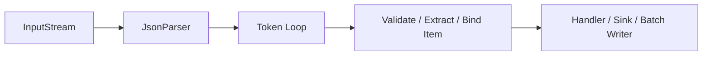
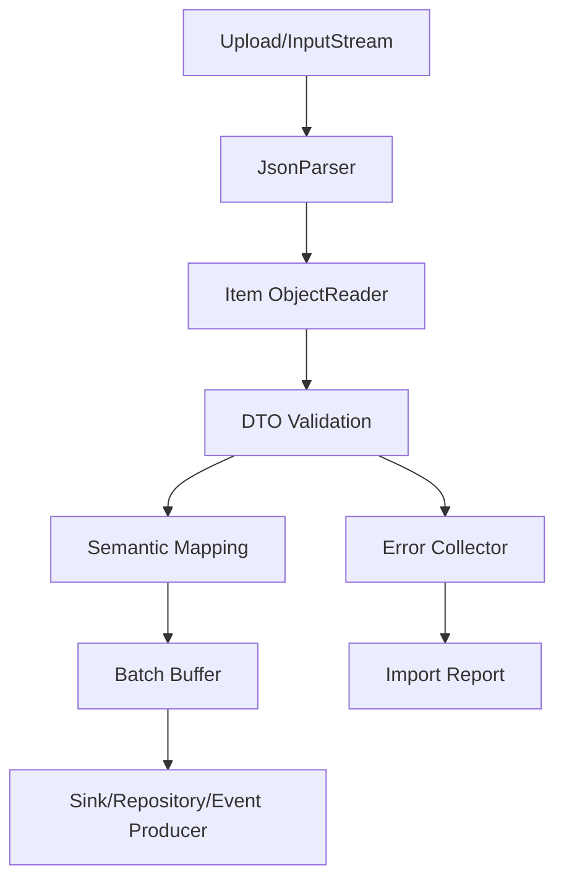
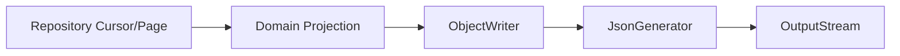

------
title: Learn Java Data Mapper, JSON/XML Processing & Validation - Part 012
description: Streaming JSON dengan Jackson JsonParser dan JsonGenerator untuk large payload, memory-safe processing, token model, hybrid streaming plus databind, validation, dan production hardening.
series: learn-java-data-mapper-json-xml-validation
seriesTitle: Learn Java Data Mapper, JSON/XML Processing & Validation
order: 12
partTitle: Streaming JSON: JsonParser, JsonGenerator, Large Payloads, Memory-Safe Processing
tags:
- java
- jackson
- json
- streaming
- jsonparser
- jsongenerator
- objectreader
- objectwriter
- performance
- memory
- data-mapper
date: 2026-06-29
---

# Part 012 — Streaming JSON: `JsonParser`, `JsonGenerator`, Large Payloads, Memory-Safe Processing

> **Target skill:** mampu memproses JSON besar atau continuous JSON dengan penggunaan memory terkendali, memakai Jackson Streaming API secara benar, dan menggabungkannya dengan databind saat butuh type-safe item mapping.

Di part sebelumnya kita memakai Tree Model. Tree Model fleksibel, tetapi ia tetap memuat struktur JSON ke memory. Untuk payload besar, file export/import, array berisi jutaan item, atau pipeline ingestion, kita butuh pendekatan lain: **streaming**.

Jackson core menyediakan streaming processor melalui:

- `JsonFactory`
- `JsonParser`
- `JsonGenerator`

Streaming API membaca/menulis JSON sebagai sequence of tokens. Kita tidak memegang seluruh tree. Kita bergerak token demi token.

Mental model:



Streaming bukan pengganti semua hal. Streaming adalah alat ketika memory, latency, atau payload size menjadi constraint.

---

## 1. Kaufman Deconstruction

Subskill streaming:

| Subskill | Kemampuan |
|---|---|
| Understand token model | Tahu token seperti `START_OBJECT`, `FIELD_NAME`, `VALUE_STRING`, `END_ARRAY` |
| Build parser loop | Membaca input secara berurutan dan aman |
| Validate structure | Memastikan token sesuai contract |
| Extract fields | Mengambil field tanpa membuat whole tree |
| Stream array items | Memproses item satu per satu |
| Combine with databind | Memakai `ObjectReader.readValue(parser)` untuk item |
| Generate JSON | Menulis output dengan `JsonGenerator` |
| Handle errors | Memberi error path/index yang actionable |
| Control resources | Menutup parser/generator/stream dengan benar |
| Set limits | Mencegah payload terlalu besar/deep/berbahaya |

Latihan:

1. Buat file JSON array besar.
2. Parse item satu per satu.
3. Convert item ke DTO menggunakan `ObjectReader`.
4. Validate item.
5. Tulis valid items ke output streaming.
6. Catat index error.
7. Pastikan memory stabil.

---

## 2. Kapan Memakai Streaming

| Use Case | Streaming cocok? | Alasan |
|---|---:|---|
| import file 5GB | yes | tree/POJO list akan boros memory |
| export jutaan records | yes | output bisa ditulis incremental |
| webhook kecil | no | DTO/tree lebih sederhana |
| event envelope kecil | maybe | tree cukup, kecuali volume ekstrem |
| NDJSON log | yes | record-by-record |
| large array ingestion | yes | process item satu per satu |
| partial scan field tertentu | yes | tidak perlu materialize semua |
| dynamic patch request kecil | no | tree lebih mudah |
| public API normal | rarely | databind cukup |

Rule:

> **Use streaming when the cost of materializing the whole JSON is unacceptable.**

---

## 3. Token Model

JSON:

```json
{
  "id": "batch-001",
  "items": [
    { "sku": "A", "quantity": 1 },
    { "sku": "B", "quantity": 2 }
  ]
}
```

Token sequence konseptual:

```txt
START_OBJECT
FIELD_NAME id
VALUE_STRING batch-001
FIELD_NAME items
START_ARRAY
START_OBJECT
FIELD_NAME sku
VALUE_STRING A
FIELD_NAME quantity
VALUE_NUMBER_INT 1
END_OBJECT
START_OBJECT
FIELD_NAME sku
VALUE_STRING B
FIELD_NAME quantity
VALUE_NUMBER_INT 2
END_OBJECT
END_ARRAY
END_OBJECT
```

Streaming parser hanya tahu posisi saat ini. Ia tidak tahu “seluruh dokumen” kecuali kita simpan sendiri.

---

## 4. Basic `JsonParser`

```java
JsonFactory factory = new JsonFactory();

try (JsonParser parser = factory.createParser(inputStream)) {
    while (parser.nextToken() != null) {
        JsonToken token = parser.currentToken();
        // handle token
    }
}
```

Dengan `ObjectMapper`:

```java
ObjectMapper mapper = JsonMapper.builder()
    .findAndAddModules()
    .build();

JsonFactory factory = mapper.getFactory();
```

Jika menggunakan mapper factory, parser dan databind memakai konfigurasi yang konsisten.

---

## 5. Strict Structure Parsing

Misalnya contract:

```json
{
  "batchId": "batch-001",
  "items": [
    {
      "sku": "SKU-1",
      "quantity": 10
    }
  ]
}
```

Parser:

```java
public void parseBatch(InputStream input) throws IOException {
    try (JsonParser parser = objectMapper.getFactory().createParser(input)) {
        expect(parser.nextToken(), JsonToken.START_OBJECT, "root must be object");

        String batchId = null;

        while (parser.nextToken() != JsonToken.END_OBJECT) {
            String fieldName = parser.currentName();
            parser.nextToken();

            switch (fieldName) {
                case "batchId" -> batchId = readRequiredString(parser, "batchId");
                case "items" -> parseItems(parser);
                default -> parser.skipChildren();
            }
        }

        if (batchId == null || batchId.isBlank()) {
            throw new IllegalArgumentException("batchId is required");
        }
    }
}

private void parseItems(JsonParser parser) throws IOException {
    expect(parser.currentToken(), JsonToken.START_ARRAY, "items must be array");

    int index = 0;
    while (parser.nextToken() != JsonToken.END_ARRAY) {
        parseItem(parser, index);
        index++;
    }
}
```

Helper:

```java
private void expect(JsonToken actual, JsonToken expected, String message) {
    if (actual != expected) {
        throw new IllegalArgumentException(message + ", actual=" + actual);
    }
}

private String readRequiredString(JsonParser parser, String field) throws IOException {
    if (parser.currentToken() != JsonToken.VALUE_STRING) {
        throw new IllegalArgumentException(field + " must be string");
    }
    String value = parser.getValueAsString();
    if (value.isBlank()) {
        throw new IllegalArgumentException(field + " must not be blank");
    }
    return value;
}
```

---

## 6. Streaming Array Items with Databind

Manual token parsing untuk setiap field bisa verbose. Untuk array item yang shape-nya stabil, kombinasikan streaming dengan databind.

DTO:

```java
public record ImportItem(
    @NotBlank String sku,
    @Min(1) int quantity
) {}
```

Parser:

```java
public void importItems(InputStream input) throws IOException {
    ObjectReader itemReader = objectMapper.readerFor(ImportItem.class);

    try (JsonParser parser = objectMapper.getFactory().createParser(input)) {
        expect(parser.nextToken(), JsonToken.START_ARRAY, "root must be array");

        int index = 0;
        while (parser.nextToken() != JsonToken.END_ARRAY) {
            ImportItem item = itemReader.readValue(parser);
            validateItem(item, index);
            handleItem(item, index);
            index++;
        }
    }
}
```

Ini pattern production yang sering paling efektif:

```txt
streaming for outer array
databind for each item
validation per item
batch/process item incrementally
```

Keuntungan:

- tidak memuat seluruh array
- item tetap type-safe
- validation bisa per item
- error bisa menyebut index
- batch persistence bisa dikontrol

---

## 7. Error Context: Index and Path

Untuk import, error harus actionable.

Buruk:

```txt
Cannot deserialize value of type int from String "abc"
```

Lebih baik:

```json
{
  "code": "INVALID_IMPORT_ITEM",
  "index": 27,
  "path": "/items/27/quantity",
  "message": "quantity must be integer"
}
```

Wrapper:

```java
public record ImportError(
    int index,
    String pointer,
    String code,
    String message
) {}
```

Processing:

```java
List<ImportError> errors = new ArrayList<>();

int index = 0;
while (parser.nextToken() != JsonToken.END_ARRAY) {
    try {
        ImportItem item = itemReader.readValue(parser);
        validateItem(item, index);
        handleItem(item, index);
    } catch (Exception ex) {
        errors.add(new ImportError(
            index,
            "/items/" + index,
            "INVALID_IMPORT_ITEM",
            ex.getMessage()
        ));
        parser.skipChildren();
    }
    index++;
}
```

Untuk beberapa sistem, processing berhenti pada error pertama. Untuk import user-facing, sering lebih baik collect sejumlah error dengan limit.

---

## 8. Batch Processing

Jangan insert satu per satu jika throughput penting.

```java
List<ImportItem> buffer = new ArrayList<>(1000);

while (parser.nextToken() != JsonToken.END_ARRAY) {
    ImportItem item = itemReader.readValue(parser);
    validateItem(item, index);

    buffer.add(item);

    if (buffer.size() == 1000) {
        itemSink.writeBatch(buffer);
        buffer.clear();
    }

    index++;
}

if (!buffer.isEmpty()) {
    itemSink.writeBatch(buffer);
}
```

Tetapkan:

| Parameter | Contoh |
|---|---|
| batch size | 500/1000/5000 |
| max errors | 100 |
| max records | 1_000_000 |
| max file size | berdasarkan product constraints |
| transaction boundary | per batch, bukan seluruh file |
| idempotency | import id + item index/hash |
| retry model | retry failed batch/item |

---

## 9. Streaming with Envelope

Payload:

```json
{
  "batchId": "batch-001",
  "source": "provider-a",
  "items": [
    { "id": "1", "value": "A" },
    { "id": "2", "value": "B" }
  ]
}
```

Kita ingin baca metadata dan stream items.

```java
public void processBatch(InputStream input) throws IOException {
    ObjectReader itemReader = objectMapper.readerFor(ProviderItem.class);

    try (JsonParser parser = objectMapper.getFactory().createParser(input)) {
        expect(parser.nextToken(), JsonToken.START_OBJECT, "root must be object");

        String batchId = null;
        String source = null;

        while (parser.nextToken() != JsonToken.END_OBJECT) {
            String field = parser.currentName();
            parser.nextToken();

            switch (field) {
                case "batchId" -> batchId = parser.getValueAsString();
                case "source" -> source = parser.getValueAsString();
                case "items" -> {
                    if (batchId == null || source == null) {
                        throw new IllegalArgumentException("batch metadata must appear before items");
                    }
                    processItems(parser, itemReader, batchId, source);
                }
                default -> parser.skipChildren();
            }
        }
    }
}
```

Catatan: Jika metadata bisa muncul setelah `items`, streaming murni jadi lebih sulit. Contract sebaiknya menaruh metadata sebelum array besar.

---

## 10. NDJSON

NDJSON berarti newline-delimited JSON: satu JSON object per baris.

```txt
{"id":"1","value":"A"}
{"id":"2","value":"B"}
{"id":"3","value":"C"}
```

Untuk NDJSON, sering lebih mudah line-by-line:

```java
try (BufferedReader reader = new BufferedReader(new InputStreamReader(input, StandardCharsets.UTF_8))) {
    String line;
    int index = 0;

    ObjectReader itemReader = objectMapper.readerFor(ProviderItem.class);

    while ((line = reader.readLine()) != null) {
        if (line.isBlank()) {
            continue;
        }

        ProviderItem item = itemReader.readValue(line);
        handleItem(item, index);
        index++;
    }
}
```

Keuntungan:

- error isolation per line
- resume mudah
- cocok untuk logs/events
- tidak perlu outer array
- streaming alami

Risiko:

- newline dalam string harus valid escaped
- perlu limit line length
- perlu charset jelas
- format contract harus eksplisit

---

## 11. Writing JSON with `JsonGenerator`

Untuk output besar, jangan build `List<Dto>` lalu serialize. Tulis incremental.

```java
public void exportItems(OutputStream output, Iterator<ExportItem> items) throws IOException {
    try (JsonGenerator generator = objectMapper.getFactory().createGenerator(output)) {
        generator.writeStartArray();

        while (items.hasNext()) {
            ExportItem item = items.next();

            generator.writeStartObject();
            generator.writeStringField("sku", item.sku());
            generator.writeNumberField("quantity", item.quantity());
            generator.writeStringField("exportedAt", item.exportedAt().toString());
            generator.writeEndObject();
        }

        generator.writeEndArray();
    }
}
```

Untuk envelope:

```java
public void exportBatch(OutputStream output, Stream<ExportItem> items) throws IOException {
    try (JsonGenerator generator = objectMapper.getFactory().createGenerator(output)) {
        generator.writeStartObject();

        generator.writeStringField("batchId", UUID.randomUUID().toString());
        generator.writeStringField("generatedAt", Instant.now().toString());

        generator.writeFieldName("items");
        generator.writeStartArray();

        Iterator<ExportItem> iterator = items.iterator();
        while (iterator.hasNext()) {
            writeItem(generator, iterator.next());
        }

        generator.writeEndArray();
        generator.writeEndObject();
    }
}
```

---

## 12. `ObjectWriter` with Generator

Jika item DTO stabil, pakai `ObjectWriter` agar tidak manual menulis semua field.

```java
ObjectWriter itemWriter = objectMapper.writerFor(ExportItem.class);

try (JsonGenerator generator = objectMapper.getFactory().createGenerator(output)) {
    generator.writeStartArray();

    for (ExportItem item : items) {
        itemWriter.writeValue(generator, item);
    }

    generator.writeEndArray();
}
```

Ini hybrid yang sangat praktis:

```txt
generator controls outer structure
ObjectWriter writes each item
```

---

## 13. Flush and Backpressure

`JsonGenerator` menulis ke target stream/writer. Di API server, output stream bisa punya buffering dan backpressure dari client/network.

Policy:

- jangan `flush()` setiap item kecuali perlu real-time streaming
- flush per batch jika output besar
- tangani client disconnect
- ukur output latency
- jangan simpan semua output di memory
- hindari `writeValueAsString()` untuk export besar

Buruk:

```java
String json = objectMapper.writeValueAsString(bigList);
response.getWriter().write(json);
```

Lebih baik:

```java
try (JsonGenerator generator = objectMapper.getFactory().createGenerator(response.getOutputStream())) {
    generator.writeStartArray();
    for (ExportItem item : streamItems()) {
        itemWriter.writeValue(generator, item);
    }
    generator.writeEndArray();
}
```

---

## 14. Resource Management

Gunakan try-with-resources:

```java
try (JsonParser parser = factory.createParser(inputStream)) {
    // parse
}
```

Untuk server framework, hati-hati menutup stream response. Biasanya generator close akan close underlying stream. Ini sering oke, tetapi ikuti contract framework.

Untuk reusable `ObjectReader`/`ObjectWriter`:

```java
private final ObjectReader itemReader;
private final ObjectWriter itemWriter;

public ImportExportService(ObjectMapper mapper) {
    this.itemReader = mapper.readerFor(ImportItem.class);
    this.itemWriter = mapper.writerFor(ExportItem.class);
}
```

`ObjectReader` dan `ObjectWriter` immutable dan cocok untuk reuse.

---

## 15. Validation During Streaming

DTO validation:

```java
private final Validator validator;

private void validateItem(ImportItem item, int index) {
    Set<ConstraintViolation<ImportItem>> violations = validator.validate(item);

    if (!violations.isEmpty()) {
        String message = violations.stream()
            .map(v -> "/items/" + index + "/" + v.getPropertyPath() + ": " + v.getMessage())
            .collect(Collectors.joining("; "));

        throw new IllegalArgumentException(message);
    }
}
```

Jika collect errors:

```java
private List<ImportError> validateItemCollect(ImportItem item, int index) {
    return validator.validate(item).stream()
        .map(v -> new ImportError(
            index,
            "/items/" + index + "/" + v.getPropertyPath(),
            "VALIDATION_FAILED",
            v.getMessage()
        ))
        .toList();
}
```

Policy:

| Mode | Kapan cocok |
|---|---|
| fail-fast | integration pipeline, low tolerance |
| collect errors | user upload/import |
| quarantine invalid items | event ingestion |
| partial success | bulk API dengan per-item result |
| all-or-nothing | financial/regulatory critical operation |

---

## 16. Handling Unknown Fields

Saat memakai `ObjectReader.readValue(parser)`, unknown field policy mengikuti `ObjectMapper`.

Untuk import yang strict:

```java
ObjectMapper strictMapper = JsonMapper.builder()
    .enable(DeserializationFeature.FAIL_ON_UNKNOWN_PROPERTIES)
    .build();

ObjectReader itemReader = strictMapper.readerFor(ImportItem.class);
```

Untuk provider event yang forward-compatible:

```java
@JsonIgnoreProperties(ignoreUnknown = true)
public record ProviderItem(
    String id,
    String value
) {}
```

Atau simpan extensions:

```java
public final class ProviderItem {
    private String id;
    private String value;
    private final Map<String, JsonNode> extensions = new LinkedHashMap<>();

    @JsonAnySetter
    public void extension(String name, JsonNode value) {
        extensions.put(name, value);
    }
}
```

Streaming tidak menghapus kebutuhan contract policy.

---

## 17. Skipping Children

Saat parser berada di field yang tidak dipakai:

```java
parser.skipChildren();
```

Contoh:

```java
case "debugPayload" -> parser.skipChildren();
```

Jika current token adalah `START_OBJECT` atau `START_ARRAY`, `skipChildren()` akan melewati seluruh nested content. Ini penting untuk partial scan.

---

## 18. Partial Scan Example

Cari semua `caseId` dari array besar tanpa bind full item.

```java
public List<String> extractCaseIds(InputStream input) throws IOException {
    List<String> caseIds = new ArrayList<>();

    try (JsonParser parser = objectMapper.getFactory().createParser(input)) {
        expect(parser.nextToken(), JsonToken.START_ARRAY, "root must be array");

        while (parser.nextToken() != JsonToken.END_ARRAY) {
            expect(parser.currentToken(), JsonToken.START_OBJECT, "item must be object");

            while (parser.nextToken() != JsonToken.END_OBJECT) {
                String field = parser.currentName();
                parser.nextToken();

                if ("caseId".equals(field)) {
                    caseIds.add(parser.getValueAsString());
                } else {
                    parser.skipChildren();
                }
            }
        }
    }

    return caseIds;
}
```

Untuk jutaan records, jangan simpan list jika bisa stream ke sink:

```java
public void extractCaseIds(InputStream input, Consumer<String> sink) throws IOException {
    // same idea, call sink.accept(caseId)
}
```

---

## 19. Security and Limits

Streaming tidak otomatis aman. Tetapkan limits.

Risiko:

| Risk | Mitigation |
|---|---|
| file terlalu besar | content length/file size limit |
| nesting terlalu dalam | stream read constraints/config |
| string terlalu panjang | max string length |
| array terlalu besar | max item count |
| error terlalu banyak | max error count |
| zip bomb | decompression limit |
| malicious numbers | numeric length/range validation |
| unknown huge field | skip with size constraints |
| slow upload | server timeout/backpressure |

Contoh item count limit:

```java
int index = 0;
int maxItems = 1_000_000;

while (parser.nextToken() != JsonToken.END_ARRAY) {
    if (index >= maxItems) {
        throw new IllegalArgumentException("too many items");
    }

    ImportItem item = itemReader.readValue(parser);
    handleItem(item, index);
    index++;
}
```

---

## 20. Performance Notes

Streaming membantu memory, tetapi tidak otomatis paling cepat untuk semua use case.

Pertimbangkan:

- I/O source: disk, network, memory
- parsing cost
- validation cost
- downstream write cost
- batch size
- object allocation
- exception path
- logging overhead
- backpressure
- compression
- database transaction size

Measurement checklist:

| Metric | Why |
|---|---|
| max heap usage | membuktikan memory stability |
| records/sec | throughput |
| p95/p99 per batch | latency spike |
| error rate | input quality |
| GC pause | allocation pressure |
| output bytes | payload budget |
| DB writes/sec | downstream bottleneck |
| retry count | reliability |

---

## 21. Architecture Pattern: Streaming Import Pipeline



Pseudo-service:

```java
public ImportReport importFile(InputStream input) throws IOException {
    ObjectReader reader = objectMapper.readerFor(ImportItem.class);
    List<ImportError> errors = new ArrayList<>();
    List<DomainCommand> buffer = new ArrayList<>(BATCH_SIZE);

    int index = 0;

    try (JsonParser parser = objectMapper.getFactory().createParser(input)) {
        expect(parser.nextToken(), JsonToken.START_ARRAY, "root must be array");

        while (parser.nextToken() != JsonToken.END_ARRAY) {
            try {
                ImportItem item = reader.readValue(parser);
                List<ImportError> itemErrors = validateItemCollect(item, index);

                if (itemErrors.isEmpty()) {
                    buffer.add(mapper.toCommand(item));
                    if (buffer.size() == BATCH_SIZE) {
                        sink.write(buffer);
                        buffer.clear();
                    }
                } else {
                    errors.addAll(itemErrors);
                }

                if (errors.size() >= MAX_ERRORS) {
                    break;
                }
            } catch (Exception ex) {
                errors.add(new ImportError(
                    index,
                    "/items/" + index,
                    "INVALID_JSON_ITEM",
                    ex.getMessage()
                ));
                parser.skipChildren();
            }

            index++;
        }
    }

    if (!buffer.isEmpty()) {
        sink.write(buffer);
    }

    return new ImportReport(index, errors);
}
```

---

## 22. Architecture Pattern: Streaming Export



```java
public void export(OutputStream output) throws IOException {
    ObjectWriter writer = objectMapper.writerFor(CustomerExportRow.class);

    try (JsonGenerator generator = objectMapper.getFactory().createGenerator(output)) {
        generator.writeStartObject();
        generator.writeStringField("exportId", UUID.randomUUID().toString());
        generator.writeStringField("generatedAt", Instant.now().toString());
        generator.writeFieldName("customers");
        generator.writeStartArray();

        repository.streamExportRows(row -> {
            try {
                writer.writeValue(generator, row);
            } catch (IOException e) {
                throw new UncheckedIOException(e);
            }
        });

        generator.writeEndArray();
        generator.writeEndObject();
    }
}
```

Be careful with transaction/cursor lifetime. Do not hold a huge transaction open casually.

---

## 23. Mapper Responsibility in Streaming

Streaming parser should not become business logic dump.

Layering:

```txt
JsonParser / ObjectReader
    -> Import DTO
        -> Jakarta Validation
            -> MapStruct / semantic mapper
                -> Domain command/value object
                    -> Use case/sink
```

Bad:

```java
if (field.equals("status") && parser.getText().equals("A")) {
    account.activate();
}
```

Better:

```java
ImportAccountRow row = reader.readValue(parser);
validator.validate(row);
ActivateAccountCommand command = mapper.toCommand(row);
useCase.handle(command);
```

Streaming controls flow, not domain meaning.

---

## 24. Testing Strategy

### 24.1 Large Input Memory Test

Not always in unit test, but useful in performance test:

```java
@Test
void importLargeArray_doesNotMaterializeAllItems() throws Exception {
    InputStream input = generateLargeArray(1_000_000);

    ImportReport report = service.importFile(input);

    assertThat(report.processed()).isEqualTo(1_000_000);
}
```

Measure heap externally in benchmark/perf pipeline.

### 24.2 Invalid Item Index

```java
@Test
void import_reportsInvalidItemIndex() throws Exception {
    InputStream input = input("""
    [
      { "sku": "A", "quantity": 1 },
      { "sku": "B", "quantity": 0 }
    ]
    """);

    ImportReport report = service.importFile(input);

    assertThat(report.errors())
        .extracting(ImportError::pointer)
        .contains("/items/1/quantity");
}
```

### 24.3 Unknown Field Strictness

```java
@Test
void import_rejectsUnknownFieldWhenStrict() throws Exception {
    InputStream input = input("""
    [
      { "sku": "A", "quantity": 1, "extra": "x" }
    ]
    """);

    ImportReport report = service.importFile(input);

    assertThat(report.errors())
        .anyMatch(e -> e.code().equals("INVALID_JSON_ITEM"));
}
```

### 24.4 Export Valid JSON

```java
@Test
void export_writesValidJsonArray() throws Exception {
    ByteArrayOutputStream output = new ByteArrayOutputStream();

    service.export(output);

    JsonNode root = objectMapper.readTree(output.toByteArray());
    assertThat(root.path("customers").isArray()).isTrue();
}
```

---

## 25. Common Mistakes

### 25.1 Calling `readTree()` on Huge Payload

```java
JsonNode root = objectMapper.readTree(inputStream);
```

This materializes all content.

### 25.2 `writeValueAsString()` for Huge Export

```java
String json = objectMapper.writeValueAsString(allRows);
```

This materializes output in memory.

### 25.3 Forgetting `skipChildren()`

When unknown field is object/array, not skipping it can break parser state.

### 25.4 Losing Error Context

Parser exceptions without index/path are hard for users to fix.

### 25.5 Huge Transaction

Processing whole import inside one transaction can lock too much and make retry painful.

### 25.6 Logging Every Item

Per-item logs destroy throughput and create sensitive data risk.

---

## 26. Production Checklist

Before approving streaming import/export:

- [ ] Is streaming really needed because payload can be large?
- [ ] Does parser validate root token?
- [ ] Are item indexes tracked?
- [ ] Are field paths/pointers included in errors?
- [ ] Are max item count and max error count defined?
- [ ] Are file size/depth/string length limits handled?
- [ ] Are resources closed?
- [ ] Is `ObjectReader`/`ObjectWriter` reused?
- [ ] Is validation per item defined?
- [ ] Is batch size explicit?
- [ ] Is transaction boundary explicit?
- [ ] Is partial success vs all-or-nothing defined?
- [ ] Is retry/idempotency defined?
- [ ] Are sensitive values excluded from logs?
- [ ] Is export written incrementally?
- [ ] Has memory behavior been tested with realistic input?

---

## 27. Mini Case Study: Regulatory Case Import

Input:

```json
[
  {
    "caseId": "CASE-001",
    "title": "Suspicious Activity",
    "priority": "HIGH",
    "reportedAt": "2026-06-29T03:00:00Z"
  },
  {
    "caseId": "CASE-002",
    "title": "Missing Documents",
    "priority": "MEDIUM",
    "reportedAt": "2026-06-29T04:00:00Z"
  }
]
```

DTO:

```java
public record CaseImportRow(
    @NotBlank String caseId,
    @NotBlank String title,
    @NotNull Priority priority,
    @NotNull Instant reportedAt
) {}
```

Domain command:

```java
public record CreateCaseCommand(
    CaseId caseId,
    String title,
    Priority priority,
    Instant reportedAt
) {}
```

Mapper:

```java
@Mapper(unmappedTargetPolicy = ReportingPolicy.ERROR)
public interface CaseImportMapper {
    CreateCaseCommand toCommand(CaseImportRow row);
}
```

Pipeline:

```java
public ImportReport importCases(InputStream input) throws IOException {
    ObjectReader reader = objectMapper.readerFor(CaseImportRow.class);

    List<ImportError> errors = new ArrayList<>();
    List<CreateCaseCommand> commands = new ArrayList<>(500);

    int index = 0;

    try (JsonParser parser = objectMapper.getFactory().createParser(input)) {
        expect(parser.nextToken(), JsonToken.START_ARRAY, "root must be array");

        while (parser.nextToken() != JsonToken.END_ARRAY) {
            try {
                CaseImportRow row = reader.readValue(parser);
                List<ImportError> rowErrors = validate(row, index);

                if (rowErrors.isEmpty()) {
                    commands.add(caseImportMapper.toCommand(row));
                    if (commands.size() == 500) {
                        caseSink.write(commands);
                        commands.clear();
                    }
                } else {
                    errors.addAll(rowErrors);
                }
            } catch (Exception ex) {
                errors.add(new ImportError(
                    index,
                    "/items/" + index,
                    "INVALID_CASE_ROW",
                    ex.getMessage()
                ));
                parser.skipChildren();
            }

            index++;
        }
    }

    if (!commands.isEmpty()) {
        caseSink.write(commands);
    }

    return new ImportReport(index, errors);
}
```

Why this is production-grade:

- streaming root array
- typed row mapping
- per-row validation
- semantic mapping to command
- batch sink
- index-aware errors
- no full array materialization

---

## 28. Summary

Streaming API adalah alat untuk memproses JSON sebagai aliran token.

Mental model:

> **Databind optimizes developer clarity; tree model optimizes structural flexibility; streaming optimizes memory and flow control.**

Rules:

1. Gunakan streaming saat payload terlalu besar untuk dimaterialisasi.
2. Validasi root token dan struktur utama.
3. Untuk array besar, stream outer array dan bind item dengan `ObjectReader`.
4. Track index/path agar error actionable.
5. Gunakan batch processing untuk throughput.
6. Gunakan `JsonGenerator`/`ObjectWriter` untuk export besar.
7. Jangan letakkan business logic di token loop.
8. Tetapkan limits: size, depth, item count, error count.
9. Perjelas transaction boundary, retry, idempotency, dan partial success.
10. Test realistic data size, bukan hanya happy path kecil.

Part berikutnya masuk ke Jackson annotations: naming, inclusion, ignoring, ordering, views, aliases, dan bagaimana annotation policy harus tetap tunduk pada contract design, bukan sekadar convenience.

---

## References

- Jackson Core Javadocs: https://javadoc.io/doc/com.fasterxml.jackson.core/jackson-core/latest/index.html
- Jackson `JsonParser` Javadoc: https://javadoc.io/doc/com.fasterxml.jackson.core/jackson-core/latest/com/fasterxml/jackson/core/JsonParser.html
- Jackson `JsonGenerator` Javadoc: https://javadoc.io/doc/com.fasterxml.jackson.core/jackson-core/latest/com/fasterxml/jackson/core/JsonGenerator.html
- Jackson Databind Repository: https://github.com/FasterXML/jackson-databind
- Jakarta Validation 3.1 Specification: https://jakarta.ee/specifications/bean-validation/3.1/jakarta-validation-spec-3.1.html
