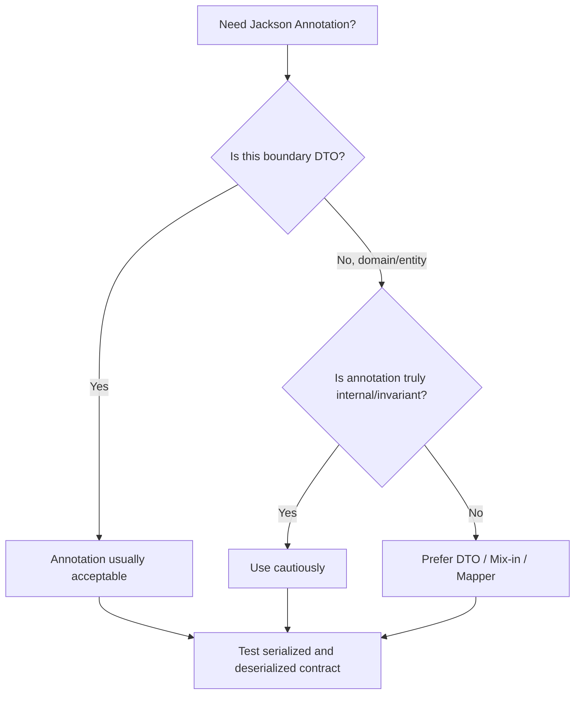

------
title: Learn Java Data Mapper, JSON/XML Processing & Validation - Part 013
description: Jackson annotations untuk precise contract control: naming, inclusion, ignoring, aliases, ordering, access mode, formatting, views, any getter/setter, mix-ins, dan annotation governance.
series: learn-java-data-mapper-json-xml-validation
seriesTitle: Learn Java Data Mapper, JSON/XML Processing & Validation
order: 13
partTitle: Jackson Annotations: Naming, Inclusion, Ignoring, Ordering, Views, Aliases
tags:
- java
- jackson
- annotations
- json
- serialization
- deserialization
- api-contract
- data-mapper
- dto
date: 2026-06-29
---

# Part 013 — Jackson Annotations: Naming, Inclusion, Ignoring, Ordering, Views, Aliases

> **Target skill:** mampu memakai Jackson annotations sebagai alat desain contract yang presisi, bukan sebagai tambalan acak agar JSON “kelihatan benar”.

Jackson annotations terlihat sederhana:

```java
@JsonProperty("customer_id")
String customerId;
```

Tetapi di production, annotation bisa menjadi contract decision.

Satu `@JsonIgnore` bisa membuat field hilang dari API response.

Satu `@JsonInclude(Include.NON_NULL)` bisa mengubah arti null vs absence.

Satu `@JsonAlias` bisa membuat field lama tetap diterima selama migrasi.

Satu `@JsonProperty(access = WRITE_ONLY)` bisa mencegah password keluar di response.

Satu `@JsonFormat` bisa membuat date-time berubah shape.

Artinya:

> **Jackson annotations are not decoration. They are boundary policy.**

Part ini membahas annotations yang paling sering dipakai, kapan tepat memakainya, failure mode, anti-pattern, dan test strategy.

---

## 1. Kaufman Deconstruction

Skill annotation control kita pecah menjadi subskill:

| Subskill | Kemampuan |
|---|---|
| Classify annotation impact | Tahu annotation memengaruhi serialization, deserialization, atau keduanya |
| Control wire names | Mengatur field name tanpa mengubah Java name |
| Control presence | Mengatur null/empty/default inclusion |
| Control visibility | Mengabaikan field, read-only/write-only, property access |
| Handle evolution | Menggunakan alias dan backward-compatible input |
| Format values | Mengatur date/time/enum/number shape |
| Model dynamic fields | Menggunakan `@JsonAnyGetter`/`@JsonAnySetter` |
| Avoid annotation coupling | Tidak mencemari domain/entity dengan external contract |
| Test contract output | Golden sample dan compatibility assertions |

Latihan:

1. Buat DTO response.
2. Tambahkan `@JsonProperty`, `@JsonInclude`, `@JsonIgnoreProperties`.
3. Buat payload lama dengan field alias.
4. Test serialization output.
5. Test deserialization input lama dan baru.
6. Pastikan field secret tidak pernah keluar.
7. Pastikan null/absence sesuai contract.

---

## 2. Annotation Decision Model

Sebelum menambahkan annotation, jawab tiga pertanyaan:



Rule praktis:

| Location | Annotation policy |
|---|---|
| Request DTO | generally acceptable |
| Response DTO | generally acceptable |
| Event DTO | acceptable, but compatibility-tested |
| Domain model | avoid unless serialization is intrinsic |
| Persistence entity | avoid exposing as API contract |
| Third-party class | use mix-in or custom serializer |
| Shared library model | be careful; annotation affects all consumers |

---

## 3. `@JsonProperty`

`@JsonProperty` mengatur nama property di JSON dan bisa dipakai untuk field, method, constructor parameter, atau record component.

```java
public record CustomerResponse(
    @JsonProperty("customer_id")
    String customerId,

    @JsonProperty("full_name")
    String fullName
) {}
```

Output:

```json
{
  "customer_id": "CUS-001",
  "full_name": "Ana Maria"
}
```

### 3.1 When to Use

Gunakan saat:

- wire contract memakai snake_case, kebab-case, atau legacy name
- Java name lebih expressive daripada external field
- field name external tidak valid sebagai Java identifier
- constructor/record parameter perlu explicit binding
- ingin mempertahankan contract saat Java refactor

### 3.2 Prefer Naming Strategy for Global Convention

Jika seluruh API memakai snake_case, pertimbangkan naming strategy di `ObjectMapper`.

```java
ObjectMapper mapper = JsonMapper.builder()
    .propertyNamingStrategy(PropertyNamingStrategies.SNAKE_CASE)
    .build();
```

DTO:

```java
public record CustomerResponse(
    String customerId,
    String fullName
) {}
```

Output tetap:

```json
{
  "customer_id": "CUS-001",
  "full_name": "Ana Maria"
}
```

Decision:

| Need | Approach |
|---|---|
| one-off field name | `@JsonProperty` |
| global convention | naming strategy |
| legacy exception | naming strategy + targeted `@JsonProperty` |
| external provider model | explicit annotations often better |

### 3.3 Refactoring Safety

Jika Java field rename tetapi wire name harus stabil:

```java
public record CustomerResponse(
    @JsonProperty("customer_id")
    String id
) {}
```

Consumer tetap melihat `customer_id`.

Namun jangan gunakan annotation untuk menyembunyikan model yang membingungkan. Java name tetap harus jelas.

---

## 4. `@JsonAlias`

`@JsonAlias` menerima nama alternatif saat deserialization. Biasanya untuk backward-compatible input.

```java
public record CustomerRequest(
    @JsonProperty("fullName")
    @JsonAlias({"customerName", "name"})
    String fullName
) {}
```

Input baru:

```json
{ "fullName": "Ana" }
```

Input lama:

```json
{ "customerName": "Ana" }
```

Keduanya bisa dibaca.

Important:

- `@JsonAlias` umumnya untuk input/deserialization.
- Serialization tetap memakai primary property name.
- Alias sebaiknya punya sunset plan.

### 4.1 Contract Evolution Example

Versi lama:

```json
{ "customerName": "Ana" }
```

Versi baru:

```json
{ "fullName": "Ana" }
```

DTO transisi:

```java
public record UpdateCustomerRequest(
    @JsonProperty("fullName")
    @JsonAlias("customerName")
    @NotBlank
    String fullName
) {}
```

Test:

```java
@Test
void acceptsOldCustomerNameDuringMigration() throws Exception {
    UpdateCustomerRequest request = mapper.readValue("""
    { "customerName": "Ana" }
    """, UpdateCustomerRequest.class);

    assertThat(request.fullName()).isEqualTo("Ana");
}
```

Tambahkan telemetry jika field lama masih dipakai. Jangan biarkan alias selamanya tanpa alasan.

---

## 5. `@JsonIgnore`

`@JsonIgnore` mengabaikan property.

```java
public record UserInternalModel(
    String username,

    @JsonIgnore
    String passwordHash
) {}
```

Masalah: annotation ini berlaku pada serialization dan deserialization, kecuali dikombinasikan dengan mekanisme lain.

Untuk password input, lebih baik gunakan access mode.

---

## 6. `@JsonProperty(access = ...)`

Access mode lebih presisi untuk read-only/write-only.

```java
public record CreateUserRequest(
    String username,

    @JsonProperty(access = JsonProperty.Access.WRITE_ONLY)
    String password
) {}
```

`WRITE_ONLY` berarti bisa dibaca dari input JSON, tetapi tidak ditulis ke output JSON.

Untuk generated field:

```java
public record AccountResponse(
    @JsonProperty(access = JsonProperty.Access.READ_ONLY)
    String accountId,

    String displayName
) {}
```

`READ_ONLY` berarti output-only dari perspektif JSON binding.

Decision:

| Need | Use |
|---|---|
| never serialize or deserialize | `@JsonIgnore` |
| accept input but never output | `WRITE_ONLY` |
| output but ignore input | `READ_ONLY` |
| role-specific output | DTO split or `@JsonView` with caution |

Security rule:

> **Do not rely only on accidental DTO reuse. Mark secret fields write-only or split request/response DTO.**

Best default:

```java
public record CreateUserRequest(
    String username,
    String password
) {}

public record UserResponse(
    String userId,
    String username
) {}
```

DTO split is often clearer than access annotation.

---

## 7. `@JsonIgnoreProperties`

Ignore multiple properties at class level.

```java
@JsonIgnoreProperties(ignoreUnknown = true)
public record ProviderEvent(
    String eventId,
    String eventType
) {}
```

This accepts additional unknown fields during deserialization.

Use carefully:

| Boundary | Policy |
|---|---|
| internal command API | often strict: reject unknown |
| external provider event | often tolerant: ignore/capture unknown |
| public API request | depends on compatibility/security posture |
| audit import | maybe capture unknown, not ignore |

### 7.1 Ignore Specific Fields

```java
@JsonIgnoreProperties({"internalState", "debugInfo"})
public record CaseResponse(
    String caseId,
    String status,
    String internalState,
    String debugInfo
) {}
```

This is usually less clean than simply not putting those fields in DTO.

---

## 8. `@JsonInclude`

Controls when values are included during serialization.

```java
@JsonInclude(JsonInclude.Include.NON_NULL)
public record CustomerResponse(
    String customerId,
    String middleName
) {}
```

If `middleName == null`, output omits it:

```json
{
  "customerId": "CUS-001"
}
```

### 8.1 Common Inclusion Modes

| Mode | Meaning |
|---|---|
| `ALWAYS` | include property regardless of value |
| `NON_NULL` | omit only null |
| `NON_ABSENT` | omit null and absent reference types such as Optional-like values |
| `NON_EMPTY` | omit null, empty string, empty collection, empty array depending type |
| `NON_DEFAULT` | omit default values |

### 8.2 Contract Risk

`NON_NULL` changes wire shape:

With null included:

```json
{
  "middleName": null
}
```

With null omitted:

```json
{
  "customerId": "CUS-001"
}
```

These can mean different things to clients.

Use `NON_NULL` when absence and null are contract-equivalent.

Do not use `NON_NULL` globally if some fields require explicit null.

### 8.3 Request vs Response

`@JsonInclude` affects serialization, not input validation.

Validation still needs:

```java
public record CreateCustomerRequest(
    @NotBlank String fullName
) {}
```

---

## 9. `@JsonFormat`

Controls value format.

Common examples:

```java
public record EventResponse(
    @JsonFormat(shape = JsonFormat.Shape.STRING)
    Instant occurredAt
) {}
```

Date formatting:

```java
public record ReportRequest(
    @JsonFormat(pattern = "yyyy-MM-dd")
    LocalDate reportDate
) {}
```

Enum formatting:

```java
public enum RiskLevel {
    LOW,
    MEDIUM,
    HIGH
}
```

Sometimes external contract requires object shape, but be cautious.

### 9.1 Prefer ISO Formats

For machine contracts:

| Type | Preferred JSON |
|---|---|
| `Instant` | `"2026-06-29T03:00:00Z"` |
| `OffsetDateTime` | `"2026-06-29T10:00:00+07:00"` |
| `LocalDate` | `"2026-06-29"` |
| `YearMonth` | `"2026-06"` |

Avoid locale-dependent dates:

```txt
29/06/2026
06/29/2026
```

unless legacy contract forces it.

### 9.2 Annotation vs ObjectMapper Config

If all dates should be ISO strings, configure mapper:

```java
ObjectMapper mapper = JsonMapper.builder()
    .addModule(new JavaTimeModule())
    .disable(SerializationFeature.WRITE_DATES_AS_TIMESTAMPS)
    .build();
```

Use `@JsonFormat` for field-specific exceptions.

---

## 10. `@JsonValue` and `@JsonCreator`

Useful for value objects and enums.

### 10.1 Enum with External Code

```java
public enum PaymentStatus {
    WAITING("WAITING"),
    PAID("PAID"),
    FAILED("FAILED");

    private final String code;

    PaymentStatus(String code) {
        this.code = code;
    }

    @JsonValue
    public String code() {
        return code;
    }

    @JsonCreator
    public static PaymentStatus fromCode(String raw) {
        if (raw == null) {
            return null;
        }

        return switch (raw.trim().toUpperCase(Locale.ROOT)) {
            case "WAITING" -> WAITING;
            case "PAID" -> PAID;
            case "FAILED" -> FAILED;
            default -> throw new IllegalArgumentException("Unknown payment status: " + raw);
        };
    }
}
```

Output:

```json
"PAID"
```

### 10.2 Value Object

```java
public record CustomerId(String value) {
    public CustomerId {
        if (value == null || value.isBlank()) {
            throw new IllegalArgumentException("customer id is required");
        }
    }

    @JsonValue
    public String value() {
        return value;
    }

    @JsonCreator
    public static CustomerId of(String value) {
        return new CustomerId(value);
    }
}
```

Payload:

```json
{
  "customerId": "CUS-001"
}
```

This can be elegant, but it couples value object to JSON shape. For core domain libraries used outside JSON, consider external serializer/deserializer or DTO mapper.

---

## 11. `@JsonGetter` and `@JsonSetter`

`@JsonGetter` and `@JsonSetter` can control method-based property names.

```java
public class CustomerDto {
    private String customerId;

    @JsonGetter("customer_id")
    public String getCustomerId() {
        return customerId;
    }

    @JsonSetter("customer_id")
    public void setCustomerId(String customerId) {
        this.customerId = customerId;
    }
}
```

For records or modern DTOs, `@JsonProperty` is usually enough.

Use getter/setter annotations when working with JavaBean-style classes or legacy models.

---

## 12. `@JsonAnyGetter` and `@JsonAnySetter`

For extension fields.

```java
public final class ProviderEvent {
    private String eventId;
    private String eventType;
    private final Map<String, JsonNode> extensions = new LinkedHashMap<>();

    public String getEventId() {
        return eventId;
    }

    public String getEventType() {
        return eventType;
    }

    @JsonAnySetter
    public void putExtension(String name, JsonNode value) {
        extensions.put(name, value);
    }

    @JsonAnyGetter
    public Map<String, JsonNode> extensions() {
        return extensions;
    }
}
```

Input:

```json
{
  "eventId": "evt-001",
  "eventType": "customer.updated",
  "providerSpecificField": "x"
}
```

Unknown field masuk `extensions`.

Use this when:

- provider may add fields
- forward compatibility matters
- raw extension data should be preserved
- unknown fields should be observed

Do not use this as excuse to accept anything forever. Add limits and monitoring.

---

## 13. `@JsonUnwrapped`

Flattens nested object properties.

```java
public record CustomerResponse(
    String customerId,

    @JsonUnwrapped
    AddressResponse address
) {}
```

If address is:

```java
public record AddressResponse(
    String city,
    String country
) {}
```

Output:

```json
{
  "customerId": "CUS-001",
  "city": "Jakarta",
  "country": "ID"
}
```

This can be useful for legacy flat payloads, but has risks:

- name collision
- unclear ownership
- harder evolution
- less explicit structure
- awkward null behavior

Prefer nested object for new contracts unless flat shape is required.

---

## 14. `@JsonView`

`@JsonView` allows different views from same model.

```java
public final class Views {
    public interface Public {}
    public interface Internal extends Public {}
}
```

```java
public record UserDto(
    @JsonView(Views.Public.class)
    String username,

    @JsonView(Views.Internal.class)
    String riskScore
) {}
```

Serialization:

```java
String publicJson = mapper
    .writerWithView(Views.Public.class)
    .writeValueAsString(user);
```

Use carefully.

Pros:

- fewer DTO classes
- useful for simple visibility variants

Cons:

- hidden contract complexity
- easy to leak by using wrong writer
- validation and mapping still complicated
- field visibility scattered
- not ideal for large API surfaces

Default recommendation:

| Situation | Recommended |
|---|---|
| small admin/internal variant | `@JsonView` may be acceptable |
| public vs internal API | separate DTOs usually better |
| security-sensitive fields | separate DTOs + tests |
| many variants | projection layer / explicit response models |

---

## 15. `@JsonPropertyOrder`

Controls output order.

```java
@JsonPropertyOrder({
    "eventId",
    "eventType",
    "occurredAt",
    "payload"
})
public record EventEnvelope(
    String eventId,
    String eventType,
    Instant occurredAt,
    JsonNode payload
) {}
```

JSON object order is often semantically irrelevant, but ordering can help:

- golden sample stability
- human readability
- signature/canonicalization workflows if explicitly controlled
- legacy systems that wrongly expect order

For cryptographic signing, do not casually rely on normal JSON object order. Use a proper canonicalization strategy.

---

## 16. `@JsonRootName`

For root wrapping when configured.

```java
@JsonRootName("customer")
public record CustomerResponse(
    String customerId,
    String fullName
) {}
```

With root wrapping enabled, output can be:

```json
{
  "customer": {
    "customerId": "CUS-001",
    "fullName": "Ana"
  }
}
```

Useful for legacy APIs. Rarely needed for modern JSON APIs.

---

## 17. Mix-ins

Mix-ins allow adding Jackson annotations to classes you cannot or should not modify.

Third-party class:

```java
public class ExternalMoney {
    private BigDecimal amount;
    private String currency;
}
```

Mix-in:

```java
abstract class ExternalMoneyMixin {
    @JsonProperty("amount")
    abstract BigDecimal getAmount();

    @JsonProperty("currency")
    abstract String getCurrency();
}
```

Register:

```java
ObjectMapper mapper = JsonMapper.builder()
    .addMixIn(ExternalMoney.class, ExternalMoneyMixin.class)
    .build();
```

Use mix-ins for:

- third-party classes
- generated classes
- domain classes you do not want to annotate
- multiple serialization profiles

Risk:

- configuration is less visible than annotation on class
- drift if class changes
- needs explicit tests

---

## 18. Annotation Placement

Annotations can be placed on:

- field
- getter
- setter
- constructor parameter
- record component
- class
- enum method
- factory method

For records:

```java
public record CustomerResponse(
    @JsonProperty("customer_id")
    String customerId
) {}
```

For immutable class:

```java
public final class CustomerResponse {
    private final String customerId;

    @JsonCreator
    public CustomerResponse(
        @JsonProperty("customer_id") String customerId
    ) {
        this.customerId = customerId;
    }

    @JsonProperty("customer_id")
    public String customerId() {
        return customerId;
    }
}
```

Be consistent. Mixed placement can create confusing behavior.

---

## 19. Annotation Governance

In large codebases, annotations need rules.

### 19.1 Good Annotation Policy

```txt
Request/response/event DTOs may use Jackson annotations.
Domain entities should avoid Jackson annotations unless intentionally serialized as value objects.
Persistence entities must not be exposed as API response.
Access-control-sensitive fields require explicit tests.
@JsonIgnoreProperties(ignoreUnknown = true) requires boundary justification.
@JsonInclude global policy must be documented.
@JsonAlias requires deprecation tracking.
```

### 19.2 Annotation Review Checklist

For every Jackson annotation in PR:

- What contract behavior changes?
- Serialization, deserialization, or both?
- Is this on DTO/domain/entity?
- Is there a golden test?
- Does it affect null vs absence?
- Does it affect secret fields?
- Does it maintain backward compatibility?
- Is there a better DTO split?
- Is there mapper-level alternative?
- Is the behavior local or global?

---

## 20. Golden Contract Tests

Serialization test:

```java
@Test
void customerResponse_serializesExpectedContract() throws Exception {
    CustomerResponse response = new CustomerResponse("CUS-001", "Ana", null);

    String json = mapper.writeValueAsString(response);

    assertThatJson(json).isEqualTo("""
    {
      "customer_id": "CUS-001",
      "full_name": "Ana"
    }
    """);
}
```

Deserialization alias test:

```java
@Test
void customerRequest_acceptsLegacyCustomerNameAlias() throws Exception {
    CustomerRequest request = mapper.readValue("""
    { "customerName": "Ana" }
    """, CustomerRequest.class);

    assertThat(request.fullName()).isEqualTo("Ana");
}
```

Secret field test:

```java
@Test
void createUserRequest_doesNotSerializePassword() throws Exception {
    CreateUserRequest request = new CreateUserRequest("ana", "secret");

    String json = mapper.writeValueAsString(request);

    assertThat(json).doesNotContain("secret");
    assertThat(json).doesNotContain("password");
}
```

Unknown strictness test:

```java
@Test
void commandRequest_rejectsUnknownField() {
    assertThatThrownBy(() -> mapper.readValue("""
    {
      "amount": "100.00",
      "unknown": "x"
    }
    """, CreatePaymentRequest.class))
    .isInstanceOf(JsonProcessingException.class);
}
```

---

## 21. Common Anti-Patterns

### 21.1 Annotating Entity Until It Becomes API

```java
@Entity
@JsonIgnoreProperties({"hibernateLazyInitializer", "handler"})
public class Order {
    // ...
}
```

This often indicates the entity is being serialized directly.

Better: create response DTO.

### 21.2 Global `NON_NULL` Without Contract Review

Global null omission can break clients that rely on explicit null.

### 21.3 `@JsonIgnore` for Security Without DTO Split

It may work today but become fragile with future refactoring.

### 21.4 `@JsonView` for Complex Authorization

Authorization should not depend only on view selection. Use explicit use-case projection and tests.

### 21.5 Alias Forever

Aliases should exist for compatibility window, not as unbounded contract entropy.

### 21.6 Annotation Hiding Bad Names

If Java property is confusing, annotation should not be the only fix. Improve model naming if possible.

---

## 22. Decision Matrix

| Problem | Best Default | Alternative |
|---|---|---|
| one field has legacy JSON name | `@JsonProperty` | custom naming strategy if widespread |
| whole API uses snake_case | naming strategy | per-field annotation |
| old input field name accepted | `@JsonAlias` | custom deserializer for complex migration |
| secret input must not serialize | DTO split or `WRITE_ONLY` | `@JsonIgnore` if not input either |
| omit null fields | `@JsonInclude(NON_NULL)` local | mapper-level inclusion if global contract |
| dynamic extension fields | `@JsonAnySetter`/`@JsonAnyGetter` | `JsonNode extensions` |
| third-party class annotations | mix-in | custom serializer |
| role-specific response | separate DTOs | `@JsonView` for simple cases |
| date format exception | `@JsonFormat` | global mapper config |
| enum external code | `@JsonValue` + `@JsonCreator` | custom serializer/deserializer |

---

## 23. Mini Case Study: Customer Contract Evolution

### 23.1 Old Contract

```json
{
  "customerName": "Ana",
  "mobile": "08123456789"
}
```

### 23.2 New Contract

```json
{
  "fullName": "Ana",
  "phoneNumber": "08123456789"
}
```

### 23.3 Transitional Request DTO

```java
@JsonIgnoreProperties(ignoreUnknown = false)
public record UpdateCustomerRequest(
    @JsonProperty("fullName")
    @JsonAlias("customerName")
    @NotBlank
    String fullName,

    @JsonProperty("phoneNumber")
    @JsonAlias("mobile")
    @NotBlank
    String phoneNumber
) {}
```

### 23.4 Response DTO

```java
@JsonInclude(JsonInclude.Include.NON_NULL)
public record CustomerResponse(
    @JsonProperty("customerId")
    String customerId,

    @JsonProperty("fullName")
    String fullName,

    @JsonProperty("phoneNumber")
    String phoneNumber,

    @JsonProperty(access = JsonProperty.Access.READ_ONLY)
    Instant updatedAt
) {}
```

### 23.5 Tests

```java
@Test
void acceptsOldRequestFields() throws Exception {
    UpdateCustomerRequest request = mapper.readValue("""
    {
      "customerName": "Ana",
      "mobile": "08123456789"
    }
    """, UpdateCustomerRequest.class);

    assertThat(request.fullName()).isEqualTo("Ana");
    assertThat(request.phoneNumber()).isEqualTo("08123456789");
}
```

```java
@Test
void serializesOnlyNewResponseFields() throws Exception {
    CustomerResponse response = new CustomerResponse(
        "CUS-001",
        "Ana",
        "08123456789",
        Instant.parse("2026-06-29T03:00:00Z")
    );

    String json = mapper.writeValueAsString(response);

    assertThat(json).contains("fullName");
    assertThat(json).contains("phoneNumber");
    assertThat(json).doesNotContain("customerName");
    assertThat(json).doesNotContain("mobile");
}
```

This is controlled evolution:

- old input accepted
- new output emitted
- unknown fields rejected
- deprecation can be measured
- response contract moves forward

---

## 24. Practice Drill

Given this legacy payload:

```json
{
  "cust_id": "CUS-001",
  "name": "Ana",
  "phone": "08123456789",
  "created": "29/06/2026",
  "password": "secret",
  "extra_provider_code": "X1"
}
```

Design:

1. Request DTO that accepts this payload.
2. New canonical output DTO.
3. Alias strategy.
4. Date format strategy.
5. Secret handling strategy.
6. Unknown/extension field policy.
7. Tests for:
   - old input accepted
   - new input accepted
   - password not serialized
   - invalid date rejected
   - unknown field accepted or rejected based on chosen policy
   - null/absence behavior

---

## 25. Summary

Jackson annotations are powerful because they sit exactly at the wire contract boundary.

Mental model:

> **Every Jackson annotation is a contract rule. Treat it like API design, not syntax sugar.**

Rules:

1. Prefer annotations on DTOs, not entities.
2. Use `@JsonProperty` for explicit wire names.
3. Use naming strategy for global naming conventions.
4. Use `@JsonAlias` for backward-compatible input migration.
5. Use `WRITE_ONLY`/`READ_ONLY` instead of blunt ignore when direction matters.
6. Use `@JsonInclude` only after deciding null vs absence semantics.
7. Use `@JsonFormat` for local format exceptions; prefer global config for global policy.
8. Use `@JsonAnyGetter`/`@JsonAnySetter` for governed extension fields.
9. Use `@JsonView` sparingly; separate DTOs are often clearer.
10. Use mix-ins for classes you cannot or should not annotate.
11. Test serialized output and deserialized legacy input.

Part berikutnya membahas custom serializers and deserializers: saat annotation tidak cukup, bagaimana menulis codec yang benar, aman, testable, dan tidak menjadi dumping ground business logic.

---

## References

- Jackson Annotations Package Javadocs: https://javadoc.io/doc/com.fasterxml.jackson.core/jackson-annotations/latest/index.html
- Jackson `JsonProperty` Javadoc: https://www.javadoc.io/doc/com.fasterxml.jackson.core/jackson-annotations/latest/com/fasterxml/jackson/annotation/JsonProperty.html
- Jackson Annotations Wiki: https://github.com/FasterXML/jackson-annotations/wiki/Jackson-Annotations
- Jackson Databind Repository: https://github.com/FasterXML/jackson-databind
