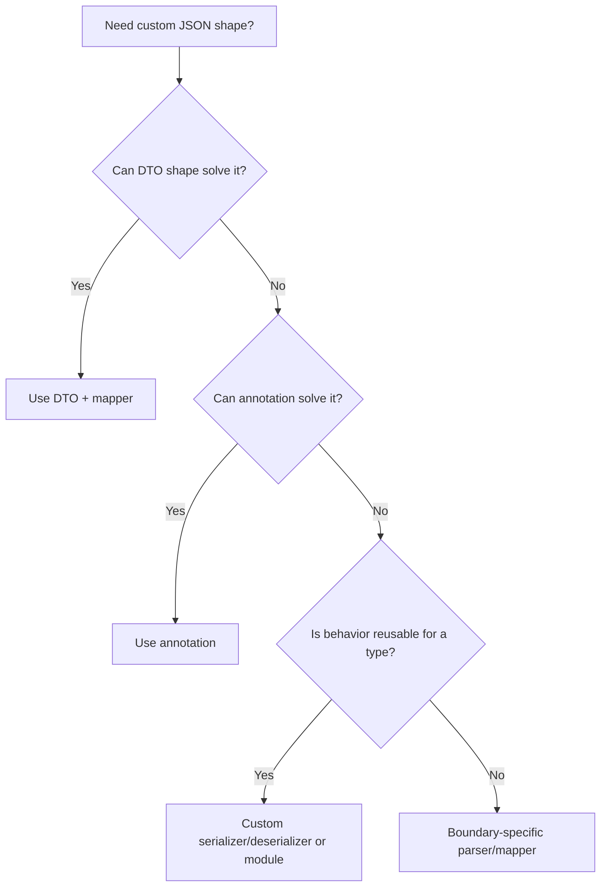
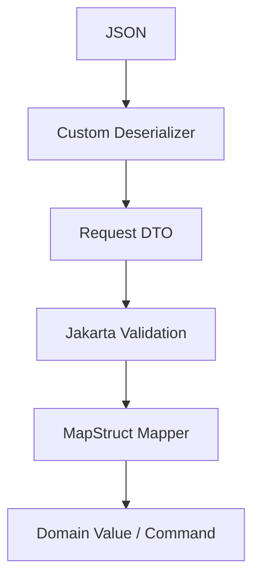

------
title: Learn Java Data Mapper, JSON/XML Processing & Validation - Part 014
description: Custom Jackson serializers and deserializers: JsonSerializer, JsonDeserializer, StdSerializer, StdDeserializer, module registration, contextual codec, error handling, testing, and production rules.
series: learn-java-data-mapper-json-xml-validation
seriesTitle: Learn Java Data Mapper, JSON/XML Processing & Validation
order: 14
partTitle: Custom Serializers and Deserializers: When Annotation Is Not Enough
tags:
- java
- jackson
- custom-serializer
- custom-deserializer
- jsonserializer
- jsondeserializer
- module
- serialization
- deserialization
- data-mapper
date: 2026-06-29
---

# Part 014 — Custom Serializers and Deserializers: When Annotation Is Not Enough

> **Target skill:** mampu menulis custom Jackson serializer/deserializer yang benar, kecil, testable, aman, dan dipakai hanya ketika annotation/DTO/mapper tidak cukup.

Annotation cukup untuk banyak kasus:

```java
@JsonProperty("customer_id")
String customerId;
```

Tetapi annotation tidak selalu cukup.

Contoh kebutuhan:

- legacy payload membungkus nilai dalam bentuk aneh
- satu field bisa datang sebagai string atau object
- external provider mengirim amount dalam minor unit tetapi domain butuh money object
- value object ingin diserialisasi sebagai scalar
- field perlu masked saat output
- payload punya discriminator non-standard
- date format legacy membutuhkan parser khusus
- unknown enum harus preserve raw
- third-party class tidak bisa diubah
- JSON shape harus berbeda dari object shape secara signifikan

Di sinilah custom serializers/deserializers masuk.

Namun ini juga area berbahaya. Custom codec mudah berubah menjadi tempat tersembunyi untuk business logic.

Mental model:

> **A custom serializer/deserializer should translate representation, not decide business behavior.**

---

## 1. Kaufman Deconstruction

Subskill custom codec:

| Subskill | Kemampuan |
|---|---|
| Decide necessity | Tahu kapan perlu custom codec dan kapan cukup DTO/annotation |
| Write serializer | Mengubah Java value ke JSON tokens dengan `JsonGenerator` |
| Write deserializer | Membaca JSON tokens dengan `JsonParser` |
| Use standard base classes | Memakai `StdSerializer`/`StdDeserializer` |
| Register locally/globally | Annotation vs module registration |
| Preserve error context | Melaporkan error yang jelas dan path-aware |
| Handle nulls | Memahami null handling dan default behavior |
| Compose with ObjectMapper | Delegasi ke existing serializer/deserializer jika perlu |
| Test round-trip | Fixture valid/invalid/edge |
| Avoid business leakage | Codec hanya representation mapping |

Latihan:

1. Buat `CustomerId` value object.
2. Serialize sebagai string.
3. Deserialize dari string.
4. Buat invalid input tests.
5. Register serializer via annotation.
6. Register serializer via module.
7. Buat custom money serializer/deserializer.
8. Test error messages.

---

## 2. Decision: Annotation, DTO, Mapper, or Custom Codec?



Decision matrix:

| Problem | Best Default |
|---|---|
| rename field | `@JsonProperty` |
| omit null | `@JsonInclude` |
| accept old field name | `@JsonAlias` |
| value object as string | `@JsonValue`/`@JsonCreator` or custom codec |
| third-party class shape | mix-in or custom codec |
| legacy field can be scalar/object | custom deserializer |
| output must mask sensitive value | DTO projection or custom serializer |
| complex event discriminator | custom deserializer or explicit dispatcher |
| domain conversion with business rules | mapper/domain service, not codec |

---

## 3. Serializer Basics

A serializer turns Java object into JSON.

Value object:

```java
public record CustomerId(String value) {
    public CustomerId {
        if (value == null || value.isBlank()) {
            throw new IllegalArgumentException("customer id is required");
        }
    }
}
```

Serializer:

```java
public final class CustomerIdSerializer extends JsonSerializer<CustomerId> {
    @Override
    public void serialize(
        CustomerId value,
        JsonGenerator gen,
        SerializerProvider serializers
    ) throws IOException {
        gen.writeString(value.value());
    }
}
```

Usage with annotation:

```java
public record CustomerResponse(
    @JsonSerialize(using = CustomerIdSerializer.class)
    CustomerId customerId,

    String fullName
) {}
```

Output:

```json
{
  "customerId": "CUS-001",
  "fullName": "Ana"
}
```

---

## 4. `StdSerializer`

`StdSerializer` is a common base class for custom serializers.

```java
public final class CustomerIdStdSerializer extends StdSerializer<CustomerId> {

    public CustomerIdStdSerializer() {
        super(CustomerId.class);
    }

    @Override
    public void serialize(
        CustomerId value,
        JsonGenerator gen,
        SerializerProvider provider
    ) throws IOException {
        gen.writeString(value.value());
    }
}
```

Use `StdSerializer` when you want standard Jackson base behavior and clearer handled type.

---

## 5. Deserializer Basics

A deserializer turns JSON into Java object.

```java
public final class CustomerIdDeserializer extends JsonDeserializer<CustomerId> {
    @Override
    public CustomerId deserialize(
        JsonParser parser,
        DeserializationContext context
    ) throws IOException {
        if (parser.currentToken() != JsonToken.VALUE_STRING) {
            throw context.wrongTokenException(
                parser,
                CustomerId.class,
                JsonToken.VALUE_STRING,
                "customerId must be a string"
            );
        }

        String raw = parser.getValueAsString();

        try {
            return new CustomerId(raw);
        } catch (IllegalArgumentException ex) {
            throw JsonMappingException.from(parser, ex.getMessage(), ex);
        }
    }
}
```

Usage:

```java
public record CustomerRequest(
    @JsonDeserialize(using = CustomerIdDeserializer.class)
    CustomerId customerId
) {}
```

Input:

```json
{
  "customerId": "CUS-001"
}
```

---

## 6. `StdDeserializer`

```java
public final class CustomerIdStdDeserializer extends StdDeserializer<CustomerId> {

    public CustomerIdStdDeserializer() {
        super(CustomerId.class);
    }

    @Override
    public CustomerId deserialize(
        JsonParser parser,
        DeserializationContext context
    ) throws IOException {
        if (parser.currentToken() != JsonToken.VALUE_STRING) {
            return (CustomerId) context.handleUnexpectedToken(
                CustomerId.class,
                parser
            );
        }

        String raw = parser.getText();

        try {
            return new CustomerId(raw);
        } catch (IllegalArgumentException ex) {
            throw JsonMappingException.from(parser, ex.getMessage(), ex);
        }
    }
}
```

---

## 7. Registering Codec with Module

Annotation localizes codec to property/class. Module registration applies type-wide.

```java
SimpleModule module = new SimpleModule("CustomerIdModule")
    .addSerializer(CustomerId.class, new CustomerIdSerializer())
    .addDeserializer(CustomerId.class, new CustomerIdDeserializer());

ObjectMapper mapper = JsonMapper.builder()
    .addModule(module)
    .build();
```

Decision:

| Registration | When |
|---|---|
| property annotation | one field only |
| class annotation | type owns JSON representation |
| module | shared representation across app |
| mix-in | external class or alternate profile |
| ObjectReader/ObjectWriter | boundary-specific behavior |

Be careful with global registration. It affects every occurrence of that type for that mapper.

---

## 8. Custom Money Serializer

Domain type:

```java
public record Money(BigDecimal amount, Currency currency) {
    public Money {
        if (amount == null) {
            throw new IllegalArgumentException("amount is required");
        }
        if (currency == null) {
            throw new IllegalArgumentException("currency is required");
        }
        if (amount.scale() > currency.getDefaultFractionDigits()) {
            throw new IllegalArgumentException("invalid scale for currency");
        }
    }
}
```

Wire shape:

```json
{
  "amount": "100.00",
  "currency": "IDR"
}
```

Serializer:

```java
public final class MoneySerializer extends StdSerializer<Money> {

    public MoneySerializer() {
        super(Money.class);
    }

    @Override
    public void serialize(
        Money value,
        JsonGenerator gen,
        SerializerProvider provider
    ) throws IOException {
        gen.writeStartObject();
        gen.writeStringField("amount", value.amount().toPlainString());
        gen.writeStringField("currency", value.currency().getCurrencyCode());
        gen.writeEndObject();
    }
}
```

Why `toPlainString()`?

- avoids scientific notation
- clearer for money contracts
- preserves decimal representation better than generic formatting

Still test scale behavior explicitly.

---

## 9. Custom Money Deserializer

```java
public final class MoneyDeserializer extends StdDeserializer<Money> {

    public MoneyDeserializer() {
        super(Money.class);
    }

    @Override
    public Money deserialize(
        JsonParser parser,
        DeserializationContext context
    ) throws IOException {
        if (parser.currentToken() != JsonToken.START_OBJECT) {
            return (Money) context.handleUnexpectedToken(Money.class, parser);
        }

        BigDecimal amount = null;
        Currency currency = null;

        while (parser.nextToken() != JsonToken.END_OBJECT) {
            String fieldName = parser.currentName();
            parser.nextToken();

            switch (fieldName) {
                case "amount" -> amount = readAmount(parser);
                case "currency" -> currency = readCurrency(parser);
                default -> parser.skipChildren();
            }
        }

        if (amount == null) {
            throw JsonMappingException.from(parser, "amount is required");
        }
        if (currency == null) {
            throw JsonMappingException.from(parser, "currency is required");
        }

        try {
            return new Money(amount, currency);
        } catch (IllegalArgumentException ex) {
            throw JsonMappingException.from(parser, ex.getMessage(), ex);
        }
    }

    private BigDecimal readAmount(JsonParser parser) throws IOException {
        if (parser.currentToken() != JsonToken.VALUE_STRING) {
            throw JsonMappingException.from(parser, "amount must be decimal string");
        }

        try {
            return new BigDecimal(parser.getText());
        } catch (NumberFormatException ex) {
            throw JsonMappingException.from(parser, "amount must be decimal string", ex);
        }
    }

    private Currency readCurrency(JsonParser parser) throws IOException {
        if (parser.currentToken() != JsonToken.VALUE_STRING) {
            throw JsonMappingException.from(parser, "currency must be string");
        }

        try {
            return Currency.getInstance(parser.getText());
        } catch (IllegalArgumentException ex) {
            throw JsonMappingException.from(parser, "currency must be ISO-4217 code", ex);
        }
    }
}
```

Note the split:

- deserializer parses representation
- `Money` constructor enforces invariant
- business rounding/fee decision is not inside deserializer

---

## 10. Scalar-or-Object Deserializer

Legacy providers sometimes send inconsistent shape.

Input variant A:

```json
{
  "customer": "CUS-001"
}
```

Input variant B:

```json
{
  "customer": {
    "id": "CUS-001",
    "name": "Ana"
  }
}
```

Target:

```java
public record CustomerRef(
    String id,
    String displayName
) {}
```

Deserializer:

```java
public final class CustomerRefDeserializer extends StdDeserializer<CustomerRef> {

    public CustomerRefDeserializer() {
        super(CustomerRef.class);
    }

    @Override
    public CustomerRef deserialize(
        JsonParser parser,
        DeserializationContext context
    ) throws IOException {
        JsonToken token = parser.currentToken();

        if (token == JsonToken.VALUE_STRING) {
            return new CustomerRef(parser.getText(), null);
        }

        if (token == JsonToken.START_OBJECT) {
            String id = null;
            String name = null;

            while (parser.nextToken() != JsonToken.END_OBJECT) {
                String field = parser.currentName();
                parser.nextToken();

                switch (field) {
                    case "id" -> id = parser.getValueAsString();
                    case "name" -> name = parser.getValueAsString();
                    default -> parser.skipChildren();
                }
            }

            if (id == null || id.isBlank()) {
                throw JsonMappingException.from(parser, "customer.id is required");
            }

            return new CustomerRef(id, name);
        }

        return (CustomerRef) context.handleUnexpectedToken(CustomerRef.class, parser);
    }
}
```

This is a representation compatibility bridge. Add deprecation and telemetry if one shape should disappear later.

---

## 11. Delegating to Existing Deserializer

Sometimes custom deserializer needs to read a helper DTO.

```java
public record MoneyJson(
    String amount,
    String currency
) {}
```

```java
public final class MoneyDelegatingDeserializer extends StdDeserializer<Money> {

    public MoneyDelegatingDeserializer() {
        super(Money.class);
    }

    @Override
    public Money deserialize(
        JsonParser parser,
        DeserializationContext context
    ) throws IOException {
        ObjectCodec codec = parser.getCodec();
        MoneyJson json = codec.readValue(parser, MoneyJson.class);

        try {
            return new Money(
                new BigDecimal(json.amount()),
                Currency.getInstance(json.currency())
            );
        } catch (RuntimeException ex) {
            throw JsonMappingException.from(parser, "invalid money", ex);
        }
    }
}
```

This is simpler, but it materializes helper object and delegates shape parsing to databind.

Use this when:

- payload object is not huge
- helper DTO is clearer
- you want annotation/validation-like shape
- token-level parsing is unnecessary

---

## 12. Contextual Serializer

Sometimes serialization depends on property annotation.

Example annotation:

```java
@Target({ ElementType.FIELD, ElementType.RECORD_COMPONENT })
@Retention(RetentionPolicy.RUNTIME)
public @interface Masked {
    int visibleLast() default 4;
}
```

Serializer:

```java
public final class MaskedStringSerializer
    extends JsonSerializer<String>
    implements ContextualSerializer {

    private final int visibleLast;

    public MaskedStringSerializer() {
        this(4);
    }

    private MaskedStringSerializer(int visibleLast) {
        this.visibleLast = visibleLast;
    }

    @Override
    public void serialize(
        String value,
        JsonGenerator gen,
        SerializerProvider serializers
    ) throws IOException {
        if (value == null) {
            gen.writeNull();
            return;
        }

        int keep = Math.min(visibleLast, value.length());
        String suffix = value.substring(value.length() - keep);
        gen.writeString("***" + suffix);
    }

    @Override
    public JsonSerializer<?> createContextual(
        SerializerProvider prov,
        BeanProperty property
    ) {
        if (property != null) {
            Masked annotation = property.getAnnotation(Masked.class);
            if (annotation != null) {
                return new MaskedStringSerializer(annotation.visibleLast());
            }
        }

        return this;
    }
}
```

Usage:

```java
public record CardResponse(
    @Masked(visibleLast = 4)
    @JsonSerialize(using = MaskedStringSerializer.class)
    String cardNumber
) {}
```

Be careful: masking at serialization is not a substitute for not storing or not retrieving sensitive data.

---

## 13. Null Handling

Jackson often handles nulls outside the serializer/deserializer.

Serializer `serialize()` usually receives non-null value unless custom null handling is involved.

For deserialization, if JSON value is null:

```json
{ "customerId": null }
```

Jackson may call `getNullValue()` or set null directly depending context.

You can override:

```java
@Override
public CustomerId getNullValue(DeserializationContext ctxt) throws JsonMappingException {
    return null;
}
```

But validation should still enforce required fields:

```java
public record CustomerRequest(
    @NotNull CustomerId customerId
) {}
```

Do not hide required-field policy entirely in deserializer. Keep validation explicit.

---

## 14. Error Handling

Bad:

```java
throw new RuntimeException("bad money");
```

Better:

```java
throw JsonMappingException.from(parser, "amount must be decimal string");
```

Or:

```java
return (Money) context.handleUnexpectedToken(Money.class, parser);
```

Good errors:

- mention expected type/shape
- avoid leaking secret values
- include field path via Jackson context when possible
- preserve cause
- are stable enough for logging/support

For public API response, map Jackson exceptions to structured error model in higher layer.

Codec should not know HTTP.

---

## 15. Unknown Fields in Custom Deserializer

If you ignore unknown fields:

```java
default -> parser.skipChildren();
```

This is tolerant.

If you reject unknown fields:

```java
default -> throw JsonMappingException.from(
    parser,
    "unknown field for Money: " + fieldName
);
```

Choose per boundary.

For value objects like `Money`, strict is often better.

```java
default -> throw JsonMappingException.from(parser, "unknown money field: " + fieldName);
```

For external provider payloads, tolerant/capture might be better.

---

## 16. Avoid Business Logic in Codec

Bad:

```java
if (amount.compareTo(BigDecimal.valueOf(10_000_000)) > 0) {
    routeToManualReview();
}
```

This is business decision inside deserialization.

Better:

```java
Money money = mapper.readValue(json, Money.class);
riskService.evaluate(money);
```

Allowed in codec:

- parse
- normalize representation
- construct value object
- reject structurally invalid value
- convert external code to internal representation when mapping is representation-level and stable

Not allowed in codec:

- authorization
- workflow state transition
- pricing
- risk scoring
- persistence lookup
- network call
- feature flag business branching
- user-specific behavior

---

## 17. Custom Enum Deserializer with Raw Preservation

Sometimes unknown enum should be preserved.

```java
public record ProviderStatus(
    String raw,
    Known known
) {
    public enum Known {
        ACTIVE,
        SUSPENDED,
        CLOSED,
        UNRECOGNIZED
    }
}
```

Deserializer:

```java
public final class ProviderStatusDeserializer
    extends StdDeserializer<ProviderStatus> {

    public ProviderStatusDeserializer() {
        super(ProviderStatus.class);
    }

    @Override
    public ProviderStatus deserialize(
        JsonParser parser,
        DeserializationContext context
    ) throws IOException {
        if (parser.currentToken() != JsonToken.VALUE_STRING) {
            return (ProviderStatus) context.handleUnexpectedToken(
                ProviderStatus.class,
                parser
            );
        }

        String raw = parser.getText();
        ProviderStatus.Known known = switch (raw.trim().toUpperCase(Locale.ROOT)) {
            case "ACTIVE" -> ProviderStatus.Known.ACTIVE;
            case "SUSPENDED" -> ProviderStatus.Known.SUSPENDED;
            case "CLOSED" -> ProviderStatus.Known.CLOSED;
            default -> ProviderStatus.Known.UNRECOGNIZED;
        };

        return new ProviderStatus(raw, known);
    }
}
```

This is better than mapping unknown to null.

---

## 18. Module Design

For a group of value objects:

```java
public final class BoundaryValueModule extends SimpleModule {
    public BoundaryValueModule() {
        super("BoundaryValueModule");

        addSerializer(CustomerId.class, new CustomerIdSerializer());
        addDeserializer(CustomerId.class, new CustomerIdDeserializer());

        addSerializer(Money.class, new MoneySerializer());
        addDeserializer(Money.class, new MoneyDeserializer());

        addDeserializer(ProviderStatus.class, new ProviderStatusDeserializer());
    }
}
```

Mapper:

```java
ObjectMapper mapper = JsonMapper.builder()
    .addModule(new JavaTimeModule())
    .addModule(new BoundaryValueModule())
    .build();
```

Governance:

- module name should be explicit
- register in one place
- test module behavior
- avoid multiple modules fighting same type
- document global effects
- version module if used by shared library

---

## 19. Serializer vs Mapper Responsibility

Example:

```java
public record PaymentResponse(
    Money total
) {}
```

Custom serializer can shape `Money`.

But if response needs:

```json
{
  "amount": "100.00",
  "currency": "IDR",
  "display": "IDR 100.00",
  "localEquivalent": "..."
}
```

This is not only money serialization. This is response projection.

Use DTO/mapper:

```java
public record MoneyResponse(
    String amount,
    String currency,
    String display
) {}
```

Mapper:

```java
public MoneyResponse toResponse(Money money, Locale locale) {
    return new MoneyResponse(
        money.amount().toPlainString(),
        money.currency().getCurrencyCode(),
        moneyFormatter.format(money, locale)
    );
}
```

Serializer should not depend on request locale unless context is carefully controlled.

---

## 20. Custom Deserializer and Validation

Deserializer can ensure structural validity. Jakarta Validation handles constraint validity.

DTO:

```java
public record CreatePaymentRequest(
    @NotNull Money amount
) {}
```

Deserializer rejects:

```json
{ "amount": "abc" }
```

Validation rejects:

```json
{ "amount": null }
```

Domain rejects:

```json
{ "amount": { "amount": "100.001", "currency": "IDR" } }
```

depending where scale policy is enforced.

Recommended layering:



---

## 21. Testing Custom Codec

### 21.1 Serializer Test

```java
@Test
void customerId_serializesAsString() throws Exception {
    ObjectMapper mapper = JsonMapper.builder()
        .addModule(new BoundaryValueModule())
        .build();

    String json = mapper.writeValueAsString(new CustomerId("CUS-001"));

    assertThat(json).isEqualTo("\"CUS-001\"");
}
```

### 21.2 Deserializer Test

```java
@Test
void customerId_deserializesFromString() throws Exception {
    ObjectMapper mapper = JsonMapper.builder()
        .addModule(new BoundaryValueModule())
        .build();

    CustomerId id = mapper.readValue("\"CUS-001\"", CustomerId.class);

    assertThat(id.value()).isEqualTo("CUS-001");
}
```

### 21.3 Invalid Token Test

```java
@Test
void customerId_rejectsObject() {
    ObjectMapper mapper = mapperWithModule();

    assertThatThrownBy(() -> mapper.readValue("""
    { "value": "CUS-001" }
    """, CustomerId.class))
    .isInstanceOf(JsonMappingException.class);
}
```

### 21.4 Money Round-Trip

```java
@Test
void money_roundTrip() throws Exception {
    ObjectMapper mapper = mapperWithModule();

    Money input = new Money(new BigDecimal("100.00"), Currency.getInstance("IDR"));

    String json = mapper.writeValueAsString(input);
    Money output = mapper.readValue(json, Money.class);

    assertThat(output).isEqualTo(input);
}
```

### 21.5 Unknown Field Policy

```java
@Test
void money_rejectsUnknownField() {
    ObjectMapper mapper = mapperWithModule();

    assertThatThrownBy(() -> mapper.readValue("""
    {
      "amount": "100.00",
      "currency": "IDR",
      "extra": "x"
    }
    """, Money.class))
    .isInstanceOf(JsonMappingException.class)
    .hasMessageContaining("unknown money field");
}
```

---

## 22. Fuzz and Edge Tests

For codec-heavy code, add edge fixtures:

| Case | Expected |
|---|---|
| missing required field | mapping exception |
| field null | null/validation behavior explicit |
| wrong token type | mapping exception |
| decimal scientific notation | accept/reject explicit |
| leading/trailing whitespace | normalize/reject explicit |
| unknown enum | preserve/reject explicit |
| nested unknown object | skip/reject explicit |
| huge string | limit outside/inside parser |
| invalid Unicode | parser-level failure |
| array instead object | mapping exception |

---

## 23. Performance Considerations

Custom codec can be faster or slower depending design.

Fast:

- token-level parsing
- no intermediate tree
- no reflection for helper DTO
- reusable mapper/module

Slower:

- read subtree into `JsonNode` repeatedly
- convert via string round-trip
- allocate maps/lists unnecessarily
- throw exceptions in normal path
- log per field/item
- do regex for every field without need

Avoid:

```java
JsonNode node = parser.getCodec().readTree(parser);
String raw = node.toString();
SomeType value = anotherMapper.readValue(raw, SomeType.class);
```

This is usually unnecessary round-trip.

---

## 24. Thread Safety and State

Serializers/deserializers registered in modules may be reused.

Do not store per-request mutable state inside codec instance:

```java
public final class BadDeserializer extends StdDeserializer<X> {
    private final List<String> errors = new ArrayList<>(); // bad
}
```

Use local variables inside `deserialize()`.

If contextual behavior is needed, use Jackson contextual interfaces and immutable serializer/deserializer instances.

---

## 25. Security Considerations

Custom deserializers parse untrusted input.

Checklist:

- avoid loading arbitrary classes
- avoid network/database calls
- avoid path/file access
- avoid evaluating expressions
- avoid logging raw secrets
- enforce max size/depth at parser/input layer
- reject unexpected token types
- sanitize error messages
- preserve raw unknown only when governed
- do not enable dangerous polymorphic behavior casually

Custom codec should reduce ambiguity, not increase attack surface.

---

## 26. Anti-Patterns

### 26.1 “Deserializer as Service Layer”

Deserializer calls repository, feature flags, workflow engine, or external API.

### 26.2 “Serializer as View Renderer”

Serializer formats user-specific localized response with permission logic.

Use explicit response mapper.

### 26.3 “Read Tree Then Manually Everything”

If shape is stable, use helper DTO or databind.

### 26.4 “Global Module Surprise”

Registering type-wide serializer changes behavior in endpoints/events that did not expect it.

### 26.5 “Silent Null on Invalid Input”

Returning null on invalid input hides bad payload.

### 26.6 “Catch Exception and Default”

```java
catch (Exception e) {
    return Money.ZERO;
}
```

This corrupts data.

---

## 27. Decision Matrix

| Need | Recommended |
|---|---|
| type always scalar on wire | `@JsonValue`/`@JsonCreator` or type module |
| one property custom shape | property-level `@JsonSerialize`/`@JsonDeserialize` |
| all properties of type same shape | module registration |
| third-party class | mix-in or module |
| legacy scalar/object input | custom deserializer |
| secret masking | DTO projection first, serializer if representation-only |
| dynamic event payload | envelope dispatcher + DTO/tree |
| complex business transformation | mapper/domain service |
| unknown enum preserve raw | custom deserializer/value object |
| export large data | `JsonGenerator` + `ObjectWriter`, not custom serializer alone |

---

## 28. Mini Case Study: External Amount

Provider sends:

```json
{
  "amount": 100000,
  "currency": "IDR",
  "scale": 2
}
```

Meaning: `100000 / 10^2 = 1000.00`.

Domain wants:

```java
Money(new BigDecimal("1000.00"), IDR)
```

Deserializer:

```java
public final class MinorUnitMoneyDeserializer extends StdDeserializer<Money> {

    public MinorUnitMoneyDeserializer() {
        super(Money.class);
    }

    @Override
    public Money deserialize(JsonParser parser, DeserializationContext context)
        throws IOException {

        if (parser.currentToken() != JsonToken.START_OBJECT) {
            return (Money) context.handleUnexpectedToken(Money.class, parser);
        }

        Long minorUnits = null;
        String currencyCode = null;
        Integer scale = null;

        while (parser.nextToken() != JsonToken.END_OBJECT) {
            String field = parser.currentName();
            parser.nextToken();

            switch (field) {
                case "amount" -> {
                    if (!parser.currentToken().isNumeric()) {
                        throw JsonMappingException.from(parser, "amount must be integer minor units");
                    }
                    minorUnits = parser.getLongValue();
                }
                case "currency" -> currencyCode = parser.getValueAsString();
                case "scale" -> scale = parser.getIntValue();
                default -> throw JsonMappingException.from(parser, "unknown money field: " + field);
            }
        }

        if (minorUnits == null) {
            throw JsonMappingException.from(parser, "amount is required");
        }
        if (currencyCode == null) {
            throw JsonMappingException.from(parser, "currency is required");
        }
        if (scale == null) {
            throw JsonMappingException.from(parser, "scale is required");
        }

        BigDecimal amount = BigDecimal.valueOf(minorUnits, scale);
        Currency currency = Currency.getInstance(currencyCode);

        try {
            return new Money(amount, currency);
        } catch (IllegalArgumentException ex) {
            throw JsonMappingException.from(parser, ex.getMessage(), ex);
        }
    }
}
```

This is acceptable representation mapping because provider format uses minor units. Still, business decisions such as fee, rounding, approval, or limits must remain elsewhere.

---

## 29. Practice Drill

Implement custom codec for:

```java
public record AccountNumber(String value) {}
```

Rules:

- wire format is string
- must preserve leading zero
- must match `\d{10,16}`
- serialization outputs plain string
- deserialization rejects number token
- deserialization rejects blank
- no normalization except trim
- error must say account number must be 10-16 digits

Then:

1. Implement serializer.
2. Implement deserializer.
3. Register module.
4. Write valid string test.
5. Write number token rejection test.
6. Write blank rejection test.
7. Write leading zero preservation test.
8. Use in request DTO.
9. Validate null with `@NotNull`.

---

## 30. Summary

Custom serializers and deserializers are powerful because they sit under normal DTO binding.

Mental model:

> **Custom codec is for representation mismatch. Domain decisions belong outside.**

Rules:

1. Try DTO/annotation/mapper before custom codec.
2. Keep codec small and deterministic.
3. Use `JsonGenerator` for serialization.
4. Use `JsonParser` and token checks for deserialization.
5. Use `StdSerializer`/`StdDeserializer` for standard base behavior.
6. Register locally if behavior is field-specific; use module if type-wide.
7. Reject unexpected token types explicitly.
8. Preserve useful error context.
9. Do not silently default invalid input.
10. Do not store mutable request state in codec instance.
11. Test valid, invalid, null, unknown, and round-trip behavior.
12. Treat global module registration as architecture decision.

Part berikutnya membahas polymorphic deserialization: type info, subtypes, sealed hierarchies, and the security risks of letting JSON choose Java types.

---

## References

- Jackson `JsonSerializer` Javadoc: https://www.javadoc.io/doc/com.fasterxml.jackson.core/jackson-databind/latest/com/fasterxml/jackson/databind/JsonSerializer.html
- Jackson `JsonDeserializer` Javadoc: https://www.javadoc.io/doc/com.fasterxml.jackson.core/jackson-databind/latest/com/fasterxml/jackson/databind/JsonDeserializer.html
- Jackson `StdSerializer` Javadoc: https://www.javadoc.io/doc/com.fasterxml.jackson.core/jackson-databind/latest/com/fasterxml/jackson/databind/ser/std/StdSerializer.html
- Jackson `StdDeserializer` Javadoc: https://www.javadoc.io/doc/com.fasterxml.jackson.core/jackson-databind/latest/com/fasterxml/jackson/databind/deser/std/StdDeserializer.html
- Jackson `JsonSerialize` Javadoc: https://www.javadoc.io/doc/com.fasterxml.jackson.core/jackson-databind/latest/com/fasterxml/jackson/databind/annotation/JsonSerialize.html
- Jackson `JsonDeserialize` Javadoc: https://www.javadoc.io/doc/com.fasterxml.jackson.core/jackson-databind/latest/com/fasterxml/jackson/databind/annotation/JsonDeserialize.html
