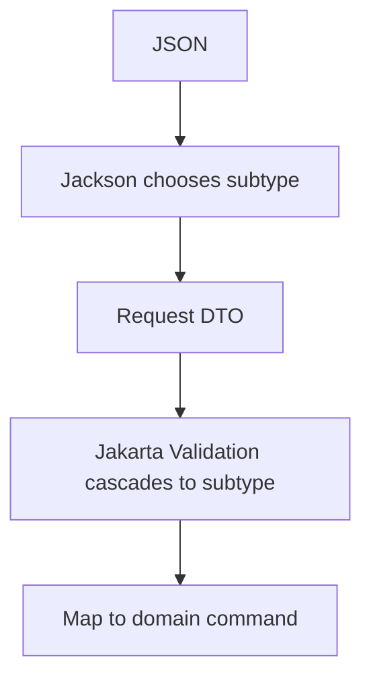

------
title: Learn Java Data Mapper, JSON/XML Processing & Validation - Part 015
description: Polymorphic deserialization dengan Jackson: JsonTypeInfo, JsonSubTypes, discriminator, sealed hierarchies, subtype registration, security risks, PolymorphicTypeValidator, dan production-safe design.
series: learn-java-data-mapper-json-xml-validation
seriesTitle: Learn Java Data Mapper, JSON/XML Processing & Validation
order: 15
partTitle: Polymorphic Deserialization: Type Info, Subtypes, Sealed Hierarchies, Security Risks
tags:
- java
- jackson
- polymorphism
- deserialization
- json-type-info
- json-sub-types
- sealed-classes
- security
- data-mapper
- contract
date: 2026-06-29
---

# Part 015 — Polymorphic Deserialization: Type Info, Subtypes, Sealed Hierarchies, Security Risks

> **Target skill:** mampu mendesain polymorphic JSON contract yang eksplisit, aman, evolvable, dan tidak membuka celah deserialization gadget atau coupling ke class name internal.

Polymorphism adalah kebutuhan natural di sistem enterprise.

Contoh:

```json
{
  "type": "CARD",
  "cardToken": "tok_123",
  "last4": "4242"
}
```

atau:

```json
{
  "eventType": "case.escalated",
  "caseId": "CASE-001",
  "newQueue": "HIGH_RISK"
}
```

Dalam Java, ini sering dimodelkan sebagai interface, abstract class, sealed interface, atau sealed class.

```java
public sealed interface PaymentMethod
    permits CardPaymentMethod, BankTransferPaymentMethod, EWalletPaymentMethod {
}
```

Masalahnya: JSON tidak punya konsep Java subtype. JSON hanya punya object, array, string, number, boolean, null.

Agar Jackson bisa membuat subtype yang benar, JSON harus membawa type information, atau kita harus memilih subtype secara manual.

Mental model:

> **Polymorphic deserialization means allowing input data to influence which Java type is instantiated. That is powerful and dangerous.**

---

## 1. Kaufman Deconstruction

Subskill polymorphic deserialization:

| Subskill | Kemampuan |
|---|---|
| Identify polymorphic boundary | Tahu kapan payload benar-benar polymorphic |
| Choose discriminator | Menentukan field seperti `type`, `kind`, `eventType`, `method` |
| Use logical names | Menghindari class name sebagai wire contract |
| Register subtypes safely | Menggunakan `@JsonSubTypes`, named types, module, atau manual dispatcher |
| Model sealed hierarchy | Menggunakan Java sealed types untuk closed set |
| Handle unknown subtype | Reject, quarantine, preserve raw, atau route unknown |
| Avoid default typing risk | Tidak membiarkan JSON memilih arbitrary class |
| Test subtype matrix | Semua subtype valid/invalid/unknown diuji |
| Version contract | Menambah subtype tanpa merusak consumer |
| Separate event dispatch | Tidak semua polymorphism harus memakai Jackson polymorphic binding |

---

## 2. The Core Problem

Base type:

```java
public interface NotificationChannel {
}
```

Subtypes:

```java
public record EmailChannel(
    String emailAddress
) implements NotificationChannel {}

public record SmsChannel(
    String phoneNumber
) implements NotificationChannel {}

public record PushChannel(
    String deviceToken
) implements NotificationChannel {}
```

Payload:

```json
{
  "emailAddress": "ana@example.com"
}
```

Jackson tidak tahu ini harus menjadi `EmailChannel`.

Butuh discriminator:

```json
{
  "type": "EMAIL",
  "emailAddress": "ana@example.com"
}
```

Sekarang ada informasi untuk memilih subtype.

---

## 3. Safe Default: Logical Discriminator

Gunakan field contract-level seperti `type`, `kind`, `eventType`, `method`, bukan Java class name.

Good:

```json
{
  "type": "EMAIL",
  "emailAddress": "ana@example.com"
}
```

Bad:

```json
{
  "@class": "com.example.notification.EmailChannel",
  "emailAddress": "ana@example.com"
}
```

Kenapa class name buruk?

- mengekspos struktur internal
- refactor package/class menjadi breaking change
- membuka attack surface lebih besar
- membuat consumer tahu detail Java
- sulit dipakai non-Java consumer
- membingungkan saat versi berubah

Wire contract harus memakai logical names.

---

## 4. `@JsonTypeInfo` and `@JsonSubTypes`

Jackson annotation umum:

```java
@JsonTypeInfo(
    use = JsonTypeInfo.Id.NAME,
    include = JsonTypeInfo.As.PROPERTY,
    property = "type"
)
@JsonSubTypes({
    @JsonSubTypes.Type(value = EmailChannel.class, name = "EMAIL"),
    @JsonSubTypes.Type(value = SmsChannel.class, name = "SMS"),
    @JsonSubTypes.Type(value = PushChannel.class, name = "PUSH")
})
public sealed interface NotificationChannel
    permits EmailChannel, SmsChannel, PushChannel {
}
```

Subtypes:

```java
public record EmailChannel(
    String emailAddress
) implements NotificationChannel {}

public record SmsChannel(
    String phoneNumber
) implements NotificationChannel {}

public record PushChannel(
    String deviceToken
) implements NotificationChannel {}
```

Input:

```json
{
  "type": "EMAIL",
  "emailAddress": "ana@example.com"
}
```

Usage:

```java
NotificationChannel channel =
    objectMapper.readValue(json, NotificationChannel.class);
```

Result: `EmailChannel`.

---

## 5. `include = As.PROPERTY`

Most common shape:

```java
@JsonTypeInfo(
    use = JsonTypeInfo.Id.NAME,
    include = JsonTypeInfo.As.PROPERTY,
    property = "type"
)
```

Output:

```json
{
  "type": "EMAIL",
  "emailAddress": "ana@example.com"
}
```

Pros:

- readable
- easy for non-Java clients
- discriminator is inside object
- compatible with common API/event design

Cons:

- discriminator field must not conflict with business field
- field placement may matter for some streaming/custom parsing
- subtype classes may also need access to type field if domain wants it

---

## 6. `include = As.EXISTING_PROPERTY`

If subtype already has `type` field:

```java
@JsonTypeInfo(
    use = JsonTypeInfo.Id.NAME,
    include = JsonTypeInfo.As.EXISTING_PROPERTY,
    property = "type",
    visible = true
)
@JsonSubTypes({
    @JsonSubTypes.Type(value = EmailChannel.class, name = "EMAIL"),
    @JsonSubTypes.Type(value = SmsChannel.class, name = "SMS")
})
public sealed interface NotificationChannel permits EmailChannel, SmsChannel {
    String type();
}
```

Subtype:

```java
public record EmailChannel(
    String type,
    String emailAddress
) implements NotificationChannel {}
```

Input:

```json
{
  "type": "EMAIL",
  "emailAddress": "ana@example.com"
}
```

Use when discriminator is truly part of the DTO/domain representation.

But avoid duplicating type field unless downstream really needs it.

---

## 7. Sealed Hierarchies

Java sealed types help express closed subtype sets.

```java
public sealed interface PaymentMethod
    permits CardPaymentMethod, BankTransferPaymentMethod, EWalletPaymentMethod {
}
```

```java
public record CardPaymentMethod(
    String cardToken
) implements PaymentMethod {}

public record BankTransferPaymentMethod(
    String bankCode,
    String accountNumber
) implements PaymentMethod {}

public record EWalletPaymentMethod(
    String provider,
    String walletId
) implements PaymentMethod {}
```

Sealed hierarchy benefits:

- subtype set explicit at compile time
- switch exhaustiveness possible
- API domain model clearer
- easier review of subtype additions
- matches many polymorphic contract use cases

But sealed type alone does not tell Jackson how to map JSON. You still need discriminator strategy or manual dispatch.

---

## 8. Polymorphic Request DTO Example

```java
public record CreatePaymentRequest(
    String requestId,
    MoneyRequest amount,
    PaymentMethod paymentMethod
) {}
```

Polymorphic field:

```java
@JsonTypeInfo(
    use = JsonTypeInfo.Id.NAME,
    include = JsonTypeInfo.As.PROPERTY,
    property = "methodType"
)
@JsonSubTypes({
    @JsonSubTypes.Type(value = CardPaymentMethod.class, name = "CARD"),
    @JsonSubTypes.Type(value = BankTransferPaymentMethod.class, name = "BANK_TRANSFER"),
    @JsonSubTypes.Type(value = EWalletPaymentMethod.class, name = "EWALLET")
})
public sealed interface PaymentMethod
    permits CardPaymentMethod, BankTransferPaymentMethod, EWalletPaymentMethod {
}
```

Payload:

```json
{
  "requestId": "REQ-001",
  "amount": {
    "amount": "100.00",
    "currency": "IDR"
  },
  "paymentMethod": {
    "methodType": "CARD",
    "cardToken": "tok_123"
  }
}
```

This is explicit and contract-friendly.

---

## 9. Validation per Subtype

Each subtype can have its own validation.

```java
public record CardPaymentMethod(
    @NotBlank
    String cardToken
) implements PaymentMethod {}
```

```java
public record BankTransferPaymentMethod(
    @NotBlank
    @Pattern(regexp = "\\d{3}")
    String bankCode,

    @NotBlank
    @Pattern(regexp = "\\d{10,16}")
    String accountNumber
) implements PaymentMethod {}
```

Parent DTO must cascade:

```java
public record CreatePaymentRequest(
    @NotBlank String requestId,
    @Valid @NotNull MoneyRequest amount,
    @Valid @NotNull PaymentMethod paymentMethod
) {}
```

Flow:



Deserializer chooses type. Validation checks subtype-specific constraints.

---

## 10. Unknown Subtype Strategy

Input:

```json
{
  "methodType": "CRYPTO",
  "wallet": "..."
}
```

What should happen?

Options:

| Strategy | Use Case |
|---|---|
| reject | commands/requests where unsupported action is invalid |
| route to unknown handler | event ingestion/webhook |
| preserve raw payload | audit/integration compatibility |
| map to `UnknownX` subtype | tolerant readers |
| quarantine | asynchronous pipeline with unknown future events |

For command API, reject unknown type.

For event consumer, often preserve raw:

```java
public record UnknownProviderEvent(
    String eventType,
    JsonNode rawPayload
) {}
```

Not all unknown polymorphism should be forced through Jackson annotations. Sometimes manual dispatcher is clearer.

---

## 11. Manual Dispatcher Pattern

For event envelopes, manual dispatch is often better.

Envelope:

```java
public record EventEnvelope(
    String eventId,
    String eventType,
    Instant occurredAt,
    JsonNode payload
) {}
```

Dispatcher:

```java
public void handle(JsonNode root) throws IOException {
    EventEnvelope envelope = parseEnvelope(root);

    switch (envelope.eventType()) {
        case "case.created" -> {
            CaseCreatedEvent payload =
                objectMapper.treeToValue(envelope.payload(), CaseCreatedEvent.class);
            caseCreatedHandler.handle(envelope, payload);
        }
        case "case.escalated" -> {
            CaseEscalatedEvent payload =
                objectMapper.treeToValue(envelope.payload(), CaseEscalatedEvent.class);
            caseEscalatedHandler.handle(envelope, payload);
        }
        default -> unknownEventHandler.handle(envelope, root);
    }
}
```

Advantages:

- unknown events can be stored/quarantined
- type routing is visible
- no arbitrary subtype construction
- event envelope remains stable
- different handlers can evolve independently
- better observability

Use Jackson polymorphic binding for structural subtypes inside one object. Use dispatcher for message routing.

---

## 12. Security Risk: Do Not Let JSON Pick Classes

Dangerous pattern:

```json
{
  "@class": "some.arbitrary.Class",
  "..."
}
```

or enabling broad default typing without strict validator.

The risk: if attacker can influence class type and classpath contains gadget classes, deserialization can instantiate unexpected types or trigger dangerous behavior depending configuration/library versions.

Production rule:

> **Never allow untrusted JSON to specify arbitrary Java class names.**

Avoid:

- `JsonTypeInfo.Id.CLASS` for untrusted input
- `JsonTypeInfo.Id.MINIMAL_CLASS` for untrusted input
- broad default typing
- subtype auto-discovery from classpath for public input
- reflection-based subtype registration without allowlist

Prefer:

- `JsonTypeInfo.Id.NAME`
- explicit subtype allowlist
- sealed hierarchy
- manual dispatcher
- `PolymorphicTypeValidator` if default typing is unavoidable
- strict mapper for command inputs

---

## 13. `PolymorphicTypeValidator`

When using default typing or more dynamic polymorphism, Jackson provides a validator mechanism to restrict allowed subtypes.

Conceptual example:

```java
PolymorphicTypeValidator ptv =
    BasicPolymorphicTypeValidator.builder()
        .allowIfBaseType(AllowedBaseType.class)
        .allowIfSubType("com.example.safe.")
        .build();

ObjectMapper mapper = JsonMapper.builder()
    .activateDefaultTyping(
        ptv,
        ObjectMapper.DefaultTyping.NON_FINAL,
        JsonTypeInfo.As.PROPERTY
    )
    .build();
```

But use this sparingly.

For most API/event contracts, explicit logical discriminators are better than default typing.

Validator is not a magic safety blanket. It must be reviewed like security policy.

---

## 14. Logical Names and Subtype Registry

Instead of annotation on base type, you can register named subtypes.

```java
ObjectMapper mapper = JsonMapper.builder()
    .build();

mapper.registerSubtypes(
    new NamedType(EmailChannel.class, "EMAIL"),
    new NamedType(SmsChannel.class, "SMS")
);
```

This is useful when:

- base type cannot be annotated
- subtype registration is module-owned
- different boundaries need different subtype sets
- generated/domain classes should stay annotation-free

But central registry must be governed:

- no duplicate logical names
- no unreviewed subtype additions
- tests for every registered subtype
- names are contract values
- deprecation process for names

---

## 15. Avoid Reflection-Based Auto-Registration for Untrusted Input

Some systems scan classpath for subtypes and register them automatically.

This looks convenient:

```txt
scan package com.example.events for all Event implementations
register all as subtypes
```

Risk:

- too broad
- hidden contract expansion
- subtype exposed accidentally
- security review bypassed
- build/runtime differences
- names derived from class names
- hard to deprecate

For public or cross-service contracts, prefer explicit registry.

---

## 16. Polymorphic Output Design

Serialization can include type info too.

```java
PaymentMethod method = new CardPaymentMethod("tok_123");

String json = objectMapper.writeValueAsString(method);
```

Output:

```json
{
  "methodType": "CARD",
  "cardToken": "tok_123"
}
```

Check output contract:

- Is discriminator included?
- Is discriminator name stable?
- Are subtype-specific fields present?
- Are fields ordered if humans/golden tests require it?
- Are secrets excluded?
- Are null fields included/omitted intentionally?

---

## 17. Polymorphism and MapStruct

Jackson chooses request subtype. MapStruct maps subtype to domain.

Request hierarchy:

```java
public sealed interface PaymentMethodRequest
    permits CardPaymentMethodRequest, BankTransferPaymentMethodRequest {
}
```

Domain hierarchy:

```java
public sealed interface PaymentMethod
    permits CardPayment, BankTransferPayment {
}
```

Mapper:

```java
@Mapper(unmappedTargetPolicy = ReportingPolicy.ERROR)
public interface PaymentMethodMapper {

    default PaymentMethod toDomain(PaymentMethodRequest request) {
        return switch (request) {
            case CardPaymentMethodRequest card -> toDomain(card);
            case BankTransferPaymentMethodRequest bank -> toDomain(bank);
        };
    }

    CardPayment toDomain(CardPaymentMethodRequest request);

    BankTransferPayment toDomain(BankTransferPaymentMethodRequest request);
}
```

This is explicit and compile-time friendly with sealed switch.

Avoid hidden reflection mapping for subtype transformations.

---

## 18. Polymorphic Collections

Payload:

```json
{
  "rules": [
    {
      "type": "MIN_AMOUNT",
      "amount": "100.00"
    },
    {
      "type": "COUNTRY_ALLOWED",
      "countries": ["ID", "SG"]
    }
  ]
}
```

Base:

```java
@JsonTypeInfo(
    use = JsonTypeInfo.Id.NAME,
    include = JsonTypeInfo.As.PROPERTY,
    property = "type"
)
@JsonSubTypes({
    @JsonSubTypes.Type(value = MinAmountRule.class, name = "MIN_AMOUNT"),
    @JsonSubTypes.Type(value = CountryAllowedRule.class, name = "COUNTRY_ALLOWED")
})
public sealed interface EligibilityRule
    permits MinAmountRule, CountryAllowedRule {
}
```

Container:

```java
public record EligibilityPolicyRequest(
    @NotEmpty
    List<@Valid EligibilityRule> rules
) {}
```

Validation will cascade into each concrete subtype when `@Valid` is applied to list elements.

---

## 19. Deduction-Based Polymorphism

Some libraries/features allow choosing subtype based on field presence.

Example conceptual:

```json
{ "emailAddress": "ana@example.com" }
```

means email, while:

```json
{ "phoneNumber": "0812" }
```

means SMS.

This is fragile:

- ambiguous if fields overlap
- hard to evolve
- unclear errors
- new subtype can break old deduction
- poor contract readability

Prefer explicit discriminator for boundary contracts.

---

## 20. Polymorphism with XML

XML can use element name as discriminator:

```xml
<paymentMethod>
    <card>
        <cardToken>tok_123</cardToken>
    </card>
</paymentMethod>
```

Or attribute:

```xml
<paymentMethod type="CARD">
    <cardToken>tok_123</cardToken>
</paymentMethod>
```

For XML schema-first integration, discriminator style is often dictated by XSD.

Principle remains:

- logical discriminator
- explicit subtype set
- reject/handle unknown
- avoid Java class names
- test every subtype

---

## 21. Compatibility and Versioning

Adding a new subtype is not always backward-compatible.

Producer adds:

```json
{
  "methodType": "QRIS",
  "qrCode": "..."
}
```

Old consumer behavior:

- fails if strict
- ignores if event unknown handler exists
- maps to unknown if tolerant design exists

For commands, adding new input subtype may be fine if server supports it, but clients need documentation.

For events, adding new event type can break consumers unless event contract says unknown event types may appear and should be ignored/quarantined.

Contract rule:

```txt
Consumers must tolerate unknown event types by storing/quarantining them.
Consumers of command request responses should not receive unknown subtypes unless API version changes.
```

---

## 22. Error Design

Unknown subtype error should be clean.

Bad:

```txt
Could not resolve type id 'QRIS' as a subtype of ...
```

Better API error:

```json
{
  "code": "UNSUPPORTED_PAYMENT_METHOD",
  "field": "paymentMethod.methodType",
  "message": "Unsupported payment method type: QRIS"
}
```

Invalid subtype field:

```json
{
  "code": "INVALID_FIELD",
  "field": "paymentMethod.cardToken",
  "message": "cardToken is required for CARD payment method"
}
```

Differentiate:

| Error | Example |
|---|---|
| missing discriminator | `methodType is required` |
| unsupported discriminator | `methodType QRIS is unsupported` |
| invalid subtype payload | `cardToken is required` |
| forbidden subtype | `payment method not allowed for merchant` |
| domain rejection | `payment method disabled` |

Deserializer handles first three. Business rules handle latter two.

---

## 23. Testing Strategy

### 23.1 Each Subtype Deserializes

```java
@Test
void cardPaymentMethod_deserializes() throws Exception {
    PaymentMethod method = mapper.readValue("""
    {
      "methodType": "CARD",
      "cardToken": "tok_123"
    }
    """, PaymentMethod.class);

    assertThat(method).isInstanceOf(CardPaymentMethod.class);
}
```

### 23.2 Unknown Type Rejected

```java
@Test
void unknownPaymentMethod_rejected() {
    assertThatThrownBy(() -> mapper.readValue("""
    {
      "methodType": "QRIS",
      "qrCode": "..."
    }
    """, PaymentMethod.class))
    .isInstanceOf(JsonProcessingException.class);
}
```

### 23.3 Missing Type Rejected

```java
@Test
void missingPaymentMethodType_rejected() {
    assertThatThrownBy(() -> mapper.readValue("""
    {
      "cardToken": "tok_123"
    }
    """, PaymentMethod.class))
    .isInstanceOf(JsonProcessingException.class);
}
```

### 23.4 Validation Cascades to Subtype

```java
@Test
void cardPaymentMethod_validatesCardToken() throws Exception {
    CreatePaymentRequest request = mapper.readValue("""
    {
      "requestId": "REQ-001",
      "amount": { "amount": "100.00", "currency": "IDR" },
      "paymentMethod": {
        "methodType": "CARD",
        "cardToken": ""
      }
    }
    """, CreatePaymentRequest.class);

    Set<ConstraintViolation<CreatePaymentRequest>> violations =
        validator.validate(request);

    assertThat(violations)
        .extracting(v -> v.getPropertyPath().toString())
        .contains("paymentMethod.cardToken");
}
```

### 23.5 Serialization Golden Test

```java
@Test
void cardPaymentMethod_serializesWithLogicalType() throws Exception {
    PaymentMethod method = new CardPaymentMethod("tok_123");

    String json = mapper.writeValueAsString(method);

    assertThat(json).contains("\"methodType\":\"CARD\"");
    assertThat(json).doesNotContain("com.example");
}
```

---

## 24. Production Checklist

Before approving polymorphic deserialization:

- [ ] Is polymorphism actually needed?
- [ ] Is discriminator explicit and logical?
- [ ] Are Java class names absent from JSON?
- [ ] Is subtype set explicit?
- [ ] Are sealed types used when set is closed?
- [ ] Are unknown subtypes handled intentionally?
- [ ] Is default typing avoided for untrusted input?
- [ ] If default typing is used, is `PolymorphicTypeValidator` strict?
- [ ] Are subtype-specific validation rules tested?
- [ ] Are subtype additions reviewed as contract changes?
- [ ] Does error model distinguish missing type, unknown type, and invalid subtype body?
- [ ] Is event routing better handled by manual dispatcher?
- [ ] Are secrets excluded in every subtype?
- [ ] Are all subtypes covered by golden serialization/deserialization tests?

---

## 25. Anti-Patterns

### 25.1 Class Name in JSON

```json
{ "@class": "com.company.internal.payment.CardPaymentMethod" }
```

Avoid for external/untrusted input.

### 25.2 Broad Default Typing

Letting Jackson infer/accept many types without strict allowlist is dangerous.

### 25.3 Reflection Auto-Discovery as Contract

Contract should not expand because a class was added to classpath.

### 25.4 Business Routing in Deserializer

Deserializer should not decide workflow beyond representation type.

### 25.5 No Unknown Strategy

Unknown subtypes will happen in evolving systems. Decide now.

### 25.6 Subtype Without Validation

Each subtype has its own invariants. Validate them.

---

## 26. Mini Case Study: Regulatory Action Request

Request:

```json
{
  "caseId": "CASE-001",
  "action": {
    "actionType": "ESCALATE",
    "targetQueue": "HIGH_RISK",
    "reasonCode": "RISK_SIGNAL"
  }
}
```

Hierarchy:

```java
@JsonTypeInfo(
    use = JsonTypeInfo.Id.NAME,
    include = JsonTypeInfo.As.PROPERTY,
    property = "actionType"
)
@JsonSubTypes({
    @JsonSubTypes.Type(value = EscalateActionRequest.class, name = "ESCALATE"),
    @JsonSubTypes.Type(value = AssignActionRequest.class, name = "ASSIGN"),
    @JsonSubTypes.Type(value = CloseActionRequest.class, name = "CLOSE")
})
public sealed interface CaseActionRequest
    permits EscalateActionRequest, AssignActionRequest, CloseActionRequest {
}
```

Subtypes:

```java
public record EscalateActionRequest(
    @NotBlank String targetQueue,
    @NotBlank String reasonCode
) implements CaseActionRequest {}

public record AssignActionRequest(
    @NotBlank String assigneeUserId
) implements CaseActionRequest {}

public record CloseActionRequest(
    @NotBlank String closureCode,
    String note
) implements CaseActionRequest {}
```

Container:

```java
public record PerformCaseActionRequest(
    @NotBlank String caseId,
    @Valid @NotNull CaseActionRequest action
) {}
```

Domain mapper:

```java
@Mapper(unmappedTargetPolicy = ReportingPolicy.ERROR)
public interface CaseActionMapper {

    default CaseCommand toCommand(PerformCaseActionRequest request) {
        return switch (request.action()) {
            case EscalateActionRequest escalate -> new EscalateCaseCommand(
                new CaseId(request.caseId()),
                escalate.targetQueue(),
                escalate.reasonCode()
            );
            case AssignActionRequest assign -> new AssignCaseCommand(
                new CaseId(request.caseId()),
                assign.assigneeUserId()
            );
            case CloseActionRequest close -> new CloseCaseCommand(
                new CaseId(request.caseId()),
                close.closureCode(),
                close.note()
            );
        };
    }
}
```

This keeps responsibility clean:

- Jackson chooses representation subtype.
- Validation checks subtype fields.
- Mapper creates domain command.
- Use case enforces workflow/state/authorization.

---

## 27. Practice Drill

Build polymorphic request for notification channels:

Types:

- `EMAIL`: `emailAddress`, `templateId`
- `SMS`: `phoneNumber`, `message`
- `PUSH`: `deviceToken`, `title`, `body`

Tasks:

1. Model sealed interface.
2. Add `@JsonTypeInfo` with logical discriminator `channelType`.
3. Add `@JsonSubTypes`.
4. Add Jakarta Validation constraints per subtype.
5. Write JSON examples.
6. Write tests for each subtype.
7. Write unknown subtype test.
8. Write missing discriminator test.
9. Write serialization test proving no Java class name is emitted.
10. Map subtype to domain command using switch.

---

## 28. Summary

Polymorphic deserialization is one of the most powerful and dangerous parts of Jackson.

Mental model:

> **A discriminator is a contract value. Treat subtype registration as an allowlist.**

Rules:

1. Use logical discriminator names, not Java class names.
2. Prefer `JsonTypeInfo.Id.NAME` over class/minimal class ids.
3. Use explicit subtype registration.
4. Use sealed hierarchies for closed sets.
5. Avoid broad default typing for untrusted input.
6. Use `PolymorphicTypeValidator` only as a strict allowlist mechanism when dynamic typing is unavoidable.
7. For event routing, manual dispatcher is often clearer and safer.
8. Validate subtype-specific fields.
9. Test every subtype and unknown/missing discriminator.
10. Treat adding subtype as contract evolution.

Part berikutnya membahas Jackson modules: Java Time, Records, Optional/JDK8 types, parameter names, performance modules, custom module design, and module governance.

---

## References

- Jackson Polymorphic Deserialization Docs: https://github.com/FasterXML/jackson-docs/wiki/JacksonPolymorphicDeserialization
- Jackson `JsonTypeInfo` Javadoc: https://www.javadoc.io/doc/com.fasterxml.jackson.core/jackson-annotations/latest/com/fasterxml/jackson/annotation/JsonTypeInfo.html
- Jackson `JsonSubTypes` Javadoc: https://www.javadoc.io/doc/com.fasterxml.jackson.core/jackson-annotations/latest/com/fasterxml/jackson/annotation/JsonSubTypes.html
- Jackson Databind Security Notes: https://github.com/FasterXML/jackson-databind#security
- Jackson 3.0 Release Notes: https://github.com/FasterXML/jackson/wiki/Jackson-Release-3.0
