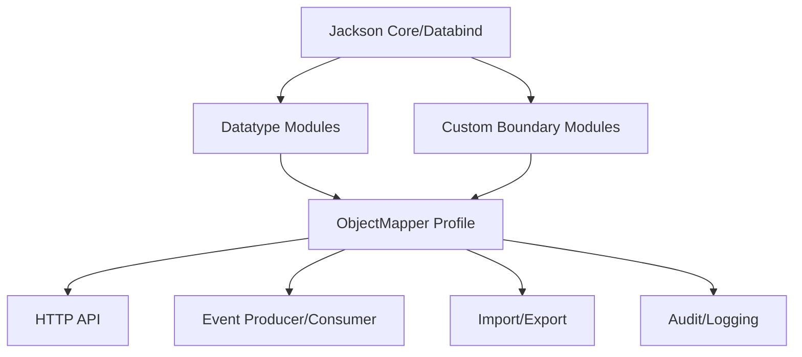

------
title: Learn Java Data Mapper, JSON/XML Processing & Validation - Part 016
description: Jackson modules untuk Java Time, records, Optional/JDK8 types, parameter names, Afterburner/Blackbird, custom modules, module registration governance, and production mapper profiles.
series: learn-java-data-mapper-json-xml-validation
seriesTitle: Learn Java Data Mapper, JSON/XML Processing & Validation
order: 16
partTitle: Jackson Modules: Java Time, Records, Optional, Parameter Names, Afterburner/Blackbird Concepts
tags:
- java
- jackson
- modules
- java-time
- records
- optional
- parameter-names
- afterburner
- blackbird
- objectmapper
- serialization
- deserialization
date: 2026-06-29
---

# Part 016 — Jackson Modules: Java Time, Records, Optional, Parameter Names, Afterburner/Blackbird Concepts

> **Target skill:** mampu mengelola Jackson modules sebagai bagian dari platform serialization policy: kapan register module, module mana wajib, bagaimana module memengaruhi contract, dan bagaimana menghindari drift antar service/test/runtime.

Jackson core/databind tidak berdiri sendiri. Banyak kemampuan production datang dari **modules**.

Examples:

- `jackson-datatype-jsr310` untuk `java.time`
- `jackson-datatype-jdk8` untuk JDK8 types seperti `Optional`
- `jackson-module-parameter-names` untuk constructor parameter names
- `jackson-module-afterburner` dan `jackson-module-blackbird` untuk performance optimization
- custom module untuk value objects, serializers, deserializers, subtype registration
- framework-provided modules di Spring Boot/Quarkus/Micronaut/Jakarta stacks

Mental model:

> **ObjectMapper configuration is platform policy. Modules are how that policy becomes executable.**

---

## 1. Kaufman Deconstruction

Subskill module mastery:

| Subskill | Kemampuan |
|---|---|
| Understand module role | Tahu module menambah serializer, deserializer, introspector, subtype, modifier |
| Register modules explicitly | Membangun mapper profile yang reproducible |
| Support Java Time | Menangani `Instant`, `LocalDate`, `OffsetDateTime`, etc. |
| Support modern Java shapes | Records, constructor parameters, immutable classes |
| Handle JDK8 types | Optional and related types if used at boundary |
| Use performance modules carefully | Afterburner/Blackbird concepts and measurement |
| Build custom modules | Group custom codecs and subtype registration |
| Avoid module drift | Test mapper profile in app/test/tools |
| Version mapper policy | Treat changes as contract-impacting |
| Audit framework defaults | Do not assume all runtimes configure mapper identically |

---

## 2. What Is a Jackson Module?

A Jackson module packages extensions for `ObjectMapper`.

A module can register:

- serializers
- deserializers
- key serializers/deserializers
- abstract type mappings
- subtype registrations
- bean serializer modifiers
- bean deserializer modifiers
- annotation introspectors
- value instantiators

Simple example:

```java
SimpleModule module = new SimpleModule("BoundaryValueModule")
    .addSerializer(CustomerId.class, new CustomerIdSerializer())
    .addDeserializer(CustomerId.class, new CustomerIdDeserializer());

ObjectMapper mapper = JsonMapper.builder()
    .addModule(module)
    .build();
```

A module changes how mapper interprets types. Therefore it can change wire contract.

---

## 3. Module Governance Principle

Do not let every team/class create ad-hoc mapper config.

Bad:

```java
ObjectMapper mapper = new ObjectMapper();
mapper.registerModule(new JavaTimeModule());
mapper.configure(SerializationFeature.WRITE_DATES_AS_TIMESTAMPS, false);
```

repeated differently in multiple places.

Better:

```java
public final class JsonMapperFactory {
    private JsonMapperFactory() {}

    public static ObjectMapper strictApiMapper() {
        return JsonMapper.builder()
            .addModule(new JavaTimeModule())
            .addModule(new BoundaryValueModule())
            .disable(SerializationFeature.WRITE_DATES_AS_TIMESTAMPS)
            .enable(DeserializationFeature.FAIL_ON_UNKNOWN_PROPERTIES)
            .build();
    }

    public static ObjectMapper tolerantEventMapper() {
        return JsonMapper.builder()
            .addModule(new JavaTimeModule())
            .addModule(new BoundaryValueModule())
            .disable(SerializationFeature.WRITE_DATES_AS_TIMESTAMPS)
            .disable(DeserializationFeature.FAIL_ON_UNKNOWN_PROPERTIES)
            .build();
    }
}
```

Even better in framework apps: one central customization policy, with tests.

---

## 4. Java Time Module

Modern Java uses `java.time`.

Common types:

| Type | Meaning |
|---|---|
| `Instant` | machine timestamp |
| `OffsetDateTime` | timestamp with offset |
| `ZonedDateTime` | date-time with timezone rules |
| `LocalDateTime` | local date-time without offset |
| `LocalDate` | business/calendar date |
| `YearMonth` | billing/statement period |
| `Duration` | machine duration |
| `Period` | calendar period |

Register module:

```java
ObjectMapper mapper = JsonMapper.builder()
    .addModule(new JavaTimeModule())
    .disable(SerializationFeature.WRITE_DATES_AS_TIMESTAMPS)
    .build();
```

Example DTO:

```java
public record AuditEvent(
    String eventId,
    Instant occurredAt,
    LocalDate businessDate
) {}
```

Output:

```json
{
  "eventId": "evt-001",
  "occurredAt": "2026-06-29T03:00:00Z",
  "businessDate": "2026-06-29"
}
```

### 4.1 Timestamp Shape Policy

If `WRITE_DATES_AS_TIMESTAMPS` is enabled, output can become numeric/array-like depending type/configuration.

For API/event contracts, prefer ISO strings unless there is a strong reason.

Policy:

```txt
All boundary date-time values are ISO-8601 strings.
Instant uses UTC Z form.
LocalDate uses yyyy-MM-dd.
No locale-specific date strings in machine contracts.
```

### 4.2 Field-Specific Exceptions

Use `@JsonFormat` only for local exception:

```java
public record LegacyReportRequest(
    @JsonFormat(pattern = "dd/MM/yyyy")
    LocalDate reportDate
) {}
```

But do not let legacy format leak into global mapper.

---

## 5. Records

Java records are excellent DTO candidates because they are immutable data carriers with explicit components.

```java
public record CustomerResponse(
    String customerId,
    String fullName
) {}
```

Jackson 2.12+ added record support in databind. In modern Jackson usage, records generally work well when component names are available and constructors align.

For explicit contract names:

```java
public record CustomerResponse(
    @JsonProperty("customer_id")
    String customerId,

    @JsonProperty("full_name")
    String fullName
) {}
```

Validation fits naturally:

```java
public record CreateCustomerRequest(
    @NotBlank String fullName,
    @Email String email
) {}
```

### 5.1 Records Are DTO-Friendly, Not Always Domain-Friendly

Records are good when:

- object is transparent data carrier
- all fields are known at construction
- immutability is desired
- mapping is straightforward
- equality by components is intended

Records may be awkward when:

- object has lifecycle/state transitions
- invariants require behavior-heavy model
- lazy relationships exist
- identity semantics differ from component equality
- mutation/partial construction is required

Use records heavily at boundary. Use domain model shape deliberately.

---

## 6. Parameter Names Module

For immutable classes with constructors, Jackson needs to know constructor parameter names unless annotations are explicit.

Class:

```java
public final class CustomerDto {
    private final String customerId;
    private final String fullName;

    public CustomerDto(String customerId, String fullName) {
        this.customerId = customerId;
        this.fullName = fullName;
    }

    public String customerId() {
        return customerId;
    }

    public String fullName() {
        return fullName;
    }
}
```

With parameter names available at compile time and module support, Jackson can bind constructor args.

Register:

```java
ObjectMapper mapper = JsonMapper.builder()
    .addModule(new ParameterNamesModule())
    .build();
```

Alternative explicit annotation:

```java
@JsonCreator
public CustomerDto(
    @JsonProperty("customerId") String customerId,
    @JsonProperty("fullName") String fullName
) {
    this.customerId = customerId;
    this.fullName = fullName;
}
```

Production recommendation:

| Situation | Approach |
|---|---|
| public DTO record | record components + annotations if needed |
| immutable class | explicit `@JsonCreator`/`@JsonProperty` or parameter names module |
| shared library | prefer explicit annotations for clarity |
| build may omit `-parameters` | explicit annotations safer |
| framework-managed mapper | verify module/defaults in tests |

---

## 7. JDK8 Module and Optional

`Optional` in DTOs is controversial.

Example:

```java
public record CustomerResponse(
    String customerId,
    Optional<String> middleName
) {}
```

With JDK8 datatype support, Jackson can handle `Optional`.

But in many APIs, prefer plain nullable field plus explicit null/absence policy.

Why avoid `Optional` fields in DTOs?

- `Optional` was primarily designed as return type, not field type
- it complicates validation
- it complicates JSON semantics
- absence vs null may still be unclear
- many frameworks/tools handle it inconsistently

Better response DTO:

```java
@JsonInclude(JsonInclude.Include.NON_NULL)
public record CustomerResponse(
    String customerId,
    String middleName
) {}
```

For patch semantics, use a presence-aware type, not `Optional`.

```java
public record CustomerPatchRequest(
    PatchField<String> middleName
) {}
```

### 7.1 When Optional Is Acceptable

- internal DTOs
- method returns
- configuration objects
- when mapper profile explicitly supports it
- when contract semantics are documented

Do not use `Optional` as a lazy substitute for absence/null design.

---

## 8. `findAndAddModules()`

Jackson can discover modules via service loader:

```java
ObjectMapper mapper = JsonMapper.builder()
    .findAndAddModules()
    .build();
```

This is convenient, but has production trade-offs.

Pros:

- less boilerplate
- auto-registers modules on classpath
- useful for apps/framework integration

Cons:

- behavior changes when dependency changes
- hidden module drift
- tests may differ from production
- startup/classpath differences matter
- harder to reason about exact policy

For libraries and high-control platforms, explicit registration is often better.

```java
ObjectMapper mapper = JsonMapper.builder()
    .addModule(new JavaTimeModule())
    .addModule(new ParameterNamesModule())
    .addModule(new BoundaryValueModule())
    .build();
```

For applications, `findAndAddModules()` may be acceptable if covered by mapper contract tests.

---

## 9. Performance Modules: Afterburner and Blackbird Concepts

Jackson performance modules can optimize property access and reduce reflection overhead.

Historically common:

```java
new AfterburnerModule()
```

Newer JVM-focused optimization:

```java
new BlackbirdModule()
```

The exact benefit depends on:

- Java version
- Jackson version
- DTO shape
- access modifiers
- records vs beans
- reflection access restrictions
- payload size
- CPU vs I/O bottleneck
- serialization vs deserialization path

Do not add performance modules because they sound fast. Benchmark.

### 9.1 When to Consider

| Situation | Consider? |
|---|---|
| JSON CPU is measured bottleneck | yes |
| high-throughput internal service | maybe |
| small public API response | probably no |
| I/O/database dominates | unlikely useful |
| native image / restricted runtime | test carefully |
| complex custom serializers | measure |
| framework already optimizes | verify before adding |

### 9.2 Benchmark Rule

Before:

```txt
baseline ObjectMapper
```

After:

```txt
ObjectMapper + performance module
```

Measure:

- throughput
- p95/p99 latency
- allocation rate
- GC pressure
- startup impact
- correctness against golden fixtures

Performance module must not change contract. Test that output stays identical.

---

## 10. Custom Module for Boundary Value Objects

Suppose you have:

```java
public record CustomerId(String value) {}
public record AccountNumber(String value) {}
public record Money(BigDecimal amount, Currency currency) {}
```

Build module:

```java
public final class BoundaryValueModule extends SimpleModule {

    public BoundaryValueModule() {
        super("BoundaryValueModule");

        addSerializer(CustomerId.class, new CustomerIdSerializer());
        addDeserializer(CustomerId.class, new CustomerIdDeserializer());

        addSerializer(AccountNumber.class, new AccountNumberSerializer());
        addDeserializer(AccountNumber.class, new AccountNumberDeserializer());

        addSerializer(Money.class, new MoneySerializer());
        addDeserializer(Money.class, new MoneyDeserializer());
    }
}
```

Register:

```java
ObjectMapper mapper = JsonMapper.builder()
    .addModule(new JavaTimeModule())
    .addModule(new BoundaryValueModule())
    .disable(SerializationFeature.WRITE_DATES_AS_TIMESTAMPS)
    .build();
```

This centralizes representation policy.

---

## 11. Custom Module for Subtype Registration

```java
public final class PaymentSubtypeModule extends SimpleModule {

    public PaymentSubtypeModule() {
        super("PaymentSubtypeModule");

        registerSubtypes(
            new NamedType(CardPaymentMethod.class, "CARD"),
            new NamedType(BankTransferPaymentMethod.class, "BANK_TRANSFER"),
            new NamedType(EWalletPaymentMethod.class, "EWALLET")
        );
    }
}
```

Use when base type annotation is not desired or subtype registry belongs to boundary layer.

Governance:

- subtype names are contract values
- adding subtype requires compatibility review
- removing subtype is breaking
- duplicate names must fail tests
- registry should be discoverable

---

## 12. Module Order and Interaction

Module order can matter if multiple modules modify same type/serializer behavior.

Bad smell:

```java
.addModule(new InternalMoneyModule())
.addModule(new ExternalMoneyModule())
```

Both register serializer for `Money`.

Which one wins may depend on registration behavior and mapper internals.

Better:

- separate mapper profiles
- separate DTO types
- boundary-specific serializers
- avoid global conflict for same type

Example:

```java
ObjectMapper publicApiMapper = JsonMapper.builder()
    .addModule(new PublicApiMoneyModule())
    .build();

ObjectMapper providerMapper = JsonMapper.builder()
    .addModule(new ProviderMoneyModule())
    .build();
```

If same Java type has different wire shapes in different boundaries, global type-wide module is dangerous. Prefer DTO-specific shape.

---

## 13. Mapper Profiles

A serious platform often needs multiple mapper profiles.

| Profile | Policy |
|---|---|
| strict API request mapper | fail unknown, strict coercion, validation before domain |
| public response mapper | stable inclusion/naming/date policy |
| tolerant event consumer mapper | tolerate/capture unknown fields |
| audit mapper | preserve raw/sanitized payload |
| test mapper | must match production profile |
| legacy provider mapper | custom date/field/code format |
| internal cache mapper | optimized, may include type metadata only if trusted |

Example:

```java
public enum JsonMapperProfile {
    STRICT_API,
    TOLERANT_EVENT,
    LEGACY_PROVIDER,
    AUDIT
}
```

Factory:

```java
public final class ObjectMappers {

    public static ObjectMapper create(JsonMapperProfile profile) {
        JsonMapper.Builder builder = JsonMapper.builder()
            .addModule(new JavaTimeModule())
            .addModule(new BoundaryValueModule())
            .disable(SerializationFeature.WRITE_DATES_AS_TIMESTAMPS);

        return switch (profile) {
            case STRICT_API -> builder
                .enable(DeserializationFeature.FAIL_ON_UNKNOWN_PROPERTIES)
                .build();

            case TOLERANT_EVENT -> builder
                .disable(DeserializationFeature.FAIL_ON_UNKNOWN_PROPERTIES)
                .build();

            case LEGACY_PROVIDER -> builder
                .addModule(new LegacyProviderModule())
                .build();

            case AUDIT -> builder
                .build();
        };
    }
}
```

Avoid “one mapper to rule them all” if boundaries have conflicting policies.

---

## 14. Framework Integration

Frameworks often auto-configure ObjectMapper.

Examples of things frameworks may configure:

- Java Time support
- JDK8 datatype support
- parameter names support
- Kotlin/Scala modules
- naming strategy
- null inclusion
- unknown property behavior
- date timestamp behavior
- customizers from dependency injection
- HTTP message converters

Do not assume.

Write a test:

```java
@SpringBootTest
class ObjectMapperContractTest {

    @Autowired ObjectMapper objectMapper;

    @Test
    void objectMapper_serializesInstantAsIsoString() throws Exception {
        String json = objectMapper.writeValueAsString(
            new EventResponse(Instant.parse("2026-06-29T03:00:00Z"))
        );

        assertThat(json).contains("2026-06-29T03:00:00Z");
        assertThat(json).doesNotContain("1751166000000");
    }
}
```

The framework-managed mapper is the one that matters for HTTP behavior.

---

## 15. Test Mapper Drift

Common drift:

- unit tests instantiate `new ObjectMapper()`
- app uses framework mapper with modules
- CLI tool uses another mapper
- integration test uses `findAndAddModules()`
- production adds dependency that auto-registers module
- serializer/deserializer differs between event producer and consumer

Prevent with shared test fixture:

```java
public final class JsonTestSupport {
    public static ObjectMapper productionLikeMapper() {
        return ObjectMappers.create(JsonMapperProfile.STRICT_API);
    }
}
```

Better: inject actual mapper in tests where possible.

---

## 16. Contract Tests for Modules

### 16.1 Java Time

```java
@Test
void instant_serializesAsIsoString() throws Exception {
    EventDto dto = new EventDto(Instant.parse("2026-06-29T03:00:00Z"));

    String json = mapper.writeValueAsString(dto);

    assertThat(json).contains("2026-06-29T03:00:00Z");
}
```

### 16.2 Record

```java
@Test
void record_deserializes() throws Exception {
    CustomerResponse response = mapper.readValue("""
    {
      "customerId": "CUS-001",
      "fullName": "Ana"
    }
    """, CustomerResponse.class);

    assertThat(response.customerId()).isEqualTo("CUS-001");
}
```

### 16.3 Value Module

```java
@Test
void customerId_usesBoundaryValueModule() throws Exception {
    CustomerId id = mapper.readValue("\"CUS-001\"", CustomerId.class);

    assertThat(id.value()).isEqualTo("CUS-001");
}
```

### 16.4 Mapper Profile

```java
@Test
void strictApiMapper_rejectsUnknownFields() {
    ObjectMapper strict = ObjectMappers.create(JsonMapperProfile.STRICT_API);

    assertThatThrownBy(() -> strict.readValue("""
    {
      "customerId": "CUS-001",
      "extra": "x"
    }
    """, CustomerResponse.class))
    .isInstanceOf(JsonProcessingException.class);
}
```

---

## 17. Modules and Jackson 3

Jackson 3 is a major version line and is not API-compatible with 2.x. Migration requires explicit review of dependencies, package/group changes, module availability, and framework support.

Production implications:

- do not mix random Jackson 2.x and 3.x dependencies
- verify framework compatibility
- review package/import changes
- run golden contract tests
- run custom serializer/deserializer tests
- check module replacements/built-ins
- benchmark performance if relying on Afterburner/Blackbird
- stage migration per service/library

Do not treat major Jackson upgrade as dependency hygiene only. It can affect serialization semantics.

---

## 18. Dependency Alignment

Jackson has multiple artifacts:

- `jackson-core`
- `jackson-annotations`
- `jackson-databind`
- datatype modules
- dataformat modules
- integration modules

Keep versions aligned through BOM/dependency management.

Maven example:

```xml
<dependencyManagement>
  <dependencies>
    <dependency>
      <groupId>com.fasterxml.jackson</groupId>
      <artifactId>jackson-bom</artifactId>
      <version>${jackson.version}</version>
      <type>pom</type>
      <scope>import</scope>
    </dependency>
  </dependencies>
</dependencyManagement>
```

Gradle platform example:

```kotlin
dependencies {
    implementation(platform("com.fasterxml.jackson:jackson-bom:$jacksonVersion"))
    implementation("com.fasterxml.jackson.core:jackson-databind")
    implementation("com.fasterxml.jackson.datatype:jackson-datatype-jsr310")
}
```

Avoid version soup.

---

## 19. Module Registration Anti-Patterns

### 19.1 `new ObjectMapper()` Everywhere

Leads to inconsistent behavior.

### 19.2 `findAndAddModules()` in Library Code

Library behavior changes based on host classpath. Prefer accepting mapper from caller or explicit config.

### 19.3 Global Serializer for Context-Specific Type

Same `Money` type may need different wire shape for public API and provider integration. Global module can break one boundary.

### 19.4 Performance Module Without Benchmark

Optimization without measurement can add risk without benefit.

### 19.5 Test Mapper Not Equal Production Mapper

Golden tests become false confidence.

### 19.6 Module Registration in Random Configuration Classes

Hard to audit and reason about.

---

## 20. Practical Production Mapper

```java
public final class ProductionJson {

    private ProductionJson() {}

    public static ObjectMapper strictApiMapper() {
        return JsonMapper.builder()
            .addModule(new JavaTimeModule())
            .addModule(new ParameterNamesModule())
            .addModule(new BoundaryValueModule())
            .disable(SerializationFeature.WRITE_DATES_AS_TIMESTAMPS)
            .disable(SerializationFeature.FAIL_ON_EMPTY_BEANS)
            .enable(DeserializationFeature.FAIL_ON_UNKNOWN_PROPERTIES)
            .enable(DeserializationFeature.FAIL_ON_NULL_FOR_PRIMITIVES)
            .build();
    }

    public static ObjectMapper tolerantEventMapper() {
        return JsonMapper.builder()
            .addModule(new JavaTimeModule())
            .addModule(new ParameterNamesModule())
            .addModule(new BoundaryValueModule())
            .disable(SerializationFeature.WRITE_DATES_AS_TIMESTAMPS)
            .disable(DeserializationFeature.FAIL_ON_UNKNOWN_PROPERTIES)
            .build();
    }
}
```

Note: exact features depend on your contract. Do not copy blindly.

---

## 21. Module as Platform Boundary

Think of modules as part of platform architecture.



If module policy is inconsistent, every boundary can behave differently.

---

## 22. Production Checklist

Before changing modules:

- [ ] Which mapper profile is affected?
- [ ] Does this change serialization, deserialization, or both?
- [ ] Is the module global or boundary-specific?
- [ ] Are date/time outputs unchanged?
- [ ] Are records/constructors still deserializable?
- [ ] Are unknown fields handled as expected?
- [ ] Are custom value objects still encoded correctly?
- [ ] Are polymorphic subtypes unchanged?
- [ ] Are golden contract tests updated?
- [ ] Is dependency version aligned?
- [ ] Does framework-managed mapper receive this module?
- [ ] Do tests use the same mapper as production path?
- [ ] If performance module added, is benchmark attached?
- [ ] If Jackson major version changed, is migration reviewed?

---

## 23. Mini Case Study: Payment Platform Mapper Profiles

### 23.1 Strict API Request Mapper

Used for client commands.

Policy:

- reject unknown fields
- ISO date/time strings
- value object module
- no default typing
- strict enum policy
- no global tolerance

```java
ObjectMapper strictApi = JsonMapper.builder()
    .addModule(new JavaTimeModule())
    .addModule(new PaymentValueModule())
    .disable(SerializationFeature.WRITE_DATES_AS_TIMESTAMPS)
    .enable(DeserializationFeature.FAIL_ON_UNKNOWN_PROPERTIES)
    .build();
```

### 23.2 Tolerant Provider Event Mapper

Used for third-party webhooks.

Policy:

- tolerate unknown fields
- preserve extension map when modeled
- custom provider date/code module
- sanitize raw payload before audit
- route unknown event type

```java
ObjectMapper providerEvent = JsonMapper.builder()
    .addModule(new JavaTimeModule())
    .addModule(new ProviderMoneyModule())
    .addModule(new ProviderStatusModule())
    .disable(SerializationFeature.WRITE_DATES_AS_TIMESTAMPS)
    .disable(DeserializationFeature.FAIL_ON_UNKNOWN_PROPERTIES)
    .build();
```

### 23.3 Export Mapper

Used for generated export files.

Policy:

- stable property ordering if required
- ISO date/time
- explicit null inclusion
- no provider-tolerant deserialization concerns
- generator/ObjectWriter path tested

Different boundary, different mapper profile.

---

## 24. Practice Drill

Build mapper configuration for these use cases:

1. Public REST API request.
2. Public REST API response.
3. Kafka event consumer.
4. Legacy provider webhook.
5. CSV-to-JSON export tool.
6. Audit payload sanitizer.

For each, define:

- modules
- unknown field policy
- date-time format
- enum policy
- value object serializers/deserializers
- null inclusion
- polymorphism policy
- whether `findAndAddModules()` is allowed
- contract tests required

---

## 25. Summary

Jackson modules are not just dependencies. They are executable serialization policy.

Mental model:

> **A mapper without module governance is a hidden platform fork.**

Rules:

1. Register modules intentionally.
2. Use Java Time module/config for modern date-time types.
3. Use records as boundary DTOs when they match contract shape.
4. Use parameter names support or explicit creator annotations for immutable classes.
5. Be cautious with `Optional` in DTO fields.
6. Avoid mapper drift between app/test/tooling.
7. Prefer explicit module registration in controlled platforms.
8. Use performance modules only after benchmark.
9. Put custom value serializers/deserializers in named modules.
10. Treat Jackson major upgrade as contract-impacting.
11. Align Jackson dependency versions with BOM/dependency management.
12. Test mapper profiles with golden fixtures.

Part berikutnya covers Jackson 2.x to 3.x migration: package/group changes, compatibility risk, custom codec impact, framework support, and safe migration strategy.

---

## References

- Jackson Databind Repository: https://github.com/FasterXML/jackson-databind
- Jackson Modules Maven Directory: https://repo1.maven.org/maven2/com/fasterxml/jackson/module/
- Jackson Java Time Module Javadocs: https://www.javadoc.io/doc/com.fasterxml.jackson.datatype/jackson-datatype-jsr310/latest/index.html
- Jackson Parameter Names Module Javadocs: https://www.javadoc.io/doc/com.fasterxml.jackson.module/jackson-module-parameter-names/latest/index.html
- Jackson 3.0 Release Notes: https://github.com/FasterXML/jackson/wiki/Jackson-Release-3.0
- Jackson 3 Migration Guide: https://github.com/FasterXML/jackson/blob/main/jackson3/MIGRATING_TO_JACKSON_3.md
