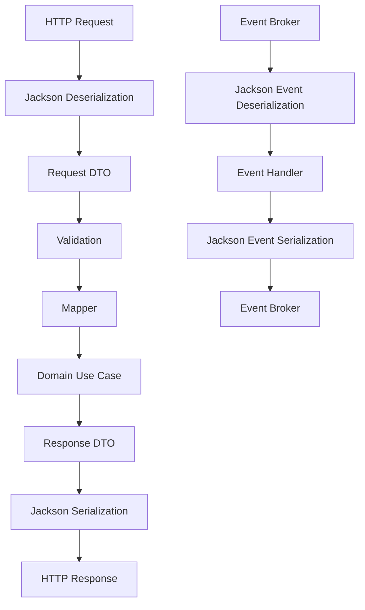
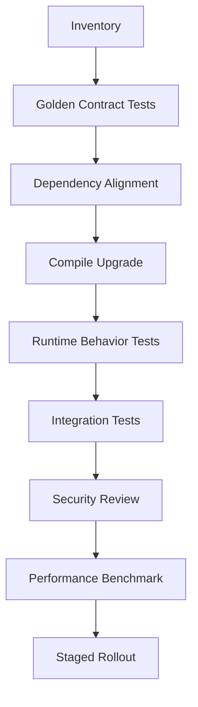
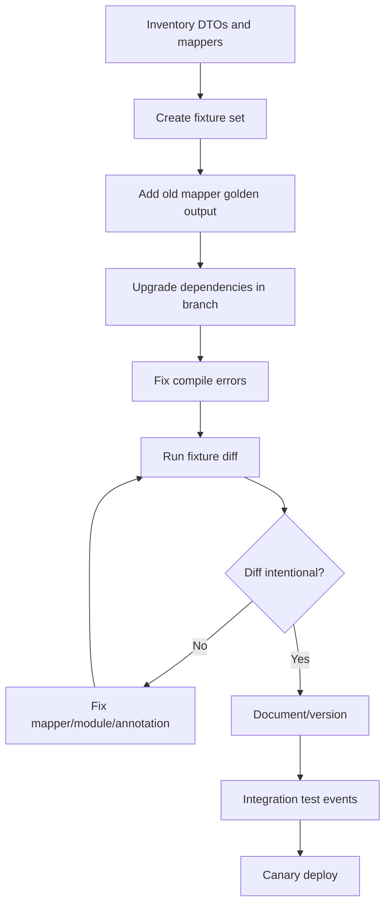

------
title: Learn Java Data Mapper, JSON/XML Processing & Validation - Part 017
description: Jackson 2.x to 3.x migration strategy: compatibility risk, namespace/package changes, dependency alignment, ObjectMapper policy, custom codec impact, framework support, and safe rollout.
series: learn-java-data-mapper-json-xml-validation
seriesTitle: Learn Java Data Mapper, JSON/XML Processing & Validation
order: 17
partTitle: Jackson 2.x to 3.x: Package Changes, Compatibility Risk, Migration Strategy
tags:
- java
- jackson
- jackson-3
- migration
- objectmapper
- serialization
- deserialization
- compatibility
- contract
date: 2026-06-29
---

# Part 017 — Jackson 2.x to 3.x: Package Changes, Compatibility Risk, Migration Strategy

> **Target skill:** mampu merencanakan migrasi Jackson 2.x ke 3.x sebagai perubahan platform serialization, bukan sekadar bump dependency.

Jackson 3 adalah major version line. Major version berarti ada risiko API incompatibility, perubahan dependency coordinates/package, perubahan default behavior, dan dampak ke framework integration. Untuk sistem enterprise, perubahan serialization library bisa memengaruhi:

- API request parsing
- API response shape
- event producer/consumer compatibility
- audit payload
- import/export
- custom serializers/deserializers
- polymorphic type handling
- security posture
- test fixtures
- generated clients
- framework auto-configuration

Mental model:

> **Jackson migration is a contract migration. Treat it like changing a boundary runtime, not like updating a utility library.**

---

## 1. Kaufman Deconstruction

Migrasi ini kita pecah menjadi subskill praktis:

| Subskill | Kemampuan |
|---|---|
| Inventory usage | Menemukan semua `ObjectMapper`, modules, custom codec, annotations, converters |
| Identify boundary profiles | Memisahkan API/event/audit/import/export mapper |
| Align dependencies | Menghindari mix Jackson 2.x/3.x yang tidak disengaja |
| Compile migration | Menangani package/API changes |
| Contract migration | Membandingkan serialized/deserialized behavior |
| Custom codec migration | Memperbaiki serializer/deserializer/module yang pakai API berubah |
| Framework migration | Memastikan Spring/Quarkus/Micronaut/Jersey/etc mendukung versi target |
| Security review | Mengevaluasi polymorphism/default typing changes |
| Performance review | Mengukur throughput/allocation after upgrade |
| Rollout strategy | Staged rollout, compatibility bridge, rollback plan |

Latihan utama:

1. Buat inventory semua mapper.
2. Tambahkan golden contract tests.
3. Jalankan upgrade branch.
4. Perbaiki compile errors.
5. Bandingkan JSON output.
6. Jalankan integration tests producer/consumer.
7. Rollout satu mapper profile/service dulu.
8. Monitor error parsing, unknown field, invalid type, latency.

---

## 2. Why This Migration Is Not Trivial

Jackson sering berada di jalur kritis:



Jika migration mengubah parsing atau output shape, consumer bisa rusak walaupun business code tidak berubah.

Contoh risiko:

| Area | Risiko |
|---|---|
| date-time | output timestamp berubah dari string ke numeric/array |
| enum | unknown enum behavior berubah |
| null inclusion | field yang dulu ada sekarang hilang atau sebaliknya |
| constructor binding | immutable DTO gagal deserialize |
| polymorphism | discriminator/type handling berubah |
| custom codec | compile/runtime error |
| modules | module belum tersedia/berubah |
| annotations | behavior annotation berubah/unsupported edge |
| framework | HTTP converter memakai mapper berbeda |
| dependency graph | library masih membawa Jackson 2.x |

---

## 3. Migration Principle

Jangan mulai dengan:

```txt
Change version -> fix compile -> deploy
```

Mulai dengan:

```txt
Define current contract -> upgrade -> prove contract remains intentional
```

Recommended flow:



---

## 4. Inventory Checklist

Cari semua penggunaan berikut:

```txt
ObjectMapper
JsonMapper
ObjectReader
ObjectWriter
JsonParser
JsonGenerator
JsonNode
ObjectNode
ArrayNode
JsonSerializer
JsonDeserializer
StdSerializer
StdDeserializer
SimpleModule
Module
@JsonTypeInfo
@JsonSubTypes
@JsonCreator
@JsonProperty
@JsonFormat
@JsonInclude
@JsonAlias
@JsonIgnoreProperties
activateDefaultTyping
enableDefaultTyping
registerSubtypes
findAndAddModules
```

Command examples:

```bash
rg "new ObjectMapper|JsonMapper|ObjectReader|ObjectWriter" src test
rg "JsonSerializer|JsonDeserializer|StdSerializer|StdDeserializer|SimpleModule" src test
rg "@JsonTypeInfo|@JsonSubTypes|activateDefaultTyping|enableDefaultTyping" src test
rg "findAndAddModules|registerModule|registerSubtypes" src test
```

Inventory table:

| Item | Location | Boundary | Risk |
|---|---|---|---|
| `strictApiMapper` | `JsonConfig` | REST request | high |
| `eventMapper` | `KafkaConfig` | events | high |
| `auditMapper` | `AuditService` | audit | medium |
| `MoneyDeserializer` | `json/module` | value object | high |
| `@JsonTypeInfo` | payment DTO | polymorphic request | high |
| `new ObjectMapper()` | test util | tests | medium |

---

## 5. Boundary Mapper Profiles

Before migrating, classify mapper usage.

| Profile | Required tests |
|---|---|
| strict API request | unknown field, invalid type, null, enum, date |
| public API response | golden output, null inclusion, date format |
| event producer | schema/fixture compatibility |
| event consumer | old/new event fixtures, unknown field/type |
| import | large file, invalid row, error path |
| export | golden output, ordering if needed, memory |
| audit | raw/sanitized preservation |
| provider integration | legacy quirks, alias, custom date |

Do not let a hidden `new ObjectMapper()` escape this classification.

---

## 6. Dependency Alignment

Jackson has multiple artifacts. Keep versions aligned.

Maven with BOM:

```xml
<dependencyManagement>
  <dependencies>
    <dependency>
      <groupId>tools.jackson</groupId>
      <artifactId>jackson-bom</artifactId>
      <version>${jackson.version}</version>
      <type>pom</type>
      <scope>import</scope>
    </dependency>
  </dependencies>
</dependencyManagement>
```

Gradle:

```kotlin
dependencies {
    implementation(platform("tools.jackson:jackson-bom:$jacksonVersion"))
    implementation("tools.jackson.core:jackson-databind")
}
```

During migration, run dependency tree:

```bash
mvn dependency:tree | rg "jackson"
```

or:

```bash
./gradlew dependencies --configuration runtimeClasspath | grep jackson
```

Look for mixed 2.x and 3.x.

### 6.1 Why Version Soup Is Dangerous

If one library pulls `jackson-databind` 2.x while app uses 3.x modules, behavior can fail at runtime or compile inconsistently.

Use dependency constraints/exclusions intentionally.

---

## 7. Package and Coordinate Awareness

Jackson 3 introduces significant package/coordinate changes for core components. Do not assume imports remain identical.

Expect migration work around imports like:

```java
import com.fasterxml.jackson.databind.ObjectMapper;
```

Depending artifact/version line, new imports may use different package names for Jackson 3 core/databind APIs.

Migration checklist:

- update dependency coordinates
- update imports
- update module artifact names
- update framework integration
- update custom serializer/deserializer imports
- update test utilities
- update code generation/templates if any
- update documentation snippets

Do not use search/replace blindly. Compile and test by boundary.

---

## 8. Golden Contract Tests Before Upgrade

Before upgrade, freeze intended behavior.

### 8.1 Response Output

```java
@Test
void customerResponse_contract() throws Exception {
    CustomerResponse response = new CustomerResponse(
        "CUS-001",
        "Ana",
        Instant.parse("2026-06-29T03:00:00Z")
    );

    assertThatJson(objectMapper.writeValueAsString(response)).isEqualTo("""
    {
      "customerId": "CUS-001",
      "fullName": "Ana",
      "createdAt": "2026-06-29T03:00:00Z"
    }
    """);
}
```

### 8.2 Request Input

```java
@Test
void createPaymentRequest_acceptsCanonicalInput() throws Exception {
    CreatePaymentRequest request = objectMapper.readValue("""
    {
      "requestId": "REQ-001",
      "amount": {
        "amount": "100.00",
        "currency": "IDR"
      }
    }
    """, CreatePaymentRequest.class);

    assertThat(request.requestId()).isEqualTo("REQ-001");
}
```

### 8.3 Invalid Input

```java
@Test
void createPaymentRequest_rejectsUnknownField() {
    assertThatThrownBy(() -> objectMapper.readValue("""
    {
      "requestId": "REQ-001",
      "unknown": "x"
    }
    """, CreatePaymentRequest.class))
    .isInstanceOf(JsonProcessingException.class);
}
```

Golden tests make migration measurable.

---

## 9. Contract Diff Strategy

For important DTOs/events, serialize representative objects with old mapper and new mapper.

```java
String oldJson = oldMapper.writeValueAsString(sample);
String newJson = newMapper.writeValueAsString(sample);

assertThatJson(newJson).isEqualTo(oldJson);
```

If different, classify:

| Difference | Action |
|---|---|
| intended improvement | document, version if breaking |
| accidental behavior change | fix config/module/annotation |
| harmless ordering diff | ignore order unless canonical/signature |
| date format diff | usually fix |
| null inclusion diff | review contract |
| enum casing diff | review |
| unknown field behavior diff | fix profile |

Do not auto-accept all diffs.

---

## 10. Custom Serializer/Deserializer Migration

Custom codecs are high-risk because they touch Jackson APIs directly.

Inventory classes:

```java
extends JsonSerializer<?>
extends JsonDeserializer<?>
extends StdSerializer<?>
extends StdDeserializer<?>
implements ContextualSerializer
implements ContextualDeserializer
```

Migration tasks:

- update imports
- check method signatures
- check exception handling
- check `JsonParser`/`JsonGenerator` package
- check `ObjectCodec` usage
- check `SimpleModule` APIs
- check contextual serializer/deserializer behavior
- run valid/invalid/round-trip tests

Example test set for every codec:

| Test | Purpose |
|---|---|
| valid serialize | output shape stable |
| valid deserialize | input accepted |
| invalid token | rejects wrong shape |
| null | null behavior explicit |
| unknown field | strict/tolerant policy |
| round-trip | if applicable |
| secret handling | no leak |
| error message | supportable |

---

## 11. Module Migration

List registered modules:

```java
JsonMapper.builder()
    .addModule(new JavaTimeModule())
    .addModule(new ParameterNamesModule())
    .addModule(new BoundaryValueModule())
    .addModule(new AfterburnerModule())
    .build();
```

For each module:

| Module | Migration question |
|---|---|
| Java Time | artifact available? behavior same? |
| JDK8 datatype | Optional behavior same? |
| Parameter names | still needed? artifact available? |
| Afterburner | supported? beneficial? |
| Blackbird | supported? beneficial? |
| custom modules | compile? APIs changed? |
| dataformat XML/YAML/CSV | version available? behavior same? |
| framework modules | framework support ready? |

Do not assume every Jackson 2 module has same Jackson 3 replacement behavior.

---

## 12. Framework Integration

Frameworks manage HTTP serialization differently. For example, a web framework might auto-configure:

- HTTP message converters
- mapper customizers
- Java Time module
- unknown property policy
- Kotlin/record/parameter modules
- problem detail serialization
- test client mapper
- object mapper bean ordering

Migration check:

```java
@SpringBootTest
class RealHttpObjectMapperTest {

    @Autowired ObjectMapper mapper;

    @Test
    void frameworkMapper_hasExpectedDatePolicy() throws Exception {
        String json = mapper.writeValueAsString(
            new EventResponse(Instant.parse("2026-06-29T03:00:00Z"))
        );

        assertThat(json).contains("2026-06-29T03:00:00Z");
    }
}
```

Also test actual HTTP endpoint, not only mapper bean.

```java
mockMvc.perform(get("/customers/CUS-001"))
    .andExpect(jsonPath("$.createdAt").value("2026-06-29T03:00:00Z"));
```

---

## 13. Polymorphism Migration

Polymorphic behavior is security-sensitive.

Search:

```bash
rg "@JsonTypeInfo|activateDefaultTyping|enableDefaultTyping|registerSubtypes|NamedType" src test
```

Review:

- Are type ids logical names?
- Are class names exposed?
- Is subtype set explicit?
- Is default typing used?
- Is `PolymorphicTypeValidator` used where needed?
- Are unknown subtypes tested?
- Are sealed hierarchies used?
- Is event routing better as manual dispatcher?

Migration should be an opportunity to remove broad default typing.

Bad:

```java
activateDefaultTyping(
    permissiveValidator,
    ObjectMapper.DefaultTyping.NON_FINAL,
    JsonTypeInfo.As.PROPERTY
)
```

Better:

```java
@JsonTypeInfo(
    use = JsonTypeInfo.Id.NAME,
    include = JsonTypeInfo.As.PROPERTY,
    property = "type"
)
@JsonSubTypes({
    @JsonSubTypes.Type(value = CardPaymentMethod.class, name = "CARD")
})
public sealed interface PaymentMethod permits CardPaymentMethod {}
```

---

## 14. Deserialization Coercion

Migration can reveal accidental coercion.

Examples:

```json
{ "quantity": "10" }
{ "active": "true" }
{ "status": 1 }
{ "amount": 100.00 }
```

Decide:

| Field | Should string be accepted? |
|---|---|
| quantity | usually no for strict API |
| boolean | usually no for JSON API |
| money amount | maybe string only |
| enum | string logical code |
| provider legacy | maybe yes with boundary mapper |

Add tests:

```java
@Test
void strictApi_rejectsStringForInteger() {
    assertThatThrownBy(() -> strictMapper.readValue("""
    { "quantity": "10" }
    """, QuantityRequest.class))
    .isInstanceOf(JsonProcessingException.class);
}
```

Do not let upgrade silently broaden or narrow coercion without decision.

---

## 15. Null and Absence

Test these across migration:

```json
{}
{ "name": null }
{ "name": "" }
{ "items": [] }
```

Contract matrix:

| Case | Expected |
|---|---|
| missing required field | validation error or mapping error |
| explicit null required field | validation/mapping error |
| empty string | validation error if `@NotBlank` |
| empty array | allowed/rejected based on `@NotEmpty` |
| omitted nullable response field | stable inclusion policy |

If migration changes null inclusion, that is contract-impacting.

---

## 16. Date-Time Migration

Date-time output must be protected by golden tests.

Required checks:

- `Instant` serializes as ISO string
- `OffsetDateTime` preserves offset if required
- `LocalDate` stays `yyyy-MM-dd`
- no accidental timestamp arrays/numbers
- no locale-specific format unless legacy
- deserialization accepts intended format only

Test:

```java
@Test
void localDate_contract() throws Exception {
    ReportRequest request = mapper.readValue("""
    { "businessDate": "2026-06-29" }
    """, ReportRequest.class);

    assertThat(request.businessDate()).isEqualTo(LocalDate.of(2026, 6, 29));
}
```

---

## 17. Error Model Migration

Raw Jackson exception messages may change across versions. Do not expose them directly as API contract.

Instead map errors to stable application error codes.

Bad API response:

```json
{
  "message": "Cannot deserialize value of type..."
}
```

Better:

```json
{
  "code": "INVALID_FIELD_TYPE",
  "field": "amount",
  "message": "amount must be a decimal string"
}
```

Migration task:

- ensure exception mapper still catches new exception classes/types
- ensure field path extraction still works
- ensure raw messages are not exposed
- test malformed JSON, invalid type, unknown property, missing subtype

---

## 18. Performance Migration

Do not assume Jackson 3 is faster/slower for your workload. Measure.

Benchmark scenarios:

| Scenario | Measure |
|---|---|
| small REST DTO | latency/allocation |
| event payload | throughput |
| large import | records/sec and heap |
| large export | throughput and memory |
| custom codec | CPU and allocation |
| polymorphic payload | overhead |
| module profile | cold/warm behavior |

Use production-like payloads. Microbenchmarks are useful, but boundary integration measurement matters more.

---

## 19. Rollout Strategy

### 19.1 Library First or App First?

If you own shared libraries with Jackson types in public API, migrate carefully.

Options:

| Strategy | Pros | Cons |
|---|---|---|
| app-by-app migration | isolated rollout | duplicated work |
| platform library migration | consistent | can block many teams |
| dual support layer | gradual | complexity |
| compatibility branch | safer | maintenance cost |

### 19.2 Staged Deployment

For event systems:

1. Upgrade consumer in tolerant mode.
2. Verify it accepts old producer payloads.
3. Upgrade producer.
4. Compare emitted events.
5. Monitor consumer failures.
6. Remove compatibility bridge later.

For HTTP APIs:

1. Upgrade internal endpoints first.
2. Run contract tests.
3. Deploy canary.
4. Monitor `4xx` parsing errors and `5xx` serialization errors.
5. Compare response payload samples.
6. Roll forward or rollback.

---

## 20. Observability During Migration

Add temporary metrics:

| Metric | Purpose |
|---|---|
| deserialization failures by endpoint/eventType | detect parsing regressions |
| unknown property failures | strictness regressions |
| invalid type failures | coercion changes |
| unknown subtype failures | polymorphism issues |
| response serialization failures | output DTO issues |
| payload size distribution | inclusion/shape changes |
| p95/p99 serialization latency | performance regression |
| mapper profile used | detect wrong mapper |

Logs should include:

- correlation id
- endpoint/event type
- mapper profile
- stable error code
- field path if safe
- not raw secrets

---

## 21. Migration Anti-Patterns

### 21.1 Compile Success Means Migration Success

Wrong. Contract behavior may change without compile errors.

### 21.2 New Mapper in Tests

Tests pass with mapper that production does not use.

### 21.3 Ignoring Event Consumers

Producer output change can break downstream services outside your repo.

### 21.4 Enabling Tolerance Everywhere

Disabling unknown property failures globally hides command API errors.

### 21.5 Keeping Broad Default Typing

Major migration is the right time to reduce risky polymorphism.

### 21.6 No Rollback Plan

Serialization regression can affect every request. Plan rollback.

---

## 22. Migration Checklist

### 22.1 Before Upgrade

- [ ] Inventory all Jackson usage.
- [ ] Identify mapper profiles.
- [ ] Align dependencies through BOM/dependency management.
- [ ] Add golden serialization tests.
- [ ] Add deserialization fixtures.
- [ ] Add invalid input tests.
- [ ] Add polymorphism tests.
- [ ] Add custom codec tests.
- [ ] Add framework HTTP tests.
- [ ] Add event producer/consumer compatibility tests.

### 22.2 During Upgrade

- [ ] Update dependency coordinates.
- [ ] Update imports.
- [ ] Replace removed/deprecated APIs.
- [ ] Verify module availability.
- [ ] Fix custom codecs.
- [ ] Fix subtype registration.
- [ ] Re-run all contract tests.
- [ ] Review every JSON diff.
- [ ] Benchmark critical paths.

### 22.3 After Upgrade

- [ ] Deploy canary.
- [ ] Monitor parsing/serialization failures.
- [ ] Compare response/event samples.
- [ ] Validate payload size distribution.
- [ ] Keep rollback path.
- [ ] Remove temporary compatibility code only after evidence.
- [ ] Update internal docs/snippets.

---

## 23. Mini Case Study: Payment Service Migration

### 23.1 Current State

Payment service has:

- REST request mapper
- REST response mapper
- Kafka event mapper
- provider webhook mapper
- custom `Money` serializer/deserializer
- polymorphic `PaymentMethod`
- Java Time module
- `@JsonAlias` for legacy field names

### 23.2 Migration Plan



### 23.3 Required Fixtures

```txt
create-payment-valid-card.json
create-payment-valid-bank-transfer.json
create-payment-unknown-method.json
create-payment-invalid-money.json
payment-approved-event-v1.json
payment-approved-event-with-extra-field.json
provider-webhook-legacy-date.json
provider-webhook-unknown-status.json
```

### 23.4 Success Criteria

- response JSON unchanged unless explicitly approved
- old event fixtures still deserialize
- unknown event field policy unchanged
- unknown payment method rejected with stable error code
- money output remains decimal string
- date-time remains ISO string
- no raw class names in polymorphic JSON
- latency and allocation not worse beyond accepted threshold

---

## 24. Practice Drill

Take one service/module you own and produce a Jackson migration inventory:

1. List all mappers.
2. Classify mapper profiles.
3. List all modules.
4. List all custom serializers/deserializers.
5. List all polymorphic DTOs.
6. List all DTOs with `@JsonFormat`, `@JsonInclude`, `@JsonAlias`.
7. Create five golden output fixtures.
8. Create five invalid input fixtures.
9. Define rollout order.
10. Define rollback trigger metrics.

---

## 25. Summary

Jackson 2.x to 3.x migration is not just dependency work.

Mental model:

> **If Jackson sits on a boundary, migration is boundary migration.**

Rules:

1. Inventory before upgrading.
2. Align dependencies.
3. Use mapper profiles.
4. Add golden contract tests before migration.
5. Treat JSON diffs as design decisions.
6. Review custom codecs carefully.
7. Review polymorphism and default typing as security-sensitive.
8. Test framework-managed mapper, not only local mapper.
9. Benchmark critical paths.
10. Roll out gradually with observability and rollback.

Next part starts XML: DOM, SAX, StAX, JAXB/Jakarta XML Binding, schema, namespaces, and how XML processing differs structurally from JSON processing.

---

## References

- Jackson 3 Migration Guide: https://github.com/FasterXML/jackson/blob/main/jackson3/MIGRATING_TO_JACKSON_3.md
- Jackson Release 3.0 Notes: https://github.com/FasterXML/jackson/wiki/Jackson-Release-3.0
- Jackson Databind Security Notes: https://github.com/FasterXML/jackson-databind#security
- Jackson Polymorphic Deserialization: https://github.com/FasterXML/jackson-docs/wiki/JacksonPolymorphicDeserialization
