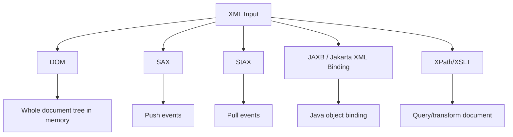
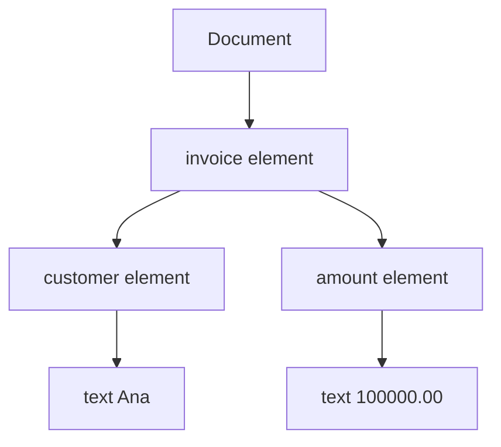
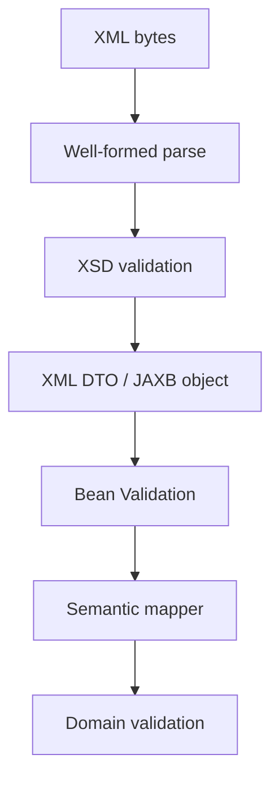
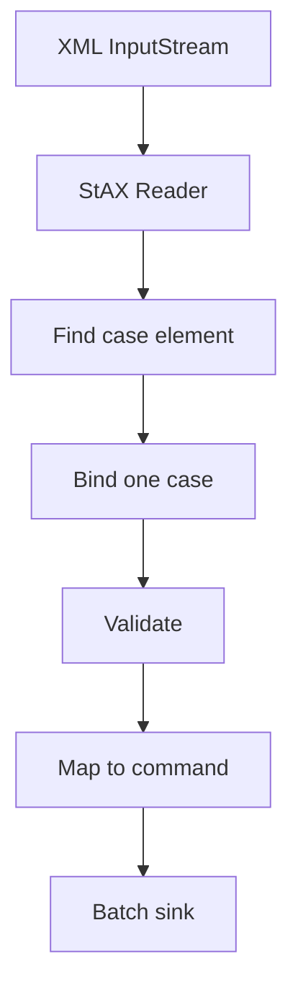

------
title: Learn Java Data Mapper, JSON/XML Processing & Validation - Part 018
description: XML processing mental model untuk Java: DOM, SAX, StAX, JAXB/Jakarta XML Binding, XSD, namespace, schema validity, XML tree/event/binding choices, dan XML vs JSON contract design.
series: learn-java-data-mapper-json-xml-validation
seriesTitle: Learn Java Data Mapper, JSON/XML Processing & Validation
order: 18
partTitle: XML Processing Mental Model: DOM, SAX, StAX, JAXB, XSD, Namespace, Schema Validity
tags:
- java
- xml
- jaxp
- dom
- sax
- stax
- jaxb
- jakarta-xml-binding
- xsd
- namespace
- data-mapper
date: 2026-06-29
---

# Part 018 — XML Processing Mental Model: DOM, SAX, StAX, JAXB, XSD, Namespace, Schema Validity

> **Target skill:** mampu memilih dan menggunakan model pemrosesan XML yang tepat: DOM, SAX, StAX, Jakarta XML Binding/JAXB, XSD validation, namespace-aware parsing, dan schema-driven contract design.

Banyak engineer modern lebih sering bekerja dengan JSON. Akibatnya, XML sering diperlakukan sebagai:

> “JSON yang syntax-nya pakai tag.”

Itu salah.

XML punya konsep yang tidak ada atau tidak dominan di JSON:

- element
- attribute
- namespace
- prefix
- qualified name
- mixed content
- processing instruction
- entity
- CDATA
- schema
- XSD type
- order-sensitive content
- text node
- whitespace semantics
- ID/IDREF
- canonicalization
- XPath/XSLT
- external entity risk

Mental model:

> **XML is not just a data shape. XML is a document model with names, namespaces, order, text, attributes, and schema.**

Part ini bukan deep dive JAXB dulu. Itu Part 019. Ini adalah fondasi mental agar saat masuk JAXB/Jackson XML/security, kita tidak salah memilih abstraction.

---

## 1. Kaufman Deconstruction

Subskill XML processing:

| Subskill | Kemampuan |
|---|---|
| Understand XML document model | Element, attribute, text, namespace, order |
| Choose parser model | DOM vs SAX vs StAX vs binding |
| Reason about schema | XSD validity vs business validity |
| Handle namespaces | QName, prefix, URI, qualified elements |
| Map XML to Java | Kapan JAXB/Jakarta XML Binding cocok |
| Avoid JSON thinking | Tidak memaksakan JSON mental model ke XML |
| Process large XML | Streaming dengan SAX/StAX |
| Validate safely | XSD validation and parser hardening |
| Preserve document semantics | Mixed content/order/attribute vs element |
| Test XML contracts | Golden XML, namespace, schema, invalid fixture |

Latihan utama:

1. Ambil satu XML invoice.
2. Gambar struktur element/attribute/text.
3. Tandai namespace.
4. Pilih DOM/SAX/StAX/JAXB.
5. Buat valid dan invalid XML fixtures.
6. Validasi XSD.
7. Map ke DTO.
8. Test round-trip bila diperlukan.

---

## 2. XML Is a Document Tree

Example:

```xml
<invoice xmlns="https://example.com/invoice"
         xmlns:tax="https://example.com/tax"
         id="INV-001">
    <customer id="CUS-001">Ana</customer>
    <amount currency="IDR">100000.00</amount>
    <tax:withholding rate="2.5">2500.00</tax:withholding>
</invoice>
```

This contains:

| XML construct | Example |
|---|---|
| element | `<invoice>`, `<customer>`, `<amount>` |
| attribute | `id="INV-001"`, `currency="IDR"` |
| default namespace | `xmlns="https://example.com/invoice"` |
| prefixed namespace | `xmlns:tax="https://example.com/tax"` |
| qualified element | `tax:withholding` |
| text node | `Ana`, `100000.00` |
| order | customer before amount before withholding |

JSON equivalent is not exact.

```json
{
  "id": "INV-001",
  "customer": {
    "id": "CUS-001",
    "name": "Ana"
  },
  "amount": {
    "currency": "IDR",
    "value": "100000.00"
  }
}
```

XML has attribute vs element distinction and namespace semantics.

---

## 3. XML Processing Choices



High-level decision:

| Need | Best fit |
|---|---|
| small document + random access | DOM |
| huge document + event processing | SAX or StAX |
| pull-based streaming | StAX |
| object mapping against schema-like shape | JAXB/Jakarta XML Binding |
| query parts of document | XPath |
| transform XML to XML/HTML/text | XSLT |
| simple API JSON-like XML | Jackson XML may be okay |
| strict enterprise XML schema | JAXB + XSD validation |

---

## 4. DOM

DOM builds the whole XML document as tree.



Use DOM when:

- XML is small/medium
- you need random access
- you need modify document tree
- you need XPath over whole document
- you need inspect mixed content
- developer simplicity matters more than memory

Avoid DOM when:

- XML can be very large
- you only need sequential processing
- memory pressure is important
- you process many documents concurrently

Basic parsing:

```java
DocumentBuilderFactory factory = DocumentBuilderFactory.newInstance();
factory.setNamespaceAware(true);

DocumentBuilder builder = factory.newDocumentBuilder();

Document document;
try (InputStream input = Files.newInputStream(path)) {
    document = builder.parse(input);
}

Element root = document.getDocumentElement();
String invoiceId = root.getAttribute("id");
```

Important: use namespace-aware parsing.

---

## 5. SAX

SAX is event-based push parsing.

The parser calls your handler:

```txt
startElement(invoice)
startElement(customer)
characters(Ana)
endElement(customer)
endElement(invoice)
```

Use SAX when:

- XML is large
- sequential processing is enough
- you want low memory usage
- callback style is acceptable
- you do not need to modify tree

SAX handler example:

```java
public final class InvoiceSaxHandler extends DefaultHandler {
    private final StringBuilder text = new StringBuilder();
    private String currentInvoiceId;
    private BigDecimal amount;

    @Override
    public void startElement(
        String uri,
        String localName,
        String qName,
        Attributes attributes
    ) {
        text.setLength(0);

        if ("invoice".equals(localName)) {
            currentInvoiceId = attributes.getValue("id");
        }
    }

    @Override
    public void characters(char[] ch, int start, int length) {
        text.append(ch, start, length);
    }

    @Override
    public void endElement(String uri, String localName, String qName) {
        if ("amount".equals(localName)) {
            amount = new BigDecimal(text.toString().trim());
        }
    }
}
```

SAX is powerful but can become state-machine-heavy.

---

## 6. StAX

StAX is streaming pull parsing. Your code asks for next event/token.

```java
XMLInputFactory factory = XMLInputFactory.newFactory();

try (InputStream input = Files.newInputStream(path)) {
    XMLStreamReader reader = factory.createXMLStreamReader(input);

    while (reader.hasNext()) {
        int event = reader.next();

        if (event == XMLStreamConstants.START_ELEMENT) {
            String localName = reader.getLocalName();
            // handle
        }
    }
}
```

Use StAX when:

- XML is large
- you prefer pull control
- you want to combine streaming with object binding
- you need stop early
- you want simpler control flow than SAX callbacks
- you write XML too

StAX is often excellent for enterprise import/export.

---

## 7. DOM vs SAX vs StAX

| Feature | DOM | SAX | StAX |
|---|---|---|---|
| Memory | high | low | low |
| Access | random | sequential | sequential |
| Control | tree traversal | parser pushes callbacks | app pulls events |
| Modification | easy | no | no tree modification |
| Simplicity | easy for small docs | callback state | explicit loop |
| Large files | risky | good | good |
| Stop early | possible after parse only | possible with exception/control | natural |
| Write XML | separate APIs | no | yes |
| Best use | small docs, XPath, modifications | fast event parsing | controlled streaming |

Rule:

> **DOM is for document-in-memory. SAX/StAX are for document-as-stream. JAXB is for document-as-object.**

---

## 8. JAXB / Jakarta XML Binding

Jakarta XML Binding maps XML to Java objects and Java objects to XML.

Core operations:

- unmarshal XML to Java object tree
- access/update Java representation
- marshal Java object tree to XML
- optionally validate during unmarshal/marshal depending setup

DTO:

```java
@XmlRootElement(name = "invoice")
@XmlAccessorType(XmlAccessType.FIELD)
public class InvoiceXml {
    @XmlAttribute(name = "id")
    private String id;

    @XmlElement(name = "customer")
    private CustomerXml customer;

    @XmlElement(name = "amount")
    private AmountXml amount;

    public String getId() {
        return id;
    }

    public CustomerXml getCustomer() {
        return customer;
    }

    public AmountXml getAmount() {
        return amount;
    }
}
```

Unmarshal:

```java
JAXBContext context = JAXBContext.newInstance(InvoiceXml.class);
Unmarshaller unmarshaller = context.createUnmarshaller();

InvoiceXml invoice;
try (InputStream input = Files.newInputStream(path)) {
    invoice = (InvoiceXml) unmarshaller.unmarshal(input);
}
```

Marshal:

```java
Marshaller marshaller = context.createMarshaller();
marshaller.setProperty(Marshaller.JAXB_FORMATTED_OUTPUT, Boolean.TRUE);
marshaller.marshal(invoice, outputStream);
```

Use JAXB when XML shape maps cleanly to object model and schema-like contract matters.

---

## 9. XSD and Schema Validity

XSD can define:

- element names
- element order
- attributes
- required/optional fields
- simple types
- complex types
- namespaces
- occurrence constraints
- enumerations
- patterns
- numeric restrictions
- date/time types

Example concept:

```xml
<xs:element name="invoice" type="InvoiceType"/>
```

Schema validation answers:

> “Is this XML structurally valid according to schema?”

It does not necessarily answer:

> “Is this invoice allowed by business workflow?”

Distinguish:

| Validation kind | Example |
|---|---|
| well-formedness | XML syntax is valid |
| schema validity | required element exists, type matches XSD |
| semantic/business validity | invoice date is not in closed period |
| referential validity | customer id exists |
| authorization validity | caller can submit invoice |
| regulatory validity | record satisfies reporting rule |

Layering:



---

## 10. Namespace Mental Model

Namespace is not the prefix. Namespace is the URI.

```xml
<tax:withholding xmlns:tax="https://example.com/tax">
```

Here:

| Part | Meaning |
|---|---|
| `tax` | prefix |
| `https://example.com/tax` | namespace URI |
| `withholding` | local name |
| `{https://example.com/tax}withholding` | expanded/QName-like identity |

This matters because prefixes can change:

```xml
<t:withholding xmlns:t="https://example.com/tax">
```

Same namespace, same local name, different prefix. Should be treated as same element.

Always use namespace-aware parsing for serious XML.

DOM:

```java
factory.setNamespaceAware(true);
```

StAX:

```java
String namespaceUri = reader.getNamespaceURI();
String localName = reader.getLocalName();
```

JAXB:

```java
@XmlElement(
    name = "withholding",
    namespace = "https://example.com/tax"
)
private TaxWithholdingXml withholding;
```

---

## 11. Attribute vs Element

XML can represent data as attribute or element.

Attribute:

```xml
<amount currency="IDR">100000.00</amount>
```

Element:

```xml
<amount>
    <value>100000.00</value>
    <currency>IDR</currency>
</amount>
```

Guidelines:

| Use attribute for | Use element for |
|---|---|
| metadata about element | structured data |
| identifiers | repeated values |
| simple codes | long text |
| flags | mixed/complex content |
| compact reference | data needing child structure |

But schema/integration contract decides.

JAXB mapping:

```java
@XmlAttribute(name = "currency")
private String currency;

@XmlValue
private BigDecimal value;
```

for:

```xml
<amount currency="IDR">100000.00</amount>
```

---

## 12. Order Matters

In JSON object, property order is generally not semantically important. In XML schema, element order can be significant.

XSD sequence:

```xml
<xs:sequence>
    <xs:element name="customer"/>
    <xs:element name="amount"/>
    <xs:element name="dueDate"/>
</xs:sequence>
```

Valid:

```xml
<invoice>
    <customer>...</customer>
    <amount>...</amount>
    <dueDate>2026-06-29</dueDate>
</invoice>
```

Invalid if order differs:

```xml
<invoice>
    <amount>...</amount>
    <customer>...</customer>
    <dueDate>2026-06-29</dueDate>
</invoice>
```

JAXB ordering:

```java
@XmlType(propOrder = {"customer", "amount", "dueDate"})
public class InvoiceXml {
}
```

Order is contract.

---

## 13. Text, Whitespace, and Mixed Content

XML:

```xml
<message>Hello <b>Ana</b>, welcome.</message>
```

This is mixed content: text and element children interleaved.

Object mapping becomes harder.

Use cases:

- documents
- rich text
- legal/regulatory text
- templates
- XHTML-like payloads

Do not assume every XML is simple data object.

If XML is document-like, DOM/XPath/XSLT may be better than JAXB.

---

## 14. CDATA and Escaping

CDATA:

```xml
<description><![CDATA[Use < and > literally]]></description>
```

CDATA is a syntax feature. After parsing, content is text.

Escaped equivalent:

```xml
<description>Use &lt; and &gt; literally</description>
```

Most business logic should not care whether input used CDATA or escaped text, unless preserving exact lexical form is required.

---

## 15. Entity and Security Awareness

XML entities can be dangerous if parser is not hardened.

Risks:

- XXE
- external entity fetch
- local file disclosure
- SSRF
- entity expansion attacks
- schema import fetching untrusted URLs
- DTD processing surprises

Security deep dive is Part 021, but mental model starts here:

> **Never parse untrusted XML with default assumptions. Harden parser configuration.**

For now, remember:

- disable external entity resolution unless required
- enable secure processing where applicable
- restrict external schema/DTD access
- set limits
- avoid network fetching during parse
- validate safely

---

## 16. XML vs JSON Mapping Differences

| Concern | JSON | XML |
|---|---|---|
| object fields | properties | elements/attributes |
| array/list | array | repeated elements |
| namespace | no native equivalent | central concept |
| order | usually irrelevant | often relevant |
| schema | JSON Schema optional | XSD common in enterprise |
| mixed content | uncommon | native |
| comments/PI | not in JSON data model | possible |
| entity | no | yes |
| streaming | token parser | SAX/StAX |
| object binding | Jackson databind | JAXB/Jakarta XML Binding/Jackson XML |
| canonicalization | less common | important for signatures |

Do not design XML by mechanically translating JSON.

---

## 17. XML Contract Shape Examples

### 17.1 Element-Centric

```xml
<customer>
    <id>CUS-001</id>
    <fullName>Ana Maria</fullName>
    <email>ana@example.com</email>
</customer>
```

Java:

```java
@XmlRootElement(name = "customer")
@XmlAccessorType(XmlAccessType.FIELD)
public class CustomerXml {
    @XmlElement(name = "id")
    private String id;

    @XmlElement(name = "fullName")
    private String fullName;

    @XmlElement(name = "email")
    private String email;
}
```

### 17.2 Attribute-Centric

```xml
<customer id="CUS-001" status="ACTIVE">
    <fullName>Ana Maria</fullName>
</customer>
```

Java:

```java
@XmlAttribute(name = "id")
private String id;

@XmlAttribute(name = "status")
private String status;

@XmlElement(name = "fullName")
private String fullName;
```

### 17.3 Namespaced

```xml
<cust:customer xmlns:cust="https://example.com/customer">
    <cust:id>CUS-001</cust:id>
</cust:customer>
```

Java:

```java
@XmlRootElement(
    name = "customer",
    namespace = "https://example.com/customer"
)
public class CustomerXml {
    @XmlElement(
        name = "id",
        namespace = "https://example.com/customer"
    )
    private String id;
}
```

---

## 18. Choosing JAXB vs Jackson XML

This series covers both. High-level decision:

| Situation | Prefer |
|---|---|
| schema-first enterprise XML | JAXB/Jakarta XML Binding |
| strict XSD integration | JAXB + XSD validation |
| Java object ↔ XML document with annotations | JAXB |
| JSON-like XML for simple API | Jackson XML possible |
| same DTO serialized to JSON and XML | Jackson XML possible with caution |
| namespace-heavy XML | JAXB often clearer |
| mixed content/document XML | DOM/SAX/StAX/XPath; JAXB if model fits |
| large XML import | StAX/SAX + partial binding |
| need exact schema compliance | JAXB/XSD-oriented design |

Jackson XML is convenient, but XML is not JSON. For schema-heavy integrations, JAXB often maps XML concepts more directly.

---

## 19. XML Validation Layers with Jakarta Validation

You may have both:

1. XSD validation
2. Jakarta Validation

Example:

XSD says:

```txt
amount element must be decimal
currency attribute required
```

Jakarta Validation says:

```java
public class AmountXml {
    @XmlAttribute(name = "currency")
    @NotBlank
    @Pattern(regexp = "[A-Z]{3}")
    private String currency;

    @XmlValue
    @NotNull
    @DecimalMin("0.01")
    private BigDecimal value;
}
```

Domain says:

```txt
currency must be supported for product
amount must not exceed daily limit
```

Do not collapse all validation into one layer.

---

## 20. Large XML Import Pattern

For very large XML:

```xml
<cases>
    <case>...</case>
    <case>...</case>
    <case>...</case>
</cases>
```

Use StAX to stream to each `<case>`, then JAXB/Jackson XML bind each subtree if needed.

Conceptual flow:



This avoids loading all cases into memory.

---

## 21. Error Design for XML

Error should include:

- line/column if parser provides
- XPath-like path if possible
- schema validation message
- stable error code
- rejected element/attribute
- safe value
- correlation/import id

Example:

```json
{
  "code": "INVALID_XML_SCHEMA",
  "path": "/invoice/amount",
  "line": 12,
  "column": 18,
  "message": "amount must be decimal"
}
```

For batch imports:

```json
{
  "code": "INVALID_CASE_RECORD",
  "recordIndex": 27,
  "path": "/cases/case[27]/priority",
  "message": "priority is required"
}
```

---

## 22. Testing XML Contracts

### 22.1 Well-Formed Invalid

```xml
<invoice>
    <amount>100.00</invoice>
```

Expected: parser error.

### 22.2 Schema Invalid

```xml
<invoice id="INV-001">
    <amount currency="IDR">abc</amount>
</invoice>
```

Expected: XSD validation error.

### 22.3 Business Invalid

```xml
<invoice id="INV-001">
    <amount currency="IDR">-100.00</amount>
</invoice>
```

Expected: bean/domain validation error.

### 22.4 Namespace Fixture

```xml
<inv:invoice xmlns:inv="https://example.com/invoice" id="INV-001">
    <inv:amount currency="IDR">100.00</inv:amount>
</inv:invoice>
```

Expected: parsed correctly by namespace URI, not prefix string.

### 22.5 Golden Marshal Fixture

If you produce XML, compare output structurally. Raw string comparison can be brittle due to formatting/prefix differences.

For strict integrations, canonicalization or schema validation may be needed.

---

## 23. XML Processing Anti-Patterns

### 23.1 Namespace-Unaware Parsing

Parsing without namespace awareness breaks real XML integrations.

### 23.2 DOM for Huge Files

Works in test, fails in production.

### 23.3 Treating Attributes and Elements as Interchangeable

They are contract choices.

### 23.4 Ignoring Element Order

XSD may require order.

### 23.5 Disabling Schema Validation Because It Is Annoying

Schema validation catches integration errors early.

### 23.6 Exposing JAXB Object as Domain Model

XML binding model is boundary model. Map to domain command/value objects.

### 23.7 Trusting Default Parser Security

Untrusted XML needs hardening.

---

## 24. Decision Matrix

| Problem | Best Default |
|---|---|
| small config XML | DOM or JAXB |
| large import XML | StAX/SAX |
| strict schema-first integration | JAXB + XSD |
| generate XML for partner | JAXB with schema/golden tests |
| query a few nodes from small doc | DOM + XPath |
| transform XML to another XML | XSLT or streaming transform |
| document-like mixed content | DOM/SAX/StAX depending need |
| XML with many namespaces | JAXB or namespace-aware StAX |
| JSON-like simple XML | Jackson XML possible |
| untrusted XML | hardened parser + limits |

---

## 25. Mini Case Study: Regulatory Case XML Import

Input:

```xml
<cases xmlns="https://example.com/regulatory/case">
    <case id="CASE-001">
        <title>Suspicious Activity</title>
        <priority>HIGH</priority>
        <reportedAt>2026-06-29T03:00:00Z</reportedAt>
        <party id="PTY-001" role="SUBJECT">
            <name>Ana</name>
        </party>
    </case>
</cases>
```

Boundary model:

```java
@XmlRootElement(name = "case", namespace = "https://example.com/regulatory/case")
@XmlAccessorType(XmlAccessType.FIELD)
public class CaseXml {
    @XmlAttribute(name = "id")
    private String id;

    @XmlElement(name = "title", namespace = "https://example.com/regulatory/case")
    private String title;

    @XmlElement(name = "priority", namespace = "https://example.com/regulatory/case")
    private String priority;

    @XmlElement(name = "reportedAt", namespace = "https://example.com/regulatory/case")
    private String reportedAt;

    @XmlElement(name = "party", namespace = "https://example.com/regulatory/case")
    private List<PartyXml> parties;
}
```

Semantic mapping:

```java
public record CreateCaseCommand(
    CaseId caseId,
    String title,
    Priority priority,
    Instant reportedAt,
    List<PartyCommand> parties
) {}
```

Do not let `CaseXml` become domain aggregate. It is a boundary representation.

---

## 26. Practice Drill

Given XML:

```xml
<payment xmlns="https://example.com/payment" id="PAY-001">
    <amount currency="IDR">100000.00</amount>
    <payer id="CUS-001">
        <name>Ana</name>
    </payer>
    <method type="BANK_TRANSFER">
        <bankCode>014</bankCode>
        <accountNumber>001234567890</accountNumber>
    </method>
</payment>
```

Tasks:

1. Identify elements, attributes, text nodes.
2. Identify namespace URI and local names.
3. Decide DOM/SAX/StAX/JAXB.
4. Create JAXB boundary classes.
5. Define XSD-level validation candidates.
6. Define Jakarta Validation candidates.
7. Define domain validation candidates.
8. Map to domain command.
9. Create invalid fixtures:
   - missing amount
   - invalid currency
   - wrong namespace
   - method missing bankCode
   - malformed XML
10. Define production parser hardening checklist.

---

## 27. Summary

XML processing requires a different mental model from JSON.

Mental model:

> **XML is a document model; choose tree, event, stream, or binding based on document shape and operational constraints.**

Rules:

1. XML has elements, attributes, namespaces, text, order, and schema.
2. DOM loads the whole document tree.
3. SAX is push event streaming.
4. StAX is pull event streaming.
5. JAXB/Jakarta XML Binding maps XML and Java object trees.
6. XSD validation is not the same as business validation.
7. Namespace URI matters more than prefix.
8. Attribute vs element is a contract decision.
9. Order can matter.
10. Large XML should use streaming.
11. Untrusted XML must be hardened.
12. XML boundary objects should map to domain objects, not become domain objects.

Part berikutnya deep dives into Jakarta XML Binding/JAXB: annotations, marshal/unmarshal lifecycle, schema validation, adapters, namespaces, and production patterns.

---

## References

- Java SE `java.xml` Module Summary: https://docs.oracle.com/en/java/javase/11/docs/api/java.xml/module-summary.html
- Oracle JAXP Tutorial: https://www.oracle.com/java/technologies/jaxp-introduction.html
- Oracle StAX Tutorial: https://docs.oracle.com/javase/tutorial/jaxp/stax/why.html
- Jakarta XML Binding Specification: https://jakarta.ee/specifications/xml-binding/3.0/jakarta-xml-binding-spec-3.0
- Jakarta XML Binding `Unmarshaller` API: https://jakarta.ee/specifications/xml-binding/4.0/apidocs/jakarta.xml.bind/jakarta/xml/bind/unmarshaller
- JAXP Security Guide: https://docs.oracle.com/javase/8/docs/technotes/guides/security/jaxp/jaxp.html
