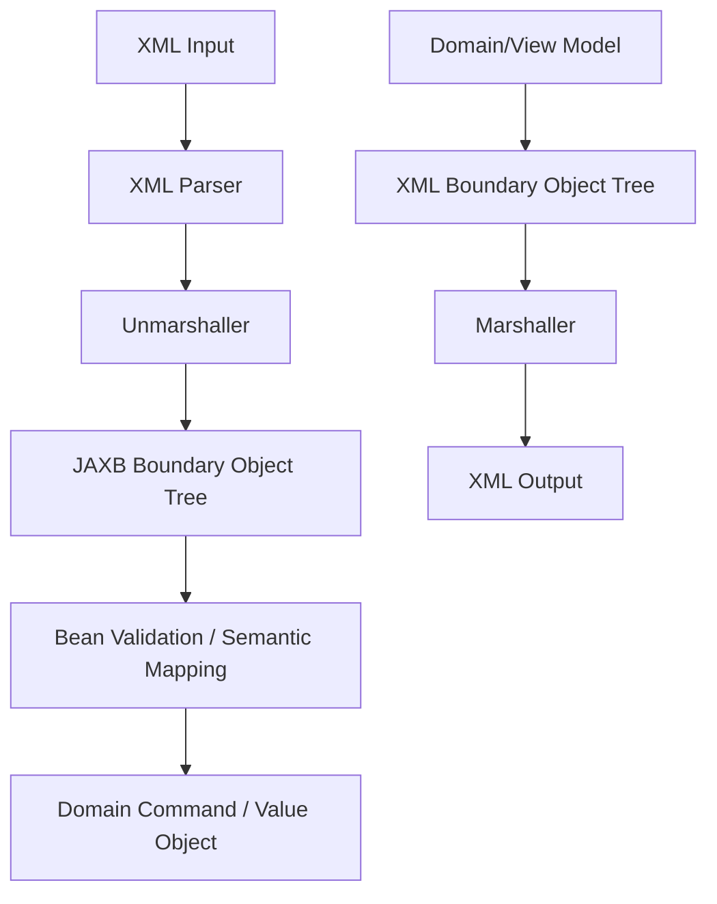

------
title: Learn Java Data Mapper, JSON/XML Processing & Validation - Part 019
description: Jakarta XML Binding/JAXB deep dive: marshal, unmarshal, annotations, namespace, XmlAdapter, JAXBElement, XSD validation, schema-aware XML DTO design, and production pitfalls.
series: learn-java-data-mapper-json-xml-validation
seriesTitle: Learn Java Data Mapper, JSON/XML Processing & Validation
order: 19
partTitle: Jakarta XML Binding/JAXB: Marshal, Unmarshal, Annotation Model, Schema-Aware Design
tags:
- java
- xml
- jaxb
- jakarta-xml-binding
- marshalling
- unmarshalling
- xsd
- namespace
- xml-adapter
- validation
- data-mapper
date: 2026-06-29
---

# Part 019 — Jakarta XML Binding/JAXB: Marshal, Unmarshal, Annotation Model, Schema-Aware Design

> **Target skill:** mampu memakai Jakarta XML Binding/JAXB untuk schema-aware XML boundary model: XML ↔ Java object tree, namespace, attributes/elements, adapters, validation, error handling, and production-grade mapping discipline.

Part 018 membangun mental model XML: XML adalah document model, bukan sekadar JSON dengan tag. Sekarang kita masuk ke **Jakarta XML Binding**, yang secara historis dikenal sebagai JAXB.

Jakarta XML Binding menyediakan API dan tools untuk mengotomatisasi mapping antara XML documents dan Java objects. Dalam praktik, kita memakai annotation seperti:

- `@XmlRootElement`
- `@XmlAccessorType`
- `@XmlElement`
- `@XmlAttribute`
- `@XmlValue`
- `@XmlElementWrapper`
- `@XmlType`
- `@XmlSchema`
- `@XmlJavaTypeAdapter`

serta runtime objects seperti:

- `JAXBContext`
- `Marshaller`
- `Unmarshaller`
- `JAXBElement`
- `ValidationEventHandler`

Mental model:

> **JAXB is not a replacement for domain modelling. JAXB is a boundary binding layer between XML document shape and Java object shape.**

---

## 1. Kaufman Deconstruction

Skill JAXB kita pecah menjadi subskill:

| Subskill | Kemampuan |
|---|---|
| Model XML classes | Membuat boundary class sesuai element/attribute/namespace/order |
| Unmarshal | Mengubah XML menjadi Java object tree |
| Marshal | Mengubah Java object tree menjadi XML |
| Use annotations | Mengontrol root, element, attribute, value, list, order |
| Handle namespace | Memahami namespace URI vs prefix |
| Use adapters | Mengubah lexical XML value ke Java type yang lebih tepat |
| Validate with XSD | Memasang schema validation saat unmarshal/marshal |
| Handle errors | Menghasilkan error path/line/supportable message |
| Avoid domain leakage | Memetakan XML DTO ke command/domain, bukan memakai XML DTO sebagai domain |
| Test contract | Golden XML, schema fixtures, namespace fixtures, invalid XML fixtures |

Latihan inti:

1. Ambil XML contract.
2. Buat class JAXB.
3. Unmarshal XML valid.
4. Marshal object ke XML.
5. Validasi dengan XSD.
6. Tambahkan `XmlAdapter` untuk date/money/code.
7. Map JAXB DTO ke domain command.
8. Buat invalid fixture dan error handling.

---

## 2. JAXB Lifecycle



Key objects:

| Object | Role |
|---|---|
| `JAXBContext` | metadata/context for bound classes |
| `Unmarshaller` | XML → Java object |
| `Marshaller` | Java object → XML |
| `Schema` | XSD validation metadata |
| `ValidationEventHandler` | handle schema/binding validation events |
| `JAXBElement<T>` | XML element wrapper when class/root element mapping is not direct |

Production principle:

- Build/reuse `JAXBContext` as metadata object.
- Create/configure `Marshaller`/`Unmarshaller` per operation/thread as needed.
- Do not mutate global binding behavior casually.
- Keep XML DTO separate from domain model.

---

## 3. Basic JAXB Class

XML:

```xml
<customer id="CUS-001">
    <fullName>Ana Maria</fullName>
    <email>ana@example.com</email>
</customer>
```

JAXB class:

```java
@XmlRootElement(name = "customer")
@XmlAccessorType(XmlAccessType.FIELD)
public class CustomerXml {

    @XmlAttribute(name = "id")
    private String id;

    @XmlElement(name = "fullName", required = true)
    private String fullName;

    @XmlElement(name = "email")
    private String email;

    public String getId() {
        return id;
    }

    public String getFullName() {
        return fullName;
    }

    public String getEmail() {
        return email;
    }
}
```

Unmarshal:

```java
JAXBContext context = JAXBContext.newInstance(CustomerXml.class);
Unmarshaller unmarshaller = context.createUnmarshaller();

CustomerXml customer;
try (InputStream input = Files.newInputStream(path)) {
    customer = (CustomerXml) unmarshaller.unmarshal(input);
}
```

Marshal:

```java
Marshaller marshaller = context.createMarshaller();
marshaller.setProperty(Marshaller.JAXB_FORMATTED_OUTPUT, Boolean.TRUE);
marshaller.marshal(customer, outputStream);
```

---

## 4. `@XmlAccessorType`

Controls whether JAXB binds fields, properties, public members, or none.

Common:

```java
@XmlAccessorType(XmlAccessType.FIELD)
```

Options:

| Access Type | Meaning |
|---|---|
| `FIELD` | bind non-static, non-transient fields unless annotated otherwise |
| `PROPERTY` | bind JavaBean getters/setters |
| `PUBLIC_MEMBER` | bind public fields/properties |
| `NONE` | bind only explicitly annotated members |

Production recommendation:

- Use `FIELD` for simple boundary DTOs.
- Use `NONE` if you want strict explicit binding.
- Avoid mixing field and property annotations randomly.

Example strict explicit:

```java
@XmlAccessorType(XmlAccessType.NONE)
public class PaymentXml {
    @XmlAttribute(name = "id")
    private String id;

    @XmlElement(name = "amount")
    private AmountXml amount;
}
```

---

## 5. Element vs Attribute

XML:

```xml
<amount currency="IDR">100000.00</amount>
```

JAXB:

```java
@XmlAccessorType(XmlAccessType.FIELD)
public class AmountXml {

    @XmlAttribute(name = "currency", required = true)
    private String currency;

    @XmlValue
    private BigDecimal value;

    public String getCurrency() {
        return currency;
    }

    public BigDecimal getValue() {
        return value;
    }
}
```

XML:

```xml
<amount>
    <value>100000.00</value>
    <currency>IDR</currency>
</amount>
```

JAXB:

```java
@XmlAccessorType(XmlAccessType.FIELD)
public class AmountXml {

    @XmlElement(name = "value", required = true)
    private BigDecimal value;

    @XmlElement(name = "currency", required = true)
    private String currency;
}
```

Element/attribute choice is contract-driven, not Java convenience.

---

## 6. Root Element and `JAXBElement`

`@XmlRootElement` allows a class to be used directly as XML document root.

```java
@XmlRootElement(name = "invoice")
public class InvoiceXml {
}
```

If a class does not have root element metadata, JAXB may require `JAXBElement<T>`.

```java
QName name = new QName("https://example.com/invoice", "invoice");
JAXBElement<InvoiceXml> root = new JAXBElement<>(
    name,
    InvoiceXml.class,
    invoice
);

marshaller.marshal(root, outputStream);
```

Use `JAXBElement` when:

- generated schema classes lack direct root annotation
- same Java type appears under different element names
- element name/namespace must be supplied dynamically
- schema-first generation requires it

For hand-written DTOs, `@XmlRootElement` is usually easier.

---

## 7. Namespace Handling

XML:

```xml
<inv:invoice xmlns:inv="https://example.com/invoice" id="INV-001">
    <inv:amount currency="IDR">100000.00</inv:amount>
</inv:invoice>
```

Class:

```java
@XmlRootElement(
    name = "invoice",
    namespace = "https://example.com/invoice"
)
@XmlAccessorType(XmlAccessType.FIELD)
public class InvoiceXml {

    @XmlAttribute(name = "id")
    private String id;

    @XmlElement(
        name = "amount",
        namespace = "https://example.com/invoice",
        required = true
    )
    private AmountXml amount;
}
```

Package-level `package-info.java` can define namespace policy:

```java
@jakarta.xml.bind.annotation.XmlSchema(
    namespace = "https://example.com/invoice",
    elementFormDefault = jakarta.xml.bind.annotation.XmlNsForm.QUALIFIED
)
package com.example.invoice.xml;
```

Then fields can be simpler:

```java
@XmlElement(name = "amount")
private AmountXml amount;
```

Production rule:

> **Namespace URI is the identity. Prefix is serialization detail.**

Do not parse business logic based on prefix string.

---

## 8. Element Order with `@XmlType`

XML Schema often requires order.

```java
@XmlType(propOrder = {
    "customer",
    "amount",
    "dueDate"
})
@XmlAccessorType(XmlAccessType.FIELD)
public class InvoiceXml {

    @XmlElement(name = "customer")
    private CustomerXml customer;

    @XmlElement(name = "amount")
    private AmountXml amount;

    @XmlElement(name = "dueDate")
    private LocalDate dueDate;
}
```

This controls marshal order.

If partner systems validate against XSD sequence, ordering matters.

---

## 9. Lists and Wrappers

Unwrapped repeated elements:

```xml
<invoice>
    <line>...</line>
    <line>...</line>
</invoice>
```

JAXB:

```java
@XmlElement(name = "line")
private List<InvoiceLineXml> lines = new ArrayList<>();
```

Wrapped collection:

```xml
<invoice>
    <lines>
        <line>...</line>
        <line>...</line>
    </lines>
</invoice>
```

JAXB:

```java
@XmlElementWrapper(name = "lines")
@XmlElement(name = "line")
private List<InvoiceLineXml> lines = new ArrayList<>();
```

Decision:

| Shape | Contract meaning |
|---|---|
| repeated direct elements | compact, common in schema-first XML |
| wrapper element | clearer collection container |
| both accepted | migration/compatibility complexity |

Be explicit.

---

## 10. Required Fields Are Not Enough

`required = true` in `@XmlElement` is not the same as runtime business validation unless XSD validation is involved.

```java
@XmlElement(name = "customerId", required = true)
private String customerId;
```

This contributes metadata/schema intent, but you still need validation.

```java
@NotBlank
@XmlElement(name = "customerId", required = true)
private String customerId;
```

Layering:

| Rule | Layer |
|---|---|
| element must exist according to XSD | XSD validation |
| Java field must not be blank | Jakarta Validation |
| customer must exist | application/domain |
| caller can use customer | authorization/domain |

Do not rely on one annotation family to do all validation.

---

## 11. `XmlAdapter`

XML lexical form often differs from Java domain type.

Example XML:

```xml
<reportedAt>2026-06-29T03:00:00Z</reportedAt>
```

Java wants `Instant`.

Adapter:

```java
public final class InstantXmlAdapter
    extends XmlAdapter<String, Instant> {

    @Override
    public Instant unmarshal(String value) {
        if (value == null || value.isBlank()) {
            return null;
        }
        return Instant.parse(value);
    }

    @Override
    public String marshal(Instant value) {
        return value == null ? null : value.toString();
    }
}
```

Usage:

```java
@XmlJavaTypeAdapter(InstantXmlAdapter.class)
@XmlElement(name = "reportedAt", required = true)
private Instant reportedAt;
```

Use adapters for:

- `Instant`
- `LocalDate`
- `YearMonth`
- value objects
- code normalization
- money lexical shape
- legacy date formats
- enum codes

Adapter rule:

> **Adapter converts lexical representation. It should not perform business decisions.**

---

## 12. Value Object Adapter

Value object:

```java
public record CaseId(String value) {
    public CaseId {
        if (value == null || !value.matches("CASE-\\d{3,}")) {
            throw new IllegalArgumentException("invalid case id");
        }
    }
}
```

Adapter:

```java
public final class CaseIdXmlAdapter
    extends XmlAdapter<String, CaseId> {

    @Override
    public CaseId unmarshal(String value) {
        return value == null ? null : new CaseId(value);
    }

    @Override
    public String marshal(CaseId value) {
        return value == null ? null : value.value();
    }
}
```

Usage:

```java
@XmlJavaTypeAdapter(CaseIdXmlAdapter.class)
@XmlAttribute(name = "id", required = true)
private CaseId id;
```

Caution: for schema-first DTOs, it may be cleaner to keep XML DTO field as `String`, then map to `CaseId` later. That makes XSD shape and Java domain shape independently clear.

---

## 13. Schema Validation on Unmarshal

Attach XSD schema to unmarshaller.

```java
SchemaFactory schemaFactory =
    SchemaFactory.newInstance(XMLConstants.W3C_XML_SCHEMA_NS_URI);

Schema schema = schemaFactory.newSchema(xsdFile);

Unmarshaller unmarshaller = context.createUnmarshaller();
unmarshaller.setSchema(schema);
```

Now unmarshal validates XML against XSD.

```java
try (InputStream input = Files.newInputStream(xmlPath)) {
    InvoiceXml invoice = (InvoiceXml) unmarshaller.unmarshal(input);
}
```

Validation event handler:

```java
unmarshaller.setEventHandler(event -> {
    ValidationEventLocator locator = event.getLocator();

    String message = "XML validation error at line %d column %d: %s"
        .formatted(
            locator.getLineNumber(),
            locator.getColumnNumber(),
            event.getMessage()
        );

    throw new RuntimeException(message);
});
```

In production, map this to structured error:

```json
{
  "code": "INVALID_XML_SCHEMA",
  "line": 12,
  "column": 8,
  "message": "..."
}
```

---

## 14. Schema Validation on Marshal

You can also attach schema to marshaller.

```java
Marshaller marshaller = context.createMarshaller();
marshaller.setSchema(schema);
marshaller.marshal(invoice, outputStream);
```

This ensures generated XML conforms to schema before sending to partner/regulator.

Use for:

- regulatory submissions
- partner integrations
- generated official files
- signed XML workflows
- strict B2B contracts

---

## 15. JAXBContext Lifecycle

Avoid creating `JAXBContext` on every request if avoidable.

```java
public final class InvoiceXmlBinding {
    private final JAXBContext context;
    private final Schema schema;

    public InvoiceXmlBinding(Schema schema) {
        try {
            this.context = JAXBContext.newInstance(InvoiceXml.class);
            this.schema = schema;
        } catch (JAXBException ex) {
            throw new IllegalStateException("Failed to initialize JAXB context", ex);
        }
    }

    public InvoiceXml unmarshal(InputStream input) {
        try {
            Unmarshaller unmarshaller = context.createUnmarshaller();
            unmarshaller.setSchema(schema);
            return (InvoiceXml) unmarshaller.unmarshal(input);
        } catch (JAXBException ex) {
            throw new XmlBindingException("Failed to unmarshal invoice XML", ex);
        }
    }

    public void marshal(InvoiceXml invoice, OutputStream output) {
        try {
            Marshaller marshaller = context.createMarshaller();
            marshaller.setSchema(schema);
            marshaller.setProperty(Marshaller.JAXB_FORMATTED_OUTPUT, Boolean.TRUE);
            marshaller.marshal(invoice, output);
        } catch (JAXBException ex) {
            throw new XmlBindingException("Failed to marshal invoice XML", ex);
        }
    }
}
```

Threading note:

- Reuse `JAXBContext`.
- Create/configure `Marshaller` and `Unmarshaller` per operation/thread.
- Avoid sharing mutable marshaller/unmarshaller instances across threads unless provider documentation explicitly guarantees safety.

---

## 16. Mapping XML DTO to Domain Command

XML DTO:

```java
@XmlAccessorType(XmlAccessType.FIELD)
public class CaseXml {

    @XmlAttribute(name = "id", required = true)
    private String id;

    @XmlElement(name = "title", required = true)
    private String title;

    @XmlElement(name = "priority", required = true)
    private String priority;

    @XmlJavaTypeAdapter(InstantXmlAdapter.class)
    @XmlElement(name = "reportedAt", required = true)
    private Instant reportedAt;

    public String getId() { return id; }
    public String getTitle() { return title; }
    public String getPriority() { return priority; }
    public Instant getReportedAt() { return reportedAt; }
}
```

Domain command:

```java
public record CreateCaseCommand(
    CaseId caseId,
    String title,
    Priority priority,
    Instant reportedAt
) {}
```

Mapper:

```java
@Mapper(unmappedTargetPolicy = ReportingPolicy.ERROR)
public interface CaseXmlMapper {

    default CreateCaseCommand toCommand(CaseXml xml) {
        return new CreateCaseCommand(
            new CaseId(xml.getId()),
            xml.getTitle(),
            Priority.valueOf(xml.getPriority()),
            xml.getReportedAt()
        );
    }
}
```

This separation matters:

- XML DTO is shaped by XML contract.
- Domain command is shaped by use case.
- MapStruct/manual mapping is semantic boundary.

---

## 17. Jakarta Validation on JAXB Objects

You can annotate XML DTOs with Jakarta Validation:

```java
@XmlAccessorType(XmlAccessType.FIELD)
public class PartyXml {

    @NotBlank
    @XmlAttribute(name = "id", required = true)
    private String id;

    @NotBlank
    @XmlAttribute(name = "role", required = true)
    private String role;

    @NotBlank
    @XmlElement(name = "name", required = true)
    private String name;
}
```

Validate after unmarshal:

```java
Set<ConstraintViolation<CaseXml>> violations = validator.validate(caseXml);

if (!violations.isEmpty()) {
    throw new XmlSemanticValidationException(violations);
}
```

Use `@Valid` for cascaded child validation:

```java
@Valid
@XmlElement(name = "party")
private List<PartyXml> parties = new ArrayList<>();
```

Remember:

- XSD catches XML structural/type validity.
- Jakarta Validation catches Java object constraints.
- Domain model catches business invariants.

---

## 18. Handling `xsi:nil`

XML can represent nil:

```xml
<middleName xsi:nil="true"
            xmlns:xsi="http://www.w3.org/2001/XMLSchema-instance"/>
```

This is different from missing element and empty element.

Cases:

```xml
<!-- missing -->
<customer>
    <fullName>Ana</fullName>
</customer>

<!-- empty -->
<middleName></middleName>

<!-- nil -->
<middleName xsi:nil="true"/>
```

Contract must define meaning:

| XML state | Possible meaning |
|---|---|
| missing element | not provided / default |
| empty element | empty string/value |
| `xsi:nil=true` | explicit null |
| whitespace text | blank or significant |

JAXB handling depends on annotation/schema. Test it.

---

## 19. Mixed Content and Extensions

XML:

```xml
<note>Hello <b>Ana</b>, welcome.</note>
```

This is mixed content: text and elements interleaved. JAXB can model it with `@XmlMixed`, but this is a document-style problem. For rich document XML, DOM/StAX/XPath may be clearer.

For extension elements:

```java
@XmlAnyElement(lax = true)
private List<Object> extensions;
```

Use when:

- partner can add extension elements
- schema allows `xs:any`
- forward compatibility matters
- unknown data must be stored/audited

Governance:

- extension namespace allowlist
- max number/depth
- no secret logging
- clear promotion path from extension to first-class field

---

## 20. Package-Level Namespace and Prefixes

`package-info.java`:

```java
@jakarta.xml.bind.annotation.XmlSchema(
    namespace = "https://example.com/payment",
    elementFormDefault = jakarta.xml.bind.annotation.XmlNsForm.QUALIFIED,
    xmlns = {
        @jakarta.xml.bind.annotation.XmlNs(
            prefix = "pay",
            namespaceURI = "https://example.com/payment"
        )
    }
)
package com.example.payment.xml;
```

This helps marshal output with preferred prefix.

But remember:

- prefix is not semantic identity
- consumers should use namespace URI
- partner might require specific prefix for brittle systems; document if so
- signatures/canonicalization can make lexical details important

---

## 21. Schema-First vs Code-First

### 21.1 Schema-First

XSD is source of truth. Java classes are generated or designed from schema.

Use when:

- regulator/partner provides XSD
- XML contract is legally governed
- interoperability is primary
- schema validation is mandatory
- element order/namespaces are strict

### 21.2 Code-First

Java classes are source, XML generated from classes.

Use when:

- your team owns XML contract
- contract is simple
- schema is derived for documentation
- integration is internal

For enterprise B2B/regulatory XML, schema-first is common and safer.

---

## 22. Error Categories

| Failure | Example | Layer |
|---|---|---|
| malformed XML | unclosed tag | parser |
| XXE/security blocked | external entity access | parser security |
| schema invalid | missing required element | XSD |
| binding invalid | cannot convert text to Java type | JAXB |
| bean invalid | `@NotBlank` violated | Jakarta Validation |
| semantic invalid | unsupported priority | mapper/domain |
| referential invalid | customer id not found | application |
| authorization invalid | caller cannot submit | application |

Do not return all as “bad XML”. Precise error category improves supportability.

---

## 23. Testing Strategy

### 23.1 Valid Unmarshal

```java
@Test
void unmarshal_validInvoice() {
    InvoiceXml invoice = binding.unmarshal(resource("invoice-valid.xml"));

    assertThat(invoice.getId()).isEqualTo("INV-001");
}
```

### 23.2 Schema Invalid

```java
@Test
void unmarshal_rejectsSchemaInvalidXml() {
    assertThatThrownBy(() -> binding.unmarshal(resource("invoice-missing-amount.xml")))
        .isInstanceOf(XmlBindingException.class);
}
```

### 23.3 Namespace Fixture

```java
@Test
void unmarshal_acceptsDifferentPrefixSameNamespace() {
    InvoiceXml invoice = binding.unmarshal(resource("invoice-prefix-changed.xml"));

    assertThat(invoice.getId()).isEqualTo("INV-001");
}
```

### 23.4 Marshal Golden Test

```java
@Test
void marshal_generatesSchemaValidXml() {
    InvoiceXml invoice = fixtureInvoice();

    byte[] xml = binding.marshalToBytes(invoice);

    assertThatCode(() -> binding.validate(xml)).doesNotThrowAnyException();
}
```

### 23.5 Adapter Test

```java
@Test
void instantAdapter_roundTrips() throws Exception {
    InstantXmlAdapter adapter = new InstantXmlAdapter();

    Instant instant = adapter.unmarshal("2026-06-29T03:00:00Z");

    assertThat(adapter.marshal(instant)).isEqualTo("2026-06-29T03:00:00Z");
}
```

---

## 24. Common Anti-Patterns

### 24.1 JAXB Class as Domain Aggregate

XML contract change should not force domain redesign.

### 24.2 Missing Namespace

Annotations omit namespace, tests pass with simplistic XML, production partner sends namespaced XML.

### 24.3 No XSD Validation

You accept invalid XML, then fail later in domain logic with unclear error.

### 24.4 `JAXBContext` Per Request

Unnecessary cost and inconsistent setup.

### 24.5 Sharing `Unmarshaller` Across Threads

Mutable instance risk.

### 24.6 Adapter Does Business Logic

Adapter should parse lexical representation, not decide workflow.

### 24.7 Trusting Prefix

Prefix can change. Namespace URI matters.

### 24.8 String Comparison of XML Output Only

Formatting/prefix/order can make raw comparison brittle. Use schema validation, XML-aware comparison, or canonicalization when needed.

---

## 25. Production Checklist

Before approving JAXB integration:

- [ ] Is XML schema-first or code-first?
- [ ] Is namespace explicitly modelled?
- [ ] Is `@XmlAccessorType` consistent?
- [ ] Are attributes/elements mapped intentionally?
- [ ] Is element order specified if schema requires it?
- [ ] Are collections wrapped/unwrapped intentionally?
- [ ] Is XSD validation configured?
- [ ] Is parser security hardened?
- [ ] Is `JAXBContext` reused?
- [ ] Are `Marshaller`/`Unmarshaller` per operation/thread?
- [ ] Are XML DTOs mapped to domain commands?
- [ ] Are Jakarta Validation constraints applied where useful?
- [ ] Are adapters tested?
- [ ] Are invalid fixtures included?
- [ ] Is error model structured with line/column/path?
- [ ] Are namespace prefix variations tested?
- [ ] Is generated XML schema-valid?
- [ ] Are large XML files handled with streaming if needed?

---

## 26. Mini Case Study: Payment XML

XML:

```xml
<pay:payment xmlns:pay="https://example.com/payment" id="PAY-001">
    <pay:amount currency="IDR">100000.00</pay:amount>
    <pay:payer id="CUS-001">
        <pay:name>Ana</pay:name>
    </pay:payer>
    <pay:method type="BANK_TRANSFER">
        <pay:bankCode>014</pay:bankCode>
        <pay:accountNumber>001234567890</pay:accountNumber>
    </pay:method>
</pay:payment>
```

Package namespace:

```java
@jakarta.xml.bind.annotation.XmlSchema(
    namespace = "https://example.com/payment",
    elementFormDefault = jakarta.xml.bind.annotation.XmlNsForm.QUALIFIED,
    xmlns = {
        @jakarta.xml.bind.annotation.XmlNs(
            prefix = "pay",
            namespaceURI = "https://example.com/payment"
        )
    }
)
package com.example.payment.xml;
```

Root:

```java
@XmlRootElement(name = "payment")
@XmlAccessorType(XmlAccessType.FIELD)
@XmlType(propOrder = {"amount", "payer", "method"})
public class PaymentXml {

    @XmlAttribute(name = "id", required = true)
    @NotBlank
    private String id;

    @Valid
    @XmlElement(name = "amount", required = true)
    private AmountXml amount;

    @Valid
    @XmlElement(name = "payer", required = true)
    private PayerXml payer;

    @Valid
    @XmlElement(name = "method", required = true)
    private MethodXml method;
}
```

Amount:

```java
@XmlAccessorType(XmlAccessType.FIELD)
public class AmountXml {

    @XmlAttribute(name = "currency", required = true)
    @NotBlank
    @Pattern(regexp = "[A-Z]{3}")
    private String currency;

    @XmlValue
    @NotNull
    @DecimalMin("0.01")
    private BigDecimal value;
}
```

Domain command:

```java
public record CreatePaymentCommand(
    PaymentId paymentId,
    Money money,
    CustomerId payerId,
    PaymentMethod method
) {}
```

This keeps XML contract and domain command cleanly separated.

---

## 27. Practice Drill

Create JAXB mapping for this XML:

```xml
<reg:caseReport xmlns:reg="https://example.com/regulatory/report" reportId="RPT-001">
    <reg:submittedAt>2026-06-29T03:00:00Z</reg:submittedAt>
    <reg:case id="CASE-001">
        <reg:title>Suspicious Activity</reg:title>
        <reg:priority>HIGH</reg:priority>
        <reg:party id="PTY-001" role="SUBJECT">
            <reg:name>Ana</reg:name>
        </reg:party>
    </reg:case>
</reg:caseReport>
```

Tasks:

1. Create `package-info.java` namespace.
2. Create root JAXB class.
3. Use `@XmlAttribute`, `@XmlElement`, `@XmlType`.
4. Add `InstantXmlAdapter`.
5. Add Jakarta Validation annotations.
6. Add schema validation.
7. Create mapper to domain command.
8. Write valid fixture test.
9. Write wrong namespace test.
10. Write schema invalid test.
11. Write adapter invalid timestamp test.
12. Write marshal schema-valid test.

---

## 28. Summary

Jakarta XML Binding/JAXB is a boundary technology for XML-to-object and object-to-XML mapping.

Mental model:

> **JAXB class shape should follow XML contract. Domain shape should follow business meaning. Map between them intentionally.**

Rules:

1. Use JAXB for schema-aware XML binding.
2. Treat namespace as first-class.
3. Use `@XmlAccessorType` consistently.
4. Choose element vs attribute based on XML contract.
5. Use `@XmlType(propOrder)` when order matters.
6. Use `@XmlElementWrapper` for wrapped collections.
7. Use `XmlAdapter` for lexical type conversion.
8. Validate with XSD for XML structural contract.
9. Use Jakarta Validation for object constraints.
10. Map XML DTOs to domain commands/value objects.
11. Reuse `JAXBContext`; create marshaller/unmarshaller per operation.
12. Test namespace, invalid schema, adapters, and generated XML.

Part berikutnya discusses Jackson XML Dataformat: when it is useful, how `XmlMapper` works, how Jackson XML annotations differ from JAXB, and why XML should not be treated as JSON with angle brackets.

---

## References

- Jakarta XML Binding Specification 4.0: https://jakarta.ee/specifications/xml-binding/4.0/jakarta-xml-binding-spec-4.0
- Jakarta XML Binding Annotation Package: https://jakarta.ee/specifications/xml-binding/4.0/apidocs/jakarta.xml.bind/jakarta/xml/bind/annotation/package-summary
- Jakarta XML Binding `Unmarshaller` API: https://jakarta.ee/specifications/xml-binding/4.0/apidocs/jakarta.xml.bind/jakarta/xml/bind/unmarshaller
- Jakarta XML Binding Specification 3.0: https://jakarta.ee/specifications/xml-binding/3.0/jakarta-xml-binding-spec-3.0
- JAXP Security Guide: https://docs.oracle.com/javase/8/docs/technotes/guides/security/jaxp/jaxp.html
