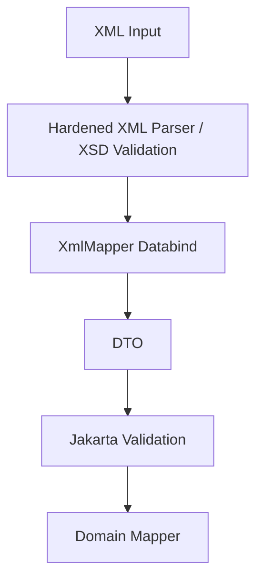

------
title: Learn Java Data Mapper, JSON/XML Processing & Validation - Part 020
description: Jackson XML Dataformat with XmlMapper, XML annotations, wrappers, attributes, text values, namespaces, streaming, JAXB comparison, and production-safe XML mapping.
series: learn-java-data-mapper-json-xml-validation
seriesTitle: Learn Java Data Mapper, JSON/XML Processing & Validation
order: 20
partTitle: Jackson XML Dataformat: Mapping JSON-Oriented Models to XML Without Lying
tags:
- java
- jackson
- xml
- jackson-dataformat-xml
- xmlmapper
- jacksonxmlproperty
- jacksonxmlelementwrapper
- serialization
- deserialization
- data-mapper
date: 2026-06-29
---

# Part 020 — Jackson XML Dataformat: Mapping JSON-Oriented Models to XML Without Lying

> **Target skill:** mampu memakai Jackson XML Dataformat secara tepat: kapan `XmlMapper` cocok, bagaimana annotations XML Jackson bekerja, bagaimana wrapper/attribute/text/namespace dimodelkan, dan kapan harus memilih JAXB instead.

Jackson XML Dataformat adalah extension Jackson untuk membaca dan menulis XML encoded data. Ia membawa gaya Jackson databind ke XML: `XmlMapper`, annotations, modules, serializers/deserializers, tree/streaming concepts, dan POJO mapping.

Tetapi ada batas penting:

> **Jackson XML is convenient for code-first XML and JSON-like DTO workflows. It is not a full replacement for schema-first XML thinking.**

Jika partner/regulator memberi XSD kompleks, namespace-heavy, order-sensitive, mixed-content document, JAXB/Jakarta XML Binding atau StAX/JAXB hybrid sering lebih cocok.

Jika Anda punya DTO sederhana dan ingin output/input XML dengan gaya Jackson, `jackson-dataformat-xml` sangat praktis.

---

## 1. Kaufman Deconstruction

Subskill Jackson XML:

| Subskill | Kemampuan |
|---|---|
| Build `XmlMapper` | Membuat mapper khusus XML |
| Map root element | Mengatur root name |
| Map element vs attribute | Menggunakan `@JacksonXmlProperty(isAttribute = true)` |
| Map text value | Menggunakan `@JacksonXmlText` |
| Map collections | Menggunakan `@JacksonXmlElementWrapper` |
| Handle namespace | Mengatur localName/namespace |
| Compare with JAXB | Tahu kapan Jackson XML tepat/tidak |
| Use modules | Java Time, custom serializers, existing Jackson modules |
| Test XML contract | Golden XML, schema validation if available, namespace fixtures |
| Avoid JSON mental trap | Tidak menganggap XML sama dengan JSON |

---

## 2. Dependencies

Maven:

```xml
<dependency>
  <groupId>com.fasterxml.jackson.dataformat</groupId>
  <artifactId>jackson-dataformat-xml</artifactId>
</dependency>
```

Gradle:

```kotlin
dependencies {
    implementation("com.fasterxml.jackson.dataformat:jackson-dataformat-xml")
}
```

For Jackson 2.x, align versions using Jackson BOM.

```xml
<dependencyManagement>
  <dependencies>
    <dependency>
      <groupId>com.fasterxml.jackson</groupId>
      <artifactId>jackson-bom</artifactId>
      <version>${jackson.version}</version>
      <type>pom</type>
      <scope>import</scope>
    </dependency>
  </dependencies>
</dependencyManagement>
```

For Jackson 3.x, use the matching Jackson 3 dependency coordinates/version alignment strategy.

Do not mix Jackson core/databind/dataformat versions randomly.

---

## 3. Basic `XmlMapper`

```java
XmlMapper xmlMapper = XmlMapper.builder()
    .findAndAddModules()
    .build();
```

DTO:

```java
@JacksonXmlRootElement(localName = "customer")
public record CustomerXmlDto(
    String customerId,
    String fullName
) {}
```

Marshal:

```java
CustomerXmlDto customer = new CustomerXmlDto("CUS-001", "Ana Maria");

String xml = xmlMapper.writeValueAsString(customer);
```

Unmarshal:

```java
CustomerXmlDto customer =
    xmlMapper.readValue(xml, CustomerXmlDto.class);
```

Output concept:

```xml
<customer>
  <customerId>CUS-001</customerId>
  <fullName>Ana Maria</fullName>
</customer>
```

---

## 4. `XmlMapper` Is an `ObjectMapper`-Style Mapper

`XmlMapper` supports much of the Jackson programming model:

- modules
- annotations
- custom serializers/deserializers
- `ObjectReader`
- `ObjectWriter`
- naming strategies
- inclusion policies
- polymorphic typing
- Java Time module
- record DTOs
- streaming through XML-specific factory/parser/generator internals

This is powerful because existing Jackson knowledge transfers.

But the output format is XML, which has concepts JSON does not have.

---

## 5. Root Element

```java
@JacksonXmlRootElement(localName = "payment")
public record PaymentXml(
    String paymentId,
    String status
) {}
```

Output:

```xml
<payment>
  <paymentId>PAY-001</paymentId>
  <status>APPROVED</status>
</payment>
```

If root name matters to partner/schema, annotate it explicitly.

Without explicit root annotation, default root may derive from class name, which can become contract drift.

---

## 6. Element vs Attribute

XML:

```xml
<payment id="PAY-001">
  <status>APPROVED</status>
</payment>
```

Jackson XML DTO:

```java
@JacksonXmlRootElement(localName = "payment")
public record PaymentXml(
    @JacksonXmlProperty(isAttribute = true, localName = "id")
    String paymentId,

    @JacksonXmlProperty(localName = "status")
    String status
) {}
```

Use `isAttribute = true` when XML contract wants attribute.

Decision:

| XML construct | Annotation |
|---|---|
| element | `@JacksonXmlProperty(localName = "...")` |
| attribute | `@JacksonXmlProperty(isAttribute = true, localName = "...")` |
| root element | `@JacksonXmlRootElement(localName = "...")` |
| text value | `@JacksonXmlText` |
| collection wrapper | `@JacksonXmlElementWrapper` |

---

## 7. Text Value with Attribute

XML:

```xml
<amount currency="IDR">100000.00</amount>
```

DTO:

```java
public record AmountXml(
    @JacksonXmlProperty(isAttribute = true, localName = "currency")
    String currency,

    @JacksonXmlText
    BigDecimal value
) {}
```

Container:

```java
@JacksonXmlRootElement(localName = "payment")
public record PaymentXml(
    @JacksonXmlProperty(localName = "amount")
    AmountXml amount
) {}
```

This is where XML differs from JSON. A field can be an element with attributes and text content.

---

## 8. Collections and Wrappers

### 8.1 Wrapped Collection

XML:

```xml
<invoice>
  <lines>
    <line>
      <sku>A</sku>
    </line>
    <line>
      <sku>B</sku>
    </line>
  </lines>
</invoice>
```

DTO:

```java
@JacksonXmlRootElement(localName = "invoice")
public record InvoiceXml(
    @JacksonXmlElementWrapper(localName = "lines")
    @JacksonXmlProperty(localName = "line")
    List<InvoiceLineXml> lines
) {}
```

### 8.2 Unwrapped Collection

XML:

```xml
<invoice>
  <line>
    <sku>A</sku>
  </line>
  <line>
    <sku>B</sku>
  </line>
</invoice>
```

DTO:

```java
@JacksonXmlRootElement(localName = "invoice")
public record InvoiceXml(
    @JacksonXmlElementWrapper(useWrapping = false)
    @JacksonXmlProperty(localName = "line")
    List<InvoiceLineXml> lines
) {}
```

Collection wrapping is one of the most common Jackson XML gotchas. Always test output.

---

## 9. Default Wrapper Policy

Jackson XML has configuration around default wrapping for lists. Be explicit instead of relying on defaults.

```java
JacksonXmlModule module = new JacksonXmlModule();
module.setDefaultUseWrapper(false);

XmlMapper xmlMapper = XmlMapper.builder(module)
    .findAndAddModules()
    .build();
```

However, global default can surprise other DTOs.

Prefer local annotation for contract-critical fields:

```java
@JacksonXmlElementWrapper(localName = "lines")
@JacksonXmlProperty(localName = "line")
List<LineXml> lines
```

or:

```java
@JacksonXmlElementWrapper(useWrapping = false)
@JacksonXmlProperty(localName = "line")
List<LineXml> lines
```

---

## 10. Namespace

XML:

```xml
<pay:payment xmlns:pay="https://example.com/payment" id="PAY-001">
  <pay:status>APPROVED</pay:status>
</pay:payment>
```

DTO:

```java
@JacksonXmlRootElement(
    localName = "payment",
    namespace = "https://example.com/payment"
)
public record PaymentXml(
    @JacksonXmlProperty(isAttribute = true, localName = "id")
    String id,

    @JacksonXmlProperty(
        localName = "status",
        namespace = "https://example.com/payment"
    )
    String status
) {}
```

Namespace support exists, but if namespace/schema requirements are complex, JAXB may be clearer.

Remember:

- namespace URI matters
- prefix is serialization detail
- partner systems may be prefix-sensitive due to non-compliant assumptions
- test prefix/namespace behavior with real fixtures

---

## 11. Naming Strategy

Jackson naming strategy can affect XML element names too.

```java
XmlMapper mapper = XmlMapper.builder()
    .propertyNamingStrategy(PropertyNamingStrategies.SNAKE_CASE)
    .build();
```

DTO:

```java
public record CustomerXml(
    String customerId,
    String fullName
) {}
```

Could output:

```xml
<customer_id>CUS-001</customer_id>
<full_name>Ana</full_name>
```

Use naming strategy only if XML contract truly follows it.

For XML, explicit `localName` is often safer than global naming strategy, especially with schema/partner contracts.

---

## 12. Jackson JSON Annotations with XML

Many standard Jackson annotations still work:

- `@JsonProperty`
- `@JsonIgnore`
- `@JsonInclude`
- `@JsonFormat`
- `@JsonCreator`
- `@JsonValue`
- `@JsonAlias`
- `@JsonIgnoreProperties`

But XML-specific shape needs XML-specific annotations.

Example:

```java
@JsonInclude(JsonInclude.Include.NON_NULL)
@JacksonXmlRootElement(localName = "customer")
public record CustomerXml(
    @JacksonXmlProperty(isAttribute = true, localName = "id")
    String customerId,

    @JacksonXmlProperty(localName = "fullName")
    String fullName
) {}
```

Be careful with `@JsonAlias`: aliasing XML elements may not behave exactly like JSON field aliasing in all scenarios. Test input fixtures.

---

## 13. Java Time and Modules

Like JSON `ObjectMapper`, `XmlMapper` needs modules for Java Time.

```java
XmlMapper xmlMapper = XmlMapper.builder()
    .addModule(new JavaTimeModule())
    .disable(SerializationFeature.WRITE_DATES_AS_TIMESTAMPS)
    .build();
```

DTO:

```java
@JacksonXmlRootElement(localName = "event")
public record EventXml(
    String eventId,
    Instant occurredAt,
    LocalDate businessDate
) {}
```

Desired:

```xml
<event>
  <eventId>EVT-001</eventId>
  <occurredAt>2026-06-29T03:00:00Z</occurredAt>
  <businessDate>2026-06-29</businessDate>
</event>
```

Test it. XML output format should not be guessed.

---

## 14. Custom Serializer/Deserializer Reuse

Many custom Jackson serializers/deserializers can work with XML too, because they use `JsonGenerator`/`JsonParser` abstraction. But XML shape may differ.

A serializer that writes an object:

```java
gen.writeStartObject();
gen.writeStringField("amount", value.amount().toPlainString());
gen.writeStringField("currency", value.currency().getCurrencyCode());
gen.writeEndObject();
```

may produce:

```xml
<money>
  <amount>100.00</amount>
  <currency>IDR</currency>
</money>
```

But if target XML shape is:

```xml
<amount currency="IDR">100.00</amount>
```

then a normal JSON-style serializer is not enough. Use XML annotations or XML-specific serializer/generator handling.

Do not assume JSON custom codec produces correct XML contract.

---

## 15. Tree Model and XML

Jackson XML can read XML into tree-like models, but XML-to-JSON-tree mapping has limitations because XML concepts do not map perfectly to JSON tree:

- attributes
- text content
- repeated elements
- namespaces
- mixed content
- element order

For dynamic XML, DOM/StAX may be more honest than forcing `JsonNode`.

If the XML is simple and object-like, `XmlMapper` tree/databind can be okay.

---

## 16. Mixed Content Warning

XML:

```xml
<message>Hello <b>Ana</b>, welcome.</message>
```

This is not a simple POJO structure.

Jackson XML is not the best first choice for rich mixed content. Consider DOM/StAX/JAXB mixed content support depending use case.

If your XML is document-like, avoid pretending it is just an object graph.

---

## 17. Schema Validation

Jackson XML is not primarily schema-first. You can validate XML separately using JAXP/XSD.

Pattern:



Validation utility:

```java
public final class XmlSchemaValidator {
    private final Schema schema;

    public XmlSchemaValidator(Schema schema) {
        this.schema = schema;
    }

    public void validate(Source source) {
        try {
            Validator validator = schema.newValidator();
            validator.validate(source);
        } catch (SAXException | IOException ex) {
            throw new InvalidXmlSchemaException("XML schema validation failed", ex);
        }
    }
}
```

If strict XSD validation is mandatory, JAXB may integrate more naturally.

---

## 18. Jackson XML vs JAXB

| Concern | Jackson XML | JAXB/Jakarta XML Binding |
|---|---|---|
| Style | Jackson databind/code-first | XML binding/schema-aware |
| Best for | simple XML DTOs, JSON-like workflows | schema-first enterprise XML |
| Annotations | Jackson XML annotations | JAXB annotations |
| JSON knowledge reuse | high | lower |
| XSD integration | external/manual | natural/common |
| Namespace-heavy XML | possible but can be awkward | stronger fit |
| Mixed content | limited/awkward | supported but still complex |
| Same DTO JSON+XML | possible | less natural |
| Custom codecs | Jackson serializers/deserializers | XmlAdapter |
| Streaming integration | Jackson XML factory/parser/generator | StAX/SAX/JAXB hybrid |

Decision rule:

> **If XML contract is owned by schema, start with JAXB. If XML contract is owned by your DTO and simple, Jackson XML can be efficient.**

---

## 19. One DTO for JSON and XML?

Tempting:

```java
public record PaymentDto(
    String paymentId,
    String status
) {}
```

Use same DTO for JSON and XML.

This can work for simple internal APIs.

But danger appears when XML needs:

- attributes
- namespaces
- wrappers
- text values
- ordered elements
- schema-specific names
- nil handling
- mixed content

Then one DTO becomes annotation soup:

```java
@JsonProperty("paymentId")
@JacksonXmlProperty(isAttribute = true, localName = "id")
String paymentId
```

Recommendation:

| Situation | Approach |
|---|---|
| simple internal DTO | same DTO may be okay |
| external partner XML | separate XML DTO |
| public JSON API + XML export | separate DTOs if shapes differ |
| schema-first XML | separate JAXB/Jackson XML DTO |
| domain object | never force it to serve both |

Boundary clarity beats DTO reuse.

---

## 20. Polymorphism in Jackson XML

Jackson polymorphism can work with XML too, but be careful with shape.

Example:

```java
@JsonTypeInfo(
    use = JsonTypeInfo.Id.NAME,
    include = JsonTypeInfo.As.PROPERTY,
    property = "type"
)
@JsonSubTypes({
    @JsonSubTypes.Type(value = CardMethodXml.class, name = "CARD"),
    @JsonSubTypes.Type(value = BankTransferMethodXml.class, name = "BANK_TRANSFER")
})
public sealed interface PaymentMethodXml
    permits CardMethodXml, BankTransferMethodXml {
}
```

XML may look like:

```xml
<method>
  <type>CARD</type>
  <cardToken>tok_123</cardToken>
</method>
```

But your schema might prefer:

```xml
<method type="CARD">
  <cardToken>tok_123</cardToken>
</method>
```

or:

```xml
<cardMethod>
  <cardToken>tok_123</cardToken>
</cardMethod>
```

For schema-driven polymorphism, JAXB or custom StAX dispatch may be clearer.

Security principles remain:

- no class names
- logical discriminator
- explicit subtype allowlist
- unknown subtype strategy
- tests

---

## 21. Null and Empty XML

JSON null and XML nil/missing/empty are not equivalent.

XML cases:

```xml
<name/>
<name></name>
<name xsi:nil="true" xmlns:xsi="http://www.w3.org/2001/XMLSchema-instance"/>
<!-- missing name -->
```

Jackson XML behavior should be tested for your mapper/config.

For patch-like XML, define explicit semantics. Do not guess.

---

## 22. XML Output Formatting

Pretty printing:

```java
String xml = xmlMapper
    .writerWithDefaultPrettyPrinter()
    .writeValueAsString(value);
```

Formatting is usually cosmetic, but can matter for:

- human review
- generated files
- partner brittle tests
- signatures/canonicalization

For signed XML, use proper canonicalization/signature workflow, not pretty printing assumptions.

---

## 23. Security Hardening

Jackson XML uses XML parsing underneath. Untrusted XML risks still apply:

- XXE
- entity expansion
- external DTD/schema access
- deep nesting
- huge text nodes
- resource exhaustion
- malicious payloads

For high-risk XML, validate/harden parser layer explicitly. Jackson XML convenience does not remove XML security concerns.

Security deep dive is Part 021.

---

## 24. Production Mapper Profiles

Separate XML mapper profiles just like JSON.

```java
public final class XmlMappers {

    public static XmlMapper internalSimpleXmlMapper() {
        return XmlMapper.builder()
            .addModule(new JavaTimeModule())
            .disable(SerializationFeature.WRITE_DATES_AS_TIMESTAMPS)
            .build();
    }

    public static XmlMapper partnerXmlMapper() {
        JacksonXmlModule module = new JacksonXmlModule();
        module.setDefaultUseWrapper(false);

        return XmlMapper.builder(module)
            .addModule(new JavaTimeModule())
            .disable(SerializationFeature.WRITE_DATES_AS_TIMESTAMPS)
            .build();
    }
}
```

But do not hide partner-specific shape in a global mapper if annotations are clearer.

---

## 25. Testing Strategy

### 25.1 Marshal Golden XML

```java
@Test
void paymentXml_serializesExpectedShape() throws Exception {
    PaymentXml payment = new PaymentXml(
        "PAY-001",
        new AmountXml("IDR", new BigDecimal("100000.00")),
        "APPROVED"
    );

    String xml = xmlMapper.writeValueAsString(payment);

    assertThat(xml).contains("<payment");
    assertThat(xml).contains("id=\"PAY-001\"");
    assertThat(xml).contains("<amount currency=\"IDR\">100000.00</amount>");
}
```

For robust tests, use XML-aware comparison rather than brittle string matching when possible.

### 25.2 Unmarshal Fixture

```java
@Test
void paymentXml_deserializes() throws Exception {
    PaymentXml payment = xmlMapper.readValue("""
    <payment id="PAY-001">
      <amount currency="IDR">100000.00</amount>
      <status>APPROVED</status>
    </payment>
    """, PaymentXml.class);

    assertThat(payment.paymentId()).isEqualTo("PAY-001");
}
```

### 25.3 Wrapper Test

```java
@Test
void invoiceLines_useExpectedWrapper() throws Exception {
    InvoiceXml invoice = fixtureInvoice();

    String xml = xmlMapper.writeValueAsString(invoice);

    assertThat(xml).contains("<lines>");
    assertThat(xml).contains("<line>");
}
```

### 25.4 Namespace Test

```java
@Test
void paymentXml_usesNamespace() throws Exception {
    String xml = xmlMapper.writeValueAsString(fixturePayment());

    assertThat(xml).contains("https://example.com/payment");
}
```

### 25.5 Schema Validation Test

If partner XSD exists:

```java
@Test
void generatedPaymentXml_isSchemaValid() throws Exception {
    String xml = xmlMapper.writeValueAsString(fixturePayment());

    schemaValidator.validate(new StreamSource(new StringReader(xml)));
}
```

---

## 26. Common Anti-Patterns

### 26.1 Treating XML as JSON with Tags

Leads to wrong attribute/namespace/order handling.

### 26.2 Same DTO for Everything

One class serves JSON API, XML partner file, domain command, and database projection. It becomes unmaintainable.

### 26.3 Ignoring Collection Wrappers

Most common broken XML shape bug.

### 26.4 Relying on Default Root Names

Class rename becomes XML contract change.

### 26.5 No Namespace Fixtures

Tests pass for non-namespaced toy XML, fail in real partner integration.

### 26.6 No Schema Validation

You generate XML that looks fine but fails partner XSD.

### 26.7 Reusing JSON Custom Serializer Blindly

XML shape may need attributes/text/wrappers, not JSON object fields.

---

## 27. Decision Matrix

| Need | Use |
|---|---|
| simple code-first XML | Jackson XML |
| same simple DTO as JSON/XML | Jackson XML with explicit tests |
| attribute mapping | `@JacksonXmlProperty(isAttribute = true)` |
| text value | `@JacksonXmlText` |
| wrapped collection | `@JacksonXmlElementWrapper` |
| namespace-heavy schema | consider JAXB |
| strict schema-first XML | JAXB + XSD |
| large XML import | StAX/SAX, maybe bind fragments |
| mixed content | DOM/StAX/JAXB mixed content |
| custom type conversion | Jackson codec or DTO mapper |
| partner/regulator file | schema validation mandatory |

---

## 28. Mini Case Study: Simple Payment XML with Jackson

DTO:

```java
@JacksonXmlRootElement(
    localName = "payment",
    namespace = "https://example.com/payment"
)
public record PaymentXml(
    @JacksonXmlProperty(isAttribute = true, localName = "id")
    String paymentId,

    @JacksonXmlProperty(localName = "amount")
    AmountXml amount,

    @JacksonXmlProperty(localName = "status")
    String status
) {}
```

Amount:

```java
public record AmountXml(
    @JacksonXmlProperty(isAttribute = true, localName = "currency")
    String currency,

    @JacksonXmlText
    BigDecimal value
) {}
```

Output:

```xml
<payment xmlns="https://example.com/payment" id="PAY-001">
  <amount currency="IDR">100000.00</amount>
  <status>APPROVED</status>
</payment>
```

Mapping to domain:

```java
@Mapper(unmappedTargetPolicy = ReportingPolicy.ERROR)
public interface PaymentXmlMapper {

    default Payment toDomain(PaymentXml xml) {
        return new Payment(
            new PaymentId(xml.paymentId()),
            new Money(xml.amount().value(), Currency.getInstance(xml.amount().currency())),
            PaymentStatus.valueOf(xml.status())
        );
    }
}
```

Notice:

- Jackson XML DTO follows XML shape.
- Domain model follows business shape.
- Mapper performs semantic boundary conversion.
- Validation should exist before mapping.

---

## 29. Practice Drill

Given desired XML:

```xml
<case id="CASE-001" xmlns="https://example.com/case">
  <title>Suspicious Activity</title>
  <parties>
    <party id="PTY-001" role="SUBJECT">
      <name>Ana</name>
    </party>
  </parties>
  <status>OPEN</status>
</case>
```

Tasks:

1. Create Jackson XML DTOs.
2. Use `@JacksonXmlRootElement`.
3. Use attributes for case/party ids.
4. Use wrapper for parties.
5. Add namespace annotations.
6. Build `XmlMapper`.
7. Serialize golden XML.
8. Deserialize fixture.
9. Validate output with XSD if provided.
10. Map to domain command.
11. Explain whether JAXB would be better if schema gets complex.

---

## 30. Summary

Jackson XML is useful when XML mapping benefits from Jackson’s programming model.

Mental model:

> **Jackson XML is code-first XML databinding. Use it when XML shape is simple enough; switch to JAXB/StAX when XML semantics dominate.**

Rules:

1. Use `XmlMapper` for Jackson XML.
2. Always control root element if contract matters.
3. Use `@JacksonXmlProperty` for local names and attributes.
4. Use `@JacksonXmlText` for text content.
5. Use `@JacksonXmlElementWrapper` for list wrapping.
6. Be explicit about namespace.
7. Register Java Time and custom modules intentionally.
8. Do not assume JSON custom serializers produce correct XML.
9. Validate schema separately when contract requires it.
10. Keep XML DTO separate from domain when shape differs.
11. Test collection wrappers, attributes, namespaces, null/empty behavior.
12. Prefer JAXB for schema-first, namespace-heavy, or complex XML documents.

Part berikutnya covers XML security hardening: XXE, entity expansion, schema fetching, parser configuration, secure processing, and safe validation.

---

## References

- Jackson Dataformat XML Repository: https://github.com/FasterXML/jackson-dataformat-xml
- Jackson XML Annotations Wiki: https://github.com/FasterXML/jackson-dataformat-xml/wiki/Jackson-XML-annotations
- Jackson `JacksonXmlElementWrapper` Javadocs: https://fasterxml.github.io/jackson-dataformat-xml/javadoc/2.11/index.html?com/fasterxml/jackson/dataformat/xml/annotation/JacksonXmlElementWrapper.html
- Jackson Databind Repository: https://github.com/FasterXML/jackson-databind
- Jakarta XML Binding Specification 4.0: https://jakarta.ee/specifications/xml-binding/4.0/jakarta-xml-binding-spec-4.0
