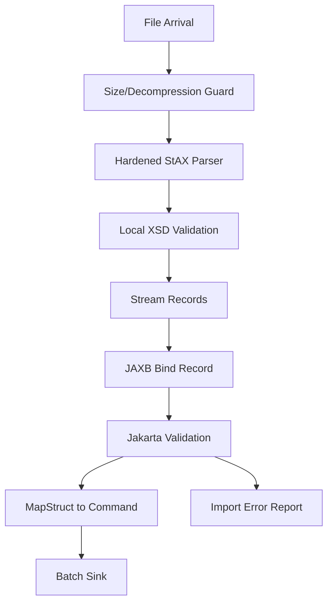

------
title: Learn Java Data Mapper, JSON/XML Processing & Validation - Part 021
description: XML security hardening untuk Java: XXE, entity expansion, DTD, schema fetching, parser configuration, secure processing, JAXP limits, StAX/SAX/DOM/JAXB/XSLT hardening, and production checklist.
series: learn-java-data-mapper-json-xml-validation
seriesTitle: Learn Java Data Mapper, JSON/XML Processing & Validation
order: 21
partTitle: XML Security Hardening: XXE, Entity Expansion, Schema Fetching, Parser Configuration
tags:
- java
- xml
- security
- xxe
- jaxp
- dom
- sax
- stax
- jaxb
- xslt
- schema-validation
date: 2026-06-29
---

# Part 021 — XML Security Hardening: XXE, Entity Expansion, Schema Fetching, Parser Configuration

> **Target skill:** mampu memproses XML tidak tepercaya dengan konfigurasi parser yang aman, batas resource yang jelas, schema validation yang tidak melakukan fetch eksternal sembarangan, dan error model yang supportable.

XML punya permukaan serangan yang lebih luas dari JSON karena XML mendukung DTD, entity, external entity, schema import/include, XSLT, namespace, dan fitur document processing lain.

Serangan klasik:

- XXE: XML External Entity
- SSRF melalui external entity/schema fetch
- local file disclosure melalui entity
- entity expansion / Billion Laughs
- quadratic blowup
- deep nesting
- huge text node
- zip/decompression bomb sebelum XML parser
- malicious XSLT
- external stylesheet/resource fetch
- schema poisoning
- slow upload / parser resource exhaustion

Mental model:

> **Untrusted XML must be parsed by policy, not by default.**

---

## 1. Kaufman Deconstruction

Subskill XML hardening:

| Subskill | Kemampuan |
|---|---|
| Threat model XML input | Membedakan trusted internal XML, partner XML, public upload, webhook, archive |
| Disable risky features | DTD, external entities, external schema/stylesheet access jika tidak perlu |
| Enable secure processing | Memakai JAXP secure processing and limits |
| Configure parser per API | DOM, SAX, StAX, JAXB, Transformer, SchemaFactory |
| Set resource limits | size, depth, entity expansion, max elements, max errors |
| Validate safely | XSD validation tanpa unrestricted network/file fetch |
| Handle errors safely | Tidak leak local path/secret/raw payload |
| Test malicious fixtures | XXE, Billion Laughs, external schema, deep nesting |
| Separate trust zones | Public vs trusted batch vs internal signed XML |
| Observe failures | Metrics untuk blocked external access, validation errors, size limits |

Latihan inti:

1. Buat XML XXE fixture.
2. Pastikan parser aman menolak/tidak resolve external entity.
3. Buat Billion Laughs fixture.
4. Pastikan entity expansion dibatasi.
5. Buat schema import eksternal.
6. Pastikan schema fetch diblokir/allowlisted.
7. Buat large/deep XML.
8. Pastikan limit bekerja.
9. Pastikan error response aman.

---

## 2. Threat Model First

Tidak semua XML punya risiko sama.

| Source | Trust Level | Policy |
|---|---|---|
| public upload | untrusted | strict hardening, no external fetch, size limits |
| third-party webhook | untrusted/semtrusted | strict hardening, schema validation if available |
| partner SFTP batch | semitrusted | hardening + schema validation + audit |
| internal service | trusted but still bounded | hardening baseline + limits |
| regulatory signed file | semitrusted | canonical/signature validation + schema |
| local config file | controlled | still disable unnecessary external fetch |
| generated by our app | trusted output | validate before send if contract requires |

Rule:

> **The parser does not know trust. Your configuration must express trust.**

---

## 3. What Is XXE?

Malicious XML:

```xml
<?xml version="1.0"?>
<!DOCTYPE data [
  <!ENTITY secret SYSTEM "file:///etc/passwd">
]>
<data>&secret;</data>
```

If parser resolves external entity, attacker may read local files.

SSRF variant:

```xml
<!DOCTYPE data [
  <!ENTITY remote SYSTEM "http://169.254.169.254/latest/meta-data/">
]>
<data>&remote;</data>
```

If parser fetches URL, attacker may reach internal network resources.

Hardening target:

- do not allow DTD if not required
- do not allow external general entities
- do not allow external parameter entities
- do not load external DTD
- restrict external schema/stylesheet access
- set resource limits

---

## 4. What Is Entity Expansion?

Billion Laughs-style:

```xml
<?xml version="1.0"?>
<!DOCTYPE lolz [
 <!ENTITY lol "lol">
 <!ENTITY lol1 "&lol;&lol;&lol;&lol;&lol;&lol;&lol;&lol;&lol;&lol;">
 <!ENTITY lol2 "&lol1;&lol1;&lol1;&lol1;&lol1;&lol1;&lol1;&lol1;&lol1;&lol1;">
]>
<lolz>&lol2;</lolz>
```

Even without file/network access, entity expansion can consume CPU/memory.

Hardening target:

- disable DTD if possible
- enable secure processing
- configure entity expansion limits
- cap input size/depth/time
- reject suspicious payloads early

---

## 5. Baseline Security Policy

For most untrusted XML:

```txt
DTD disabled unless contract explicitly requires it.
External entity resolution disabled.
External DTD loading disabled.
External schema and stylesheet access denied by default.
Secure processing enabled.
Parser limits configured.
Input size limit enforced before parse.
Decompression guarded.
Schema sources local/allowlisted.
Errors sanitized.
```

This is a good default for API/upload/webhook XML.

---

## 6. DOM Hardening

DOM parser uses `DocumentBuilderFactory`.

Baseline:

```java
public static DocumentBuilderFactory secureDocumentBuilderFactory() {
    DocumentBuilderFactory factory = DocumentBuilderFactory.newInstance();

    factory.setNamespaceAware(true);
    factory.setXIncludeAware(false);
    factory.setExpandEntityReferences(false);

    trySetFeature(factory, XMLConstants.FEATURE_SECURE_PROCESSING, true);

    trySetFeature(factory, "http://apache.org/xml/features/disallow-doctype-decl", true);
    trySetFeature(factory, "http://xml.org/sax/features/external-general-entities", false);
    trySetFeature(factory, "http://xml.org/sax/features/external-parameter-entities", false);
    trySetFeature(factory, "http://apache.org/xml/features/nonvalidating/load-external-dtd", false);

    try {
        factory.setAttribute(XMLConstants.ACCESS_EXTERNAL_DTD, "");
        factory.setAttribute(XMLConstants.ACCESS_EXTERNAL_SCHEMA, "");
    } catch (IllegalArgumentException ignored) {
        // Provider may not support these attributes.
        // Log during bootstrap in real code.
    }

    return factory;
}

private static void trySetFeature(
    DocumentBuilderFactory factory,
    String feature,
    boolean value
) {
    try {
        factory.setFeature(feature, value);
    } catch (ParserConfigurationException ex) {
        throw new IllegalStateException("XML parser does not support required feature: " + feature, ex);
    }
}
```

Parsing:

```java
DocumentBuilderFactory factory = secureDocumentBuilderFactory();
DocumentBuilder builder = factory.newDocumentBuilder();

builder.setEntityResolver((publicId, systemId) -> new InputSource(new StringReader("")));

Document document;
try (InputStream input = limitedInputStream(rawInput, MAX_XML_BYTES)) {
    document = builder.parse(input);
}
```

Notes:

- If a security feature is required, fail fast if unsupported.
- Do not silently ignore hardening failure in production.
- `EntityResolver` fallback prevents resolution where feature support is inconsistent.
- Namespace awareness should remain enabled for real XML.

---

## 7. SAX Hardening

SAX parser:

```java
public static SAXParserFactory secureSaxParserFactory() {
    SAXParserFactory factory = SAXParserFactory.newInstance();

    factory.setNamespaceAware(true);

    trySetFeature(factory, XMLConstants.FEATURE_SECURE_PROCESSING, true);
    trySetFeature(factory, "http://apache.org/xml/features/disallow-doctype-decl", true);
    trySetFeature(factory, "http://xml.org/sax/features/external-general-entities", false);
    trySetFeature(factory, "http://xml.org/sax/features/external-parameter-entities", false);
    trySetFeature(factory, "http://apache.org/xml/features/nonvalidating/load-external-dtd", false);

    return factory;
}

private static void trySetFeature(
    SAXParserFactory factory,
    String feature,
    boolean value
) {
    try {
        factory.setFeature(feature, value);
    } catch (ParserConfigurationException | SAXNotRecognizedException | SAXNotSupportedException ex) {
        throw new IllegalStateException("SAX parser does not support required feature: " + feature, ex);
    }
}
```

Use:

```java
SAXParser parser = secureSaxParserFactory().newSAXParser();
XMLReader reader = parser.getXMLReader();

reader.setEntityResolver((publicId, systemId) -> new InputSource(new StringReader("")));

reader.setContentHandler(handler);
reader.parse(new InputSource(limitedInputStream(input, MAX_XML_BYTES)));
```

---

## 8. StAX Hardening

StAX uses `XMLInputFactory`.

```java
public static XMLInputFactory secureXmlInputFactory() {
    XMLInputFactory factory = XMLInputFactory.newFactory();

    factory.setProperty(XMLInputFactory.SUPPORT_DTD, false);
    factory.setProperty("javax.xml.stream.isSupportingExternalEntities", false);
    factory.setProperty(XMLInputFactory.IS_REPLACING_ENTITY_REFERENCES, false);

    factory.setXMLResolver((publicId, systemId, baseURI, namespace) ->
        new ByteArrayInputStream(new byte[0])
    );

    return factory;
}
```

Use:

```java
XMLInputFactory factory = secureXmlInputFactory();

try (InputStream input = limitedInputStream(rawInput, MAX_XML_BYTES)) {
    XMLStreamReader reader = factory.createXMLStreamReader(input);

    while (reader.hasNext()) {
        int event = reader.next();
        // process
    }
}
```

StAX property support can vary. Test malicious fixtures against the exact runtime/provider.

---

## 9. JAXB Hardening

JAXB unmarshalling often delegates to parser. Harden by controlling parser/source.

Better:

```java
SAXParserFactory saxFactory = secureSaxParserFactory();
SAXParser saxParser = saxFactory.newSAXParser();
XMLReader xmlReader = saxParser.getXMLReader();

InputSource inputSource = new InputSource(limitedInputStream(rawInput, MAX_XML_BYTES));
SAXSource source = new SAXSource(xmlReader, inputSource);

Unmarshaller unmarshaller = jaxbContext.createUnmarshaller();
unmarshaller.setSchema(schema);

Object result = unmarshaller.unmarshal(source);
```

This ensures unmarshaller receives XML from your hardened reader.

Avoid:

```java
unmarshaller.unmarshal(rawInputStream);
```

for untrusted XML unless you know and control provider configuration.

---

## 10. SchemaFactory Hardening

XSD validation can fetch external schemas via import/include. Restrict access.

```java
SchemaFactory factory =
    SchemaFactory.newInstance(XMLConstants.W3C_XML_SCHEMA_NS_URI);

factory.setFeature(XMLConstants.FEATURE_SECURE_PROCESSING, true);

factory.setProperty(XMLConstants.ACCESS_EXTERNAL_DTD, "");
factory.setProperty(XMLConstants.ACCESS_EXTERNAL_SCHEMA, "");

Schema schema = factory.newSchema(localXsdFile);
```

If you need imports/includes, prefer local catalog or allowlist.

Do not let XML schema validation fetch arbitrary HTTP URLs during request processing.

---

## 11. Validator Hardening

```java
Validator validator = schema.newValidator();

validator.setProperty(XMLConstants.ACCESS_EXTERNAL_DTD, "");
validator.setProperty(XMLConstants.ACCESS_EXTERNAL_SCHEMA, "");

validator.validate(new StreamSource(input));
```

Use a hardened source if validating untrusted XML.

Error mapping should not leak filesystem path where XSD is stored.

---

## 12. Transformer/XSLT Hardening

XSLT can access external resources depending configuration.

```java
TransformerFactory factory = TransformerFactory.newInstance();

factory.setFeature(XMLConstants.FEATURE_SECURE_PROCESSING, true);
factory.setAttribute(XMLConstants.ACCESS_EXTERNAL_DTD, "");
factory.setAttribute(XMLConstants.ACCESS_EXTERNAL_STYLESHEET, "");

Transformer transformer = factory.newTransformer(stylesheetSource);
```

Avoid executing untrusted XSLT. Treat stylesheet as code-like input.

Risks:

- external document fetch
- SSRF
- filesystem access
- high CPU transform
- output amplification

---

## 13. External Resource Policy

Default deny:

```txt
ACCESS_EXTERNAL_DTD = ""
ACCESS_EXTERNAL_SCHEMA = ""
ACCESS_EXTERNAL_STYLESHEET = ""
```

If access is required, allowlist:

```txt
file
```

or specific controlled protocol/path via custom resolver/catalog, not arbitrary network.

Better architecture:

- vendor schemas packaged with app
- XML catalog maps known namespace/system IDs to local files
- no network fetch at parse time
- schema updates go through deployment/release process

---

## 14. Input Size and Decompression

Parser features are not enough.

Before parse:

- enforce request size limit
- enforce upload file size limit
- avoid unbounded buffering
- reject compressed payloads unless needed
- if compressed, enforce decompressed size ratio
- enforce timeouts
- enforce max record count for batch XML

Example limited stream:

```java
public static InputStream limitedInputStream(InputStream input, long maxBytes) {
    return new BoundedInputStream(input, maxBytes);
}
```

If not using a library, implement read-count wrapper.

---

## 15. Depth and Record Count Limits

For streaming parser, track depth:

```java
int depth = 0;
int maxDepth = 64;

while (reader.hasNext()) {
    int event = reader.next();

    if (event == XMLStreamConstants.START_ELEMENT) {
        depth++;
        if (depth > maxDepth) {
            throw new InvalidXmlException("XML depth limit exceeded");
        }
    } else if (event == XMLStreamConstants.END_ELEMENT) {
        depth--;
    }
}
```

Track item count:

```java
int caseCount = 0;
int maxCases = 100_000;

if (isStartElement(reader, "case")) {
    caseCount++;
    if (caseCount > maxCases) {
        throw new InvalidXmlException("too many case records");
    }
}
```

---

## 16. Secure Processing Is Not a Complete Policy

`XMLConstants.FEATURE_SECURE_PROCESSING` is useful, but it is not the whole solution.

You still need:

- external access restrictions
- DTD/entity policy
- size/depth limits
- decompression limits
- schema source control
- XSLT restrictions
- error sanitization
- runtime/provider tests

Treat secure processing as one line in a policy, not the policy.

---

## 17. Error Handling

Bad:

```json
{
  "message": "Could not read /etc/passwd from entity..."
}
```

Better:

```json
{
  "code": "INVALID_XML",
  "message": "XML contains unsupported document type declaration or external reference.",
  "line": 2,
  "column": 10
}
```

Never leak:

- local file paths
- internal URL
- raw secrets
- full XML payload
- schema filesystem layout
- parser provider internals beyond support logs

Internal logs can include more detail but still avoid raw sensitive XML.

---

## 18. Malicious Fixture Tests

### 18.1 XXE Local File

```xml
<?xml version="1.0"?>
<!DOCTYPE data [
  <!ENTITY xxe SYSTEM "file:///etc/passwd">
]>
<data>&xxe;</data>
```

Expected:

- parse rejected, or
- entity not resolved and no file content appears

### 18.2 SSRF Entity

```xml
<!DOCTYPE data [
  <!ENTITY xxe SYSTEM "http://127.0.0.1:8080/admin">
]>
<data>&xxe;</data>
```

Expected: no HTTP request made. In tests, use mock server to assert no call.

### 18.3 Billion Laughs

Expected: rejected due to DTD disabled or expansion limit.

### 18.4 External Schema Import

```xml
<xs:import namespace="http://evil.example/schema"
           schemaLocation="http://evil.example/schema.xsd"/>
```

Expected: blocked unless explicitly allowlisted/local.

### 18.5 Deep Nesting

Expected: depth limit rejection.

---

## 19. Testing Parser Hardening

```java
@Test
void domParser_rejectsDoctype() {
    assertThatThrownBy(() -> parseDom("""
    <?xml version="1.0"?>
    <!DOCTYPE data [ <!ENTITY xxe SYSTEM "file:///etc/passwd"> ]>
    <data>&xxe;</data>
    """))
    .isInstanceOf(Exception.class);
}
```

```java
@Test
void staxParser_doesNotResolveExternalEntity() {
    assertThatThrownBy(() -> parseStax("""
    <?xml version="1.0"?>
    <!DOCTYPE data [ <!ENTITY xxe SYSTEM "http://127.0.0.1:9999/secret"> ]>
    <data>&xxe;</data>
    """))
    .isInstanceOf(Exception.class);
}
```

```java
@Test
void schemaFactory_blocksExternalSchemaAccess() {
    assertThatThrownBy(() -> loadSchema("""
    <xs:schema xmlns:xs="http://www.w3.org/2001/XMLSchema">
      <xs:include schemaLocation="http://evil.example/schema.xsd"/>
    </xs:schema>
    """))
    .isInstanceOf(Exception.class);
}
```

---

## 20. Operational Observability

Track:

| Metric | Reason |
|---|---|
| XML parse failures | detect malformed/malicious input |
| blocked DOCTYPE count | threat signal |
| blocked external entity/schema count | SSRF/XXE signal |
| schema validation failures | partner data quality |
| size limit exceeded | abuse or legitimate sizing issue |
| depth limit exceeded | malicious or incompatible document |
| import record count | capacity planning |
| parse duration | slow processing |
| XML source/provider | isolate problematic producer |

Log fields:

- correlation id
- source system
- document type
- parser profile
- error code
- line/column if safe
- no raw secrets

---

## 21. Trust-Zoned Parser Profiles

```java
public enum XmlTrustProfile {
    PUBLIC_UPLOAD,
    PARTNER_BATCH,
    INTERNAL_GENERATED,
    SIGNED_REGULATORY
}
```

Policy table:

| Profile | DTD | External fetch | XSD | Size | Notes |
|---|---|---|---|---|---|
| public upload | disabled | denied | local only | strict | most restrictive |
| partner batch | disabled unless contract | local/allowlist | required | bounded | audit |
| internal generated | disabled by default | denied | optional | bounded | still safe |
| signed regulatory | depends on signature standard | controlled | required | bounded | canonicalization |

Implement explicit factory per profile, not ad-hoc flags.

---

## 22. XML Digital Signatures Note

Some XML signature workflows require canonicalization, namespace/prefix sensitivity, and sometimes reference resolution.

Do not casually apply generic XML mutation/sanitization before signature verification.

General order:

1. receive bytes
2. size/decompression guard
3. secure parse/canonicalization-compatible pipeline
4. verify signature with controlled resource resolution
5. schema validation
6. binding/mapping
7. business validation

XML signatures are a separate deep topic. Treat them as security architecture, not normal XML parsing.

---

## 23. Production Checklist

Before accepting untrusted XML:

- [ ] Is input size limited?
- [ ] Is decompression controlled?
- [ ] Is namespace-aware parsing enabled?
- [ ] Is DTD disabled unless required?
- [ ] Are external general entities disabled?
- [ ] Are external parameter entities disabled?
- [ ] Is external DTD loading disabled?
- [ ] Is secure processing enabled?
- [ ] Are `ACCESS_EXTERNAL_DTD`, `ACCESS_EXTERNAL_SCHEMA`, `ACCESS_EXTERNAL_STYLESHEET` denied or allowlisted?
- [ ] Are schema sources local/controlled?
- [ ] Are parser limits configured/tested?
- [ ] Is depth/record count bounded?
- [ ] Is JAXB fed through hardened parser/source?
- [ ] Is XSLT disabled or hardened?
- [ ] Are malicious fixtures in tests?
- [ ] Are errors sanitized?
- [ ] Are security events observable?
- [ ] Is unsupported parser feature treated as startup failure?

---

## 24. Anti-Patterns

### 24.1 Parsing Untrusted XML with Default Factory

```java
DocumentBuilderFactory.newInstance().newDocumentBuilder().parse(input);
```

### 24.2 Ignoring Unsupported Security Feature

```java
catch (Exception ignored) {}
```

If security feature is required and unsupported, fail.

### 24.3 XSD Validation with Network Fetch

Schema import can become SSRF.

### 24.4 JAXB Direct Unmarshal from Raw Input

For untrusted XML, control parser/source.

### 24.5 Pretty XML Logs

Logging full XML can leak secrets and expand storage cost.

### 24.6 Treating Internal XML as Fully Trusted

Internal compromise and accidental large payloads still exist.

---

## 25. Mini Case Study: Partner Batch XML

Requirement:

- partner uploads XML batch via SFTP
- XSD provided
- no DTD required
- schema imports known local files
- max file 100 MB
- max 100k records
- invalid records reported with line/index if possible

Architecture:



Key decisions:

- no external DTD/schema access
- XSD stored in application artifact
- StAX tracks record count/depth
- JAXB binds one record at a time
- errors are indexed and sanitized
- raw file stored encrypted with retention policy if needed

---

## 26. Practice Drill

Create secure parser policy for:

```txt
Public XML upload endpoint for case reports.
Max file size: 10 MB.
XSD: local packaged schema.
DTD: not needed.
Records: max 10,000 case elements.
Need: return first 100 validation errors.
```

Tasks:

1. Define trust profile.
2. Configure DOM/SAX/StAX factory.
3. Configure SchemaFactory.
4. Define size/depth/record limits.
5. Define error model.
6. Write malicious fixtures.
7. Write unit tests for XXE and Billion Laughs.
8. Write integration test proving external schema URL is not fetched.
9. Define metrics.
10. Define logging redaction.

---

## 27. Summary

XML security is not optional for untrusted input.

Mental model:

> **XML parser configuration is part of your security boundary.**

Rules:

1. Disable DTD unless required.
2. Disable external entities.
3. Deny external DTD/schema/stylesheet access by default.
4. Enable secure processing but do not rely on it alone.
5. Limit input size, depth, record count, and decompression.
6. Feed JAXB through hardened parser/source for untrusted XML.
7. Validate schemas from controlled local/allowlisted sources.
8. Harden XSLT or avoid untrusted XSLT.
9. Test malicious fixtures.
10. Sanitize errors and logs.
11. Treat unsupported required security features as failure.
12. Observe blocked XML security events.

Next part begins MapStruct: architecture, annotation processing, generated code, compile-time guarantees, and how to reason about mapper correctness.

---

## References

- Oracle Java API for XML Processing Security Guide: https://docs.oracle.com/en/java/javase/24/security/java-api-xml-processing-jaxp-security-guide.html
- OpenJDK JEP 185: Restrict Fetching of External XML Resources: https://openjdk.org/jeps/185
- Java XML Constants API: https://docs.oracle.com/en/java/javase/24/docs/api/java.xml/javax/xml/XMLConstants.html
- OWASP XML External Entity Prevention Cheat Sheet: https://cheatsheetseries.owasp.org/cheatsheets/XML_External_Entity_Prevention_Cheat_Sheet.html
