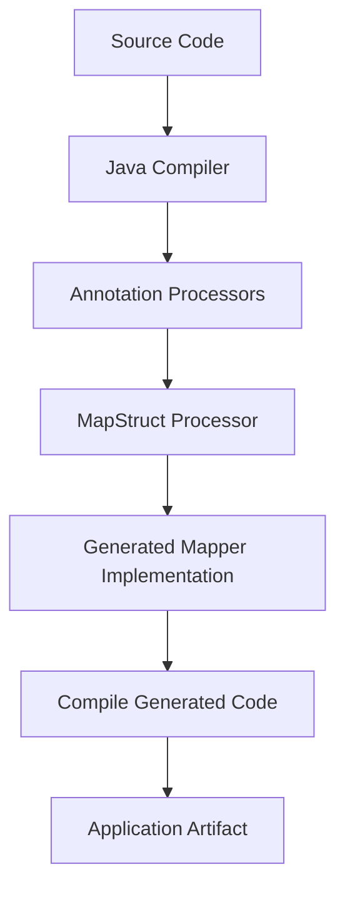

------
title: Learn Java Data Mapper, JSON/XML Processing & Validation - Part 022
description: MapStruct architecture deep dive: annotation processing, generated code, compile-time guarantees, mapper interfaces, component models, records/builders, null policy, and production governance.
series: learn-java-data-mapper-json-xml-validation
seriesTitle: Learn Java Data Mapper, JSON/XML Processing & Validation
order: 22
partTitle: MapStruct Architecture: Annotation Processing, Generated Code, Compile-Time Guarantees
tags:
- java
- mapstruct
- data-mapper
- annotation-processing
- generated-code
- dto
- domain
- compile-time
- mapping
date: 2026-06-29
---

# Part 022 — MapStruct Architecture: Annotation Processing, Generated Code, Compile-Time Guarantees

> **Target skill:** mampu memahami MapStruct sebagai compile-time mapper generator, membaca generated code, mengontrol mapper policy, dan mengetahui batas antara structural mapping dan semantic mapping.

MapStruct adalah annotation processor Java untuk menghasilkan mapper classes yang type-safe saat compile time. Kita mendefinisikan interface mapper. Saat compilation, MapStruct membuat implementasi menggunakan plain Java method calls, bukan reflection runtime mapping.

Mental model:

> **MapStruct is not magic. It is generated Java code that makes mapping explicit, reviewable, fast, and compile-time checked.**

Ini berbeda dari reflection-based runtime mapper.

Runtime mapper biasanya:

```txt
source object -> reflection/introspection -> target object
```

MapStruct:

```txt
@Mapper interface -> annotation processor -> generated Java implementation -> compiled code
```

---

## 1. Kaufman Deconstruction

Subskill MapStruct architecture:

| Subskill | Kemampuan |
|---|---|
| Understand annotation processing | Tahu kapan generated mapper dibuat |
| Read generated code | Mengecek mapping aktual, null handling, nested mapping |
| Define mapper interface | Membuat mapping method dan config |
| Control unmapped fields | Memakai reporting policy untuk compile-time safety |
| Use component model | Plain, Spring, CDI, Jakarta, etc. |
| Handle records/builders | Mapping immutable target dengan constructor/builder |
| Separate semantics | Mapper melakukan transformation, domain tetap pegang invariant |
| Govern mapping layer | Shared config, tests, generated code review |
| Avoid mapper abuse | Tidak menaruh business workflow di mapper |
| Debug compile errors | Memahami pesan MapStruct sebagai feedback design |

---

## 2. Why MapStruct Exists

Manual mapping:

```java
public CustomerResponse toResponse(Customer customer) {
    return new CustomerResponse(
        customer.id().value(),
        customer.fullName(),
        customer.status().name()
    );
}
```

Manual mapping is clear but repetitive.

Reflection mapper is less repetitive but hidden at runtime.

MapStruct attempts a better trade-off:

| Concern | Manual | Reflection Mapper | MapStruct |
|---|---|---|---|
| boilerplate | high | low | low |
| runtime reflection | no | yes | no |
| compile-time errors | high | low | high |
| generated code readable | n/a | no | yes |
| custom semantic control | high | medium | high |
| performance | high | variable | high |
| refactor safety | high if tests | often weak | strong if policy strict |

---

## 3. Basic Mapper

Source:

```java
public record Customer(
    CustomerId id,
    String fullName,
    CustomerStatus status
) {}
```

Target:

```java
public record CustomerResponse(
    String customerId,
    String fullName,
    String status
) {}
```

Mapper:

```java
@Mapper(unmappedTargetPolicy = ReportingPolicy.ERROR)
public interface CustomerMapper {

    @Mapping(target = "customerId", source = "id.value")
    @Mapping(target = "status", source = "status")
    CustomerResponse toResponse(Customer customer);

    default String map(CustomerStatus status) {
        return status == null ? null : status.name();
    }
}
```

MapStruct generates implementation similar to:

```java
public class CustomerMapperImpl implements CustomerMapper {

    @Override
    public CustomerResponse toResponse(Customer customer) {
        if (customer == null) {
            return null;
        }

        String customerId = null;
        String fullName = null;
        String status = null;

        customerId = customer.id() != null ? customer.id().value() : null;
        fullName = customer.fullName();
        status = map(customer.status());

        return new CustomerResponse(customerId, fullName, status);
    }
}
```

Generated code is ordinary Java. Read it.

---

## 4. Annotation Processing Mental Model

Compilation pipeline:



This means:

- mapper errors appear at compile time
- generated code is not reflection
- build setup matters
- IDE annotation processing must be enabled
- Lombok integration needs correct processor ordering/config
- CI compile is the source of truth

---

## 5. Build Setup

Maven:

```xml
<dependencies>
  <dependency>
    <groupId>org.mapstruct</groupId>
    <artifactId>mapstruct</artifactId>
    <version>${mapstruct.version}</version>
  </dependency>
</dependencies>

<build>
  <plugins>
    <plugin>
      <groupId>org.apache.maven.plugins</groupId>
      <artifactId>maven-compiler-plugin</artifactId>
      <configuration>
        <annotationProcessorPaths>
          <path>
            <groupId>org.mapstruct</groupId>
            <artifactId>mapstruct-processor</artifactId>
            <version>${mapstruct.version}</version>
          </path>
        </annotationProcessorPaths>
      </configuration>
    </plugin>
  </plugins>
</build>
```

Gradle:

```kotlin
dependencies {
    implementation("org.mapstruct:mapstruct:$mapstructVersion")
    annotationProcessor("org.mapstruct:mapstruct-processor:$mapstructVersion")
    testAnnotationProcessor("org.mapstruct:mapstruct-processor:$mapstructVersion")
}
```

For Gradle Kotlin DSL with Java plugin, keep annotation processor scope explicit.

---

## 6. Generated Code Location

Common locations:

```txt
target/generated-sources/annotations
build/generated/sources/annotationProcessor/java/main
```

Generated code should be inspectable.

Do not edit generated code.

Use generated code to answer:

- what null checks are generated?
- which method does MapStruct call?
- did nested mapping happen?
- was field ignored?
- did builder/constructor get used?
- did update method mutate target as expected?

---

## 7. Compile-Time Guarantees

MapStruct can catch:

- unmapped target properties
- unknown source/target property names
- incompatible types without conversion
- ambiguous mapping methods
- missing mapper for nested type
- invalid enum mapping
- builder/constructor mismatch
- invalid expression syntax at compile
- inaccessible target constructor/setter

But MapStruct cannot know:

- business meaning
- whether two fields with same name have same semantic
- whether rounding is allowed
- whether unknown enum should be preserved
- whether mapping violates workflow invariant
- whether field should be masked for authorization
- whether data is stale

Therefore:

> **MapStruct gives structural safety. You still own semantic correctness.**

---

## 8. `unmappedTargetPolicy`

Always decide policy.

```java
@Mapper(unmappedTargetPolicy = ReportingPolicy.ERROR)
public interface PaymentMapper {
}
```

Options:

| Policy | Meaning |
|---|---|
| `ERROR` | fail compile for unmapped target |
| `WARN` | compile with warning |
| `IGNORE` | ignore unmapped target |

Production recommendation:

- use `ERROR` for boundary/domain mapper
- use explicit `ignore = true` when intentional
- avoid global `IGNORE` except very specific cases

Example intentional ignore:

```java
@Mapping(target = "createdAt", ignore = true)
@Mapping(target = "updatedAt", ignore = true)
PaymentEntity toEntity(Payment payment);
```

This documents intent.

---

## 9. `unmappedSourcePolicy`

Target coverage is usually more important, but source policy can catch unused input.

```java
@Mapper(
    unmappedTargetPolicy = ReportingPolicy.ERROR,
    unmappedSourcePolicy = ReportingPolicy.WARN
)
public interface CustomerMapper {
}
```

Use source warnings when:

- input DTO fields should all be consumed
- contract migration must detect ignored legacy fields
- compliance/audit data must not be silently dropped

But some source fields are intentionally ignored, especially for response projections.

---

## 10. Mapper Component Models

Plain default:

```java
@Mapper
public interface CustomerMapper {
    CustomerMapper INSTANCE = Mappers.getMapper(CustomerMapper.class);
}
```

Spring:

```java
@Mapper(componentModel = "spring")
public interface CustomerMapper {
}
```

CDI/Jakarta:

```java
@Mapper(componentModel = "cdi")
public interface CustomerMapper {
}
```

Choose based on application architecture.

| Component Model | Use |
|---|---|
| default | simple library, tests, no DI |
| spring | Spring apps |
| cdi / jakarta | Jakarta CDI environments |
| jsr330 | DI via JSR-330 style |
| custom config | platform-wide standard |

Avoid mixing component models randomly.

---

## 11. Mapper Dependencies with `uses`

```java
@Mapper(
    componentModel = "spring",
    uses = {
        MoneyMapper.class,
        IdentifierMapper.class,
        DateTimeMapper.class
    },
    unmappedTargetPolicy = ReportingPolicy.ERROR
)
public interface PaymentMapper {
    PaymentResponse toResponse(Payment payment);
}
```

`uses` lets MapStruct call other mapper methods.

Example:

```java
public class MoneyMapper {
    public MoneyResponse toResponse(Money money) {
        if (money == null) {
            return null;
        }
        return new MoneyResponse(
            money.amount().toPlainString(),
            money.currency().getCurrencyCode()
        );
    }
}
```

This encourages mapper composition.

---

## 12. Records and Constructor Mapping

Records are natural targets.

```java
public record CustomerResponse(
    String customerId,
    String fullName
) {}
```

MapStruct can instantiate via canonical constructor when it can resolve all components.

```java
@Mapper(unmappedTargetPolicy = ReportingPolicy.ERROR)
public interface CustomerMapper {
    @Mapping(target = "customerId", source = "id.value")
    CustomerResponse toResponse(Customer customer);
}
```

Generated code:

```java
return new CustomerResponse(customerId, fullName);
```

This is ideal for immutable boundary DTOs.

---

## 13. Builders

For builder targets, MapStruct can use builders if detected/configured.

Target:

```java
public class CustomerResponse {
    private final String customerId;
    private final String fullName;

    private CustomerResponse(Builder builder) {
        this.customerId = builder.customerId;
        this.fullName = builder.fullName;
    }

    public static Builder builder() {
        return new Builder();
    }

    public static class Builder {
        private String customerId;
        private String fullName;

        public Builder customerId(String customerId) {
            this.customerId = customerId;
            return this;
        }

        public Builder fullName(String fullName) {
            this.fullName = fullName;
            return this;
        }

        public CustomerResponse build() {
            return new CustomerResponse(this);
        }
    }
}
```

MapStruct can generate builder-based mapping.

But builder-heavy mappings can hide missing required fields if target builder allows it. Keep validation/invariants in target construction or tests.

---

## 14. Null Behavior Baseline

Generated mapper often returns null if source is null:

```java
if (source == null) {
    return null;
}
```

This is not always desired.

For collection mapping, null source may become null target or empty target depending strategies/config.

Do not assume. Configure and test.

Null policy belongs to mapping contract:

| Boundary | Null policy |
|---|---|
| create request to command | null required fields usually rejected before mapping |
| response projection | null may be omitted or explicit |
| patch update | null can mean clear value |
| merge/update | null may mean ignore |
| entity mapping | null may be database nullable |

Part 024 deep dives update/patch/null strategies.

---

## 15. Expressions and Defaults

MapStruct supports expressions:

```java
@Mapping(
    target = "createdAt",
    expression = "java(java.time.Instant.now())"
)
Entity toEntity(Request request);
```

Use carefully.

Bad mapper expression:

```java
@Mapping(
    target = "approved",
    expression = "java(riskService.isLowRisk(request))"
)
```

Mapper expression should not call domain service/business policy.

Allowed:

- simple construction
- value object conversion
- timestamp only if mapping layer truly owns it
- constant/default representation value

Better for timestamps: inject clock/use case sets it.

---

## 16. MapStruct and Domain Invariants

Mapper should not bypass domain invariants.

Bad:

```java
@Mapping(target = "status", constant = "APPROVED")
Payment toDomain(CreatePaymentRequest request);
```

If approval is workflow decision, not mapper job.

Better:

```java
CreatePaymentCommand toCommand(CreatePaymentRequest request);
```

Use case decides:

```java
Payment payment = paymentService.create(command);
```

Rule:

> **MapStruct maps data shape. Domain services decide state and behavior.**

---

## 17. Reading MapStruct Errors

Example error:

```txt
Unmapped target property: "currency".
```

Do not silence immediately. Ask:

- is target field required?
- should source contain it?
- should it be derived?
- should it be ignored?
- is target DTO wrong?
- is mapper missing nested mapper?

Compile error is feedback.

Another:

```txt
Can't map property "String amount" to "BigDecimal amount".
```

This forces you to create explicit conversion policy.

Good:

```java
default BigDecimal decimalFromString(String value) {
    return value == null ? null : new BigDecimal(value);
}
```

Better if money semantics exist: map through `Money`.

---

## 18. MapStruct vs Jackson

Clear separation:

| Concern | Jackson | MapStruct |
|---|---|---|
| JSON/XML bytes ↔ DTO | yes | no |
| DTO ↔ domain command | no | yes |
| domain ↔ response DTO | no | yes |
| field naming on wire | yes | no |
| object graph projection | sometimes | yes |
| validation | no | no, but can prepare objects |
| business invariants | no | no |
| code generation | runtime mapper config | compile-time mapper impl |

Pipeline:


---

## 19. Mapper Package Architecture

Recommended layout:

```txt
com.example.payment.api.dto
com.example.payment.api.mapper
com.example.payment.domain
com.example.payment.domain.command
com.example.payment.persistence.entity
com.example.payment.persistence.mapper
com.example.payment.integration.provider.dto
com.example.payment.integration.provider.mapper
```

Do not put all mappers in one generic package.

Boundary-specific mappers:

| Mapper | Direction |
|---|---|
| `PaymentApiMapper` | API DTO ↔ command/response |
| `PaymentEventMapper` | domain event ↔ event DTO |
| `PaymentEntityMapper` | domain ↔ persistence entity |
| `ProviderPaymentMapper` | provider DTO ↔ internal command |
| `PaymentExportMapper` | domain/projection ↔ export row |

---

## 20. Shared Mapper Config

```java
@MapperConfig(
    componentModel = "spring",
    unmappedTargetPolicy = ReportingPolicy.ERROR,
    unmappedSourcePolicy = ReportingPolicy.WARN,
    injectionStrategy = InjectionStrategy.CONSTRUCTOR
)
public interface CentralMapperConfig {
}
```

Use:

```java
@Mapper(
    config = CentralMapperConfig.class,
    uses = {MoneyMapper.class, IdentifierMapper.class}
)
public interface PaymentMapper {
}
```

Benefits:

- consistent component model
- consistent reporting policy
- consistent injection style
- easier platform governance
- fewer mapper-specific surprises

---

## 21. Generated Code Review

When mapping is critical, inspect generated code.

Review questions:

- are null checks as expected?
- are nested mappings invoked?
- are collections copied or referenced?
- are update methods mutating target correctly?
- are builders used?
- are default values applied?
- are expressions safe?
- are unexpected conversions happening?
- does generated code call the method you expected?

Generated code is a debugging tool.

---

## 22. Testing Strategy

MapStruct compile-time checks are not enough.

### 22.1 Mapper Unit Test

```java
@Test
void customerMapper_mapsDomainToResponse() {
    Customer customer = new Customer(
        new CustomerId("CUS-001"),
        "Ana",
        CustomerStatus.ACTIVE
    );

    CustomerResponse response = mapper.toResponse(customer);

    assertThat(response.customerId()).isEqualTo("CUS-001");
    assertThat(response.fullName()).isEqualTo("Ana");
    assertThat(response.status()).isEqualTo("ACTIVE");
}
```

### 22.2 Golden Projection Test

```java
@Test
void caseDetailProjection_doesNotExposeInternalFields() {
    Case domain = fixtureCaseWithInternalRiskScore();

    CaseDetailResponse response = mapper.toDetailResponse(domain);

    assertThat(response).hasNoNullFieldsOrPropertiesExcept("optionalNote");
}
```

### 22.3 Enum Coverage Test

```java
@Test
void allDomainStatusesAreMapped() {
    for (CustomerStatus status : CustomerStatus.values()) {
        assertThatCode(() -> mapper.toResponseStatus(status))
            .doesNotThrowAnyException();
    }
}
```

### 22.4 Null Policy Test

```java
@Test
void nullSource_returnsNullResponse() {
    assertThat(mapper.toResponse(null)).isNull();
}
```

If null should be rejected, wrap mapper or use precondition.

---

## 23. Performance

MapStruct generated code is usually fast because it is plain method calls.

But performance can still be affected by:

- unnecessary deep mapping
- collection copying
- expensive custom conversion
- date/number formatting
- object allocation
- expression calls
- mapping huge object graphs
- mapper used inside tight loop with heavy conversion

Benchmark realistic scenarios if mapping is hot path.

---

## 24. When Not to Use MapStruct

Avoid MapStruct when:

- mapping is trivial and one line
- mapping is highly dynamic
- target shape is not known at compile time
- mapping depends heavily on runtime metadata
- transformation is business workflow
- you need query-level projection directly from database
- generated code complexity exceeds manual clarity

Manual mapper is valid when it is clearer.

---

## 25. Anti-Patterns

### 25.1 Global `IGNORE`

```java
@Mapper(unmappedTargetPolicy = ReportingPolicy.IGNORE)
```

This hides field drift.

### 25.2 Entity-to-API Direct Mapper

Mapping persistence entity directly to public response can leak internal state.

### 25.3 Business Service Calls in Mapper

Mapper becomes hidden use case.

### 25.4 Unreviewed Expressions

Expressions can bypass MapStruct type-safety and become stringly Java.

### 25.5 One Mega Mapper

A mapper with dozens of unrelated mappings becomes unmaintainable.

### 25.6 No Generated Code Inspection

When mapping surprises occur, inspect generated code instead of guessing.

---

## 26. Production Checklist

Before approving a MapStruct mapper:

- [ ] Is mapper boundary-specific?
- [ ] Is `unmappedTargetPolicy = ERROR` or inherited from config?
- [ ] Are intentional ignores explicit?
- [ ] Are semantic conversions explicit?
- [ ] Are value objects constructed intentionally?
- [ ] Are enum mappings tested?
- [ ] Are null policies tested?
- [ ] Are nested mappings controlled?
- [ ] Are collections copied as expected?
- [ ] Does mapper avoid business service calls?
- [ ] Is generated code inspected for critical mapping?
- [ ] Is component model consistent?
- [ ] Is mapper config centralized?
- [ ] Are tests using generated implementation?
- [ ] Is this mapper not exposing persistence entity shape?

---

## 27. Mini Case Study: API Request to Command

Request:

```java
public record CreateCaseRequest(
    String caseId,
    String title,
    String priority,
    String reportedAt
) {}
```

Command:

```java
public record CreateCaseCommand(
    CaseId caseId,
    String title,
    Priority priority,
    Instant reportedAt
) {}
```

Mapper:

```java
@Mapper(
    config = CentralMapperConfig.class,
    uses = {CaseIdMapper.class, DateTimeMapper.class}
)
public interface CaseCommandMapper {

    @Mapping(target = "caseId", source = "caseId")
    @Mapping(target = "priority", source = "priority")
    @Mapping(target = "reportedAt", source = "reportedAt")
    CreateCaseCommand toCommand(CreateCaseRequest request);

    default Priority toPriority(String value) {
        if (value == null) {
            return null;
        }
        return Priority.valueOf(value.trim().toUpperCase(Locale.ROOT));
    }
}
```

Support mappers:

```java
public class CaseIdMapper {
    public CaseId toCaseId(String value) {
        return value == null ? null : new CaseId(value);
    }
}
```

```java
public class DateTimeMapper {
    public Instant toInstant(String value) {
        return value == null ? null : Instant.parse(value);
    }
}
```

Validation should run before mapping:

```java
public record CreateCaseRequest(
    @NotBlank String caseId,
    @NotBlank String title,
    @NotBlank String priority,
    @NotBlank String reportedAt
) {}
```

Domain invariants remain in command/use case/value objects.

---

## 28. Practice Drill

Given:

```java
public record ProviderPaymentDto(
    String payment_id,
    String amount,
    String currency,
    String status,
    String created_at
) {}
```

Target:

```java
public record PaymentImportedCommand(
    PaymentId paymentId,
    Money money,
    ProviderPaymentStatus status,
    Instant createdAt
) {}
```

Tasks:

1. Create MapStruct mapper.
2. Use support mapper for `PaymentId`.
3. Use support mapper for `Money`.
4. Use support mapper for `Instant`.
5. Use explicit enum conversion.
6. Set `unmappedTargetPolicy = ERROR`.
7. Write mapper test for valid input.
8. Write test for unknown status.
9. Inspect generated code.
10. Explain which rules belong to validation vs mapper vs domain.

---

## 29. Summary

MapStruct is a compile-time code generator for mapping.

Mental model:

> **MapStruct gives you generated manual mapping with compiler feedback. It does not replace semantic design.**

Rules:

1. Treat mapper as boundary transformation layer.
2. Use strict unmapped target policy.
3. Read generated code for critical mappings.
4. Use records/immutable DTOs where appropriate.
5. Centralize mapper config.
6. Compose mappers using `uses`.
7. Keep business decisions outside mapper.
8. Test semantic mapping, enum coverage, null policy, and graph projection.
9. Use compile errors as design feedback.
10. Prefer explicit mapping when meaning differs.

Part berikutnya deep dives into MapStruct mapping: fields, nested objects, collections, enums, expressions, constants, and conversion strategies.

---

## References

- MapStruct Stable Reference Guide: https://mapstruct.org/documentation/stable/reference/html/
- MapStruct Stable API Docs: https://mapstruct.org/documentation/stable/api/
- MapStruct Project Home: https://mapstruct.org/
