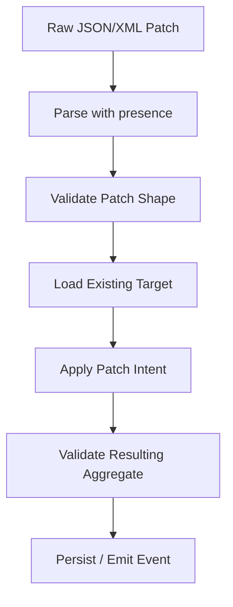
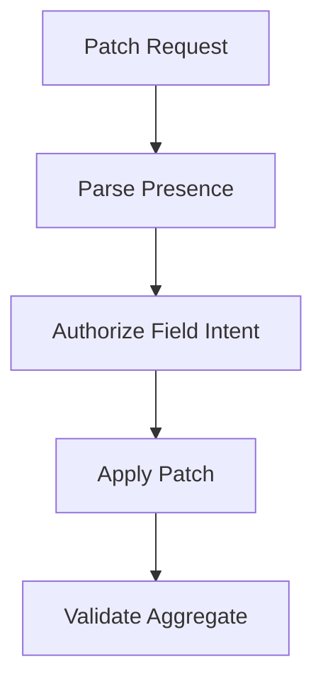

------
title: Learn Java Data Mapper, JSON/XML Processing & Validation - Part 024
description: MapStruct update, patch, and partial mapping: MappingTarget, null strategies, null value property mapping, null value check strategy, presence checking, merge semantics, dirty intent, and testing.
series: learn-java-data-mapper-json-xml-validation
seriesTitle: Learn Java Data Mapper, JSON/XML Processing & Validation
order: 24
partTitle: Update, Patch, and Partial Mapping: Null Strategies, Merge Semantics, Dirty Intent
tags:
- java
- mapstruct
- data-mapper
- patch
- partial-update
- mappingtarget
- null-strategy
- merge
- dto
- validation
date: 2026-06-29
---

# Part 024 — Update, Patch, and Partial Mapping: Null Strategies, Merge Semantics, Dirty Intent

> **Target skill:** mampu mendesain update/patch/merge mapping dengan MapStruct tanpa mencampuradukkan null, absence, clear, default, dan unchanged.

Create mapping relatif mudah:

```txt
source DTO -> new target object
```

Update/patch jauh lebih sulit:

```txt
source DTO -> existing target object
```

Karena kita harus menjawab:

- field tidak ada berarti apa?
- field ada dengan null berarti apa?
- field empty string berarti apa?
- field empty list berarti clear atau invalid?
- default value boleh dipakai?
- target existing field harus dipertahankan?
- collection harus replace, merge, append, atau diff?
- nested object harus update in-place atau replace?
- validation dilakukan sebelum atau sesudah patch?
- audit harus tahu field mana berubah?

Mental model:

> **Partial update is not mapping. It is intent interpretation plus mapping.**

MapStruct bisa membantu update mechanics, tetapi kita harus menentukan semantics.

---

## 1. Kaufman Deconstruction

Subskill update/patch mapping:

| Subskill | Kemampuan |
|---|---|
| Distinguish operation type | Create, replace, merge, patch, sync |
| Use `@MappingTarget` | Update existing target object |
| Configure null strategies | `NullValuePropertyMappingStrategy`, `NullValueCheckStrategy`, `NullValueMappingStrategy` |
| Model absence | Menggunakan presence-aware DTO/wrapper |
| Define clear vs ignore | Null bisa berarti clear atau ignore tergantung contract |
| Handle collections | Replace, clear, append, merge, diff |
| Handle nested objects | Replace object vs update nested target |
| Validate correctly | Pre-validate patch shape and post-validate aggregate |
| Track dirty intent | Mengetahui field mana berubah |
| Test matrix | Missing/null/value/empty/default/nested/collection cases |

---

## 2. Operation Types

Jangan menyebut semua “update”.

| Operation | Meaning |
|---|---|
| create | construct new object from full input |
| replace / PUT | request represents complete new state |
| merge | provided fields update target; missing ignored |
| patch | operations or presence-aware fields describe changes |
| sync | source becomes authority; missing may delete |
| upsert | create or update depending existence |
| import reconcile | match external state with local state |

MapStruct `@MappingTarget` hanya memberi mechanical ability to mutate target. Semantics tetap milik kita.

---

## 3. `@MappingTarget`

Target object:

```java
public class CustomerEntity {
    private String fullName;
    private String email;
    private String phoneNumber;

    // getters/setters
}
```

DTO:

```java
public record UpdateCustomerRequest(
    String fullName,
    String email,
    String phoneNumber
) {}
```

Mapper:

```java
@Mapper(unmappedTargetPolicy = ReportingPolicy.ERROR)
public interface CustomerUpdateMapper {

    void updateEntity(
        UpdateCustomerRequest request,
        @MappingTarget CustomerEntity target
    );
}
```

Generated code conceptually:

```java
if (request == null) {
    return;
}

target.setFullName(request.fullName());
target.setEmail(request.email());
target.setPhoneNumber(request.phoneNumber());
```

By default, null source properties may set target properties to null depending strategy. That may or may not be correct.

---

## 4. Null Is Not Absence

For JSON object:

```json
{
  "fullName": "Ana"
}
```

`email` is absent.

```json
{
  "email": null
}
```

`email` is present with null.

```json
{
  "email": ""
}
```

`email` is present with empty string.

Plain Java DTO:

```java
public record UpdateCustomerRequest(
    String fullName,
    String email
) {}
```

cannot distinguish absent from null after deserialization if both become `null`.

This is the fundamental patch problem.

---

## 5. Null Strategy Vocabulary

MapStruct has several null-related strategies. They solve different problems.

| Strategy | Scope |
|---|---|
| `NullValueMappingStrategy` | what mapping method returns when source argument is null |
| `NullValuePropertyMappingStrategy` | how update method handles null source property for target property |
| `NullValueCheckStrategy` | when MapStruct generates null checks before assignment/conversion |
| source presence checking | whether source property is considered present |
| default values | per mapping fallback when source value is null |

The most important for `@MappingTarget` partial updates is `NullValuePropertyMappingStrategy`.

---

## 6. `NullValuePropertyMappingStrategy.IGNORE`

Use when null source means “do not change target”.

```java
@Mapper(
    unmappedTargetPolicy = ReportingPolicy.ERROR,
    nullValuePropertyMappingStrategy = NullValuePropertyMappingStrategy.IGNORE
)
public interface CustomerPatchMapper {

    void patch(
        CustomerPatchRequest request,
        @MappingTarget CustomerEntity target
    );
}
```

DTO:

```java
public record CustomerPatchRequest(
    String fullName,
    String email,
    String phoneNumber
) {}
```

Behavior:

| Source field | Target result |
|---|---|
| `"Ana"` | target updated to `"Ana"` |
| `null` | target unchanged |

This is useful for merge-style update, but it cannot clear a field to null.

Problem:

```json
{ "phoneNumber": null }
```

could mean “clear phone number”, but `IGNORE` treats it as unchanged.

---

## 7. `NullValuePropertyMappingStrategy.SET_TO_NULL`

Use when null source means “clear target”.

```java
@Mapper(
    nullValuePropertyMappingStrategy = NullValuePropertyMappingStrategy.SET_TO_NULL
)
public interface CustomerReplaceMapper {

    void update(
        CustomerUpdateRequest request,
        @MappingTarget CustomerEntity target
    );
}
```

Behavior:

| Source field | Target result |
|---|---|
| `"Ana"` | set `"Ana"` |
| `null` | set target to null |

Useful for replace-like semantics.

Dangerous for patch where missing field is also deserialized as null.

---

## 8. `NullValuePropertyMappingStrategy.SET_TO_DEFAULT`

Use when null source means default target value.

Defaults can be:

- empty collection
- empty map
- empty string for `String`
- zero/false for primitives
- new instance for some types if possible

Use very carefully.

For business data, defaulting may corrupt meaning.

Good use cases:

- generated view object
- technical DTO normalization
- optional display collection
- cache DTO with default containers

Bad use cases:

- amount
- currency
- identifier
- timestamp
- regulatory status
- workflow state

---

## 9. `NullValueMappingStrategy`

This controls whole method behavior when source argument itself is null.

Example:

```java
@Mapper(nullValueMappingStrategy = NullValueMappingStrategy.RETURN_DEFAULT)
public interface LineMapper {
    List<LineDto> toDtos(List<Line> lines);
}
```

Default behavior is commonly return null for null source.

Use `RETURN_DEFAULT` only if contract says null collection maps to empty.

Question:

```txt
Does null source collection mean no data, empty data, or invalid state?
```

Do not choose default because it avoids null checks.

---

## 10. `NullValueCheckStrategy`

Controls when MapStruct generates null checks.

```java
@Mapper(nullValueCheckStrategy = NullValueCheckStrategy.ALWAYS)
public interface CustomerMapper {
}
```

This is different from property mapping strategy.

`NullValueCheckStrategy.ALWAYS` can prevent assigning null in some generated mapping paths by checking source before conversion/assignment. But for update semantics, use the right property strategy.

Do not confuse:

| Need | Strategy |
|---|---|
| ignore null properties in update | `NullValuePropertyMappingStrategy.IGNORE` |
| return empty collection for null source collection | `NullValueMappingStrategy.RETURN_DEFAULT` |
| generate null checks before conversion | `NullValueCheckStrategy.ALWAYS` |
| distinguish missing vs null | presence-aware DTO or source presence checker |

---

## 11. Presence-Aware Patch DTO

To support true patch semantics, model presence explicitly.

```java
public sealed interface PatchField<T>
    permits PatchField.Absent, PatchField.NullValue, PatchField.Value {

    record Absent<T>() implements PatchField<T> {}
    record NullValue<T>() implements PatchField<T> {}
    record Value<T>(T value) implements PatchField<T> {}

    static <T> PatchField<T> absent() {
        return new Absent<>();
    }

    static <T> PatchField<T> nullValue() {
        return new NullValue<>();
    }

    static <T> PatchField<T> value(T value) {
        return new Value<>(value);
    }
}
```

Patch DTO:

```java
public record CustomerPatchRequest(
    PatchField<String> fullName,
    PatchField<String> email,
    PatchField<String> phoneNumber
) {}
```

Now you can distinguish:

| JSON | Java |
|---|---|
| field missing | `PatchField.Absent` |
| field null | `PatchField.NullValue` |
| field value | `PatchField.Value(value)` |

This requires custom Jackson deserialization or tree-model parsing, as covered in Part 011.

---

## 12. Patch Applying with MapStruct + Manual Intent

MapStruct is not ideal for directly mapping `PatchField<T>` without intent logic. Use manual patch application or helper methods.

```java
@Mapper(unmappedTargetPolicy = ReportingPolicy.ERROR)
public interface CustomerPatchMapper {

    default void apply(
        CustomerPatchRequest patch,
        @MappingTarget CustomerEntity target
    ) {
        if (patch == null) {
            return;
        }

        applyString(patch.fullName(), target::setFullName);
        applyString(patch.email(), target::setEmail);
        applyString(patch.phoneNumber(), target::setPhoneNumber);
    }

    private void applyString(PatchField<String> field, Consumer<String> setter) {
        switch (field) {
            case PatchField.Absent<String> ignored -> {
                // unchanged
            }
            case PatchField.NullValue<String> ignored -> setter.accept(null);
            case PatchField.Value<String> value -> setter.accept(value.value());
        }
    }
}
```

This is not “less MapStruct”. This is correct intent handling.

Use MapStruct for nested value conversion after intent is known.

---

## 13. Merge Request with Null-Ignore

If your API contract defines:

```txt
missing or null means unchanged
```

then `IGNORE` strategy is acceptable.

```java
@Mapper(
    config = CentralMapperConfig.class,
    nullValuePropertyMappingStrategy = NullValuePropertyMappingStrategy.IGNORE
)
public interface CustomerMergeMapper {

    void merge(
        CustomerMergeRequest request,
        @MappingTarget CustomerEntity target
    );
}
```

But document this clearly:

```txt
This is merge, not patch. It cannot clear nullable fields.
```

---

## 14. Replace Request

If your API contract defines:

```txt
request body is full state
null means clear
missing is invalid or treated as null
```

then use replace semantics.

DTO should require all fields as appropriate:

```java
public record ReplaceCustomerRequest(
    @NotBlank String fullName,
    @Email String email,
    String phoneNumber
) {}
```

Mapper:

```java
@Mapper(
    config = CentralMapperConfig.class,
    nullValuePropertyMappingStrategy = NullValuePropertyMappingStrategy.SET_TO_NULL
)
public interface CustomerReplaceMapper {

    void replace(
        ReplaceCustomerRequest request,
        @MappingTarget CustomerEntity target
    );
}
```

Validation should reject missing required fields before mapper.

---

## 15. Collection Update Semantics

Collection field is tricky.

Request:

```java
public record UpdateOrderRequest(
    List<OrderLineRequest> lines
) {}
```

What does `lines` mean?

| Input | Possible meaning |
|---|---|
| missing | unchanged |
| null | clear, invalid, or unchanged |
| empty list | clear all lines |
| list with items | replace all, merge by id, append, or diff |

Define operation explicitly.

### 15.1 Replace Collection

```java
target.setLines(
    request.lines().stream()
        .map(lineMapper::toEntity)
        .toList()
);
```

Meaning: source list is complete authority.

### 15.2 Merge by ID

```java
public void mergeLines(List<OrderLinePatch> patches, OrderEntity target) {
    Map<String, OrderLineEntity> existingById = target.getLines().stream()
        .collect(Collectors.toMap(OrderLineEntity::getLineId, Function.identity()));

    for (OrderLinePatch patch : patches) {
        OrderLineEntity line = existingById.get(patch.lineId());
        if (line == null) {
            target.getLines().add(lineMapper.toEntity(patch));
        } else {
            lineMapper.patch(patch, line);
        }
    }
}
```

This is not simple mapping; it is reconciliation logic.

Do not hide complex collection merge inside a MapStruct expression.

---

## 16. Nested Object Update

Target:

```java
public class CustomerEntity {
    private AddressEntity address;
}
```

Patch:

```java
public record CustomerPatchRequest(
    AddressPatchRequest address
) {}
```

Questions:

- if address missing: unchanged?
- if address null: clear address?
- if address object: update existing address or replace?
- if existing address null and patch object present: create new address?
- if address has id: merge by id?

MapStruct can update nested target, but semantics must be chosen.

Example pattern:

```java
@Mapper(
    config = CentralMapperConfig.class,
    nullValuePropertyMappingStrategy = NullValuePropertyMappingStrategy.IGNORE,
    uses = AddressPatchMapper.class
)
public interface CustomerPatchMapper {

    void patch(CustomerPatchRequest request, @MappingTarget CustomerEntity target);

    @AfterMapping
    default void ensureAddressWhenPatchPresent(
        CustomerPatchRequest request,
        @MappingTarget CustomerEntity target
    ) {
        if (request.address() == null) {
            return;
        }
        if (target.getAddress() == null) {
            target.setAddress(new AddressEntity());
        }
    }
}
```

In practice, a decorator or explicit use-case method is often clearer when nested object semantics become complex.

---

## 17. Dirty Intent

Patch often needs audit:

```txt
Changed fullName from "Ana" to "Ana Maria"
Cleared phoneNumber
Did not touch email
```

Plain MapStruct update does not track intent.

Possible design:

```java
public record FieldChange<T>(
    String field,
    T oldValue,
    T newValue
) {}
```

Patch result:

```java
public record PatchResult(
    List<FieldChange<?>> changes
) {}
```

Manual intent application:

```java
public PatchResult apply(CustomerPatchRequest patch, CustomerEntity target) {
    List<FieldChange<?>> changes = new ArrayList<>();

    applyString("fullName", patch.fullName(), target.getFullName(), value -> {
        changes.add(new FieldChange<>("fullName", target.getFullName(), value));
        target.setFullName(value);
    });

    return new PatchResult(changes);
}
```

Use MapStruct where mapping is mechanical. Use explicit patch engine where audit/dirty intent matters.

---

## 18. Validation Order for Patch

Patch validation is layered.



Examples:

| Rule | Layer |
|---|---|
| field type must be string/null | parsing |
| field if present must not be blank | patch validation |
| target customer must exist | application |
| email unique | domain/application |
| final object must satisfy invariant | aggregate validation |
| caller may edit field | authorization |

Do not validate patch DTO as if it were full object unless contract says full replace.

---

## 19. Field-Level Authorization

Partial update often needs field-level permission.

Example:

```json
{
  "priority": "HIGH",
  "assigneeUserId": "U-123"
}
```

Maybe user can update assignee but not priority.

Do not let mapper apply forbidden fields before authorization.

Flow:



If using MapStruct directly, forbidden fields may be applied too early. Use explicit patch intent extraction first.

---

## 20. JSON Merge Patch vs JSON Patch

Two common standards:

| Standard | Shape | Meaning |
|---|---|---|
| JSON Merge Patch | object where null removes/clears | simple object merge |
| JSON Patch | list of operations add/remove/replace | operation-based |

JSON Merge Patch example:

```json
{
  "phoneNumber": null,
  "fullName": "Ana Maria"
}
```

JSON Patch example:

```json
[
  { "op": "replace", "path": "/fullName", "value": "Ana Maria" },
  { "op": "remove", "path": "/phoneNumber" }
]
```

MapStruct is not a JSON Patch engine. Apply patch operations to a model or DTO, then use mapper if needed.

---

## 21. Update Mapping to Entity vs Domain

Persistence entity update:

```java
void updateEntity(UpdateRequest request, @MappingTarget CustomerEntity entity);
```

Domain aggregate update:

```java
customer.changeFullName(command.fullName());
customer.clearPhoneNumber();
```

For rich domain models, direct field mapping can bypass behavior/invariants.

Better:

```java
CustomerPatchCommand command = patchMapper.toCommand(request);
customerService.applyPatch(customerId, command);
```

Use entity mapping mainly when:

- entity is simple data model
- domain invariants are handled elsewhere
- persistence layer owns mechanical updates
- update operation is not behavior-rich

For enforcement lifecycle/regulatory workflows, be careful: state transitions should not be mapper assignments.

---

## 22. `@BeforeMapping` and `@AfterMapping`

Hooks can help but should not become business service layer.

Example normalization:

```java
@AfterMapping
default void normalizeEmail(@MappingTarget CustomerEntity target) {
    if (target.getEmail() != null) {
        target.setEmail(target.getEmail().trim().toLowerCase(Locale.ROOT));
    }
}
```

Question: is normalization contract-level or business-level?

For email normalization, a value object or domain policy may be better.

Hooks are covered deeper in Part 025.

---

## 23. Update Mapper Example: Merge Profile

Request:

```java
public record CustomerMergeRequest(
    String fullName,
    String email,
    String phoneNumber
) {}
```

Mapper:

```java
@Mapper(
    config = CentralMapperConfig.class,
    nullValuePropertyMappingStrategy = NullValuePropertyMappingStrategy.IGNORE
)
public interface CustomerMergeMapper {

    @Mapping(target = "id", ignore = true)
    @Mapping(target = "createdAt", ignore = true)
    @Mapping(target = "updatedAt", ignore = true)
    void merge(CustomerMergeRequest request, @MappingTarget CustomerEntity target);
}
```

Meaning:

- non-null source updates target
- null source ignored
- id/createdAt/updatedAt not mapped
- cannot clear nullable fields

Test:

```java
@Test
void merge_ignoresNullFields() {
    CustomerEntity target = new CustomerEntity();
    target.setFullName("Ana");
    target.setEmail("ana@example.com");

    CustomerMergeRequest request = new CustomerMergeRequest("Ana Maria", null, null);

    mapper.merge(request, target);

    assertThat(target.getFullName()).isEqualTo("Ana Maria");
    assertThat(target.getEmail()).isEqualTo("ana@example.com");
}
```

---

## 24. Update Mapper Example: Replace Profile

```java
@Mapper(
    config = CentralMapperConfig.class,
    nullValuePropertyMappingStrategy = NullValuePropertyMappingStrategy.SET_TO_NULL
)
public interface CustomerReplaceMapper {

    @Mapping(target = "id", ignore = true)
    @Mapping(target = "createdAt", ignore = true)
    void replace(ReplaceCustomerRequest request, @MappingTarget CustomerEntity target);
}
```

Test:

```java
@Test
void replace_setsNullFields() {
    CustomerEntity target = new CustomerEntity();
    target.setPhoneNumber("0812");

    ReplaceCustomerRequest request = new ReplaceCustomerRequest(
        "Ana",
        "ana@example.com",
        null
    );

    mapper.replace(request, target);

    assertThat(target.getPhoneNumber()).isNull();
}
```

---

## 25. Patch Example with Presence-Aware Fields

Patch DTO:

```java
public record CustomerPatchRequest(
    PatchField<String> fullName,
    PatchField<String> email,
    PatchField<String> phoneNumber
) {}
```

Applier:

```java
public final class CustomerPatchApplier {

    public PatchResult apply(CustomerPatchRequest patch, CustomerEntity target) {
        List<FieldChange<?>> changes = new ArrayList<>();

        apply("fullName", patch.fullName(), target.getFullName(), value -> {
            target.setFullName(value);
        }, changes);

        apply("email", patch.email(), target.getEmail(), value -> {
            target.setEmail(value);
        }, changes);

        apply("phoneNumber", patch.phoneNumber(), target.getPhoneNumber(), value -> {
            target.setPhoneNumber(value);
        }, changes);

        return new PatchResult(changes);
    }

    private <T> void apply(
        String field,
        PatchField<T> patchField,
        T oldValue,
        Consumer<T> setter,
        List<FieldChange<?>> changes
    ) {
        switch (patchField) {
            case PatchField.Absent<T> ignored -> {
                // unchanged
            }
            case PatchField.NullValue<T> ignored -> {
                setter.accept(null);
                changes.add(new FieldChange<>(field, oldValue, null));
            }
            case PatchField.Value<T> value -> {
                setter.accept(value.value());
                changes.add(new FieldChange<>(field, oldValue, value.value()));
            }
        }
    }
}
```

This is more verbose than MapStruct, but it is correct for true patch semantics.

---

## 26. MapStruct with Presence Checkers

MapStruct can use source presence checking conventions in some cases, such as `hasXyz` methods.

Example source:

```java
public class CustomerPatchSource {
    private String email;
    private boolean hasEmail;

    public boolean hasEmail() {
        return hasEmail;
    }

    public String getEmail() {
        return email;
    }
}
```

Mapper can use presence checker to decide whether source property is present.

This can work well with generated DTOs/protobuf-like models.

For JSON PATCH style in normal records, presence-aware wrapper/tree parsing is often clearer.

---

## 27. Collection Null Strategy vs Collection Merge

`NullValuePropertyMappingStrategy.IGNORE` can ignore null collection source, but it does not define what non-null collection means.

If `lines` is non-null:

- replace target lines?
- clear and add?
- update existing?
- append?
- diff by id?

Define explicitly.

For replace:

```java
@Mapping(target = "lines", source = "lines")
void replace(OrderRequest request, @MappingTarget OrderEntity target);
```

For merge, use custom method/service.

```java
@AfterMapping
default void mergeLines(OrderPatchRequest request, @MappingTarget OrderEntity target) {
    if (request.lines() == null) {
        return;
    }
    lineMerger.merge(request.lines(), target.getLines());
}
```

Often better outside mapper:

```java
orderLineMergeService.merge(request.lines(), order);
```

---

## 28. Testing Matrix

For each patchable field:

| Input | Expected target |
|---|---|
| missing | unchanged |
| null | clear or unchanged depending contract |
| value | updated |
| empty string | rejected, clear, or update? |
| whitespace | normalized or rejected? |
| empty list | clear or invalid? |
| list with items | replace/merge/append? |
| nested missing | unchanged |
| nested null | clear nested object? |
| nested object | update or replace? |

Example tests:

```java
@Test
void patch_missingEmail_doesNotChangeEmail() {}

@Test
void patch_nullEmail_clearsEmail() {}

@Test
void patch_emailValue_updatesEmail() {}

@Test
void patch_emptyEmail_rejectedByValidation() {}

@Test
void patch_emptyTags_clearsTagsWhenContractSaysReplace() {}
```

If you cannot state expected result, mapper should not be implemented yet.

---

## 29. Audit Event from Patch

Patch result can produce event:

```java
public record CustomerPatchedEvent(
    String customerId,
    List<FieldChangeDto> changes,
    Instant occurredAt
) {}
```

Do not derive audit from final state only. You need intent/change list.

Bad:

```java
event.setCustomerAfter(mapper.toResponse(customer));
```

Good:

```java
PatchResult result = applier.apply(patch, customer);
eventPublisher.publish(mapper.toPatchedEvent(customer.id(), result));
```

For regulated systems, this distinction matters.

---

## 30. Concurrency and Lost Update

Patch/update mapping does not solve concurrency.

Scenario:

1. User A reads customer.
2. User B updates email.
3. User A sends merge patch fullName only.
4. Mapper updates target.
5. If persistence save overwrites full row incorrectly, B's email can be lost.

Mitigation:

- optimistic locking/version
- field-level patch update
- transaction isolation
- compare-and-set
- event-sourced command handling
- explicit conflict detection

MapStruct is not concurrency control.

---

## 31. Production Checklist

Before approving update/patch mapper:

- [ ] Is operation create, replace, merge, patch, sync, or upsert?
- [ ] Is null semantics documented?
- [ ] Is absence distinguishable if required?
- [ ] Is clear operation supported if required?
- [ ] Are required fields validated before mapping?
- [ ] Is final aggregate validated after patch?
- [ ] Are immutable/id/audit fields ignored?
- [ ] Are field-level permissions checked before apply?
- [ ] Are collection semantics defined?
- [ ] Are nested object semantics defined?
- [ ] Is dirty intent/audit required?
- [ ] Are null strategies set intentionally?
- [ ] Are tests covering missing/null/value/empty?
- [ ] Is generated code inspected?
- [ ] Is concurrency handled outside mapper?

---

## 32. Anti-Patterns

### 32.1 “PATCH DTO with Nullable Fields”

Cannot distinguish missing and null.

### 32.2 `IGNORE` Strategy Used for True Patch

It cannot clear fields.

### 32.3 `SET_TO_NULL` Used for Merge

Missing fields become null if deserialized as null.

### 32.4 Collection Merge Hidden in Expression

Hard to test, audit, and reason about.

### 32.5 Updating Domain Aggregate by Setters

Bypasses invariants and lifecycle.

### 32.6 No Audit of Changed Fields

Final state alone does not explain intent.

### 32.7 Null Defaults for Critical Fields

Defaulting on update can corrupt facts.

---

## 33. Mini Case Study: Case Assignment Patch

Patch input:

```json
{
  "assigneeUserId": "USR-123",
  "priority": null
}
```

Semantics:

- missing field: unchanged
- `assigneeUserId` value: assign
- `priority` null: clear manual priority override
- field-level authorization required
- audit must record both changes

DTO:

```java
public record CasePatchRequest(
    PatchField<String> assigneeUserId,
    PatchField<String> priority
) {}
```

Command:

```java
public record PatchCaseCommand(
    CaseId caseId,
    PatchField<UserId> assignee,
    PatchField<Priority> priority
) {}
```

Mapper for value conversion:

```java
@Mapper(config = CentralMapperConfig.class)
public interface CasePatchCommandMapper {

    default PatchCaseCommand toCommand(CaseId caseId, CasePatchRequest request) {
        return new PatchCaseCommand(
            caseId,
            mapUserId(request.assigneeUserId()),
            mapPriority(request.priority())
        );
    }

    default PatchField<UserId> mapUserId(PatchField<String> field) {
        return switch (field) {
            case PatchField.Absent<String> ignored -> PatchField.absent();
            case PatchField.NullValue<String> ignored -> PatchField.nullValue();
            case PatchField.Value<String> value -> PatchField.value(new UserId(value.value()));
        };
    }

    default PatchField<Priority> mapPriority(PatchField<String> field) {
        return switch (field) {
            case PatchField.Absent<String> ignored -> PatchField.absent();
            case PatchField.NullValue<String> ignored -> PatchField.nullValue();
            case PatchField.Value<String> value ->
                PatchField.value(Priority.valueOf(value.value().toUpperCase(Locale.ROOT)));
        };
    }
}
```

Use case applies command with authorization and audit:

```java
caseService.patchCase(command, actor);
```

This separates:

- parsing presence
- value conversion
- authorization
- domain mutation
- audit

---

## 34. Practice Drill

Implement update/patch strategy for:

```java
public record ProductPatchRequest(
    PatchField<String> displayName,
    PatchField<String> description,
    PatchField<List<String>> tags,
    PatchField<String> status
) {}
```

Rules:

- missing means unchanged
- null description means clear description
- null displayName invalid
- empty tags means clear all tags
- null tags invalid
- status can change only through domain method
- audit all changed fields

Tasks:

1. Define validation rules.
2. Define command model.
3. Define mapper for `PatchField<String>` to value objects/enums.
4. Define applier/use-case logic.
5. Define audit event.
6. Define tests for missing/null/value/empty.
7. Explain where MapStruct helps and where manual logic is better.

---

## 35. Summary

Update and patch mapping is where mechanical mapping often breaks down.

Mental model:

> **Create mapping maps state. Patch mapping maps intent.**

Rules:

1. Classify operation type before writing mapper.
2. `@MappingTarget` mutates existing target; it does not define semantics.
3. Null is not absence.
4. `NullValuePropertyMappingStrategy.IGNORE` is merge-like and cannot clear fields.
5. `SET_TO_NULL` is replace/clear-like and dangerous for nullable patch DTOs.
6. Use presence-aware DTOs for true patch.
7. Collections need explicit replace/merge/append/diff semantics.
8. Nested objects need explicit update vs replace semantics.
9. Validate patch shape before applying and final aggregate after applying.
10. Field-level authorization should happen before mutation.
11. Dirty intent/audit requires explicit change tracking.
12. Concurrency/lost update is outside MapStruct.

Part berikutnya covers MapStruct context, hooks, and factories: `@Context`, `@BeforeMapping`, `@AfterMapping`, `@ObjectFactory`, and how to add controlled lifecycle behavior without turning mappers into services.

---

## References

- MapStruct 1.6.3 Reference Guide: https://mapstruct.org/documentation/stable/reference/html/
- MapStruct `NullValuePropertyMappingStrategy` API: https://mapstruct.org/documentation/stable/api/org/mapstruct/NullValuePropertyMappingStrategy.html
- MapStruct `NullValueMappingStrategy` API: https://mapstruct.org/documentation/stable/api/org/mapstruct/NullValueMappingStrategy.html
- MapStruct `NullValueCheckStrategy` API: https://mapstruct.org/documentation/stable/api/org/mapstruct/NullValueCheckStrategy.html
