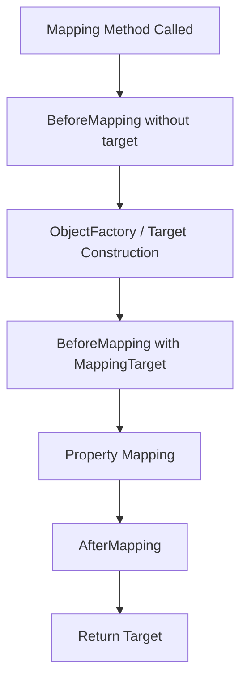

------
title: Learn Java Data Mapper, JSON/XML Processing & Validation - Part 025
description: MapStruct context, hooks, and factories: @Context, @BeforeMapping, @AfterMapping, @ObjectFactory, lifecycle customization, cycle context, enrichment boundaries, and production-safe usage.
series: learn-java-data-mapper-json-xml-validation
seriesTitle: Learn Java Data Mapper, JSON/XML Processing & Validation
order: 25
partTitle: Context, Hooks, Factories: @Context, @BeforeMapping, @AfterMapping, ObjectFactory
tags:
- java
- mapstruct
- context
- beforemapping
- aftermapping
- objectfactory
- lifecycle
- data-mapper
- annotation-processing
date: 2026-06-29
---

# Part 025 — Context, Hooks, Factories: `@Context`, `@BeforeMapping`, `@AfterMapping`, `@ObjectFactory`

> **Target skill:** mampu memakai lifecycle extension MapStruct secara aman: passing context, pre/post mapping hooks, object factories, cycle avoidance, localized enrichment, and mapper lifecycle governance.

MapStruct bukan hanya `@Mapping(target, source)`. Untuk mapping yang lebih kompleks, MapStruct menyediakan extension points:

- `@Context`
- `@BeforeMapping`
- `@AfterMapping`
- `@ObjectFactory`
- decorators
- custom mapper methods
- external mapper classes via `uses`

Part ini fokus pada empat pertama.

Mental model:

> **MapStruct hooks are lifecycle extension points. Use them to support mapping mechanics, not to hide use-case behavior.**

Jika dipakai dengan disiplin, hooks membuat mapper lebih composable dan reusable. Jika dipakai sembarangan, mapper berubah menjadi service layer tersembunyi.

---

## 1. Kaufman Deconstruction

Subskill untuk Part 025:

| Subskill | Kemampuan |
|---|---|
| Use `@Context` | Passing state/service/config tanpa menjadi source property |
| Understand propagation | Context diteruskan ke nested mapping methods |
| Use `@BeforeMapping` | Pre-processing, cache lookup, cycle avoidance |
| Use `@AfterMapping` | Post-processing target, derived fields, validation hints |
| Use `@ObjectFactory` | Membuat target object dengan factory logic |
| Avoid hidden service layer | Tidak melakukan workflow/business decisions di hook |
| Handle cycles | Memakai context identity map untuk graph mapping |
| Handle localization/profile | Passing locale/tenant/request profile sebagai context |
| Test lifecycle behavior | Memastikan hook terpanggil dan deterministic |
| Inspect generated code | Melihat urutan hook/factory invocation |

---

## 2. Why Hooks Exist

Simple mapping:

```java
@Mapper(unmappedTargetPolicy = ReportingPolicy.ERROR)
public interface CustomerMapper {
    CustomerResponse toResponse(Customer customer);
}
```

Cukup untuk flat DTO.

Tetapi production mapping kadang butuh:

- request locale untuk format display label
- cycle avoidance context
- per-request cache
- mapping profile
- object factory untuk target immutable/entity
- default target initialization
- relationship wiring after mapping
- enrichment yang masih representation-level
- audit-safe redaction context

Jangan langsung pakai service call di expression. Pertimbangkan `@Context`, helper mapper, or explicit use-case mapping.

---

## 3. `@Context` Mental Model

`@Context` marks a method parameter as mapping context. It is passed to nested mapping methods, object factories, and before/after mapping methods when applicable.

Example:

```java
public record MappingContext(
    Locale locale,
    ZoneId zoneId,
    String tenantId
) {}
```

Mapper:

```java
@Mapper(unmappedTargetPolicy = ReportingPolicy.ERROR)
public interface OrderResponseMapper {

    @Mapping(target = "displayDate", source = "createdAt")
    OrderResponse toResponse(Order order, @Context MappingContext context);

    default String toDisplayDate(Instant instant, @Context MappingContext context) {
        if (instant == null) {
            return null;
        }
        return DateTimeFormatter
            .ofPattern("yyyy-MM-dd HH:mm")
            .withLocale(context.locale())
            .withZone(context.zoneId())
            .format(instant);
    }
}
```

`MappingContext` is not part of source model. It is operational context.

---

## 4. Context Is Not a Magic Global

Bad:

```java
public record MappingContext(
    PaymentRepository paymentRepository,
    RiskService riskService,
    AuthorizationService authorizationService
) {}
```

This turns mapper into use-case layer.

Better context examples:

| Context | Appropriate? | Reason |
|---|---:|---|
| `Locale` | yes | display formatting context |
| `ZoneId` | yes | representation formatting |
| `CycleAvoidingMappingContext` | yes | mapper mechanics |
| `RedactionPolicy` | yes, if output projection | representation security policy |
| `Clock` | maybe | deterministic generated fields, often use-case better |
| `Repository` | usually no | lookup belongs to service/application |
| `AuthorizationService` | usually no | authorization before mapping |
| `PricingService` | no | business decision |

Rule:

> **Context may influence representation. It should not decide business workflow.**

---

## 5. `@Context` Propagation

Source:

```java
public record Order(
    OrderId id,
    Customer customer,
    Instant createdAt
) {}
```

Target:

```java
public record OrderResponse(
    String orderId,
    CustomerSummary customer,
    String displayDate
) {}
```

Mappers:

```java
@Mapper(
    unmappedTargetPolicy = ReportingPolicy.ERROR,
    uses = CustomerMapper.class
)
public interface OrderMapper {

    @Mapping(target = "orderId", source = "id.value")
    @Mapping(target = "displayDate", source = "createdAt")
    OrderResponse toResponse(Order order, @Context MappingContext context);

    default String displayDate(Instant value, @Context MappingContext context) {
        return value == null ? null : DateTimeFormatter.ISO_OFFSET_DATE_TIME
            .withZone(context.zoneId())
            .format(value);
    }
}
```

Nested mapper:

```java
@Mapper(unmappedTargetPolicy = ReportingPolicy.ERROR)
public interface CustomerMapper {

    @Mapping(target = "customerId", source = "id.value")
    CustomerSummary toSummary(Customer customer, @Context MappingContext context);
}
```

MapStruct can pass same context to nested mapping if signatures match.

Design implication:

- context type should be stable
- nested mapper methods should accept context when needed
- avoid too many unrelated context parameters
- inspect generated code when context is not propagated as expected

---

## 6. Cycle Avoidance Context

Object graph:

```java
public class Employee {
    private String name;
    private Employee manager;
    private List<Employee> directReports;
}
```

DTO mirrors graph:

```java
public class EmployeeDto {
    private String name;
    private EmployeeDto manager;
    private List<EmployeeDto> directReports;
}
```

Cycle context:

```java
public class CycleAvoidingMappingContext {
    private final Map<Object, Object> knownInstances = new IdentityHashMap<>();

    @BeforeMapping
    public <T> T getMappedInstance(Object source, @TargetType Class<T> targetType) {
        return targetType.cast(knownInstances.get(source));
    }

    @BeforeMapping
    public void storeMappedInstance(Object source, @MappingTarget Object target) {
        knownInstances.put(source, target);
    }
}
```

Mapper:

```java
@Mapper(unmappedTargetPolicy = ReportingPolicy.ERROR)
public interface EmployeeMapper {
    EmployeeDto toDto(Employee employee, @Context CycleAvoidingMappingContext context);
}
```

Call:

```java
EmployeeDto dto = mapper.toDto(employee, new CycleAvoidingMappingContext());
```

This avoids recursion by remembering already mapped source objects.

Caution:

> If you frequently need cycle context for API responses, your DTO may be mirroring the domain/entity graph too closely.

Cycle context is a tool, not a replacement for projection design.

---

## 7. `@BeforeMapping`

`@BeforeMapping` marks methods invoked before mapping logic.

Example: normalize source before mapping? Be careful.

```java
@BeforeMapping
protected void validateSource(Customer source) {
    if (source == null) {
        return;
    }
    // lightweight assertion only
}
```

Better use cases:

- cycle cache lookup
- target pre-initialization support
- context preparation
- lightweight defensive checks
- mapping metadata capture

Avoid:

- database lookups
- authorization
- workflow decisions
- network calls
- mutation of source unless explicitly intended

---

## 8. `@BeforeMapping` with `@MappingTarget`

```java
@BeforeMapping
protected void beforeUpdate(
    UpdateCustomerRequest request,
    @MappingTarget CustomerEntity target
) {
    // Example: ensure target has nested object before mapping
    if (request.address() != null && target.getAddress() == null) {
        target.setAddress(new AddressEntity());
    }
}
```

This can help update methods.

But ask:

- Is this mechanical initialization?
- Or is it domain creation rule?

If creating nested entity has lifecycle meaning, move it to domain/use case.

---

## 9. `@AfterMapping`

`@AfterMapping` marks methods invoked after mapping.

Example:

```java
@AfterMapping
protected void fillDisplayLabel(
    Order source,
    @MappingTarget OrderResponse.OrderResponseBuilder target,
    @Context MappingContext context
) {
    target.displayLabel(source.id().value() + " / " + context.tenantId());
}
```

For mutable target:

```java
@AfterMapping
protected void normalize(@MappingTarget CustomerResponse target) {
    if (target.getDisplayName() == null) {
        target.setDisplayName("-");
    }
}
```

Use `@AfterMapping` for:

- representation-derived fields
- setting fields not expressible in `@Mapping`
- wiring bidirectional DTO relation if truly needed
- redaction based on context
- default presentation values

Avoid for:

- approving transactions
- changing aggregate state
- saving entities
- publishing events
- querying repositories

---

## 10. Hooks and Builders

For builder targets, `@AfterMapping` can receive builder as `@MappingTarget`.

Target:

```java
public record CustomerResponse(
    String customerId,
    String fullName,
    String displayLabel
) {}
```

If target uses builder:

```java
@AfterMapping
protected void after(
    Customer source,
    @MappingTarget CustomerResponseBuilder builder,
    @Context MappingContext context
) {
    builder.displayLabel(source.fullName() + " (" + context.tenantId() + ")");
}
```

Generated code will apply builder, call after hook, then build.

Always inspect generated code for builder hook behavior.

---

## 11. `@ObjectFactory`

`@ObjectFactory` marks a method used to create target instances.

Example target:

```java
public class CustomerEntity {
    private CustomerId id;
    private String fullName;

    public CustomerEntity(CustomerId id) {
        this.id = id;
    }
}
```

Factory:

```java
public class CustomerEntityFactory {

    @ObjectFactory
    public CustomerEntity create(CreateCustomerRequest request) {
        return new CustomerEntity(new CustomerId(request.customerId()));
    }
}
```

Mapper:

```java
@Mapper(
    unmappedTargetPolicy = ReportingPolicy.ERROR,
    uses = CustomerEntityFactory.class
)
public interface CustomerEntityMapper {
    CustomerEntity toEntity(CreateCustomerRequest request);
}
```

Use object factory when target cannot be constructed by default constructor/setters/canonical constructor alone.

---

## 12. Object Factory with `@TargetType`

Generic factory:

```java
public class EntityFactory {

    @ObjectFactory
    public <T extends BaseEntity> T create(@TargetType Class<T> targetType) {
        try {
            return targetType.getDeclaredConstructor().newInstance();
        } catch (ReflectiveOperationException ex) {
            throw new IllegalStateException("Cannot create " + targetType, ex);
        }
    }
}
```

Use carefully. Reflection-based generic factory can hide construction rules.

Prefer explicit factories for important domain/persistence types.

---

## 13. Object Factory with `@Context`

```java
public class EntityFactory {

    @ObjectFactory
    public CustomerEntity create(
        CustomerRequest request,
        @Context ImportContext context
    ) {
        CustomerEntity entity = new CustomerEntity();
        entity.setImportBatchId(context.batchId());
        return entity;
    }
}
```

This is okay if `importBatchId` is technical import metadata.

Not okay if factory queries database:

```java
return repository.findById(request.id()).orElse(new Entity());
```

That is upsert/reconciliation behavior, not pure object creation.

---

## 14. Lifecycle Invocation Order

Conceptual order:



Actual details can depend on method signatures, builders, context methods, target type, and MapStruct version. Inspect generated code for critical mappers.

---

## 15. Hooks on Context Object

MapStruct can discover hook methods on context parameter objects.

Context:

```java
public class AuditMappingContext {
    private final List<String> mappedFields = new ArrayList<>();

    @BeforeMapping
    public void before(Object source) {
        // called when applicable
    }

    @AfterMapping
    public void after(Object source, @MappingTarget Object target) {
        mappedFields.add(source.getClass().getSimpleName() + "->" + target.getClass().getSimpleName());
    }

    public List<String> mappedFields() {
        return List.copyOf(mappedFields);
    }
}
```

Use sparingly. Context hooks are powerful but less obvious than mapper-local hooks.

Good for:

- cycle avoidance
- generic mapping trace in tests
- common redaction context
- per mapping invocation cache

Avoid for hidden mutation/business logic.

---

## 16. Context as Per-Request Cache

Sometimes mapping needs repeated conversion that is expensive but deterministic.

Example: format code labels from an in-memory dictionary already loaded by use case.

```java
public record LabelContext(
    Locale locale,
    Map<String, String> statusLabels
) {
    public String statusLabel(String status) {
        return statusLabels.getOrDefault(status, status);
    }
}
```

Mapper:

```java
@Mapper(unmappedTargetPolicy = ReportingPolicy.ERROR)
public interface CaseResponseMapper {

    @Mapping(target = "statusLabel", source = "status")
    CaseResponse toResponse(Case domain, @Context LabelContext context);

    default String toStatusLabel(CaseStatus status, @Context LabelContext context) {
        return status == null ? null : context.statusLabel(status.name());
    }
}
```

This is acceptable if dictionary is already supplied. Mapper should not load dictionary itself.

---

## 17. Redaction Context

Output DTO may depend on caller role.

```java
public record RedactionContext(
    boolean canViewSensitiveFields
) {}
```

Mapper:

```java
@Mapper(unmappedTargetPolicy = ReportingPolicy.ERROR)
public interface CustomerResponseMapper {

    CustomerResponse toResponse(Customer customer, @Context RedactionContext context);

    @AfterMapping
    default void redact(
        Customer customer,
        @MappingTarget CustomerResponse target,
        @Context RedactionContext context
    ) {
        if (!context.canViewSensitiveFields()) {
            target.setRiskScore(null);
            target.setInternalNote(null);
        }
    }
}
```

Better alternative for high-security APIs:

- separate DTO/projection for public/internal response
- authorization before mapping
- tests proving sensitive fields absent

Use redaction context only when projection variants are controlled and thoroughly tested.

---

## 18. Avoid Repository Lookups in `@ObjectFactory`

Bad:

```java
@ObjectFactory
public CustomerEntity resolve(UpdateCustomerRequest request) {
    return repository.findById(request.customerId())
        .orElseThrow();
}
```

Why bad:

- mapper now depends on persistence
- mapping can throw not found
- transaction behavior hidden
- tests become harder
- authorization may be bypassed
- upsert semantics hidden

Better:

```java
CustomerEntity entity = customerRepository.getForUpdate(id);
mapper.update(request, entity);
```

The use case loads target. Mapper mutates it mechanically.

---

## 19. Hook Decision Matrix

| Need | Good Fit |
|---|---|
| pass locale/zone/profile | `@Context` |
| avoid graph cycles | `@Context` + `@BeforeMapping` |
| create target without no-args constructor | `@ObjectFactory` |
| set display-only derived field | `@AfterMapping` |
| initialize nested target object | `@BeforeMapping` with caution |
| load entity by id | use case/service, not mapper |
| check permission | use case/security layer |
| calculate price/risk | domain service |
| publish event | use case |
| save entity | repository/use case |

---

## 20. Testing Hooks

### 20.1 Context Propagation

```java
@Test
void mapsDateUsingContextZone() {
    MappingContext context = new MappingContext(Locale.US, ZoneId.of("Asia/Jakarta"), "tenant-a");

    OrderResponse response = mapper.toResponse(fixtureOrder(), context);

    assertThat(response.displayDate()).contains("2026");
}
```

### 20.2 Hook Called

```java
@Test
void afterMappingFillsDisplayLabel() {
    CustomerResponse response = mapper.toResponse(fixtureCustomer(), context);

    assertThat(response.displayLabel()).isEqualTo("Ana / tenant-a");
}
```

### 20.3 Object Factory Used

```java
@Test
void objectFactoryInitializesImportMetadata() {
    ImportContext context = new ImportContext("batch-001");

    CustomerEntity entity = mapper.toEntity(request, context);

    assertThat(entity.getImportBatchId()).isEqualTo("batch-001");
}
```

### 20.4 Cycle Context

```java
@Test
void cycleContextPreventsRecursion() {
    Employee employee = fixtureCyclicEmployeeGraph();

    EmployeeDto dto = mapper.toDto(employee, new CycleAvoidingMappingContext());

    assertThat(dto).isNotNull();
}
```

---

## 21. Generated Code Inspection

For hooks, generated code answers:

- which hook is called?
- is hook called before target construction?
- is factory used?
- is context propagated?
- are hooks called for nested mapping?
- is builder target hook signature correct?
- are null guards generated before hook?

Review generated code for any mapper with non-trivial lifecycle behavior.

---

## 22. Production Checklist

Before approving hooks/factories:

- [ ] Is this hook needed, or can normal mapping method solve it?
- [ ] Is `@Context` representation-level, not business service layer?
- [ ] Are repository/network calls absent?
- [ ] Is `@ObjectFactory` only constructing target, not loading state?
- [ ] Is `@BeforeMapping` deterministic and side-effect-light?
- [ ] Is `@AfterMapping` not performing workflow behavior?
- [ ] Are context types stable and narrow?
- [ ] Is generated code inspected?
- [ ] Are hook invocation tests present?
- [ ] Are null and builder behavior tested?
- [ ] Is cycle context used only when projection design really needs it?
- [ ] Are sensitive redaction hooks backed by security tests?

---

## 23. Anti-Patterns

### 23.1 Mapper as Service Layer

Context contains repositories, feature flags, external clients, and domain services.

### 23.2 Hook With Hidden Side Effects

`@AfterMapping` publishes events or mutates external state.

### 23.3 ObjectFactory Loads From Database

Factory becomes repository wrapper.

### 23.4 Context God Object

One giant context has locale, tenant, user, permission, repository, cache, clock, flags, and services.

### 23.5 Cycle Context Instead of DTO Projection

Cycle avoidance hides object graph leakage.

### 23.6 Untested Redaction

Security behavior hidden in hook without golden tests.

---

## 24. Mini Case Study: Localized Case Response

Domain:

```java
public record Case(
    CaseId id,
    CaseStatus status,
    Instant createdAt
) {}
```

Response:

```java
public record CaseResponse(
    String caseId,
    String status,
    String statusLabel,
    String createdAtDisplay
) {}
```

Context:

```java
public record CaseMappingContext(
    Locale locale,
    ZoneId zoneId,
    Map<CaseStatus, String> statusLabels
) {
    public String label(CaseStatus status) {
        return statusLabels.getOrDefault(status, status.name());
    }
}
```

Mapper:

```java
@Mapper(unmappedTargetPolicy = ReportingPolicy.ERROR)
public interface CaseResponseMapper {

    @Mapping(target = "caseId", source = "id.value")
    @Mapping(target = "status", source = "status")
    @Mapping(target = "statusLabel", source = "status")
    @Mapping(target = "createdAtDisplay", source = "createdAt")
    CaseResponse toResponse(Case source, @Context CaseMappingContext context);

    default String status(CaseStatus status) {
        return status == null ? null : status.name();
    }

    default String statusLabel(CaseStatus status, @Context CaseMappingContext context) {
        return status == null ? null : context.label(status);
    }

    default String displayInstant(Instant value, @Context CaseMappingContext context) {
        if (value == null) {
            return null;
        }
        return DateTimeFormatter
            .ofPattern("yyyy-MM-dd HH:mm")
            .withLocale(context.locale())
            .withZone(context.zoneId())
            .format(value);
    }
}
```

Use case loads labels:

```java
CaseMappingContext context = new CaseMappingContext(
    locale,
    zoneId,
    labelService.caseStatusLabels(locale)
);

CaseResponse response = mapper.toResponse(caseDomain, context);
```

The mapper does not call `labelService`; it receives prepared context.

---

## 25. Practice Drill

Create a mapper for order response:

Requirements:

- display timestamps in caller timezone
- translate status label from preloaded dictionary
- redact internal note if caller lacks permission
- avoid cycles between customer and orders
- construct target `OrderResponse` through builder

Tasks:

1. Define context types.
2. Define mapper methods.
3. Add `@AfterMapping` for redaction.
4. Add cycle context if absolutely required.
5. Add tests for timezone formatting.
6. Add tests for status label.
7. Add tests for redaction.
8. Inspect generated code.
9. Explain what must remain outside mapper.

---

## 26. Summary

Hooks and factories make MapStruct flexible, but they also create a temptation to hide application logic inside mapping.

Mental model:

> **Use MapStruct lifecycle extension points to support mapping, not to relocate business behavior.**

Rules:

1. Use `@Context` for representation context, cycle state, and prepared lookup maps.
2. Do not put repositories or workflow services in mapper context.
3. Use `@BeforeMapping` for mechanical pre-mapping concerns.
4. Use `@AfterMapping` for representation post-processing.
5. Use `@ObjectFactory` for target construction, not entity loading.
6. Inspect generated code for lifecycle order.
7. Test hook invocation and behavior.
8. Prefer explicit use-case logic for authorization, persistence, state transitions, and events.
9. Keep context narrow.
10. Use cycle context only when projection design truly needs it.

Part berikutnya covers mapper composition architecture: shared config, decorators, inheritance, component models, layering, and production governance for large mapper systems.

---

## References

- MapStruct 1.6.3 Reference Guide: https://mapstruct.org/documentation/stable/reference/html/
- MapStruct `@Context` API: https://mapstruct.org/documentation/1.6/api/org/mapstruct/Context.html
- MapStruct Stable API Docs: https://mapstruct.org/documentation/stable/api/
