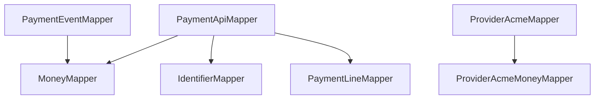
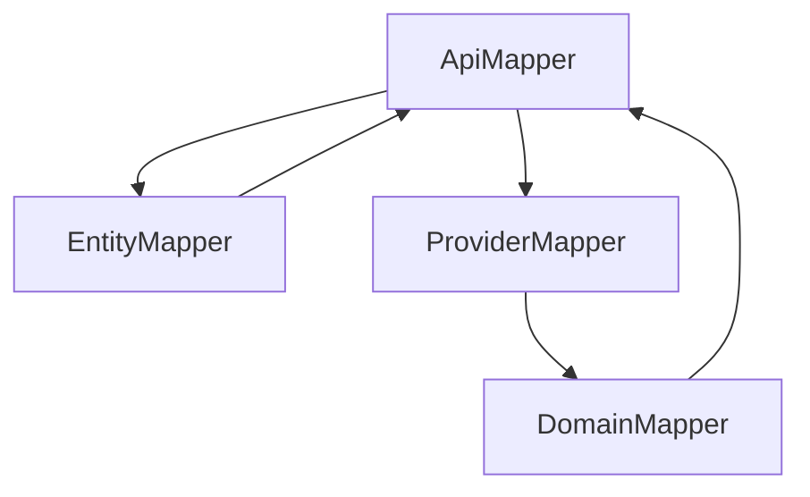
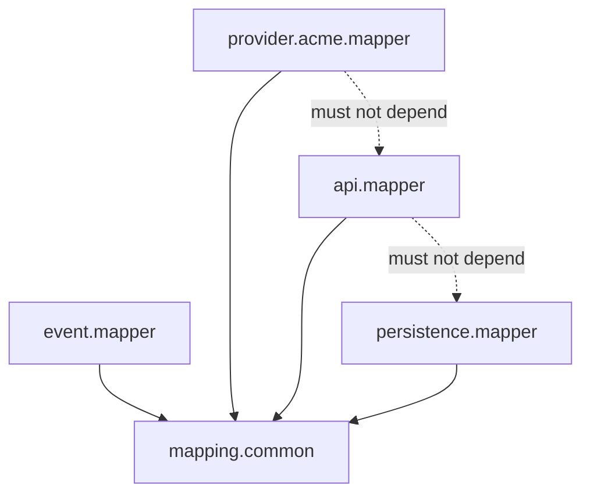

------
title: Learn Java Data Mapper, JSON/XML Processing & Validation - Part 026
description: MapStruct mapper composition architecture: @MapperConfig, shared config, decorators, mapping inheritance, component models, injection strategy, package layering, mapper governance, and anti-patterns.
series: learn-java-data-mapper-json-xml-validation
seriesTitle: Learn Java Data Mapper, JSON/XML Processing & Validation
order: 26
partTitle: Mapper Composition Architecture: Shared Config, Decorator, Inheritance, Component Models
tags:
- java
- mapstruct
- mapper-config
- decorator
- inheritance
- component-model
- architecture
- data-mapper
- governance
date: 2026-06-29
---

# Part 026 — Mapper Composition Architecture: Shared Config, Decorator, Inheritance, Component Models

> **Target skill:** mampu mendesain layer MapStruct di codebase besar: shared configuration, mapper composition, decorators, inheritance, component models, dependency injection, module/package boundaries, and production governance.

Satu mapper mudah dibuat. Puluhan mapper di microservice atau monolith enterprise mudah berubah menjadi chaos:

- policy berbeda antar mapper
- ada yang `ERROR`, ada yang `IGNORE`
- component model campur-campur
- mapper saling tergantung secara siklik
- mapper memanggil service bisnis
- entity mapper bocor ke API mapper
- conversion method duplicate dan inkonsisten
- enum strategy berbeda antar boundary
- tests tidak memakai generated mapper yang sama

Part ini membahas MapStruct sebagai **mapping architecture**, bukan hanya annotation syntax.

Mental model:

> **Mapper architecture is boundary architecture. If mappers are disorganized, boundaries become disorganized.**

---

## 1. Kaufman Deconstruction

Subskill composition architecture:

| Subskill | Kemampuan |
|---|---|
| Define mapper layers | API, event, persistence, provider, export mappers |
| Centralize config | `@MapperConfig` for policy reuse |
| Choose component model | default, spring, cdi, jakarta, jsr330 |
| Choose injection strategy | constructor vs field/setter where supported |
| Compose with `uses` | Helper mappers without dependency spaghetti |
| Use decorators | Add controlled custom behavior around generated mapper |
| Use inheritance carefully | Share mapping config without hiding intent |
| Avoid cycles | Prevent mapper dependency cycles |
| Govern conversions | Centralize money/date/id/status conversions |
| Test architecture | Compile rules, generated code, golden fixtures |

---

## 2. Mapper Layering

Recommended package layout:

```txt
com.example.payment.api.dto
com.example.payment.api.mapper
com.example.payment.event.dto
com.example.payment.event.mapper
com.example.payment.provider.acme.dto
com.example.payment.provider.acme.mapper
com.example.payment.persistence.entity
com.example.payment.persistence.mapper
com.example.payment.export.dto
com.example.payment.export.mapper
com.example.payment.mapping.common
```

Boundary-specific mappers:

| Mapper | Direction |
|---|---|
| `PaymentApiMapper` | API request/response ↔ command/view |
| `PaymentEventMapper` | domain event ↔ event contract |
| `AcmeProviderMapper` | provider payload ↔ internal command/event |
| `PaymentEntityMapper` | domain ↔ persistence entity |
| `PaymentExportMapper` | projection ↔ export record |
| `MoneyMapper` | common value representation |
| `IdentifierMapper` | id/value object conversion |

Avoid one `PaymentMapper` that does everything.

---

## 3. Shared Config with `@MapperConfig`

Central config:

```java
@MapperConfig(
    componentModel = "spring",
    unmappedTargetPolicy = ReportingPolicy.ERROR,
    unmappedSourcePolicy = ReportingPolicy.WARN,
    injectionStrategy = InjectionStrategy.CONSTRUCTOR
)
public interface CentralMapperConfig {
}
```

Mapper:

```java
@Mapper(
    config = CentralMapperConfig.class,
    uses = {MoneyMapper.class, IdentifierMapper.class}
)
public interface PaymentApiMapper {
}
```

Benefits:

- consistent component model
- consistent strictness
- consistent injection
- easier review
- less annotation repetition
- platform-wide policy

---

## 4. Multiple Config Profiles

One config may not fit all boundaries.

```java
@MapperConfig(
    componentModel = "spring",
    unmappedTargetPolicy = ReportingPolicy.ERROR,
    injectionStrategy = InjectionStrategy.CONSTRUCTOR
)
public interface StrictBoundaryMapperConfig {}
```

```java
@MapperConfig(
    componentModel = "spring",
    unmappedTargetPolicy = ReportingPolicy.ERROR,
    unmappedSourcePolicy = ReportingPolicy.IGNORE,
    injectionStrategy = InjectionStrategy.CONSTRUCTOR
)
public interface ProjectionMapperConfig {}
```

Use profiles:

| Config | Use |
|---|---|
| strict boundary | command/event mappers |
| projection | summary/read projections |
| persistence | entity/domain mapping |
| legacy provider | provider-specific relaxed source policy |
| test fixture | controlled fixture mappers if needed |

Do not create too many configs. Each config is a policy.

---

## 5. Component Models

MapStruct can generate mappers as plain classes or DI components.

Default:

```java
@Mapper
public interface CustomerMapper {
    CustomerMapper INSTANCE = Mappers.getMapper(CustomerMapper.class);
}
```

Spring:

```java
@Mapper(componentModel = "spring")
public interface CustomerMapper {}
```

CDI/Jakarta:

```java
@Mapper(componentModel = "cdi")
public interface CustomerMapper {}
```

Architecture rule:

> **Pick one component model per application layer unless there is a strong reason.**

Mixing default static mappers and DI mappers creates test/runtime drift.

---

## 6. Injection Strategy

Config:

```java
@MapperConfig(
    componentModel = "spring",
    injectionStrategy = InjectionStrategy.CONSTRUCTOR
)
public interface CentralMapperConfig {}
```

Constructor injection makes dependencies visible and testable.

Use setter injection only when decorators/circular dependencies require it.

Avoid field injection in generated components if your platform standard disallows it.

---

## 7. Composition with `uses`

```java
@Mapper(
    config = CentralMapperConfig.class,
    uses = {
        MoneyMapper.class,
        DateTimeMapper.class,
        IdentifierMapper.class,
        PaymentLineMapper.class
    }
)
public interface PaymentApiMapper {
    PaymentResponse toResponse(Payment payment);
}
```

`uses` composes mapper dependencies.

Guidelines:

- keep helper mappers cohesive
- avoid giant `CommonMapper` with unrelated methods
- avoid circular mapper dependencies
- prefer value-specific mappers (`MoneyMapper`, `DateTimeMapper`) over utility dump
- define boundary-specific conversions separately if semantics differ

---

## 8. Common Conversion Modules

Example:

```java
public class DateTimeMapper {

    @Named("isoInstant")
    public Instant isoInstant(String value) {
        return value == null ? null : Instant.parse(value);
    }

    @Named("instantToIso")
    public String instantToIso(Instant value) {
        return value == null ? null : DateTimeFormatter.ISO_INSTANT.format(value);
    }
}
```

```java
public class MoneyMapper {
    public Money toMoney(MoneyDto dto) {
        if (dto == null) return null;
        return new Money(dto.amount(), Currency.getInstance(dto.currency()));
    }

    public MoneyDto toDto(Money money) {
        if (money == null) return null;
        return new MoneyDto(money.amount(), money.currency().getCurrencyCode());
    }
}
```

Centralized conversions reduce drift.

But if provider money shape differs from public API money shape, create separate mapper:

```txt
ApiMoneyMapper
ProviderAcmeMoneyMapper
InternalMoneyMapper
```

Do not force one mapper to serve incompatible contracts.

---

## 9. Decorators

A decorator wraps generated mapper with custom behavior.

Use decorator when:

- most mapping is generated
- small part needs manual logic
- logic is still mapping-level
- you want generated mapper delegate
- `@AfterMapping` is not enough or less clear

Mapper:

```java
@Mapper(config = CentralMapperConfig.class)
@DecoratedWith(CustomerMapperDecorator.class)
public interface CustomerMapper {
    CustomerResponse toResponse(Customer customer);
}
```

Decorator:

```java
public abstract class CustomerMapperDecorator implements CustomerMapper {

    private final CustomerMapper delegate;

    protected CustomerMapperDecorator(CustomerMapper delegate) {
        this.delegate = delegate;
    }

    @Override
    public CustomerResponse toResponse(Customer customer) {
        CustomerResponse response = delegate.toResponse(customer);

        if (response == null) {
            return null;
        }

        return response.withDisplayLabel(
            response.customerId() + " - " + response.fullName()
        );
    }
}
```

Exact constructor/injection wiring depends on component model. Test generated bean wiring in framework.

---

## 10. Decorator vs `@AfterMapping`

| Need | Better Fit |
|---|---|
| set one derived field | `@AfterMapping` |
| wrap all mapping results | decorator |
| call delegate and post-process deeply | decorator |
| add redaction based on context | maybe `@AfterMapping` or decorator |
| replace mapping for one method | manual default method/decorator |
| business workflow | neither; use service |

Decorators are more visible for non-trivial custom behavior.

Hooks are simpler for small lifecycle adjustments.

---

## 11. Mapping Inheritance

Use mapping inheritance when multiple methods share mapping rules.

```java
@Mapper(config = CentralMapperConfig.class)
public interface CustomerMapper {

    @Mapping(target = "customerId", source = "id.value")
    @Mapping(target = "fullName", source = "legalName")
    CustomerResponse toResponse(Customer customer);

    @InheritConfiguration(name = "toResponse")
    CustomerSummary toSummary(Customer customer);
}
```

Be careful: summary and detail often have different security/visibility semantics.

Use inheritance when:

- mapping is truly same concept
- target fields align
- no hidden security difference
- tests cover both

Avoid when:

- response variants differ by authorization
- event versions differ
- provider variants differ
- target fields have similar names but different meaning

---

## 12. Inverse Mapping

```java
@Mapper(config = CentralMapperConfig.class)
public interface CustomerMapper {

    @Mapping(target = "customerId", source = "id.value")
    CustomerResponse toResponse(Customer customer);

    @InheritInverseConfiguration(name = "toResponse")
    Customer toDomain(CustomerResponse response);
}
```

Inverse mapping is tempting, but domain reconstruction is often not inverse of response projection.

Use inverse mapping only for truly reversible DTOs.

Do not use inverse mapping for:

- response DTO -> domain aggregate
- masked/redacted fields
- derived fields
- event payload with snapshots
- flattened read model
- lossy conversion

---

## 13. Mapper Dependency Graph

Good:



Bad:



Avoid cycles. Mapper dependencies should point from boundary mapper to helper/value mappers, not across unrelated boundaries.

---

## 14. Boundary-Specific Mapper Rule

Public API mapper should not use provider mapper.

Provider mapper should not use persistence entity mapper.

Persistence mapper should not use API response mapper.

Why?

- prevents contract coupling
- avoids accidental field leakage
- supports independent evolution
- improves test scope
- makes mapping direction obvious

Allowed shared dependencies:

- value object mapper
- identifier mapper
- date/time mapper
- enum code mapper if semantics shared

---

## 15. Entity Mapper Governance

Entity/domain mapping is risky.

Entity mapper can accidentally:

- bypass domain constructors/invariants
- expose lazy relations
- overwrite audit fields
- create detached graph confusion
- map database id into public DTO
- trigger N+1 if used in response path

Guidelines:

```txt
EntityMapper is persistence-layer internal.
It should not be used by API controllers.
It should not be used to build public responses directly.
It must explicitly ignore audit/version/id fields when appropriate.
It must avoid deep graph mapping unless intentional.
```

---

## 16. Event Mapper Governance

Event mappers are contract-critical.

Rules:

- schema version explicit
- event type constant explicit
- event timestamp source explicit
- no consumer-specific fields
- no raw domain graph
- enum strategy tested
- backward compatibility fixtures
- additive changes reviewed

Example:

```java
@Mapper(config = StrictBoundaryMapperConfig.class, uses = MoneyMapper.class)
public interface PaymentEventMapper {

    @Mapping(target = "schemaVersion", constant = "1")
    @Mapping(target = "eventType", constant = "payment.approved")
    @Mapping(target = "paymentId", source = "payment.id.value")
    @Mapping(target = "occurredAt", source = "occurredAt")
    PaymentApprovedEvent toEvent(Payment payment, Instant occurredAt);
}
```

Note: use case passes `occurredAt`; mapper does not call `Instant.now()`.

---

## 17. API Mapper Governance

API mapper should be close to API DTOs.

Rules:

- request DTO -> command, not entity
- domain/view -> response DTO, not entity direct
- no repository calls
- no authorization decisions
- no hidden default for critical fields
- strict target policy
- golden response tests
- validation before request-to-command mapping

---

## 18. Provider Mapper Governance

Provider integrations often need tolerant conversion.

Rules:

- provider mapper lives in provider package
- raw provider codes preserved if needed
- unknown provider enum strategy explicit
- date/time parser explicit
- provider-specific money format isolated
- provider version fixtures included
- do not pollute global API mappers with provider quirks

---

## 19. Decorator Case Study: Redacted Response

Generated mapper:

```java
@Mapper(config = CentralMapperConfig.class)
@DecoratedWith(CaseResponseMapperDecorator.class)
public interface CaseResponseMapper {
    CaseDetailResponse toDetail(CaseView view, @Context RedactionPolicy policy);
}
```

Decorator:

```java
public abstract class CaseResponseMapperDecorator implements CaseResponseMapper {

    private final CaseResponseMapper delegate;

    protected CaseResponseMapperDecorator(CaseResponseMapper delegate) {
        this.delegate = delegate;
    }

    @Override
    public CaseDetailResponse toDetail(CaseView view, RedactionPolicy policy) {
        CaseDetailResponse response = delegate.toDetail(view, policy);

        if (response == null || policy.canViewInternalNotes()) {
            return response;
        }

        return response.withInternalNotes(List.of());
    }
}
```

Security tests:

```java
@Test
void redactsInternalNotesForPublicViewer() {
    CaseDetailResponse response = mapper.toDetail(view, RedactionPolicy.publicViewer());

    assertThat(response.internalNotes()).isEmpty();
}
```

For high-risk APIs, separate DTOs may still be better than decorator redaction.

---

## 20. Testing Mapper Architecture

### 20.1 Config Test

Use ArchUnit-like rules or simple reflection tests.

```java
@Test
void apiMappersUseStrictConfig() {
    // pseudo-test: scan mapper annotations and assert config
}
```

### 20.2 No Entity Mapper in API Package

```txt
Rule: classes in ..api.. should not depend on ..persistence.mapper..
```

### 20.3 Generated Implementation Smoke Test

```java
@SpringBootTest
class MapperWiringTest {
    @Autowired PaymentApiMapper paymentApiMapper;

    @Test
    void mapperBeanExists() {
        assertThat(paymentApiMapper).isNotNull();
    }
}
```

### 20.4 Contract Fixture Tests

- API response golden JSON
- event fixture
- provider input fixture
- entity mapping persistence test
- redaction test

---

## 21. Versioning Mapper Config

If shared mapper config changes, many generated mappers may change.

Examples:

- change unmapped source policy
- change component model
- change injection strategy
- add common mapper in `uses`
- change null value strategy
- change collection strategy

Treat config changes as platform changes:

- run all mapper tests
- inspect generated diff for critical mappers
- communicate to teams if shared library
- update docs

---

## 22. Handling Lombok and Builders

If using Lombok builders with MapStruct:

- configure annotation processors correctly
- include binding support where needed
- ensure builder methods are detected
- inspect generated code
- test builder mapping
- beware hidden defaults in builders

Builder mapping is not only MapStruct concern; it depends on generated code from Lombok and annotation processor ordering.

---

## 23. One Mapper per Direction?

For simple cases:

```java
CustomerResponse toResponse(Customer customer);
CustomerCommand toCommand(CustomerRequest request);
```

Same mapper can contain both if boundary is same.

For complex systems, split by direction/use case:

```txt
CustomerCommandMapper
CustomerResponseMapper
CustomerEventMapper
CustomerEntityMapper
```

Decision factors:

- number of methods
- security sensitivity
- dependency differences
- helper mapper differences
- testing scope
- team ownership
- contract versioning

---

## 24. Avoid Utility Dump Mappers

Bad:

```java
public class CommonMapper {
    // money, date, user, payment, case, provider, status, locale, id...
}
```

Better:

```txt
MoneyMapper
DateTimeMapper
IdentifierMapper
ProviderStatusMapper
CasePriorityMapper
```

Cohesion improves discoverability and reduces accidental method selection.

---

## 25. Production Checklist

Before approving mapper architecture:

- [ ] Is mapper boundary-specific?
- [ ] Is shared `@MapperConfig` used?
- [ ] Is component model consistent?
- [ ] Is injection strategy consistent?
- [ ] Are helper mappers cohesive?
- [ ] Are mapper dependencies acyclic?
- [ ] Are provider quirks isolated?
- [ ] Are entity mappers not used by API layer?
- [ ] Are event mappers contract-tested?
- [ ] Are decorators justified and tested?
- [ ] Is mapping inheritance not hiding security differences?
- [ ] Is inverse mapping used only when truly reversible?
- [ ] Are generated code diffs reviewed for critical config changes?
- [ ] Are architecture rules enforced by tests or review checklist?

---

## 26. Anti-Patterns

### 26.1 One Mega Mapper

Hundreds of methods, many unrelated directions, impossible to reason about.

### 26.2 Provider Quirk in Common Mapper

Global mapper starts accepting weird provider date/status format everywhere.

### 26.3 API Uses Entity Mapper

Persistence shape leaks to public contract.

### 26.4 Inverse Mapping of Lossy Projection

Response DTO cannot reconstruct domain aggregate.

### 26.5 Decorator Business Logic

Decorator calculates price, risk, or workflow transition.

### 26.6 Mapper Cycles

Mapper dependency graph becomes tangled and fragile.

### 26.7 Config Drift

Some mappers use strict config, others silently ignore unmapped fields.

---

## 27. Mini Architecture Example

```txt
payment/
  api/
    dto/
      CreatePaymentRequest.java
      PaymentResponse.java
    mapper/
      PaymentCommandMapper.java
      PaymentResponseMapper.java
  event/
    dto/
      PaymentApprovedEvent.java
    mapper/
      PaymentEventMapper.java
  provider/acme/
    dto/
      AcmePaymentWebhook.java
    mapper/
      AcmePaymentMapper.java
  persistence/
    entity/
      PaymentEntity.java
    mapper/
      PaymentEntityMapper.java
  mapping/common/
    StrictBoundaryMapperConfig.java
    ProjectionMapperConfig.java
    MoneyMapper.java
    IdentifierMapper.java
    DateTimeMapper.java
```

Dependency direction:



---

## 28. Practice Drill

Design mapper architecture for `Customer` module:

Boundaries:

- REST API create/update/read
- Kafka customer-created/customer-updated events
- persistence entity
- provider CRM import
- CSV export

Tasks:

1. Define package layout.
2. Define mapper classes.
3. Define shared configs.
4. Define helper mappers.
5. Define dependency graph.
6. Define which mappers use decorators.
7. Define tests per mapper.
8. Define architecture rules.
9. Identify forbidden dependencies.
10. Explain where provider-specific mapping must live.

---

## 29. Summary

Mapper architecture is part of system architecture.

Mental model:

> **Every mapper belongs to a boundary. Shared config enforces policy; composition enforces clarity.**

Rules:

1. Split mappers by boundary and direction when complexity grows.
2. Use `@MapperConfig` for shared policy.
3. Keep component model consistent.
4. Use constructor injection where appropriate.
5. Compose with cohesive helper mappers.
6. Avoid mapper dependency cycles.
7. Use decorators for controlled post-processing, not business workflows.
8. Use mapping inheritance carefully.
9. Avoid inverse mapping for lossy projections.
10. Keep provider quirks isolated.
11. Prevent API from depending on persistence mapper.
12. Test mapper wiring and architecture rules.

Part berikutnya covers mapping test strategy: golden samples, property-based checks, mutation surface, contract fixtures, and how to prove mappers do not silently corrupt data.

---

## References

- MapStruct 1.6.3 Reference Guide: https://mapstruct.org/documentation/stable/reference/html/
- MapStruct Stable API Docs: https://mapstruct.org/documentation/stable/api/
- MapStruct Project Home: https://mapstruct.org/
