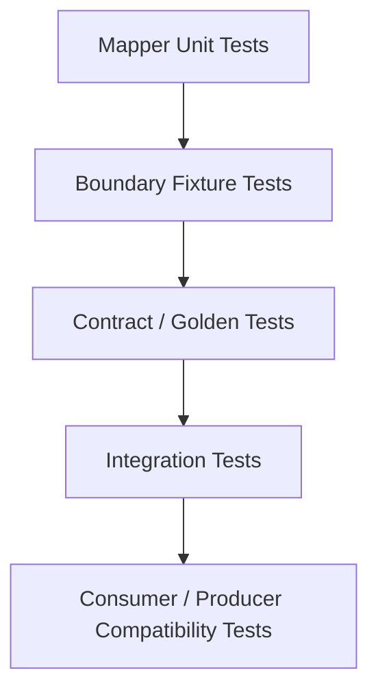

------
title: Learn Java Data Mapper, JSON/XML Processing & Validation - Part 027
description: Mapping test strategy untuk Java mapper layer: golden samples, semantic assertions, property-based checks, mutation surface, contract fixtures, MapStruct generated code review, and production-quality mapper test architecture.
series: learn-java-data-mapper-json-xml-validation
seriesTitle: Learn Java Data Mapper, JSON/XML Processing & Validation
order: 27
partTitle: Mapping Test Strategy: Golden Samples, Property-Based Checks, Mutation Surface, Contract Fixtures
tags:
- java
- mapstruct
- testing
- data-mapper
- contract-testing
- golden-samples
- property-based-testing
- dto
- validation
- jackson
date: 2026-06-29
---

# Part 027 — Mapping Test Strategy: Golden Samples, Property-Based Checks, Mutation Surface, Contract Fixtures

> **Target skill:** mampu membuktikan mapper benar secara semantic, bukan hanya compile. Ini mencakup golden sample, contract fixture, enum coverage, null/absence matrix, property-based checks, mutation surface, generated-code review, dan regression strategy.

MapStruct memberi compile-time safety. Jackson/JAXB memberi parser/binding capability. Jakarta Validation memberi constraint checking. Tetapi semua itu tidak otomatis membuktikan bahwa mapping kita benar secara bisnis.

Compile success hanya menjawab:

```txt
Apakah kode mapping bisa dihasilkan dan dikompilasi?
```

Test mapping menjawab:

```txt
Apakah field yang benar, dengan makna yang benar, berpindah ke target yang benar, dalam semua kondisi penting?
```

Mental model:

> **Mapper test is contract evidence. It protects meaning across refactor, schema evolution, and dependency upgrades.**

---

## 1. Kaufman Deconstruction

Subskill mapping test:

| Subskill | Kemampuan |
|---|---|
| Identify mapping risk | Menentukan mapper mana perlu test ringan vs heavy |
| Golden sample testing | Membandingkan object/output terhadap fixture yang stabil |
| Semantic assertion | Menguji meaning, bukan hanya field equality |
| Null/absence matrix | Menguji null, missing, empty, default, patch intent |
| Enum coverage | Memastikan semua enum source dimapping atau ditolak sengaja |
| Collection testing | Memastikan order, duplicates, merge semantics, empty behavior |
| Contract fixture testing | Menggunakan JSON/XML/event fixture nyata |
| Property-based checks | Menguji invariant mapping dengan banyak input |
| Mutation surface analysis | Menentukan field mana paling rawan silent corruption |
| Generated code review | Membaca mapper generated untuk mapping kritikal |
| Drift detection | Mendeteksi field baru/renamed/removed |
| CI integration | Menjadikan mapping tests bagian dari release gate |

---

## 2. Why Mapper Tests Matter

Mapping bug sering terlihat kecil tetapi dampaknya besar:

| Bug | Dampak |
|---|---|
| `customerId` mapped from internal DB id | data leak / wrong reference |
| money scale lost | financial mismatch |
| enum defaulted to `UNKNOWN` silently | workflow bypass |
| null ignored in patch | user cannot clear field |
| null set in merge | accidental data deletion |
| collection order changed | UI/audit/export mismatch |
| timezone dropped | regulatory timestamp error |
| entity graph mapped too deep | data leak / performance issue |
| new target field unmapped | partial response / invalid event |
| alias accepted forever | contract entropy |

Top engineer menguji mapper bukan karena tidak percaya MapStruct, tetapi karena MapStruct tidak tahu business meaning.

---

## 3. Test Pyramid for Mapping



### 3.1 Mapper Unit Tests

Cepat, langsung memanggil mapper.

```java
@Test
void mapsCustomerToResponse() {
    Customer customer = new Customer(new CustomerId("CUS-001"), "Ana");

    CustomerResponse response = mapper.toResponse(customer);

    assertThat(response.customerId()).isEqualTo("CUS-001");
    assertThat(response.fullName()).isEqualTo("Ana");
}
```

### 3.2 Boundary Fixture Tests

Baca JSON/XML fixture, deserialize, map, assert command/domain DTO.

```java
@Test
void createPaymentFixture_mapsToCommand() throws Exception {
    CreatePaymentRequest request = objectMapper.readValue(
        fixture("create-payment-valid-card.json"),
        CreatePaymentRequest.class
    );

    CreatePaymentCommand command = mapper.toCommand(request);

    assertThat(command.money().amount()).isEqualByComparingTo("100.00");
}
```

### 3.3 Golden Contract Tests

Pastikan output event/API/export tetap stabil.

```java
@Test
void paymentApprovedEvent_goldenJson() throws Exception {
    PaymentApprovedEvent event = mapper.toEvent(fixturePayment());

    assertThatJson(objectMapper.writeValueAsString(event)).isEqualTo(
        fixtureText("payment-approved-event-v1.json")
    );
}
```

### 3.4 Integration Tests

Lewat HTTP/event/import path asli.

```txt
JSON bytes -> Jackson -> Validation -> MapStruct -> Use Case
```

Ini memastikan mapper yang diuji sama dengan runtime path.

---

## 4. Classify Mapper Risk

Tidak semua mapper butuh tingkat test sama.

| Mapper Type | Risk | Test Depth |
|---|---:|---|
| simple same-name DTO mapper | low | smoke test + compile strict policy |
| public API response mapper | medium/high | golden response tests |
| command request mapper | high | fixture + validation + semantic assertions |
| event producer mapper | high | golden event + compatibility tests |
| event consumer mapper | high | old/new/unknown fixtures |
| payment/money mapper | very high | edge cases + round-trip + property checks |
| patch/update mapper | very high | missing/null/value matrix |
| provider integration mapper | high | provider fixtures + tolerant/strict policy tests |
| persistence entity mapper | medium/high | invariant + no leak + collection tests |
| security/redaction mapper | very high | negative tests proving secret absent |

Rule:

> **The more a mapper crosses a trust boundary or money/state boundary, the more it deserves explicit tests.**

---

## 5. Test Data Strategy

Avoid random object mothers that hide meaning.

Bad:

```java
Customer customer = CustomerFixture.randomCustomer();
```

Better:

```java
Customer customer = CustomerFixtures.activeCustomer(
    "CUS-001",
    "Ana Maria",
    "ana@example.com"
);
```

Best for contracts: named fixtures.

```txt
fixtures/customer/customer-active.json
fixtures/payment/create-payment-card-valid.json
fixtures/payment/create-payment-invalid-money-scale.json
fixtures/event/payment-approved-v1.json
fixtures/event/payment-approved-v1-extra-field.json
fixtures/xml/case-report-valid.xml
fixtures/xml/case-report-wrong-namespace.xml
```

Named fixtures become documentation.

---

## 6. Golden Sample Testing

Golden sample is a fixed expected representation.

Use for:

- API response JSON
- event payload JSON
- XML export
- CSV/JSON import output
- audit event
- schema evolution
- migration testing

Example:

```java
@Test
void customerResponse_golden() throws Exception {
    CustomerResponse response = mapper.toResponse(fixtureCustomer());

    String actual = objectMapper.writeValueAsString(response);

    assertThatJson(actual).isEqualTo("""
    {
      "customerId": "CUS-001",
      "fullName": "Ana Maria",
      "status": "ACTIVE"
    }
    """);
}
```

Golden tests should be reviewed like contract changes. If golden output changes, ask:

- is this intended?
- is it backward-compatible?
- does consumer know?
- does schema version need bump?
- does migration need alias/upcaster?

---

## 7. Semantic Assertions

Do not only assert object equality if target equality is too broad or too weak.

Bad:

```java
assertThat(response).isNotNull();
```

Weak:

```java
assertThat(response.fullName()).isEqualTo(customer.fullName());
```

Better:

```java
assertThat(response.customerId())
    .as("public customer id must use business id, not database id")
    .isEqualTo("CUS-001");

assertThat(response).doesNotHaveFieldOrProperty("passwordHash");
```

Semantic assertions document engineering intent.

---

## 8. Null / Absence / Empty Matrix Tests

For each boundary field, decide expected behavior.

| Input State | Example | Expected |
|---|---|---|
| missing | `{}` | reject / unchanged / default |
| explicit null | `{ "email": null }` | reject / clear / unchanged |
| empty string | `{ "email": "" }` | reject / normalize / accept |
| blank string | `{ "email": "   " }` | reject / trim / accept |
| empty array | `{ "tags": [] }` | clear / reject / empty |
| null array | `{ "tags": null }` | reject / clear / unchanged |
| absent array | `{}` | unchanged / empty / reject |

Example patch test:

```java
@Test
void patch_nullPhone_clearsPhone() throws Exception {
    CustomerEntity target = existingCustomerWithPhone("0812");
    CustomerPatchRequest patch = patchParser.parse("""
    { "phoneNumber": null }
    """);

    patchApplier.apply(patch, target);

    assertThat(target.getPhoneNumber()).isNull();
}
```

Example merge test:

```java
@Test
void merge_nullPhone_keepsExistingPhone() {
    CustomerEntity target = existingCustomerWithPhone("0812");
    CustomerMergeRequest request = new CustomerMergeRequest(null, null, null);

    mapper.merge(request, target);

    assertThat(target.getPhoneNumber()).isEqualTo("0812");
}
```

---

## 9. Enum Coverage Tests

For internal closed enums, every source value should be mapped.

```java
@Test
void allProviderStatusesAreMapped() {
    for (ProviderStatus status : ProviderStatus.values()) {
        assertThatCode(() -> mapper.toDomain(status))
            .as("status %s must be handled", status)
            .doesNotThrowAnyException();
    }
}
```

For target expectations:

```java
@ParameterizedTest
@CsvSource({
    "WAITING,PENDING",
    "PAID,COMPLETED",
    "FAIL,FAILED"
})
void mapsProviderStatus(ProviderStatus source, PaymentStatus expected) {
    assertThat(mapper.toDomain(source)).isEqualTo(expected);
}
```

For external string codes:

```java
@Test
void unknownProviderStatus_preservesRaw() {
    ProviderStatusValue status = mapper.toStatus("NEW_PROVIDER_CODE");

    assertThat(status.raw()).isEqualTo("NEW_PROVIDER_CODE");
    assertThat(status.known()).isEqualTo(ProviderStatusValue.Known.UNRECOGNIZED);
}
```

Do not casually collapse unknown external enum to null.

---

## 10. Money and Decimal Tests

Money mapping deserves dedicated tests.

Cases:

| Input | Expected |
|---|---|
| `"100.00"` | amount `100.00`, scale policy preserved |
| `"100"` | accepted/rejected based on contract |
| `"100.001"` | rejected if scale > 2 |
| `"0.00"` | accepted/rejected based on rule |
| negative | accepted for reversal or rejected |
| JSON number | accepted/rejected based on contract |
| scientific notation | accepted/rejected based on contract |
| currency lowercase | normalize/reject |
| unsupported currency | reject |

Example:

```java
@Test
void mapsMoney_preservesDecimalStringMeaning() {
    MoneyDto dto = new MoneyDto("100.00", "IDR");

    Money money = mapper.toMoney(dto);

    assertThat(money.amount()).isEqualByComparingTo("100.00");
    assertThat(money.currency()).isEqualTo(Currency.getInstance("IDR"));
}
```

Scale check:

```java
@Test
void money_rejectsTooManyFractionDigits() {
    MoneyDto dto = new MoneyDto("100.001", "IDR");

    assertThatThrownBy(() -> mapper.toMoney(dto))
        .isInstanceOf(IllegalArgumentException.class);
}
```

---

## 11. Date-Time Tests

Test semantic time choice:

| Field | Expected type |
|---|---|
| event occurrence | `Instant` |
| provider timestamp with offset | `OffsetDateTime` or `Instant` plus raw if needed |
| business date | `LocalDate` |
| billing month | `YearMonth` |

Example:

```java
@Test
void mapsOccurredAtToInstant() {
    EventDto dto = new EventDto("2026-06-29T03:00:00Z");

    EventCommand command = mapper.toCommand(dto);

    assertThat(command.occurredAt()).isEqualTo(Instant.parse("2026-06-29T03:00:00Z"));
}
```

Reject ambiguous timestamp:

```java
@Test
void rejectsTimestampWithoutOffsetWhenInstantRequired() {
    EventDto dto = new EventDto("2026-06-29T10:00:00");

    assertThatThrownBy(() -> mapper.toCommand(dto))
        .isInstanceOf(DateTimeParseException.class);
}
```

---

## 12. Collection Mapping Tests

Collections need tests for:

- order
- duplicates
- null collection
- empty collection
- null item
- item conversion
- target mutability
- replace vs merge semantics

Example order preservation:

```java
@Test
void mapsOrderLinesInSameOrder() {
    Order order = fixtureOrderWithLines("SKU-A", "SKU-B", "SKU-C");

    OrderResponse response = mapper.toResponse(order);

    assertThat(response.lines())
        .extracting(OrderLineResponse::sku)
        .containsExactly("SKU-A", "SKU-B", "SKU-C");
}
```

Example empty:

```java
@Test
void mapsEmptyLinesToEmptyList() {
    Order order = fixtureOrderWithLines();

    OrderResponse response = mapper.toResponse(order);

    assertThat(response.lines()).isEmpty();
}
```

If null collection should become empty, test it explicitly.

---

## 13. Object Graph and Redaction Tests

When mapping from domain/entity to response, prove sensitive fields do not leak.

```java
@Test
void accountResponse_doesNotExposeSensitiveFields() throws Exception {
    Account account = fixtureAccountWithSecrets();

    AccountResponse response = mapper.toResponse(account);
    String json = objectMapper.writeValueAsString(response);

    assertThat(json).doesNotContain("passwordHash");
    assertThat(json).doesNotContain("accessToken");
    assertThat(json).doesNotContain("internalRiskScore");
}
```

Also test graph depth:

```java
@Test
void orderResponse_doesNotIncludeCustomerOrdersBackReference() throws Exception {
    Order order = fixtureOrderWithBidirectionalCustomer();

    OrderResponse response = mapper.toResponse(order);
    String json = objectMapper.writeValueAsString(response);

    assertThat(json).doesNotContain("orders");
}
```

---

## 14. Contract Fixture Tests

Fixture-driven test:

```java
@Test
void providerPaymentFixture_mapsToCommand() throws Exception {
    ProviderPaymentDto dto = objectMapper.readValue(
        fixture("provider/payment-paid-v1.json"),
        ProviderPaymentDto.class
    );

    PaymentImportedCommand command = mapper.toCommand(dto);

    assertThat(command.paymentId().value()).isEqualTo("PAY-001");
    assertThat(command.money().amount()).isEqualByComparingTo("100.00");
    assertThat(command.status()).isEqualTo(PaymentStatus.COMPLETED);
}
```

Fixtures should include:

```txt
provider/payment-paid-v1.json
provider/payment-paid-v1-extra-field.json
provider/payment-paid-v1-unknown-status.json
provider/payment-paid-v1-invalid-amount.json
provider/payment-paid-v1-missing-currency.json
```

For XML:

```txt
case-report-valid.xml
case-report-wrong-namespace.xml
case-report-missing-required.xml
case-report-invalid-date.xml
case-report-xxe.xml
```

---

## 15. Property-Based Testing Ideas

Property-based testing means generate many inputs and assert invariant.

Example invariant: branch code preserves leading zeros.

```java
@Property
void branchCodeRoundTripPreservesLeadingZeros(@ForAll("branchCodes") String raw) {
    BranchCode code = mapper.toBranchCode(raw);

    assertThat(mapper.fromBranchCode(code)).isEqualTo(raw);
}
```

Money invariant:

```java
@Property
void moneyDtoRoundTripPreservesAmountAndCurrency(@ForAll MoneyDto dto) {
    assumeValidMoneyDto(dto);

    Money money = mapper.toMoney(dto);
    MoneyDto roundTrip = mapper.toDto(money);

    assertThat(roundTrip.amount()).isEqualTo(dto.amount());
    assertThat(roundTrip.currency()).isEqualTo(dto.currency());
}
```

Useful invariants:

| Mapping | Property |
|---|---|
| identifier | round-trip preserves string |
| enum code | all known code maps to known enum |
| money | no float/double precision loss |
| date-time | instant stays same after round-trip |
| collection | size/order preserved where required |
| redaction | secret never appears in serialized output |
| patch | absent field never changes target |

Use property tests for conversion functions, not every mapper.

---

## 16. Mutation Surface Analysis

Mutation surface adalah bagian mapping yang jika salah akan merusak data atau contract.

High mutation surface fields:

- identifiers
- money
- currency
- status/state
- permission flags
- timestamps
- customer/account references
- nested ownership relation
- external provider code
- audit fields
- nullable patch fields
- polymorphic discriminator
- secret/redacted fields

For each high-risk field, write explicit assertion.

Example checklist:

```txt
Payment mapper mutation surface:
- paymentId: preserves external id, not internal id
- amount: decimal string to BigDecimal, no double
- currency: ISO code, uppercase required
- status: explicit provider code map
- occurredAt: ISO instant, offset required
- customerId: business id, not DB id
- rawProviderStatus: preserved when unknown
```

---

## 17. Generated Code Review as Test Aid

For critical mapper:

1. Open generated implementation.
2. Check null handling.
3. Check nested mapping path.
4. Check enum switch.
5. Check collection loop.
6. Check ignored fields.
7. Check constructor/builder use.
8. Check unexpected implicit conversion.

Generated code is not usually committed, but it is reviewable in local/CI artifacts.

Add a PR checklist item:

```txt
For MapStruct mapper affecting payment/event/security/patch, generated code inspected? yes/no
```

---

## 18. Testing MapStruct with Spring/DI

For pure mapper tests, use generated mapper directly:

```java
private final CustomerMapper mapper = Mappers.getMapper(CustomerMapper.class);
```

For Spring component model with dependencies/decorators, use Spring test or instantiate with dependencies manually.

```java
@SpringBootTest
class PaymentMapperSpringTest {
    @Autowired PaymentMapper mapper;

    @Test
    void mapsWithInjectedDependencies() {
        // test
    }
}
```

Use Spring integration tests when:

- mapper has decorator
- mapper uses Spring component dependencies
- mapper has injected helper classes
- mapper config/injection matters

Use fast unit tests for pure mapping logic.

---

## 19. Contract Drift Tests

If target DTO adds new required field, strict MapStruct policy should fail compile. But if field is nullable or ignored, compile may pass. Add golden tests.

Example failure you want to catch:

```java
public record PaymentApprovedEvent(
    String eventId,
    String paymentId,
    String status,
    String schemaVersion,
    String newRequiredField
) {}
```

If mapper sets `newRequiredField` to null, golden event test fails.

```java
assertThatJson(actual).isEqualTo(expectedFixture);
```

Contract drift tests are especially important for event producers.

---

## 20. Mapper Tests and Validation Tests

Keep responsibilities separate.

Validation test:

```java
@Test
void request_rejectsBlankCustomerId() {
    CreateCustomerRequest request = new CreateCustomerRequest("", "Ana");

    assertThat(validator.validate(request))
        .extracting(v -> v.getPropertyPath().toString())
        .contains("customerId");
}
```

Mapper test:

```java
@Test
void validRequest_mapsToCommand() {
    CreateCustomerRequest request = new CreateCustomerRequest("CUS-001", "Ana");

    CreateCustomerCommand command = mapper.toCommand(request);

    assertThat(command.customerId().value()).isEqualTo("CUS-001");
}
```

Integration test:

```txt
invalid JSON -> deserialization/validation error -> mapper not called
```

Do not make mapper tests responsible for every validation rule.

---

## 21. Negative Testing

Positive tests prove expected data maps. Negative tests prove dangerous data does not pass silently.

Examples:

```java
@Test
void mapperRejectsUnknownProviderStatus() {}

@Test
void mapperDoesNotExposePasswordHash() {}

@Test
void mapperDoesNotDefaultMissingAmountToZero() {}

@Test
void patchAbsentFieldDoesNotChangeTarget() {}

@Test
void invalidDateWithoutOffsetRejected() {}

@Test
void branchCodeLeadingZeroPreserved() {}
```

Negative tests are often more valuable than happy path tests for mapper correctness.

---

## 22. Performance Tests for Hot Mappers

Most mappers do not need performance tests. Some do:

- import millions of rows
- event ingestion hot path
- export large files
- object graph projections
- map-heavy API gateway

Metrics:

- records/sec
- allocation rate
- p95/p99 latency
- GC pressure
- payload size
- max heap

Test shape:

```java
@Test
void mapsLargeBatchWithinBudget() {
    List<ProviderPaymentDto> dtos = fixturePayments(100_000);

    long start = System.nanoTime();
    List<PaymentImportedCommand> commands = dtos.stream()
        .map(mapper::toCommand)
        .toList();
    long elapsed = System.nanoTime() - start;

    assertThat(commands).hasSize(100_000);
    // Use benchmark framework for real performance gates.
}
```

For serious performance, use JMH or integration benchmark, not naive unit timing only.

---

## 23. Test Naming Convention

Good test names encode contract.

Bad:

```java
@Test void testMapper() {}
```

Good:

```java
@Test void mapsProviderPaidStatusToCompleted() {}
@Test void preservesLeadingZerosInAccountNumber() {}
@Test void patchNullPhoneClearsPhone() {}
@Test void mergeNullPhoneKeepsExistingPhone() {}
@Test void responseDoesNotExposeInternalRiskScore() {}
@Test void eventGoldenJsonRemainsBackwardCompatible() {}
```

Test names become living documentation.

---

## 24. CI Gates

Mapper quality gates:

```txt
- Compile with MapStruct strict policies.
- Run mapper unit tests.
- Run fixture/golden tests.
- Run validation tests.
- Run contract compatibility tests for public events/API.
- Run security/redaction tests.
- Run mutation testing for critical mapper if useful.
```

CI should fail on:

- unmapped target property
- golden fixture diff
- secret leak
- unknown enum not handled
- schema invalid generated XML
- patch semantics regression

---

## 25. Mini Case Study: Payment Event Mapper Test Plan

Mapper:

```java
PaymentApprovedEvent toApprovedEvent(Payment payment);
```

Risk surface:

- event id
- payment id
- customer id
- amount/currency
- status
- occurredAt
- schemaVersion
- no card token
- no internal risk score

Tests:

```txt
1. maps required fields
2. amount serializes as decimal string
3. currency is ISO code
4. occurredAt is ISO instant
5. schemaVersion constant is v1
6. card token absent from JSON
7. internal risk score absent from JSON
8. golden JSON equals fixture
9. null optional note omitted/included per contract
10. event remains deserializable by v1 consumer fixture
```

Example:

```java
@Test
void approvedEvent_doesNotExposeCardToken() throws Exception {
    Payment payment = fixturePaymentWithCardToken("tok_secret");

    PaymentApprovedEvent event = mapper.toApprovedEvent(payment);
    String json = objectMapper.writeValueAsString(event);

    assertThat(json).doesNotContain("tok_secret");
    assertThat(json).doesNotContain("cardToken");
}
```

---

## 26. Practice Drill

For this mapper:

```java
ProviderTransferDto -> TransferImportedCommand
```

Fields:

```txt
transfer_id: String
source_account: String
destination_account: String
amount: String
currency: String
status: String
created_at: String
metadata: Map<String, String>
```

Design a test suite:

1. Valid fixture maps to command.
2. Leading zeros in account numbers preserved.
3. Amount scale > 2 rejected.
4. Lowercase currency rejected or normalized by explicit policy.
5. Unknown status preserved or rejected by policy.
6. Timestamp without offset rejected.
7. Metadata secret key rejected or redacted.
8. Golden imported command/event fixture stable.
9. Null amount does not become zero.
10. Collection/order behavior if there are transfer lines.

---

## 27. Summary

Mapper testing is about preserving meaning.

Mental model:

> **MapStruct verifies structure at compile time; tests verify semantic intent at runtime.**

Rules:

1. Classify mapper risk.
2. Use strict compile policies.
3. Write semantic assertions for high-risk fields.
4. Use golden fixtures for public API/event/export contracts.
5. Test null, absence, empty, and default behavior.
6. Test enum coverage and unknown enum strategy.
7. Test money, time, identifier, and status conversions deeply.
8. Test redaction and graph depth.
9. Inspect generated code for critical mappers.
10. Keep validation tests separate from mapper tests, with integration tests for full pipeline.
11. Treat golden diff as contract review.
12. Use property-based checks for conversion invariants.

Part berikutnya starts Jakarta Validation: constraint, validator, violation, path, groups, payload, validator factory, and how validation fits into Java boundary engineering.

---

## References

- MapStruct 1.6.3 Reference Guide: https://mapstruct.org/documentation/stable/reference/html/
- MapStruct Project Home: https://mapstruct.org/
- Jakarta Validation 3.1 Specification: https://jakarta.ee/specifications/bean-validation/3.1/jakarta-validation-spec-3.1.html
