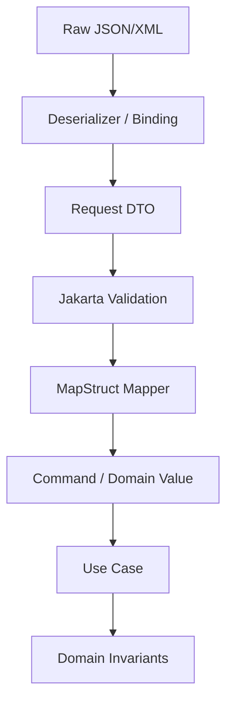

------
title: Learn Java Data Mapper, JSON/XML Processing & Validation - Part 028
description: Jakarta Validation model deep dive: constraint annotation, ConstraintValidator, ConstraintViolation, property path, groups, payload, ValidatorFactory, cascading, boundary validation, and production usage.
series: learn-java-data-mapper-json-xml-validation
seriesTitle: Learn Java Data Mapper, JSON/XML Processing & Validation
order: 28
partTitle: Jakarta Validation Model: Constraint, Validator, Violation, Path, Groups, Payload
tags:
- java
- jakarta-validation
- bean-validation
- hibernate-validator
- constraint
- validator
- validation-groups
- constraint-violation
- dto
- data-boundary
date: 2026-06-29
---

# Part 028 — Jakarta Validation Model: Constraint, Validator, Violation, Path, Groups, Payload

> **Target skill:** mampu memahami Jakarta Validation sebagai model deklaratif untuk memeriksa object graph: constraint annotation, validator implementation, violation path, group, payload, cascade, factory, and production error mapping.

Jakarta Validation sering dipakai lewat annotation sederhana:

```java
@NotBlank
String fullName;
```

Tetapi untuk sistem production, kita harus paham model lengkapnya:

- constraint annotation
- `ConstraintValidator`
- `ConstraintViolation`
- property path
- validation groups
- group sequence
- payload
- cascaded validation
- container element validation
- validator factory
- message interpolation
- executable/method validation
- provider implementation seperti Hibernate Validator

Mental model:

> **Validation is a boundary and invariant filter. It should reject invalid state before mapping/execution, but it must not become business workflow.**

---

## 1. Kaufman Deconstruction

Subskill Jakarta Validation:

| Subskill | Kemampuan |
|---|---|
| Understand constraint | Tahu constraint adalah annotation + validator implementation |
| Use built-ins | Memakai `@NotNull`, `@NotBlank`, `@Size`, `@Pattern`, etc. secara tepat |
| Read violations | Mengubah `ConstraintViolation` menjadi error response supportable |
| Navigate path | Memahami field, nested object, list index, map key, parameter path |
| Use groups | Membuat validation berbeda untuk create/update/patch/internal |
| Use payload | Membawa severity/metadata non-portable secara terkontrol |
| Cascade validation | Memakai `@Valid` untuk object graph yang sengaja |
| Bootstrap validator | Memakai `ValidatorFactory` dan `Validator` dengan benar |
| Custom constraints | Menulis annotation + `ConstraintValidator` |
| Avoid misuse | Tidak memasukkan repository/network/workflow logic ke validator |

---

## 2. Validation Position in Boundary Pipeline

Typical REST/API pipeline:



Important distinction:

| Failure | Layer |
|---|---|
| malformed JSON | parser/deserializer |
| wrong JSON token type | deserializer |
| missing required field | validation or deserializer depending model |
| blank string | validation |
| invalid date format | deserializer or custom validator if string |
| unknown reference id | application/domain |
| unauthorized update | authorization/use case |
| invalid state transition | domain |

Validation is not the only guard. It is one layer.

---

## 3. Constraint Model

A constraint is defined by:

1. annotation
2. one or more validator implementations
3. message
4. groups
5. payload
6. target element kind

Built-in example:

```java
@NotBlank(message = "fullName is required")
private String fullName;
```

Custom conceptual shape:

```java
@Target({ FIELD, METHOD, PARAMETER, RECORD_COMPONENT })
@Retention(RUNTIME)
@Constraint(validatedBy = CustomerIdValidator.class)
public @interface ValidCustomerId {
    String message() default "invalid customer id";
    Class<?>[] groups() default {};
    Class<? extends Payload>[] payload() default {};
}
```

Validator:

```java
public final class CustomerIdValidator
    implements ConstraintValidator<ValidCustomerId, String> {

    @Override
    public boolean isValid(String value, ConstraintValidatorContext context) {
        if (value == null) {
            return true;
        }
        return value.matches("CUS-[0-9]{3,}");
    }
}
```

Null handling rule:

> **Most custom constraints should return true for null and let `@NotNull` express requiredness.**

This allows constraints to compose cleanly.

---

## 4. Built-In Constraint Categories

Common constraints:

| Category | Examples |
|---|---|
| nullness | `@NotNull`, `@Null` |
| text | `@NotBlank`, `@NotEmpty`, `@Size`, `@Pattern`, `@Email` |
| number | `@Min`, `@Max`, `@Positive`, `@PositiveOrZero`, `@Negative`, `@DecimalMin`, `@DecimalMax`, `@Digits` |
| temporal | `@Past`, `@PastOrPresent`, `@Future`, `@FutureOrPresent` |
| boolean | `@AssertTrue`, `@AssertFalse` |
| container | `List<@NotBlank String>` |
| cascade | `@Valid` |

Example request:

```java
public record CreatePaymentRequest(
    @NotBlank
    @Pattern(regexp = "REQ-[0-9]{6,}")
    String requestId,

    @NotNull
    @DecimalMin("0.01")
    @Digits(integer = 18, fraction = 2)
    BigDecimal amount,

    @NotBlank
    @Pattern(regexp = "[A-Z]{3}")
    String currency
) {}
```

---

## 5. `ValidatorFactory` and `Validator`

Bootstrap:

```java
ValidatorFactory factory = Validation.buildDefaultValidatorFactory();
Validator validator = factory.getValidator();
```

Usage:

```java
Set<ConstraintViolation<CreatePaymentRequest>> violations =
    validator.validate(request);
```

In frameworks, a `Validator` is usually configured as bean and integrated with controller/method validation.

Production notes:

- `ValidatorFactory` is expensive; create once.
- `Validator` instances are generally intended for reuse.
- Provider configuration matters: message interpolator, clock provider, fail-fast, constraint validator factory.
- Tests should use production-like validator configuration when behavior matters.

---

## 6. `ConstraintViolation`

A violation contains:

- message
- message template
- root bean
- leaf bean
- invalid value
- property path
- constraint descriptor

Example:

```java
for (ConstraintViolation<CreatePaymentRequest> violation : violations) {
    String path = violation.getPropertyPath().toString();
    String message = violation.getMessage();
    Object invalidValue = violation.getInvalidValue();
}
```

Convert to API error:

```java
public record FieldError(
    String field,
    String code,
    String message
) {}
```

Mapper:

```java
public FieldError toFieldError(ConstraintViolation<?> violation) {
    return new FieldError(
        violation.getPropertyPath().toString(),
        violation.getConstraintDescriptor().getAnnotation().annotationType().getSimpleName(),
        violation.getMessage()
    );
}
```

Do not blindly return `invalidValue`; it may contain secrets.

---

## 7. Property Path

Simple:

```java
public record CustomerRequest(
    @NotBlank String fullName
) {}
```

Path:

```txt
fullName
```

Nested:

```java
public record OrderRequest(
    @Valid CustomerRequest customer
) {}
```

Path:

```txt
customer.fullName
```

List element:

```java
public record OrderRequest(
    List<@Valid OrderLineRequest> lines
) {}
```

Possible path:

```txt
lines[0].sku
```

Map key/value constraints can produce paths involving keys/values depending provider formatting.

For API error, consider converting property path to JSON Pointer:

```txt
/customer/fullName
/lines/0/sku
```

But be careful: Java property path and JSON path are related, not always identical if Jackson names differ.

---

## 8. Constraint Groups

Groups allow validating different subsets of constraints.

Define groups:

```java
public interface Create {}
public interface Update {}
public interface Internal {}
```

DTO:

```java
public record CustomerRequest(
    @Null(groups = Create.class)
    @NotNull(groups = Update.class)
    String customerId,

    @NotBlank(groups = {Create.class, Update.class})
    String fullName
) {}
```

Validate:

```java
validator.validate(request, Create.class);
validator.validate(request, Update.class);
```

Use groups for:

- create vs update
- external vs internal
- step-by-step workflow
- partial vs full validation
- inbound vs outbound validation

Do not overuse groups until DTO split becomes clearer.

---

## 9. Default Group

If no group specified, constraint belongs to `Default` group.

```java
@NotBlank
String name;
```

same as:

```java
@NotBlank(groups = Default.class)
String name;
```

When using custom groups, remember default constraints are not automatically included unless group sequence/inheritance/validation call includes them.

Example:

```java
validator.validate(request, Create.class);
```

may not validate `Default` constraints unless `Create` extends `Default` or you include both.

Design:

```java
public interface Create extends Default {}
public interface Update extends Default {}
```

or:

```java
validator.validate(request, Default.class, Create.class);
```

---

## 10. Group Sequence

Sometimes validation should happen in order.

Example:

1. basic syntactic validation
2. semantic validation
3. expensive validation

```java
public interface Basic {}
public interface Semantic {}

@GroupSequence({Basic.class, Semantic.class})
public interface OrderedValidation {}
```

Use:

```java
validator.validate(request, OrderedValidation.class);
```

If Basic fails, later groups may not run depending group sequence semantics.

Use for:

- avoid noisy downstream errors
- prevent expensive checks until basic checks pass
- staged onboarding forms
- import validation phases

Do not use group sequence to hide business workflow complexity.

---

## 11. Payload

Payload is a way to attach metadata to a constraint.

Example severity marker:

```java
public final class Severity {
    public interface Error extends Payload {}
    public interface Warning extends Payload {}
}
```

Use:

```java
@NotBlank(
    message = "fullName is required",
    payload = Severity.Error.class
)
String fullName;
```

Read:

```java
Set<Class<? extends Payload>> payload =
    violation.getConstraintDescriptor().getPayload();
```

Use payload sparingly for:

- severity
- error classification
- internal metadata

Do not build a complex business rule engine on payload.

---

## 12. Cascaded Validation with `@Valid`

Nested object:

```java
public record CreateOrderRequest(
    @NotNull
    @Valid
    CustomerRequest customer,

    @NotEmpty
    List<@Valid OrderLineRequest> lines
) {}
```

Line:

```java
public record OrderLineRequest(
    @NotBlank String sku,
    @Min(1) int quantity
) {}
```

If `lines[0].sku` blank, violation path points to nested element.

Cascading is powerful, but only apply it to object graph that belongs to validation boundary.

Do not accidentally cascade through large persistent entity graph.

---

## 13. Container Element Constraints

Validate list elements:

```java
public record TagRequest(
    List<@NotBlank String> tags
) {}
```

Validate map keys/values:

```java
public record AttributesRequest(
    Map<@Pattern(regexp = "[a-zA-Z0-9_.-]+") String, @NotBlank String> attributes
) {}
```

Validate optional-like containers if provider supports value extractors:

```java
Optional<@Email String> email
```

But be careful using `Optional` fields in DTOs. Often plain nullable field plus explicit contract is clearer.

---

## 14. Records and Validation

Records are excellent validation targets.

```java
public record CreateCustomerRequest(
    @NotBlank String fullName,
    @Email String email
) {}
```

Record component annotations are visible to validation providers that support Jakarta Validation 3.1 record clarification.

You can also put invariants in compact constructor:

```java
public record MoneyRequest(
    @NotNull BigDecimal amount,
    @NotBlank String currency
) {
    public MoneyRequest {
        if (amount != null && amount.scale() > 2) {
            throw new IllegalArgumentException("amount scale must be <= 2");
        }
    }
}
```

But mixing constructor exceptions and validation violations changes error model. Prefer validation for request DTO shape; use value object constructors for domain invariants.

---

## 15. Custom Constraint Anatomy

Annotation:

```java
@Target({ FIELD, PARAMETER, RECORD_COMPONENT })
@Retention(RUNTIME)
@Constraint(validatedBy = CurrencyCodeValidator.class)
public @interface CurrencyCode {
    String message() default "must be ISO-4217 currency code";
    Class<?>[] groups() default {};
    Class<? extends Payload>[] payload() default {};
}
```

Validator:

```java
public final class CurrencyCodeValidator
    implements ConstraintValidator<CurrencyCode, String> {

    @Override
    public boolean isValid(String value, ConstraintValidatorContext context) {
        if (value == null || value.isBlank()) {
            return true;
        }

        try {
            Currency.getInstance(value);
            return true;
        } catch (IllegalArgumentException ex) {
            return false;
        }
    }
}
```

Use:

```java
public record MoneyRequest(
    @NotNull BigDecimal amount,
    @NotBlank @CurrencyCode String currency
) {}
```

---

## 16. Null Handling in Custom Constraints

Common pattern:

```java
if (value == null) {
    return true;
}
```

Why?

Because requiredness should be explicit:

```java
@NotNull
@CurrencyCode
String currency
```

This gives clearer composition:

- missing/null: `NotNull`
- wrong currency code: `CurrencyCode`

If custom constraint returns false for null, it becomes both requiredness and format constraint, which may be undesirable.

---

## 17. ConstraintValidator Lifecycle

`ConstraintValidator` instances are managed by the validation provider. Do not assume per-request state.

Bad:

```java
public final class BadValidator implements ConstraintValidator<X, String> {
    private final List<String> errors = new ArrayList<>();
}
```

Use local variables inside `isValid()`.

If dependency injection is needed, integrate provider/framework carefully.

Avoid validators that:

- call remote service
- call database for every field
- mutate application state
- depend on request-specific mutable state
- log raw secrets

---

## 18. Business Validation vs Bean Validation

Bean Validation good for:

- required fields
- string length
- pattern
- numeric range
- container shape
- temporal direction
- local class-level invariant
- request DTO syntax

Business validation belongs elsewhere:

- customer exists
- account belongs to user
- payment allowed for merchant
- status transition valid
- credit limit sufficient
- duplicate idempotency key
- feature enabled for tenant
- user authorized to edit priority

Do not put repository calls into validators just because annotation is convenient.

---

## 19. Error Mapping

Raw violations:

```java
Set<ConstraintViolation<?>> violations
```

API error:

```java
public record ValidationErrorResponse(
    String code,
    List<FieldError> errors
) {}

public record FieldError(
    String field,
    String constraint,
    String message
) {}
```

Mapper:

```java
public ValidationErrorResponse toResponse(Set<? extends ConstraintViolation<?>> violations) {
    List<FieldError> errors = violations.stream()
        .map(v -> new FieldError(
            toExternalFieldPath(v.getPropertyPath()),
            v.getConstraintDescriptor().getAnnotation().annotationType().getSimpleName(),
            v.getMessage()
        ))
        .toList();

    return new ValidationErrorResponse("VALIDATION_FAILED", errors);
}
```

External field path should match JSON/XML contract, not always Java property name.

If Jackson uses `@JsonProperty("customer_id")`, violation path `customerId` may need translation to `customer_id`.

---

## 20. Message Interpolation

Constraint messages can use templates:

```java
@Size(min = 3, max = 50, message = "size must be between {min} and {max}")
String name;
```

Provider interpolates `{min}` and `{max}`.

For production:

- keep stable error code separate from localized message
- do not parse message text in clients
- support locale intentionally
- avoid leaking sensitive invalid values
- centralize message bundles if needed

Good error response:

```json
{
  "code": "VALIDATION_FAILED",
  "errors": [
    {
      "field": "fullName",
      "constraint": "NotBlank",
      "message": "fullName is required"
    }
  ]
}
```

---

## 21. Fail Fast vs Collect All

Default behavior usually collects all violations. Some providers such as Hibernate Validator offer fail-fast mode.

Use collect-all when:

- form validation
- import error report
- user-facing API
- batch validation

Use fail-fast when:

- performance matters
- only need yes/no validity
- large object graph
- internal invariant precheck

But fail-fast can make error UX worse because user fixes one field at a time.

---

## 22. Validation and Jackson/JAXB

Validation runs after deserialization/binding.

If JSON has wrong token type:

```json
{ "amount": "abc" }
```

and DTO field is `BigDecimal`, Jackson may fail before validation.

If DTO field is `String`:

```java
@Pattern(regexp = "\\d+(\\.\\d{1,2})?")
String amount
```

then validation catches format.

Choose representation intentionally:

| DTO Field | Failure Layer |
|---|---|
| `BigDecimal amount` | parser handles numeric parsing; validation handles range/scale |
| `String amount` | validation/custom mapper handles decimal format |
| `MoneyRequest amount` | nested validation + mapper/domain handles money |

---

## 23. Validation Groups and API Operations

Create:

```java
public interface Create extends Default {}
```

Update:

```java
public interface Update extends Default {}
```

DTO:

```java
public record CustomerRequest(
    @Null(groups = Create.class)
    @NotNull(groups = Update.class)
    String customerId,

    @NotBlank(groups = {Create.class, Update.class})
    String fullName
) {}
```

Controller concept:

```java
validate(request, Create.class);
validate(request, Update.class);
```

Alternative: separate DTOs.

```java
CreateCustomerRequest
UpdateCustomerRequest
```

Prefer separate DTOs when create/update semantics diverge significantly. Use groups when the same shape truly serves multiple validation phases.

---

## 24. Patch Validation

Patch DTO with nullable fields is ambiguous. Use presence-aware model.

```java
public record CustomerPatchRequest(
    PatchField<String> fullName,
    PatchField<String> phoneNumber
) {}
```

Validation rules:

- absent fullName: ok
- null fullName: invalid if cannot clear
- value fullName blank: invalid
- null phoneNumber: ok if clear allowed
- value phoneNumber blank: invalid or normalize based policy

Jakarta Validation can help, but true patch intent often needs custom validator/manual validation.

Example:

```java
public final class CustomerPatchValidator {
    public List<FieldError> validate(CustomerPatchRequest patch) {
        List<FieldError> errors = new ArrayList<>();

        if (patch.fullName() instanceof PatchField.NullValue<String>) {
            errors.add(new FieldError("fullName", "NULL_NOT_ALLOWED", "fullName cannot be null"));
        }

        if (patch.fullName() instanceof PatchField.Value<String> value
            && value.value().isBlank()) {
            errors.add(new FieldError("fullName", "NOT_BLANK", "fullName must not be blank"));
        }

        return errors;
    }
}
```

Not every validation must be annotation-based.

---

## 25. Outbound Validation

Validation can also check generated response/event/export DTOs.

Use when:

- event producer must satisfy schema-like rules
- export file must be valid before delivery
- generated XML object must be complete
- internal mapper might create invalid DTO

Example:

```java
PaymentApprovedEvent event = mapper.toEvent(payment);
Set<ConstraintViolation<PaymentApprovedEvent>> violations = validator.validate(event);

if (!violations.isEmpty()) {
    throw new IllegalStateException("Generated invalid event");
}
```

Do not overuse outbound validation as substitute for good mapper tests, but it is useful for high-stakes outputs.

---

## 26. Mini Case Study: Create Payment Request

DTO:

```java
public record CreatePaymentRequest(
    @NotBlank
    @Pattern(regexp = "REQ-[0-9]{6,}")
    String requestId,

    @NotNull
    @DecimalMin("0.01")
    @Digits(integer = 18, fraction = 2)
    BigDecimal amount,

    @NotBlank
    @CurrencyCode
    String currency,

    @NotNull
    @FutureOrPresent
    LocalDate valueDate
) {}
```

Validation:

```java
Set<ConstraintViolation<CreatePaymentRequest>> violations =
    validator.validate(request);
```

Mapping after validation:

```java
CreatePaymentCommand command = mapper.toCommand(request);
```

Domain still validates:

```java
paymentService.create(command);
```

Possible failure locations:

| Problem | Layer |
|---|---|
| malformed JSON | Jackson |
| amount is string `abc` | Jackson if field BigDecimal |
| amount negative | Jakarta Validation |
| currency invalid code | Jakarta Validation custom constraint |
| account closed | domain/application |
| duplicate request id | application/idempotency |

---

## 27. Testing Validation

### 27.1 Valid Request

```java
@Test
void validCreatePaymentRequest_hasNoViolations() {
    CreatePaymentRequest request = validRequest();

    Set<ConstraintViolation<CreatePaymentRequest>> violations = validator.validate(request);

    assertThat(violations).isEmpty();
}
```

### 27.2 Field Violation

```java
@Test
void blankRequestId_violatesNotBlank() {
    CreatePaymentRequest request = validRequestWithRequestId("");

    Set<ConstraintViolation<CreatePaymentRequest>> violations = validator.validate(request);

    assertThat(violations)
        .extracting(v -> v.getPropertyPath().toString())
        .contains("requestId");
}
```

### 27.3 Group Test

```java
@Test
void createGroup_requiresIdNull() {
    CustomerRequest request = new CustomerRequest("CUS-001", "Ana");

    Set<ConstraintViolation<CustomerRequest>> violations =
        validator.validate(request, Create.class);

    assertThat(violations)
        .extracting(v -> v.getPropertyPath().toString())
        .contains("customerId");
}
```

### 27.4 Container Element Test

```java
@Test
void blankTagViolatesContainerElementConstraint() {
    TagRequest request = new TagRequest(List.of("valid", ""));

    Set<ConstraintViolation<TagRequest>> violations = validator.validate(request);

    assertThat(violations)
        .extracting(v -> v.getPropertyPath().toString())
        .anyMatch(path -> path.contains("tags"));
}
```

---

## 28. Production Checklist

Before approving validation model:

- [ ] Are required fields annotated explicitly?
- [ ] Are null and blank handled correctly?
- [ ] Are numeric range/scale constraints explicit?
- [ ] Are date/time temporal constraints using correct type?
- [ ] Are container element constraints applied where needed?
- [ ] Is `@Valid` applied only to intended object graph?
- [ ] Are groups used only when DTO split is not clearer?
- [ ] Are custom constraints null-friendly unless requiredness is intended?
- [ ] Do custom validators avoid DB/network/business workflow calls?
- [ ] Is error response stable and safe?
- [ ] Are Java property paths translated to external field names if needed?
- [ ] Are validation tests separate from mapper tests?
- [ ] Is production Validator configuration used in tests where relevant?
- [ ] Is fail-fast/collect-all policy intentional?

---

## 29. Anti-Patterns

### 29.1 Validation as Business Service

Validator calls repository to check if account exists. This can be slow, surprising, and hard to test.

### 29.2 Nullable Patch DTO with `@NotNull`

Patch needs presence semantics, not full object validation.

### 29.3 Overusing Groups

Too many groups make DTO behavior hard to reason about. Split DTOs if operations differ.

### 29.4 Returning Raw Violation Messages as Contract

Messages can be localized or changed. Use stable error codes/constraint names.

### 29.5 Logging Invalid Values Blindly

Invalid values may contain secrets.

### 29.6 Cascading Through Entity Graph

`@Valid` on large bidirectional persistence graph can create performance and semantics problems.

---

## 30. Practice Drill

Design validation for:

```java
public record CreateCaseRequest(
    String caseId,
    String title,
    String priority,
    List<PartyRequest> parties,
    Map<String, String> attributes
) {}
```

Rules:

- `caseId` must match `CASE-[0-9]{6}`.
- `title` must not be blank and max 200 chars.
- `priority` must be one of LOW/MEDIUM/HIGH.
- `parties` must contain at least one item.
- each party must have id, role, name.
- attribute keys must match `[a-zA-Z0-9_.-]+`.
- attribute values max 500 chars.
- unknown party id existence is application validation, not Jakarta Validation.

Tasks:

1. Add built-in constraints.
2. Create custom `@CaseId` or use `@Pattern`.
3. Add container element constraints.
4. Add cascaded validation.
5. Define error response mapping.
6. Write tests for valid request, blank title, invalid case id, empty parties, invalid attribute key.
7. Explain what remains for domain/application validation.

---

## 31. Summary

Jakarta Validation is the standard model for declarative object validation in Java boundary workflows.

Mental model:

> **Validation rejects structurally and locally invalid object state. Business decisions still belong to use cases/domain.**

Rules:

1. A constraint is annotation plus validator implementation.
2. Separate requiredness from format when possible.
3. Return true for null in custom constraints unless null itself is invalid.
4. Use `ConstraintViolation` to build stable error responses.
5. Understand property path, especially for nested objects and collections.
6. Use groups carefully; split DTOs when clearer.
7. Use `@Valid` only for intended validation graph.
8. Use container element constraints for lists/maps.
9. Do not put repository/network/workflow logic in validators.
10. Keep messages user-friendly but error codes stable.
11. Test validation rules directly.
12. Validate after deserialization and before mapping/use-case execution.

Part berikutnya deep dives into bean constraints: built-ins, composition, cross-field validation, and class-level invariants.

---

## References

- Jakarta Validation 3.1 Specification: https://jakarta.ee/specifications/bean-validation/3.1/jakarta-validation-spec-3.1.html
- Jakarta Validation API Javadocs: https://jakarta.ee/specifications/bean-validation/3.1/apidocs/
- Hibernate Validator Reference Guide: https://docs.jboss.org/hibernate/stable/validator/reference/en-US/html_single/
