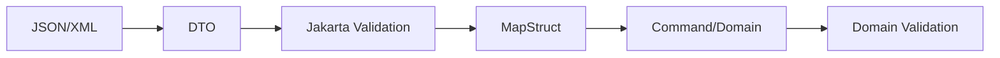

------
title: Learn Java Data Mapper, JSON/XML Processing & Validation - Part 029
description: Jakarta Bean Validation constraints deep dive: built-in constraints, constraint composition, custom constraints, cross-field validation, class-level invariants, violation paths, groups, and production error mapping.
series: learn-java-data-mapper-json-xml-validation
seriesTitle: Learn Java Data Mapper, JSON/XML Processing & Validation
order: 29
partTitle: Bean Constraints: Built-ins, Composition, Cross-Field Validation, Class-Level Invariants
tags:
- java
- jakarta-validation
- bean-validation
- hibernate-validator
- constraints
- custom-constraints
- class-level-validation
- data-contract
- validation
- dto
date: 2026-06-29
---

# Part 029 — Bean Constraints: Built-ins, Composition, Cross-Field Validation, Class-Level Invariants

> **Target skill:** mampu menggunakan Jakarta Validation constraints secara presisi: built-in constraints, constraint composition, custom validators, cross-field validation, class-level invariants, violation path, groups, dan production error mapping.

Part 028 membahas model Jakarta Validation: constraint annotation, `ConstraintValidator`, `ConstraintViolation`, groups, payload, dan path. Sekarang kita masuk ke constraint nyata.

Validation sering terlihat sederhana:

```java
@NotBlank String name
```

Tetapi production validation bukan sekadar menempel annotation. Kita harus tahu:

- constraint ini berlaku untuk null atau tidak?
- constraint ini property-level atau class-level?
- apakah rule ini syntax, semantic, business, atau authorization?
- apakah error path-nya benar untuk client?
- apakah rule ini berlaku untuk create, update, patch, atau response?
- apakah cross-field rule harus ada di DTO, command, atau domain?
- apakah custom constraint stateless dan thread-safe?
- apakah message-nya stabil dan localizable?

Mental model:

> **A constraint is a boundary rule. An invariant is a business truth. Do not confuse them.**

---

## 1. Kaufman Deconstruction

Subskill Part 029:

| Subskill | Kemampuan |
|---|---|
| Choose built-in constraint | Memilih `@NotNull`, `@NotBlank`, `@Size`, `@Pattern`, numeric/date/email constraints secara tepat |
| Understand null behavior | Tahu constraints mana mengizinkan null dan perlu dikombinasikan dengan `@NotNull` |
| Compose constraints | Membuat annotation gabungan yang reusable |
| Build custom constraint | Membuat annotation + `ConstraintValidator` |
| Cross-field validation | Memvalidasi relasi antar field pada class-level |
| Class-level invariant | Menentukan invariant object yang tidak cocok di satu field |
| Control violation path | Menaruh error ke property yang benar |
| Use groups | Memisahkan create/update/patch/step validation |
| Keep validation layered | Boundary validation vs domain invariant vs authorization |
| Test constraints | Valid/invalid/null/boundary/message/path tests |

---

## 2. Constraint Taxonomy

Tidak semua validation rule sama.

| Rule type | Example | Best layer |
|---|---|---|
| syntactic | email format, UUID format, date string parseable | request DTO / value object |
| structural | list not empty, field required | request DTO / schema |
| lexical | code uppercase, pattern | request DTO / adapter/value object |
| cross-field | `startDate <= endDate` | class-level DTO or command |
| semantic | currency supported for product | domain/application |
| referential | customer id exists | application/service |
| authorization | user can edit priority | application/security |
| workflow | cannot close already closed case | domain/use case |
| persistence | unique index | database/application |

Jakarta Validation cocok untuk object-level constraints. Jangan paksa semua business rule menjadi annotation.

---

## 3. Built-in Constraint: Requiredness

### 3.1 `@NotNull`

```java
public record CreatePaymentRequest(
    @NotNull MoneyRequest amount
) {}
```

Meaning: value must not be null.

It does not validate blank string, empty collection, or object internals.

```java
@NotNull String name // allows ""
```

### 3.2 `@NotEmpty`

Commonly used for strings, collections, maps, arrays.

```java
public record BulkImportRequest(
    @NotEmpty List<@Valid ImportRow> rows
) {}
```

Meaning: not null and size greater than zero.

For string, `"   "` is not empty. Use `@NotBlank` for human text.

### 3.3 `@NotBlank`

```java
public record CreateCustomerRequest(
    @NotBlank String fullName
) {}
```

Meaning: not null and contains at least one non-whitespace character.

Good for:

- name
- title
- code string where whitespace-only invalid
- description if mandatory
- request id

Not always appropriate for:

- password if spaces are valid by policy
- opaque token if whitespace is technically possible but unlikely
- binary/string encoded data where blank has special meaning

---

## 4. Size and Length Constraints

```java
public record CreateCaseRequest(
    @NotBlank
    @Size(max = 200)
    String title,

    @Size(max = 2000)
    String description
) {}
```

`@Size` works for supported types such as string, collection, map, array.

Important: `@Size(max = 200)` allows null unless combined with `@NotNull`/`@NotBlank`.

```java
@Size(max = 200)
String optionalDescription
```

This means:

- null allowed
- if present, length <= 200

That is often exactly what you want for optional fields.

---

## 5. Pattern Constraints

```java
public record CreateAccountRequest(
    @NotBlank
    @Pattern(regexp = "\\d{10,16}")
    String accountNumber
) {}
```

Use `@Pattern` for lexical format, not business meaning.

Good:

- account number digits
- country code format
- SKU pattern
- case id format
- phone number in a restricted internal format

Risky:

- full email policy using regex
- full international phone validation
- human name validation
- password strength solely as regex
- complex regulatory/business rule hidden as regex

Prefer value objects for important identifiers:

```java
public record AccountNumber(String value) {
    public AccountNumber {
        if (value == null || !value.matches("\\d{10,16}")) {
            throw new IllegalArgumentException("account number must be 10-16 digits");
        }
    }
}
```

Then validation can ensure request string is present before mapping.

---

## 6. Numeric Constraints

Common:

```java
@Min(1)
@Max(100)
int quantity;
```

```java
@DecimalMin(value = "0.01")
@Digits(integer = 18, fraction = 2)
BigDecimal amount;
```

Money example:

```java
public record MoneyRequest(
    @NotNull
    @DecimalMin(value = "0.01")
    @Digits(integer = 18, fraction = 2)
    BigDecimal amount,

    @NotBlank
    @Pattern(regexp = "[A-Z]{3}")
    String currency
) {}
```

But money validation is layered:

| Rule | Layer |
|---|---|
| amount present | DTO validation |
| amount decimal and scale | DTO/value object |
| currency code format | DTO validation |
| currency supported | domain/application |
| amount below daily limit | domain/application |
| amount allowed for user | authorization/risk |

---

## 7. Date/Time Constraints

Common:

```java
@Past
Instant birthDate;

@PastOrPresent
Instant reportedAt;

@Future
LocalDate appointmentDate;

@FutureOrPresent
LocalDate dueDate;
```

Be careful with clock/timezone.

For machine timestamp:

```java
public record EventRequest(
    @NotNull
    @PastOrPresent
    Instant occurredAt
) {}
```

For business date:

```java
public record ReportRequest(
    @NotNull
    LocalDate businessDate
) {}
```

Maybe `businessDate` can be future due to scheduled reports. Do not blindly add `@PastOrPresent`.

---

## 8. `@Email`

```java
public record RegisterUserRequest(
    @NotBlank
    @Email
    String email
) {}
```

`@Email` validates email-like syntax. It does not prove:

- mailbox exists
- domain accepts mail
- user owns address
- email is safe from fraud
- email can receive verification

For identity flow, use email verification.

---

## 9. Null Semantics of Built-ins

Many constraints treat null as valid. This allows optional fields with constraints when present.

Example:

```java
@Email
String optionalEmail
```

Meaning:

- null accepted
- non-null must look like email

Required email:

```java
@NotBlank
@Email
String email
```

This is deliberate design.

Rule:

> **Use requiredness constraint separately from format constraint.**

---

## 10. Container Element Constraints

```java
public record CreateTagsRequest(
    @NotEmpty
    List<@NotBlank @Size(max = 50) String> tags
) {}
```

This validates:

- list itself not null/empty
- each element not blank
- each element max length 50

Map example:

```java
public record AttributeRequest(
    Map<@NotBlank String, @NotBlank String> attributes
) {}
```

Nested DTO list:

```java
public record BulkPaymentRequest(
    @NotEmpty
    List<@Valid PaymentRequest> payments
) {}
```

Use container element constraints aggressively for boundary DTOs.

---

## 11. Cascaded Validation

```java
public record CreatePaymentRequest(
    @Valid
    @NotNull
    MoneyRequest amount,

    @Valid
    @NotNull
    PaymentMethodRequest method
) {}
```

`@Valid` means validate nested object graph.

Without `@Valid`, constraints inside `MoneyRequest` may not run.

For list:

```java
List<@Valid PaymentLineRequest> lines
```

This communicates element-level cascading clearly.

---

## 12. Constraint Composition

Reusable composed constraint:

```java
@Documented
@Constraint(validatedBy = {})
@Target({ ElementType.FIELD, ElementType.PARAMETER, ElementType.RECORD_COMPONENT })
@Retention(RetentionPolicy.RUNTIME)
@NotBlank
@Pattern(regexp = "CUS-\\d{3,}")
public @interface CustomerIdFormat {
    String message() default "customer id must match CUS-<digits>";
    Class<?>[] groups() default {};
    Class<? extends Payload>[] payload() default {};
}
```

Usage:

```java
public record CustomerRequest(
    @CustomerIdFormat String customerId
) {}
```

Composition is good when rule is truly reusable and purely syntactic/structural.

Do not create annotation for every one-off rule.

---

## 13. `@ReportAsSingleViolation`

Without it, composed constraint may report violations from composing constraints.

```java
@ReportAsSingleViolation
@NotBlank
@Pattern(regexp = "CUS-\\d{3,}")
public @interface CustomerIdFormat {
    String message() default "invalid customer id";
    Class<?>[] groups() default {};
    Class<? extends Payload>[] payload() default {};
}
```

Now the client can receive one stable message/code instead of internal composition details.

Use when:

- client should not see multiple low-level errors
- annotation represents one semantic constraint
- stable error contract matters

Avoid if client benefits from detailed sub-errors.

---

## 14. Custom Constraint Annotation

Example: ISO-4217 currency code.

```java
@Documented
@Constraint(validatedBy = CurrencyCodeValidator.class)
@Target({ ElementType.FIELD, ElementType.PARAMETER, ElementType.RECORD_COMPONENT })
@Retention(RetentionPolicy.RUNTIME)
public @interface CurrencyCode {
    String message() default "must be a valid ISO-4217 currency code";
    Class<?>[] groups() default {};
    Class<? extends Payload>[] payload() default {};
}
```

Validator:

```java
public final class CurrencyCodeValidator
    implements ConstraintValidator<CurrencyCode, String> {

    @Override
    public boolean isValid(String value, ConstraintValidatorContext context) {
        if (value == null) {
            return true; // combine with @NotBlank if required
        }

        try {
            Currency.getInstance(value);
            return true;
        } catch (IllegalArgumentException ex) {
            return false;
        }
    }
}
```

Usage:

```java
public record MoneyRequest(
    @NotNull BigDecimal amount,
    @NotBlank @CurrencyCode String currency
) {}
```

Null policy is deliberate: format constraint ignores null; requiredness is separate.

---

## 15. Custom Constraint Validator Rules

A `ConstraintValidator` should be:

- stateless or effectively immutable
- thread-safe
- deterministic
- side-effect free
- fast
- independent of request-specific mutable state
- free of database/network calls in most cases
- clear about null behavior

Avoid:

```java
public boolean isValid(String userId, ConstraintValidatorContext ctx) {
    return userRepository.exists(userId); // risky coupling
}
```

Existence check is often application-level validation, not bean validation.

Why?

- database call per field can be expensive
- validation becomes hard to test
- transaction/context issues
- race conditions still exist
- error semantics become unclear

---

## 16. Class-Level Constraint

Cross-field example: date range.

DTO:

```java
@ValidDateRange
public record SearchCaseRequest(
    @NotNull LocalDate fromDate,
    @NotNull LocalDate toDate
) {}
```

Annotation:

```java
@Documented
@Constraint(validatedBy = DateRangeValidator.class)
@Target({ ElementType.TYPE, ElementType.RECORD_COMPONENT })
@Retention(RetentionPolicy.RUNTIME)
public @interface ValidDateRange {
    String message() default "fromDate must be before or equal to toDate";
    Class<?>[] groups() default {};
    Class<? extends Payload>[] payload() default {};
}
```

Validator:

```java
public final class DateRangeValidator
    implements ConstraintValidator<ValidDateRange, SearchCaseRequest> {

    @Override
    public boolean isValid(SearchCaseRequest value, ConstraintValidatorContext context) {
        if (value == null) {
            return true;
        }
        if (value.fromDate() == null || value.toDate() == null) {
            return true; // let @NotNull report field-level errors
        }
        return !value.fromDate().isAfter(value.toDate());
    }
}
```

This produces class-level violation unless you customize path.

---

## 17. Custom Violation Path

For better client error, attach violation to `toDate`.

```java
public final class DateRangeValidator
    implements ConstraintValidator<ValidDateRange, SearchCaseRequest> {

    @Override
    public boolean isValid(SearchCaseRequest value, ConstraintValidatorContext context) {
        if (value == null || value.fromDate() == null || value.toDate() == null) {
            return true;
        }

        if (!value.fromDate().isAfter(value.toDate())) {
            return true;
        }

        context.disableDefaultConstraintViolation();
        context.buildConstraintViolationWithTemplate(
                "toDate must be on or after fromDate"
            )
            .addPropertyNode("toDate")
            .addConstraintViolation();

        return false;
    }
}
```

Now violation path is more useful:

```txt
toDate: toDate must be on or after fromDate
```

---

## 18. Class-Level Business-Like Constraint: Be Careful

Example:

```java
@ValidPaymentAmountForCurrency
public record MoneyRequest(BigDecimal amount, String currency) {}
```

This is okay if it checks scale/fraction digits.

But if it checks product limit, user risk, or merchant config, it belongs elsewhere.

Good class-level validation:

- `start <= end`
- if `type = CARD`, `cardToken` required
- money scale compatible with currency
- either email or phone required
- exactly one field among a set provided
- date range max 90 days

Bad class-level validation:

- customer exists
- user allowed to assign case
- account has sufficient balance
- transaction can be approved
- workflow transition allowed

---

## 19. Conditional Constraint

Example: either email or phone required.

```java
@EmailOrPhoneRequired
public record ContactRequest(
    @Email String email,
    @Pattern(regexp = "\\+?[0-9]{8,15}") String phone
) {}
```

Validator:

```java
public final class EmailOrPhoneRequiredValidator
    implements ConstraintValidator<EmailOrPhoneRequired, ContactRequest> {

    @Override
    public boolean isValid(ContactRequest value, ConstraintValidatorContext context) {
        if (value == null) {
            return true;
        }

        boolean hasEmail = value.email() != null && !value.email().isBlank();
        boolean hasPhone = value.phone() != null && !value.phone().isBlank();

        if (hasEmail || hasPhone) {
            return true;
        }

        context.disableDefaultConstraintViolation();
        context.buildConstraintViolationWithTemplate("email or phone is required")
            .addPropertyNode("email")
            .addConstraintViolation();
        context.buildConstraintViolationWithTemplate("email or phone is required")
            .addPropertyNode("phone")
            .addConstraintViolation();

        return false;
    }
}
```

This gives actionable field-level errors.

---

## 20. Polymorphic/Class-Level Constraint

For request:

```java
public record PaymentRequest(
    @NotBlank String methodType,
    String cardToken,
    String bankCode,
    String accountNumber
) {}
```

Constraint:

```java
@ValidPaymentMethodFields
public record PaymentRequest(...) {}
```

But better model is often polymorphic DTO:

```java
public sealed interface PaymentMethodRequest permits CardRequest, BankTransferRequest {}

public record CardRequest(@NotBlank String cardToken) implements PaymentMethodRequest {}

public record BankTransferRequest(
    @NotBlank String bankCode,
    @NotBlank String accountNumber
) implements PaymentMethodRequest {}
```

Then Jackson polymorphism + cascaded validation handles subtype-specific fields.

Class-level validation is not a substitute for better model shape.

---

## 21. Groups for Create vs Update

Groups:

```java
public interface Create {}
public interface Update {}
```

DTO:

```java
public record CustomerRequest(
    @NotBlank(groups = Create.class)
    String customerId,

    @NotBlank(groups = {Create.class, Update.class})
    String fullName,

    @Email(groups = {Create.class, Update.class})
    String email
) {}
```

Validate:

```java
validator.validate(request, Create.class);
validator.validate(request, Update.class);
```

Use groups sparingly. Too many groups make validation hard to understand.

Often better:

```java
CreateCustomerRequest
UpdateCustomerRequest
PatchCustomerRequest
```

Separate DTOs are clearer than complex group matrix.

---

## 22. Validation Groups vs DTO Split

| Situation | Prefer |
|---|---|
| create/update have very different fields | separate DTOs |
| same DTO with small requiredness difference | groups may be okay |
| public API contract clarity matters | separate DTOs |
| internal workflow steps | groups/group sequence may be okay |
| patch semantics | presence-aware DTO, not normal groups |
| many conditional rules | model redesign or class-level constraints |

Rule:

> **Groups are a precision tool. DTO split is often the readability tool.**

---

## 23. Constraint Messages

Annotation:

```java
@NotBlank(message = "full name is required")
String fullName
```

For production APIs, do not rely only on human message. Build structured error:

```json
{
  "field": "fullName",
  "code": "NOT_BLANK",
  "message": "full name is required"
}
```

Message is for humans. Code is for clients/support.

Possible code derivation:

- annotation simple name: `NotBlank`
- custom payload marker
- message key
- mapping table from constraint annotation to error code

---

## 24. Payload for Severity/Metadata

Payload can carry metadata.

```java
public final class Severity {
    public interface Error extends Payload {}
    public interface Warning extends Payload {}
}
```

Usage:

```java
@NotBlank(payload = Severity.Error.class)
String fullName
```

In many APIs, a separate error mapping system is clearer than payload-heavy annotation usage. But payload can help advanced frameworks.

---

## 25. Validation Error Mapping

```java
public record FieldError(
    String field,
    String code,
    String message,
    Object rejectedValue
) {}
```

Mapper:

```java
public FieldError toError(ConstraintViolation<?> violation) {
    return new FieldError(
        violation.getPropertyPath().toString(),
        violation.getConstraintDescriptor().getAnnotation().annotationType().getSimpleName(),
        violation.getMessage(),
        safeRejectedValue(violation.getInvalidValue())
    );
}
```

Redact:

```java
private Object safeRejectedValue(Object value) {
    if (value == null) {
        return null;
    }
    if (isSensitive(value)) {
        return "***";
    }
    return value;
}
```

Never echo secrets like password/token/card number.

---

## 26. Constraint Testing

### 26.1 Built-in Constraint Test

```java
@Test
void fullName_isRequired() {
    CreateCustomerRequest request = new CreateCustomerRequest("", "ana@example.com");

    Set<ConstraintViolation<CreateCustomerRequest>> violations = validator.validate(request);

    assertThat(violations)
        .extracting(v -> v.getPropertyPath().toString())
        .contains("fullName");
}
```

### 26.2 Custom Constraint Valid

```java
@Test
void currencyCode_acceptsValidIsoCode() {
    MoneyRequest request = new MoneyRequest(new BigDecimal("100.00"), "IDR");

    assertThat(validator.validate(request)).isEmpty();
}
```

### 26.3 Custom Constraint Invalid

```java
@Test
void currencyCode_rejectsInvalidCode() {
    MoneyRequest request = new MoneyRequest(new BigDecimal("100.00"), "XYZX");

    assertThat(validator.validate(request))
        .anyMatch(v -> v.getPropertyPath().toString().equals("currency"));
}
```

### 26.4 Class-Level Path

```java
@Test
void dateRange_reportsToDate() {
    SearchCaseRequest request = new SearchCaseRequest(
        LocalDate.of(2026, 6, 30),
        LocalDate.of(2026, 6, 29)
    );

    assertThat(validator.validate(request))
        .extracting(v -> v.getPropertyPath().toString())
        .contains("toDate");
}
```

---

## 27. Boundary Matrix Tests

For each important constraint, test:

| Case | Example |
|---|---|
| null | field omitted/null |
| blank | `""`, `"   "` |
| min boundary | length/number at min |
| max boundary | length/number at max |
| just below | invalid min |
| just above | invalid max |
| invalid format | pattern/email/currency |
| unicode | names/descriptions |
| malicious string | HTML/script if relevant |
| collection empty | list/map |
| invalid element | list element blank |
| cross-field invalid | date/order |

---

## 28. Validation and MapStruct Pipeline

Recommended:



Why validate before MapStruct?

- mapping may assume required field present
- custom converters may throw less friendly errors
- MapStruct may construct value objects from invalid data
- field-level errors are easier at DTO stage

But validate final aggregate too if mapping creates new invariant surface.

---

## 29. Anti-Patterns

### 29.1 `@NotNull` Where `@NotBlank` Needed

Allows empty user-facing string.

### 29.2 Regex as Business Engine

Complex regex hides policy and gives poor errors.

### 29.3 Database Lookup in ConstraintValidator

Can cause performance, transaction, and race issues.

### 29.4 Class-Level Constraint with Poor Path

Client sees object-level error and does not know which field to fix.

### 29.5 Groups Everywhere

Validation becomes unreadable. Split DTOs when cleaner.

### 29.6 Validation Replaces Domain Invariants

DTO validation cannot protect all domain state transitions.

### 29.7 Echoing Rejected Secret Values

Never return password/token/card values in errors.

---

## 30. Production Checklist

Before approving validation constraints:

- [ ] Is this rule syntactic, structural, cross-field, semantic, referential, or authorization?
- [ ] Is Jakarta Validation the right layer?
- [ ] Is requiredness separate from format?
- [ ] Is null behavior intentional?
- [ ] Are optional fields constrained when present?
- [ ] Are container elements constrained?
- [ ] Is `@Valid` applied to nested objects/elements?
- [ ] Are class-level violations mapped to useful property paths?
- [ ] Are groups truly needed, or would DTO split be clearer?
- [ ] Are custom validators stateless and deterministic?
- [ ] Are messages/code stable enough for API clients?
- [ ] Are rejected sensitive values redacted?
- [ ] Are boundary cases tested?
- [ ] Are domain invariants still enforced in domain/application layer?

---

## 31. Mini Case Study: Create Payment Validation

Request:

```java
@ValidPaymentWindow
public record CreatePaymentRequest(
    @NotBlank
    @Pattern(regexp = "REQ-[0-9]{8,}")
    String requestId,

    @Valid
    @NotNull
    MoneyRequest amount,

    @Valid
    @NotNull
    PaymentMethodRequest paymentMethod,

    @NotNull
    @FutureOrPresent
    Instant requestedExecutionTime
) {}
```

Money:

```java
public record MoneyRequest(
    @NotNull
    @DecimalMin("0.01")
    @Digits(integer = 18, fraction = 2)
    BigDecimal amount,

    @NotBlank
    @CurrencyCode
    String currency
) {}
```

Class-level window validator:

```java
public final class PaymentWindowValidator
    implements ConstraintValidator<ValidPaymentWindow, CreatePaymentRequest> {

    @Override
    public boolean isValid(CreatePaymentRequest value, ConstraintValidatorContext context) {
        if (value == null || value.requestedExecutionTime() == null) {
            return true;
        }

        Instant max = Instant.now().plus(Duration.ofDays(30));
        if (!value.requestedExecutionTime().isAfter(max)) {
            return true;
        }

        context.disableDefaultConstraintViolation();
        context.buildConstraintViolationWithTemplate(
                "requested execution time must be within 30 days"
            )
            .addPropertyNode("requestedExecutionTime")
            .addConstraintViolation();
        return false;
    }
}
```

Domain still checks:

- account status
- sufficient balance
- merchant limits
- risk decision
- duplicate request id
- payment method availability

---

## 32. Practice Drill

Design validation for:

```java
public record CreateCaseRequest(
    String caseId,
    String title,
    String priority,
    String reporterUserId,
    LocalDate incidentDate,
    LocalDate reportedDate,
    List<String> tags,
    Map<String, String> attributes
) {}
```

Requirements:

- caseId required, format `CASE-<digits>`
- title required, max 200
- priority one of LOW/MEDIUM/HIGH/CRITICAL
- reporterUserId required, format `USR-<digits>`
- incidentDate cannot be future
- reportedDate cannot be before incidentDate
- tags max 20, each not blank max 50
- attributes max 50 entries, key not blank max 40, value max 200

Tasks:

1. Add built-in constraints.
2. Create composed constraints for IDs.
3. Create class-level date constraint.
4. Add container element constraints.
5. Define validation error model.
6. Write tests for null, blank, max, invalid pattern, invalid date range.
7. Explain which rules remain domain/application rules.

---

## 33. Summary

Constraints are small, but their placement and semantics are architectural.

Mental model:

> **Use constraints to reject invalid object shape early; use domain logic to protect business truth always.**

Rules:

1. Separate requiredness from format.
2. Know which constraints allow null.
3. Use container element constraints for lists/maps/options.
4. Use `@Valid` for nested object graph validation.
5. Compose constraints for reusable syntactic rules.
6. Keep custom validators stateless, deterministic, and fast.
7. Use class-level constraints for cross-field object rules.
8. Put violation path where client can act.
9. Use groups sparingly; split DTOs when clearer.
10. Map violations to stable error codes and safe messages.
11. Redact rejected secret values.
12. Do not replace domain invariants with DTO validation.

Part berikutnya covers method validation, records, cascaded validation, container elements, and value extractors in deeper detail.

---

## References

- Jakarta Validation 3.1 Specification: https://jakarta.ee/specifications/bean-validation/3.1/jakarta-validation-spec-3.1.html
- Jakarta Validation 3.1 Release Page: https://jakarta.ee/specifications/bean-validation/3.1/
- Hibernate Validator Reference Guide: https://docs.jboss.org/hibernate/stable/validator/reference/en-US/html_single/
- Jakarta Validation Home: https://beanvalidation.org/
