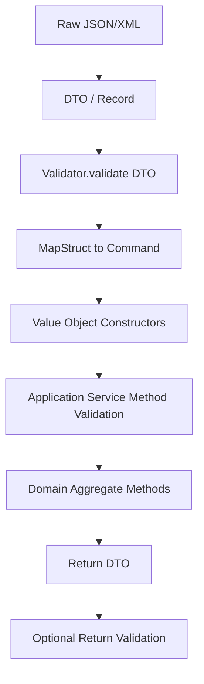
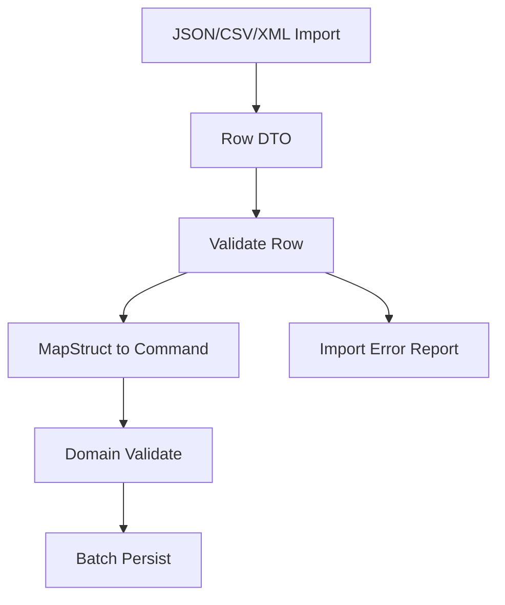

------
title: Learn Java Data Mapper, JSON/XML Processing & Validation - Part 030
description: Method validation, Java records, cascaded validation, container element constraints, Optional/List/Map validation, custom ValueExtractor, executable validation, and production integration.
series: learn-java-data-mapper-json-xml-validation
seriesTitle: Learn Java Data Mapper, JSON/XML Processing & Validation
order: 30
partTitle: Method Validation, Records, Cascaded Validation, Container Elements, Value Extractors
tags:
- java
- jakarta-validation
- bean-validation
- method-validation
- records
- cascaded-validation
- container-elements
- value-extractor
- hibernate-validator
- validation
date: 2026-06-29
---

# Part 030 — Method Validation, Records, Cascaded Validation, Container Elements, Value Extractors

> **Target skill:** mampu memakai Jakarta Validation di luar field sederhana: method/constructor validation, record components, cascaded object graphs, container element constraints, `Optional`/`List`/`Map`, custom containers, and `ValueExtractor`.

Validation tidak hanya bekerja pada JavaBean property. Jakarta Validation juga mendukung:

- object graph validation
- method parameter validation
- method return value validation
- constructor validation
- container element validation
- cascaded validation
- record validation clarification in Jakarta Validation 3.1
- custom value extraction for container-like types

Mental model:

> **Validation follows object graph and executable boundaries only when you explicitly mark what must be validated.**

---

## 1. Kaufman Deconstruction

Subskill Part 030:

| Subskill | Kemampuan |
|---|---|
| Validate records | Menaruh constraints di record components dengan benar |
| Cascade object graph | Menggunakan `@Valid` di nested object dan container element |
| Validate container elements | `List<@NotBlank String>`, `Map<@NotBlank String, @Valid X>` |
| Validate method parameters | Service/API boundary method validation |
| Validate return values | Menjamin output contract/internal postcondition |
| Validate constructors | Executable validation pada constructor |
| Use cross-parameter constraints | Validasi relasi antar parameter method |
| Understand value extraction | Bagaimana validation masuk ke `Optional`, containers, custom wrappers |
| Create ValueExtractor | Mendukung custom container type |
| Integrate with frameworks | Memahami proxy/interceptor requirement |
| Test executable validation | Menggunakan `ExecutableValidator` atau framework test |

---

## 2. Records and Validation

Records cocok untuk request/response DTO.

```java
public record CreateCustomerRequest(
    @NotBlank String fullName,
    @Email String email
) {}
```

Constraints diletakkan pada record components.

Validation:

```java
Set<ConstraintViolation<CreateCustomerRequest>> violations =
    validator.validate(request);
```

Record compact constructor can enforce invariants too:

```java
public record CustomerId(String value) {
    public CustomerId {
        if (value == null || !value.matches("CUS-\\d+")) {
            throw new IllegalArgumentException("invalid customer id");
        }
    }
}
```

Choose carefully:

| Rule | Good place |
|---|---|
| boundary requiredness | DTO constraint |
| value object invariant | record constructor/value object |
| cross-field request rule | class-level constraint |
| business lifecycle | domain/use case |

---

## 3. Cascaded Validation

Nested DTO:

```java
public record CreatePaymentRequest(
    @Valid
    @NotNull
    MoneyRequest amount,

    @Valid
    @NotNull
    PaymentMethodRequest method
) {}
```

Money:

```java
public record MoneyRequest(
    @NotNull
    @DecimalMin("0.01")
    BigDecimal amount,

    @NotBlank
    @Pattern(regexp = "[A-Z]{3}")
    String currency
) {}
```

Without `@Valid`, nested constraints may not run.

Rule:

> **`@NotNull` checks that nested object exists. `@Valid` checks inside it. Use both when required.**

---

## 4. Cascaded Collection Elements

```java
public record BulkPaymentRequest(
    @NotEmpty
    List<@Valid PaymentRequest> payments
) {}
```

This validates each payment element.

If element itself must not be null:

```java
List<@NotNull @Valid PaymentRequest> payments
```

If the list can be null but elements must be valid when present:

```java
List<@Valid PaymentRequest> payments
```

Use explicit requiredness for container and element separately.

---

## 5. Container Element Constraints

String list:

```java
public record TagRequest(
    @Size(max = 20)
    List<@NotBlank @Size(max = 50) String> tags
) {}
```

Meaning:

- list may be null unless `@NotNull`/`@NotEmpty`
- if present, list size max 20
- each element must not be blank
- each element size max 50

Map:

```java
public record AttributeRequest(
    @Size(max = 50)
    Map<@NotBlank @Size(max = 40) String,
        @Size(max = 200) String> attributes
) {}
```

This is powerful for dynamic metadata.

---

## 6. Nested Container Example

```java
public record CaseImportRequest(
    @NotEmpty
    Map<@NotBlank String,
        List<@Valid @NotNull CaseEventRequest>> eventsByCaseId
) {}
```

This validates:

- map not empty
- each key not blank
- each list value's element validated
- each event not null

But readability can suffer. For very complex structures, define named DTOs.

---

## 7. Optional Validation

Example:

```java
public record CustomerRequest(
    Optional<@Email String> email
) {}
```

This can work with provider support and value extraction, but `Optional` as DTO field is often controversial.

Better for API DTO:

```java
public record CustomerRequest(
    @Email String email
) {}
```

Null means absent/optional unless request contract says required.

For patch, use presence-aware type, not `Optional` alone.

```java
public record CustomerPatchRequest(
    PatchField<String> email
) {}
```

---

## 8. Container Requiredness Matrix

```java
@NotEmpty List<@NotBlank String> tags
```

| Input | Valid? |
|---|---|
| `tags = null` | no |
| `tags = []` | no |
| `tags = [null]` | no because element `@NotBlank` |
| `tags = [""]` | no |
| `tags = ["risk"]` | yes |

```java
@Size(max = 20) List<@NotBlank String> tags
```

| Input | Valid? |
|---|---|
| `tags = null` | yes |
| `tags = []` | yes |
| `tags = [""]` | no |
| `tags` size 21 | no |

This explicit matrix prevents accidental semantics.

---

## 9. Method Validation

Jakarta Validation supports method parameter and return value validation.

Service:

```java
public class PaymentService {

    public PaymentReceipt createPayment(
        @Valid @NotNull CreatePaymentCommand command
    ) {
        // use case
    }
}
```

Return value:

```java
@NotNull
@Valid
public PaymentReceipt createPayment(@Valid @NotNull CreatePaymentCommand command) {
    // ...
}
```

In frameworks, method validation usually requires proxy/interceptor configuration. Direct self-invocation may not trigger validation depending framework.

---

## 10. ExecutableValidator

Programmatic method validation:

```java
ExecutableValidator executableValidator =
    validator.forExecutables();

Method method = PaymentService.class.getMethod(
    "createPayment",
    CreatePaymentCommand.class
);

Object[] parameterValues = { command };

Set<ConstraintViolation<PaymentService>> violations =
    executableValidator.validateParameters(
        paymentService,
        method,
        parameterValues
    );
```

Return value:

```java
Set<ConstraintViolation<PaymentService>> returnViolations =
    executableValidator.validateReturnValue(
        paymentService,
        method,
        receipt
    );
```

This is useful for testing or custom frameworks. Most apps rely on framework integration.

---

## 11. Constructor Validation

Constructor parameters can be validated using executable validation.

```java
public class MoneyCommand {
    public MoneyCommand(
        @NotNull @DecimalMin("0.01") BigDecimal amount,
        @NotBlank String currency
    ) {
        // ...
    }
}
```

Programmatic constructor validation:

```java
Constructor<MoneyCommand> constructor =
    MoneyCommand.class.getConstructor(BigDecimal.class, String.class);

Set<ConstraintViolation<MoneyCommand>> violations =
    executableValidator.validateConstructorParameters(
        constructor,
        new Object[] { amount, currency }
    );
```

In practice, value objects often use constructor invariants directly. Executable validation is more common at framework/service boundaries.

---

## 12. Cross-Parameter Constraint

Method:

```java
@ValidDateRangeParameters
public List<CaseDto> searchCases(LocalDate fromDate, LocalDate toDate) {
    // ...
}
```

Annotation targets method/constructor:

```java
@Documented
@Constraint(validatedBy = DateRangeParametersValidator.class)
@Target({ ElementType.METHOD, ElementType.CONSTRUCTOR })
@Retention(RetentionPolicy.RUNTIME)
public @interface ValidDateRangeParameters {
    String message() default "fromDate must be before or equal to toDate";
    Class<?>[] groups() default {};
    Class<? extends Payload>[] payload() default {};
}
```

Validator:

```java
@SupportedValidationTarget(ValidationTarget.PARAMETERS)
public final class DateRangeParametersValidator
    implements ConstraintValidator<ValidDateRangeParameters, Object[]> {

    @Override
    public boolean isValid(Object[] value, ConstraintValidatorContext context) {
        if (value == null || value.length < 2) {
            return true;
        }

        LocalDate from = (LocalDate) value[0];
        LocalDate to = (LocalDate) value[1];

        if (from == null || to == null) {
            return true;
        }

        return !from.isAfter(to);
    }
}
```

Prefer request object with class-level constraint when API readability matters:

```java
public record SearchCasesRequest(LocalDate fromDate, LocalDate toDate) {}
```

---

## 13. Method Validation Placement

Use method validation for:

- service boundary commands
- public application service APIs
- internal library preconditions
- return value postconditions
- framework controller/service validation

Avoid using it as only defense for domain invariants.

Domain methods should still enforce critical invariants:

```java
caseAggregate.assignTo(userId);
```

should check whether assignment is allowed, not rely only on method annotation elsewhere.

---

## 14. Return Value Validation

```java
public class CustomerQueryService {

    @NotNull
    @Valid
    public CustomerResponse getCustomer(@NotBlank String customerId) {
        // ...
    }
}
```

Return validation can catch internal bugs:

- method promised non-null but returned null
- response DTO violates constraints
- mapper produced invalid output

But do not expose internal validation exception raw to clients. Map it to server error or internal alert depending context.

---

## 15. Cascaded Return Values

```java
@Valid
public List<@Valid CustomerResponse> searchCustomers(SearchRequest request) {
    // ...
}
```

This can be expensive for large results.

Use selectively:

| Scenario | Return validation? |
|---|---|
| small command output | useful |
| large search result | often too expensive |
| critical regulated export | useful in batch/QA mode |
| internal hot path | measure first |

---

## 16. Group Conversion

When validating nested object, you may need different group.

```java
public interface ApiCreate {}
public interface DomainCheck {}
```

```java
public record CreateOrderRequest(
    @Valid
    @ConvertGroup(from = ApiCreate.class, to = DomainCheck.class)
    CustomerRequest customer
) {}
```

Group conversion helps avoid leaking parent validation groups into nested objects incorrectly.

Use with care. Complex group conversion can become hard to reason about.

---

## 17. Custom Container Type

Suppose we have:

```java
public final class PatchField<T> {
    private final boolean present;
    private final T value;

    public boolean isPresent() { return present; }
    public T value() { return value; }
}
```

We want:

```java
PatchField<@Email String> email
```

For validation engine to validate contained value, it needs a `ValueExtractor` for `PatchField<T>`.

---

## 18. ValueExtractor Concept

A `ValueExtractor` tells validation engine how to extract values from a container.

Built-in extractors exist for common containers such as collections/maps/optional-like types depending provider/spec support.

Custom extractor:

```java
public final class PatchFieldValueExtractor
    implements ValueExtractor<PatchField<@ExtractedValue ?>> {

    @Override
    public void extractValues(
        PatchField<?> originalValue,
        ValueReceiver receiver
    ) {
        if (originalValue == null || !originalValue.isPresent()) {
            return;
        }

        receiver.value("value", originalValue.value());
    }
}
```

Then register with validator factory/provider configuration.

---

## 19. PatchField Validation Semantics

What should validation do for patch field?

```java
public record CustomerPatchRequest(
    PatchField<@Email String> email
) {}
```

Possible policy:

| PatchField state | Validate contained value? |
|---|---|
| absent | no |
| present null | maybe yes/no depending constraint |
| present value | yes |

If null means clear, `@Email` should not reject null. But if field cannot be cleared, add custom patch-level rule.

For patch, custom validation may be clearer than generic value extraction.

---

## 20. Map Container Path

Map validation path can identify key/value.

Example:

```java
Map<@NotBlank String, @NotBlank String> attributes
```

Violation path may indicate map key or value container element. Your API error mapper should convert this into understandable path.

Possible output:

```json
{
  "field": "attributes[riskSegment]",
  "code": "NotBlank",
  "message": "must not be blank"
}
```

For user-facing APIs, build path normalization.

---

## 21. Validation of Large Object Graphs

Cascaded validation can traverse large graphs.

Risks:

- performance cost
- accidental lazy loading
- deep cycles
- huge violation sets
- exposing internal graph paths

Use DTOs for boundary validation, not JPA entities with huge graph.

For domain aggregate, validate intentionally.

Avoid:

```java
validator.validate(hugeJpaEntityGraph);
```

unless you know exactly what is loaded/traversed.

---

## 22. Cycles in Object Graph

Validation providers handle object graph traversal with cycle prevention semantics, but you should not rely on validation over arbitrary cyclic domain graphs for boundary checks.

Prefer:

- boundary DTOs without cycles
- projection DTOs
- aggregate-level validation methods
- explicit validation scope

---

## 23. Framework Integration Notes

In web frameworks, request body validation often works via:

```java
public Response create(@Valid @RequestBody CreateRequest request) {}
```

Method validation may require:

- validation provider on classpath
- method validation post-processor/interceptor
- proxied bean
- public method through proxy
- annotations on implementation/interface depending framework

Common pitfall:

```java
this.someValidatedMethod(invalidArg);
```

Self-invocation may bypass proxy-based method validation.

Test actual framework path, not only unit-level `Validator`.

---

## 24. Controller vs Service Validation

Controller request validation:

- catches malformed client input
- maps to 400 Bad Request
- field-level errors

Service method validation:

- protects application service API
- catches internal caller errors
- useful in modular monolith/library boundaries

Domain validation:

- protects business invariants
- should not depend on framework validation being invoked

Layer them intentionally.

---

## 25. Executable Validation Error Mapping

Method parameter violation path can look like:

```txt
createPayment.command.amount.amount
```

or include parameter names depending runtime/compiler configuration.

To produce good API errors, controller-level DTO validation often gives cleaner paths than method validation on many individual params.

Prefer:

```java
createPayment(@Valid CreatePaymentRequest request)
```

over:

```java
createPayment(@NotBlank String id, @NotNull BigDecimal amount, @NotBlank String currency)
```

for public endpoints.

---

## 26. Validation and Records: Constructor Invariants

Records can enforce invariants in compact constructor:

```java
public record DateRange(LocalDate from, LocalDate to) {
    public DateRange {
        if (from == null || to == null) {
            throw new IllegalArgumentException("dates are required");
        }
        if (from.isAfter(to)) {
            throw new IllegalArgumentException("from must be <= to");
        }
    }
}
```

This is stronger than annotation-only validation because invalid value object cannot exist.

Use annotations for boundary DTO.
Use constructor invariant for core value object.

---

## 27. Validation in Mapping Pipeline



Do not rely on only one layer.

For critical systems:

- boundary DTO rejects bad shape
- value objects reject impossible values
- domain aggregate rejects invalid transitions
- persistence/database enforces uniqueness/constraints

---

## 28. Testing Method Validation

### 28.1 Programmatic

```java
@Test
void methodValidation_rejectsNullCommand() throws Exception {
    ExecutableValidator executableValidator = validator.forExecutables();
    Method method = PaymentService.class.getMethod(
        "createPayment",
        CreatePaymentCommand.class
    );

    Set<ConstraintViolation<PaymentService>> violations =
        executableValidator.validateParameters(
            paymentService,
            method,
            new Object[] { null }
        );

    assertThat(violations).isNotEmpty();
}
```

### 28.2 Framework Integration

```java
@Test
void controller_rejectsInvalidRequest() throws Exception {
    mockMvc.perform(post("/payments")
        .contentType(MediaType.APPLICATION_JSON)
        .content("""
        { "amount": null }
        """))
        .andExpect(status().isBadRequest())
        .andExpect(jsonPath("$.errors[0].field").exists());
}
```

### 28.3 Container Element

```java
@Test
void tags_rejectBlankElement() {
    TagRequest request = new TagRequest(List.of("valid", ""));

    assertThat(validator.validate(request))
        .anyMatch(v -> v.getPropertyPath().toString().contains("tags"));
}
```

---

## 29. ValueExtractor Test

For custom container:

```java
@Test
void patchField_validatesPresentValue() {
    CustomerPatchRequest request = new CustomerPatchRequest(
        PatchField.present("not-an-email")
    );

    Set<ConstraintViolation<CustomerPatchRequest>> violations =
        validator.validate(request);

    assertThat(violations).isNotEmpty();
}
```

Also test absent:

```java
@Test
void patchField_absentDoesNotValidateValue() {
    CustomerPatchRequest request = new CustomerPatchRequest(PatchField.absent());

    assertThat(validator.validate(request)).isEmpty();
}
```

---

## 30. Performance and Fail-Fast

Cascaded validation can produce many violations.

For user-facing forms/imports, collect-all is useful.
For internal hot path, fail-fast may be better.

Hibernate Validator supports fail-fast configuration as provider feature.

Design choice:

| Mode | Use case |
|---|---|
| collect all | API request, import feedback, UI form |
| fail fast | hot internal path, defensive programming, expensive graph |
| capped errors | large batch import |

For batch imports, often cap errors at 100/1000 to avoid huge response.

---

## 31. Anti-Patterns

### 31.1 Missing `@Valid` on Nested DTO

Nested constraints silently do not run.

### 31.2 Container Constraint on Collection But Not Elements

```java
@NotEmpty List<String> tags
```

does not reject blank tag elements.

### 31.3 Validating Huge Entity Graphs

Boundary validation should use DTOs/projections.

### 31.4 Method Validation Assumed but Proxy Missing

Framework method validation might not run.

### 31.5 `Optional` Fields for Patch

Optional does not fully model absent/null/clear semantics.

### 31.6 Custom ValueExtractor Without Clear Semantics

Extraction policy defines what gets validated. Document it.

### 31.7 Return Validation on Large Result by Default

Can be expensive; use intentionally.

---

## 32. Production Checklist

Before approving advanced validation:

- [ ] Are record component constraints placed correctly?
- [ ] Are nested objects annotated with `@Valid`?
- [ ] Are container elements constrained?
- [ ] Are container and element requiredness separate?
- [ ] Are map key/value constraints explicit?
- [ ] Are method validations actually triggered by framework/proxy?
- [ ] Are return validations used only where cost is acceptable?
- [ ] Are constructor/value object invariants still enforced?
- [ ] Are cross-parameter constraints needed, or would request object be clearer?
- [ ] Are groups/group conversions understandable?
- [ ] Are custom value extractors tested for absent/null/value?
- [ ] Are validation paths normalized for API errors?
- [ ] Is large graph validation bounded or avoided?
- [ ] Are error counts capped where needed?

---

## 33. Mini Case Study: Bulk Case Import

Request:

```java
public record BulkCaseImportRequest(
    @NotEmpty
    List<@Valid @NotNull CaseImportRow> rows
) {}
```

Row:

```java
@ValidIncidentReportedDate
public record CaseImportRow(
    @NotBlank
    @Pattern(regexp = "CASE-[0-9]+")
    String caseId,

    @NotBlank
    @Size(max = 200)
    String title,

    @NotNull
    Priority priority,

    @NotNull
    @PastOrPresent
    LocalDate incidentDate,

    @NotNull
    @PastOrPresent
    LocalDate reportedDate,

    @Size(max = 20)
    List<@NotBlank @Size(max = 50) String> tags,

    @Size(max = 50)
    Map<@NotBlank @Size(max = 40) String,
        @Size(max = 200) String> attributes
) {}
```

Class-level validator checks `reportedDate >= incidentDate` and reports path `reportedDate`.

Batch pipeline:



For 1 million rows, validate per row and cap errors. Do not build one huge object graph if streaming is possible.

---

## 34. Practice Drill

Implement validation for:

```java
public record CreateWorkflowRequest(
    @NotBlank String workflowId,
    @NotEmpty List<@Valid StepRequest> steps,
    Map<String, String> metadata
) {}

public record StepRequest(
    @NotBlank String stepId,
    @NotBlank String type,
    List<String> dependsOn
) {}
```

Requirements:

- `steps` not empty
- every step id not blank and unique
- dependency ids must refer to existing step ids
- metadata max 20 entries, key max 40, value max 200
- method `createWorkflow(@Valid CreateWorkflowRequest request)` should reject invalid request

Tasks:

1. Add container element constraints.
2. Create class-level constraint for unique step ids/dependencies.
3. Put violations on `steps` or specific path as best effort.
4. Test nested validation.
5. Test method validation programmatically or via framework.
6. Explain which rule belongs to domain workflow engine instead.

---

## 35. Summary

Advanced validation is about explicit traversal and executable boundaries.

Mental model:

> **Validation happens where you ask it to happen, and only as deep as you mark it to go.**

Rules:

1. Put constraints on record components for DTO records.
2. Use `@Valid` for nested objects and container elements.
3. Validate container and element requiredness separately.
4. Use container element constraints for lists/maps/optionals.
5. Prefer request objects over many method params for public APIs.
6. Method validation needs framework/proxy/interceptor support.
7. Return value validation is useful but can be expensive.
8. Use group conversion sparingly.
9. Use `ValueExtractor` for custom containers only when semantics are clear.
10. Avoid validating huge entity graphs accidentally.
11. Test absent/null/value/container/nested paths.
12. Keep domain invariants in domain objects/use cases.

Part berikutnya covers Hibernate Validator in production: message interpolation, locale, clock provider, fail-fast, programmatic mapping, provider-specific constraints, and operational configuration.

---

## References

- Jakarta Validation 3.1 Specification: https://jakarta.ee/specifications/bean-validation/3.1/jakarta-validation-spec-3.1.html
- Jakarta Validation 3.1 Release Page: https://jakarta.ee/specifications/bean-validation/3.1/
- Hibernate Validator Reference Guide: https://docs.jboss.org/hibernate/stable/validator/reference/en-US/html_single/
- Jakarta Validation Home: https://beanvalidation.org/
