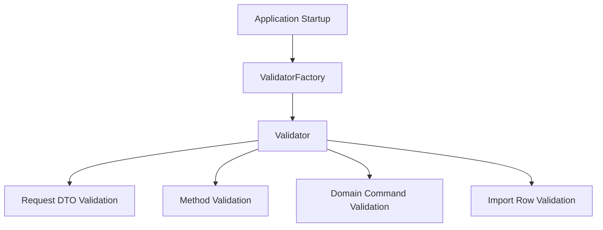

------
title: Learn Java Data Mapper, JSON/XML Processing & Validation - Part 031
description: Hibernate Validator in production: message interpolation, locale, clock provider, fail fast, programmatic mapping, custom constraints, dependency injection, metadata, performance, observability, and error contract design.
series: learn-java-data-mapper-json-xml-validation
seriesTitle: Learn Java Data Mapper, JSON/XML Processing & Validation
order: 31
partTitle: Hibernate Validator in Production: Message Interpolation, Locale, Clock, Fail Fast, Programmatic Mapping
tags:
- java
- jakarta-validation
- hibernate-validator
- validation
- message-interpolation
- locale
- clock-provider
- fail-fast
- programmatic-mapping
date: 2026-06-29
---

# Part 031 — Hibernate Validator in Production: Message Interpolation, Locale, Clock, Fail Fast, Programmatic Mapping

> **Target skill:** mampu menjalankan Jakarta Validation dengan Hibernate Validator secara production-grade: pesan error stabil, i18n terkendali, clock deterministic, fail-fast sesuai kebutuhan, programmatic constraints, observability, dan integration policy yang tidak bocor ke domain.

Hibernate Validator adalah implementasi populer dari Jakarta Validation. Di part sebelumnya kita membahas constraint model, built-in constraints, custom constraints, method validation, records, cascades, container elements, dan value extractors. Sekarang fokusnya bergeser ke production operation.

Hal yang sering salah di production:

- pesan validasi raw langsung dibocorkan ke API
- locale memakai default JVM tanpa sadar
- validasi date/time tidak deterministic karena clock tidak dikontrol
- fail-fast dinyalakan hanya untuk “lebih cepat” tanpa melihat UX error
- constraint programmatic dipakai untuk business rule yang seharusnya domain rule
- custom validator memanggil database/external service
- error path tidak bisa dipakai client
- validation groups menjadi spaghetti
- framework auto-configuration berbeda dari test setup

Mental model:

> **Validation is a boundary quality gate. Hibernate Validator is the engine; your platform still owns error contract, locale, clock, grouping, and observability.**

---

## 1. Kaufman Deconstruction

Subskill production Hibernate Validator:

| Subskill | Kemampuan |
|---|---|
| Bootstrap validator | Membuat `ValidatorFactory`/`Validator` dengan config eksplisit |
| Message interpolation | Mengontrol message template, bundle, EL, dan parameter interpolation |
| Locale control | Menentukan locale per request/user/tenant, bukan default JVM sembarang |
| Clock provider | Membuat validation time deterministic untuk `@Past`, `@Future`, etc. |
| Fail fast | Memilih collect-all vs first-violation sesuai use case |
| Programmatic mapping | Mendefinisikan constraint tanpa annotation saat model tidak bisa diubah |
| ConstraintValidatorFactory | Mengintegrasikan DI dengan aman |
| Traversable resolver | Mengontrol graph traversal bila persistence/lazy loading relevan |
| Metadata API | Mengetahui constraints untuk docs/forms/tooling |
| Error normalization | Mengubah violation menjadi stable API error |
| Performance | Menghindari validasi graph berlebihan |
| Observability | Metrik error code/path/group/source |

---

## 2. Baseline Bootstrap

Plain Java bootstrap:

```java
ValidatorFactory factory = Validation.buildDefaultValidatorFactory();
Validator validator = factory.getValidator();
```

Production bootstrap sebaiknya eksplisit ketika behavior penting:

```java
ValidatorFactory factory = Validation.byProvider(HibernateValidator.class)
    .configure()
    .failFast(false)
    .clockProvider(new SystemClockProvider())
    .buildValidatorFactory();

Validator validator = factory.getValidator();
```

`ValidatorFactory` biasanya dibuat sekali dan direuse. `Validator` juga thread-safe pada penggunaan normal. Jangan membuat factory per request.

Architecture:



---

## 3. Message Interpolation Mental Model

Constraint:

```java
@NotBlank(message = "{customer.fullName.required}")
private String fullName;
```

Resource bundle:

```properties
customer.fullName.required=Full name is required.
```

Violation message:

```txt
Full name is required.
```

Message interpolation resolves templates into human-facing text. But in production API, the human-facing text should not be your only error contract.

Better error model:

```json
{
  "code": "VALIDATION_FAILED",
  "errors": [
    {
      "field": "fullName",
      "constraint": "NotBlank",
      "message": "Full name is required.",
      "messageKey": "customer.fullName.required"
    }
  ]
}
```

Why keep `messageKey`/constraint code?

- client can localize itself
- analytics can group errors independent of language
- support can search stable key
- message wording can change without breaking machine contract
- frontend can map field-specific messages

---

## 4. Message Template Convention

Use keys, not hardcoded sentences, for reusable constraints.

Good:

```java
@NotBlank(message = "{case.title.required}")
@Size(max = 200, message = "{case.title.size}")
private String title;
```

Bundle:

```properties
case.title.required=Case title is required.
case.title.size=Case title must be at most {max} characters.
```

Bad:

```java
@NotBlank(message = "Case title is required")
```

Hardcoded text is acceptable for internal tests, but not ideal for internationalized/public APIs.

---

## 5. Constraint Attribute Interpolation

Constraint:

```java
@Size(min = 3, max = 64, message = "{username.size}")
private String username;
```

Bundle:

```properties
username.size=Username must be between {min} and {max} characters.
```

`{min}` and `{max}` come from constraint attributes.

Use this for:

- min/max length
- numeric boundaries
- regex description
- allowed scale/precision
- collection size

Do not expose raw regex to user unless it is meant for developers.

---

## 6. Locale Control

Default interpolation can use JVM default locale if no locale is explicitly supplied. In multi-user services, JVM default is rarely correct.

Sources of locale:

| Source | Example |
|---|---|
| `Accept-Language` header | `id-ID`, `en-US` |
| user profile | preferred language |
| tenant setting | tenant default locale |
| API parameter | `?locale=id-ID` |
| system default | fallback only |

Design:


In many frameworks, locale integration is handled by framework adapters. Still, test it.

Example policy:

```txt
API error response includes stable machine code and localized message.
Locale is resolved from Accept-Language, then user profile, then tenant default, then en-US.
```

---

## 7. Do Not Over-Couple API Contract to Localized Message

Bad client behavior:

```js
if (error.message === "Full name is required.") {
  highlightFullName();
}
```

Good client behavior:

```js
if (error.errors.some(e => e.field === "fullName" && e.constraint === "NotBlank")) {
  highlightFullName();
}
```

Message is for humans. Code/path/constraint are for machines.

---

## 8. Clock Provider

Time-based constraints:

```java
@Future
private Instant scheduledAt;

@PastOrPresent
private LocalDate businessDate;
```

These depend on “now”. In production and tests, “now” must be explicit enough.

Custom clock provider:

```java
public final class FixedClockProvider implements ClockProvider {
    private final Clock clock;

    public FixedClockProvider(Clock clock) {
        this.clock = clock;
    }

    @Override
    public Clock getClock() {
        return clock;
    }
}
```

Bootstrap:

```java
ValidatorFactory factory = Validation.byProvider(HibernateValidator.class)
    .configure()
    .clockProvider(new FixedClockProvider(
        Clock.fixed(Instant.parse("2026-06-29T03:00:00Z"), ZoneOffset.UTC)
    ))
    .buildValidatorFactory();
```

Production:

```java
public final class SystemClockProvider implements ClockProvider {
    @Override
    public Clock getClock() {
        return Clock.systemUTC();
    }
}
```

Testing time constraints without fixed clock is flaky.

---

## 9. Timezone Policy

`Instant` is absolute. `LocalDate` is calendar/date without timezone. `LocalDateTime` is local date-time without offset.

For validation:

| Type | Clock concern |
|---|---|
| `Instant` | compare against clock instant |
| `OffsetDateTime` | compare instant/offset semantics |
| `LocalDate` | current date depends on clock zone |
| `LocalDateTime` | ambiguous without zone |

If validating `LocalDate` like “must not be before today”, zone matters. Define whether “today” is UTC, tenant zone, business zone, or user zone.

Do not let server default timezone decide business date validation accidentally.

---

## 10. Fail Fast vs Collect All

Hibernate Validator supports fail-fast mode: validation stops at the first constraint violation.

Collect-all mode:

```java
ValidatorFactory factory = Validation.byProvider(HibernateValidator.class)
    .configure()
    .failFast(false)
    .buildValidatorFactory();
```

Fail-fast mode:

```java
ValidatorFactory factory = Validation.byProvider(HibernateValidator.class)
    .configure()
    .failFast(true)
    .buildValidatorFactory();
```

Decision:

| Use Case | Recommended |
|---|---|
| public API form submission | collect all useful field errors |
| bulk import row validation | collect limited errors per row/file |
| large object graph quick check | fail fast may be useful |
| internal invariant assertion | fail fast can be okay |
| user-facing onboarding | collect all |
| security-sensitive rejection | fail fast may reduce work, but be careful with side-channel concerns |

Fail-fast is not “better”. It changes UX and diagnostics.

---

## 11. Error Ordering

Do not rely on constraint violation set ordering.

If API needs stable order, sort errors:

```java
List<ApiFieldError> errors = violations.stream()
    .map(ApiFieldError::from)
    .sorted(
        Comparator.comparing(ApiFieldError::field, Comparator.nullsLast(String::compareTo))
            .thenComparing(ApiFieldError::constraint)
    )
    .toList();
```

Stable order helps:

- snapshot tests
- frontend display
- deterministic logs
- support reproducibility

---

## 12. Programmatic Constraint Mapping

Sometimes annotation is not possible:

- class from third-party library
- generated class should not be modified
- constraints depend on module/profile
- XML/DTO class generated from schema
- shared model should not depend on Jakarta Validation

Hibernate Validator supports programmatic constraint mapping.

Conceptual example:

```java
HibernateValidatorConfiguration configuration = Validation
    .byProvider(HibernateValidator.class)
    .configure();

ConstraintMapping mapping = configuration.createConstraintMapping();

mapping.type(CustomerDto.class)
    .property("fullName", ElementType.FIELD)
        .constraint(new NotBlankDef().message("{customer.fullName.required}"))
    .property("email", ElementType.FIELD)
        .constraint(new EmailDef().message("{customer.email.invalid}"));

ValidatorFactory factory = configuration
    .addMapping(mapping)
    .buildValidatorFactory();
```

Use programmatic mapping for boundary/profile rules. Do not hide complex business policy there.

---

## 13. Programmatic Mapping Governance

Programmatic constraints are less visible than annotations. Govern them.

Rules:

- centralize mapping configuration
- name modules clearly
- test metadata and violations
- document which profile uses which mapping
- avoid duplicate/conflicting constraints
- avoid runtime mutation after factory creation
- avoid tenant-specific dynamic factory creation per request unless heavily cached and justified

Example structure:

```txt
validation/
  ApiValidationConfig.java
  ProviderValidationConfig.java
  GeneratedXmlValidationConfig.java
  ValidationProfiles.java
```

---

## 14. ConstraintValidatorFactory and DI

Custom validator:

```java
public final class ValidCurrencyValidator
    implements ConstraintValidator<ValidCurrency, String> {

    private final CurrencyCatalog catalog;

    public ValidCurrencyValidator(CurrencyCatalog catalog) {
        this.catalog = catalog;
    }

    @Override
    public boolean isValid(String value, ConstraintValidatorContext context) {
        if (value == null) {
            return true;
        }
        return catalog.isSupported(value);
    }
}
```

DI integration depends on framework.

Caution:

- validator should be deterministic
- avoid slow network/database calls
- injected dependency should be safe/cache-backed
- validator instances may be reused
- do not store per-request mutable state in validator fields
- avoid user-specific authorization checks in constraint validator

If rule requires request actor/tenant/time-sensitive service call, it may belong in application/domain validation, not Jakarta Validation constraint.

---

## 15. Custom Validator State

Bad:

```java
public final class BadValidator implements ConstraintValidator<ValidX, String> {
    private List<String> errors = new ArrayList<>();
}
```

Good:

```java
public final class GoodValidator implements ConstraintValidator<ValidX, String> {
    @Override
    public boolean isValid(String value, ConstraintValidatorContext context) {
        List<String> localErrors = new ArrayList<>();
        // local only
        return localErrors.isEmpty();
    }
}
```

Constraint validators should be stateless or safely immutable after initialization.

---

## 16. Custom Constraint Error Path

Class-level validator can add property-specific violation.

```java
context.disableDefaultConstraintViolation();
context.buildConstraintViolationWithTemplate("{dateRange.invalid}")
    .addPropertyNode("endDate")
    .addConstraintViolation();
```

This produces error at `endDate`, not just object-level.

Use precise paths for better API errors.

---

## 17. Payload as Severity/Metadata

Jakarta Validation constraints have `payload` attribute.

Example:

```java
public final class Severity {
    public interface Error extends Payload {}
    public interface Warning extends Payload {}
}
```

Constraint:

```java
@NotBlank(
    message = "{customer.fullName.required}",
    payload = Severity.Error.class
)
private String fullName;
```

Extract:

```java
Set<Class<? extends Payload>> payload =
    violation.getConstraintDescriptor().getPayload();
```

Use cases:

- severity
- UI hint
- error category
- compliance classification

Do not overuse payload as general business metadata store.

---

## 18. Groups in Production

Groups can be useful:

```java
public interface Create {}
public interface Update {}
public interface Import {}
```

DTO:

```java
public record CustomerRequest(
    @Null(groups = Create.class)
    @NotNull(groups = Update.class)
    String customerId,

    @NotBlank(groups = {Create.class, Update.class})
    String fullName
) {}
```

Validate:

```java
validator.validate(request, Create.class);
```

Risk:

- group explosion
- hidden behavior
- same DTO serving too many use cases
- wrong group called by framework
- hard-to-read constraint matrix

Rule:

> **Use groups for lifecycle variation only when DTO split would be worse.**

Often clearer:

```java
CreateCustomerRequest
UpdateCustomerRequest
ImportCustomerRow
```

---

## 19. Group Sequence

Group sequence defines validation order.

```java
@GroupSequence({BasicChecks.class, ExpensiveChecks.class})
public interface OrderedChecks {}
```

Use when:

- cheap constraints should run before expensive constraints
- later constraints depend on earlier structural validity
- you want avoid noisy cascading errors

Avoid when it becomes a workflow engine.

---

## 20. Traversable Resolver and Persistence

Validation of object graphs can interact with ORM/lazy loading. A traversable resolver can decide which properties are reachable/cascadable.

In many frameworks, ORM integration provides appropriate behavior. Still, understand the risk:

```java
@Valid
private CustomerEntity customer;
```

Validating this may traverse lazy relationships depending provider/configuration.

Production questions:

- Can validation trigger database loading?
- Is graph size bounded?
- Are cycles possible?
- Should entity validation happen at persistence layer or boundary layer?

Prefer validating request/command DTOs before persistence entities where possible.

---

## 21. Metadata API

Validator can expose constraint metadata.

```java
BeanDescriptor descriptor = validator
    .getConstraintsForClass(CreateCustomerRequest.class);

boolean constrained = descriptor.isBeanConstrained();
```

Use cases:

- internal documentation
- form generation
- schema generation hints
- testing validation config
- detecting drift

Be careful: validation metadata is not complete API schema. It lacks many semantics such as authorization, conditional rules, and domain invariants.

---

## 22. Error Normalization

Convert `ConstraintViolation<?>` to platform error.

```java
public record FieldViolationError(
    String field,
    String constraint,
    String message,
    String messageTemplate,
    Object invalidValue
) {}
```

Mapper:

```java
public FieldViolationError toError(ConstraintViolation<?> violation) {
    return new FieldViolationError(
        violation.getPropertyPath().toString(),
        violation.getConstraintDescriptor().getAnnotation().annotationType().getSimpleName(),
        violation.getMessage(),
        violation.getMessageTemplate(),
        safeInvalidValue(violation.getInvalidValue())
    );
}
```

Sanitize invalid values:

```java
private Object safeInvalidValue(Object value) {
    if (value == null) {
        return null;
    }
    if (value instanceof CharSequence text && text.length() > 128) {
        return text.subSequence(0, 128) + "...";
    }
    return "<redacted>";
}
```

Often do not include invalid value at all for public API because it can leak secrets.

---

## 23. Field Path Normalization

Java path:

```txt
items[3].amount.currency
```

API path may need JSON Pointer:

```txt
/items/3/amount/currency
```

Normalize based on API contract.

```java
public String toJsonPointer(Path path) {
    StringBuilder pointer = new StringBuilder();

    for (Path.Node node : path) {
        if (node.getName() != null) {
            pointer.append('/').append(escape(node.getName()));
        }
        if (node.getIndex() != null) {
            pointer.append('/').append(node.getIndex());
        }
        if (node.getKey() != null) {
            pointer.append('/').append(escape(String.valueOf(node.getKey())));
        }
    }

    return pointer.isEmpty() ? "/" : pointer.toString();
}
```

For APIs, stable field names should match wire names, not necessarily Java property names. If Jackson renames fields, bridge path mapping carefully.

---

## 24. Validation and Jackson Property Names

Java property:

```java
@JsonProperty("customer_id")
@NotBlank
String customerId;
```

Violation path may be:

```txt
customerId
```

Wire field is:

```txt
customer_id
```

Production API should ideally return wire field path:

```json
{
  "field": "customer_id",
  "message": "customer_id is required"
}
```

Solutions:

- maintain mapping from Java property to wire property
- use Jackson introspection to resolve property names
- keep DTO Java names same as wire for simple provider DTOs
- return both `property` and `field` if useful

Do not ignore mismatch; it frustrates API consumers.

---

## 25. Fail-Fast and Large Object Graphs

For large imports:

```txt
100,000 rows × 20 constraints
```

Collecting all violations may be expensive and overwhelming.

Better policy:

- validate row by row
- collect max N errors per row
- collect max M errors per file
- fail fast inside expensive row graph if needed
- stop after threshold
- return import report

Pseudo:

```java
for (int i = 0; i < rows.size(); i++) {
    Set<ConstraintViolation<Row>> violations = validator.validate(rows.get(i));
    errors.addAll(toErrors(i, violations));

    if (errors.size() >= MAX_ERRORS) {
        break;
    }
}
```

Fail-fast validator can be a separate profile for quick structural checks.

---

## 26. Performance Guidelines

Hibernate Validator is usually fast enough, but production issues come from graph size and custom validators.

Watch out for:

- cascaded validation of huge graphs
- unbounded collections
- custom validators doing I/O
- regex-heavy constraints on huge strings
- repeated factory creation
- method validation on hot paths
- validation repeated at every layer
- recursive object graphs
- expensive message interpolation when messages not needed

Measure:

| Metric | Why |
|---|---|
| validation duration | latency budget |
| violations count | data quality |
| graph size | capacity planning |
| custom validator timing | identify slow rules |
| fail-fast rate | usefulness of fast reject |
| import error threshold hit | UX/data quality |

---

## 27. Framework Integration

Spring, Quarkus, Jakarta EE, Micronaut and others integrate validation differently.

Checklist:

- Are request body DTOs validated with expected groups?
- Is method validation enabled?
- Is `Validator` bean the one you configured?
- Is fail-fast config applied?
- Is locale source applied?
- Are custom validators DI-managed?
- Are exception handlers normalizing errors?
- Do tests use framework-managed validator?

Integration test matters more than plain validator test.

---

## 28. Observability

Emit metrics:

| Metric | Label ideas |
|---|---|
| validation failure count | endpoint, DTO, constraint |
| violation by field | endpoint, field, constraint |
| method validation failure | class, method, parameter/return |
| import row validation failure | file type, row index bucket, constraint |
| validation latency | DTO/group/profile |
| custom validator latency | validator name |

Do not label metrics with raw invalid values; cardinality/security risk.

---

## 29. Anti-Patterns

### 29.1 Business Workflow in Constraint Validator

Validator approves/rejects state transition. This belongs in domain/application layer.

### 29.2 Locale from JVM Default in Public API

Works in dev, wrong in multi-region production.

### 29.3 Returning Raw Violation Message as Contract

Message wording changes become breaking changes.

### 29.4 Groups Everywhere

Group complexity can exceed benefit. Split DTOs.

### 29.5 Database Call Per Field Validation

Validation becomes slow and non-deterministic.

### 29.6 Creating `ValidatorFactory` Per Request

Unnecessary overhead.

### 29.7 Validation After Domain Mutation Only

Invalid input may already mutate state. Validate boundary before use case, and validate final aggregate if needed.

---

## 30. Production Checklist

Before approving validation setup:

- [ ] Is `ValidatorFactory` created once?
- [ ] Is locale resolution explicit?
- [ ] Are message keys stable?
- [ ] Is API error model code/path/constraint-based?
- [ ] Is `ClockProvider` explicit for time constraints?
- [ ] Is fail-fast decision documented?
- [ ] Are programmatic mappings centralized and tested?
- [ ] Are custom validators stateless and deterministic?
- [ ] Are validators not doing slow I/O?
- [ ] Are validation groups minimal?
- [ ] Are large graph/import thresholds defined?
- [ ] Are Java property paths mapped to wire field names?
- [ ] Are invalid values redacted from logs/errors?
- [ ] Are framework integration tests present?
- [ ] Are metrics emitted for validation failures and latency?

---

## 31. Mini Case Study: Multi-Locale Public API

Request:

```java
public record CreateCustomerRequest(
    @NotBlank(message = "{customer.fullName.required}")
    @Size(max = 120, message = "{customer.fullName.size}")
    String fullName,

    @Email(message = "{customer.email.invalid}")
    String email,

    @Future(message = "{customer.activationDate.future}")
    Instant activationDate
) {}
```

Bundles:

```properties
customer.fullName.required=Full name is required.
customer.fullName.size=Full name must be at most {max} characters.
customer.email.invalid=Email address is invalid.
customer.activationDate.future=Activation date must be in the future.
```

Indonesian:

```properties
customer.fullName.required=Nama lengkap wajib diisi.
customer.fullName.size=Nama lengkap maksimal {max} karakter.
customer.email.invalid=Alamat email tidak valid.
customer.activationDate.future=Tanggal aktivasi harus di masa depan.
```

Error response:

```json
{
  "code": "VALIDATION_FAILED",
  "errors": [
    {
      "field": "fullName",
      "constraint": "NotBlank",
      "messageKey": "customer.fullName.required",
      "message": "Nama lengkap wajib diisi."
    }
  ]
}
```

Production-grade because:

- stable machine error contract
- localized human message
- time-based validation can be tested with clock provider
- no raw invalid secret values
- constraints remain boundary-focused

---

## 32. Practice Drill

Design validation platform for:

```txt
Bulk case import API.
Input: JSON array up to 50,000 rows.
Need: max 500 errors returned.
Locale: Accept-Language.
Date rules: businessDate must be today or past in Asia/Jakarta.
Custom rule: priority code must be one of configured static values.
```

Tasks:

1. Define DTO constraints.
2. Define message keys.
3. Define locale resolution.
4. Define `ClockProvider` zone policy.
5. Decide fail-fast or collect-all.
6. Define max errors per file.
7. Define custom validator without database calls.
8. Define error JSON with row index and field path.
9. Define metrics.
10. Define tests with fixed clock and Indonesian locale.

---

## 33. Summary

Hibernate Validator gives a powerful implementation of Jakarta Validation, but production quality comes from platform policy.

Mental model:

> **Constraints define validity; production validation defines how validity is evaluated, localized, reported, observed, and governed.**

Rules:

1. Bootstrap validator configuration intentionally.
2. Use stable message keys and localized bundles.
3. Do not make localized message the machine contract.
4. Resolve locale per request/user/tenant.
5. Use explicit clock provider for time constraints.
6. Choose fail-fast vs collect-all by use case.
7. Use programmatic mapping for third-party/generated/profile-specific models.
8. Keep custom validators deterministic and mostly I/O-free.
9. Normalize violation paths to API field names.
10. Redact invalid values.
11. Watch graph size and custom validator latency.
12. Test framework-managed validation behavior.

Part berikutnya is the final playbook: data contract governance, performance, observability, security, mapper/validation architecture, and final mastery checklist across JSON, XML, MapStruct, Jackson, and Jakarta Validation.

---

## References

- Hibernate Validator 9.1 Reference Guide: https://docs.hibernate.org/stable/validator/reference/en-US/html_single/
- Jakarta Validation 3.1 Specification: https://jakarta.ee/specifications/bean-validation/3.1/jakarta-validation-spec-3.1.html
- Bean Validation 3.1 News: https://beanvalidation.org/news/2025/02/17/bean-validation-3-1/
