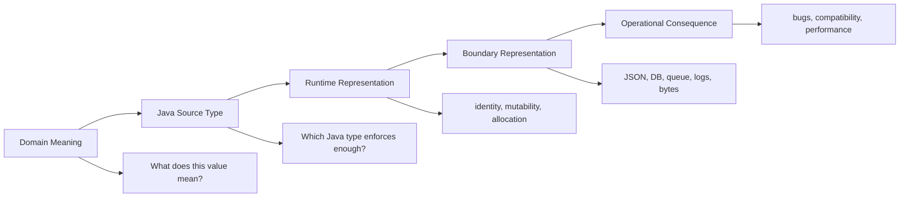
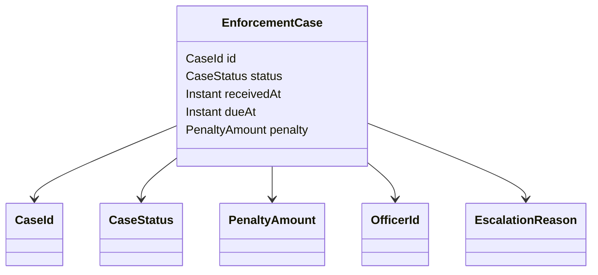

# Part 001 — Kaufman Skill Map & Type Thinking

> Target part ini: membangun **peta belajar** dan **mental model kerja** sebelum masuk ke detail `byte`, `int`, `String`, `Instant`, `record`, `enum`, boxing, casting, dan boundary serialization. Kita tidak sedang belajar “apa itu tipe data” pada level beginner. Kita sedang membangun cara berpikir seorang engineer yang memakai type system untuk mencegah bug, memperjelas domain, memperkuat API contract, dan menurunkan risiko produksi.

## 1. Posisi Seri Ini

Seri ini membahas Java data types sebagai **alat rekayasa sistem**, bukan sekadar daftar keyword.

Dalam sistem nyata, tipe data menentukan:

1. nilai apa yang legal;
2. operasi apa yang boleh dilakukan;
3. bagaimana data berpindah antar layer;
4. apakah invariant domain bisa dilanggar;
5. apakah error muncul saat compile time, runtime, atau sudah terlambat di production;
6. apakah data tetap bermakna setelah melewati JSON, database, queue, log, cache, dan UI;
7. apakah model bisa berkembang tanpa merusak compatibility.

Contoh sederhana:

```java
void approve(String caseId, String actorId, String reason, String decisionDate) { }
```

Kode ini tampak fleksibel, tapi secara semantik lemah. Semua hal penting direpresentasikan sebagai `String`. Compiler tidak bisa membedakan case id, actor id, reason, dan tanggal. Salah urutan argumen bisa lolos compile.

Bandingkan:

```java
void approve(CaseId caseId, OfficerId actorId, ApprovalReason reason, Instant decidedAt) { }
```

Versi kedua membuat sebagian kesalahan menjadi **tidak mungkin dikompilasi**. Ini inti dari seri ini: memakai tipe untuk memindahkan error dari production ke compile time atau test time.

## 2. Prinsip Kaufman yang Dipakai

Framework Josh Kaufman dalam *The First 20 Hours* berguna karena memaksa kita menghindari dua jebakan umum:

- belajar terlalu luas tanpa kemampuan pakai;
- menghafal API tanpa mental model.

Di seri ini, framework Kaufman diterjemahkan menjadi empat aktivitas teknis.

| Prinsip Kaufman | Terjemahan untuk Java Data Types |
|---|---|
| Deconstruct the skill | Pecah kemampuan menjadi semantic model, representation model, conversion model, boundary model, dan failure model |
| Learn enough to self-correct | Pahami aturan JLS/JVM secukupnya untuk bisa menjelaskan compile error, runtime failure, dan data corruption |
| Remove practice barriers | Gunakan `jshell`, test kecil, compiler warning, dan micro-example agar feedback cepat |
| Practice deliberately | Latihan pada kasus yang sering membunuh sistem: null, overflow, rounding, timezone, equality, enum evolution, JSON number precision |

Tujuan 20 jam pertama bukan menjadi “hafal semua pasal JLS”. Tujuannya adalah punya **fluency**: ketika melihat model data, signature method, DTO, entity, event schema, atau database column, Anda langsung bisa melihat risiko tipe.

## 3. Definisi Skill yang Ingin Dikuasai

Skill utama seri ini:

> Mampu memilih, mendesain, mengevaluasi, dan meng-evolusi tipe Java agar data memiliki makna, invariant terlindungi, boundary eksplisit, dan failure mode bisa diprediksi.

Skill ini terdiri dari subskill berikut.

```mermaid
graph TD
    A[Java Data Type Mastery] --> B[Language Semantics]
    A --> C[Representation Semantics]
    A --> D[Domain Modeling]
    A --> E[Boundary Design]
    A --> F[Failure Modeling]
    A --> G[Performance Awareness]

    B --> B1[primitive vs reference]
    B --> B2[expression type]
    B --> B3[assignment and invocation contexts]
    B --> B4[boxing unboxing casting]

    C --> C1[identity vs value]
    C --> C2[mutability]
    C --> C3[byte/text/time representation]
    C --> C4[numeric precision]

    D --> D1[value object]
    D --> D2[enum closed domain]
    D --> D3[record transparent carrier]
    D --> D4[semantic id types]

    E --> E1[JSON and database type loss]
    E --> E2[time zone and locale boundary]
    E --> E3[binary protocol]
    E --> E4[public API compatibility]

    F --> F1[overflow]
    F --> F2[rounding]
    F --> F3[nullability]
    F --> F4[equality hashCode]
    F --> F5[temporal bugs]

    G --> G1[primitive vs wrapper cost]
    G --> G2[allocation]
    G --> G3[object layout]
    G --> G4[cache locality]
```



## 4. Target Performa Setelah Seri Ini

Setelah menyelesaikan seri ini, Anda seharusnya mampu melakukan hal berikut.

### 4.1 Membaca Kode dengan Type Awareness

Anda tidak hanya melihat:

```java
Map<String, Object> attributes;
```

Anda langsung bertanya:

- object values-nya sebenarnya domain apa?
- apakah key memiliki schema?
- bagaimana consumer tahu `Object` itu `String`, `Integer`, `BigDecimal`, `Instant`, atau nested object?
- apa yang terjadi ketika JSON parser mengubah number menjadi `Integer`, `Long`, `Double`, atau `BigDecimal`?
- apakah invariant bisa diuji sebelum data masuk persistence?

### 4.2 Mendesain API yang Mengurangi Salah Pakai

Contoh API rapuh:

```java
void schedule(String from, String to, int duration, boolean strict);
```

Masalah:

- `from` dan `to` ambigu: timezone? local date? instant? string format apa?
- `duration` unit apa: detik, menit, hari kerja?
- `strict` berarti apa?
- semua validasi tertunda sampai runtime.

Versi lebih kuat:

```java
void schedule(
    Instant start,
    Instant end,
    Duration expectedDuration,
    SchedulingPolicy policy
);
```

Masih belum sempurna, tapi jauh lebih sulit disalahgunakan.

### 4.3 Mengidentifikasi Type Smell

Type smell adalah tanda bahwa tipe yang dipilih tidak cukup merepresentasikan makna data.

| Smell | Contoh | Risiko |
|---|---|---|
| Primitive obsession | `String caseStatus` | Nilai ilegal lolos |
| Boolean blindness | `process(true, false)` | Call site tidak terbaca |
| Stringly typed time | `String dueDate` | Timezone, format, parsing error |
| Numeric ambiguity | `BigDecimal rate` | Apakah `0.15` berarti 15% atau 0.15 basis point? |
| Raw map | `Map<String, Object>` | Schema tersembunyi, runtime cast |
| Nullable everywhere | `String comment` bisa `null` | Banyak cabang defensif |
| Over-wide type | parameter `Object` | Compiler kehilangan informasi |
| Over-narrow type | parameter `ArrayList<T>` | API sulit dipakai dan bocor implementasi |

## 5. Mental Model Besar: Type as Constraint

Tipe bukan label kosmetik. Tipe adalah constraint.

```java
int retryCount;
```

`int` menyatakan:

- nilai berupa integer 32-bit bertanda;
- bisa overflow;
- tidak bisa `null`;
- default field value adalah `0`;
- tidak menyatakan apakah nilai negatif valid;
- tidak menyatakan batas maksimum domain;
- tidak menyatakan apakah unitnya attempt, seconds, atau milliseconds.

Karena itu, `int` adalah constraint teknis, bukan domain model lengkap.

Jika domain mengatakan retry count harus 0 sampai 10, `int` belum cukup. Kita perlu invariant tambahan:

```java
public record RetryCount(int value) {
    public RetryCount {
        if (value < 0 || value > 10) {
            throw new IllegalArgumentException("Retry count must be between 0 and 10");
        }
    }
}
```

Sekarang tipe `RetryCount` membawa makna domain, bukan hanya representasi mesin.

## 6. Lima Layer Berpikir Tentang Tipe

Saat memilih tipe, pikirkan lima layer berikut.



Contoh `Money`:

| Layer | Pertanyaan | Keputusan Umum |
|---|---|---|
| Domain meaning | Apakah amount memiliki currency? Apakah scale tetap? | `Money(amount, currency)` |
| Java source type | `double`, `long`, atau `BigDecimal`? | Biasanya `BigDecimal` atau minor-unit `long` |
| Runtime representation | Immutable? Validasi scale? | immutable value object |
| Boundary representation | JSON string/number? DB decimal? | schema eksplisit |
| Operational consequence | Rounding policy di mana? | policy eksplisit dan diuji |

## 7. Type as Boundary

Data jarang hidup hanya di memory JVM. Data melewati boundary:

- HTTP request;
- JSON payload;
- message broker;
- database;
- cache;
- log;
- CSV/import file;
- UI form;
- third-party API;
- audit trail.

Setiap boundary bisa menghilangkan type information.

Contoh:

```json
{
  "amount": 100.10,
  "currency": "IDR",
  "createdAt": "2026-06-30T10:15:30+07:00"
}
```

Risiko:

- JSON number tidak menyatakan `BigDecimal`, `double`, `long`, atau minor unit;
- `currency` string bisa typo;
- timestamp offset `+07:00` bukan timezone region seperti `Asia/Jakarta`;
- consumer mungkin mem-parsing menjadi `LocalDateTime` dan kehilangan offset;
- log atau audit mungkin menyimpan representasi berbeda dari database.

Karena itu, Java type design harus selalu dilihat bersama boundary contract.

## 8. Type as Invariant Owner

Invariant adalah aturan yang harus selalu benar.

Contoh domain enforcement lifecycle:

- case id tidak kosong;
- status hanya salah satu dari finite states;
- due date tidak boleh sebelum received date;
- penalty amount tidak boleh negatif;
- officer id harus valid format;
- decision timestamp harus immutable;
- escalation reason wajib saat escalation terjadi.

Pertanyaan penting: **siapa pemilik invariant?**

Buruk:

```java
public class CaseDto {
    public String caseId;
    public String status;
    public String receivedAt;
    public String dueAt;
    public BigDecimal penalty;
}
```

Semua field public. Semua invariant tersebar di service, controller, mapper, dan validator.

Lebih baik:

```java
public record EnforcementCase(
    CaseId id,
    CaseStatus status,
    Instant receivedAt,
    Instant dueAt,
    PenaltyAmount penalty
) {
    public EnforcementCase {
        if (dueAt.isBefore(receivedAt)) {
            throw new IllegalArgumentException("dueAt must not be before receivedAt");
        }
    }
}
```

Belum tentu semua domain cocok dijadikan `record`, tapi contoh ini menunjukkan prinsip: tipe harus membawa sebagian invariant yang paling dekat dengan data.

## 9. Type as Communication

Kode dibaca jauh lebih sering daripada ditulis. Tipe adalah dokumentasi yang bisa diperiksa compiler.

Bandingkan:

```java
void close(String id, String reason, String date);
```

Dengan:

```java
void close(CaseId caseId, ClosureReason reason, Instant closedAt);
```

Versi kedua memberi informasi langsung kepada pembaca:

- id yang dimaksud adalah case id;
- reason punya domain sendiri;
- waktu penutupan adalah point on timeline, bukan local date;
- compiler dapat membantu mencegah argumen tertukar.

Komentar bisa basi. Tipe lebih sulit basi karena dipakai compiler.

## 10. Type as Failure Mode Control

Kesalahan tipe biasanya muncul dalam beberapa bentuk.

| Failure Mode | Contoh | Cara Type Design Membantu |
|---|---|---|
| Invalid value | `status = "APPROVEDD"` | enum / sealed model |
| Unit mismatch | milliseconds dikirim sebagai seconds | semantic type `Duration`, `Timeout` |
| Precision loss | money memakai `double` | `BigDecimal` / minor-unit integer |
| Timezone loss | `LocalDateTime` untuk event global | `Instant` + zone policy |
| Null dereference | nullable field tanpa kontrak | Optional di boundary tertentu, non-null invariant |
| Wrong identity | membandingkan wrapper dengan `==` | equality discipline |
| Overflow | `int` untuk counter besar | `long`, checked arithmetic, domain cap |
| Schema drift | JSON field berubah tipe | contract tests, typed DTO |
| Enum evolution | menambah enum merusak consumer | compatibility strategy |

Top engineer tidak hanya tahu “tipe apa yang tersedia”. Mereka bisa menebak **bug apa yang akan muncul** dari pilihan tipe tertentu.

## 11. Type Fluency: Level Kemampuan

Gunakan level berikut untuk mengukur diri.

### Level 1 — Syntax Familiarity

Anda tahu keyword dan class umum:

- `int`, `long`, `double`, `boolean`, `char`;
- `String`, `BigDecimal`, `BigInteger`;
- `LocalDate`, `Instant`, `Duration`;
- `class`, `interface`, `record`, `enum`.

Ini belum cukup untuk engineering sistem besar.

### Level 2 — Rule Awareness

Anda tahu aturan:

- primitive vs reference;
- widening vs narrowing;
- boxing/unboxing;
- overload resolution dasar;
- `equals` vs `==`;
- null hanya untuk reference;
- `String` immutable;
- `BigDecimal.equals` mempertimbangkan scale.

Ini mulai berguna untuk menghindari bug umum.

### Level 3 — Boundary Awareness

Anda tahu bahwa tipe bisa berubah makna saat keluar dari JVM:

- `Instant` menjadi string;
- `BigDecimal` menjadi JSON number;
- `byte[]` menjadi base64;
- enum menjadi string atau ordinal;
- `long` bisa kehilangan precision di JavaScript;
- `LocalDateTime` bisa ambigu tanpa zone.

Ini level minimum untuk backend engineer enterprise.

### Level 4 — Domain Type Design

Anda mendesain tipe berdasarkan invariant:

```java
public record CaseNumber(String value) { }
public record BusinessDay(LocalDate value) { }
public record PenaltyAmount(BigDecimal value, Currency currency) { }
public enum CaseStatus { OPEN, UNDER_REVIEW, ESCALATED, CLOSED }
```

Anda tidak membiarkan semua domain berubah menjadi primitive atau string.

### Level 5 — Evolution & Failure Modeling

Anda berpikir tentang compatibility:

- apakah enum boleh bertambah?
- apakah field nullable akan menjadi mandatory?
- apakah scale decimal bisa berubah?
- apakah timezone policy konsisten across services?
- apakah ID type aman untuk migration?
- apakah old consumer bisa membaca new event?

Ini level yang dibutuhkan untuk platform dan regulatory systems.

## 12. Peta 20 Jam Pertama

Seri ini panjang, tapi Kaufman mengingatkan kita untuk memulai dari praktik terarah. Berikut 20 jam pertama yang paling efektif.

| Jam | Fokus | Output Praktik |
|---:|---|---|
| 1 | Baca mental model Part 001–002 | Catatan pribadi: 20 type smells di codebase sendiri |
| 2 | Primitive + numeric rules | Snippet overflow, promotion, narrowing |
| 3 | Floating point | Bukti kenapa `double` buruk untuk money |
| 4 | Boolean + enum | Refactor boolean flag menjadi enum/policy |
| 5 | Reference + identity | Eksperimen `==`, `equals`, aliasing |
| 6 | Object equality | Implement value object aman untuk collection |
| 7 | Record | Buat record dengan canonical constructor dan invariant |
| 8 | Interface | Desain capability interface sempit |
| 9 | Boxing | Cari autoboxing hidden cost dan NPE |
| 10 | Conversion | Buat tabel assignment/invocation/cast cases |
| 11 | Nullability | Ubah nullable flow menjadi explicit absence model |
| 12 | String | Eksperimen interning, concatenation, text block |
| 13 | Unicode | Uji code point vs char length |
| 14 | BigDecimal | Uji scale, rounding, equality |
| 15 | Time | Model `Instant`, `LocalDate`, `ZonedDateTime` |
| 16 | Byte/buffer | Encode/decode binary payload kecil |
| 17 | Domain IDs | Buat semantic ID wrappers |
| 18 | API boundary | Buat DTO + domain mapping dengan type loss analysis |
| 19 | Performance | Bandingkan primitive array vs wrapper collection secara konseptual |
| 20 | Capstone kecil | Model lifecycle case dengan invariant dan tests |

## 13. Cara Berlatih Cepat

Gunakan feedback loop pendek.

### 13.1 JShell untuk Semantics

`jshell` ideal untuk eksperimen kecil:

```java
jshell> byte b = 1;
jshell> b = b + 1;
|  Error:
|  incompatible types: possible lossy conversion from int to byte
```

Tujuannya bukan hafalan. Tujuannya memahami bahwa operasi numerik pada `byte` sering dipromosikan menjadi `int`.

### 13.2 Unit Test untuk Contract

Gunakan test untuk mengunci invariant:

```java
import static org.junit.jupiter.api.Assertions.*;

class RetryCountTest {
    @Test
    void rejectsNegativeRetryCount() {
        assertThrows(IllegalArgumentException.class, () -> new RetryCount(-1));
    }
}
```

### 13.3 Property Thinking

Untuk tipe seperti `Percentage`, `Money`, `CaseId`, atau `BusinessDate`, pikirkan property:

- nilai valid selalu diterima;
- nilai invalid selalu ditolak;
- serialisasi lalu deserialisasi menghasilkan nilai ekuivalen;
- ordering konsisten dengan equality;
- formatting tidak mengubah meaning.

Tidak semua harus memakai property-based testing framework. Yang penting mental modelnya.

## 14. Checklist Review Tipe

Gunakan checklist ini saat membaca model data.

### 14.1 Meaning

- Apakah tipe menyatakan makna domain atau hanya representasi teknis?
- Apakah dua nilai yang sama-sama `String` sebenarnya domain berbeda?
- Apakah ada unit, currency, timezone, locale, scale, atau format tersembunyi?

### 14.2 Validity

- Apakah semua instance dari tipe ini valid secara domain?
- Jika tidak, di mana validasi dilakukan?
- Apakah validasi terjadi terlalu terlambat?
- Apakah object bisa dibuat dalam state setengah valid?

### 14.3 Identity & Equality

- Apakah object ini entity atau value object?
- Apakah `equals` berdasarkan identity atau value?
- Apakah aman dipakai sebagai key di `HashMap`?
- Apakah field mutable memengaruhi `hashCode`?

### 14.4 Nullability

- Apakah `null` legal?
- Apakah `null` berarti unknown, absent, not applicable, not loaded, atau error?
- Apakah ada state yang lebih eksplisit daripada `null`?

### 14.5 Conversion

- Apakah ada narrowing conversion?
- Apakah boxing/unboxing tersembunyi?
- Apakah overload resolution bisa memilih method yang tidak diharapkan?
- Apakah cast bisa gagal di runtime?

### 14.6 Boundary

- Bagaimana tipe ini muncul di JSON?
- Bagaimana tipe ini disimpan di database?
- Apakah precision/scale/timezone/encoding tetap aman?
- Bagaimana backward compatibility dijaga?

### 14.7 Performance

- Apakah tipe ini dibuat dalam hot path?
- Apakah wrapper menyebabkan allocation atau cache miss?
- Apakah collection primitive lebih tepat?
- Apakah defensive copy dibutuhkan?

## 15. Anti-Goal Seri Ini

Seri ini tidak bertujuan:

- mengulang syntax Java dasar;
- mengulang OOP umum;
- mengulang semua design pattern;
- mengulang DSA collection secara penuh;
- mengulang persistence mapping secara detail;
- menjadikan JLS sebagai hafalan pasal demi pasal.

Fokus kita adalah **engineering judgment**: kapan tipe tertentu benar, kapan berbahaya, dan bagaimana membuktikannya.

## 16. Working Example yang Akan Dipakai Berulang

Agar pembelajaran tidak abstrak, beberapa part akan memakai domain contoh: **regulatory enforcement case lifecycle**.

Entitas konseptual:



Kita akan gunakan contoh ini untuk membahas:

- ID semantics;
- enum evolution;
- temporal rules;
- money/penalty precision;
- optional escalation reason;
- audit timestamps;
- serialization boundary;
- event contract compatibility.

## 17. Baseline Code: Dari Lemah ke Kuat

### 17.1 Model Lemah

```java
public class CaseRecord {
    public String id;
    public String status;
    public String receivedAt;
    public String dueAt;
    public String penaltyAmount;
    public String penaltyCurrency;
}
```

Kelemahannya:

- semua field bisa `null`;
- status bisa nilai ilegal;
- tanggal bisa format apa pun;
- amount bisa string non-number;
- currency bisa typo;
- tidak ada invariant `dueAt >= receivedAt`;
- tidak ada pemisahan domain id dan display id;
- semua error muncul terlambat.

### 17.2 Model Lebih Kuat

```java
import java.math.BigDecimal;
import java.time.Instant;
import java.util.Currency;

public record CaseId(String value) {
    public CaseId {
        if (value == null || value.isBlank()) {
            throw new IllegalArgumentException("CaseId must not be blank");
        }
    }
}

public enum CaseStatus {
    OPEN,
    UNDER_REVIEW,
    ESCALATED,
    CLOSED
}

public record PenaltyAmount(BigDecimal amount, Currency currency) {
    public PenaltyAmount {
        if (amount == null) {
            throw new IllegalArgumentException("amount must not be null");
        }
        if (currency == null) {
            throw new IllegalArgumentException("currency must not be null");
        }
        if (amount.signum() < 0) {
            throw new IllegalArgumentException("amount must not be negative");
        }
    }
}

public record EnforcementCase(
    CaseId id,
    CaseStatus status,
    Instant receivedAt,
    Instant dueAt,
    PenaltyAmount penalty
) {
    public EnforcementCase {
        if (id == null || status == null || receivedAt == null || dueAt == null) {
            throw new IllegalArgumentException("mandatory fields must not be null");
        }
        if (dueAt.isBefore(receivedAt)) {
            throw new IllegalArgumentException("dueAt must not be before receivedAt");
        }
    }
}
```

Model ini belum final, tapi jauh lebih defensible.

## 18. Pertanyaan Review yang Harus Menjadi Kebiasaan

Saat melihat field atau parameter, tanyakan:

1. Apa makna domain nilai ini?
2. Apakah tipe Java yang dipakai membawa makna tersebut?
3. Nilai ilegal apa yang masih bisa dibuat?
4. Kesalahan apa yang bisa ditangkap compiler?
5. Kesalahan apa yang baru muncul runtime?
6. Apa yang terjadi saat data melewati JSON/database/message?
7. Apakah equality benar?
8. Apakah object mutable?
9. Apakah nullable?
10. Apakah tipe ini masih aman jika domain berevolusi?

Jika Anda terbiasa bertanya seperti ini, Anda sudah jauh di atas “hafal syntax”.

## 19. Type Decision Matrix

Gunakan matrix berikut sebagai awal, bukan aturan mutlak.

| Kebutuhan | Kandidat | Catatan |
|---|---|---|
| Counter kecil internal | `int` | Aman jika range jelas dan overflow tidak mungkin |
| Counter besar / ID numeric | `long` | Tetap cek overflow dan boundary JS/JSON |
| Uang | `BigDecimal` / minor-unit `long` | Jangan default ke `double` |
| Rasio scientific | `double` | Cocok jika approximate acceptable |
| Tanggal kalender | `LocalDate` | Tanpa waktu dan timezone |
| Timestamp global | `Instant` | Point on timeline |
| Waktu lokal bisnis | `LocalDateTime` | Hanya jika zone policy jelas |
| Durasi mesin | `Duration` | Time-based amount |
| Periode kalender | `Period` | Date-based amount |
| Domain finite | `enum` / sealed hierarchy | Hindari string bebas |
| Data carrier immutable | `record` | Cocok untuk transparent data, bukan semua domain |
| Capability | `interface` | Parameter bisa lebih fleksibel |
| Binary payload | `byte[]` / `ByteBuffer` | Perhatikan mutability/copy/endian |
| Optional result | `Optional<T>` | Umumnya untuk return, bukan field/entity sembarangan |

## 20. Apa yang Tidak Boleh Dipercaya dari Intuisi

Java sering terlihat intuitif sampai Anda bertemu edge case.

Contoh:

```java
byte a = 1;
byte b = 2;
// byte c = a + b; // compile error: result is int
```

Contoh:

```java
Integer a = 1000;
Integer b = 1000;
System.out.println(a == b); // jangan jadikan asumsi identity wrapper sebagai logika
```

Contoh:

```java
System.out.println(0.1 + 0.2); // bukan 0.3 persis secara decimal
```

Contoh:

```java
String s = null;
// s.length(); // NullPointerException
```

Intuisi harus diganti dengan model formal dan latihan.

## 21. Latihan Part 001

### Latihan 1 — Type Smell Audit

Ambil satu DTO/service method dari codebase Anda. Tandai semua field/parameter bertipe:

- `String`;
- `int`/`long` tanpa unit;
- `BigDecimal` tanpa scale/rounding policy;
- `boolean` flag;
- `Map<String, Object>`;
- nullable reference.

Untuk masing-masing, tulis:

```text
Field/parameter:
Current type:
Hidden meaning:
Invalid values possible:
Better type candidate:
Boundary concern:
```

### Latihan 2 — Strengthen One Signature

Ubah signature lemah:

```java
void escalate(String caseId, String reason, String escalatedAt, String officerId);
```

Menjadi signature yang lebih kuat. Jangan implementasi dulu. Fokus pada pemilihan tipe.

### Latihan 3 — Boundary Thought Experiment

Untuk tipe berikut, jelaskan representasinya di JSON dan database:

- `Instant`;
- `LocalDate`;
- `BigDecimal`;
- `Currency`;
- `enum CaseStatus`;
- `byte[]`.

## 22. Ringkasan

Part ini membentuk fondasi:

- tipe adalah constraint, bukan sekadar nama;
- tipe yang baik memindahkan bug lebih awal;
- primitive/reference hanya awal dari cerita;
- domain type melindungi invariant;
- boundary bisa menghilangkan type information;
- Kaufman framework membantu kita fokus pada subskill yang paling berdampak;
- tujuan seri ini adalah fluency dan judgment, bukan hafalan.

Part berikutnya masuk ke mental model formal Java type system: **compile-time type, runtime class, primitive/reference, null type, subtype, assignability, dan target type**.

## 23. Referensi

- Java Language Specification, Java SE 25, Chapter 4 — Types, Values, and Variables: https://docs.oracle.com/javase/specs/jls/se25/html/jls-4.html
- Java Language Specification, Java SE 25, Chapter 5 — Conversions and Contexts: https://docs.oracle.com/javase/specs/jls/se25/html/jls-5.html
- Java Virtual Machine Specification, Java SE 25, Chapter 2 — The Structure of the Java Virtual Machine: https://docs.oracle.com/javase/specs/jvms/se25/html/jvms-2.html
- Josh Kaufman, The First 20 Hours learning method overview: https://www.wired.com/story/learn-new-skills-in-20
