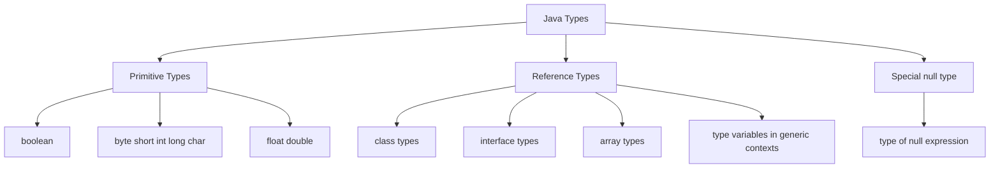
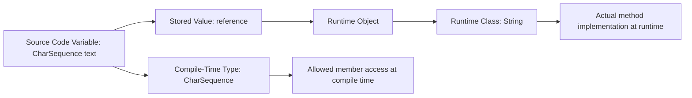
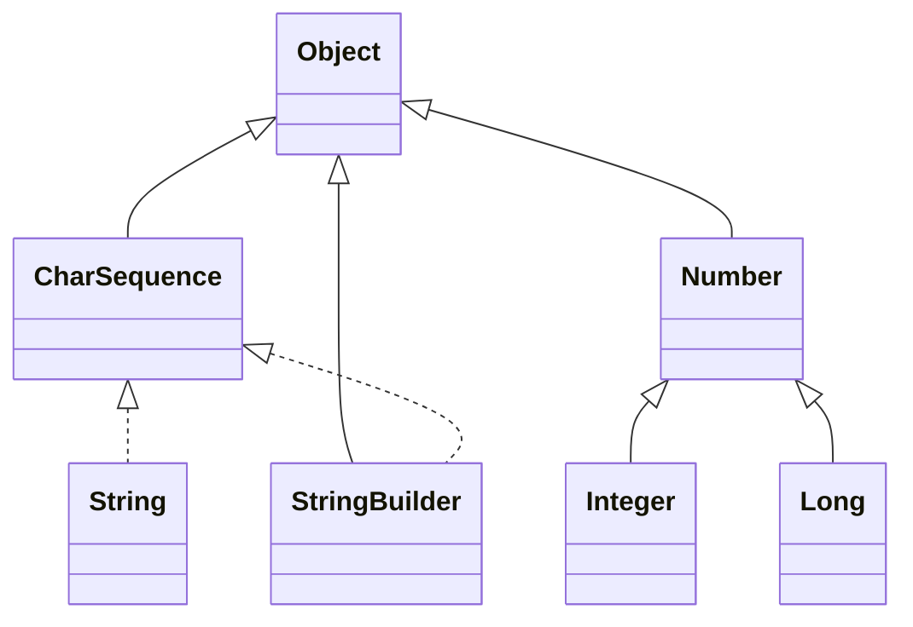
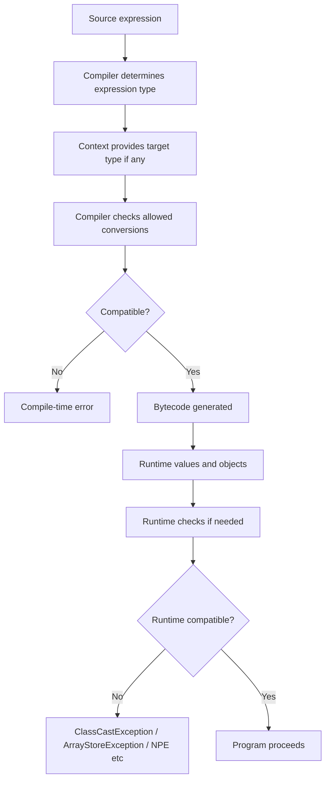

# Part 002 — Java Type System Mental Model

> Target part ini: memahami Java type system sebagai **sistem pembatasan nilai dan operasi**. Setelah part ini, Anda harus bisa membedakan compile-time type, runtime class, reference value, object identity, subtyping, assignability, dan conversion context. Ini fondasi untuk memahami primitive, wrapper, record, enum, array, generics, casting, overload, dan boundary model di part berikutnya.

## 1. Kenapa Mental Model Ini Penting

Banyak bug Java tidak terjadi karena engineer tidak tahu syntax. Bug terjadi karena engineer mencampur beberapa konsep yang tampak mirip:

- variable type vs object class;
- primitive value vs reference value;
- subtype vs assignability;
- cast vs conversion;
- `null` as value vs null type;
- compile-time type vs runtime dispatch;
- generic type in source vs erased type at runtime;
- equality vs identity;
- target type vs expression type.

Contoh:

```java
Object value = "case-123";

// value.length(); // compile error
System.out.println(((String) value).length()); // OK if runtime object is String
```

Runtime object-nya memang `String`, tapi variable `value` bertipe compile-time `Object`. Compiler hanya mengizinkan operasi yang valid untuk tipe `Object`, kecuali kita mempersempit tipe dengan cast atau pattern matching.

Ini adalah ide sentral: **compiler tidak membaca niat Anda; compiler membaca tipe yang tersedia pada titik program tersebut.**

## 2. Java adalah Statically Typed dan Strongly Typed

Java adalah statically typed: setiap variable dan expression memiliki tipe yang diketahui pada compile time. Java juga strongly typed: tipe membatasi nilai yang bisa disimpan, operasi yang bisa dilakukan, dan makna operasi tersebut.

Konsekuensinya:

```java
int count = 10;
// count = "10"; // compile error

String name = "Ari";
// name - 1; // compile error
```

Compiler mencegah operasi yang tidak bermakna berdasarkan tipe.

Namun strong typing bukan berarti semua error tertangkap compile time. Ini tetap bisa gagal runtime:

```java
Object value = "42";
Integer number = (Integer) value; // ClassCastException
```

Compiler mengizinkan cast karena secara teori `Object` bisa menunjuk ke `Integer`. Runtime membuktikan ternyata object aktualnya `String`.

## 3. Dua Keluarga Besar: Primitive dan Reference

Java membagi tipe menjadi dua keluarga besar:



### 3.1 Primitive Type

Primitive type menyimpan primitive value. Primitive value tidak memiliki object identity dan tidak berbagi state dengan primitive value lain.

Contoh:

```java
int a = 10;
int b = a;
b++;

System.out.println(a); // 10
System.out.println(b); // 11
```

`b = a` menyalin nilai. Tidak ada object bersama.

### 3.2 Reference Type

Reference type menyimpan reference value. Reference value bisa menunjuk ke object atau bernilai `null`.

Contoh:

```java
StringBuilder a = new StringBuilder("case");
StringBuilder b = a;

b.append("-123");

System.out.println(a); // case-123
System.out.println(b); // case-123
```

`b = a` menyalin reference, bukan object. Kedua variable menunjuk object yang sama.

### 3.3 Null Type

`null` memiliki tipe khusus yang tidak punya nama. Anda tidak bisa mendeklarasikan variable bertipe null type.

```java
String s = null;
Object o = null;
Runnable r = null;

// null bisa masuk ke reference type, bukan primitive
// int x = null; // compile error
```

Dalam praktik, `null` adalah lubang besar di type system: ia bisa masuk ke hampir semua reference type dan baru meledak saat digunakan.

## 4. Type, Value, Variable, Object

Empat kata ini harus dipisahkan.

| Konsep | Arti | Contoh |
|---|---|---|
| Type | Kategori compile-time yang membatasi nilai dan operasi | `String`, `int`, `List<String>` |
| Value | Sesuatu yang disimpan/dihasilkan | `42`, `true`, reference ke object |
| Variable | Storage location bernama yang memiliki type | `String name` |
| Object | Instance runtime dari class atau array | `new StringBuilder()` |

Contoh:

```java
StringBuilder builder = new StringBuilder("x");
```

Analisis:

- `builder` adalah variable;
- compile-time type variable adalah `StringBuilder`;
- value yang disimpan adalah reference value;
- reference value menunjuk object;
- runtime class object adalah `java.lang.StringBuilder`;
- object punya identity dan mutable state.

## 5. Compile-Time Type vs Runtime Class

Ini salah satu sumber kebingungan paling besar.

```java
CharSequence text = "hello";
```

Analisis:

- compile-time type variable `text` adalah `CharSequence`;
- runtime class object adalah `String`;
- method yang bisa dipanggil langsung adalah method yang tersedia pada `CharSequence`, bukan semua method `String`.

```java
System.out.println(text.length()); // OK, CharSequence punya length()
// System.out.println(text.isBlank()); // compile error jika dilihat sebagai CharSequence

String s = (String) text;
System.out.println(s.isBlank()); // OK setelah narrowing type secara eksplisit
```

Diagram:



Compiler memeriksa operasi berdasarkan compile-time type. Runtime dispatch memilih implementasi method berdasarkan runtime class object.

## 6. Expression Type

Bukan hanya variable yang punya tipe. Expression juga punya tipe.

```java
int a = 10;
long b = 20L;
var c = a + b;
```

Expression `a + b` bertipe `long` karena numeric promotion. Maka `c` diinferensikan sebagai `long`.

Contoh lain:

```java
var text = "hello";
```

`var` bukan dynamic typing. Compiler meng-infer compile-time type `String` dari initializer.

```java
text = "world"; // OK
// text = 123;  // compile error
```

`var` hanya mengurangi penulisan tipe lokal. Ia tidak mengubah Java menjadi dynamically typed.

## 7. Target Type

Beberapa expression dipengaruhi oleh konteks tempat expression muncul. Konteks ini memberi **target type**.

Contoh lambda:

```java
Runnable r = () -> System.out.println("run");
```

Lambda `() -> ...` membutuhkan target type. Tanpa target type, compiler tidak tahu functional interface mana yang dimaksud.

```java
// var x = () -> System.out.println("run"); // compile error
```

Contoh method reference:

```java
java.util.function.Function<String, Integer> length = String::length;
```

`String::length` menjadi valid karena target type `Function<String, Integer>` memberi bentuk method yang diharapkan.

Target type penting untuk memahami:

- lambda;
- method reference;
- conditional expression;
- generic method inference;
- overload resolution;
- assignment context;
- invocation context.

## 8. Subtyping Bukan Assignability

Subtyping menjawab: “apakah tipe A adalah subtype dari tipe B?”

Assignability menjawab: “apakah expression bertipe A boleh disimpan ke variable bertipe B dalam konteks ini?”

Keduanya terkait, tapi tidak identik.

Contoh subtyping reference:

```java
String s = "x";
Object o = s; // OK: String subtype dari Object
```

Contoh primitive widening:

```java
int i = 10;
long l = i; // OK: widening primitive conversion
```

`int` ke `long` bukan inheritance. Tidak ada object `int` yang menjadi subtype class `Long`. Ini conversion rule untuk primitive.

Contoh boxing:

```java
int i = 10;
Integer boxed = i; // boxing conversion
```

Contoh kombinasi yang tidak selalu sesuai intuisi:

```java
Integer boxed = 10;
Number n = boxed; // widening reference conversion

// Long wrong = 10; // compile error: int literal tidak boxing ke Integer lalu widening ke Long
```

Mental model yang aman: assignability adalah hasil aturan konteks, bukan hanya hierarchy.

## 9. Type Lattice Sederhana

Untuk reference type, hierarchy terlihat seperti graph.



Catatan:

- `String` adalah subtype dari `Object` dan mengimplementasikan `CharSequence`;
- `Integer` adalah subtype dari `Number` dan `Object`;
- `StringBuilder` bukan `String`, meskipun sama-sama `CharSequence`;
- shared supertype tidak berarti bisa saling cast dengan aman.

Contoh:

```java
CharSequence cs = new StringBuilder("abc");

// Compile OK, runtime gagal
String s = (String) cs; // ClassCastException
```

Cast mengatakan: “percaya saya, runtime object compatible dengan tipe ini.” Jika ternyata tidak, runtime menolak.

## 10. Static Type Determines What You Can Say

Perhatikan:

```java
import java.util.ArrayList;
import java.util.List;

List<String> names = new ArrayList<>();
names.add("Ari");

// names.ensureCapacity(100); // compile error
```

Runtime object-nya `ArrayList`, tapi compile-time type variable adalah `List<String>`. Method `ensureCapacity` bukan bagian dari contract `List`.

Jika Anda butuh `ensureCapacity`, ada tiga kemungkinan:

1. variable type terlalu lebar;
2. kebutuhan Anda bocor ke detail implementasi;
3. Anda sedang melakukan optimasi yang memang membutuhkan tipe konkret.

Jangan langsung cast. Evaluasi desain.

```java
ArrayList<String> names = new ArrayList<>();
names.ensureCapacity(100);
```

Sekarang API lebih konkret, tapi kurang fleksibel.

## 11. Parameter Type: Terlalu Lebar vs Terlalu Sempit

### 11.1 Terlalu Sempit

```java
void printNames(ArrayList<String> names) { }
```

Masalah:

- caller dengan `List.of(...)` tidak bisa memanggil;
- caller dengan `LinkedList` tidak bisa memanggil;
- method mungkin hanya butuh iterasi, tapi memaksa implementasi spesifik.

Lebih baik jika hanya butuh iterasi:

```java
void printNames(Iterable<String> names) { }
```

Atau jika butuh indexed access/list semantics:

```java
void printNames(List<String> names) { }
```

### 11.2 Terlalu Lebar

```java
void process(Object value) { }
```

Masalah:

- semua validasi pindah runtime;
- dokumentasi melemah;
- caller bisa mengirim apa pun;
- compiler tidak membantu.

Lebih baik:

```java
void process(CaseId caseId) { }
```

Parameter type harus cukup luas untuk fleksibel, tapi cukup sempit untuk menjaga makna.

## 12. Return Type: Contract yang Anda Janjikan

Return type adalah janji API.

```java
ArrayList<String> findNames() { ... }
```

Ini membocorkan implementasi. Caller bisa mulai bergantung pada `ArrayList`.

```java
List<String> findNames() { ... }
```

Lebih fleksibel. Tapi tetap mutable atau tidak? Tidak jelas.

```java
List<String> findNames() {
    return List.copyOf(names);
}
```

Sekarang return type masih `List`, tapi behavior-nya immutable snapshot. Dokumentasikan contract ini.

Untuk domain object:

```java
CaseStatus currentStatus(CaseId id) { ... }
```

Lebih kuat daripada:

```java
String currentStatus(String id) { ... }
```

Return type sebaiknya membawa informasi domain sebanyak yang diperlukan caller, tanpa membocorkan detail internal.

## 13. Assignment Context

Assignment context adalah tempat expression di-assign ke variable.

```java
long x = 10;     // int literal ke long via widening
byte b = 10;     // constant int expression bisa narrowing jika representable
// byte c = 1000; // compile error
```

Contoh non-constant:

```java
int i = 10;
// byte b = i; // compile error: possible lossy conversion
byte b = (byte) i;
```

Kenapa `byte b = 10;` boleh tapi `byte b = i;` tidak?

Karena literal `10` adalah constant expression yang nilainya diketahui compile time dan representable sebagai `byte`. Variable `i` bisa berubah; compiler tidak menganggapnya aman.

## 14. Invocation Context

Invocation context terjadi saat argument dikirim ke method.

```java
void acceptLong(long value) { }
void acceptInteger(Integer value) { }

acceptLong(10);     // int ke long
acceptInteger(10);  // boxing int ke Integer
```

Overload membuatnya lebih menarik:

```java
void f(long x) {
    System.out.println("long");
}

void f(Integer x) {
    System.out.println("Integer");
}

f(10); // biasanya memilih widening ke long daripada boxing ke Integer
```

Aturan detail overload resolution akan dibahas lebih dalam di Part 018. Untuk sekarang, ingat prinsipnya: method call bukan hanya “tipe sama atau tidak”; compiler memilih kandidat berdasarkan conversion yang diizinkan dan paling spesifik.

## 15. Casting Context

Casting context adalah saat Anda memaksa conversion eksplisit.

```java
long l = 130;
byte b = (byte) l;
System.out.println(b); // overflow/wrap representation, bukan 130
```

Cast bukan validasi domain. Cast hanya instruksi konversi.

Untuk reference:

```java
Object value = "hello";
String text = (String) value; // OK

Object number = 10;
String wrong = (String) number; // ClassCastException
```

Gunakan cast sebagai boundary yang perlu justifikasi. Jika cast tersebar di banyak tempat, biasanya model tipe terlalu lemah.

## 16. Method Dispatch: Static Check, Dynamic Implementation

Java melakukan compile-time method checking berdasarkan type, lalu runtime dispatch untuk instance method.

```java
interface Notifier {
    void send(String message);
}

class EmailNotifier implements Notifier {
    @Override
    public void send(String message) {
        System.out.println("email: " + message);
    }

    public void configureSmtp() {
        System.out.println("smtp configured");
    }
}

Notifier notifier = new EmailNotifier();
notifier.send("hello");
// notifier.configureSmtp(); // compile error
```

Runtime object adalah `EmailNotifier`, sehingga implementasi `send` dari `EmailNotifier` dipanggil. Tetapi compile-time type `Notifier` tidak memberi akses ke `configureSmtp`.

Ini mendukung polymorphism sekaligus menjaga contract.

## 17. Overload Resolution vs Override Dispatch

Dua mekanisme ini sering tertukar.

### 17.1 Overload Resolution: Compile Time

```java
void log(Object value) {
    System.out.println("Object");
}

void log(String value) {
    System.out.println("String");
}

Object x = "hello";
log(x); // Object
```

Kenapa bukan `String`? Karena overload dipilih berdasarkan compile-time type argument, yaitu `Object`.

### 17.2 Override Dispatch: Runtime

```java
class Animal {
    String speak() { return "animal"; }
}

class Dog extends Animal {
    @Override
    String speak() { return "dog"; }
}

Animal animal = new Dog();
System.out.println(animal.speak()); // dog
```

Override dipilih runtime berdasarkan runtime class object.

Ringkas:

| Mekanisme | Dipilih Kapan | Berdasarkan |
|---|---|---|
| Overload | Compile time | compile-time types |
| Override | Runtime | runtime class |

## 18. Arrays: Reference Type yang Reified

Array adalah reference type. Object array tahu element type-nya di runtime.

```java
String[] strings = new String[1];
Object[] objects = strings;
objects[0] = 123; // ArrayStoreException
```

Mengapa compile OK?

Karena array reference type covariant: `String[]` bisa dianggap `Object[]`.

Mengapa runtime gagal?

Karena object array aktual adalah array of `String`, dan runtime menjaga agar elemen non-String tidak masuk.

Ini contoh kuat bahwa type safety Java kadang dijaga oleh kombinasi compile-time dan runtime check.

## 19. Generics: Source-Level Type Safety dengan Erasure

Generics memberi type safety di source code:

```java
java.util.List<String> names = new java.util.ArrayList<>();
names.add("Ari");
// names.add(123); // compile error
```

Namun banyak informasi generic tidak tersedia penuh di runtime karena erasure.

```java
java.util.List<String> strings = new java.util.ArrayList<>();
java.util.List<Integer> integers = new java.util.ArrayList<>();

System.out.println(strings.getClass() == integers.getClass()); // true
```

Keduanya runtime class `ArrayList`. Generic type argument membantu compiler, tapi jangan berasumsi `List<String>` dan `List<Integer>` menjadi class runtime berbeda.

Generics akan disentuh secukupnya di seri ini saat relevan dengan array, raw type, boundary, dan type erasure. Pembahasan generic programming mendalam berada di seri terpisah.

## 20. `var` Tidak Menghapus Type System

`var` sering disalahpahami.

```java
var id = new CaseId("CASE-1");
```

Compiler meng-infer type `CaseId`. Setelah itu, variable tetap strongly typed.

```java
// id = "CASE-2"; // compile error
```

Gunakan `var` jika initializer jelas dan tipe tidak membantu readability.

Baik:

```java
var cases = new ArrayList<EnforcementCase>();
```

Mungkin buruk:

```java
var result = service.process(input);
```

Jika nama method dan variable tidak cukup menjelaskan tipe, explicit type bisa lebih baik untuk pembaca.

## 21. Null Bypasses Meaning

`null` bisa masuk ke banyak reference type:

```java
CaseId id = null;
CaseStatus status = null;
PenaltyAmount penalty = null;
```

Tipe domain yang bagus tetap bisa dilumpuhkan oleh null jika invariant tidak menjaga non-null.

Karena itu, constructor dan factory harus jelas:

```java
public record CaseId(String value) {
    public CaseId {
        if (value == null || value.isBlank()) {
            throw new IllegalArgumentException("CaseId must not be blank");
        }
    }
}
```

Untuk aggregate:

```java
public record CaseAssignment(CaseId caseId, OfficerId officerId) {
    public CaseAssignment {
        java.util.Objects.requireNonNull(caseId, "caseId");
        java.util.Objects.requireNonNull(officerId, "officerId");
    }
}
```

Prinsip: jika sebuah field wajib secara domain, jangan biarkan object valid berisi `null`.

## 22. Type System sebagai Proof System

Cara produktif melihat type system:

> Program yang berhasil dikompilasi adalah program yang telah membuktikan sebagian klaim tentang bentuk data dan operasi yang dipakai.

Contoh:

```java
void notify(OfficerId officerId, CaseId caseId) { }
```

Jika caller memiliki:

```java
CaseId caseId = new CaseId("C-1");
OfficerId officerId = new OfficerId("O-1");
notify(caseId, officerId); // compile error jika urutan tertukar
```

Compiler membantu membuktikan bahwa urutan argumen benar.

Bandingkan jika semua `String`:

```java
void notify(String officerId, String caseId) { }
notify(caseId.value(), officerId.value()); // compile OK, semantik salah
```

Type system hanya bisa membuktikan hal yang Anda encode sebagai tipe.

## 23. Tipe Teknis vs Tipe Domain

Tipe teknis menjawab “bagaimana direpresentasikan”.

Tipe domain menjawab “apa maknanya”.

| Tipe Teknis | Kemungkinan Tipe Domain |
|---|---|
| `String` | `CaseId`, `OfficerId`, `EmailAddress`, `CurrencyCode` |
| `int` | `RetryCount`, `Priority`, `Age`, `BusinessDays` |
| `long` | `SequenceNumber`, `EpochMillis`, `Version` |
| `BigDecimal` | `MoneyAmount`, `Rate`, `Percentage`, `Quantity` |
| `LocalDate` | `BirthDate`, `DueDate`, `BusinessDate` |
| `Instant` | `CreatedAt`, `SubmittedAt`, `DecisionTimestamp` |

Jangan membungkus semua primitive secara membabi buta. Tetapi untuk boundary penting, domain-critical value, dan argumen yang mudah tertukar, semantic type sering sangat murah dibanding biaya bug.

## 24. Example: Case Status

### 24.1 Stringly Typed

```java
public void transition(String status) {
    if (status.equals("APPROVED")) {
        // ...
    }
}
```

Masalah:

- typo lolos compile;
- discoverability rendah;
- impossible state mudah dibuat;
- refactor sulit;
- compatibility tidak eksplisit.

### 24.2 Enum Typed

```java
public enum CaseStatus {
    OPEN,
    UNDER_REVIEW,
    APPROVED,
    REJECTED,
    CLOSED
}

public void transition(CaseStatus status) {
    switch (status) {
        case OPEN -> System.out.println("start review");
        case UNDER_REVIEW -> System.out.println("continue");
        case APPROVED, REJECTED, CLOSED -> System.out.println("terminal or near-terminal");
    }
}
```

Enum mempersempit domain menjadi finite set. Tetapi enum juga membawa pertanyaan evolution: apa yang terjadi jika status baru ditambahkan? Ini dibahas di Part 014 dan Part 030.

## 25. Example: Date/Time Type Choice

```java
record Deadline(LocalDate date) { }
record SubmittedAt(Instant instant) { }
record OfficeAppointment(LocalDateTime localDateTime) { }
```

Tiga tipe ini bukan interchangeable.

| Tipe | Cocok Untuk | Risiko Jika Salah Pakai |
|---|---|---|
| `LocalDate` | tanggal kalender tanpa jam | tidak punya timezone/time instant |
| `Instant` | event global di timeline | tidak punya kalender lokal bisnis |
| `LocalDateTime` | tanggal+jam lokal tanpa zone | ambigu untuk event global |

Jika audit trail memakai `LocalDateTime`, Anda mungkin tidak tahu event terjadi kapan secara global. Jika birthday memakai `Instant`, Anda mungkin over-modeling.

## 26. Example: Number Type Choice

```java
int attempts = 3;
long sequence = 9_000_000_000L;
double sensorReading = 0.12345;
BigDecimal penalty = new BigDecimal("100.10");
```

Tidak ada “number type terbaik”. Ada kecocokan terhadap domain:

- `int`: umum untuk count kecil dan index;
- `long`: count besar, sequence, epoch millis, version;
- `double`: approximate scientific/measurement data;
- `BigDecimal`: decimal exact seperti money, rate dengan rounding policy;
- `BigInteger`: integer arbitrarily large.

Yang buruk adalah memilih numeric type tanpa menjawab:

- range berapa?
- exact atau approximate?
- overflow acceptable?
- rounding policy di mana?
- unit apa?
- boundary JSON/DB aman?

## 27. Type Narrowing in Program Flow

Modern Java memberi beberapa cara mempersempit type dalam flow.

```java
Object value = "CASE-1";

if (value instanceof String s) {
    System.out.println(s.length());
}
```

Di dalam block `if`, variable pattern `s` memiliki type `String`. Ini lebih aman daripada cast manual.

Untuk null:

```java
String text = maybeText();
if (text != null) {
    System.out.println(text.length());
}
```

Compiler Java belum memiliki null-safety penuh seperti beberapa bahasa lain. Jadi null discipline tetap tanggung jawab desain API, annotation, validation, dan test.

## 28. Tipe dan Compatibility

Public type adalah kontrak jangka panjang.

Jika Anda expose:

```java
public ArrayList<String> getTags() { ... }
```

Anda sulit mengganti implementasi tanpa memengaruhi caller.

Jika Anda expose:

```java
public List<String> getTags() { ... }
```

Anda punya ruang lebih luas.

Jika Anda expose:

```java
public Set<Tag> getTags() { ... }
```

Anda menyatakan uniqueness dan domain meaning lebih jelas.

Type choice memengaruhi evolusi API.

## 29. Failure Modes dari Mental Model yang Salah

| Salah Paham | Contoh | Dampak |
|---|---|---|
| Runtime class dianggap sama dengan static type | `Object x = "a"; x.length()` | compile error yang membingungkan |
| Cast dianggap validasi | `(Money) value` | ClassCastException |
| `var` dianggap dynamic | reassign beda tipe | compile error |
| Subtype disamakan dengan assignability | `Long x = 1` | compile error |
| Array dianggap seperti generic list | `Object[] o = new String[1]` | ArrayStoreException |
| Generic type dianggap runtime class berbeda | `List<String>` vs `List<Integer>` | reflection/serialization bug |
| Null dianggap value normal | `CaseId id = null` | NPE / invariant collapse |
| Overload dianggap runtime dispatch | `log(Object)` vs `log(String)` | method terpilih tidak sesuai dugaan |

## 30. Diagram: Type Check Pipeline



Kunci: sebagian hal ditolak compile time, sebagian baru bisa dibuktikan runtime.

## 31. Engineering Heuristics

### 31.1 Use the Narrowest Meaningful Domain Type

Bukan narrowest technical type, melainkan narrowest meaningful type.

```java
void assign(CaseId caseId, OfficerId officerId) { }
```

Lebih baik daripada:

```java
void assign(String caseId, String officerId) { }
```

### 31.2 Use the Broadest Honest Capability for Parameters

Jika hanya butuh membaca sequence:

```java
void export(Iterable<CaseRecord> records) { }
```

Jika butuh size dan random access, mungkin `List` lebih jujur.

### 31.3 Do Not Use `Object` as Escape Hatch Unless Boundary Demands It

`Object` kadang perlu untuk framework, serialization, reflection, dan generic container. Tetapi untuk domain API, `Object` biasanya menghapus informasi yang seharusnya dicek compiler.

### 31.4 Treat Cast as Suspicious

Cast bisa tepat di boundary, misalnya setelah membaca framework API yang memang untyped. Tetapi cast di business logic inti sering menandakan model tipe kurang kuat.

### 31.5 Separate Representation from Meaning

`String` bisa menjadi representasi `CaseId`, tapi bukan berarti domain type harus `String`.

```java
public record CaseId(String value) { }
```

## 32. Latihan Part 002

### Latihan 1 — Static Type vs Runtime Class

Prediksi output/hasil compile:

```java
Object a = "hello";
CharSequence b = "world";
String c = "java";

System.out.println(a.getClass().getSimpleName());
System.out.println(b.length());
// System.out.println(a.length());
// System.out.println(b.isBlank());
System.out.println(c.isBlank());
```

Jelaskan untuk setiap baris:

- compile-time type expression;
- runtime class jika ada;
- alasan compile/error.

### Latihan 2 — Overload vs Override

Prediksi output:

```java
class Printer {
    void print(Object value) { System.out.println("Object"); }
    void print(String value) { System.out.println("String"); }
}

Printer p = new Printer();
Object value = "hello";
p.print(value);
p.print((String) value);
```

Kemudian jelaskan kenapa output tersebut terjadi.

### Latihan 3 — API Type Review

Review signature ini:

```java
Map<String, Object> loadCase(String caseId, boolean includeHistory);
```

Jawab:

1. apa compile-time information yang hilang?
2. apa domain type yang mungkin perlu dibuat?
3. apakah `boolean includeHistory` cukup jelas?
4. apa return type yang lebih kuat?
5. boundary apa yang perlu dipikirkan?

### Latihan 4 — Null Type Collapse

Buat `record OfficerId(String value)` yang menolak:

- `null`;
- blank string;
- string tanpa prefix `OFF-`.

Lalu jelaskan kenapa constructor record adalah tempat yang baik untuk invariant lokal tersebut.

## 33. Ringkasan

Mental model yang harus dibawa ke part berikutnya:

- Java memeriksa tipe secara static dan kuat, tapi runtime check tetap ada untuk beberapa kasus;
- primitive value bukan object dan tidak memiliki identity;
- reference value menunjuk object atau `null`;
- variable type adalah compile-time contract;
- runtime class object bisa lebih spesifik daripada variable type;
- expression punya type;
- target type dapat memengaruhi typing expression tertentu;
- subtyping, assignability, boxing, widening, dan casting adalah konsep berbeda;
- overload dipilih compile time, override dipilih runtime;
- `var` tetap static typing;
- null dapat meruntuhkan invariant jika tidak dijaga;
- type system adalah alat untuk membuktikan sebagian correctness.

Part berikutnya akan masuk lebih dalam ke **values, variables, identities, lifetimes, reference aliasing, object reachability, dan null sebagai desain absence yang berbahaya**.

## 34. Referensi

- Java Language Specification, Java SE 25, Chapter 4 — Types, Values, and Variables: https://docs.oracle.com/javase/specs/jls/se25/html/jls-4.html
- Java Language Specification, Java SE 25, Chapter 5 — Conversions and Contexts: https://docs.oracle.com/javase/specs/jls/se25/html/jls-5.html
- Java Virtual Machine Specification, Java SE 25, Chapter 2 — The Structure of the Java Virtual Machine: https://docs.oracle.com/javase/specs/jvms/se25/html/jvms-2.html
- Josh Kaufman learning method overview: https://www.wired.com/story/learn-new-skills-in-20
