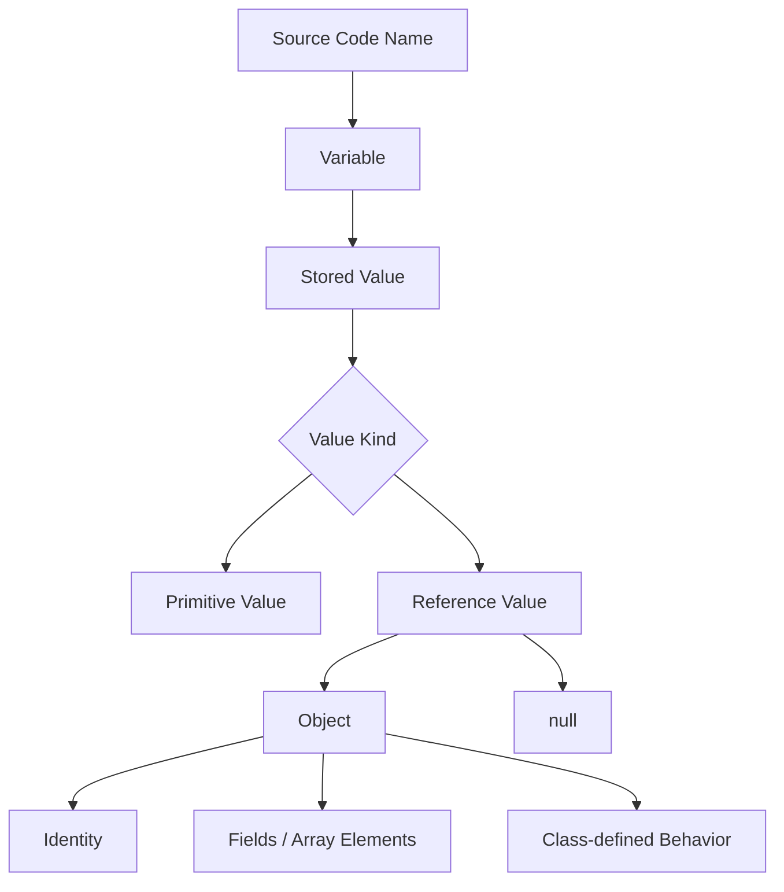
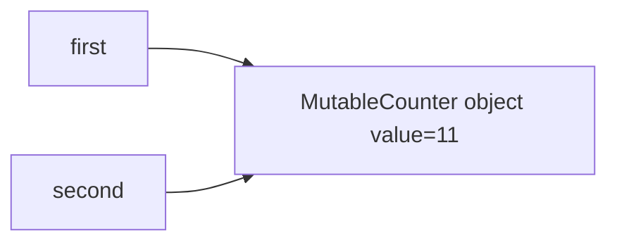
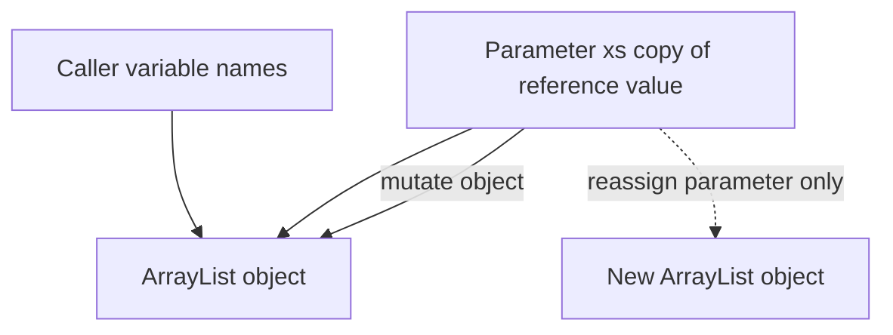
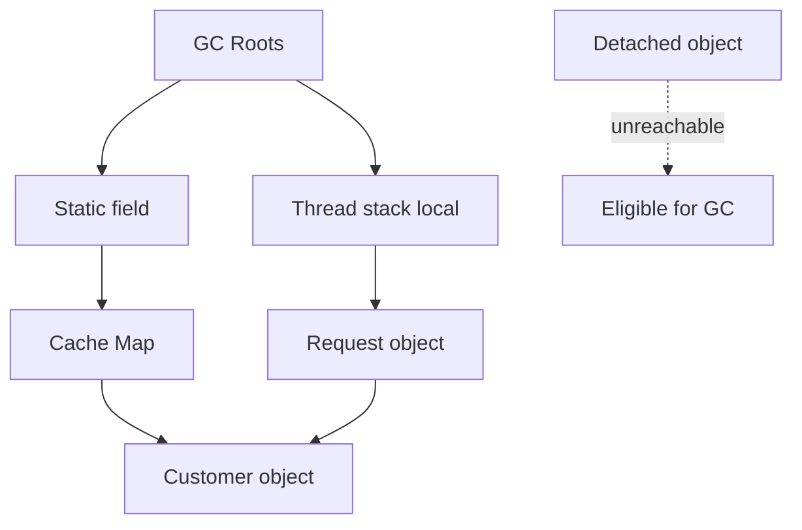
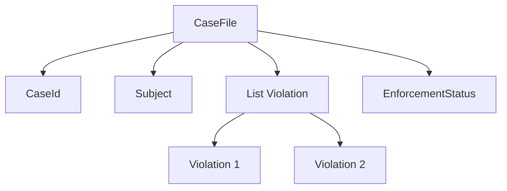

# Part 003 — Values, Variables, Identities & Lifetimes

> Target part ini: membedakan dengan presisi antara **value**, **variable**, **object**, **reference value**, **identity**, **scope**, **lifetime**, dan **reachability**. Ini adalah pondasi untuk memahami semua topik berikutnya: primitive, class, record, enum, boxing, array, `String`, `BigDecimal`, `Instant`, JSON boundary, dan memory/performance.

Banyak bug Java bukan terjadi karena engineer tidak tahu syntax. Bug terjadi karena mental model-nya kabur:

- mengira variable object “berisi object”, padahal variable reference berisi **reference value**;
- mengira assignment object membuat copy object, padahal hanya copy reference value;
- mengira Java pass-by-reference, padahal Java selalu pass-by-value;
- mengira scope local variable sama dengan lifetime object;
- mengira `final` membuat object immutable;
- mengira `null` adalah object;
- mengira equality selalu sama dengan identity;
- mengira object yang tidak terlihat di source code otomatis hilang dari memory.

Di level enterprise, kebingungan ini menghasilkan efek serius: accidental mutation, cache corruption, stale references, data race, memory leak, salah equality di collection, DTO berubah setelah divalidasi, atau audit snapshot tidak benar-benar snapshot.

---

## 1. Mental Model Utama

Java memisahkan beberapa konsep yang sering dicampur:

| Konsep | Arti Praktis | Contoh |
|---|---|---|
| **Type** | Kategori compile-time yang menentukan nilai legal dan operasi legal | `int`, `String`, `CaseId`, `List<Order>` |
| **Value** | Data yang bisa disimpan, dioperasikan, diberikan sebagai argumen, atau dikembalikan | `42`, `true`, reference ke object `Customer` |
| **Variable** | Named storage location yang memiliki type dan dapat menyimpan value | `int count`, `Customer customer` |
| **Object** | Entity runtime yang dibuat dari class/array, punya state, behavior, identity | `new Customer(...)`, `new int[10]` |
| **Reference value** | Value yang menunjuk/merujuk ke object atau bernilai `null` | isi dari variable `Customer c` |
| **Identity** | Keunikan object runtime; diuji dengan `==` pada reference | `a == b` |
| **Equality** | Kesetaraan logical/domain; diuji dengan `equals` bila di-override | `money1.equals(money2)` |
| **Scope** | Area source code tempat nama variable bisa dipakai | block `{ ... }`, method body |
| **Lifetime** | Periode storage/object eksis secara runtime | stack frame aktif, object reachable |
| **Reachability** | Apakah object masih bisa dicapai dari root reference sehingga tidak eligible GC | static field, local live reference, thread stack |

Model ringkasnya:



Kalimat yang perlu diingat:

> Variable bukan object. Variable adalah tempat penyimpanan value. Untuk reference type, value yang disimpan adalah reference value, bukan object itu sendiri.

---

## 2. Value: Yang Benar-Benar Disimpan dan Dipindahkan

JLS membagi nilai Java menjadi dua kelompok besar:

1. **primitive values**;
2. **reference values**.

Primitive value adalah nilai langsung dari primitive type: `int`, `long`, `boolean`, `double`, dan seterusnya.

Reference value adalah nilai yang mengacu ke object atau array, atau special value `null`.

Contoh:

```java
int x = 10;
String s = "java";
Customer c = new Customer("C-001");
```

Secara mental:

```text
x --> primitive value 10
s --> reference value ----> String object "java"
c --> reference value ----> Customer object { id = "C-001" }
```

`x` menyimpan primitive value. `s` dan `c` menyimpan reference value.

### 2.1 Assignment Selalu Menyalin Value

```java
int a = 10;
int b = a;
b = 20;

System.out.println(a); // 10
System.out.println(b); // 20
```

Untuk primitive, jelas: `b = a` menyalin nilai `10`.

Untuk reference, aturan yang sama berlaku. Yang disalin adalah **reference value**.

```java
var first = new MutableCounter(10);
var second = first;

second.increment();

System.out.println(first.value());  // 11
System.out.println(second.value()); // 11
```

Bukan karena Java pass-by-reference. Bukan karena variable `first` dan `second` “berisi object yang sama”. Lebih presisi:

- `first` menyimpan reference value ke object `MutableCounter`;
- `second = first` menyalin reference value tersebut;
- sekarang dua variable menyimpan reference value yang menunjuk object yang sama;
- mutasi melalui salah satu reference terlihat melalui reference lain.

Diagram:



Ini disebut **aliasing**.

---

## 3. Variable: Named Storage Location, Bukan “Box Object”

Variable Java adalah storage location bertipe tertentu.

Jenis variable yang umum:

| Jenis Variable | Contoh | Catatan Penting |
|---|---|---|
| Local variable | `int count = 0;` | Harus definitely assigned sebelum dibaca |
| Method parameter | `void pay(Money amount)` | Menerima copy dari argument value |
| Constructor parameter | `Customer(String id)` | Sama seperti method parameter |
| Lambda parameter | `x -> x + 1` | Value masuk ke lambda invocation |
| Exception parameter | `catch (IOException e)` | Reference ke exception object |
| Instance field | `private String name;` | Punya default value bila tidak diinisialisasi eksplisit |
| Static field | `static int total;` | Milik class, bukan instance |
| Array component | `items[0]` | Tiap elemen adalah variable-like storage location |

### 3.1 Local Variable Tidak Punya Default Value

```java
void example() {
    int count;
    System.out.println(count); // compile error
}
```

Compiler menolak karena local variable harus **definitely assigned** sebelum dibaca.

Sebaliknya, field punya default value:

```java
class Counter {
    int count;       // default 0
    boolean active;  // default false
    String label;    // default null
}
```

Array component juga punya default value:

```java
int[] numbers = new int[3];
System.out.println(numbers[0]); // 0

String[] names = new String[3];
System.out.println(names[0]); // null
```

Prinsip desain:

> Default value bukan selalu valid domain value.

Contoh buruk:

```java
class Penalty {
    int amount; // default 0: apakah 0 valid, unknown, atau belum dihitung?
}
```

Lebih kuat:

```java
record Penalty(Money amount) {
    Penalty {
        if (amount == null) throw new IllegalArgumentException("amount is required");
        if (amount.isNegative()) throw new IllegalArgumentException("amount must not be negative");
    }
}
```

Default `0`, `false`, dan `null` sering membuat object berada pada state valid secara JVM tapi invalid secara domain.

---

## 4. Object: Runtime Entity dengan Identity

Object adalah entity runtime. Object dibuat oleh operasi seperti:

```java
new Customer("C-001")
new int[10]
"literal string"
```

Object punya beberapa properti praktis:

1. **class/runtime type**;
2. **fields atau array components**;
3. **identity**;
4. **monitor** untuk synchronization;
5. **lifetime** yang ditentukan reachability, bukan scope source code;
6. kemungkinan punya behavior melalui method class-nya.

### 4.1 Object Identity

Pada reference type, operator `==` membandingkan apakah dua reference value menunjuk object yang sama, bukan apakah isi object sama.

```java
var a = new String("java");
var b = new String("java");

System.out.println(a == b);      // false
System.out.println(a.equals(b)); // true
```

`a` dan `b` menunjuk dua object berbeda. Isi text sama, identity berbeda.

### 4.2 Identity vs Equality

| Pertanyaan | Operator/Method | Contoh |
|---|---|---|
| Apakah dua reference menunjuk object yang sama? | `==` | cache identity, singleton, enum |
| Apakah dua object setara secara domain/logical? | `equals` | `String`, `BigDecimal`, value object |
| Apakah object cocok sebagai key hash-based collection? | `equals` + `hashCode` konsisten | `HashMap`, `HashSet` |

Contoh domain:

```java
record CaseId(String value) { }

var a = new CaseId("CASE-001");
var b = new CaseId("CASE-001");

System.out.println(a == b);      // false
System.out.println(a.equals(b)); // true
```

Record secara default membuat equality berbasis component. Itu cocok untuk banyak value object, tetapi tetap harus diuji apakah component-nya sendiri punya equality semantik yang tepat.

### 4.3 Kapan Identity Penting?

Identity penting ketika object memang merepresentasikan entity runtime yang berbeda meskipun state-nya sama.

Contoh:

```java
class WorkflowExecution {
    private final UUID executionId;
    private WorkflowState state;
}
```

Dua workflow execution dengan state sama tetap bukan execution yang sama.

Identity kurang penting untuk value object:

```java
record Money(BigDecimal amount, Currency currency) { }
```

Dua `Money` dengan amount dan currency sama biasanya dianggap setara.

Rule of thumb:

| Model | Equality Bias |
|---|---|
| Entity | identity/domain ID |
| Value object | component/value equality |
| DTO | structural equality jika dibutuhkan test/diff |
| Enum | identity aman karena singleton per constant |
| Service object | biasanya tidak dibandingkan |

---

## 5. Reference Value dan `null`

`null` adalah special value yang bisa disimpan pada variable reference type.

```java
Customer customer = null;
```

`null` bukan object. Karena itu operasi yang membutuhkan object akan gagal:

```java
customer.name(); // NullPointerException
```

### 5.1 Null Memiliki Daya Rusak Karena Semantiknya Tidak Spesifik

`null` bisa berarti banyak hal:

| `null` Mungkin Berarti | Masalah |
|---|---|
| Belum di-load | Apakah lazy loading? |
| Tidak ada | Apakah absence valid? |
| Tidak diketahui | Apakah unknown berbeda dari none? |
| Tidak berlaku | Apakah not applicable? |
| Error upstream | Apakah harus retry? |
| Field optional | Apakah optional secara domain atau teknis? |

Contoh buruk:

```java
record Violation(String resolvedAt) { }
```

Jika `resolvedAt == null`, apa artinya?

- case belum resolved?
- timestamp unknown?
- migrasi data lama?
- field belum diisi UI?
- error parsing?

Lebih eksplisit:

```java
sealed interface ResolutionStatus permits Unresolved, Resolved, ResolutionUnknown { }

record Unresolved() implements ResolutionStatus { }
record Resolved(Instant resolvedAt) implements ResolutionStatus { }
record ResolutionUnknown(String reason) implements ResolutionStatus { }
```

Tidak semua domain perlu sealed hierarchy, tetapi prinsipnya sama: jangan biarkan `null` memikul terlalu banyak makna.

### 5.2 `final` Reference Tidak Berarti Object Immutable

```java
final List<String> names = new ArrayList<>();
names.add("A"); // valid

names = new ArrayList<>(); // compile error
```

`final` pada local variable/field reference berarti variable tidak bisa di-reassign setelah assignment. Object yang dirujuk tetap bisa mutable.

Untuk membuat desain immutable, perlu:

1. field `final`;
2. tidak mengekspos mutable object internal;
3. defensive copy untuk input/output mutable;
4. component type juga immutable atau diperlakukan sebagai snapshot;
5. constructor menjaga invariant.

Contoh:

```java
public final class CaseSnapshot {
    private final List<String> violations;

    public CaseSnapshot(List<String> violations) {
        this.violations = List.copyOf(violations);
    }

    public List<String> violations() {
        return violations;
    }
}
```

`List.copyOf` membuat unmodifiable copy. Ini menghindari aliasing dari list input.

---

## 6. Java Selalu Pass-by-Value

Ini salah satu mental model paling penting.

Java selalu mengirim **copy dari argument value** ke parameter method.

Untuk primitive:

```java
static void change(int x) {
    x = 99;
}

int value = 10;
change(value);
System.out.println(value); // 10
```

Untuk reference:

```java
static void reassign(List<String> xs) {
    xs = new ArrayList<>();
    xs.add("new");
}

var names = new ArrayList<String>();
names.add("original");

reassign(names);
System.out.println(names); // [original]
```

Parameter `xs` menerima copy dari reference value. Reassign `xs` tidak mengubah variable `names` di caller.

Namun object yang dirujuk bisa dimutasi:

```java
static void mutate(List<String> xs) {
    xs.add("mutated");
}

var names = new ArrayList<String>();
names.add("original");

mutate(names);
System.out.println(names); // [original, mutated]
```

Ini bukan pass-by-reference. Ini pass-by-value dengan value berupa reference value.

Diagram:



### 6.1 API Design Consequence

Jika method menerima mutable object, method itu bisa:

1. membaca saja;
2. memutasi object;
3. menyimpan reference untuk dipakai nanti;
4. membuat copy;
5. mengekspos reference ke tempat lain.

Signature saja tidak selalu cukup memberi tahu mana yang terjadi.

```java
void validate(List<Violation> violations) { }
```

Apakah method ini hanya membaca? Bisa saja, tapi tidak dijamin.

Desain lebih kuat:

```java
void validate(Collection<Violation> violations) { }
```

Lebih baik lagi jika butuh snapshot:

```java
final class ViolationBatch {
    private final List<Violation> violations;

    ViolationBatch(Collection<Violation> violations) {
        this.violations = List.copyOf(violations);
    }
}
```

Gunakan type dan copy untuk menyatakan ownership.

---

## 7. Scope Bukan Lifetime

Scope adalah konsep lexical/source-code. Lifetime adalah konsep runtime.

```java
void process() {
    var customer = new Customer("C-001");
    audit(customer);
}
```

Variable `customer` hanya bisa dipakai di dalam method `process`. Tetapi object `Customer` bisa hidup lebih lama jika method `audit` menyimpan reference-nya.

```java
class AuditStore {
    private final List<Customer> captured = new ArrayList<>();

    void audit(Customer customer) {
        captured.add(customer);
    }
}
```

Object yang dibuat dalam method tidak otomatis mati saat method selesai. Ia menjadi eligible for garbage collection hanya ketika tidak lagi reachable.

### 7.1 Reachability Mental Model

Object hidup selama masih reachable dari root seperti:

- local variable yang masih live pada thread stack;
- static field;
- instance field dari object lain yang reachable;
- running thread;
- JNI/native references;
- class loader structures;
- pending finalization/cleaner mechanisms, tergantung kasus.

Model:



### 7.2 Memory Leak di Java Biasanya Berarti Accidental Reachability

Dalam Java, “memory leak” sering bukan berarti memory tanpa pointer seperti C. Lebih sering berarti object masih reachable padahal secara domain sudah tidak dibutuhkan.

Contoh:

```java
class CaseCache {
    private final Map<String, CaseFile> cases = new HashMap<>();

    void put(CaseFile caseFile) {
        cases.put(caseFile.id(), caseFile);
    }
}
```

Jika tidak ada eviction policy, semua `CaseFile` akan terus reachable dari `cases`.

Masalah ini adalah masalah **lifetime ownership**:

- siapa pemilik object?
- kapan object harus dilepas?
- apakah cache bounded?
- apakah key equality benar?
- apakah value menyimpan graph object besar?
- apakah object menyimpan reference ke request/user/session lama?

---

## 8. Aliasing: Sumber Mutasi Tak Terduga

Aliasing terjadi ketika beberapa reference menunjuk object yang sama.

```java
var violations = new ArrayList<String>();
var caseA = new CaseDraft(violations);
var caseB = new CaseDraft(violations);

violations.add("V-001");
```

Jika `CaseDraft` menyimpan list tanpa copy, `caseA` dan `caseB` sama-sama melihat perubahan.

```java
record CaseDraft(List<String> violations) { }
```

Record tidak otomatis membuat defensive copy. Record hanya membuat transparent carrier dengan component final. Jika component adalah mutable object, object mutable itu tetap bisa berubah.

Lebih aman:

```java
record CaseDraft(List<String> violations) {
    CaseDraft {
        violations = List.copyOf(violations);
    }
}
```

### 8.1 Input Aliasing dan Output Aliasing

Input aliasing:

```java
class Report {
    private final List<String> rows;

    Report(List<String> rows) {
        this.rows = rows; // risky
    }
}
```

Caller masih bisa memutasi `rows` setelah object dibuat.

Output aliasing:

```java
class Report {
    private final List<String> rows = new ArrayList<>();

    List<String> rows() {
        return rows; // risky
    }
}
```

Caller bisa memutasi internal state.

Solusi:

```java
class Report {
    private final List<String> rows;

    Report(Collection<String> rows) {
        this.rows = List.copyOf(rows);
    }

    List<String> rows() {
        return rows;
    }
}
```

Jika internal state memang harus mutable, ekspos operasi domain, bukan collection mutable mentah.

```java
class ReportBuilder {
    private final List<String> rows = new ArrayList<>();

    void addRow(String row) {
        rows.add(row);
    }

    Report build() {
        return new Report(rows);
    }
}
```

---

## 9. Variable Reassignment vs Object Mutation

Dua operasi ini berbeda secara fundamental.

```java
var a = new Box(1);
var b = a;

a = new Box(2);  // reassign variable a
b.setValue(3);   // mutate object referenced by b
```

Setelah kode ini:

```text
a -> Box(2)
b -> Box(3)
```

`a = new Box(2)` tidak mengubah object lama. Ia hanya membuat variable `a` menyimpan reference value baru.

`b.setValue(3)` mengubah object yang dirujuk `b`.

Dalam code review, pisahkan dua pertanyaan:

1. **Apakah variable boleh reassign?**
2. **Apakah object yang dirujuk boleh berubah?**

`final` menjawab pertanyaan pertama, bukan pertanyaan kedua.

---

## 10. Object Graph: Data Jarang Berdiri Sendiri

Object enterprise biasanya membentuk graph, bukan object tunggal.

```java
record CaseFile(
    CaseId id,
    Subject subject,
    List<Violation> violations,
    EnforcementStatus status
) { }
```

`CaseFile` punya reference ke beberapa object lain. Pertanyaan desain:

- apakah `Subject` mutable?
- apakah `violations` snapshot atau live list?
- apakah `Violation` punya reference balik ke `CaseFile`?
- apakah status derived atau stored?
- apakah object graph aman untuk serialization?
- apakah equality akan masuk cycle?
- apakah `toString` akan mencetak data sensitif atau recursive graph?

Diagram:



Object graph membuat type design bukan sekadar pilihan `class` atau `record`. Kita harus mendesain ownership, mutability, equality, lifecycle, dan boundary.

---

## 11. Identity-Sensitive Operation

Beberapa operasi Java sangat dipengaruhi identity:

| Operation | Identity Relevance |
|---|---|
| `==` pada reference | Membandingkan identity target |
| `System.identityHashCode` | Hash berbasis identity, bukan `hashCode` override |
| Synchronization monitor | Monitor terkait object identity |
| `IdentityHashMap` | Key dibandingkan dengan `==`, bukan `equals` |
| Enum constant | Aman dibandingkan dengan `==` karena tiap constant singleton |
| Object locking | Lock melekat pada object tertentu |

Contoh jebakan:

```java
Map<CaseId, CaseFile> byCase = new IdentityHashMap<>();

byCase.put(new CaseId("CASE-001"), file);
System.out.println(byCase.get(new CaseId("CASE-001"))); // null
```

`IdentityHashMap` hampir tidak pernah tepat untuk domain key. Ia berguna untuk kasus khusus seperti object graph traversal, proxy tracking, atau identity-based memoization.

---

## 12. Value-Based Classes dan Identity yang Tidak Boleh Diandalkan

Beberapa class Java modern didesain sebagai value-based class. Prinsipnya: gunakan berdasarkan value, jangan mengandalkan identity, locking, atau interning.

Contoh umum dalam praktik:

- `Optional`;
- banyak type di `java.time` seperti `Instant`, `LocalDate`, `Duration`;
- wrapper tertentu dalam konteks tertentu;
- class immutable lain yang dokumentasinya menyatakan value-based.

Implikasi desain:

```java
Instant a = Instant.parse("2026-06-30T00:00:00Z");
Instant b = Instant.parse("2026-06-30T00:00:00Z");

System.out.println(a == b);      // jangan bergantung
System.out.println(a.equals(b)); // gunakan ini
```

Untuk value-based class, treat object identity as implementation detail.

---

## 13. Lifetime dan Resource Lifetime Tidak Sama

Object lifetime berbeda dari resource lifetime.

```java
InputStream in = Files.newInputStream(path);
```

`InputStream` object punya lifetime sebagai object Java. Tetapi file descriptor yang dipegang adalah resource OS. Menunggu GC untuk menutup resource adalah desain buruk.

Gunakan deterministic cleanup:

```java
try (InputStream in = Files.newInputStream(path)) {
    return in.readAllBytes();
}
```

Pada seri ini, resource detail dibahas lebih dalam di seri IO. Namun untuk data type mastery, mental modelnya penting:

> Reachability object tidak boleh dipakai sebagai lifecycle policy untuk resource eksternal.

---

## 14. Enterprise Modeling: Snapshot vs Live Reference

Dalam sistem enforcement/case management, distinction ini penting.

Misalnya:

```java
record ApprovalEvent(
    CaseId caseId,
    OfficerId officerId,
    List<Violation> violationsAtApproval,
    Instant approvedAt
) { }
```

Nama `violationsAtApproval` menyiratkan snapshot. Jika list itu masih bisa berubah setelah event dibuat, event audit menjadi tidak defensible.

Buruk:

```java
record ApprovalEvent(
    CaseId caseId,
    OfficerId officerId,
    List<Violation> violationsAtApproval,
    Instant approvedAt
) { }
```

Lebih aman:

```java
record ApprovalEvent(
    CaseId caseId,
    OfficerId officerId,
    List<Violation> violationsAtApproval,
    Instant approvedAt
) {
    ApprovalEvent {
        Objects.requireNonNull(caseId);
        Objects.requireNonNull(officerId);
        violationsAtApproval = List.copyOf(violationsAtApproval);
        Objects.requireNonNull(approvedAt);
    }
}
```

Pertanyaan review:

- Apakah nama field menyiratkan snapshot?
- Apakah constructor benar-benar membuat snapshot?
- Apakah component type immutable?
- Apakah list order domain-significant?
- Apakah event serialization mempertahankan value yang sama?

---

## 15. Failure Modes yang Harus Bisa Anda Deteksi

### 15.1 Accidental Shared Mutable State

Gejala:

- data berubah tanpa operasi domain yang jelas;
- test flaky;
- audit event berubah setelah dibuat;
- cache entry berubah karena object yang sama dipakai banyak layer.

Akar:

- reference disalin, bukan object;
- tidak ada defensive copy;
- collection mutable diekspos;
- object entity dipakai sebagai event payload.

### 15.2 Reassignment Disangka Mutation

Gejala:

- method helper “mengganti” object tapi caller tidak melihat perubahan.

```java
void normalize(Address address) {
    address = address.normalized();
}
```

Caller tidak berubah. Return value harus eksplisit:

```java
Address normalize(Address address) {
    return address.normalized();
}
```

### 15.3 Mutation Disangka Tidak Mungkin Karena `final`

```java
final List<String> xs = new ArrayList<>();
xs.add("still mutable");
```

Akar:

- `final` variable bukan deep immutability.

### 15.4 Equality Salah Karena Identity Dipakai Untuk Domain

```java
if (caseId1 == caseId2) { ... } // wrong for value object
```

Akar:

- lupa membedakan identity dan logical equality.

### 15.5 Memory Leak Karena Static Collection

```java
static final List<RequestContext> contexts = new ArrayList<>();
```

Akar:

- object tetap reachable dari static field;
- tidak ada cleanup/eviction;
- request scoped object bocor ke global scope.

---

## 16. Review Checklist

Gunakan checklist ini saat melihat class, record, DTO, event, atau API signature.

### 16.1 Value dan Variable

- Apakah field default value valid secara domain?
- Apakah local variable bisa dibaca sebelum assigned? Compiler akan bantu, tapi branching kompleks tetap perlu jelas.
- Apakah variable reassign membuat alur sulit dipahami?
- Apakah `final` bisa meningkatkan readability tanpa memberi ilusi immutability?

### 16.2 Reference dan Aliasing

- Apakah constructor menyimpan mutable input langsung?
- Apakah getter mengekspos mutable internal state?
- Apakah object yang dikirim ke method boleh dimutasi method itu?
- Apakah ada ownership yang jelas?
- Apakah perlu snapshot atau live view?

### 16.3 Identity dan Equality

- Apakah type ini entity atau value object?
- Apakah `equals`/`hashCode` sesuai dengan penggunaan collection?
- Apakah ada penggunaan `==` pada reference selain enum/singleton/identity-specific case?
- Apakah object mutable dipakai sebagai key `HashMap`/`HashSet`?

### 16.4 Lifetime

- Siapa yang memegang reference paling lama?
- Apakah object masuk cache/static field/thread local?
- Apakah collection bounded?
- Apakah object graph terlalu besar untuk disimpan sebagai event/cache/session?
- Apakah resource eksternal ditutup eksplisit?

---

## 17. Deliberate Practice

### Latihan 1 — Prediksi Output

Prediksi output sebelum menjalankan:

```java
record Box(List<String> xs) { }

public class Main {
    public static void main(String[] args) {
        var list = new ArrayList<String>();
        var box1 = new Box(list);
        var box2 = box1;

        list.add("A");
        box1.xs().add("B");

        System.out.println(box1 == box2);
        System.out.println(box1.equals(box2));
        System.out.println(box2.xs());
    }
}
```

Pertanyaan:

1. Apakah `box1 == box2` true?
2. Apakah `box1.equals(box2)` true?
3. Mengapa record tidak melindungi dari mutasi list?
4. Bagaimana memperbaiki `Box` agar menjadi snapshot?

### Latihan 2 — Ubah API Agar Ownership Jelas

Mulai dari desain buruk:

```java
class CaseReview {
    private List<String> notes;

    CaseReview(List<String> notes) {
        this.notes = notes;
    }

    List<String> notes() {
        return notes;
    }
}
```

Refactor agar:

- input tidak bisa mengubah state internal setelah construction;
- output tidak bisa mengubah state internal;
- null ditolak;
- domain method lebih jelas bila object memang harus mutable.

### Latihan 3 — Pass-by-Value Drill

Tulis tiga method:

```java
static void changeInt(int x) { ... }
static void reassignList(List<String> xs) { ... }
static void mutateList(List<String> xs) { ... }
```

Jalankan dan buktikan sendiri bahwa:

- primitive assignment di parameter tidak mengubah caller;
- reference parameter reassignment tidak mengubah caller variable;
- object mutation melalui copied reference terlihat oleh caller.

### Latihan 4 — Snapshot Event

Desain `CaseApprovedEvent` dengan field:

- `CaseId caseId`;
- `OfficerId approvedBy`;
- `List<Violation> violationsAtApproval`;
- `Instant approvedAt`.

Pastikan event tidak berubah setelah dibuat.

Diskusikan apakah `Violation` juga harus immutable.

---

## 18. Ringkasan Mental Model

1. Variable adalah storage location bertipe, bukan object.
2. Java value terbagi menjadi primitive value dan reference value.
3. Reference variable menyimpan reference value, bukan object langsung.
4. Assignment selalu menyalin value.
5. Java selalu pass-by-value.
6. Reference value yang sama bisa menghasilkan aliasing ke object yang sama.
7. `final` mencegah reassignment, bukan mutasi object.
8. Object identity berbeda dari logical equality.
9. Scope source code berbeda dari lifetime object runtime.
10. Object eligible for GC hanya ketika tidak lagi reachable.
11. Memory leak Java sering berarti object masih reachable padahal sudah tidak dibutuhkan.
12. Snapshot harus didesain eksplisit; record tidak otomatis membuat deep immutable object.

---

## 19. Jembatan ke Part 004

Part berikutnya masuk ke primitive types. Setelah memahami value dan variable, kita bisa membaca primitive dengan lebih tepat:

- `int x` menyimpan primitive value langsung;
- `Integer x` menyimpan reference value ke wrapper object atau `null`;
- operasi arithmetic punya aturan promotion;
- default value primitive bisa valid secara JVM tapi invalid secara domain;
- overflow bukan exception dalam integer arithmetic biasa;
- `char` bukan “karakter Unicode utuh”, melainkan UTF-16 code unit.

Primitive terlihat sederhana, tetapi desain enterprise sering rusak karena salah memilih `int`, `long`, `double`, `boolean`, atau `char` untuk domain yang sebenarnya butuh tipe lebih kuat.

---

## 20. Primary References

- Java Language Specification, Java SE 25, Chapter 4 — Types, Values, and Variables: `https://docs.oracle.com/javase/specs/jls/se25/html/jls-4.html`
- Java Language Specification, Java SE 25, Chapter 5 — Conversions and Contexts: `https://docs.oracle.com/javase/specs/jls/se25/html/jls-5.html`
- Java SE 25 API, `java.lang` package summary: `https://docs.oracle.com/en/java/javase/25/docs/api/java.base/java/lang/package-summary.html`
