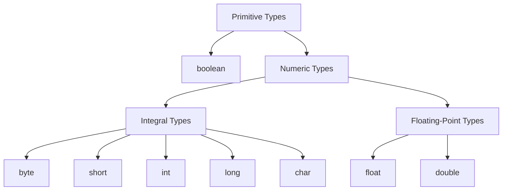
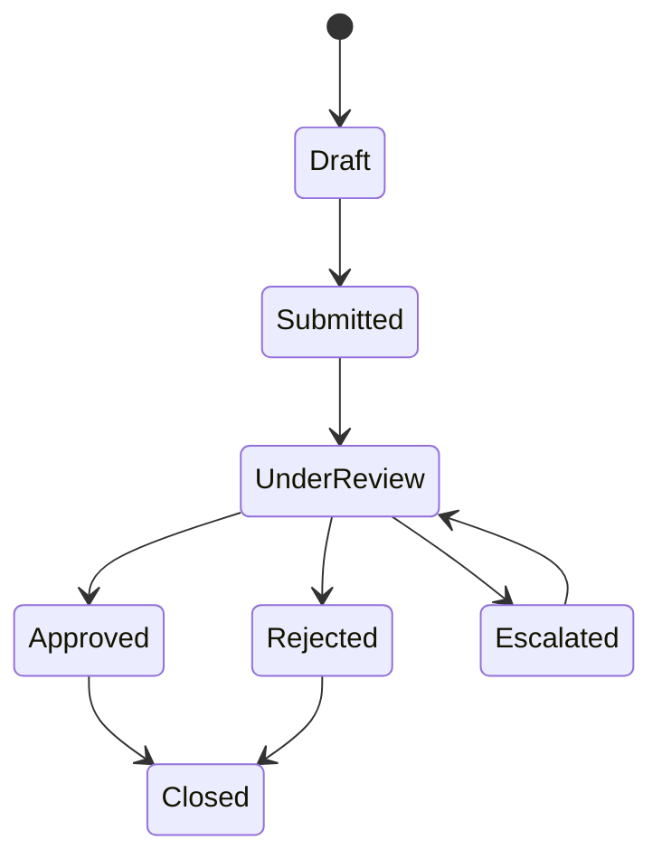

# Part 004 — Primitive Types Deep Dive

> Target part ini: memahami primitive type bukan sebagai daftar `int`, `long`, `double`, tetapi sebagai **representasi nilai paling dasar** yang punya range, default, promotion, overflow, precision, dan konsekuensi domain. Primitive adalah alat performa dan representasi, tetapi bisa menjadi sumber bug jika dipakai untuk konsep domain yang lebih kaya.

Java primitive type terlihat sederhana karena jumlahnya kecil. Namun di sistem production, pilihan primitive sering menentukan:

- apakah nilai bisa overflow;
- apakah monetary calculation kehilangan presisi;
- apakah flag boolean menutupi state machine;
- apakah `char` salah dipakai untuk Unicode;
- apakah field default `0` atau `false` menyamarkan data belum diisi;
- apakah autoboxing menghasilkan NPE tersembunyi;
- apakah JSON/database boundary mengubah makna angka.

Part ini fokus pada primitive sebagai **semantik nilai dan representasi**. Detail lebih dalam akan dipecah lagi: integral numbers di Part 005, floating-point di Part 006, boolean modeling di Part 007, literals/constants di Part 008, dan conversion/casting di Part 017–018.

---

## 1. Peta Primitive Types

Java punya delapan primitive type:



Tabel ringkas:

| Type | Kind | Size/Range Mental Model | Default Field/Array Value | Typical Use |
|---|---|---|---|---|
| `boolean` | logical | `true` / `false` | `false` | predicate, binary condition |
| `byte` | integral signed | -128..127 | `0` | binary data, protocol, compact storage |
| `short` | integral signed | -32768..32767 | `0` | legacy/binary format, rare domain use |
| `int` | integral signed | 32-bit signed | `0` | default integer arithmetic |
| `long` | integral signed | 64-bit signed | `0L` | IDs, counts, epoch millis/nanos, large ranges |
| `char` | integral unsigned-ish | 0..65535 UTF-16 code unit | `\u0000` | code unit, not full text character |
| `float` | floating-point | 32-bit IEEE 754 | `0.0f` | rare; memory/bandwidth-sensitive numeric data |
| `double` | floating-point | 64-bit IEEE 754 | `0.0d` | scientific/approximate numeric computation |

Catatan penting:

- `String` bukan primitive.
- `null` bukan primitive value.
- `void` bukan primitive data type untuk variable; ia adalah return type khusus untuk method yang tidak mengembalikan nilai.
- Wrapper seperti `Integer`, `Long`, `Boolean`, `Double` bukan primitive; itu reference type.

---

## 2. Primitive Value vs Wrapper Object

```java
int a = 10;
Integer b = 10;
```

Mental model:

```text
a --> primitive value 10
b --> reference value ----> Integer object/value wrapper for 10
```

Perbedaan praktis:

| Aspek | Primitive | Wrapper |
|---|---|---|
| Bisa `null`? | Tidak | Ya |
| Identity? | Tidak punya object identity | Punya reference/object identity, tetapi jangan diandalkan untuk value semantics |
| Memory overhead | Lebih kecil | Lebih besar karena object/reference |
| Generic collection | Tidak bisa langsung | Bisa: `List<Integer>` |
| Default field value | `0`, `false`, `0.0`, `\u0000` | `null` |
| NPE risk | Tidak dari dereference | Ada saat unboxing `null` |

Contoh NPE akibat unboxing:

```java
Integer count = null;
int x = count; // NullPointerException at runtime
```

Ini bukan error assignment biasa. Compiler mengizinkan karena ada unboxing conversion, tetapi runtime gagal karena reference `count` bernilai `null`.

Autoboxing/unboxing dibahas khusus di Part 016. Untuk sekarang, pahami bahwa primitive dan wrapper bukan hanya dua syntax untuk hal yang sama. Mereka punya failure mode berbeda.

---

## 3. Default Value: Valid Secara JVM, Belum Tentu Valid Secara Domain

Field dan array component primitive memiliki default value.

```java
class InvoiceLine {
    int quantity;       // 0
    double unitPrice;   // 0.0
    boolean approved;   // false
}
```

Ini legal. Tapi domain-nya belum tentu benar.

### 3.1 `0` Bisa Bermakna Banyak

`0` bisa berarti:

- memang nol;
- belum dihitung;
- belum diisi;
- unknown;
- not applicable;
- error fallback;
- data migration default;
- nilai sentinel.

Contoh buruk:

```java
class FineAssessment {
    int fineAmountCents; // 0 could mean no fine, not calculated, or missing
}
```

Lebih eksplisit:

```java
record FineAssessment(Money fineAmount) {
    FineAssessment {
        Objects.requireNonNull(fineAmount);
        if (fineAmount.isNegative()) {
            throw new IllegalArgumentException("fineAmount must not be negative");
        }
    }
}
```

Atau jika belum dihitung adalah state domain:

```java
sealed interface FineCalculation permits NotCalculated, Calculated { }
record NotCalculated() implements FineCalculation { }
record Calculated(Money amount) implements FineCalculation { }
```

### 3.2 `false` Bisa Menyembunyikan State Ketiga

```java
class Review {
    boolean approved;
}
```

Apakah `false` berarti:

- rejected?
- pending?
- not reviewed?
- unknown?
- loaded dari data lama?

Jika domain punya lebih dari dua state, boolean adalah model yang salah.

```java
enum ReviewDecision {
    PENDING,
    APPROVED,
    REJECTED
}
```

Atau jika butuh metadata:

```java
sealed interface ReviewState permits PendingReview, ApprovedReview, RejectedReview { }
record PendingReview() implements ReviewState { }
record ApprovedReview(OfficerId officerId, Instant approvedAt) implements ReviewState { }
record RejectedReview(OfficerId officerId, String reason, Instant rejectedAt) implements ReviewState { }
```

Primitive default memudahkan runtime, tetapi bisa melemahkan domain model.

---

## 4. Integral Types: `byte`, `short`, `int`, `long`, `char`

Integral types merepresentasikan nilai diskrit. Empat signed integer utama memakai representasi two's complement secara konseptual:

| Type | Bits | Min | Max |
|---|---:|---:|---:|
| `byte` | 8 | -128 | 127 |
| `short` | 16 | -32768 | 32767 |
| `int` | 32 | -2147483648 | 2147483647 |
| `long` | 64 | -9223372036854775808 | 9223372036854775807 |
| `char` | 16 | 0 | 65535 |

`char` berbeda karena nilainya unsigned 16-bit code unit. Namun ia tetap bagian dari integral types dan bisa ikut operasi numerik.

```java
char c = 'A';
int code = c;
System.out.println(code); // 65
```

### 4.1 `int` adalah Default Workhorse

Banyak operasi integral kecil dipromosikan ke `int`.

```java
byte a = 1;
byte b = 2;
// byte c = a + b; // compile error: result is int
int c = a + b;
```

Ini bukan “compiler aneh”. Ini aturan numeric promotion. Detailnya akan dibedah di Part 018.

Praktisnya:

- gunakan `int` untuk angka kecil umum;
- gunakan `long` untuk count/range besar, ID numerik, epoch, duration unit besar;
- gunakan `byte` untuk bytes/binary data, bukan domain number kecil;
- gunakan `short` hampir hanya untuk format/protocol legacy;
- gunakan `char` untuk UTF-16 code unit, bukan user-perceived character.

### 4.2 Integer Overflow Tidak Otomatis Exception

```java
int max = Integer.MAX_VALUE;
System.out.println(max + 1); // -2147483648
```

Integer overflow biasa wrap around. Ini sangat penting untuk:

- counter;
- pagination offset;
- money minor units;
- array size calculation;
- timeout/duration arithmetic;
- hash calculation;
- protocol length field;
- rate limiting;
- quota enforcement.

Untuk operasi yang harus fail-fast:

```java
int result = Math.addExact(a, b);
```

`Math.addExact`, `subtractExact`, `multiplyExact`, dan sejenisnya membantu mendeteksi overflow untuk `int`/`long`.

### 4.3 Signedness Trap pada `byte`

`byte` Java signed: -128 sampai 127.

Namun binary protocols sering memperlakukan byte sebagai 0 sampai 255.

```java
byte b = (byte) 0xFF;
System.out.println(b);          // -1
System.out.println(b & 0xFF);   // 255
```

Ini bukan bug JVM. Ini akibat interpretasi signed vs unsigned.

Rule:

> `byte` bagus untuk menyimpan 8 bit. Jangan otomatis menganggap ia number domain 0..255.

### 4.4 `char` Bukan “Karakter” dalam Arti User-Perceived Character

```java
char ch = 'A';
```

Ini aman untuk Basic Latin. Tetapi Unicode modern lebih kompleks. Banyak simbol membutuhkan surrogate pair di UTF-16.

```java
String s = "😀";
System.out.println(s.length());      // 2, UTF-16 code units
System.out.println(s.codePointCount(0, s.length())); // 1
```

`char` adalah 16-bit UTF-16 code unit, bukan Unicode code point lengkap, apalagi grapheme cluster yang dilihat user.

Implikasi:

- jangan iterasi text user dengan `char` jika butuh karakter manusia;
- jangan validasi panjang nama user dengan `String.length()` tanpa memahami code unit;
- jangan potong string sembarangan di tengah surrogate pair;
- gunakan API code point jika semantik Unicode penting.

Text akan dibahas lebih dalam di Part 021–022.

---

## 5. Floating-Point Types: `float` dan `double`

`float` dan `double` merepresentasikan angka floating-point biner. Mereka cocok untuk approximate numeric computation, bukan exact decimal arithmetic.

```java
System.out.println(0.1 + 0.2); // 0.30000000000000004
```

Ini bukan bug Java. Banyak pecahan decimal tidak punya representasi tepat dalam floating-point biner.

### 5.1 Jangan Pakai `double` untuk Money

Buruk:

```java
double price = 0.1;
double tax = 0.2;
double total = price + tax;
```

Untuk money, gunakan `BigDecimal` dengan policy scale dan rounding yang eksplisit, atau representasi minor unit `long` jika domainnya jelas.

```java
record Money(long cents, Currency currency) { }
```

atau:

```java
record Money(BigDecimal amount, Currency currency) { }
```

`BigDecimal` akan dibahas khusus di Part 023.

### 5.2 Floating-Point Punya Nilai Khusus

`double` dan `float` mendukung:

- positive infinity;
- negative infinity;
- NaN, not-a-number;
- positive zero dan negative zero.

Contoh:

```java
System.out.println(1.0 / 0.0);      // Infinity
System.out.println(-1.0 / 0.0);     // -Infinity
System.out.println(0.0 / 0.0);      // NaN
System.out.println(Double.NaN == Double.NaN); // false
```

Jika numeric value masuk domain enterprise dari external system, validasi finite value perlu dipertimbangkan:

```java
if (!Double.isFinite(score)) {
    throw new IllegalArgumentException("score must be finite");
}
```

---

## 6. `boolean`: Cocok untuk Predicate, Buruk untuk State Machine

`boolean` hanya punya dua nilai: `true` dan `false`.

Cocok:

```java
boolean isExpired(Instant now) { ... }
boolean hasPermission(User user, Action action) { ... }
```

Kurang cocok:

```java
class CaseFile {
    boolean approved;
    boolean rejected;
    boolean escalated;
    boolean closed;
}
```

Empat boolean bisa menghasilkan 16 kombinasi, banyak di antaranya invalid.

Lebih baik:

```java
enum CaseStatus {
    DRAFT,
    SUBMITTED,
    UNDER_REVIEW,
    APPROVED,
    REJECTED,
    ESCALATED,
    CLOSED
}
```

Atau state model eksplisit:



Boolean adalah alat predicate. Jika domain punya lifecycle, enum/sealed model biasanya lebih defensible.

---

## 7. Literals: Cara Menulis Primitive Value di Source Code

Detail literal akan dibahas di Part 008, tetapi primitive deep dive perlu peta awal.

### 7.1 Integer Literals

```java
int decimal = 42;
int binary = 0b101010;
int hex = 0x2A;
int withUnderscore = 1_000_000;
long longValue = 42L;
```

Hindari lowercase `l` karena mudah terbaca sebagai `1`.

```java
long badStyle = 42l; // legal but poor readability
long goodStyle = 42L;
```

### 7.2 Floating-Point Literals

```java
double d = 3.14;
float f = 3.14f;
double scientific = 1.2e3;
```

Default floating literal adalah `double`. Untuk `float`, gunakan suffix `f` atau `F`.

### 7.3 Character Literals

```java
char a = 'A';
char newline = '\n';
char unicode = '\u0041';
```

Hati-hati: Unicode escape diproses sangat awal oleh compiler. Ini bisa menghasilkan perilaku mengejutkan dalam komentar atau string jika tidak dipahami.

### 7.4 Boolean Literals

```java
boolean active = true;
boolean deleted = false;
```

Tidak ada konversi numerik ke boolean di Java.

```java
// if (1) { } // compile error in Java
```

Ini membedakan Java dari bahasa seperti C/C++ dan mencegah kelas bug tertentu.

---

## 8. Primitive Arithmetic: Beberapa Aturan yang Harus Dipegang

### 8.1 Operasi `byte` dan `short` Umumnya Menjadi `int`

```java
byte x = 10;
byte y = 20;

// byte z = x + y; // compile error
int z = x + y;
```

Jika benar-benar ingin `byte`, cast eksplisit diperlukan:

```java
byte z = (byte) (x + y);
```

Tapi cast ini bisa menyembunyikan overflow/truncation. Jangan cast hanya untuk “membuat compiler diam”.

### 8.2 Compound Assignment Melakukan Cast Implisit

```java
byte x = 10;
x += 20; // allowed
```

Secara kasar, ini mirip:

```java
x = (byte) (x + 20);
```

Jadi compound assignment bisa menyembunyikan narrowing conversion.

```java
byte x = 120;
x += 10;
System.out.println(x); // -126
```

Jebakan ini akan dibahas lebih formal di Part 018.

### 8.3 Integer Division Truncates Toward Zero

```java
System.out.println(5 / 2);   // 2
System.out.println(-5 / 2);  // -2
```

Jika butuh hasil decimal, salah satu operand harus floating-point atau gunakan `BigDecimal` sesuai domain.

```java
System.out.println(5 / 2.0); // 2.5
```

### 8.4 Division by Zero Berbeda untuk Integral dan Floating-Point

```java
// int x = 1 / 0; // ArithmeticException at runtime if not compile-time constant issue

System.out.println(1.0 / 0.0); // Infinity
```

Integral division by zero menghasilkan `ArithmeticException`. Floating-point division by zero menghasilkan infinity/NaN sesuai aturan floating-point.

---

## 9. Primitive dalam API Design

Primitive sering menggoda karena sederhana:

```java
void submit(String caseId, int priority, boolean urgent, long timestamp) { }
```

Tapi signature ini lemah secara domain:

- `caseId` hanya string mentah;
- `priority` tidak punya range/invariant;
- `urgent` mungkin menutupi escalation state;
- `timestamp` tidak jelas unit/timezone-nya.

Lebih kuat:

```java
void submit(
    CaseId caseId,
    Priority priority,
    SubmissionMode mode,
    Instant submittedAt
) { }
```

Primitive baik untuk representasi internal yang jelas. Untuk boundary domain, gunakan type yang membawa makna.

### 9.1 Primitive Obsession

Primitive obsession adalah kebiasaan memakai primitive/string untuk konsep domain yang seharusnya punya tipe sendiri.

Contoh:

```java
record Officer(String id, String email, String region, int level) { }
```

Lebih ekspresif:

```java
record Officer(
    OfficerId id,
    EmailAddress email,
    RegionCode region,
    AuthorityLevel level
) { }
```

Keuntungannya:

- argumen tidak mudah tertukar;
- validation dekat dengan type;
- format boundary lebih jelas;
- invariant bisa diuji per type;
- API lebih self-documenting;
- refactoring lebih aman.

---

## 10. Primitive dan Collection/Generic Boundary

Generics Java tidak mendukung primitive type parameter.

```java
// List<int> xs; // illegal
List<Integer> xs; // wrapper
```

Konsekuensi:

- boxing/unboxing terjadi;
- memory overhead meningkat;
- NPE mungkin muncul saat unboxing;
- performance bisa berbeda besar untuk data numerik besar.

Untuk data volume besar, pertimbangkan:

- primitive arrays: `int[]`, `long[]`, `double[]`;
- specialized libraries bila perlu;
- encoding binary yang jelas;
- batch processing yang menghindari boxing berlebihan.

Pembahasan detail masuk Part 016 dan Part 031.

---

## 11. Primitive dan Serialization Boundary

Primitive Java tidak selalu punya representasi identik di JSON, database, JavaScript, Avro, Protobuf, atau CSV.

Contoh risiko:

| Java Type | Boundary Risk |
|---|---|
| `long` | JavaScript number bisa kehilangan precision untuk integer besar |
| `double` | JSON tidak membedakan NaN/Infinity secara standar umum |
| `byte` | Bisa dianggap signed atau unsigned tergantung protocol |
| `char` | Banyak format tidak punya konsep char 16-bit Java |
| `boolean` | External API bisa punya `null`, `0/1`, `Y/N`, `true/false` string |
| `int` | Database column mungkin smaller/larger atau nullable |

Type design tidak selesai di JVM. Ia harus melewati boundary.

Contoh API buruk:

```json
{
  "timestamp": 1719748800000
}
```

Masalah:

- apakah millis atau seconds?
- timezone apa?
- apakah numeric precision aman?
- apakah producer/consumer sepakat?

Lebih jelas:

```json
{
  "submittedAt": "2026-06-30T10:15:30Z"
}
```

Atau jika memakai epoch:

```json
{
  "submittedAtEpochMillis": 1782814530000
}
```

Nama field harus membawa unit.

---

## 12. Domain Decision Table: Kapan Memakai Primitive?

| Kebutuhan | Rekomendasi |
|---|---|
| Loop counter lokal | `int` |
| Array index | `int` |
| Large count | `long` jika bisa melewati range `int` |
| Money exact | `BigDecimal` atau `long` minor units dengan type wrapper |
| Measurement approximate | `double` dengan validasi finite/range |
| Binary data | `byte[]` / `ByteBuffer` |
| User text | `String`, bukan `char[]` kecuali alasan khusus |
| Domain state > 2 pilihan | `enum` / sealed type, bukan beberapa boolean |
| ID numerik eksternal | domain wrapper, backing bisa `long` atau `String` |
| Timestamp | `Instant`, `LocalDate`, `ZonedDateTime`, bukan raw `long` kecuali internal optimized boundary |
| Nullable number | wrapper atau domain absence model; jangan sentinel tanpa kontrak eksplisit |

---

## 13. Failure Modes Primitive di Production

### 13.1 Overflow pada Amount Minor Unit

```java
int totalCents = unitPriceCents * quantity;
```

Jika `unitPriceCents` dan `quantity` besar, overflow bisa menghasilkan nilai negatif.

Mitigasi:

```java
long totalCents = Math.multiplyExact((long) unitPriceCents, quantity);
```

Atau pakai `Money` yang menjaga invariant.

### 13.2 Boolean State Explosion

```java
boolean approved;
boolean rejected;
boolean pending;
```

State invalid:

```text
approved=true, rejected=true
pending=true, approved=true
approved=false, rejected=false, pending=false
```

Mitigasi: enum/state machine.

### 13.3 Floating-Point Equality

```java
if (score == 0.3) { ... }
```

Jika `score` hasil arithmetic, equality langsung sering tidak stabil.

Mitigasi:

```java
static boolean closeTo(double a, double b, double epsilon) {
    return Math.abs(a - b) <= epsilon;
}
```

Untuk money, jangan pakai epsilon; gunakan exact decimal/minor unit.

### 13.4 `char` Memotong Unicode

```java
String s = "😀";
char first = s.charAt(0); // high surrogate only
```

Mitigasi: gunakan code point API jika Unicode correctness penting.

### 13.5 Sentinel Value Tidak Terdokumentasi

```java
int resolvedDays = -1; // means unresolved?
```

Mitigasi: gunakan type eksplisit.

```java
sealed interface ResolutionAge permits UnresolvedAge, ResolvedAge { }
record UnresolvedAge() implements ResolutionAge { }
record ResolvedAge(int days) implements ResolutionAge { }
```

---

## 14. Code Review Checklist untuk Primitive

### 14.1 Range dan Overflow

- Apakah range type cukup untuk data nyata dan pertumbuhan masa depan?
- Apakah multiplication/addition bisa overflow?
- Apakah perlu `Math.addExact`/`multiplyExact`?
- Apakah unit jelas: cents, rupiah, millis, seconds, days?
- Apakah negative value valid?

### 14.2 Precision

- Apakah angka harus exact decimal?
- Apakah `double` dipakai untuk money/rate yang perlu audit?
- Apakah rounding policy eksplisit?
- Apakah comparison floating-point memakai toleransi bila approximate?

### 14.3 Default Value

- Apakah `0` valid atau hanya default teknis?
- Apakah `false` valid atau menyembunyikan unknown/pending?
- Apakah `\u0000` mungkin bocor sebagai char default?
- Apakah primitive field sebaiknya diganti domain type agar required invariant jelas?

### 14.4 Boundary

- Apakah JSON/database/protobuf type mempertahankan range dan precision?
- Apakah `long` aman dikonsumsi JavaScript?
- Apakah `byte` ditafsirkan unsigned oleh protocol?
- Apakah timestamp raw number punya unit di nama field?

### 14.5 Domain Expressiveness

- Apakah primitive mewakili konsep domain yang pantas punya type sendiri?
- Apakah boolean sebenarnya state machine?
- Apakah `int priority` punya allowed range?
- Apakah `long id` bisa tertukar dengan ID domain lain?

---

## 15. Deliberate Practice

### Latihan 1 — Primitive Default Trap

Analisis class berikut:

```java
class CaseDecision {
    boolean approved;
    int penaltyAmount;
    long decidedAt;
}
```

Jawab:

1. Apa default value setiap field?
2. Kombinasi state invalid apa yang mungkin muncul?
3. Apa arti `decidedAt == 0`?
4. Bagaimana refactor menjadi model domain yang lebih eksplisit?

Target refactor minimal:

```java
enum DecisionStatus { PENDING, APPROVED, REJECTED }
```

Target refactor lebih kuat:

```java
sealed interface CaseDecision permits PendingDecision, ApprovedDecision, RejectedDecision { }
```

### Latihan 2 — Overflow Drill

Prediksi output:

```java
int max = Integer.MAX_VALUE;
System.out.println(max + 1);

int price = 2_000_000_000;
int quantity = 2;
System.out.println(price * quantity);
```

Lalu ubah menggunakan `Math.addExact` dan `Math.multiplyExact`.

### Latihan 3 — Floating-Point Drill

Jalankan:

```java
double total = 0.1 + 0.2;
System.out.println(total);
System.out.println(total == 0.3);
```

Lalu tulis versi `BigDecimal` dengan string constructor:

```java
BigDecimal total = new BigDecimal("0.1").add(new BigDecimal("0.2"));
System.out.println(total);
```

Diskusikan kenapa `new BigDecimal(0.1)` bukan solusi yang sama.

### Latihan 4 — Boolean Refactor

Refactor:

```java
record CaseFlags(
    boolean draft,
    boolean submitted,
    boolean underReview,
    boolean approved,
    boolean rejected,
    boolean closed
) { }
```

Menjadi:

```java
enum CaseStatus {
    DRAFT,
    SUBMITTED,
    UNDER_REVIEW,
    APPROVED,
    REJECTED,
    CLOSED
}
```

Kemudian tulis method transisi:

```java
CaseStatus submit(CaseStatus current) { ... }
CaseStatus approve(CaseStatus current) { ... }
CaseStatus reject(CaseStatus current) { ... }
CaseStatus close(CaseStatus current) { ... }
```

Pastikan transisi invalid menghasilkan exception domain yang jelas.

### Latihan 5 — `char` dan Unicode

Jalankan:

```java
String text = "A😀B";
System.out.println(text.length());
System.out.println(text.codePointCount(0, text.length()));

for (int i = 0; i < text.length(); i++) {
    System.out.println(Integer.toHexString(text.charAt(i)));
}

text.codePoints()
    .mapToObj(Integer::toHexString)
    .forEach(System.out::println);
```

Amati perbedaan iterasi `char` dan code point.

---

## 16. Primitive Decision Heuristics

Gunakan heuristik berikut:

1. **Mulai dari domain meaning, bukan storage size.** Jangan memilih `int` hanya karena “angka”.
2. **Pakai primitive untuk local computation yang jelas.** Loop counter, index, temporary calculation boleh sederhana.
3. **Bungkus primitive saat melewati domain boundary.** `CaseId`, `Priority`, `Money`, `Percentage`, `Duration` lebih aman dari primitive mentah.
4. **Jangan pakai `double` untuk exact decimal.** Terutama money, tax, penalty, regulatory threshold.
5. **Jangan pakai boolean untuk lifecycle.** Gunakan enum/sealed type.
6. **Jangan pakai raw `long` timestamp tanpa unit.** Gunakan `Instant` atau nama field dengan unit eksplisit.
7. **Selalu pikirkan default value.** Jika default teknis bukan state domain valid, desain constructor/type yang mencegahnya.
8. **Selalu pikirkan boundary.** Primitive JVM bisa berubah makna ketika masuk JSON, DB, JS, CSV, atau binary protocol.

---

## 17. Ringkasan Mental Model

1. Java punya delapan primitive type: `boolean`, `byte`, `short`, `int`, `long`, `char`, `float`, `double`.
2. Primitive value bukan object dan tidak bisa `null`.
3. Wrapper class adalah reference type dan punya failure mode berbeda.
4. Field dan array component primitive punya default value; local variable tidak bisa dibaca sebelum definitely assigned.
5. `int` adalah default workhorse untuk arithmetic integral.
6. `byte` signed; untuk 0..255 perlu interpretasi eksplisit.
7. `char` adalah UTF-16 code unit, bukan karakter manusia secara utuh.
8. Integer overflow biasa tidak otomatis exception.
9. Floating-point cocok untuk approximate numeric, bukan exact decimal/money.
10. Boolean cocok untuk predicate, bukan state machine kompleks.
11. Primitive bagus sebagai representasi, tetapi sering terlalu lemah sebagai domain API.
12. Unit, range, precision, default, dan boundary harus eksplisit.

---

## 18. Jembatan ke Part 005

Part 005 akan memperdalam integral numbers:

- `byte`, `short`, `int`, `long`, dan `char`;
- two's complement;
- overflow dan underflow;
- unsigned helper APIs;
- bitwise operation;
- shift operation;
- binary protocol interpretation;
- kapan memakai `int`, kapan `long`, kapan domain wrapper;
- failure mode pada counter, ID, pagination, byte parsing, dan length prefix.

Primitive integral adalah dasar dari banyak sistem: database ID, message offset, epoch timestamp, checksum, hash, protocol frame, pagination, dan quota. Karena itu kita akan membedahnya lebih tajam di part berikutnya.

---

## 19. Primary References

- Java Language Specification, Java SE 25, Chapter 4 — Types, Values, and Variables: `https://docs.oracle.com/javase/specs/jls/se25/html/jls-4.html`
- Java Language Specification, Java SE 25, Chapter 5 — Conversions and Contexts: `https://docs.oracle.com/javase/specs/jls/se25/html/jls-5.html`
- Java SE 25 API, `java.lang` package summary: `https://docs.oracle.com/en/java/javase/25/docs/api/java.base/java/lang/package-summary.html`
