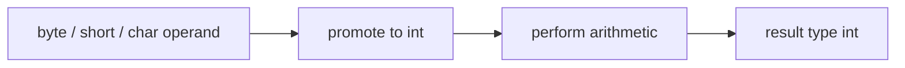
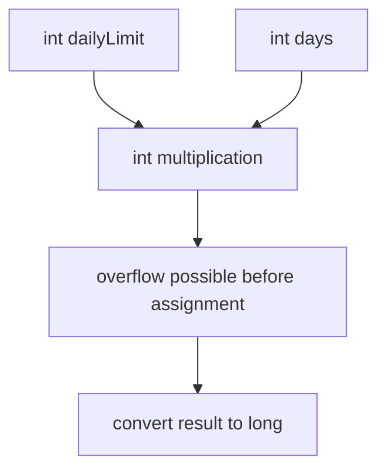

# Part 005 — Integral Numbers: `byte`, `short`, `int`, `long`, `char`

> Target part ini: memahami tipe integral Java sebagai **representasi terbatas**, bukan “angka biasa”. Kita akan melihat bagaimana `byte`, `short`, `int`, `long`, dan `char` bekerja di level bahasa, operasi, overflow, promosi numerik, bit, unsigned boundary, dan desain domain.

Part ini melanjutkan Part 004. Kita tidak akan mengulang bahwa Java punya primitive types. Fokus kita sekarang lebih sempit dan dalam: **apa konsekuensi engineering dari memilih tipe integral tertentu?**

Dalam sistem enterprise, kesalahan integral biasanya tidak terlihat saat compile. Ia muncul sebagai:

- jumlah negatif karena overflow;
- ID rusak karena narrowing;
- byte protocol salah karena signed interpretation;
- text parsing rusak karena menganggap `char` sama dengan karakter manusia;
- counter melewati range;
- timestamp epoch disimpan ke `int`;
- flag bitmask tidak terdokumentasi;
- equality atau hash berubah karena normalisasi angka yang salah.

## 1. Mental Model Utama

Tipe integral Java adalah **finite set of values** dengan operasi yang sebagian besar bekerja dalam arithmetic modulo ukuran representasi.

Bukan:

```text
int = semua bilangan bulat
```

Melainkan:

```text
int = tepat 2^32 pola bit yang diinterpretasikan sebagai signed two's-complement integer
```

Untuk `long`:

```text
long = tepat 2^64 pola bit yang diinterpretasikan sebagai signed two's-complement integer
```

Untuk `byte`:

```text
byte = tepat 2^8 pola bit yang diinterpretasikan sebagai signed two's-complement integer
```

Dan untuk `char`:

```text
char = tepat 2^16 pola bit yang diinterpretasikan sebagai unsigned UTF-16 code unit
```

Jadi pertanyaan desain yang benar bukan “butuh angka?” melainkan:

1. berapa domain nilai legalnya;
2. apakah overflow boleh terjadi;
3. apakah nilai ini merepresentasikan jumlah, posisi, ukuran, ID, waktu, kode, bit mask, atau binary payload;
4. apakah nilai ini akan keluar/masuk lewat JSON, DB, queue, file, network, atau native protocol;
5. apakah tipe Java-nya cukup kuat untuk mencegah kesalahan domain.

## 2. Peta Tipe Integral Java

| Type | Size | Signed? | Range | Typical Use | Primary Risk |
|---|---:|---|---|---|---|
| `byte` | 8 bit | signed | -128..127 | binary data, protocol, compact arrays | salah interpretasi unsigned byte |
| `short` | 16 bit | signed | -32768..32767 | legacy protocol, compact arrays | jarang cocok untuk arithmetic domain |
| `int` | 32 bit | signed | -2^31..2^31-1 | default integer arithmetic | overflow tersembunyi |
| `long` | 64 bit | signed | -2^63..2^63-1 | large count, epoch millis/nanos, IDs | overflow tetap mungkin, JSON precision risk |
| `char` | 16 bit | unsigned | 0..65535 | UTF-16 code unit | disangka “character” manusia |

JLS mendefinisikan `byte`, `short`, `int`, dan `long` sebagai signed two's-complement integers; `char` adalah unsigned 16-bit integer yang merepresentasikan UTF-16 code unit.

## 3. Kenapa `int` Menjadi Default

Banyak ekspresi integer di Java menghasilkan `int`, bahkan ketika operand-nya `byte` atau `short`.

Contoh:

```java
byte a = 10;
byte b = 20;

// byte c = a + b; // compile error
int c = a + b;
```

Ini bukan keputusan acak. Java melakukan **binary numeric promotion**. Untuk operasi arithmetic umum, `byte`, `short`, dan `char` dipromosikan ke `int`.

Mental model:



Konsekuensinya:

```java
short x = 1;
short y = 2;
// short z = x + y; // error
short z = (short) (x + y);
```

Casting di sini bukan sekadar “membuat compiler diam”. Casting berarti: **saya menerima risiko narrowing dari hasil `int` ke `short`**.

## 4. Two's Complement: Representasi yang Harus Dikuasai

Java memakai two's complement untuk signed integral types. Ini penting karena overflow dan bit operation mengikuti representasi ini.

Untuk 8-bit sederhana:

| Bit Pattern | Unsigned Interpretation | Java `byte` Interpretation |
|---|---:|---:|
| `00000000` | 0 | 0 |
| `00000001` | 1 | 1 |
| `01111111` | 127 | 127 |
| `10000000` | 128 | -128 |
| `11111111` | 255 | -1 |

Kenapa `11111111` menjadi `-1`?

Dalam two's complement, nilai negatif `-x` direpresentasikan dengan:

```text
invert bits of x, then add 1
```

Untuk `1` pada 8-bit:

```text
00000001   1
11111110   invert
11111111   add 1 = -1
```

Ini menjelaskan mengapa:

```java
byte b = -1;
System.out.println(Integer.toBinaryString(b));
```

Output-nya tidak hanya 8 bit. Karena `byte` dipromosikan ke `int`, `-1` menjadi `11111111111111111111111111111111`.

Untuk melihat byte sebagai unsigned 8-bit:

```java
byte b = -1;
int unsigned = Byte.toUnsignedInt(b); // 255
String bits = String.format("%8s", Integer.toBinaryString(unsigned)).replace(' ', '0');
```

## 5. Overflow: Bug yang Legal Secara Bahasa

Overflow integral Java tidak otomatis melempar exception untuk operator biasa.

```java
int max = Integer.MAX_VALUE;
int broken = max + 1;

System.out.println(broken); // -2147483648
```

Ini legal. Compiler tidak wajib memperingatkan.

Mental model:

```text
Integer.MAX_VALUE + 1
= 01111111 11111111 11111111 11111111
+ 00000000 00000000 00000000 00000001
= 10000000 00000000 00000000 00000000
= Integer.MIN_VALUE
```

### 5.1 Overflow Bukan Hanya Untuk Angka Besar

Overflow juga muncul di operasi intermediate.

```java
int dailyLimit = 100_000;
int days = 30_000;
long total = dailyLimit * days;

System.out.println(total); // salah, karena multiplication terjadi sebagai int
```

Perbaikan:

```java
long total = (long) dailyLimit * days;
```

Atau:

```java
long total = Math.multiplyExact((long) dailyLimit, days);
```

Kesalahan umum: mengira assignment target menentukan tipe arithmetic. Tidak. Tipe arithmetic ditentukan oleh operand dan numeric promotion.



### 5.2 Gunakan Exact Arithmetic Saat Overflow Tidak Boleh Diam

Java menyediakan helper seperti:

```java
Math.addExact(int x, int y)
Math.subtractExact(int x, int y)
Math.multiplyExact(int x, int y)
Math.incrementExact(int a)
Math.decrementExact(int a)
Math.negateExact(int a)
Math.toIntExact(long value)
```

Contoh:

```java
public final class QuotaCalculator {
    public int addQuota(int current, int increment) {
        return Math.addExact(current, increment);
    }
}
```

Jika overflow terjadi, exception dilempar. Ini jauh lebih baik untuk domain seperti:

- quota;
- financial minor units;
- legal deadline count;
- inventory;
- entitlement;
- sequence allocation;
- retry budget;
- rate limit.

## 6. `byte`: Data Biner, Bukan Angka Kecil Biasa

`byte` sering muncul dalam:

- file content;
- network packet;
- cryptographic digest;
- compression;
- image/audio binary;
- protocol header;
- serialized data;
- off-heap buffer.

Masalahnya: Java `byte` signed, tetapi banyak protocol mendefinisikan byte sebagai unsigned 0..255.

Contoh salah:

```java
byte version = buffer[0];

if (version > 200) { // tidak pernah true untuk signed byte
    throw new IllegalArgumentException("Unsupported version");
}
```

Perbaikan:

```java
int version = Byte.toUnsignedInt(buffer[0]);

if (version > 200) {
    throw new IllegalArgumentException("Unsupported version: " + version);
}
```

### 6.1 Masking Manual

Sebelum API unsigned helper umum dipakai, idiom ini sering ditemukan:

```java
int unsigned = b & 0xFF;
```

Kenapa bekerja?

- `b` dipromosikan ke `int` dengan sign extension;
- `& 0xFF` mempertahankan 8 bit terbawah;
- hasilnya 0..255.

```java
byte b = (byte) 0xFF;       // -1 sebagai signed byte
int signedExtended = b;     // -1
int unsigned = b & 0xFF;    // 255
```

Gunakan `Byte.toUnsignedInt(b)` untuk keterbacaan, kecuali Anda sedang menulis parser biner low-level yang memang penuh bitmask.

### 6.2 `byte[]` Sebagai Boundary Type

`byte[]` sebaiknya dibaca sebagai:

```text
opaque binary payload
```

Bukan:

```text
array angka kecil
```

Jika method menerima `byte[]`, pertanyaan review-nya:

1. apakah ownership array jelas;
2. apakah caller boleh memodifikasi array setelah passing;
3. apakah method menyimpan reference array;
4. apakah perlu defensive copy;
5. apakah byte order jelas;
6. apakah encoding text sudah eksplisit;
7. apakah sensitive data perlu zeroization best-effort.

Contoh boundary lebih aman:

```java
public record Digest(byte[] bytes) {
    public Digest {
        if (bytes == null) throw new IllegalArgumentException("bytes must not be null");
        if (bytes.length != 32) throw new IllegalArgumentException("SHA-256 digest must be 32 bytes");
        bytes = bytes.clone();
    }

    @Override
    public byte[] bytes() {
        return bytes.clone();
    }
}
```

Catatan: record tidak otomatis membuat array menjadi immutable. Record hanya membuat field final; isi array tetap mutable. Defensive copy tetap diperlukan.

## 7. `short`: Tipe yang Jarang Tepat untuk Domain

`short` sering menggoda karena “hemat memory”. Dalam banyak aplikasi enterprise, itu prematur.

Masalah `short`:

- arithmetic tetap dipromosikan ke `int`;
- range kecil;
- mudah overflow;
- sering memperburuk readability;
- tidak selalu memberi penghematan berarti karena alignment/object layout;
- jarang cocok dengan DB/application API modern.

Kapan `short` masuk akal?

1. format file/protocol memang 16-bit signed;
2. array numerik besar dan memory benar-benar bottleneck;
3. interop native atau hardware;
4. compact binary serialization yang sudah distandardisasi.

Contoh parser protocol:

```java
public static int readUnsignedShortBigEndian(byte[] data, int offset) {
    int high = Byte.toUnsignedInt(data[offset]);
    int low = Byte.toUnsignedInt(data[offset + 1]);
    return (high << 8) | low;
}
```

Mengembalikan `int`, bukan `short`, karena unsigned short range 0..65535 tidak muat di signed `short`.

## 8. `int`: Default Workhorse, Bukan Default Domain Type

`int` adalah default untuk banyak operasi karena efisien dan natural untuk CPU/JVM. Tetapi `int` tidak otomatis menjadi pilihan terbaik untuk domain.

Gunakan `int` untuk:

- index collection/array;
- count kecil-menengah;
- pagination size;
- retry count;
- bounded enum-like numeric code internal;
- loop counter;
- arithmetic umum dengan range terkendali.

Hindari `int` untuk:

- epoch millis;
- jumlah uang dalam minor unit jika bisa melewati 2.1 miliar;
- global sequence;
- database ID besar;
- file size;
- cumulative metric;
- duration nanoseconds/milliseconds jangka panjang;
- external numeric field yang range-nya tidak Anda kontrol.

### 8.1 `int` untuk Array dan Collection Size

Java array index menggunakan `int`. Banyak API collection juga menggunakan `int` untuk size dan index.

Konsekuensinya:

```java
List<?> list = ...;
int size = list.size();
```

Tetapi file size:

```java
long size = Files.size(path);
```

Jangan mengubah ke `int` tanpa validasi:

```java
int size = Math.toIntExact(Files.size(path));
```

`Math.toIntExact` lebih baik daripada cast:

```java
int unsafe = (int) Files.size(path); // bisa truncate diam-diam
```

## 9. `long`: Lebih Besar, Bukan Tanpa Batas

`long` sering menjadi pilihan untuk:

- database ID;
- epoch milliseconds;
- counters;
- file size;
- cumulative metrics;
- nanosecond duration;
- sequence number;
- version number.

Tetapi `long` tetap bisa overflow.

```java
long max = Long.MAX_VALUE;
long broken = max + 1; // Long.MIN_VALUE
```

### 9.1 `long` dan JSON Precision Risk

Java `long` aman sampai 64-bit signed. Tetapi ketika keluar ke JSON dan dikonsumsi JavaScript, angka besar bisa kehilangan presisi jika diperlakukan sebagai `Number`, karena JavaScript `Number` adalah double-precision floating-point.

Untuk ID besar, sering lebih aman mengirim sebagai string:

```json
{
  "caseId": "9223372036854775807"
}
```

Bukan:

```json
{
  "caseId": 9223372036854775807
}
```

Keputusan ini bukan masalah style. Ini masalah **contract fidelity**.

### 9.2 Epoch Time Jangan Disederhanakan Berlebihan

`long epochMillis` sering praktis, tetapi ia tidak membawa semantics:

```java
long submittedAt;
long approvedAt;
long deadlineAt;
```

Lebih baik di boundary domain:

```java
Instant submittedAt;
Instant approvedAt;
Instant deadlineAt;
```

Gunakan `long` untuk storage atau low-level transport jika perlu, tapi domain model sebaiknya memakai temporal type yang membawa makna.

## 10. `char`: Bukan Karakter Manusia

`char` adalah 16-bit unsigned integer yang merepresentasikan UTF-16 code unit.

Ini krusial.

Banyak karakter Unicode tidak muat dalam satu `char`. Contoh emoji atau banyak simbol historis direpresentasikan sebagai surrogate pair: dua `char` untuk satu code point.

```java
String s = "😀";
System.out.println(s.length());      // 2, jumlah UTF-16 code units
System.out.println(s.codePointCount(0, s.length())); // 1
```

Kesalahan umum:

```java
for (int i = 0; i < s.length(); i++) {
    char ch = s.charAt(i);
    process(ch); // bisa memproses setengah surrogate pair
}
```

Lebih aman untuk code point:

```java
s.codePoints().forEach(codePoint -> {
    // process Unicode code point as int
});
```

### 10.1 Kapan `char` Masih Berguna?

`char` berguna untuk:

- ASCII-like delimiter internal;
- parser sederhana untuk grammar terbatas;
- low-level UTF-16 processing;
- switch pada code unit tertentu;
- interoperability dengan API lama.

Tetapi jangan gunakan `char` untuk:

- validasi nama manusia;
- menghitung panjang teks user-facing;
- memotong string UI;
- normalisasi bahasa;
- domain “letter” secara internasional;
- security filtering Unicode.

Untuk text boundary modern, Part 022 akan membahas Unicode, charset, normalization, dan locale trap lebih dalam.

## 11. Literal Integral

Java mendukung beberapa bentuk literal integral:

```java
int decimal = 123;
int binary = 0b0111_1011;
int hex = 0x7B;
int octal = 0173;
long big = 123L;
```

Gunakan underscore untuk readability:

```java
int million = 1_000_000;
long maxFileSize = 10L * 1024 * 1024 * 1024;
```

Hindari octal literal kecuali Anda benar-benar membutuhkannya. Ini bug klasik:

```java
int value = 010; // 8, bukan 10
```

### 11.1 Suffix `L`

Gunakan uppercase `L`, bukan lowercase `l`:

```java
long safe = 10L;
long confusing = 10l; // legal, tapi buruk dibaca
```

### 11.2 Literal Bisa Overflow Saat Compile

```java
// int x = 2147483648; // error: terlalu besar untuk int literal
int min = -2147483648; // special case: unary minus applied to literal
long y = 2147483648L;
```

Untuk ekspresi:

```java
long size = 1024 * 1024 * 1024 * 5L;
```

Hati-hati: evaluasi dari kiri ke kanan dengan promosi numerik. Jika bagian awal masih `int`, overflow bisa terjadi sebelum bertemu `5L` pada beberapa susunan ekspresi.

Lebih jelas:

```java
long size = 5L * 1024 * 1024 * 1024;
```

Atau:

```java
long gib = 1024L * 1024 * 1024;
long size = 5 * gib;
```

## 12. Widening dan Narrowing Integral

Widening biasanya aman dari kehilangan informasi untuk integral ke integral yang lebih besar:

```java
int x = 42;
long y = x;
```

Narrowing bisa kehilangan informasi:

```java
int x = 300;
byte b = (byte) x;
System.out.println(b); // 44
```

Kenapa 44?

```text
300 decimal = 0b1_0010_1100
8 bit terbawah = 0010_1100 = 44
```

Casting narrowing adalah operasi truncation bit-level, bukan validasi range.

Gunakan validasi eksplisit:

```java
public static byte toByteExact(int value) {
    if (value < Byte.MIN_VALUE || value > Byte.MAX_VALUE) {
        throw new IllegalArgumentException("Out of byte range: " + value);
    }
    return (byte) value;
}
```

Atau untuk `long` ke `int`:

```java
int value = Math.toIntExact(longValue);
```

## 13. Compound Assignment: Cast Tersembunyi

```java
byte b = 1;
b += 1;      // compiles
// b = b + 1; // does not compile
```

Kenapa?

Compound assignment melakukan cast implisit setelah operasi.

Secara kasar:

```java
b += 1;
```

mirip:

```java
b = (byte) (b + 1);
```

Ini bisa overflow diam-diam:

```java
byte b = 127;
b += 1;
System.out.println(b); // -128
```

Dalam kode domain, hindari compound assignment untuk tipe kecil jika overflow tidak boleh terjadi.

## 14. Bitwise Operations

Java integral types mendukung operator bitwise:

| Operator | Meaning |
|---|---|
| `&` | bitwise AND |
| `|` | bitwise OR |
| `^` | bitwise XOR |
| `~` | bitwise complement |
| `<<` | signed left shift |
| `>>` | signed right shift |
| `>>>` | unsigned right shift |

Contoh flag:

```java
public final class Permissions {
    public static final int READ = 1 << 0;
    public static final int WRITE = 1 << 1;
    public static final int APPROVE = 1 << 2;

    private final int mask;

    public Permissions(int mask) {
        this.mask = mask;
    }

    public boolean canRead() {
        return (mask & READ) != 0;
    }

    public Permissions withWrite() {
        return new Permissions(mask | WRITE);
    }
}
```

Bitmask bisa efisien, tapi buruk jika tidak dibungkus. Jangan sebarkan raw `int mask` ke seluruh codebase.

Lebih baik:

```java
public record PermissionMask(int value) {
    public boolean has(int permission) {
        return (value & permission) != 0;
    }
}
```

Atau untuk domain biasa, gunakan `EnumSet`:

```java
enum Permission { READ, WRITE, APPROVE }

EnumSet<Permission> permissions = EnumSet.of(Permission.READ, Permission.WRITE);
```

`EnumSet` biasanya lebih ekspresif daripada bitmask manual.

## 15. Shift Operator dan Sign Extension

```java
int x = -8;
System.out.println(x >> 1);  // -4
System.out.println(x >>> 1); // large positive number
```

`>>` mempertahankan sign bit. `>>>` mengisi dengan zero.

Untuk byte parsing, ingat bahwa `byte` dipromosikan ke `int` dengan sign extension.

Bug:

```java
byte b = (byte) 0xFF;
int shifted = b << 8; // sign-extended before shift
```

Aman:

```java
int shifted = Byte.toUnsignedInt(b) << 8;
```

## 16. Unsigned APIs

Java tidak memiliki primitive unsigned integer umum selain `char`. Namun wrapper menyediakan operasi unsigned untuk `int` dan `long`.

Contoh:

```java
int signed = -1;
long unsigned = Integer.toUnsignedLong(signed); // 4294967295
```

API penting:

```java
Integer.toUnsignedLong(int x)
Integer.compareUnsigned(int x, int y)
Integer.divideUnsigned(int dividend, int divisor)
Integer.remainderUnsigned(int dividend, int divisor)
Integer.parseUnsignedInt(String s)
Integer.toUnsignedString(int i)

Long.compareUnsigned(long x, long y)
Long.divideUnsigned(long dividend, long divisor)
Long.remainderUnsigned(long dividend, long divisor)
Long.parseUnsignedLong(String s)
Long.toUnsignedString(long i)
```

Kapan digunakan?

- binary protocol;
- hash value;
- IPv4 address;
- file format;
- checksum;
- low-level systems interop;
- database column unsigned dari platform lain.

Jangan gunakan unsigned API untuk menutupi domain yang seharusnya punya value object.

## 17. Integral Type untuk Domain Modeling

Primitive integral sering terlalu lemah.

Buruk:

```java
void assign(int caseId, int officerId, int priority, int days) { }
```

Lebih baik:

```java
void assign(CaseId caseId, OfficerId officerId, Priority priority, Duration sla) { }
```

Contoh value object:

```java
public record Priority(int value) implements Comparable<Priority> {
    public Priority {
        if (value < 1 || value > 5) {
            throw new IllegalArgumentException("priority must be between 1 and 5");
        }
    }

    public boolean isEscalationCandidate() {
        return value >= 4;
    }

    @Override
    public int compareTo(Priority other) {
        return Integer.compare(this.value, other.value);
    }
}
```

Value object menambah sedikit kode, tetapi menghilangkan kelas bug:

- priority tertukar dengan score;
- range tidak konsisten;
- magic number tersebar;
- validasi berulang;
- log tidak bermakna;
- API tidak self-documenting.

## 18. ID: `int`, `long`, atau Strong Type?

Jangan berhenti pada pertanyaan `int` vs `long`. Pertanyaan yang lebih penting:

```text
Apakah ID ini bisa tertukar dengan ID lain?
```

Buruk:

```java
void link(long caseId, long documentId) { }
```

Kesalahan ini compile:

```java
link(documentId, caseId);
```

Lebih baik:

```java
public record CaseId(long value) { }
public record DocumentId(long value) { }

void link(CaseId caseId, DocumentId documentId) { }
```

Sekarang compiler membantu.

### 18.1 ID dan Serialization

Jika ID `long` keluar ke JavaScript client, pertimbangkan format string.

```java
public record CaseId(long value) {
    @Override
    public String toString() {
        return Long.toString(value);
    }
}
```

DTO:

```java
public record CaseResponse(String caseId, String status) { }
```

Domain tetap `CaseId`, boundary bisa `String`.

## 19. Count, Amount, Quantity, Sequence

Jangan samakan semua angka.

| Concept | Example | Better Type |
|---|---|---|
| Count | jumlah item | `int`/`long` with non-negative invariant |
| Amount | uang minor unit | value object + currency / `BigDecimal` depending context |
| Quantity | unit barang | value object with unit |
| Sequence | monotonically increasing number | `long` + allocator semantics |
| Version | optimistic lock | `long`/value object |
| Code | external numeric code | enum/value object |
| Bitmask | flags | wrapper/`EnumSet` |

Contoh non-negative count:

```java
public record ItemCount(int value) {
    public ItemCount {
        if (value < 0) {
            throw new IllegalArgumentException("count must not be negative");
        }
    }

    public ItemCount plus(ItemCount other) {
        return new ItemCount(Math.addExact(this.value, other.value));
    }
}
```

## 20. Database Boundary

Database integer types tidak selalu sama dengan Java types.

| DB Concept | Common Java Type | Risk |
|---|---|---|
| SMALLINT | `short` / `Integer` | nullable vs primitive, range mismatch |
| INTEGER | `int` / `Integer` | nullability, overflow in aggregate |
| BIGINT | `long` / `Long` | JSON precision, ID semantics |
| NUMERIC | `BigDecimal` | accidental mapping to double |
| UNSIGNED INT | `long` or custom mapping | Java `int` signed mismatch |

Dalam persistence layer:

```java
@Column(name = "case_id")
private Long caseId;
```

Bisa masuk akal sebagai entity field, tetapi domain service sebaiknya tidak menerima raw `Long` tanpa semantics.

Mapping boundary:

```java
public CaseId toDomainId(Long value) {
    if (value == null) throw new IllegalStateException("case_id must not be null");
    return new CaseId(value);
}
```

## 21. API Boundary

OpenAPI/JSON schema sering membedakan:

- `integer` with `format: int32`;
- `integer` with `format: int64`;
- string encoded number;
- constrained minimum/maximum.

Jika domain punya range, tulis di contract:

```yaml
priority:
  type: integer
  format: int32
  minimum: 1
  maximum: 5
```

Jika ID besar harus aman lintas JavaScript:

```yaml
caseId:
  type: string
  pattern: '^[0-9]+$'
```

Tipe Java saja tidak cukup. Boundary contract juga harus menjaga semantics.

## 22. Logging dan Observability

Bug integral sering terlihat pertama kali di log/metric.

Contoh red flag:

```text
remainingQuota=-2147483648
retryCount=-1
fileSize=-1294967296
priority=99
version=-9223372036854775808
```

Tambahkan invariant di event log:

```java
log.info("quota updated caseId={} previous={} delta={} next={}",
    caseId, previous.value(), delta.value(), next.value());
```

Untuk metric counter, gunakan tipe yang sesuai dengan library. Banyak metric counter bersifat monotonic dan non-negative; jangan hitung manual dengan `int` tanpa memikirkan reset/overflow.

## 23. Failure Modes yang Wajib Dikenali

| Failure Mode | Contoh | Dampak | Mitigasi |
|---|---|---|---|
| Silent overflow | `int total = price * qty` | amount salah | `long`, `BigDecimal`, `multiplyExact` |
| Intermediate overflow | assign ke `long` tapi operasi `int` | nilai sudah rusak sebelum assign | cast operand pertama ke `long` |
| Narrowing truncation | `(byte) 300` | data rusak | range check |
| Signed byte bug | `buffer[0] > 200` | parser salah | `Byte.toUnsignedInt` |
| Char/code point bug | `s.length()` untuk karakter user | UI/security bug | `codePoints`, normalization |
| ID precision loss | `long` ke JS number | lookup gagal | encode ID sebagai string |
| Magic numeric code | `status == 3` | readability buruk | enum/value object |
| Bitmask leakage | raw mask tersebar | permission bug | wrapper/`EnumSet` |
| Wrong time unit | millis vs seconds | deadline salah | `Instant`, `Duration`, named type |
| Negative count | `int count` tanpa invariant | business rule rusak | non-negative value object |

## 24. Review Checklist

Gunakan checklist ini saat melihat field/method integral.

### 24.1 Untuk Semua Integral

- Apakah range domain diketahui?
- Apakah nilai negatif legal?
- Apakah overflow boleh diam?
- Apakah butuh `Math.*Exact`?
- Apakah tipe ini keluar ke JSON/DB/network?
- Apakah nilai ini sebenarnya ID, count, duration, code, amount, atau bitmask?
- Apakah primitive obsession sedang terjadi?
- Apakah `null` punya makna? Jika ya, primitive tidak cukup.

### 24.2 Untuk `byte`

- Apakah ini binary payload atau angka domain?
- Apakah unsigned interpretation diperlukan?
- Apakah encoding text eksplisit?
- Apakah perlu defensive copy?
- Apakah byte order jelas?

### 24.3 Untuk `int`

- Apakah aggregate bisa melewati 2.1 miliar?
- Apakah intermediate arithmetic bisa overflow?
- Apakah target assignment `long` memberi rasa aman palsu?
- Apakah field ini lebih baik menjadi value object?

### 24.4 Untuk `long`

- Apakah keluar ke JavaScript/JSON sebagai number?
- Apakah ini epoch time yang sebaiknya `Instant`?
- Apakah ini duration yang sebaiknya `Duration`?
- Apakah ID bisa tertukar dengan ID lain?

### 24.5 Untuk `char`

- Apakah Anda benar-benar ingin UTF-16 code unit?
- Apakah input bisa berisi karakter di luar BMP?
- Apakah operasi text harus code point aware?
- Apakah normalization/locale/security relevan?

## 25. Latihan Deliberate Practice

### Latihan 1 — Temukan Overflow Tersembunyi

Perbaiki kode berikut:

```java
int daily = 250_000;
int days = 20_000;
long total = daily * days;
```

Target jawaban:

```java
long total = Math.multiplyExact((long) daily, days);
```

### Latihan 2 — Parse Unsigned Byte

Tulis fungsi yang membaca protocol version dari byte pertama dan menerima range 0..255.

```java
static int version(byte[] packet) {
    if (packet == null || packet.length == 0) {
        throw new IllegalArgumentException("packet is empty");
    }
    return Byte.toUnsignedInt(packet[0]);
}
```

### Latihan 3 — Ubah Primitive Obsession

Ubah signature ini:

```java
void escalate(long caseId, int priority, int dueInDays) { }
```

Menjadi:

```java
void escalate(CaseId caseId, Priority priority, Duration dueIn) { }
```

Lalu definisikan invariant minimal untuk `Priority`.

### Latihan 4 — Code Point Aware Loop

Ganti loop `charAt` berikut:

```java
for (int i = 0; i < s.length(); i++) {
    System.out.println(s.charAt(i));
}
```

Dengan:

```java
s.codePoints().forEach(cp -> System.out.println(Integer.toHexString(cp)));
```

### Latihan 5 — ID Boundary

Desain `CaseId` yang:

- menyimpan `long` internal;
- menolak nilai non-positive;
- punya `fromString`;
- mengeluarkan `toString` decimal;
- tidak membiarkan caller mencampur dengan `DocumentId`.

Contoh:

```java
public record CaseId(long value) {
    public CaseId {
        if (value <= 0) throw new IllegalArgumentException("case id must be positive");
    }

    public static CaseId fromString(String text) {
        return new CaseId(Long.parseLong(text));
    }

    @Override
    public String toString() {
        return Long.toString(value);
    }
}
```

## 26. Mini Production Postmortem

### Incident

Sistem regulatory case management tiba-tiba menutup case lebih cepat dari SLA. Deadline dihitung dari `submittedAtEpochSeconds` dan `slaDays`.

Kode:

```java
int submittedAt = (int) instant.getEpochSecond();
int deadline = submittedAt + slaDays * 24 * 60 * 60;
```

### Root Cause

- epoch seconds tidak aman disimpan sebagai `int` untuk jangka panjang;
- arithmetic memakai `int`;
- concept waktu direpresentasikan sebagai angka mentah;
- tidak ada test untuk tanggal jauh;
- tidak ada invariant bahwa deadline harus setelah submission.

### Fix

```java
Instant submittedAt = ...;
Duration sla = Duration.ofDays(slaDays);
Instant deadline = submittedAt.plus(sla);

if (!deadline.isAfter(submittedAt)) {
    throw new IllegalStateException("deadline must be after submission");
}
```

### Lesson

Bug ini bukan sekadar “pakai `long` saja”. Perbaikan utamanya adalah memakai **temporal type** dan invariant domain.

## 27. Ringkasan

Integral numbers Java terlihat sederhana, tetapi membawa banyak konsekuensi desain.

Poin utama:

1. `byte`, `short`, `int`, dan `long` adalah signed two's-complement integers.
2. `char` adalah unsigned UTF-16 code unit, bukan karakter manusia secara umum.
3. `byte`, `short`, dan `char` sering dipromosikan ke `int` saat arithmetic.
4. Overflow operator biasa legal dan diam-diam.
5. Assignment ke `long` tidak mencegah overflow jika operasi sebelumnya terjadi sebagai `int`.
6. `Math.*Exact` berguna saat overflow harus menjadi error eksplisit.
7. `byte` di Java signed; banyak protocol membutuhkan unsigned interpretation.
8. Narrowing cast bukan validasi; ia truncation.
9. `long` lebih besar, tetapi tetap bisa overflow dan punya risiko precision di JSON/JavaScript.
10. Domain penting sebaiknya tidak berhenti di primitive; gunakan value object saat semantics penting.

## 28. Referensi Resmi

- Java Language Specification, Java SE 25, Chapter 4 — Types, Values, and Variables: `https://docs.oracle.com/javase/specs/jls/se25/html/jls-4.html`
- Java Language Specification, Java SE 25, Chapter 5 — Conversions and Contexts: `https://docs.oracle.com/javase/specs/jls/se25/html/jls-5.html`
- Java SE 25 API, `java.lang.Integer`: `https://docs.oracle.com/en/java/javase/25/docs/api/java.base/java/lang/Integer.html`
- Java SE 25 API, `java.lang.Long`: `https://docs.oracle.com/en/java/javase/25/docs/api/java.base/java/lang/Long.html`
- Java SE 25 API, `java.lang.Byte`: `https://docs.oracle.com/en/java/javase/25/docs/api/java.base/java/lang/Byte.html`
- Java SE 25 API, `java.lang.Character`: `https://docs.oracle.com/en/java/javase/25/docs/api/java.base/java/lang/Character.html`
