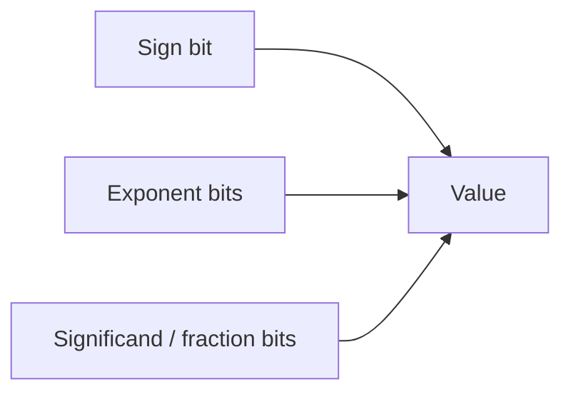
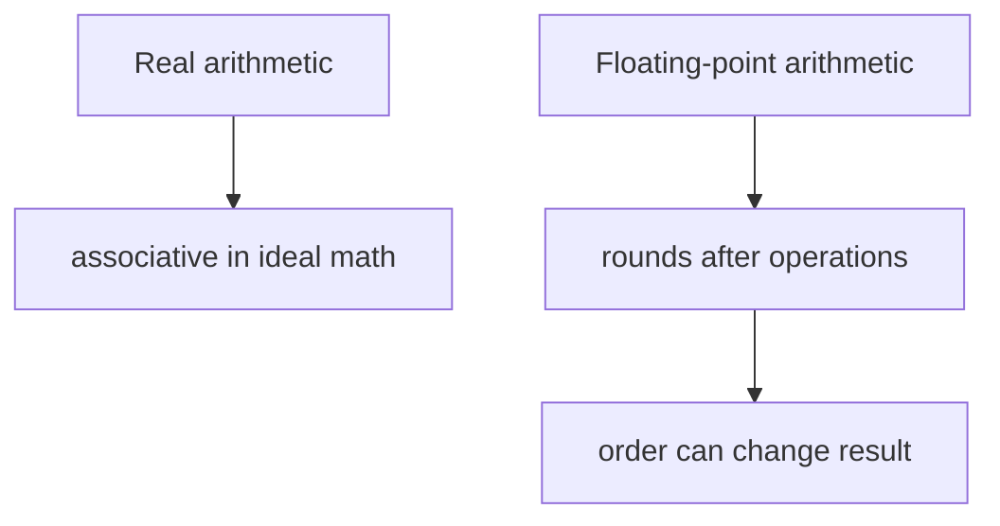

# Part 006 — Floating Point: `float`, `double`, IEEE 754

> Target part ini: memahami `float` dan `double` sebagai **aproksimasi numerik berbasis binary floating-point**, bukan decimal number biasa. Fokusnya adalah precision, rounding, NaN, infinity, signed zero, comparison, determinisme, dan kapan harus meninggalkan floating point untuk `BigDecimal`, integer minor unit, atau domain value object.

Floating point adalah salah satu topik yang sering terlihat “matematis”, tetapi dampaknya sangat praktis:

- total uang meleset;
- threshold risk salah;
- sorting tidak stabil karena NaN;
- equality test flaky;
- hasil agregasi berbeda karena urutan operasi;
- `-0.0` muncul di output;
- `Infinity` bocor ke JSON;
- audit report tidak bisa direkonsiliasi;
- perhitungan scientific/ML/geo terlihat “aneh” karena precision loss.

Engineer top-tier tidak perlu menjadi ahli numerical analysis untuk semua kasus, tetapi wajib punya mental model yang cukup untuk tahu kapan `double` aman, kapan berbahaya, dan bagaimana mendesain boundary yang jujur.

## 1. Mental Model Utama

`float` dan `double` bukan real number. Keduanya adalah representasi finite dari subset bilangan rasional berbasis pangkat dua.

Bukan:

```text
double = bilangan desimal presisi tinggi
```

Melainkan:

```text
double = finite binary floating-point approximation with sign, exponent, significand
```

Model konseptual:

```text
value ≈ sign × significand × 2^exponent
```

Karena basisnya 2, banyak desimal sederhana tidak bisa direpresentasikan persis.

```java
System.out.println(0.1 + 0.2); // 0.30000000000000004
```

Ini bukan bug Java. Ini konsekuensi representasi binary floating-point.

## 2. `float` vs `double`

| Type | Conceptual IEEE 754 Format | Size | Approx Decimal Precision | Typical Use | Main Risk |
|---|---|---:|---:|---|---|
| `float` | binary32 | 32 bit | sekitar 6-7 digit decimal | graphics, ML tensor, compact large arrays | precision rendah |
| `double` | binary64 | 64 bit | sekitar 15-17 digit decimal | general scientific/engineering approximation | tetap bukan decimal exact |

Default floating-point literal tanpa suffix adalah `double`:

```java
double a = 1.5;
float b = 1.5f;
```

Tanpa `f`, literal `1.5` bertipe `double`:

```java
// float x = 1.5; // compile error
float x = 1.5f;
```

## 3. Struktur Floating Point

Secara konseptual, floating point menyimpan:



Untuk binary64 `double`:

```text
1 sign bit + 11 exponent bits + 52 fraction bits
```

Untuk binary32 `float`:

```text
1 sign bit + 8 exponent bits + 23 fraction bits
```

Konsekuensi penting:

1. precision tidak konstan untuk semua magnitude;
2. semakin besar angka, jarak antar representable values makin besar;
3. tidak semua integer besar bisa direpresentasikan persis;
4. decimal fraction seperti 0.1 biasanya hanya aproksimasi;
5. operasi arithmetic bisa membulatkan di setiap langkah.

## 4. Decimal Fraction Trap

Contoh klasik:

```java
double x = 0.1;
double y = 0.2;
double z = x + y;

System.out.println(z); // 0.30000000000000004
```

Kenapa?

`0.1` dalam binary adalah pecahan berulang, seperti `1/3` dalam decimal.

```text
0.1 decimal ≈ 0.000110011001100110011... binary
```

Karena bit terbatas, Java menyimpan nilai terdekat yang bisa direpresentasikan.

Yang harus diubah bukan “cara print”, tetapi **asumsi domain**.

Jika domain membutuhkan decimal exact, seperti uang, tax, interest posting, regulatory fee, atau settlement, jangan gunakan `double` sebagai representasi utama.

## 5. Floating Point Cocok Untuk Apa?

Gunakan `double` ketika domain menerima approximation:

- geospatial distance approximation;
- ranking score;
- probability;
- statistical aggregate;
- sensor reading;
- simulation;
- ML feature;
- physical measurement;
- performance metric;
- percentile/latency summary;
- UI chart value.

Gunakan `float` ketika:

- memory bandwidth lebih penting daripada precision;
- data sangat besar;
- domain memang 32-bit float, misalnya beberapa format ML/graphics;
- interop protocol mengharuskan float.

Hindari `float`/`double` untuk:

- uang exact;
- jumlah unit yang harus integer;
- ID;
- sequence;
- legal deadline;
- audit total yang harus reconcile persis;
- database key;
- equality-critical state machine;
- domain dengan rounding policy eksplisit.

## 6. Integer yang Tidak Lagi Presisi

`double` bisa merepresentasikan semua integer secara persis hanya sampai batas tertentu. Setelah itu, jarak antar representable values lebih dari 1.

Contoh:

```java
double a = 9_007_199_254_740_992d; // 2^53
double b = a + 1;

System.out.println(a == b); // true
```

Karena `2^53 + 1` tidak bisa dibedakan dari `2^53` dalam binary64.

Konsekuensi boundary:

- jangan kirim Java `long` besar sebagai JSON number ke JavaScript jika consumer memakai `Number`;
- jangan simpan ID sebagai `double`;
- jangan pakai `double` untuk sequence atau version.

## 7. Rounding Error dan Error Accumulation

Setiap operasi floating-point bisa membulatkan.

```java
double sum = 0.0;
for (int i = 0; i < 10; i++) {
    sum += 0.1;
}
System.out.println(sum); // 0.9999999999999999
```

Untuk agregasi besar, urutan operasi bisa mempengaruhi hasil:

```java
double a = 1e16;
double b = -1e16;
double c = 1.0;

System.out.println((a + b) + c); // 1.0
System.out.println(a + (b + c)); // 0.0
```

Ini melanggar intuisi associativity matematika, tetapi legal untuk floating-point.

Mental model:



## 8. Equality: Jangan Pakai `==` Untuk Approximation

Buruk:

```java
if (actual == expected) {
    approve();
}
```

Lebih baik untuk approximation:

```java
static boolean approximatelyEqual(double a, double b, double tolerance) {
    return Math.abs(a - b) <= tolerance;
}
```

Tetapi tolerance bukan magic universal. Ia harus domain-aware.

```java
boolean close = Math.abs(actual - expected) <= 0.000_001;
```

Pertanyaan review:

1. tolerance ini absolute atau relative?
2. apakah magnitude nilai bisa sangat besar/kecil?
3. apakah near zero punya perlakuan khusus?
4. apakah domain punya unit?
5. apakah tolerance berasal dari requirement atau asal pilih?

### 8.1 Relative Tolerance

Untuk nilai dengan magnitude bervariasi:

```java
static boolean nearlyEqual(double a, double b, double relTol, double absTol) {
    double diff = Math.abs(a - b);
    if (diff <= absTol) return true;
    return diff <= Math.max(Math.abs(a), Math.abs(b)) * relTol;
}
```

Gunakan kombinasi relative dan absolute tolerance agar near-zero tidak rusak.

## 9. NaN: Not-a-Number

NaN muncul dari operasi tidak terdefinisi secara floating-point:

```java
double x = 0.0 / 0.0;
System.out.println(x); // NaN
```

Properti penting:

```java
double nan = Double.NaN;
System.out.println(nan == nan); // false
System.out.println(Double.isNaN(nan)); // true
```

Jangan cek NaN dengan `==`.

Gunakan:

```java
if (Double.isNaN(value)) {
    throw new IllegalArgumentException("value must be a number");
}
```

### 9.1 NaN di Sorting dan Aggregation

NaN dapat merusak asumsi ordering.

```java
List<Double> values = List.of(1.0, Double.NaN, 2.0);
values.stream().max(Double::compareTo);
```

Pastikan policy jelas:

- NaN ditolak di boundary;
- NaN dianggap missing;
- NaN diletakkan terakhir;
- NaN dipertahankan sebagai signal;
- NaN dikonversi menjadi domain error.

Untuk sistem enterprise, paling sering: **tolak NaN sebelum masuk domain**.

```java
public record RiskScore(double value) {
    public RiskScore {
        if (!Double.isFinite(value)) {
            throw new IllegalArgumentException("risk score must be finite");
        }
        if (value < 0.0 || value > 1.0) {
            throw new IllegalArgumentException("risk score must be between 0 and 1");
        }
    }
}
```

`Double.isFinite` menolak NaN dan infinity.

## 10. Infinity

Floating-point punya infinity:

```java
double positive = 1.0 / 0.0;
double negative = -1.0 / 0.0;

System.out.println(positive); // Infinity
System.out.println(negative); // -Infinity
```

Ini berbeda dari integer division:

```java
// int x = 1 / 0; // ArithmeticException
```

Infinity bisa berguna di algoritma tertentu, misalnya initial shortest path distance. Tetapi di domain business, infinity biasanya invalid.

Boundary guard:

```java
static double requireFinite(double value, String field) {
    if (!Double.isFinite(value)) {
        throw new IllegalArgumentException(field + " must be finite");
    }
    return value;
}
```

## 11. Signed Zero: `0.0` dan `-0.0`

Floating-point punya positive zero dan negative zero.

```java
double z = -0.0;
System.out.println(z == 0.0); // true
System.out.println(1.0 / z);  // -Infinity
```

Signed zero bisa muncul dari underflow atau operasi tertentu.

Dalam banyak domain business, `-0.0` harus dinormalisasi sebelum output:

```java
static double normalizeZero(double value) {
    return value == 0.0 ? 0.0 : value;
}
```

Tetapi dalam numerical algorithms, signed zero kadang bermakna. Jangan hapus tanpa memahami domain.

## 12. Subnormal Numbers

Floating-point punya subnormal numbers untuk merepresentasikan nilai sangat kecil mendekati nol dengan precision terbatas.

Bagi aplikasi enterprise biasa, Anda jarang perlu memanipulasi subnormal secara eksplisit. Tetapi pahami efeknya:

- nilai sangat kecil tidak langsung menjadi nol;
- precision makin rendah dekat nol;
- beberapa operasi numerik sensitif bisa terdampak performance/precision;
- always-strict semantics membuat hasil lebih konsisten lintas platform modern.

Jika domain Anda simulation/scientific/HFT/ML runtime, subnormal bukan detail akademis.

## 13. Floating-Point Literals

Contoh literal:

```java
double a = 1.0;
double b = 1e3;
double c = 1.23e-4;
float d = 1.0f;
double hex = 0x1.0p3; // 8.0
```

Hexadecimal floating-point literal berguna untuk nilai binary yang presisi:

```java
double exact = 0x1.0p-1; // 0.5
```

Tetapi dalam aplikasi biasa, decimal literal lebih terbaca.

## 14. Casting dan Conversion

Floating-point conversion bisa kehilangan informasi.

```java
double d = 123456789.123;
float f = (float) d;
System.out.println(f); // precision loss
```

Integral ke floating-point:

```java
long id = 9_007_199_254_740_993L;
double asDouble = id;
long back = (long) asDouble;

System.out.println(id == back); // false
```

Jangan gunakan `double` sebagai perantara untuk `long` ID.

Floating-point ke integral:

```java
double value = 12.9;
int x = (int) value; // 12, truncates toward zero
```

Bukan rounding.

Untuk rounding eksplisit:

```java
long rounded = Math.round(value);
int floor = (int) Math.floor(value);
int ceil = (int) Math.ceil(value);
```

Tetapi untuk uang dan audit, gunakan policy rounding berbasis `BigDecimal`.

## 15. `Math`, `StrictMath`, dan `strictfp`

Secara historis, Java memiliki konsep strict dan non-strict floating-point semantics. Keyword `strictfp` dipakai untuk meminta hasil floating-point yang konsisten sesuai strict semantics pada platform lama.

Sejak Java 17, JEP 306 mengembalikan **always-strict floating-point semantics**. Artinya, pada Java modern, `strictfp` pada umumnya menjadi historis/redundan untuk kebanyakan kode baru.

Praktik modern:

- jangan tambahkan `strictfp` ke kode baru kecuali ada alasan compatibility/source-level tertentu;
- tetap pahami floating-point rounding dan special values;
- untuk fungsi matematika, `Math` biasanya pilihan default;
- `StrictMath` ada untuk definisi yang lebih ketat/portable pada operasi tertentu dan memiliki kontrak sendiri di API.

Contoh:

```java
double x = Math.sqrt(2.0);
double y = StrictMath.sqrt(2.0);
```

Jangan jadikan `StrictMath` sebagai obat untuk bug decimal money. Masalah money bukan strictness; masalahnya adalah binary floating-point bukan decimal exact.

## 16. `Double.compare`, `compareTo`, dan Ordering

Jangan mengimplementasikan comparator floating-point dengan subtraction.

Buruk:

```java
Comparator<Double> c = (a, b) -> (int) (a - b);
```

Masalah:

- truncation;
- overflow concept;
- NaN handling;
- signed zero;
- nilai kecil dianggap sama.

Gunakan:

```java
Comparator<Double> c = Double::compare;
```

Untuk object domain:

```java
public record RiskScore(double value) implements Comparable<RiskScore> {
    public RiskScore {
        if (!Double.isFinite(value)) throw new IllegalArgumentException("finite required");
        if (value < 0.0 || value > 1.0) throw new IllegalArgumentException("range 0..1 required");
    }

    @Override
    public int compareTo(RiskScore other) {
        return Double.compare(this.value, other.value);
    }
}
```

Karena constructor menolak NaN/infinity, ordering domain lebih sederhana.

## 17. Hashing dan Equality untuk Floating Fields

Record dengan `double` field memakai equality berdasarkan primitive value semantics yang punya edge cases.

```java
public record Measurement(double value) { }
```

Pertanyaan desain:

1. apakah dua value dianggap sama jika selisih kecil?
2. apakah `NaN` boleh masuk?
3. apakah `-0.0` sama dengan `0.0` secara domain?
4. apakah object ini akan menjadi key map/set?

Untuk domain approximate, jangan jadikan raw `double` sebagai key tanpa normalisasi.

Contoh normalized value object:

```java
public record TemperatureCelsius(double value) {
    public TemperatureCelsius {
        if (!Double.isFinite(value)) throw new IllegalArgumentException("finite required");
        value = value == 0.0 ? 0.0 : value;
    }
}
```

Untuk bucketing:

```java
public record ScoreBucket(int basisPoints) {
    public static ScoreBucket fromScore(double score) {
        if (!Double.isFinite(score)) throw new IllegalArgumentException("finite required");
        if (score < 0.0 || score > 1.0) throw new IllegalArgumentException("range 0..1 required");
        return new ScoreBucket((int) Math.round(score * 10_000));
    }
}
```

Di sini equality memakai integer bucket, bukan raw double.

## 18. Uang: Jangan Gunakan `double`

Buruk:

```java
double amount = 0.1 + 0.2;
```

Untuk uang, pilihan umum:

1. `long` minor units, misalnya cents;
2. `BigDecimal` dengan scale dan rounding policy;
3. domain value object yang membungkus amount + currency.

Contoh minor unit:

```java
public record MoneyMinor(String currency, long minorUnits) {
    public MoneyMinor {
        if (currency == null || currency.isBlank()) {
            throw new IllegalArgumentException("currency required");
        }
    }

    public MoneyMinor plus(MoneyMinor other) {
        if (!currency.equals(other.currency)) {
            throw new IllegalArgumentException("currency mismatch");
        }
        return new MoneyMinor(currency, Math.addExact(minorUnits, other.minorUnits));
    }
}
```

Contoh `BigDecimal` akan dibahas lebih dalam di Part 023. Untuk sekarang, prinsipnya:

```text
Jika decimal exact dan rounding policy penting, floating point bukan representasi domain utama.
```

## 19. Percent, Rate, Probability

`double` sering cocok untuk probability atau score, tetapi tetap perlu boundary.

Buruk:

```java
void approve(double riskScore) { }
```

Lebih baik:

```java
public record Probability(double value) {
    public Probability {
        if (!Double.isFinite(value)) throw new IllegalArgumentException("finite required");
        if (value < 0.0 || value > 1.0) throw new IllegalArgumentException("probability must be 0..1");
    }
}
```

Atau untuk percentage human-facing:

```java
public record PercentageBasisPoints(int value) {
    public PercentageBasisPoints {
        if (value < 0 || value > 10_000) {
            throw new IllegalArgumentException("percentage must be 0..10000 basis points");
        }
    }
}
```

Keduanya valid tergantung kebutuhan:

- `double` cocok untuk continuous approximation;
- basis points cocok untuk discrete business rule dan stable equality.

## 20. Aggregation: Sum, Average, Percentile

Floating aggregation punya error accumulation.

Naive sum:

```java
double sum = 0.0;
for (double v : values) {
    sum += v;
}
```

Untuk banyak kasus enterprise metric, ini cukup. Untuk numerical-sensitive computation, pertimbangkan teknik seperti compensated summation.

Contoh Kahan summation:

```java
public static double kahanSum(double[] values) {
    double sum = 0.0;
    double c = 0.0;

    for (double value : values) {
        double y = value - c;
        double t = sum + y;
        c = (t - sum) - y;
        sum = t;
    }

    return sum;
}
```

Kahan bukan solusi universal, tetapi menunjukkan pola pikir: **urutan dan metode agregasi mempengaruhi hasil**.

## 21. Serialization Boundary

JSON mendukung number secara abstrak, tetapi implementasi consumer bisa berbeda.

Risiko:

- `NaN`/`Infinity` bukan JSON number standar;
- `double` bisa dibulatkan berbeda saat parse/serialize;
- trailing decimal bisa berubah;
- ID besar sebagai number kehilangan presisi;
- `-0.0` bisa muncul sebagai output mengejutkan.

Boundary policy:

```java
public record MetricResponse(double p95LatencyMillis) {
    public MetricResponse {
        if (!Double.isFinite(p95LatencyMillis)) {
            throw new IllegalArgumentException("latency must be finite");
        }
        p95LatencyMillis = p95LatencyMillis == 0.0 ? 0.0 : p95LatencyMillis;
    }
}
```

Untuk amount:

```java
public record AmountResponse(String currency, String decimalAmount) { }
```

Atau:

```java
public record AmountResponse(String currency, long minorUnits) { }
```

## 22. Database Boundary

Database `FLOAT`, `REAL`, `DOUBLE PRECISION`, dan `NUMERIC/DECIMAL` punya semantics berbeda.

Mapping umum:

| Database Type | Java Candidate | Semantics |
|---|---|---|
| `REAL` / 32-bit float | `float` | approximate |
| `DOUBLE PRECISION` | `double` | approximate |
| `NUMERIC` / `DECIMAL` | `BigDecimal` | decimal exact-ish with precision/scale |
| integer minor unit | `long` | exact integer amount |

Jika column adalah amount uang, jangan mapping ke `double` hanya karena “angka”. Gunakan `BigDecimal` atau minor unit.

Jika column adalah sensor value atau score, `double` bisa masuk akal.

## 23. API Design: Jangan Bocorkan Raw Double Tanpa Semantics

Buruk:

```java
public record DecisionRequest(double score, double threshold) { }
```

Lebih baik:

```java
public record DecisionRequest(RiskScore score, RiskThreshold threshold) { }
```

Atau di DTO layer:

```java
public record DecisionRequestDto(double score, double threshold) {
    public DecisionRequest toDomain() {
        return new DecisionRequest(new RiskScore(score), new RiskThreshold(threshold));
    }
}
```

Domain boundary memvalidasi:

```java
public record RiskThreshold(double value) {
    public RiskThreshold {
        if (!Double.isFinite(value)) throw new IllegalArgumentException("finite required");
        if (value < 0.0 || value > 1.0) throw new IllegalArgumentException("range 0..1 required");
    }
}
```

## 24. Testing Floating-Point Code

Jangan test approximation dengan exact equality kecuali Anda benar-benar mengecek special behavior.

Buruk:

```java
assertEquals(0.3, 0.1 + 0.2);
```

Lebih baik:

```java
assertEquals(0.3, 0.1 + 0.2, 1e-12);
```

Untuk domain value object:

```java
assertThrows(IllegalArgumentException.class, () -> new RiskScore(Double.NaN));
assertThrows(IllegalArgumentException.class, () -> new RiskScore(Double.POSITIVE_INFINITY));
assertThrows(IllegalArgumentException.class, () -> new RiskScore(-0.1));
assertThrows(IllegalArgumentException.class, () -> new RiskScore(1.1));
```

Test edge cases:

- `NaN`;
- positive infinity;
- negative infinity;
- `0.0`;
- `-0.0`;
- very small value;
- very large value;
- boundary range exactly 0 and 1;
- repeated addition;
- serialization round-trip.

## 25. Failure Modes

| Failure Mode | Example | Impact | Mitigation |
|---|---|---|---|
| Decimal expectation | `0.1 + 0.2 != 0.3` | audit mismatch | `BigDecimal` / minor unit |
| Exact equality | `actual == expected` | flaky branch/test | tolerance or discrete representation |
| NaN propagation | invalid operation produces NaN | sorting/aggregation broken | reject with `Double.isFinite` |
| Infinity leak | divide by zero | invalid API response | finite guard |
| Signed zero surprise | `-0.0` output | confusing UI/API | normalize if domain allows |
| Precision loss for ID | `long -> double -> long` | ID corruption | never use double for ID |
| Order-sensitive sum | aggregation changes result | inconsistent metrics | stable algorithm / acceptance tolerance |
| Wrong DB mapping | DECIMAL to double | financial loss | `BigDecimal`/minor unit |
| Comparator subtraction | `(int)(a-b)` | wrong sort | `Double.compare` |
| Tolerance cargo cult | arbitrary epsilon | false pass/fail | domain-aware tolerance |

## 26. Review Checklist

Saat melihat `float` atau `double`, tanyakan:

1. Apakah domain menerima approximation?
2. Apakah value harus finite?
3. Apakah NaN punya makna atau harus ditolak?
4. Apakah infinity boleh muncul?
5. Apakah `-0.0` harus dinormalisasi?
6. Apakah equality exact diperlukan?
7. Jika perlu equality, apakah sebaiknya representasi discrete seperti basis points?
8. Apakah value ini uang, ID, count, sequence, atau legal deadline? Jika ya, mengapa floating point?
9. Apakah serialization format mendukung special values?
10. Apakah database type approximate atau decimal exact?
11. Apakah test memakai tolerance yang sesuai domain?
12. Apakah agregasi besar butuh algoritma lebih stabil?
13. Apakah `float` dipilih karena alasan nyata, bukan kebiasaan?
14. Apakah public API perlu value object agar semantics tidak hilang?

## 27. Deliberate Practice

### Latihan 1 — Temukan Bug Decimal

Apa output ini dan kenapa?

```java
System.out.println(0.1 + 0.2 == 0.3);
System.out.println(0.1 + 0.2);
```

Jawaban konseptual:

- equality false;
- hasil sekitar `0.30000000000000004`;
- karena decimal fraction tidak direpresentasikan exact dalam binary floating-point.

### Latihan 2 — Buat Value Object Score

Implementasikan `RiskScore`:

- menerima `double`;
- harus finite;
- range 0..1;
- normalize `-0.0` menjadi `0.0`;
- implement `Comparable`.

Solusi:

```java
public record RiskScore(double value) implements Comparable<RiskScore> {
    public RiskScore {
        if (!Double.isFinite(value)) throw new IllegalArgumentException("finite required");
        if (value < 0.0 || value > 1.0) throw new IllegalArgumentException("range 0..1 required");
        value = value == 0.0 ? 0.0 : value;
    }

    @Override
    public int compareTo(RiskScore other) {
        return Double.compare(this.value, other.value);
    }
}
```

### Latihan 3 — Ganti Equality dengan Tolerance

Perbaiki:

```java
boolean matches(double actual, double expected) {
    return actual == expected;
}
```

Menjadi:

```java
boolean matches(double actual, double expected) {
    return nearlyEqual(actual, expected, 1e-9, 1e-12);
}
```

Dengan helper:

```java
static boolean nearlyEqual(double a, double b, double relTol, double absTol) {
    double diff = Math.abs(a - b);
    if (diff <= absTol) return true;
    return diff <= Math.max(Math.abs(a), Math.abs(b)) * relTol;
}
```

### Latihan 4 — Tolak Special Values di DTO

```java
public record MetricDto(double latencyMillis) {
    public MetricDto {
        if (!Double.isFinite(latencyMillis)) {
            throw new IllegalArgumentException("latencyMillis must be finite");
        }
        if (latencyMillis < 0.0) {
            throw new IllegalArgumentException("latencyMillis must not be negative");
        }
        latencyMillis = latencyMillis == 0.0 ? 0.0 : latencyMillis;
    }
}
```

### Latihan 5 — Ubah Money dari Double

Ubah:

```java
record Payment(String currency, double amount) { }
```

Menjadi salah satu:

```java
record Payment(String currency, long minorUnits) { }
```

atau:

```java
record Payment(String currency, BigDecimal amount) { }
```

Lalu tuliskan rounding policy di satu tempat, bukan tersebar.

## 28. Mini Production Postmortem

### Incident

Laporan regulatory fee bulanan berbeda antara service A dan service B. Selisih kecil, tetapi audit menolak karena total tidak reconcile.

Service A:

```java
double total = items.stream()
    .mapToDouble(Item::fee)
    .sum();
```

Service B:

```java
double total = 0.0;
for (Item item : sortedDifferently) {
    total += item.fee();
}
```

### Root Cause

- fee uang direpresentasikan sebagai `double`;
- aggregation order berbeda;
- tidak ada rounding policy eksplisit;
- report butuh decimal exact, tetapi model memakai approximation;
- test hanya membandingkan tolerance, sementara audit membutuhkan exact reconciliation.

### Fix

Gunakan minor units atau `BigDecimal` dengan policy eksplisit.

```java
public record FeeMinor(long cents) {
    public FeeMinor plus(FeeMinor other) {
        return new FeeMinor(Math.addExact(this.cents, other.cents));
    }
}
```

Aggregation:

```java
FeeMinor total = items.stream()
    .map(Item::fee)
    .reduce(new FeeMinor(0), FeeMinor::plus);
```

### Lesson

Floating point bukan salah. Yang salah adalah memakai approximation untuk domain yang membutuhkan exact decimal reconciliation.

## 29. Ringkasan

Poin utama:

1. `float` dan `double` adalah binary floating-point approximation.
2. `double` lebih presisi dari `float`, tetapi tetap bukan decimal exact.
3. Decimal seperti `0.1` sering tidak bisa direpresentasikan persis.
4. Operasi floating-point tidak selalu associative karena rounding.
5. Jangan gunakan exact equality untuk hasil approximation.
6. NaN tidak sama dengan dirinya sendiri; gunakan `Double.isNaN` atau `Double.isFinite`.
7. Infinity legal untuk floating-point division by zero, tetapi biasanya invalid untuk domain business.
8. Signed zero bisa muncul dan perlu policy.
9. Jangan gunakan floating-point untuk uang, ID, sequence, legal deadline, atau count exact.
10. Sejak Java 17, Java mengembalikan always-strict floating-point semantics; `strictfp` umumnya historis untuk kode modern.
11. Untuk API/domain, bungkus `double` dalam value object bila semantics penting.
12. Untuk audit/exact decimal, gunakan `BigDecimal` atau integer minor unit.

## 30. Referensi Resmi

- Java Language Specification, Java SE 25, Chapter 4 — Types, Values, and Variables: `https://docs.oracle.com/javase/specs/jls/se25/html/jls-4.html`
- Java Language Specification, Java SE 25, Chapter 5 — Conversions and Contexts: `https://docs.oracle.com/javase/specs/jls/se25/html/jls-5.html`
- Java SE 25 API, `java.lang.Double`: `https://docs.oracle.com/en/java/javase/25/docs/api/java.base/java/lang/Double.html`
- Java SE 25 API, `java.lang.Float`: `https://docs.oracle.com/en/java/javase/25/docs/api/java.base/java/lang/Float.html`
- Java SE 25 API, `java.lang.Math`: `https://docs.oracle.com/en/java/javase/25/docs/api/java.base/java/lang/Math.html`
- Java SE 25 API, `java.lang.StrictMath`: `https://docs.oracle.com/en/java/javase/25/docs/api/java.base/java/lang/StrictMath.html`
- OpenJDK JEP 306 — Restore Always-Strict Floating-Point Semantics: `https://openjdk.org/jeps/306`
