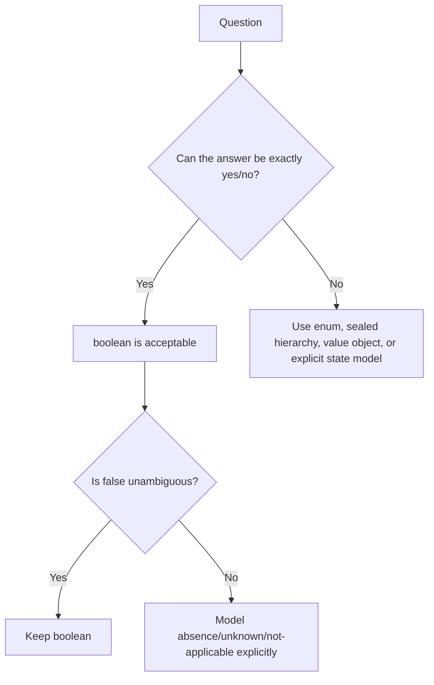
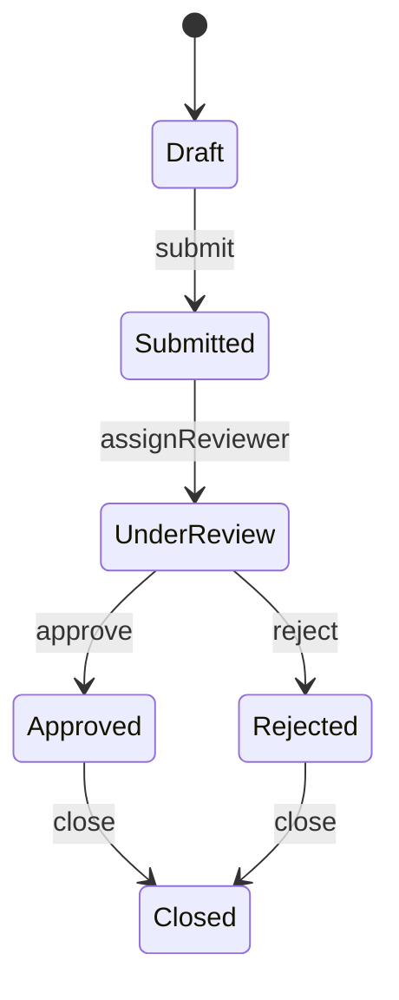

# Part 007 — Boolean Logic, Truth & Domain Flags

> Target part ini: memahami `boolean` bukan sekadar tipe `true/false`, tetapi sebagai alat modeling keputusan. Kita akan membedakan **truth**, **state**, **flag**, **predicate**, **decision**, dan **domain invariant**. Fokusnya bukan syntax dasar, melainkan bagaimana `boolean` dapat membuat API jelas, atau sebaliknya membuat sistem enterprise rapuh karena flag explosion, tri-state ambiguity, dan hidden workflow state.

## 1. Mengapa `boolean` Perlu Dibahas Serius?

`boolean` terlihat tipe paling sederhana di Java. Hanya ada dua nilai: `true` dan `false`.

Namun di sistem nyata, banyak bug bukan karena engineer tidak tahu cara memakai `if`, tetapi karena mereka salah memodelkan **makna** dari `true` dan `false`.

Contoh:

```java
record CaseRecord(
    String caseId,
    boolean active,
    boolean locked,
    boolean approved,
    boolean rejected,
    boolean escalated,
    boolean archived
) { }
```

Model ini terlihat mudah, tetapi menyembunyikan banyak pertanyaan:

- Apakah `approved=true` dan `rejected=true` boleh terjadi bersamaan?
- Apakah `archived=true` berarti `active=false`?
- Apakah `locked=true` selalu berarti tidak bisa dimodifikasi?
- Apakah `escalated=true` adalah status saat ini, atau pernah terjadi di masa lalu?
- Apakah `false` berarti “tidak”, “belum diketahui”, “belum diproses”, atau “tidak berlaku”?

`boolean` menjadi berbahaya ketika dipakai untuk merepresentasikan **domain state yang lebih kaya dari dua kemungkinan**.

## 2. Mental Model: Boolean Bukan State Machine

Gunakan mental model berikut:



`boolean` cocok jika pertanyaannya benar-benar biner dan `false` punya makna yang jelas.

Contoh yang relatif aman:

```java
boolean isEmpty();
boolean hasExpired(Instant now);
boolean canApprove(User user, CaseFile caseFile);
boolean containsKey(String key);
```

Contoh yang mencurigakan:

```java
boolean status;
boolean processed;
boolean valid;
boolean enabled;
boolean completed;
```

Nama-nama tersebut sering tidak cukup menjelaskan domain. `processed=false` dapat berarti belum diproses, gagal diproses, sengaja dilewati, sedang diproses, atau tidak eligible untuk diproses.

## 3. Semantik Formal `boolean` di Java

Di Java, `boolean` adalah primitive type yang nilainya hanya `true` atau `false`.

Tidak seperti C/C++, Java tidak memperlakukan angka sebagai boolean.

Kode ini tidak valid:

```java
int count = 1;

if (count) { // compile error
    System.out.println("has count");
}
```

Harus eksplisit:

```java
if (count > 0) {
    System.out.println("has count");
}
```

Ini adalah desain bahasa yang baik: Java memaksa predicate ditulis sebagai ekspresi boolean, bukan implicit truthiness.

### 3.1 Tidak Ada Konversi Numerik ke Boolean

`boolean` tidak bisa dikonversi ke `int`, dan `int` tidak bisa dikonversi ke `boolean`.

```java
boolean approved = true;
// int x = approved;      // compile error
// boolean b = 1;         // compile error
```

Jika butuh mapping eksplisit:

```java
int approvedCode = approved ? 1 : 0;
boolean approvedFromCode = approvedCode == 1;
```

Tetapi di domain enterprise, mapping seperti ini sebaiknya berada di boundary adapter, bukan menyebar ke business logic.

## 4. Default Value: `false` Tidak Selalu Aman

Field instance, field static, dan elemen array bertipe `boolean` memiliki default value `false`.

```java
final class ApprovalState {
    private boolean approved; // default false
}
```

Masalahnya: default `false` sering disalahartikan sebagai keputusan domain.

Apakah `approved=false` berarti:

1. belum direview;
2. sudah direview dan ditolak;
3. tidak perlu approval;
4. approval belum diminta;
5. data belum dimuat dari DB?

Jika jawabannya bukan satu makna yang jelas, `boolean` adalah tipe yang salah.

Lebih baik:

```java
enum ApprovalStatus {
    NOT_REQUESTED,
    PENDING_REVIEW,
    APPROVED,
    REJECTED,
    NOT_APPLICABLE
}
```

Atau lebih eksplisit dengan record:

```java
record ApprovalDecision(
    ApprovalOutcome outcome,
    OfficerId decidedBy,
    Instant decidedAt,
    String reason
) { }

enum ApprovalOutcome {
    APPROVED,
    REJECTED
}
```

Perbedaannya penting: `ApprovalStatus` menyatakan posisi lifecycle, sedangkan `ApprovalDecision` menyatakan event/decision yang memiliki metadata.

## 5. Local Variable: Compiler Memaksa Definite Assignment

Local variable tidak mendapat default value. Java memaksa definite assignment.

```java
void review(CaseFile file) {
    boolean allowed;

    if (file.isLocked()) {
        allowed = false;
    }

    // System.out.println(allowed); // compile error, maybe not initialized
}
```

Ini melindungi kita dari pembacaan nilai tidak terinisialisasi.

Namun jangan jadikan pola berikut sebagai default:

```java
boolean allowed = false;

if (!file.isLocked()) {
    allowed = policy.canReview(file);
}
```

Kadang lebih jelas memakai early return:

```java
boolean canReview(CaseFile file) {
    if (file.isLocked()) {
        return false;
    }
    return policy.canReview(file);
}
```

Atau expression-oriented style:

```java
boolean allowed = !file.isLocked() && policy.canReview(file);
```

## 6. `boolean` vs `Boolean`

`boolean` adalah primitive.

`Boolean` adalah wrapper class.

```java
boolean primitiveFlag = true;
Boolean wrapperFlag = Boolean.TRUE;
```

Perbedaan penting:

| Aspek | `boolean` | `Boolean` |
|---|---|---|
| Nilai | `true` / `false` | `Boolean.TRUE` / `Boolean.FALSE` / `null` |
| Default field | `false` | `null` |
| Bisa null | Tidak | Ya |
| Autounboxing risk | Tidak | Ya |
| Cocok untuk domain flag internal | Ya, jika biner | Hati-hati |
| Cocok untuk representasi unknown | Tidak | Bisa, tetapi sering buruk jika tidak eksplisit |

### 6.1 Autounboxing NPE

Kode ini terlihat aman, tetapi bisa melempar `NullPointerException`:

```java
Boolean enabled = loadFeatureFlag();

if (enabled) { // autounboxing; NPE jika enabled == null
    activate();
}
```

Lebih eksplisit:

```java
if (Boolean.TRUE.equals(enabled)) {
    activate();
}
```

Namun pertanyaan desainnya: apakah `null` adalah makna domain?

Jika iya, beri nama eksplisit:

```java
enum FeatureDecision {
    ENABLED,
    DISABLED,
    UNDECIDED
}
```

Jika tidak, jangan biarkan `null` bocor:

```java
boolean enabled = Optional.ofNullable(loadFeatureFlag())
    .orElse(false);
```

Tetapi defaulting seperti ini hanya aman jika `false` benar-benar kebijakan fallback.

## 7. Tri-State Trap

`Boolean` sering dipakai untuk merepresentasikan tiga keadaan:

- `true`;
- `false`;
- `null`.

Masalahnya, `null` tidak punya nama domain. Ia memaksa pembaca menebak.

```java
record CustomerConsent(Boolean consentGiven) { }
```

Apa arti `null`?

- Belum ditanya?
- Menolak menjawab?
- Data lama belum dimigrasi?
- Tidak berlaku untuk pelanggan ini?
- Field tidak dikirim client?

Model yang lebih baik:

```java
enum ConsentStatus {
    GIVEN,
    DENIED,
    NOT_ASKED,
    NOT_APPLICABLE,
    UNKNOWN_LEGACY_DATA
}
```

Atau jika status membutuhkan metadata:

```java
sealed interface Consent permits Consent.Given, Consent.Denied, Consent.NotAsked, Consent.NotApplicable {

    record Given(Instant givenAt, ConsentSource source) implements Consent { }

    record Denied(Instant deniedAt, ConsentSource source) implements Consent { }

    record NotAsked() implements Consent { }

    record NotApplicable(String reason) implements Consent { }
}
```

Gunakan `Boolean` nullable hanya di boundary tertentu, misalnya DTO patch request yang memang perlu membedakan:

1. field tidak dikirim;
2. field dikirim `true`;
3. field dikirim `false`;
4. field dikirim `null` secara eksplisit.

Tetapi begitu masuk domain layer, ubah ke model eksplisit.

## 8. Predicate Naming: Nama Harus Membaca Seperti Pertanyaan

Boolean paling mudah dipahami ketika namanya berupa predicate.

Bagus:

```java
boolean isActive;
boolean hasExpired;
boolean canApprove;
boolean shouldNotify;
boolean requiresManualReview;
boolean wasEscalated;
```

Buruk:

```java
boolean active;
boolean expired;
boolean approve;
boolean notification;
boolean manualReview;
boolean escalation;
```

Bukan berarti semua nama tanpa `is` buruk. Dalam record, `active` bisa masih jelas. Namun untuk API yang dipakai luas, predicate-style naming mengurangi ambiguitas.

### 8.1 Hindari Negasi Ganda

Buruk:

```java
boolean isNotDisabled;
boolean hasNoViolations;
boolean isNotIneligible;
```

Ketika dipakai:

```java
if (!isNotDisabled) {
    ...
}
```

Pembaca harus melakukan inversi mental dua kali.

Lebih baik:

```java
boolean isEnabled;
boolean hasViolations;
boolean isEligible;
```

### 8.2 Bedakan `is`, `has`, `can`, `should`, `requires`, `was`

| Prefix | Makna Umum | Contoh |
|---|---|---|
| `is` | sifat/state saat ini | `isActive`, `isLocked` |
| `has` | kepemilikan/keberadaan | `hasAttachment`, `hasViolations` |
| `can` | capability/permission | `canApprove`, `canEscalate` |
| `should` | policy/recommendation | `shouldNotify`, `shouldRetry` |
| `requires` | kewajiban/constraint | `requiresManualReview` |
| `was` | fakta historis | `wasEscalated` |

Perbedaan ini penting. `canApprove` bukan sama dengan `shouldApprove`. Yang pertama menyatakan izin, yang kedua menyatakan rekomendasi/kebijakan.

## 9. Boolean Expression dan Short-Circuit

Java punya operator boolean:

| Operator | Nama | Short-circuit? |
|---|---|---|
| `!` | not | tidak relevan |
| `&&` | conditional AND | Ya |
| `||` | conditional OR | Ya |
| `&` | logical AND / bitwise AND | Tidak untuk boolean |
| `|` | logical OR / bitwise OR | Tidak untuk boolean |
| `^` | logical XOR / bitwise XOR | Tidak short-circuit |

Gunakan `&&` dan `||` untuk hampir semua predicate bisnis.

```java
if (user != null && user.isActive()) {
    ...
}
```

Ekspresi kedua tidak dievaluasi jika `user == null`.

Bandingkan:

```java
if (user != null & user.isActive()) { // risky
    ...
}
```

Operator `&` tetap mengevaluasi kedua sisi, sehingga dapat melempar NPE.

### 9.1 Jangan Menyembunyikan Side Effect di Predicate

Buruk:

```java
if (isEligible(caseFile) && markReviewed(caseFile)) {
    submit(caseFile);
}
```

`markReviewed` terdengar seperti command, bukan predicate. Lebih jelas:

```java
if (!isEligible(caseFile)) {
    return;
}

markReviewed(caseFile);
submit(caseFile);
```

Predicate idealnya **referentially transparent**: memanggilnya tidak mengubah state.

## 10. Boolean Return Type: Bagus untuk Query, Lemah untuk Diagnosis

Method seperti ini mudah dibaca:

```java
boolean canApprove(CaseFile caseFile, Officer officer);
```

Namun sering tidak cukup untuk sistem enterprise. Ketika return `false`, caller perlu tahu alasannya.

Lebih baik:

```java
ApprovalEligibility eligibility = approvalPolicy.evaluate(caseFile, officer);

if (!eligibility.allowed()) {
    audit.logRejection(caseFile.id(), eligibility.reasons());
    return;
}
```

Contoh model:

```java
record ApprovalEligibility(
    boolean allowed,
    List<RejectionReason> reasons
) {
    static ApprovalEligibility allowed() {
        return new ApprovalEligibility(true, List.of());
    }

    static ApprovalEligibility denied(List<RejectionReason> reasons) {
        if (reasons.isEmpty()) {
            throw new IllegalArgumentException("Denied eligibility must include reasons");
        }
        return new ApprovalEligibility(false, List.copyOf(reasons));
    }
}
```

Catatan desain: `allowed` tetap boolean, tetapi sekarang ia dibungkus dalam result type yang membawa alasan. Ini lebih baik daripada method boolean yang membuat diagnosis hilang.

## 11. Flag Parameter: API Smell Klasik

Flag parameter adalah parameter boolean yang mengubah perilaku method.

```java
void sendNotification(CaseFile caseFile, boolean urgent) { }
```

Masih mungkin diterima jika maknanya sangat jelas. Tetapi sering memburuk:

```java
void exportReport(boolean includeDrafts, boolean includeArchived, boolean compress, boolean maskSensitiveData) { }
```

Call site menjadi tidak terbaca:

```java
exportReport(true, false, true, true);
```

Apa arti `true, false, true, true`?

### 11.1 Refactoring: Enum atau Options Object

```java
enum DraftInclusion {
    EXCLUDE_DRAFTS,
    INCLUDE_DRAFTS
}

enum ArchiveInclusion {
    EXCLUDE_ARCHIVED,
    INCLUDE_ARCHIVED
}

record ReportExportOptions(
    DraftInclusion draftInclusion,
    ArchiveInclusion archiveInclusion,
    CompressionMode compressionMode,
    SensitiveDataMode sensitiveDataMode
) { }
```

Call site:

```java
exportReport(new ReportExportOptions(
    DraftInclusion.INCLUDE_DRAFTS,
    ArchiveInclusion.EXCLUDE_ARCHIVED,
    CompressionMode.GZIP,
    SensitiveDataMode.MASK
));
```

Lebih panjang, tetapi jauh lebih defensible.

### 11.2 Refactoring: Pisahkan Method

Jika boolean memilih dua perilaku yang benar-benar berbeda, pisahkan method.

Buruk:

```java
void closeCase(CaseId id, boolean force) { }
```

Lebih jelas:

```java
void closeCase(CaseId id) { }
void forceCloseCase(CaseId id, ForceCloseReason reason) { }
```

Perilaku force close biasanya punya audit, authorization, reason, dan rule berbeda. Boolean terlalu miskin untuk mewakilinya.

## 12. Boolean State Explosion

Setiap boolean menambah kemungkinan kombinasi dua kali lipat.

| Jumlah Boolean | Kombinasi Kemungkinan |
|---:|---:|
| 1 | 2 |
| 2 | 4 |
| 3 | 8 |
| 4 | 16 |
| 5 | 32 |
| 6 | 64 |

Tidak semua kombinasi valid.

Contoh:

```java
record CaseFlags(
    boolean submitted,
    boolean underReview,
    boolean approved,
    boolean rejected,
    boolean closed
) { }
```

Secara teknis ada 32 kombinasi. Domain mungkin hanya memperbolehkan 6 status.

Lebih baik:

```java
enum CaseStatus {
    DRAFT,
    SUBMITTED,
    UNDER_REVIEW,
    APPROVED,
    REJECTED,
    CLOSED
}
```

Atau state machine eksplisit:



`enum` menurunkan state space dari 32 kombinasi menjadi 6 nilai legal.

## 13. Boolean untuk Event History: `wasX` Berbeda dari `isX`

`isEscalated` dan `wasEscalated` berbeda.

```java
record CaseAuditSnapshot(
    boolean isEscalated,
    boolean wasEscalated
) { }
```

`isEscalated` berarti state saat ini.

`wasEscalated` berarti fakta historis.

Keduanya valid, tetapi jangan dicampur. Banyak bug muncul ketika flag historis dipakai sebagai state aktif.

Lebih baik simpan event history:

```java
record CaseEvent(
    CaseId caseId,
    CaseEventType type,
    Instant occurredAt,
    OfficerId actorId
) { }

enum CaseEventType {
    SUBMITTED,
    ESCALATED,
    DE_ESCALATED,
    APPROVED,
    REJECTED,
    CLOSED
}
```

Lalu hitung snapshot dari event history jika diperlukan.

## 14. Boolean di Regulatory / Enforcement Workflow

Dalam sistem enforcement lifecycle, boolean sering dipakai untuk keputusan yang seharusnya defensible.

Buruk:

```java
record EnforcementCase(
    String caseId,
    boolean violation,
    boolean penalty,
    boolean appeal,
    boolean urgent
) { }
```

Masalah:

- `violation=true` tidak menjelaskan jenis pelanggaran;
- `penalty=true` tidak menjelaskan penalty type;
- `appeal=true` tidak menjelaskan status appeal;
- `urgent=true` tidak menjelaskan dasar urgency;
- audit tidak tahu siapa memutuskan apa dan kapan.

Lebih baik:

```java
record ViolationFinding(
    ViolationType type,
    FindingSeverity severity,
    OfficerId foundBy,
    Instant foundAt,
    EvidenceReference evidence
) { }

record PenaltyDecision(
    PenaltyType type,
    Money amount,
    DecisionReason reason,
    OfficerId decidedBy,
    Instant decidedAt
) { }

enum AppealStatus {
    NOT_FILED,
    FILED,
    UNDER_REVIEW,
    ACCEPTED,
    REJECTED,
    WITHDRAWN
}
```

Boolean masih bisa muncul, tetapi sebagai predicate turunan:

```java
boolean hasActiveAppeal() {
    return appealStatus == AppealStatus.FILED || appealStatus == AppealStatus.UNDER_REVIEW;
}
```

## 15. Boolean sebagai Derived Value vs Stored Value

Sebelum menyimpan boolean, tanyakan:

> Apakah nilai ini fakta utama, atau bisa dihitung dari data lain?

Contoh:

```java
record Invoice(
    Money amount,
    Money paidAmount,
    boolean paid
) { }
```

`paid` bisa bertentangan dengan `amount` dan `paidAmount`.

Lebih aman:

```java
record Invoice(Money amount, Money paidAmount) {
    boolean isPaid() {
        return paidAmount.compareTo(amount) >= 0;
    }
}
```

Simpan boolean hanya jika:

1. ia adalah fakta bisnis yang tidak bisa dihitung;
2. ia adalah snapshot yang sengaja disimpan untuk audit/performance;
3. ada strategi konsistensi ketika data sumber berubah.

## 16. Boolean dan JSON / API Boundary

Dalam JSON, boolean terlihat sederhana:

```json
{
  "active": false
}
```

Tetapi boundary memiliki perbedaan penting:

1. field hadir dengan nilai `false`;
2. field hadir dengan nilai `null`;
3. field tidak hadir;
4. field hadir dengan tipe salah, misalnya string `"false"`.

Dalam create request, mungkin field wajib:

```java
record CreateUserRequest(boolean active) { }
```

Dalam patch request, primitive `boolean` sering salah karena tidak bisa membedakan “tidak dikirim” dari `false`.

Buruk untuk patch:

```java
record PatchUserRequest(boolean active) { }
```

Lebih eksplisit:

```java
record PatchUserRequest(Optional<Boolean> active) { }
```

Namun banyak framework JSON tidak ideal dengan `Optional` sebagai field DTO. Alternatif lebih eksplisit:

```java
record PatchUserRequest(Boolean active) { }
```

Lalu boundary adapter harus menerjemahkan `null` menjadi “not provided” atau “clear value” sesuai kontrak API. Jangan biarkan nullable `Boolean` bocor ke domain tanpa keputusan.

## 17. Boolean dan Database Boundary

Database sering punya kolom boolean, tinyint, char, atau enum-like string.

Contoh schema lemah:

```sql
is_active boolean not null default false
```

Default `false` dapat berbahaya jika active status harus ditentukan secara eksplisit. Default DB dapat membuat data invalid tampak valid.

Pertanyaan review:

- Apakah default `false` benar secara domain?
- Apakah ada migrasi legacy yang mengisi false padahal unknown?
- Apakah kolom boolean merepresentasikan state lifecycle yang seharusnya enum?
- Apakah ada constraint yang mencegah kombinasi flag invalid?

Contoh constraint jika tetap memakai beberapa boolean:

```sql
check (not (approved = true and rejected = true))
```

Namun jika state-nya tertutup, enum/status column biasanya lebih bersih:

```sql
status varchar(32) not null check (status in ('DRAFT', 'SUBMITTED', 'APPROVED', 'REJECTED'))
```

## 18. Boolean dan Concurrency

Boolean sering dipakai sebagai stop flag.

```java
final class Worker implements Runnable {
    private boolean running = true;

    public void stop() {
        running = false;
    }

    @Override
    public void run() {
        while (running) {
            doWork();
        }
    }
}
```

Ini bermasalah dalam concurrency karena thread worker belum tentu melihat update `running=false` tanpa synchronization/volatile.

Minimal:

```java
final class Worker implements Runnable {
    private volatile boolean running = true;

    public void stop() {
        running = false;
    }

    @Override
    public void run() {
        while (running) {
            doWork();
        }
    }
}
```

Atau:

```java
final class Worker implements Runnable {
    private final AtomicBoolean running = new AtomicBoolean(true);

    public void stop() {
        running.set(false);
    }

    @Override
    public void run() {
        while (running.get()) {
            doWork();
        }
    }
}
```

Namun hati-hati: `volatile boolean` dan `AtomicBoolean` cocok untuk flag sederhana, bukan lifecycle kompleks.

Buruk:

```java
AtomicBoolean started = new AtomicBoolean(false);
AtomicBoolean stopped = new AtomicBoolean(false);
AtomicBoolean paused = new AtomicBoolean(false);
AtomicBoolean failed = new AtomicBoolean(false);
```

Lebih baik pakai state enum dengan transition terkontrol:

```java
enum WorkerState {
    NEW,
    RUNNING,
    PAUSED,
    STOPPING,
    STOPPED,
    FAILED
}
```

## 19. Boolean dan Security / Authorization

Boolean return dalam authorization rawan disalahgunakan jika kehilangan alasan.

```java
boolean allowed = authz.canViewCase(user, caseFile);
```

Untuk UI mungkin cukup. Untuk audit/regulatory, sering tidak cukup.

Lebih baik:

```java
AccessDecision decision = authz.evaluate(ViewCaseAction.of(user, caseFile));

if (decision.denied()) {
    audit.logAccessDenied(user.id(), caseFile.id(), decision.reasons());
    throw new AccessDeniedException(decision.publicMessage());
}
```

Model:

```java
record AccessDecision(
    AccessOutcome outcome,
    List<AccessReason> reasons
) {
    boolean allowed() {
        return outcome == AccessOutcome.ALLOWED;
    }

    boolean denied() {
        return outcome == AccessOutcome.DENIED;
    }
}

enum AccessOutcome {
    ALLOWED,
    DENIED
}
```

Boolean dipertahankan sebagai convenience method, bukan sebagai satu-satunya data.

## 20. Boolean dan Error Handling

Method boolean sering menyembunyikan failure.

Buruk:

```java
boolean save(CaseFile file);
```

Apa arti `false`?

- validation failed;
- DB timeout;
- duplicate key;
- permission denied;
- optimistic locking conflict;
- transient network error?

Lebih baik:

```java
SaveResult result = repository.save(file);

switch (result) {
    case SaveResult.Success success -> ...;
    case SaveResult.ValidationFailed failed -> ...;
    case SaveResult.Conflict conflict -> ...;
    case SaveResult.TransientFailure failure -> ...;
}
```

Dengan sealed type:

```java
sealed interface SaveResult permits SaveResult.Success, SaveResult.ValidationFailed, SaveResult.Conflict, SaveResult.TransientFailure {

    record Success(CaseId id, long version) implements SaveResult { }

    record ValidationFailed(List<ValidationError> errors) implements SaveResult { }

    record Conflict(long expectedVersion, long actualVersion) implements SaveResult { }

    record TransientFailure(String message) implements SaveResult { }
}
```

`boolean` cocok untuk pertanyaan sederhana. Ia buruk untuk hasil operasi yang membutuhkan diagnosis.

## 21. Truth Table sebagai Alat Review

Jika memakai beberapa boolean, paksa diri membuat truth table.

Contoh:

```java
boolean hasOpenAppeal;
boolean penaltyIssued;
boolean paymentDue;
```

| hasOpenAppeal | penaltyIssued | paymentDue | Valid? | Makna |
|---|---|---|---|---|
| false | false | false | Ya | Tidak ada penalty |
| false | true | true | Ya | Penalty aktif dan harus dibayar |
| true | true | false | Ya/Mungkin | Appeal menunda pembayaran |
| true | false | true | Mencurigakan | Payment due tanpa penalty? |
| true | true | true | Mencurigakan | Appeal open tetapi payment tetap due? |

Jika truth table sulit dijelaskan, model Anda mungkin salah.

## 22. Replace Boolean with Domain Type

Pola refactoring umum:

### 22.1 Boolean ke Enum

Sebelum:

```java
record Review(boolean approved) { }
```

Sesudah:

```java
enum ReviewOutcome {
    APPROVED,
    REJECTED
}

record Review(ReviewOutcome outcome) { }
```

### 22.2 Boolean ke Result Type

Sebelum:

```java
boolean validate(CaseFile file);
```

Sesudah:

```java
ValidationResult validate(CaseFile file);
```

### 22.3 Boolean ke Policy Object

Sebelum:

```java
if (caseFile.isHighRisk() && user.isSeniorOfficer()) {
    approve(caseFile);
}
```

Sesudah:

```java
ApprovalPolicy policy = new HighRiskApprovalPolicy();
ApprovalEligibility eligibility = policy.evaluate(caseFile, user);
```

### 22.4 Boolean ke State Machine

Sebelum:

```java
boolean draft;
boolean submitted;
boolean reviewed;
boolean closed;
```

Sesudah:

```java
enum CaseLifecycleState {
    DRAFT,
    SUBMITTED,
    UNDER_REVIEW,
    CLOSED
}
```

## 23. Boolean dalam Testing

Boolean logic membutuhkan test yang menargetkan boundary kombinasi.

Contoh policy:

```java
boolean canApprove(CaseFile file, Officer officer) {
    return file.isSubmitted()
        && !file.isLocked()
        && officer.hasRole(Role.APPROVER)
        && !file.hasOpenAppeal();
}
```

Minimal test:

```java
@Test
void canApproveSubmittedUnlockedCaseForApproverWithoutOpenAppeal() {
    CaseFile file = submittedUnlockedCaseWithoutAppeal();
    Officer officer = approver();

    assertTrue(policy.canApprove(file, officer));
}

@Test
void cannotApproveLockedCase() {
    CaseFile file = submittedLockedCaseWithoutAppeal();
    Officer officer = approver();

    assertFalse(policy.canApprove(file, officer));
}
```

Tetapi untuk diagnosis, test lebih baik terhadap result object:

```java
@Test
void deniedApprovalForLockedCaseIncludesReason() {
    CaseFile file = submittedLockedCaseWithoutAppeal();
    Officer officer = approver();

    ApprovalEligibility result = policy.evaluate(file, officer);

    assertFalse(result.allowed());
    assertTrue(result.reasons().contains(RejectionReason.CASE_LOCKED));
}
```

## 24. Decision Table Lebih Baik dari `if` Panjang

Ketika boolean condition makin banyak, kode biasanya berubah menjadi nested `if`.

```java
if (submitted) {
    if (!locked) {
        if (hasApproverRole) {
            if (!hasOpenAppeal) {
                return true;
            }
        }
    }
}
return false;
```

Lebih baik pecah menjadi named rules:

```java
List<ApprovalRule> rules = List.of(
    new CaseMustBeSubmittedRule(),
    new CaseMustNotBeLockedRule(),
    new OfficerMustHaveApproverRoleRule(),
    new CaseMustNotHaveOpenAppealRule()
);

ApprovalEligibility evaluate(CaseFile file, Officer officer) {
    List<RejectionReason> reasons = rules.stream()
        .map(rule -> rule.evaluate(file, officer))
        .flatMap(Optional::stream)
        .toList();

    return reasons.isEmpty()
        ? ApprovalEligibility.allowed()
        : ApprovalEligibility.denied(reasons);
}
```

Boolean tetap ada di rule internal, tetapi surface API menjadi diagnosis-friendly.

## 25. Micro-Patterns yang Layak Dipakai

### 25.1 Guard Clause

```java
void approve(CaseFile file, Officer officer) {
    if (!policy.canApprove(file, officer)) {
        throw new ApprovalNotAllowedException(file.id());
    }

    file.approve(officer.id(), clock.instant());
}
```

### 25.2 Named Predicate

Buruk:

```java
if (file.status() == CaseStatus.SUBMITTED && !file.locked() && officer.roles().contains(Role.APPROVER)) {
    ...
}
```

Lebih jelas:

```java
if (isApprovalCandidate(file, officer)) {
    ...
}
```

### 25.3 Explainable Predicate

```java
ApprovalEligibility eligibility = approvalPolicy.evaluate(file, officer);

if (eligibility.allowed()) {
    approve(file, officer);
}
```

### 25.4 Boundary Normalization

```java
record FeatureFlagDto(Boolean enabled) { }

record FeatureFlag(boolean enabled) {
    static FeatureFlag fromDto(FeatureFlagDto dto) {
        return new FeatureFlag(Boolean.TRUE.equals(dto.enabled()));
    }
}
```

Gunakan hanya jika default `false` adalah kebijakan yang benar.

## 26. Anti-Pattern Catalogue

### 26.1 The Ambiguous False

```java
boolean verified;
```

`false` tidak menjelaskan apakah belum diverifikasi, gagal verifikasi, atau tidak perlu verifikasi.

### 26.2 The Boolean Parameter Train

```java
process(true, false, true, false, true);
```

Call site tidak self-documenting.

### 26.3 The Nullable Boolean Leak

```java
if (customer.consentGiven()) { ... } // NPE jika Boolean null
```

### 26.4 The Lifecycle Flags

```java
boolean created;
boolean submitted;
boolean reviewed;
boolean approved;
boolean closed;
```

Lifecycle harusnya satu state eksplisit atau event stream.

### 26.5 The Stored Derived Flag

```java
boolean overdue;
LocalDate dueDate;
```

`overdue` berubah seiring waktu. Simpan `dueDate`, hitung `isOverdue(clock)`.

### 26.6 The Permission Boolean Without Reason

```java
boolean allowed;
```

Untuk regulatory/security/audit, keputusan tanpa alasan sering tidak cukup.

## 27. Checklist Review Boolean

Gunakan checklist ini saat code review:

1. Apakah pertanyaannya benar-benar biner?
2. Apakah `false` hanya punya satu makna domain?
3. Apakah `null` mungkin muncul? Jika iya, apakah maknanya eksplisit?
4. Apakah boolean ini state saat ini, fakta historis, atau derived predicate?
5. Apakah beberapa boolean membentuk state machine tersembunyi?
6. Apakah ada kombinasi boolean yang invalid?
7. Apakah method boolean perlu menjelaskan alasan `false`?
8. Apakah parameter boolean membuat call site tidak terbaca?
9. Apakah boolean disimpan padahal bisa dihitung?
10. Apakah boundary JSON/DB membedakan missing, null, false, dan default?
11. Apakah flag concurrency butuh `volatile`, `AtomicBoolean`, atau lock?
12. Apakah predicate punya side effect?
13. Apakah nama boolean mudah dibaca dengan `if (...)`?
14. Apakah negasi ganda bisa dihindari?
15. Apakah enum/sealed type/value object akan membuat illegal state unrepresentable?

## 28. Latihan Deliberate Practice

### Latihan 1 — Refactor Flag Parameters

Refactor method berikut:

```java
void generateCaseReport(
    CaseId caseId,
    boolean includeDrafts,
    boolean includeAttachments,
    boolean maskPersonalData,
    boolean compress
) { }
```

Target:

- call site harus self-documenting;
- setiap opsi punya tipe domain;
- default option eksplisit;
- mudah ditambah tanpa menambah parameter train.

### Latihan 2 — Ganti Nullable Boolean

Refactor:

```java
record ConsentDto(Boolean consentGiven) { }
```

Jelaskan empat kemungkinan input:

1. `true`;
2. `false`;
3. `null`;
4. field missing.

Lalu desain domain type yang tidak memakai nullable `Boolean`.

### Latihan 3 — Temukan Hidden State Machine

Dari model berikut:

```java
record CaseFlags(
    boolean draft,
    boolean submitted,
    boolean assigned,
    boolean reviewed,
    boolean approved,
    boolean rejected,
    boolean closed
) { }
```

Buat:

1. daftar kombinasi invalid;
2. enum state yang lebih aman;
3. state transition diagram Mermaid;
4. policy transition yang menolak perubahan ilegal.

### Latihan 4 — Explainable Authorization

Ubah:

```java
boolean canView(CaseFile file, User user);
```

Menjadi model yang:

- mengembalikan allowed/denied;
- membawa reason code;
- aman untuk audit log;
- tidak membocorkan alasan internal sensitif ke user message.

## 29. Mini Capstone Part Ini

Desain model untuk `CaseClosureEligibility`.

Aturan:

1. case harus `APPROVED` atau `REJECTED`;
2. tidak boleh ada appeal aktif;
3. semua mandatory document harus lengkap;
4. penalty invoice, jika ada, harus sudah settled atau waived;
5. closure harus punya reason;
6. hasil evaluasi harus bisa diaudit.

Jangan return `boolean` saja. Buat result type yang membawa alasan, severity, dan recommended next action.

Contoh arah:

```java
record CaseClosureEligibility(
    ClosureEligibilityOutcome outcome,
    List<ClosureBlocker> blockers,
    List<ClosureWarning> warnings
) {
    boolean canClose() {
        return outcome == ClosureEligibilityOutcome.ALLOWED;
    }
}

enum ClosureEligibilityOutcome {
    ALLOWED,
    BLOCKED,
    ALLOWED_WITH_WARNINGS
}
```

## 30. Kesimpulan

`boolean` adalah tipe kecil dengan dampak desain besar.

Gunakan `boolean` ketika:

- pertanyaan benar-benar biner;
- `false` tidak ambigu;
- tidak perlu membawa alasan;
- tidak ada lifecycle tersembunyi;
- tidak ada kombinasi invalid antar-flag.

Hindari `boolean` ketika:

- domain punya lebih dari dua state;
- `null` dipakai sebagai state ketiga;
- method perlu menjelaskan alasan;
- beberapa flag membentuk state machine;
- parameter boolean membuat call site tidak terbaca;
- data harus defensible untuk audit/regulatory.

Mental model top-tier engineer:

> `boolean` bukan model state. `boolean` adalah jawaban untuk satu pertanyaan yang sudah jelas. Jika pertanyaannya tidak jelas, tipe Anda juga tidak jelas.

Di part berikutnya kita akan membahas **literals, constants, dan compile-time constant expressions**: area yang terlihat kecil, tetapi berpengaruh pada overload resolution, narrowing conversion, annotation values, switch labels, binary compatibility, dan public API evolution.
