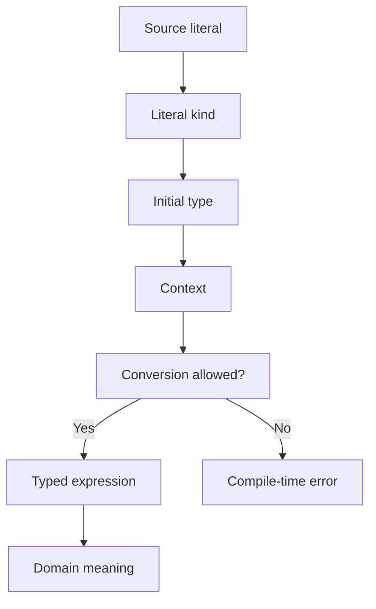
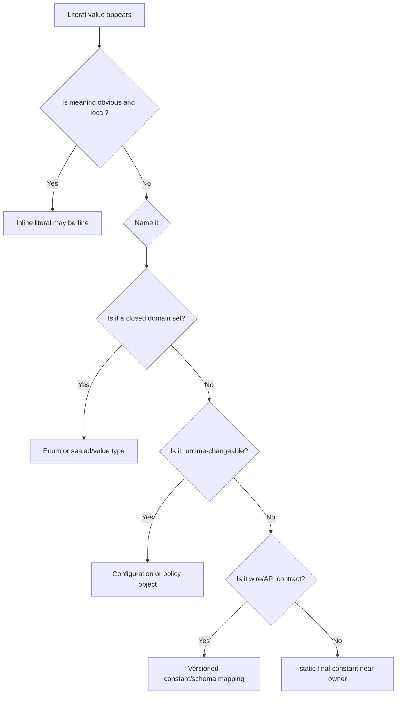

# Part 008 — Literals, Constants & Compile-Time Constant Expressions

> Target part ini: memahami literal dan constant bukan sebagai “cara menulis angka/string”, tetapi sebagai bagian dari type system, compiler behavior, binary compatibility, API contract, dan domain modeling. Kita akan membahas integer literal, floating-point literal, character literal, string literal, text block, boolean literal, null literal, constant variable, compile-time constant expression, constant folding, narrowing, `switch`, annotation, dan jebakan public constants.

## 1. Mengapa Literal dan Constant Penting?

Literal terlihat kecil:

```java
int retry = 3;
String status = "APPROVED";
long timeoutMillis = 5000L;
BigDecimal rate = new BigDecimal("0.15");
```

Tetapi dalam sistem enterprise, literal dan constant menentukan:

1. apakah nilai dipahami compiler sebagai `int`, `long`, `double`, `String`, atau `null`;
2. apakah assignment boleh karena constant narrowing;
3. apakah overload method memilih target yang Anda harapkan;
4. apakah `switch case` dan annotation value legal;
5. apakah public constant akan di-inline ke client binary;
6. apakah magic number/string menyebar ke banyak modul;
7. apakah perubahan constant benar-benar terlihat oleh service lain setelah deploy;
8. apakah domain policy tersamar sebagai angka mentah.

Tujuan part ini: membuat Anda bisa membaca literal dan constant sebagai **kontrak semantik**, bukan sekadar syntax.

## 2. Mental Model: Literal → Type → Context → Meaning

Setiap literal melewati alur seperti ini:



Contoh:

```java
byte x = 10;
```

Literal `10` awalnya bertipe `int`. Namun karena `10` adalah compile-time constant dan nilainya muat dalam range `byte`, assignment diperbolehkan.

Bandingkan:

```java
int n = 10;
byte y = n; // compile error
```

`n` bukan compile-time constant expression walaupun nilainya terlihat `10`. Compiler tidak menganggapnya sebagai constant value untuk narrowing assignment.

Jika ingin eksplisit:

```java
byte y = (byte) n;
```

Namun cast harus dipakai dengan sadar karena dapat memotong nilai.

## 3. Jenis Literal di Java

Java memiliki beberapa kategori literal utama:

| Literal | Contoh | Catatan |
|---|---|---|
| Integer literal | `10`, `0xFF`, `0b1010`, `1_000L` | Default `int`, kecuali suffix `L/l` |
| Floating-point literal | `1.0`, `1.0f`, `1e-3`, `0x1.0p-3` | Default `double`, kecuali suffix `F/f` |
| Boolean literal | `true`, `false` | Hanya untuk `boolean`/`Boolean` via boxing |
| Character literal | `'A'`, `'\n'`, `'\u0041'` | Tipe `char` |
| String literal | `"hello"` | Tipe `String`, interned |
| Text block | `"""..."""` | Tipe `String`, multi-line source-friendly |
| Null literal | `null` | Null type, assignable ke reference types |

Ada juga class literal expression seperti `String.class`, tetapi secara formal itu bukan literal dalam kategori yang sama seperti string/integer literal. Ia adalah expression yang menghasilkan objek `Class`.

## 4. Integer Literals

Integer literal dapat ditulis dalam beberapa radix.

```java
int decimal = 42;
int hex = 0x2A;
int binary = 0b101010;
int octal = 052;
```

Semua contoh di atas bernilai 42.

### 4.1 Hindari Octal Literal di Kode Bisnis

Octal literal dimulai dengan `0`.

```java
int value = 010; // 8, not 10
```

Ini jebakan klasik. Di kode bisnis modern, hindari octal kecuali Anda benar-benar sedang menulis kode low-level yang membutuhkan representasi tersebut.

### 4.2 Gunakan Underscore untuk Readability

```java
int maxUsers = 1_000_000;
long timeoutNanos = 5_000_000_000L;
int mask = 0b1111_0000;
```

Underscore tidak mengubah nilai. Ia hanya membantu readability.

Buruk:

```java
long amount = 1000000000000L;
```

Lebih baik:

```java
long amount = 1_000_000_000_000L;
```

Namun jangan berlebihan:

```java
int weird = 1_0_0_0;
```

Secara syntax bisa, tetapi readability buruk.

## 5. Default Type Integer Literal: `int`

Integer literal tanpa suffix biasanya bertipe `int`.

```java
var x = 10; // int
var y = 10L; // long
```

Ini berdampak pada overload:

```java
void process(int value) {
    System.out.println("int");
}

void process(long value) {
    System.out.println("long");
}

process(10);  // int
process(10L); // long
```

Di call site, suffix `L` adalah bagian dari kontrak. Ia memilih overload yang berbeda.

### 5.1 Gunakan `L`, Bukan `l`

```java
long good = 1L;
long bad = 1l;
```

`1l` mudah terbaca sebagai `11`. Gunakan `L` kapital.

## 6. Integer Literal dan Overflow

Literal harus representable oleh tipe targetnya.

```java
int max = 2147483647;
// int tooLarge = 2147483648; // compile error
```

Tetapi ada satu kasus yang sering membingungkan:

```java
int min = -2147483648;
```

Secara konsep, `-2147483648` terlihat seperti literal negatif. Namun unary minus adalah operator. Literal positif `2147483648` terlalu besar untuk `int`. Java memberi perlakuan khusus untuk nilai minimum agar `Integer.MIN_VALUE` bisa ditulis.

Lebih jelas:

```java
int min = Integer.MIN_VALUE;
```

Untuk `long`:

```java
long big = 2_147_483_648L;
```

Tanpa `L`, literal tersebut tidak muat dalam `int`.

## 7. Constant Narrowing

Assignment ini legal:

```java
byte b = 100;
short s = 20_000;
char c = 65;
```

Mengapa? Karena literal `100`, `20_000`, dan `65` adalah compile-time constants yang nilainya muat dalam target type.

Assignment ini tidak legal:

```java
// byte tooBig = 128; // compile error
// char negative = -1; // compile error
```

Karena nilainya tidak muat.

Assignment ini juga tidak legal:

```java
int value = 100;
// byte b = value; // compile error
```

Walaupun manusia tahu `value` berisi 100, compiler tidak memperlakukan variable biasa sebagai constant expression.

Legal jika variable adalah constant variable:

```java
final int value = 100;
byte b = value;
```

Tetapi hati-hati: ini berlaku karena `value` adalah `final`, bertipe primitive/String, dan diinisialisasi dengan compile-time constant expression.

## 8. Compile-Time Constant Expression

Compile-time constant expression adalah expression yang dapat dievaluasi compiler pada compile time.

Contoh:

```java
final int secondsPerMinute = 60;
final int minutesPerHour = 60;
final int secondsPerHour = secondsPerMinute * minutesPerHour;
```

`secondsPerHour` adalah compile-time constant jika semua komponennya juga compile-time constant.

Contoh bukan compile-time constant:

```java
final int runtimeValue = Integer.parseInt("60");
```

Walaupun `final`, nilainya diperoleh dari method call runtime.

### 8.1 Constant Variable

Sebuah variable menjadi constant variable jika:

1. dideklarasikan `final`;
2. bertipe primitive atau `String`;
3. diinisialisasi dengan compile-time constant expression.

Contoh:

```java
static final int MAX_RETRY = 3;
static final String STATUS_APPROVED = "APPROVED";
```

Bukan constant variable:

```java
static final Integer MAX_RETRY_BOXED = 3;
static final BigDecimal TAX_RATE = new BigDecimal("0.11");
static final List<String> ROLES = List.of("ADMIN", "REVIEWER");
```

`final` pada reference hanya membuat reference tidak bisa diganti. Objeknya bisa immutable atau mutable tergantung tipe dan konstruksinya.

## 9. `final` Bukan Selalu Constant

Ini penting.

```java
final LocalDate today = LocalDate.now();
```

`today` tidak bisa di-reassign, tetapi bukan compile-time constant.

```java
final List<String> names = new ArrayList<>();
names.add("Alice"); // legal
```

`final` melindungi binding variable, bukan selalu isi object.

Dalam code review, bedakan:

| Istilah | Makna |
|---|---|
| `final` variable | reference/value tidak bisa di-reassign |
| constant variable | `final` + primitive/String + compile-time constant expression |
| immutable object | state object tidak berubah setelah dibuat |
| domain constant | nilai kebijakan/domain yang dianggap tetap pada konteks tertentu |

## 10. Constant Folding

Compiler dapat melipat compile-time constant expression.

```java
int x = 2 + 3 * 4; // dapat dilipat menjadi 14
```

Untuk string:

```java
String message = "case" + "-" + "approved";
```

Ini dapat menjadi satu string constant.

Tetapi:

```java
String status = "approved";
String message = "case-" + status;
```

Jika `status` bukan constant variable, concatenation terjadi runtime.

Dengan `final` constant variable:

```java
final String status = "approved";
String message = "case-" + status; // compile-time constant expression
```

## 11. String Literals dan Interning

String literal memiliki tipe `String` dan diintern oleh JVM.

```java
String a = "APPROVED";
String b = "APPROVED";

System.out.println(a == b); // true, karena literal interned
```

Tetapi jangan gunakan `==` untuk membandingkan string bisnis.

```java
String c = new String("APPROVED");

System.out.println(a == c);      // false
System.out.println(a.equals(c)); // true
```

Aturan praktis:

- gunakan `.equals()` untuk logical equality;
- gunakan `==` untuk enum, primitive comparison, atau identity check yang memang disengaja;
- jangan bergantung pada string interning untuk logika bisnis.

## 12. String Constant sebagai Domain Code

Buruk:

```java
if (status.equals("APPROVED")) {
    ...
}
```

Lebih baik minimal:

```java
static final String STATUS_APPROVED = "APPROVED";
```

Tetapi untuk closed domain, lebih baik enum:

```java
enum CaseStatus {
    DRAFT,
    SUBMITTED,
    APPROVED,
    REJECTED,
    CLOSED
}
```

String constant masih berguna di boundary:

```java
final class CaseStatusCodes {
    static final String APPROVED = "APPROVED";
    static final String REJECTED = "REJECTED";

    private CaseStatusCodes() { }
}
```

Namun domain internal sebaiknya memakai tipe yang lebih kuat.

## 13. Public Constants dan Binary Compatibility Hazard

Ini salah satu jebakan paling penting.

Misal library A:

```java
public final class Limits {
    public static final int MAX_RETRY = 3;

    private Limits() { }
}
```

Service B meng-compile kode:

```java
int retry = Limits.MAX_RETRY;
```

Karena `MAX_RETRY` adalah compile-time constant, nilai `3` dapat di-inline ke bytecode Service B. Jika library A mengubah nilai menjadi:

```java
public static final int MAX_RETRY = 5;
```

Service B mungkin tetap memakai `3` sampai ia di-recompile.

Ini bukan bug JVM. Ini konsekuensi compile-time constant inlining.

### 13.1 Solusi untuk Public API Constant yang Bisa Berubah

Jika nilai mungkin berubah, jangan expose sebagai public compile-time constant.

Alternatif:

```java
public final class Limits {
    private static final int MAX_RETRY = 5;

    private Limits() { }

    public static int maxRetry() {
        return MAX_RETRY;
    }
}
```

Method call tidak di-inline sebagai constant variable oleh compiler client dengan cara yang sama.

Atau jadikan konfigurasi runtime:

```java
record RetryPolicy(int maxAttempts, Duration backoff) { }
```

Untuk domain enum stable, gunakan enum, bukan string/int public constants.

## 14. Constant dan API Evolution

Constant yang tampak teknis sering menjadi bagian dari public contract.

Contoh:

```java
public static final String HEADER_REQUEST_ID = "X-Request-Id";
public static final String EVENT_CASE_APPROVED = "case.approved.v1";
public static final int DEFAULT_PAGE_SIZE = 50;
```

Pertanyaan review:

- Apakah value boleh berubah tanpa breaking clients?
- Apakah constant ini bagian dari wire protocol?
- Apakah ada versioning?
- Apakah client meng-compile terhadap constant ini?
- Apakah perubahan membutuhkan recompile/deploy semua consumer?
- Apakah constant sebaiknya configuration, enum, schema field, atau generated contract?

Dalam event/API contract, constant bukan sekadar convenience. Ia sering menjadi compatibility surface.

## 15. Floating-Point Literals

Floating-point literal default-nya `double`.

```java
var x = 1.0;  // double
var y = 1.0f; // float
var z = 1.0d; // double
```

Ini berdampak pada assignment:

```java
// float f = 1.0; // compile error: double to float requires cast
float f = 1.0f;
```

Dan overload:

```java
void calculate(float value) {
    System.out.println("float");
}

void calculate(double value) {
    System.out.println("double");
}

calculate(1.0);  // double
calculate(1.0f); // float
```

### 15.1 Scientific Notation

```java
double probability = 1e-6;
double budget = 1.25e9;
```

### 15.2 Hexadecimal Floating-Point Literal

Java juga mendukung hexadecimal floating-point literal:

```java
double one = 0x1.0p0;     // 1.0
double half = 0x1.0p-1;   // 0.5
double sixteen = 0x1.0p4; // 16.0
```

Ini jarang dipakai di business code, tetapi berguna di kode numerik yang membutuhkan representasi binary floating-point lebih eksplisit.

## 16. `NaN` dan Infinity Bukan Literal Biasa

Anda tidak menulis literal `NaN` sebagai keyword Java.

Gunakan constant:

```java
double nan = Double.NaN;
double positiveInfinity = Double.POSITIVE_INFINITY;
double negativeInfinity = Double.NEGATIVE_INFINITY;
```

Atau hasil operasi:

```java
double x = 0.0 / 0.0; // NaN
double y = 1.0 / 0.0; // Infinity
```

Untuk domain bisnis, jangan jadikan NaN/Infinity sebagai nilai tersembunyi. Validasi boundary lebih baik.

## 17. Character Literals

Character literal bertipe `char`.

```java
char letter = 'A';
char newline = '\n';
char unicodeA = '\u0041';
```

Ingat: `char` adalah UTF-16 code unit, bukan selalu satu karakter manusia.

```java
String emoji = "😀";
System.out.println(emoji.length()); // 2, karena surrogate pair
```

Jadi character literal cocok untuk ASCII/control/simple code unit, tetapi tidak cukup untuk seluruh konsep Unicode character.

## 18. Escape Sequences

Beberapa escape sequence umum:

| Escape | Makna |
|---|---|
| `\n` | newline |
| `\r` | carriage return |
| `\t` | tab |
| `\b` | backspace |
| `\f` | form feed |
| `\'` | single quote |
| `\"` | double quote |
| `\\` | backslash |

Contoh:

```java
String path = "C:\\data\\cases\\input.json";
String csv = "caseId,status\nC-001,APPROVED";
```

Untuk regex, escaping bisa berlapis:

```java
String digitRegex = "\\d+";
```

String Java `"\\d+"` merepresentasikan regex `\d+`.

## 19. Text Blocks

Text block memudahkan string multi-line.

```java
String json = """
    {
      "caseId": "C-001",
      "status": "APPROVED"
    }
    """;
```

Text block tetap bertipe `String`. Ia bukan JSON object, bukan SQL AST, bukan template engine. Ia hanya literal string yang lebih nyaman dibaca.

Cocok untuk:

- test fixture JSON/XML;
- SQL kecil;
- documentation snippet;
- expected output multi-line.

Hati-hati untuk:

- dynamic SQL;
- user input interpolation;
- indentation yang tidak sengaja berubah;
- newline trailing;
- secret/config hard-coded.

## 20. Boolean Literals

Boolean literal hanya:

```java
true
false
```

Tidak ada `yes/no`, `1/0`, `on/off` sebagai literal boolean Java.

Mapping dari external representation harus eksplisit:

```java
static boolean parseEnabled(String value) {
    return switch (value.toLowerCase(Locale.ROOT)) {
        case "true", "yes", "on", "1" -> true;
        case "false", "no", "off", "0" -> false;
        default -> throw new IllegalArgumentException("Invalid boolean: " + value);
    };
}
```

Namun untuk konfigurasi enterprise, sering lebih baik memakai enum jika opsinya berkembang.

## 21. Null Literal

`null` adalah literal khusus yang merepresentasikan null reference.

```java
String name = null;
List<String> values = null;
```

`null` tidak bisa assigned ke primitive:

```java
// int x = null; // compile error
```

`null` dapat assigned ke reference type mana pun:

```java
String s = null;
Object o = null;
Runnable r = null;
```

Ini membuat overload bisa ambigu:

```java
void process(String value) { }
void process(Integer value) { }

// process(null); // compile error: ambiguous
```

Beri cast jika benar-benar perlu:

```java
process((String) null);
```

Tetapi biasanya lebih baik hindari overload yang ambigu terhadap `null` di public API.

## 22. Null dan Type Inference

```java
// var x = null; // compile error
```

`var` membutuhkan target type yang bisa diinfer. `null` sendiri tidak cukup.

Legal:

```java
String x = null;
var y = (String) null;
```

Tetapi `var y = (String) null` jarang perlu dan sering menurunkan clarity.

## 23. Literal dan Overload Resolution

Literal memengaruhi overload.

```java
void send(int timeout) { }
void send(long timeout) { }
void send(Duration timeout) { }

send(1000);  // int overload
send(1000L); // long overload
send(Duration.ofMillis(1000)); // Duration overload
```

Untuk API yang menerima konsep domain seperti timeout, `Duration` lebih jelas daripada `int`/`long`.

Buruk:

```java
client.connect(5000);
```

Apakah 5000 milliseconds, seconds, retry count, atau buffer size?

Lebih baik:

```java
client.connect(Duration.ofSeconds(5));
```

Literal angka sebaiknya tidak dibiarkan tanpa unit jika domain butuh unit.

## 24. Literals dan Numeric Promotion

Ekspresi berikut menghasilkan `int`:

```java
byte a = 1;
byte b = 2;
// byte c = a + b; // compile error: a + b promoted to int
```

Tetapi ini legal:

```java
byte c = 1 + 2;
```

Karena `1 + 2` adalah compile-time constant expression bernilai 3 yang muat dalam `byte`.

Versi variable:

```java
final byte a = 1;
final byte b = 2;
byte c = a + b; // legal jika a dan b constant variables
```

Jika nilai runtime:

```java
byte a = readByte();
byte b = readByte();
byte c = (byte) (a + b); // explicit narrowing
```

Cast ini bisa overflow. Jangan pakai tanpa pertimbangan.

## 25. Constants untuk `switch case`

`case` label membutuhkan constant expression untuk beberapa bentuk switch klasik.

```java
static final int STATUS_APPROVED = 1;
static final int STATUS_REJECTED = 2;

switch (statusCode) {
    case STATUS_APPROVED -> approve();
    case STATUS_REJECTED -> reject();
    default -> throw new IllegalArgumentException("Unknown status: " + statusCode);
}
```

Jika constant bukan compile-time constant, tidak bisa dipakai sebagai case label:

```java
static final Integer APPROVED_BOXED = 1;

// case APPROVED_BOXED -> ... // invalid untuk int switch label
```

Untuk domain closed set, gunakan enum switch:

```java
switch (status) {
    case APPROVED -> approve();
    case REJECTED -> reject();
    case DRAFT, SUBMITTED -> throw new IllegalStateException("Not decided yet");
}
```

## 26. Constants untuk Annotation Values

Annotation element value harus compile-time constant untuk tipe tertentu.

Legal:

```java
static final String TOPIC = "case.approved.v1";

@MessageTopic(TOPIC)
final class CaseApprovedHandler { }
```

Tidak legal jika value runtime:

```java
static final String TOPIC = System.getenv("TOPIC");

// @MessageTopic(TOPIC) // compile error
```

Ini penting untuk framework yang memakai annotation metadata. Annotation values bukan tempat untuk runtime config.

## 27. Constant Holder Class

Pola umum:

```java
public final class Headers {
    public static final String REQUEST_ID = "X-Request-Id";
    public static final String CORRELATION_ID = "X-Correlation-Id";

    private Headers() { }
}
```

Ini bisa berguna untuk wire names. Tetapi hindari membuat “god constants class”:

```java
public final class Constants {
    public static final String APPROVED = "APPROVED";
    public static final int MAX = 100;
    public static final String DATE_FORMAT = "yyyy-MM-dd";
    public static final String ADMIN = "ADMIN";
    public static final String ERROR = "ERROR";
}
```

Masalah:

- context hilang;
- nama terlalu umum;
- coupling meningkat;
- semua module tergoda bergantung ke satu class;
- ownership constant tidak jelas.

Lebih baik constant dekat dengan bounded context:

```java
public final class CaseEventTypes {
    public static final String CASE_APPROVED_V1 = "case.approved.v1";
    public static final String CASE_REJECTED_V1 = "case.rejected.v1";

    private CaseEventTypes() { }
}
```

Atau lebih baik generated dari schema jika dipakai lintas service.

## 28. Magic Number dan Magic String

Magic literal adalah literal yang maknanya tidak jelas dari context.

Buruk:

```java
if (days > 30) {
    escalate(caseFile);
}
```

Lebih baik:

```java
private static final int ESCALATION_THRESHOLD_DAYS = 30;

if (days > ESCALATION_THRESHOLD_DAYS) {
    escalate(caseFile);
}
```

Lebih baik lagi jika unit penting:

```java
private static final Duration ESCALATION_THRESHOLD = Duration.ofDays(30);

if (caseAge.compareTo(ESCALATION_THRESHOLD) > 0) {
    escalate(caseFile);
}
```

Untuk domain policy yang dapat berubah, jangan hard-code:

```java
record EscalationPolicy(Duration threshold) {
    boolean shouldEscalate(Duration caseAge) {
        return caseAge.compareTo(threshold) > 0;
    }
}
```

## 29. Constants vs Configuration vs Policy

Tidak semua nilai bernama adalah constant.

| Jenis Nilai | Contoh | Sebaiknya |
|---|---|---|
| Mathematical constant | `SECONDS_PER_MINUTE = 60` | `static final` |
| Wire protocol name | `HEADER_REQUEST_ID` | constant/schema generated |
| Domain code stable | `CaseStatus.APPROVED` | enum/value object |
| Runtime setting | max retry dari config | configuration |
| Business policy | escalation threshold | policy object/configured rule |
| Test fixture value | `CASE_ID_001` | test fixture constant |

Kesalahan umum: business policy diperlakukan sebagai compile-time constant.

```java
private static final int MAX_APPEAL_DAYS = 14;
```

Jika aturan ini dapat berubah karena regulasi, buat policy/configuration yang versioned dan auditable.

## 30. `BigDecimal` Literal Trap

Java tidak punya decimal literal untuk `BigDecimal`.

Buruk:

```java
BigDecimal amount = new BigDecimal(0.1);
```

Karena `0.1` adalah `double` yang tidak merepresentasikan 0.1 secara eksak.

Lebih baik:

```java
BigDecimal amount = new BigDecimal("0.1");
```

Atau:

```java
BigDecimal amount = BigDecimal.valueOf(0.1);
```

Untuk money, lebih baik domain factory:

```java
Money amount = Money.of("IDR", "100000.00");
```

Literal string membawa decimal representation yang Anda maksud, bukan binary floating representation.

## 31. Date/Time Constants

Hindari string tanggal mentah di domain logic:

```java
if (date.equals("2026-01-01")) {
    ...
}
```

Lebih baik:

```java
private static final LocalDate REGULATION_EFFECTIVE_DATE = LocalDate.of(2026, 1, 1);
```

Namun jika tanggal regulasi bisa berubah atau berbeda per jurisdiction, jadikan data/configuration/policy versioned.

```java
record RegulationVersion(
    RegulationId id,
    LocalDate effectiveFrom,
    Optional<LocalDate> effectiveTo
) { }
```

## 32. Enum Constants vs Static Constants

Enum constant adalah object singleton per enum value.

```java
enum CaseStatus {
    DRAFT,
    SUBMITTED,
    APPROVED,
    REJECTED
}
```

Static string constants:

```java
static final String STATUS_APPROVED = "APPROVED";
```

Perbandingan:

| Aspek | Enum | String Constant |
|---|---|---|
| Closed set | Ya | Tidak otomatis |
| Type-safe | Ya | Tidak |
| Switch exhaustiveness | Lebih baik | Terbatas |
| Wire compatibility | Perlu mapping hati-hati | Langsung wire value |
| Evolusi | Penambahan enum perlu strategi | String bisa bebas tapi rawan typo |

Prinsip:

- domain internal: enum/value object;
- boundary external: mapping eksplisit ke string code.

## 33. Constant Interface Anti-Pattern

Buruk:

```java
public interface CaseConstants {
    String APPROVED = "APPROVED";
    String REJECTED = "REJECTED";
}

class CaseService implements CaseConstants {
    ...
}
```

Masalah:

- constants menjadi bagian dari public API class yang mengimplementasikan interface;
- inheritance dipakai untuk reuse constant;
- namespace tercemar;
- semantic ownership lemah.

Lebih baik gunakan final utility class, enum, atau type-specific class.

## 34. Constant Naming

Konvensi umum untuk constant variable:

```java
private static final int DEFAULT_PAGE_SIZE = 50;
private static final Duration DEFAULT_TIMEOUT = Duration.ofSeconds(5);
private static final String REQUEST_ID_HEADER = "X-Request-Id";
```

Tetapi tidak semua `static final` harus uppercase. Untuk logger, misalnya banyak codebase memakai:

```java
private static final Logger log = LoggerFactory.getLogger(CaseService.class);
```

Ikuti style guide tim, tetapi jaga prinsip:

- constant domain harus punya nama domain;
- unit harus terlihat;
- hindari nama `MAX`, `MIN`, `VALUE`, `DEFAULT` tanpa context;
- jangan menyembunyikan policy yang berubah sebagai constant universal.

## 35. Literal Units: Nama Harus Mengandung Unit

Buruk:

```java
private static final int TIMEOUT = 5000;
```

Lebih baik:

```java
private static final int TIMEOUT_MILLIS = 5_000;
```

Lebih baik lagi:

```java
private static final Duration TIMEOUT = Duration.ofSeconds(5);
```

Untuk size:

```java
private static final int MAX_PAYLOAD_BYTES = 1_048_576;
```

Untuk percentage/rate:

```java
private static final BigDecimal DEFAULT_INTEREST_RATE = new BigDecimal("0.015");
```

Namun domain type `Rate` akan lebih aman jika operasi rate kompleks.

## 36. Literals dalam Tests

Test sering mengandung literal. Tidak semua harus diekstrak.

Bagus:

```java
assertEquals(3, result.retryCount());
```

Jika literal menjelaskan expectation sederhana, biarkan.

Tetapi jika literal punya makna domain atau dipakai berulang:

```java
private static final CaseId CASE_ID = new CaseId("CASE-001");
private static final OfficerId REVIEWER_ID = new OfficerId("OFFICER-001");
```

Tujuan test bukan menghapus semua literal, tetapi membuat intensi jelas.

## 37. Decision Framework: Inline, Constant, Enum, Value Object, or Config?

Gunakan flow ini:



Jangan refactor semua literal secara mekanis. Refactor berdasarkan risiko semantik.

## 38. Common Failure Modes

### 38.1 Integer Literal Memilih Overload Salah

```java
send(1000); // int overload, padahal maksudnya long millis
```

Solusi: gunakan domain type seperti `Duration`.

### 38.2 Public Constant Tidak Terupdate di Client

```java
public static final int LIMIT = 10;
```

Client bisa meng-inline `10`. Perubahan library tidak otomatis mengubah client binary.

### 38.3 Octal Literal Tidak Sengaja

```java
int code = 010; // 8
```

Solusi: hindari leading zero.

### 38.4 BigDecimal dari Double Literal

```java
new BigDecimal(0.1)
```

Solusi: gunakan string/factory domain.

### 38.5 Magic String Status

```java
if (status.equals("APPROVE")) { }
```

Typo tidak tertangkap compiler. Gunakan enum atau constant boundary.

### 38.6 Annotation Value dari Runtime Config

```java
@Topic(System.getenv("TOPIC")) // tidak legal
```

Annotation membutuhkan compile-time constant untuk value tertentu.

### 38.7 `final` Dianggap Immutable

```java
static final List<String> ROLES = new ArrayList<>();
```

List masih mutable.

## 39. Review Checklist

Gunakan checklist ini saat code review:

1. Apakah literal angka punya unit yang jelas?
2. Apakah literal string adalah domain code, wire name, atau hanya pesan lokal?
3. Apakah magic literal perlu diberi nama?
4. Apakah nilai ini benar-benar constant, atau policy/config?
5. Apakah constant public dapat berubah di masa depan?
6. Apakah public compile-time constant berisiko di-inline client?
7. Apakah `final` disalahartikan sebagai immutable?
8. Apakah `BigDecimal` dibuat dari `double` literal?
9. Apakah integer literal butuh suffix `L`?
10. Apakah floating literal butuh suffix `f`?
11. Apakah leading zero tidak sengaja membuat octal?
12. Apakah `switch case` memakai constant expression yang valid?
13. Apakah annotation value membutuhkan compile-time constant?
14. Apakah enum lebih aman daripada string/int constant?
15. Apakah constant diletakkan dekat owner domainnya?
16. Apakah nilai boundary/API perlu versioning?
17. Apakah test literal membuat intent lebih jelas atau lebih kabur?
18. Apakah unit sebaiknya dimodelkan sebagai `Duration`, `Money`, `Rate`, atau value object lain?

## 40. Latihan Deliberate Practice

### Latihan 1 — Audit Magic Literals

Refactor kode berikut:

```java
if (caseAgeDays > 30 && status.equals("SUBMITTED")) {
    notificationService.send(caseId, "ESCALATION");
}
```

Target:

- hilangkan magic number;
- hilangkan magic string domain;
- modelkan unit waktu;
- pisahkan event/notification code dari domain logic.

### Latihan 2 — Public Constant Evolution

Anda memiliki library:

```java
public final class ApiLimits {
    public static final int DEFAULT_PAGE_SIZE = 50;
}
```

Service consumer sudah dikompilasi terhadap library ini. Nilai ingin diubah ke 100.

Jelaskan:

1. mengapa consumer mungkin tetap memakai 50;
2. kapan recompile diperlukan;
3. desain alternatif agar nilai bisa berubah runtime;
4. bagaimana membuat migrasi aman.

### Latihan 3 — Constant Narrowing

Tentukan mana yang compile dan mengapa:

```java
byte a = 10;
byte b = 128;
final int c = 20;
byte d = c;
int e = 20;
byte f = e;
byte g = 1 + 2;
byte h = a + 2;
```

Lalu ubah kode agar intensinya eksplisit tanpa cast berbahaya.

### Latihan 4 — Annotation Constant

Desain annotation:

```java
@interface EventTopic {
    String value();
}
```

Lalu buat contoh legal dan illegal untuk value annotation berdasarkan compile-time constant rules.

### Latihan 5 — Domain Constant Classification

Klasifikasikan nilai berikut sebagai inline literal, constant, enum, value object, config, atau policy:

1. `60` untuk seconds per minute;
2. `"X-Request-Id"`;
3. `"APPROVED"`;
4. `14` hari masa appeal;
5. `5000` timeout HTTP;
6. `"case.approved.v1"`;
7. `0.11` tax rate;
8. `100` max page size.

## 41. Mini Capstone Part Ini

Desain `CaseEscalationPolicy` untuk sistem enforcement.

Requirement:

1. threshold default 30 hari;
2. threshold bisa berbeda per case type;
3. policy harus versioned;
4. event topic untuk escalation harus stabil;
5. API tidak boleh expose magic string status;
6. test harus mudah membaca expected behavior.

Sketsa arah:

```java
record EscalationPolicy(
    EscalationPolicyVersion version,
    Map<CaseType, Duration> thresholdByCaseType,
    Duration defaultThreshold
) {
    boolean shouldEscalate(CaseFile file, Clock clock) {
        Duration age = Duration.between(file.submittedAt(), clock.instant());
        Duration threshold = thresholdByCaseType.getOrDefault(file.type(), defaultThreshold);
        return age.compareTo(threshold) > 0;
    }
}

final class CaseEventTopics {
    static final String CASE_ESCALATED_V1 = "case.escalated.v1";

    private CaseEventTopics() { }
}
```

Lalu evaluasi:

- apakah threshold 30 hari sebaiknya compile-time constant atau config?
- apakah event topic boleh berubah?
- apakah `CaseType` sebaiknya enum?
- apakah `shouldEscalate` perlu result object dengan reason?

## 42. Kesimpulan

Literal dan constant bukan detail kecil. Mereka memengaruhi type inference, overload resolution, narrowing conversion, `switch`, annotation metadata, binary compatibility, dan evolusi API.

Aturan mental yang paling penting:

1. Literal selalu punya tipe awal.
2. Context menentukan konversi yang boleh terjadi.
3. `final` bukan otomatis compile-time constant.
4. Constant variable bisa di-inline ke client binary.
5. Magic literal harus dievaluasi berdasarkan risiko semantik, bukan dihapus secara mekanis.
6. Domain closed set lebih aman dengan enum/value object daripada string/int constants.
7. Policy yang bisa berubah jangan dikubur sebagai compile-time constant.
8. Unit harus terlihat di tipe atau nama.

Di part berikutnya kita akan masuk ke **reference types dan object semantics**: class type, interface type, array type, null type, reference value, object identity, aliasing, dan bagaimana semua itu memengaruhi desain model Java yang aman.
