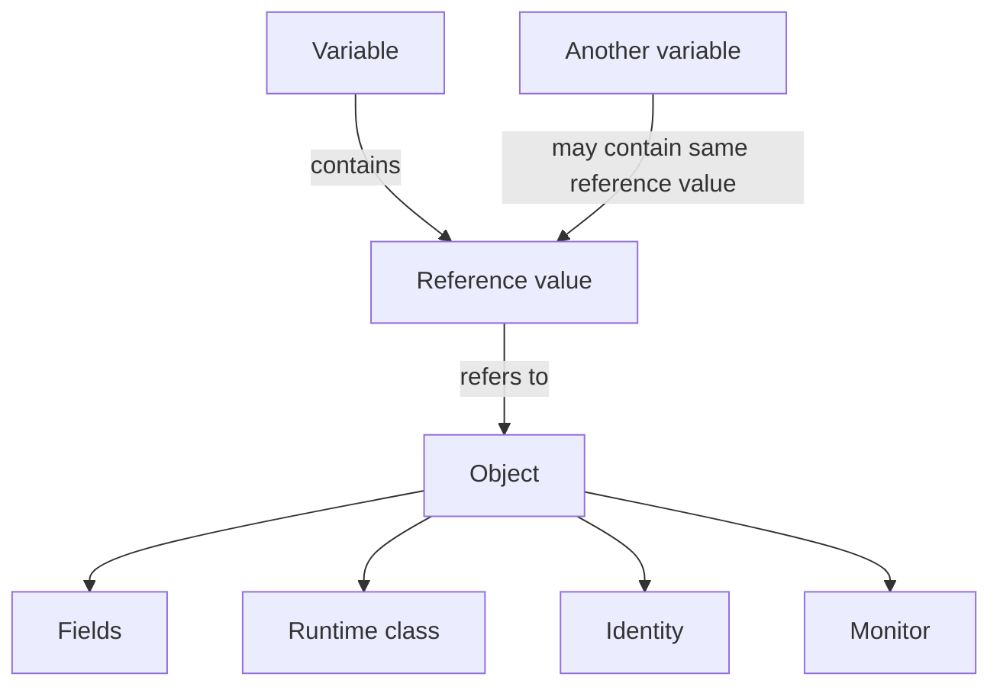
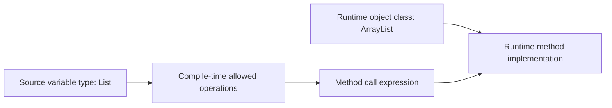
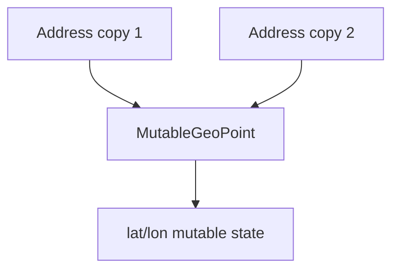
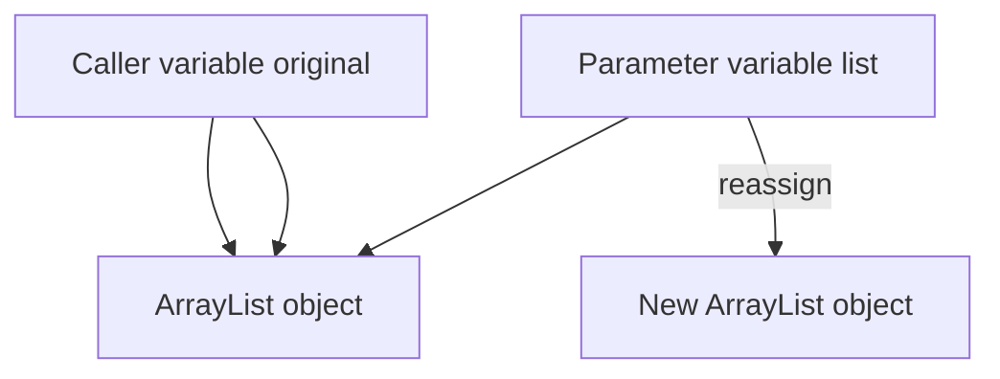
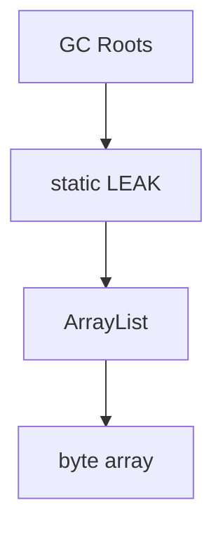

# Part 009 — Reference Types & Object Semantics

> Target part ini: memahami **reference type** bukan sebagai “tipe non-primitive”, tetapi sebagai model formal untuk object identity, aliasing, `null`, lifetime, mutation, API boundary, dan failure mode di production. Setelah part ini, Anda harus bisa membedakan dengan presisi: type, variable, reference value, object, identity, equality, lifetime, dan ownership.

## 1. Mengapa Reference Semantics Penting?

Banyak bug Java tingkat enterprise bukan karena developer tidak tahu syntax, tetapi karena salah mental model:

```java
Customer customer = repository.findById(id);
Customer snapshot = customer;
snapshot.setRiskLevel(RiskLevel.HIGH);
```

Kode di atas tidak membuat salinan `Customer`. Ia membuat **dua variable yang memegang reference value ke object yang sama**.

Kesalahan seperti ini terlihat kecil, tetapi dampaknya bisa besar:

1. state berubah tanpa disadari melalui alias lain;
2. object yang dikira snapshot ternyata live mutable object;
3. DTO bocor membawa reference ke internal collection;
4. key `HashMap` berubah setelah dimasukkan;
5. cache menyimpan object yang kemudian dimodifikasi caller;
6. `null` dianggap “tidak ada data”, padahal bisa berarti “belum dimuat”, “tidak berhak melihat”, “gagal parsing”, atau “field tidak dikirim”;
7. equality salah karena mencampur identity, domain identity, dan structural equality.

Reference semantics adalah dasar untuk memahami class, interface, record, enum, array, collection, concurrency, persistence, serialization, dan API contract.

## 2. Mental Model Utama

Gunakan model ini untuk membaca setiap kode Java berbasis object:



Kalimat pentingnya:

> Variable reference tidak menyimpan object. Variable reference menyimpan **reference value** yang dapat menunjuk ke object atau bernilai `null`.

Contoh:

```java
Order a = new Order("ORD-1");
Order b = a;

b.cancel();

System.out.println(a.status()); // CANCELLED
```

`a` dan `b` adalah variable berbeda. Tetapi keduanya memegang reference value yang menunjuk object yang sama.

## 3. Primitive Value vs Reference Value

Bandingkan:

```java
int x = 10;
int y = x;
y = 99;

System.out.println(x); // 10
```

Dengan:

```java
List<String> a = new ArrayList<>();
List<String> b = a;
b.add("risk");

System.out.println(a); // [risk]
```

Perbedaan utamanya bukan “stack vs heap”. Itu detail implementasi JVM. Perbedaan yang lebih tepat:

| Aspek | Primitive | Reference |
|---|---|---|
| Isi variable | primitive value | reference value atau `null` |
| Object identity | tidak ada | ada, untuk object biasa |
| Aliasing mutable object | tidak relevan | sangat relevan |
| Bisa `null` | tidak | ya |
| Runtime dispatch | tidak | ya, untuk method instance |
| Default field value | `0`, `false`, `\u0000` sesuai tipe | `null` |

Hindari penjelasan absolut seperti “primitive selalu di stack, object selalu di heap”. Java Language Specification tidak mengharuskan model fisik seperti itu. Untuk reasoning desain, yang penting adalah **semantik**, bukan lokasi memori fisik.

## 4. Apa Itu Reference Type?

Secara praktis, reference type mencakup:

1. class type;
2. interface type;
3. array type;
4. type variable pada generic code;
5. special `null` type sebagai tipe dari literal `null`.

Record dan enum juga masuk ke dunia reference type karena record adalah bentuk khusus dari class dan enum juga class khusus.

Contoh:

```java
String text = "case";                 // class type
Runnable task = () -> runJob();        // interface type
String[] names = {"A", "B"};          // array type
T value = input;                       // type variable in generic code
Object missing = null;                 // null reference
```

Setiap reference type memberi **cara berbeda** untuk membatasi operasi yang legal terhadap reference value.

```java
ArrayList<String> concrete = new ArrayList<>();
List<String> list = concrete;
Collection<String> collection = concrete;
Object object = concrete;
```

Object runtime-nya sama. Tetapi type variable di source code berbeda, sehingga operasi yang diizinkan compiler juga berbeda.

## 5. Static Type vs Runtime Class

Reference variable memiliki **static type**. Object memiliki **runtime class**.

```java
List<String> items = new ArrayList<>();
```

Di sini:

| Elemen | Nilai |
|---|---|
| Variable | `items` |
| Static type variable | `List<String>` |
| Object runtime class | `ArrayList` |
| Reference value | pointer/handle abstrak ke object `ArrayList` |

Compiler melihat `items` sebagai `List<String>`:

```java
items.add("A");       // allowed
items.ensureCapacity(10); // compile error: method ArrayList, not List
```

Jika ingin operasi `ArrayList`, Anda perlu static type `ArrayList` atau cast:

```java
if (items instanceof ArrayList<String> arrayList) {
    arrayList.ensureCapacity(100);
}
```

Mental model:



Static type mengontrol **apa yang boleh ditulis**. Runtime class mengontrol **implementasi method mana yang berjalan** untuk dynamic dispatch.

## 6. Object Identity

Object biasa di Java memiliki identity. Dua reference bisa menunjuk object yang sama atau object berbeda.

```java
Customer a = new Customer("C-1");
Customer b = new Customer("C-1");
Customer c = a;

System.out.println(a == b); // false
System.out.println(a == c); // true
```

`==` pada reference membandingkan apakah dua reference value menunjuk object yang sama, bukan apakah isi object setara secara domain.

Identity berguna untuk:

1. object lifecycle tracking;
2. mutation ownership;
3. lock/monitor behavior;
4. cycle detection;
5. identity-based collections;
6. ORM persistence context;
7. debugging aliasing.

Tetapi identity sering tidak sama dengan domain meaning.

```java
new Money("IDR", 10_000).equals(new Money("IDR", 10_000)); // should be true
```

Dua object berbeda bisa merepresentasikan value domain yang sama.

## 7. Reference Equality vs Logical Equality

```java
String a = new String("APPROVED");
String b = new String("APPROVED");

System.out.println(a == b);      // false
System.out.println(a.equals(b)); // true
```

Rule awal:

| Maksud | Gunakan |
|---|---|
| Apakah reference menunjuk object yang sama? | `==` |
| Apakah value/domain meaning setara? | `equals` |
| Apakah enum constant sama? | `==` lazim dan aman |
| Apakah nullable object setara? | `Objects.equals(a, b)` |

Part 010 akan membedah `equals`, `hashCode`, dan `toString` secara mendalam.

## 8. Aliasing: Musuh Diam-Diam Reference Type

Aliasing terjadi ketika lebih dari satu path bisa mengakses object mutable yang sama.

```java
final class CaseFile {
    private final List<String> notes;

    CaseFile(List<String> notes) {
        this.notes = notes; // alias leak
    }

    List<String> notes() {
        return notes; // alias leak
    }
}
```

Client bisa mengubah internal state:

```java
List<String> external = new ArrayList<>();
CaseFile caseFile = new CaseFile(external);

external.add("tampered");
caseFile.notes().add("also tampered");
```

Versi lebih aman:

```java
final class CaseFile {
    private final List<String> notes;

    CaseFile(List<String> notes) {
        this.notes = List.copyOf(notes);
    }

    List<String> notes() {
        return notes;
    }
}
```

`List.copyOf` membuat unmodifiable copy. Untuk element yang mutable, ini tetap shallow copy. Jika element juga mutable, Anda perlu copy lebih dalam atau desain element immutable.

## 9. Shallow Copy vs Deep Copy

Reference semantics membuat istilah copy harus spesifik.

```java
record Address(String city, MutableGeoPoint location) {}
```

Jika `Address` disalin tetapi `MutableGeoPoint` masih object yang sama, maka copy-nya shallow.



Jenis copy:

| Jenis | Makna | Risiko |
|---|---|---|
| Reference copy | variable baru menunjuk object sama | mutation shared |
| Shallow object copy | object baru, field reference sama | nested mutation shared |
| Deep copy | object dan nested mutable object disalin | mahal, kompleks, cycle risk |
| Immutable sharing | object sama dibagi aman karena tidak berubah | butuh immutability discipline |

Checklist copy:

1. apakah object root mutable?
2. apakah field nested mutable?
3. apakah collection mutable?
4. apakah element collection mutable?
5. apakah caller boleh melihat perubahan internal setelah construction?
6. apakah perubahan caller boleh memengaruhi object ini?

## 10. Pass-by-Value: Java Tidak Pass-by-Reference

Java selalu pass-by-value. Untuk reference type, value yang dikirim adalah reference value.

```java
static void reassign(List<String> list) {
    list = new ArrayList<>();
    list.add("B");
}

static void mutate(List<String> list) {
    list.add("B");
}

List<String> original = new ArrayList<>();
original.add("A");

reassign(original);
System.out.println(original); // [A]

mutate(original);
System.out.println(original); // [A, B]
```

`reassign` hanya mengubah local parameter `list`. `mutate` mengubah object yang ditunjuk reference value.

Mental model:



Parameter variable dan caller variable berbeda. Tetapi sebelum reassignment, keduanya mengandung reference value yang menunjuk object yang sama.

## 11. `null`: Reference yang Tidak Menunjuk Object

`null` adalah literal khusus untuk reference. Ia bukan object.

```java
String name = null;
```

Konsekuensi:

```java
name.length(); // NullPointerException
```

`null` sering dipakai untuk banyak arti berbeda:

| Arti yang dimaksud | Masalah jika hanya pakai `null` |
|---|---|
| data tidak ada | tidak tahu apakah absensi valid atau error |
| belum diload | lazy-loading ambiguity |
| tidak dikirim oleh client | beda dengan dikirim explicit `null` |
| tidak berhak dilihat | security ambiguity |
| gagal dihitung | error disembunyikan |
| belum diketahui | beda dengan known-empty |

Karena itu `null` harus dianggap sebagai **state semantik**, bukan sekadar default value.

## 12. Null Type dan Assignability

Literal `null` punya type khusus yang tidak bisa ditulis namanya.

```java
String s = null;
List<String> list = null;
Runnable r = null;
Object o = null;
```

`null` bisa di-assign ke reference type apa pun, tetapi tidak bisa ke primitive:

```java
int n = null; // compile error
```

Autounboxing membuat ini berbahaya:

```java
Integer boxed = null;
int value = boxed; // NullPointerException at runtime
```

Masalahnya bukan pada assignment reference. Masalahnya muncul saat unboxing mencoba mengambil primitive value dari object yang tidak ada.

## 13. Null-Safe Operation: Jangan Menyembunyikan Domain Error

`Objects.equals` aman untuk null:

```java
Objects.equals(left, right);
```

Tetapi null-safety bukan berarti domain-safety.

```java
boolean sameStatus = Objects.equals(caseFile.status(), command.status());
```

Pertanyaan desainnya:

1. apakah status boleh `null`?
2. apakah `null` berarti “draft”, “unknown”, atau bug?
3. apakah command tanpa status valid?
4. apakah status seharusnya enum non-null?

Null-safe utility membantu menghindari NPE, tetapi tidak menggantikan domain model.

## 14. Object Lifetime: Reachability, Bukan Scope Saja

Scope adalah area source code tempat nama variable bisa dipakai. Lifetime object ditentukan oleh reachability: apakah object masih bisa dijangkau oleh running program.

```java
void handle() {
    byte[] buffer = new byte[10_000_000];
    process(buffer);
} // variable buffer keluar scope
```

Setelah method selesai, object array mungkin menjadi eligible for garbage collection jika tidak ada reference lain yang menjangkaunya.

Tetapi object bisa tetap hidup jika reference-nya disimpan:

```java
static final List<byte[]> LEAK = new ArrayList<>();

void handle() {
    byte[] buffer = new byte[10_000_000];
    LEAK.add(buffer);
}
```

Variable local hilang, tetapi object masih reachable melalui `LEAK`.



Memory leak di Java bukan “lupa free”. Memory leak adalah **object yang masih reachable padahal secara domain sudah tidak diperlukan**.

## 15. Reachability dan Ownership

Dalam desain object, tanyakan:

1. siapa owner reference ini?
2. siapa boleh mutate object ini?
3. apakah reference boleh disimpan setelah method selesai?
4. apakah caller masih boleh mutate input setelah constructor dipanggil?
5. apakah returned object adalah live view atau snapshot?
6. apakah collection internal boleh diekspos?

Contoh API ambiguous:

```java
List<Violation> violations();
```

Tidak jelas apakah list yang dikembalikan:

1. mutable atau immutable;
2. live view atau snapshot;
3. owned by caller atau owned by object;
4. aman disimpan atau tidak;
5. thread-safe atau tidak.

API yang lebih eksplisit:

```java
List<Violation> violationSnapshot() {
    return List.copyOf(violations);
}
```

Nama `Snapshot` memberi sinyal semantik.

## 16. Reference Type dan Mutation Boundary

Object mutable membutuhkan boundary yang jelas.

```java
final class InvestigationCase {
    private CaseStatus status;

    void approve(Officer officer) {
        requireReviewComplete();
        requireAuthorized(officer);
        this.status = CaseStatus.APPROVED;
    }
}
```

Mutation yang baik:

1. terjadi melalui method yang menjaga invariant;
2. tidak mengekspos field mutable secara bebas;
3. tidak membiarkan caller mengubah internal state tanpa validasi;
4. mencatat transition jika domain membutuhkannya;
5. bisa diuji sebagai behavior, bukan setter mekanis.

Mutation buruk:

```java
caseFile.getStatusHolder().setValue(APPROVED);
```

Ini menciptakan hidden mutation path.

## 17. Reference Type dan Interface Boundary

Static type bisa dipakai untuk mempersempit capability.

```java
ArrayList<String> internal = new ArrayList<>();
List<String> exposedAsList = internal;
Collection<String> exposedAsCollection = internal;
Iterable<String> exposedAsIterable = internal;
```

Semakin umum type-nya, semakin kecil operasi yang tersedia.

```java
Iterable<Violation> violations() {
    return violationSnapshot();
}
```

Ini bisa menjadi desain yang baik jika caller hanya perlu iterasi.

Namun interface type tidak otomatis membuat object immutable:

```java
List<String> names = new ArrayList<>();
Collection<String> exposed = names;
exposed.add("x"); // tetap bisa mutate
```

Capability boundary harus disesuaikan dengan operasi yang ada pada interface.

## 18. Reference Type dan Arrays

Array adalah reference type dan array object punya runtime component type.

```java
String[] names = new String[2];
Object object = names;
```

Array menyimpan reference value untuk element reference type:

```java
StringBuilder[] builders = new StringBuilder[2];
builders[0] = new StringBuilder("A");

StringBuilder alias = builders[0];
alias.append("B");

System.out.println(builders[0]); // AB
```

Array juga mutable fixed-size container. Karena itu array sebagai API return value sering butuh defensive copy.

```java
private final byte[] digest;

byte[] digest() {
    return digest.clone();
}
```

Part 015 akan membahas arrays lebih dalam.

## 19. Reference Type dan Generic Erasure

Generic type memberi compile-time safety, tetapi sebagian besar informasi generic tidak menjadi runtime type object.

```java
List<String> strings = new ArrayList<>();
List<Integer> integers = new ArrayList<>();

System.out.println(strings.getClass() == integers.getClass()); // true
```

Runtime class keduanya `ArrayList`.

Konsekuensi desain:

1. jangan mengandalkan runtime class untuk tahu generic parameter;
2. gunakan `Class<T>` atau type token jika benar-benar perlu runtime type;
3. pahami bahwa array dan generic punya model runtime berbeda;
4. hindari raw type karena mematikan safety compiler.

## 20. Object Header, Monitor, dan Identity: Mental Model Praktis

Secara konseptual, object biasa membawa:

1. runtime class information;
2. fields;
3. identity;
4. monitor untuk `synchronized`, `wait`, `notify`.

Ini bukan layout fisik yang dijamin JLS, tetapi mental model operasional yang berguna.

```java
synchronized (lock) {
    // critical section
}
```

`lock` adalah reference. Monitor terkait dengan object yang ditunjuk reference itu. Jika dua reference menunjuk object yang sama, keduanya mengunci monitor yang sama.

```java
Object a = new Object();
Object b = a;

synchronized (a) {
    synchronized (b) {
        // same monitor, reentrant for same thread
    }
}
```

Jangan gunakan object publik atau string literal sebagai lock:

```java
synchronized ("CASE_LOCK") { // bad idea
    // string literal may be shared globally through interning
}
```

Gunakan private final lock object:

```java
private final Object lock = new Object();
```

## 21. Identity-Sensitive Operation

Beberapa operasi bergantung pada identity, bukan logical equality:

```java
System.identityHashCode(object);
object == other;
```

`IdentityHashMap` juga memakai reference identity, bukan `equals`.

```java
Map<Object, String> map = new IdentityHashMap<>();
map.put(new String("A"), "first");
map.put(new String("A"), "second");

System.out.println(map.size()); // 2
```

Gunakan identity-based structure hanya jika Anda benar-benar memodelkan object identity, misalnya:

1. graph traversal cycle detection;
2. object serialization tracking;
3. proxy/object instrumentation;
4. debugging aliasing;
5. runtime object registry.

Jangan gunakan untuk domain equality biasa.

## 22. Reference Semantics di API Boundary

API harus menjawab pertanyaan ini:

```java
CaseSummary summary(CaseFile caseFile);
```

Apakah `summary`:

1. membaca state saat dipanggil saja?
2. menyimpan reference ke `caseFile`?
3. akan terpengaruh jika `caseFile` berubah setelah method selesai?
4. aman dipanggil jika `caseFile` mutable dan dipakai thread lain?

API lebih eksplisit:

```java
CaseSummary summarize(CaseSnapshot snapshot);
```

Atau:

```java
CaseSnapshot snapshot = caseFile.snapshot(clock);
CaseSummary summary = summarizer.summarize(snapshot);
```

Dengan begitu, object mutable domain dipisahkan dari immutable data untuk boundary/reporting.

## 23. Reference Type dan Serialization Boundary

Saat object keluar dari process melalui JSON, database, message broker, atau file, reference identity biasanya hilang.

```java
Customer customer = new Customer("C-1");
Order a = new Order(customer);
Order b = new Order(customer);
```

Di memory, `a.customer` dan `b.customer` bisa menunjuk object yang sama.

Setelah serialize ke JSON:

```json
{
  "orders": [
    { "customer": { "id": "C-1" } },
    { "customer": { "id": "C-1" } }
  ]
}
```

Apakah dua `customer` di JSON itu object yang sama? Tidak otomatis. Anda perlu ID/reference model eksplisit.

Rule:

> Jangan mengandalkan in-memory reference identity untuk kontrak antar-service. Gunakan identifier dan invariant eksplisit.

## 24. Reference Type dan Persistence Boundary

Dalam ORM, dua object Java bisa mewakili row database yang sama, tergantung persistence context.

```java
Customer a = entityManager.find(Customer.class, id);
Customer b = entityManager.find(Customer.class, id);
```

Dalam persistence context yang sama, ORM bisa mengembalikan instance yang sama. Di context berbeda, bisa berbeda instance tetapi domain identity sama.

Karena itu entity equality lebih sulit daripada value object equality.

Pertanyaan desain:

1. apakah equality entity berdasarkan object identity?
2. berdasarkan database ID?
3. bagaimana sebelum ID assigned?
4. bagaimana proxy subclass?
5. bagaimana lifecycle transient/detached?

Seri persistence membahas ini lebih dalam. Di seri ini cukup pegang prinsip:

> Reference identity adalah fakta runtime process. Domain identity harus dimodelkan secara eksplisit.

## 25. Null vs Empty vs Unknown vs Not Authorized

Reference type memungkinkan `null`, tetapi domain sering butuh state lebih kaya.

Buruk:

```java
List<Document> documents = service.findDocuments(caseId);
if (documents == null) {
    // what does this mean?
}
```

Lebih baik:

```java
sealed interface DocumentLookupResult permits FoundDocuments, CaseNotFound, AccessDenied {}
record FoundDocuments(List<Document> documents) implements DocumentLookupResult {}
record CaseNotFound(CaseId caseId) implements DocumentLookupResult {}
record AccessDenied(UserId userId, CaseId caseId) implements DocumentLookupResult {}
```

`null` menyembunyikan alasan. Result type memperjelas domain outcome.

## 26. Reference Semantics dan Concurrency

Jika object mutable dibagi antar-thread, reference semantics menjadi concurrency concern.

```java
class SharedState {
    private final List<String> events = new ArrayList<>();

    void add(String event) {
        events.add(event);
    }

    List<String> events() {
        return events;
    }
}
```

Masalah:

1. caller bisa mutate list tanpa lock;
2. thread lain bisa melihat state parsial;
3. iterator bisa gagal dengan `ConcurrentModificationException`;
4. invariant antar-field bisa terlihat tidak konsisten.

Lebih aman:

```java
final class EventLog {
    private final List<String> events = new ArrayList<>();

    synchronized void add(String event) {
        events.add(event);
    }

    synchronized List<String> snapshot() {
        return List.copyOf(events);
    }
}
```

Part concurrency terpisah akan membahas memory model lebih dalam. Di sini prinsipnya:

> Shared mutable reference harus punya ownership, synchronization, atau immutability strategy.

## 27. Value-Based Thinking untuk Reference Object

Walaupun Java object biasa punya identity, banyak object seharusnya didesain dengan value semantics.

Contoh:

```java
record Money(String currency, BigDecimal amount) {}
record CaseId(String value) {}
record Deadline(Instant value) {}
```

Untuk value object:

1. equality berdasarkan state;
2. object sebaiknya immutable;
3. tidak ada lifecycle independen;
4. tidak dimodifikasi in-place;
5. aman dibagi sebagai reference karena state tidak berubah.

Reference type bukan berarti harus mutable. Reference type bisa digunakan untuk membawa value semantics.

## 28. Common Failure Modes

### 28.1 Mengira Assignment Membuat Copy

```java
CaseFile b = a;
b.close();
```

Jika `a` dan `b` menunjuk object sama, `a` juga melihat closed state.

### 28.2 Exposing Internal Mutable Collection

```java
List<Item> items() {
    return items;
}
```

Caller bisa merusak invariant.

### 28.3 Mutable Key di HashMap

```java
Map<Customer, Account> map = new HashMap<>();
Customer customer = new Customer("C-1");
map.put(customer, account);
customer.changeId("C-2");
map.get(customer); // may fail
```

Jika field yang dipakai `equals/hashCode` berubah, hash-based collection rusak secara logis.

### 28.4 Null Semantic Collapse

```java
return null;
```

Tanpa dokumentasi dan type yang lebih kuat, caller tidak tahu arti `null`.

### 28.5 Identity Leak Across Service Boundary

Mengirim object graph tanpa ID eksplisit membuat consumer salah memahami relationship.

### 28.6 Locking on Shared Object

```java
synchronized (userInputString) { }
```

String intern atau object publik bisa menyebabkan interference.

## 29. Design Heuristics

Gunakan heuristik ini saat mendesain reference type:

| Pertanyaan | Pilihan Desain |
|---|---|
| Apakah object punya lifecycle independen? | entity/class mutable terkendali |
| Apakah object hanya merepresentasikan nilai? | record/final immutable class |
| Apakah object boleh berubah? | method behavior dengan invariant, bukan setter bebas |
| Apakah reference boleh dibagi? | immutable atau snapshot |
| Apakah caller boleh menyimpan reference? | dokumentasikan ownership atau return copy |
| Apakah `null` valid? | gunakan type/result/Optional sesuai boundary |
| Apakah equality identity atau structural? | desain `equals/hashCode` eksplisit |
| Apakah object melewati process boundary? | gunakan ID dan schema eksplisit |

## 30. Review Checklist untuk Pull Request

Saat review kode Java yang memakai reference type, cek:

1. Apakah assignment reference dianggap copy?
2. Apakah constructor menyimpan input mutable tanpa defensive copy?
3. Apakah getter mengembalikan internal mutable collection/array?
4. Apakah object mutable dipakai sebagai key `HashMap`/`HashSet`?
5. Apakah `null` punya arti domain yang jelas?
6. Apakah method return live view atau snapshot?
7. Apakah type interface mempersempit capability dengan benar?
8. Apakah identity dibandingkan dengan `==` secara sengaja?
9. Apakah `equals` dipakai untuk value/domain equality?
10. Apakah object graph keluar process tanpa ID eksplisit?
11. Apakah shared mutable reference punya synchronization/immutability?
12. Apakah field `final` dipakai untuk reference yang tidak boleh direassign?
13. Apakah final reference disalahpahami sebagai immutable object?
14. Apakah copy shallow/deep sudah sesuai kebutuhan?
15. Apakah lifecycle object bisa menyebabkan memory retention?

## 31. Deliberate Practice 20–30 Menit

### Latihan 1 — Alias Detection

Prediksi output tanpa menjalankan:

```java
record Holder(List<String> values) {}

List<String> raw = new ArrayList<>();
raw.add("A");

Holder h = new Holder(raw);
Holder copy = h;

raw.add("B");
h.values().add("C");

System.out.println(copy.values());
```

Pertanyaan:

1. Berapa object `ArrayList` yang dibuat?
2. Berapa `Holder` yang dibuat?
3. Apakah `copy` adalah salinan?
4. Bagaimana membuat `Holder` aman?

Versi aman:

```java
record Holder(List<String> values) {
    Holder {
        values = List.copyOf(values);
    }
}
```

### Latihan 2 — Null Semantics Refactoring

Refactor API ini:

```java
CaseDecision findDecision(CaseId id);
```

Saat ini return `null` bisa berarti:

1. case tidak ada;
2. decision belum dibuat;
3. user tidak authorized;
4. database timeout disembunyikan.

Buat sealed result type yang membedakan minimal empat outcome tersebut.

### Latihan 3 — Ownership Review

Review class berikut:

```java
final class Report {
    private final byte[] pdf;
    private final List<String> tags;

    Report(byte[] pdf, List<String> tags) {
        this.pdf = pdf;
        this.tags = tags;
    }

    byte[] pdf() { return pdf; }
    List<String> tags() { return tags; }
}
```

Tulis versi yang:

1. tidak bocor internal mutable state;
2. tetap efisien untuk read-mostly use case;
3. jelas apakah return value snapshot atau live view.

## 32. Ringkasan

Reference type di Java adalah fondasi object modeling. Intinya:

1. variable reference menyimpan reference value, bukan object;
2. reference value bisa menunjuk object atau `null`;
3. object punya identity, runtime class, fields, dan behavior;
4. assignment reference tidak membuat copy;
5. aliasing adalah sumber utama bug mutable object;
6. `null` adalah state semantik yang harus dikendalikan;
7. static type menentukan operasi yang legal di compile time;
8. runtime class menentukan implementasi method pada dynamic dispatch;
9. reference identity tidak sama dengan domain identity;
10. API boundary harus eksplisit tentang ownership, snapshot, mutability, dan absence.

Part berikutnya membahas `Object`, `equals`, `hashCode`, dan `toString`: kontrak kecil yang menentukan apakah object Anda benar saat masuk collection, cache, log, message, dan audit trail.

## References

- Java Language Specification, Java SE 25, Chapter 4 — Types, Values, and Variables: https://docs.oracle.com/javase/specs/jls/se25/html/jls-4.html
- Java SE 25 API, `java.lang.Object`: https://docs.oracle.com/en/java/javase/25/docs/api/java.base/java/lang/Object.html
- Java SE 25 API, `java.util.Objects`: https://docs.oracle.com/en/java/javase/25/docs/api/java.base/java/util/Objects.html
