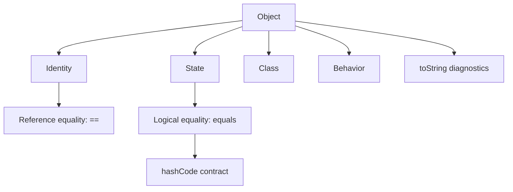
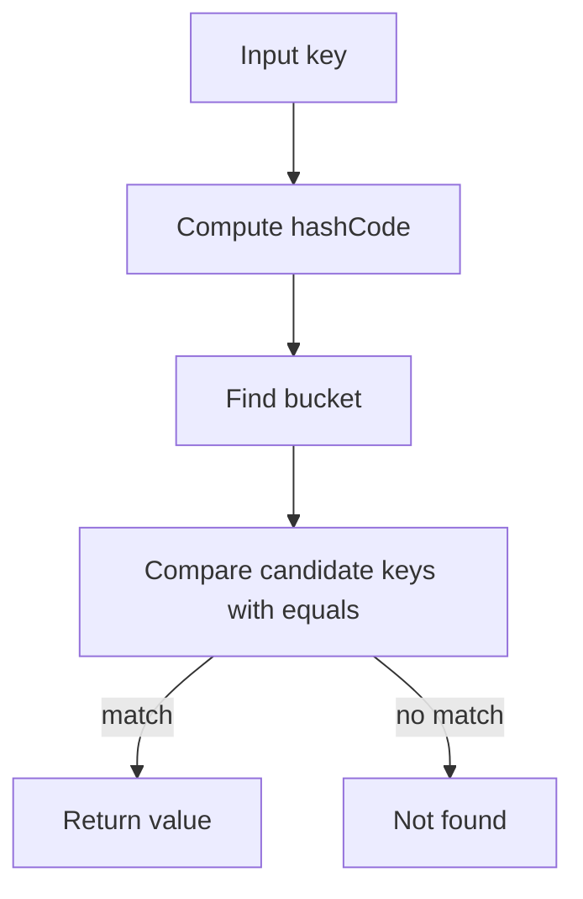

# Part 010 — Object, Equality, HashCode & String Representation

> Target part ini: memahami `java.lang.Object` sebagai root kontrak perilaku object Java, terutama `equals`, `hashCode`, dan `toString`. Ini bukan sekadar “override tiga method”. Ini adalah kontrak correctness untuk collection, cache, deduplication, audit, log, testing, persistence boundary, dan domain modeling.

## 1. Mengapa `Object` Penting?

Semua class Java secara langsung atau tidak langsung mewarisi `java.lang.Object`. Array juga object. Karena itu method-method `Object` adalah common protocol paling dasar di Java.

Method yang paling sering berdampak ke desain data type:

```java
boolean equals(Object obj)
int hashCode()
String toString()
Class<?> getClass()
```

Ada juga method concurrency/lifecycle seperti `wait`, `notify`, `notifyAll`, `clone`, dan `finalize`, tetapi part ini fokus pada kontrak equality, hashing, dan representasi string.

Kesalahan di area ini bisa menghasilkan bug yang sulit dicari:

1. object yang “sama” masuk `HashSet` dua kali;
2. `HashMap.get(key)` gagal padahal key terlihat sama;
3. cache miss karena equality salah;
4. audit log membocorkan PII karena `toString` terlalu lengkap;
5. deduplication salah karena identity dibandingkan bukan domain value;
6. entity equality rusak karena ID mutable atau proxy;
7. record/component equality tidak cocok dengan domain meaning;
8. test flaky karena `toString` dianggap format stabil.

## 2. Mental Model: Identity, Logical Equality, Hash Bucket, Diagnostics



Tiga pertanyaan berbeda:

1. Apakah dua reference menunjuk object yang sama? `==`
2. Apakah dua object setara menurut domain/logical state? `equals`
3. Jika object dipakai di hash-based collection, apakah hash-nya konsisten dengan equality? `hashCode`

Jangan campur ketiganya.

## 3. Default Behavior dari `Object`

Jika class tidak override apa pun:

```java
class CaseId {
    private final String value;

    CaseId(String value) {
        this.value = value;
    }
}

CaseId a = new CaseId("C-1");
CaseId b = new CaseId("C-1");

System.out.println(a.equals(b)); // false by default
System.out.println(a == b);      // false
```

Default `equals` dari `Object` pada dasarnya identity equality. Dua object berbeda dianggap tidak equal walaupun field-nya sama.

Default `toString` biasanya berbentuk:

```text
ClassName@hexHash
```

Itu representasi diagnostik berbasis nama class dan hash code, bukan kontrak domain.

## 4. `equals`: Kontrak Formal

`equals` harus memenuhi properti berikut:

| Properti | Makna |
|---|---|
| Reflexive | `x.equals(x)` harus `true` untuk non-null `x` |
| Symmetric | jika `x.equals(y)` true, maka `y.equals(x)` true |
| Transitive | jika `x==y` secara equality dan `y==z`, maka `x==z` |
| Consistent | hasil tidak berubah selama state yang dipakai equality tidak berubah |
| Non-null | `x.equals(null)` harus `false` |

Contoh implementasi value object sederhana:

```java
public final class CaseId {
    private final String value;

    public CaseId(String value) {
        this.value = Objects.requireNonNull(value);
        if (value.isBlank()) {
            throw new IllegalArgumentException("CaseId must not be blank");
        }
    }

    public String value() {
        return value;
    }

    @Override
    public boolean equals(Object other) {
        if (this == other) return true;
        if (!(other instanceof CaseId caseId)) return false;
        return value.equals(caseId.value);
    }

    @Override
    public int hashCode() {
        return value.hashCode();
    }

    @Override
    public String toString() {
        return value;
    }
}
```

Untuk class `final`, `instanceof` aman karena tidak ada subclass yang bisa menambah state equality.

## 5. `hashCode`: Kontrak dengan `equals`

Kontrak utamanya:

1. jika `a.equals(b)` true, maka `a.hashCode() == b.hashCode()` harus true;
2. jika `a.equals(b)` false, hash code boleh sama, tetapi collision terlalu banyak menurunkan performa;
3. hash code harus konsisten selama state equality tidak berubah.

Contoh bug:

```java
final class BadCaseId {
    private final String value;

    BadCaseId(String value) {
        this.value = value;
    }

    @Override
    public boolean equals(Object other) {
        return other instanceof BadCaseId id && value.equals(id.value);
    }
}
```

Class ini override `equals` tetapi tidak override `hashCode`.

```java
Set<BadCaseId> ids = new HashSet<>();
ids.add(new BadCaseId("C-1"));
ids.add(new BadCaseId("C-1"));

System.out.println(ids.size()); // likely 2, broken logical set behavior
```

## 6. Bagaimana Hash-Based Collection Memakai `hashCode` dan `equals`

Simplified flow `HashMap.get(key)`:



Jika `hashCode` berbeda untuk dua object yang equal, lookup bisa mencari di bucket yang salah.

```java
Map<CaseId, String> map = new HashMap<>();
map.put(new CaseId("C-1"), "open");

System.out.println(map.get(new CaseId("C-1"))); // should be open
```

Ini hanya benar jika `equals` dan `hashCode` konsisten.

## 7. Mutable Field dalam Equality: Bahaya Besar

```java
final class MutableKey {
    private String value;

    MutableKey(String value) {
        this.value = value;
    }

    void change(String value) {
        this.value = value;
    }

    @Override
    public boolean equals(Object other) {
        return other instanceof MutableKey key && Objects.equals(value, key.value);
    }

    @Override
    public int hashCode() {
        return Objects.hash(value);
    }
}
```

Bug:

```java
MutableKey key = new MutableKey("A");
Map<MutableKey, String> map = new HashMap<>();
map.put(key, "value");

key.change("B");

System.out.println(map.get(key)); // may be null
```

Object masih ada di map, tetapi hash bucket berdasarkan old hash. Setelah field berubah, lookup memakai hash baru.

Rule:

> Field yang dipakai dalam `equals/hashCode` sebaiknya immutable selama object berada dalam hash-based collection.

Untuk value object, jadikan class immutable. Untuk entity mutable, hati-hati memakai entity sebagai key.

## 8. `getClass` vs `instanceof` dalam `equals`

Ada dua style umum.

### 8.1 `instanceof` Style

```java
@Override
public boolean equals(Object other) {
    if (this == other) return true;
    if (!(other instanceof CaseId caseId)) return false;
    return value.equals(caseId.value);
}
```

Cocok untuk:

1. final class;
2. hierarchy yang equality-nya memang lintas subclass;
3. interface-based value abstraction dengan desain sangat hati-hati.

### 8.2 `getClass` Style

```java
@Override
public boolean equals(Object other) {
    if (this == other) return true;
    if (other == null || getClass() != other.getClass()) return false;
    CaseId caseId = (CaseId) other;
    return value.equals(caseId.value);
}
```

Cocok untuk:

1. class non-final yang tidak ingin equality lintas subclass;
2. object dengan state subclass yang dapat mengubah equality;
3. model yang ingin equality ketat pada runtime class.

Trade-off:

| Style | Kelebihan | Risiko |
|---|---|---|
| `instanceof` | fleksibel, simple untuk final class | subclass dapat merusak symmetry/transitivity |
| `getClass` | equality ketat, aman dari subclass state | bisa bermasalah dengan proxy/framework tertentu |

Heuristik praktis:

> Untuk value object enterprise, prefer `final class` atau `record`. Ini menghindari banyak perangkap equality inheritance.

## 9. Inheritance dan Equality: Hindari Jika Tidak Perlu

Contoh masalah:

```java
class Point {
    final int x;
    final int y;

    Point(int x, int y) {
        this.x = x;
        this.y = y;
    }

    @Override
    public boolean equals(Object other) {
        return other instanceof Point p && x == p.x && y == p.y;
    }

    @Override
    public int hashCode() {
        return Objects.hash(x, y);
    }
}

class ColoredPoint extends Point {
    final String color;

    ColoredPoint(int x, int y, String color) {
        super(x, y);
        this.color = color;
    }
}
```

Jika `ColoredPoint` tidak ikut equality color, domain salah. Jika ikut color, symmetry/transitivity dengan `Point` bisa rusak.

Solusi desain:

1. jadikan value class `final`;
2. gunakan composition daripada inheritance;
3. pakai record untuk transparent carrier;
4. definisikan equality di satu level abstraksi secara eksplisit.

## 10. Record dan Equality

Record otomatis menghasilkan `equals`, `hashCode`, dan `toString` berdasarkan component.

```java
record CaseId(String value) {}

System.out.println(new CaseId("C-1").equals(new CaseId("C-1"))); // true
System.out.println(new CaseId("C-1")); // CaseId[value=C-1]
```

Ini bagus untuk transparent nominal data carrier.

Tetapi record equality mengikuti component equality. Jika component mutable atau punya equality aneh, record ikut terdampak.

```java
record TagSet(List<String> tags) {}

List<String> tags = new ArrayList<>();
tags.add("a");
TagSet set = new TagSet(tags);

int before = set.hashCode();
tags.add("b");
int after = set.hashCode();
```

Hash code berubah karena list berubah. Maka record dengan collection component tetap perlu defensive copy:

```java
record TagSet(List<String> tags) {
    TagSet {
        tags = List.copyOf(tags);
    }
}
```

## 11. Enum Equality

Enum constant adalah singleton per enum type dalam satu class loader context. Untuk enum, `==` lazim dan aman.

```java
enum CaseStatus { DRAFT, APPROVED, REJECTED }

CaseStatus status = CaseStatus.APPROVED;

if (status == CaseStatus.APPROVED) {
    // ok
}
```

`equals` juga bekerja, tetapi `==` memberi compile-time type safety lebih kuat dan null behavior yang jelas:

```java
status.equals(CaseStatus.APPROVED); // NPE if status null
status == CaseStatus.APPROVED;      // false if status null
```

Namun jangan serialisasi enum hanya berdasarkan ordinal. Gunakan name/string contract yang stabil atau mapping eksplisit.

## 12. Arrays dalam `equals` dan `hashCode`

Array tidak override `equals` secara structural. Default-nya identity equality.

```java
byte[] a = {1, 2, 3};
byte[] b = {1, 2, 3};

System.out.println(a.equals(b));        // false
System.out.println(Arrays.equals(a, b)); // true
```

Jika object punya array field:

```java
final class Digest {
    private final byte[] bytes;

    Digest(byte[] bytes) {
        this.bytes = bytes.clone();
    }

    @Override
    public boolean equals(Object other) {
        return other instanceof Digest d && Arrays.equals(bytes, d.bytes);
    }

    @Override
    public int hashCode() {
        return Arrays.hashCode(bytes);
    }

    byte[] bytes() {
        return bytes.clone();
    }
}
```

Gunakan:

| Field | Equality helper | Hash helper |
|---|---|---|
| primitive array | `Arrays.equals` | `Arrays.hashCode` |
| object array | `Arrays.equals` atau `Arrays.deepEquals` | `Arrays.hashCode` atau `Arrays.deepHashCode` |
| collection | collection `equals` | collection `hashCode` |

## 13. BigDecimal Equality Trap

`BigDecimal` equality mempertimbangkan value dan scale.

```java
new BigDecimal("1.0").equals(new BigDecimal("1.00")); // false
new BigDecimal("1.0").compareTo(new BigDecimal("1.00")); // 0
```

Jika `BigDecimal` menjadi field equality, putuskan apakah scale bagian dari domain meaning.

Untuk money, scale kadang penting karena merepresentasikan presisi input atau aturan currency. Kadang tidak. Jangan asumsi.

Contoh normalisasi:

```java
record Rate(BigDecimal value) {
    Rate {
        value = value.stripTrailingZeros();
    }
}
```

Tetapi normalisasi juga punya konsekuensi. Untuk money, jangan strip scale sembarangan tanpa policy.

## 14. Floating-Point Equality

`double` equality exact sering tidak cocok untuk hasil komputasi.

```java
double x = 0.1 + 0.2;
System.out.println(x == 0.3); // false likely
```

Jika `double` dipakai dalam value object, equality harus disesuaikan dengan domain.

```java
record Coordinate(double latitude, double longitude) {}
```

Record di atas memakai exact equality untuk `double`. Apakah itu cocok? Tergantung.

Untuk hasil measurement, mungkin perlu tolerance. Tetapi `equals` dengan tolerance sulit karena transitivity bisa rusak.

Heuristik:

1. hindari `double` sebagai key identity;
2. untuk measurement, pertimbangkan quantization ke unit integer;
3. untuk money, gunakan `BigDecimal` atau minor unit integer;
4. jangan membuat `equals` berbasis epsilon tanpa memahami kontrak transitivity.

## 15. `Objects.equals` dan `Objects.hash`

Utility `Objects.equals(a, b)` null-safe:

```java
return Objects.equals(left, right);
```

`Objects.hash(fields...)` nyaman, tetapi membuat array varargs dan bisa kurang efisien di hot path.

```java
@Override
public int hashCode() {
    return Objects.hash(countryCode, localNumber);
}
```

Untuk hot path, manual hash bisa lebih ringan:

```java
@Override
public int hashCode() {
    int result = countryCode.hashCode();
    result = 31 * result + localNumber.hashCode();
    return result;
}
```

Jangan optimasi prematur. Tetapi untuk key di cache/map besar, hash quality dan allocation bisa relevan.

## 16. `toString`: Diagnostic Representation, Bukan API Contract Sembarangan

`toString` dipakai oleh log, debugger, exception message, assertion, dan observability.

Contoh baik:

```java
record CaseId(String value) {
    @Override
    public String toString() {
        return value;
    }
}
```

Untuk object dengan data sensitif:

```java
record CitizenId(String value) {
    @Override
    public String toString() {
        return "CitizenId[masked=" + mask(value) + "]";
    }
}
```

Jangan log PII/secret/token sembarangan:

```java
record LoginRequest(String username, String password) {}
// auto toString includes password: dangerous
```

Untuk request/command yang membawa secret, override `toString` atau jangan gunakan record auto `toString` langsung di log.

## 17. `toString` Stabil atau Tidak?

Secara default, `toString` sebaiknya dianggap diagnostic, bukan wire format.

Buruk:

```java
String payload = caseId.toString(); // used as external API contract without explicit decision
```

Lebih eksplisit:

```java
String payload = caseId.value();
```

Jika `toString` memang menjadi canonical textual representation, dokumentasikan dan test sebagai contract.

Contoh type yang wajar:

```java
record CaseId(String value) {
    @Override
    public String toString() {
        return value;
    }
}
```

Tetapi untuk object kompleks:

```java
caseFile.toString()
```

jangan jadikan format parsing/integration.

## 18. Equality untuk Domain Value Object

Value object equality harus berdasarkan semua field yang menentukan meaning.

```java
record Money(String currency, BigDecimal amount) {
    Money {
        currency = Objects.requireNonNull(currency);
        amount = Objects.requireNonNull(amount);
    }
}
```

Pertanyaan domain:

1. apakah `currency` case-sensitive?
2. apakah `amount` scale penting?
3. apakah rounding sudah dilakukan sebelum object dibuat?
4. apakah `Money("IDR", 1000)` sama dengan `Money("IDR", 1000.00)`?
5. apakah currency harus ISO code valid?

Equality bukan sekadar field comparison. Equality harus mewakili domain invariant.

## 19. Equality untuk Entity

Entity biasanya punya lifecycle dan identity yang bertahan melampaui state field.

```java
class CaseFile {
    private CaseId id;
    private CaseStatus status;
    private List<Violation> violations;
}
```

Dua instance bisa merepresentasikan case yang sama:

```java
CaseFile a = repository.find(id);
CaseFile b = repository.find(id);
```

Pertanyaan:

1. apakah `a.equals(b)` harus true jika ID sama?
2. bagaimana jika ID belum assigned?
3. apakah equality berubah setelah persist?
4. bagaimana dengan proxy class?
5. apakah mutable state seperti `status` masuk equality?

Heuristik:

| Type | Equality biasanya berdasarkan |
|---|---|
| Value object | immutable state lengkap yang menentukan meaning |
| Entity | stable identity, sering ID domain/persistence |
| DTO | structural fields, tetapi hati-hati PII/toString |
| Command | request identity atau full content, tergantung idempotency |
| Event | event ID atau semantic payload, tergantung deduplication model |

Entity equality adalah area sulit. Hindari memakai entity mutable sebagai key `HashMap` jika lifecycle ID belum stabil.

## 20. Equality untuk Command, Event, dan Message

Di distributed system, equality harus menjawab tujuan operasional.

Contoh event:

```java
record CaseApprovedEvent(
    EventId eventId,
    CaseId caseId,
    Instant occurredAt,
    OfficerId approvedBy
) {}
```

Apakah dua event equal jika `eventId` sama? Biasanya iya untuk deduplication.

Tetapi untuk testing, Anda mungkin ingin membandingkan payload tanpa event ID atau timestamp.

Solusi:

1. jangan paksa satu `equals` untuk semua kebutuhan;
2. gunakan domain equality di object;
3. gunakan comparator/assertion khusus untuk test;
4. gunakan idempotency key untuk message processing;
5. dokumentasikan deduplication identity.

## 21. Caching dan Equality

Cache key harus immutable dan equality-stable.

Buruk:

```java
class SearchCriteria {
    List<String> tags;
    LocalDate from;
    LocalDate to;
}
```

Jika `tags` bisa berubah setelah dipakai sebagai key, cache rusak.

Lebih baik:

```java
record SearchCriteria(List<String> tags, LocalDate from, LocalDate to) {
    SearchCriteria {
        tags = List.copyOf(tags);
        from = Objects.requireNonNull(from);
        to = Objects.requireNonNull(to);
    }
}
```

Cache key ideal:

1. immutable;
2. small enough;
3. equality/hashCode cheap;
4. canonicalized jika perlu;
5. tidak membawa mutable collection mentah;
6. tidak membawa floating-point hasil komputasi tanpa normalisasi.

## 22. `equals` dan Security

Equality kadang dipakai untuk secret/token comparison.

```java
if (providedToken.equals(expectedToken)) {
    allow();
}
```

Untuk security-sensitive comparison, naive `equals` bisa membuka timing side-channel pada beberapa konteks. Gunakan API constant-time comparison yang sesuai, misalnya untuk byte array secret gunakan mekanisme khusus dari library/security API.

Dalam seri ini, prinsipnya:

> Jangan menggunakan equality object biasa untuk secret comparison tanpa memahami threat model.

Seri security membahas detail cryptographic equality dan timing attack.

## 23. `clone`: Jangan Jadikan Default Copy Strategy

`Object.clone` ada, tetapi jarang menjadi desain modern yang baik.

Masalah umum:

1. shallow copy default;
2. kontrak sulit;
3. constructor tidak dipanggil dengan cara normal;
4. final fields dan inheritance bisa membingungkan;
5. copy semantics tidak eksplisit.

Prefer:

```java
record CaseSnapshot(CaseId id, CaseStatus status, List<Violation> violations) {
    CaseSnapshot {
        violations = List.copyOf(violations);
    }
}
```

Atau explicit copy factory:

```java
CaseFile copy = CaseFile.copyOf(original);
```

## 24. Testing `equals` dan `hashCode`

Minimal test untuk value object:

```java
@Test
void equalObjectsHaveSameHashCode() {
    CaseId a = new CaseId("C-1");
    CaseId b = new CaseId("C-1");

    assertEquals(a, b);
    assertEquals(a.hashCode(), b.hashCode());
}
```

Test properti:

1. reflexive;
2. symmetric;
3. transitive;
4. not equal to null;
5. not equal to unrelated type;
6. same hash for equal objects;
7. not affected by external mutable input;
8. stable after construction.

Contoh mutation safety test:

```java
@Test
void constructorDefensivelyCopiesTags() {
    List<String> tags = new ArrayList<>(List.of("a"));
    SearchCriteria criteria = new SearchCriteria(tags, from, to);

    int hash = criteria.hashCode();
    tags.add("b");

    assertEquals(hash, criteria.hashCode());
    assertEquals(List.of("a"), criteria.tags());
}
```

## 25. Production Failure Modes

### 25.1 Missing `hashCode`

Symptom:

1. `HashSet` contains duplicates;
2. `HashMap.get` returns null;
3. deduplication unreliable.

Root cause:

```java
@Override equals // yes
@Override hashCode // missing
```

### 25.2 Mutable Key

Symptom:

1. cache entry cannot be found;
2. memory grows because old key remains inaccessible by logical lookup;
3. deduplication inconsistent.

Root cause: field used by hash changes after insert.

### 25.3 Array Field Compared by Identity

Symptom:

1. two digest/signature objects not equal;
2. byte content same but object berbeda;
3. audit mismatch.

Root cause: `Objects.equals(byteArray1, byteArray2)` compares array object equality, not content equality.

### 25.4 Record with Mutable Component

Symptom:

1. record hash changes;
2. map lookup fails;
3. supposedly immutable DTO mutates.

Root cause: record shallow immutability misunderstood.

### 25.5 `toString` Leaks Secret

Symptom:

1. password/token appears in log;
2. PII appears in exception;
3. compliance incident.

Root cause: auto-generated or overly complete `toString`.

### 25.6 `toString` Used as Parser Contract

Symptom:

1. integration breaks after refactor;
2. logs consumed as structured data fail;
3. incompatible format changes.

Root cause: diagnostic representation used as wire format.

## 26. Decision Table: How Should This Type Define Equality?

| Type Kind | Recommended Equality | Recommended `hashCode` | `toString` Guidance |
|---|---|---|---|
| Domain ID | wrapped canonical value | same canonical value | canonical ID string or typed representation |
| Money | currency + normalized amount policy | same fields | avoid ambiguous formatting |
| DTO | structural fields | same fields | safe fields only |
| Entity | stable identity only, if available | stable identity | avoid dumping full graph |
| Event | event ID for deduplication | event ID | include event ID/type, avoid huge payload |
| Command | idempotency key or structural fields | same decision | avoid secrets |
| Secret/token | avoid normal equality for security-critical compare | avoid hash/log | masked only |
| Collection wrapper | immutable copied contents | content hash | size/summary usually enough |

## 27. Implementation Template: Immutable Value Class

```java
public final class EmailAddress {
    private final String value;

    public EmailAddress(String value) {
        String normalized = Objects.requireNonNull(value).trim().toLowerCase(Locale.ROOT);
        if (!isValid(normalized)) {
            throw new IllegalArgumentException("Invalid email address");
        }
        this.value = normalized;
    }

    public String value() {
        return value;
    }

    @Override
    public boolean equals(Object other) {
        if (this == other) return true;
        return other instanceof EmailAddress that && value.equals(that.value);
    }

    @Override
    public int hashCode() {
        return value.hashCode();
    }

    @Override
    public String toString() {
        return mask(value);
    }

    private static boolean isValid(String value) {
        return value.contains("@");
    }

    private static String mask(String value) {
        int at = value.indexOf('@');
        if (at <= 1) return "***" + value.substring(Math.max(0, at));
        return value.charAt(0) + "***" + value.substring(at);
    }
}
```

Catatan:

1. constructor melakukan canonicalization;
2. field final;
3. equality berdasarkan canonical value;
4. hashCode konsisten;
5. toString masked karena email bisa PII;
6. class final agar equality tidak dirusak subclass.

## 28. Implementation Template: Record dengan Defensive Copy

```java
public record AttachmentDigest(byte[] sha256) {
    public AttachmentDigest {
        Objects.requireNonNull(sha256);
        if (sha256.length != 32) {
            throw new IllegalArgumentException("SHA-256 digest must be 32 bytes");
        }
        sha256 = sha256.clone();
    }

    @Override
    public byte[] sha256() {
        return sha256.clone();
    }

    @Override
    public boolean equals(Object other) {
        return other instanceof AttachmentDigest digest
            && Arrays.equals(sha256, digest.sha256);
    }

    @Override
    public int hashCode() {
        return Arrays.hashCode(sha256);
    }

    @Override
    public String toString() {
        return "AttachmentDigest[sha256=" + HexFormat.of().formatHex(sha256) + "]";
    }
}
```

Record auto equality tidak cukup jika component adalah array, karena array equality default berbasis identity.

## 29. Pull Request Review Checklist

Saat melihat `equals/hashCode/toString`, cek:

1. Jika `equals` dioverride, apakah `hashCode` juga dioverride?
2. Apakah field yang dipakai equality immutable?
3. Apakah class value object `final` atau record?
4. Apakah equality inheritance bisa merusak symmetry/transitivity?
5. Apakah array field dibandingkan dengan `Arrays.equals`?
6. Apakah collection field sudah defensively copied?
7. Apakah BigDecimal scale semantics disengaja?
8. Apakah floating-point equality aman untuk domain?
9. Apakah entity ID sudah stable sebelum dipakai equality/hash?
10. Apakah object dipakai sebagai cache/map key?
11. Apakah `toString` membocorkan PII/secret?
12. Apakah `toString` dipakai sebagai wire format tanpa keputusan eksplisit?
13. Apakah `Objects.hash` cukup performanya untuk hot path?
14. Apakah test equality mencakup null dan unrelated type?
15. Apakah hashCode stabil setelah construction?

## 30. Deliberate Practice 20–30 Menit

### Latihan 1 — Broken HashSet

Prediksi output:

```java
final class UserId {
    private final String value;

    UserId(String value) {
        this.value = value;
    }

    @Override
    public boolean equals(Object other) {
        return other instanceof UserId userId && value.equals(userId.value);
    }
}

Set<UserId> ids = new HashSet<>();
ids.add(new UserId("U-1"));
ids.add(new UserId("U-1"));
System.out.println(ids.size());
```

Perbaiki class tersebut.

### Latihan 2 — Mutable Record Component

Apa masalah class ini?

```java
record Filter(List<String> statuses) {}
```

Tulis versi yang aman sebagai cache key.

### Latihan 3 — Array Equality

Apa output?

```java
record Digest(byte[] bytes) {}

Digest a = new Digest(new byte[] {1, 2});
Digest b = new Digest(new byte[] {1, 2});

System.out.println(a.equals(b));
```

Tulis versi `Digest` yang benar.

### Latihan 4 — `toString` Policy

Untuk record ini:

```java
record LoginCommand(String username, String password, String otp) {}
```

Rancang `toString` yang aman untuk log production.

## 31. Ringkasan

`Object` memberi kontrak paling dasar untuk object Java. Intinya:

1. `==` pada reference berarti identity equality;
2. default `Object.equals` juga identity-based;
3. domain/value equality membutuhkan override `equals`;
4. jika override `equals`, override `hashCode`;
5. hash-based collection bergantung pada konsistensi `equals/hashCode`;
6. field mutable dalam equality adalah sumber bug besar;
7. record auto equality bagus, tetapi tetap shallow dan mengikuti equality component;
8. array perlu `Arrays.equals/hashCode` untuk content equality;
9. `toString` adalah diagnostic representation kecuali Anda jadikan contract eksplisit;
10. `toString` harus memperhatikan PII, secret, ukuran output, dan stabilitas format.

Part berikutnya membahas `class` sebagai data shape dan behavior boundary: bagaimana class dipakai untuk menjaga invariant, mengontrol mutation, dan membentuk aggregate yang defensible secara domain.

## References

- Java SE 25 API, `java.lang.Object`: https://docs.oracle.com/en/java/javase/25/docs/api/java.base/java/lang/Object.html
- Java SE 25 API, `java.util.Objects`: https://docs.oracle.com/en/java/javase/25/docs/api/java.base/java/util/Objects.html
- Java Language Specification, Java SE 25, Chapter 4 — Types, Values, and Variables: https://docs.oracle.com/javase/specs/jls/se25/html/jls-4.html
