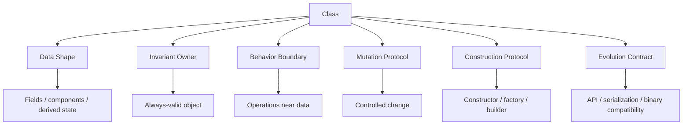
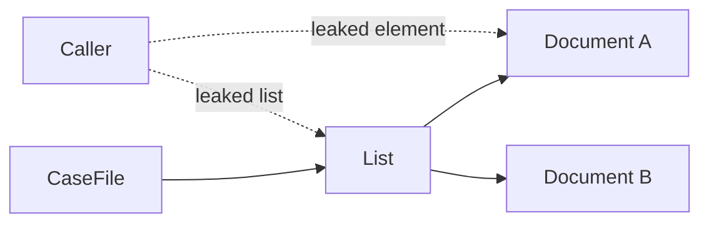
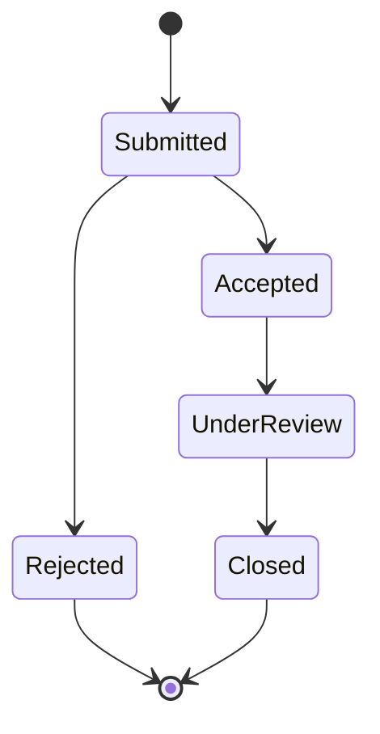

# Part 011 — Class as Data Shape & Behavior Boundary

> Target part ini: melihat `class` bukan sekadar wadah field dan method, tetapi sebagai **unit representasi data**, **pemilik invariant**, **boundary perilaku**, dan **kontrak evolusi**. Kita tidak mengulang OOP dasar. Kita fokus pada cara engineer senior membaca class sebagai model data yang defensible, aman, bisa dievolusi, dan tidak membocorkan state.

## 1. Mengapa Class Penting Dalam Seri Data Types?

Di Java, `class` adalah bentuk reference type paling umum. Namun dalam desain enterprise, class sering disalahgunakan sebagai:

1. tas field publik;
2. DTO yang kemudian dipaksa menjadi domain object;
3. entity yang semua invariant-nya berada di service;
4. object mutable yang diam-diam dibagi ke banyak caller;
5. model data yang terlihat kuat di Java tetapi rapuh di JSON/DB boundary;
6. carrier state tanpa lifecycle protocol;
7. class besar yang mencampur validasi, persistence, formatting, policy, dan orchestration.

Class yang baik menjawab pertanyaan berikut:

```text
Apa data yang direpresentasikan?
Invariant apa yang harus selalu benar?
Siapa yang boleh mengubah state?
Kapan object valid?
Apa perilaku yang harus dekat dengan data?
Apa yang tidak boleh diketahui caller?
Bagaimana class ini bisa berubah tanpa merusak kontrak eksternal?
```

Mental model utama:



A top-tier engineer tidak hanya bertanya “class ini compile atau tidak?”, tetapi “apakah class ini membuat illegal state sulit atau mustahil terjadi?”

## 2. Class Sebagai Data Shape

Class mendefinisikan bentuk data nominal: nama tipe memiliki makna, bukan hanya struktur field.

```java
public final class CaseNumber {
    private final String value;

    public CaseNumber(String value) {
        if (value == null || !value.matches("CASE-[0-9]{8}")) {
            throw new IllegalArgumentException("Invalid case number");
        }
        this.value = value;
    }

    public String value() {
        return value;
    }
}
```

Secara struktural, `CaseNumber` hanya membungkus `String`. Secara domain, ia berbeda dari `Email`, `OfficerId`, `CustomerId`, atau `DocumentNumber`.

Tanpa type wrapper:

```java
void assignCase(String caseNumber, String officerId) { }
```

Caller bisa salah urutan:

```java
assignCase("OFF-1001", "CASE-20260001"); // compile, domain salah
```

Dengan type wrapper:

```java
void assignCase(CaseNumber caseNumber, OfficerId officerId) { }
```

Compiler membantu menolak salah kategori data.

### 2.1 Data Shape Bukan Hanya Field

Data shape mencakup:

| Elemen | Contoh | Risiko Jika Tidak Jelas |
|---|---|---|
| Required field | `caseNumber`, `createdAt` | object setengah valid |
| Optional field | `closedAt`, `assignedOfficer` | null ambiguity |
| Derived field | `isOverdue()` | stale cached state |
| Collection field | `List<Document>` | aliasing/mutation leak |
| Time field | `Instant`, `LocalDate` | timezone ambiguity |
| Numeric field | `BigDecimal amount` | scale/rounding ambiguity |
| Status field | `CaseStatus status` | invalid transition |

Class harus membuat perbedaan ini eksplisit.

## 3. Class Sebagai Pemilik Invariant

Invariant adalah kondisi yang harus selalu benar untuk semua instance valid.

Contoh invariant:

```text
closedAt hanya boleh ada jika status CLOSED.
dueDate tidak boleh sebelum receivedDate.
assignedOfficer wajib ada jika status UNDER_REVIEW.
penaltyAmount tidak boleh negatif.
caseNumber harus sesuai format regulator.
```

Jika invariant tersebar di service, controller, mapper, dan repository, model menjadi rapuh.

### 3.1 Bad: Anemic Data Bag

```java
public class EnforcementCase {
    public String caseNumber;
    public String status;
    public Instant receivedAt;
    public Instant closedAt;
    public String assignedOfficerId;
}
```

Masalah:

1. semua caller bisa memutasi semua field;
2. status string bisa berisi nilai ilegal;
3. `closedAt` bisa diisi saat status masih `OPEN`;
4. tidak ada construction protocol;
5. tidak ada audit trail behavior;
6. validasi kemungkinan diduplikasi di banyak layer.

### 3.2 Better: Class Menjaga Always-Valid State

```java
public final class EnforcementCase {
    private final CaseNumber caseNumber;
    private CaseStatus status;
    private final Instant receivedAt;
    private Instant closedAt;
    private OfficerId assignedOfficerId;

    public EnforcementCase(CaseNumber caseNumber, Instant receivedAt) {
        if (caseNumber == null) throw new IllegalArgumentException("caseNumber is required");
        if (receivedAt == null) throw new IllegalArgumentException("receivedAt is required");

        this.caseNumber = caseNumber;
        this.receivedAt = receivedAt;
        this.status = CaseStatus.OPEN;
    }

    public void assignTo(OfficerId officerId) {
        if (officerId == null) throw new IllegalArgumentException("officerId is required");
        if (status == CaseStatus.CLOSED) {
            throw new IllegalStateException("Closed case cannot be assigned");
        }
        this.assignedOfficerId = officerId;
        this.status = CaseStatus.UNDER_REVIEW;
    }

    public void close(Instant closedAt) {
        if (closedAt == null) throw new IllegalArgumentException("closedAt is required");
        if (closedAt.isBefore(receivedAt)) {
            throw new IllegalArgumentException("closedAt cannot be before receivedAt");
        }
        if (assignedOfficerId == null) {
            throw new IllegalStateException("Case must be assigned before closure");
        }
        this.closedAt = closedAt;
        this.status = CaseStatus.CLOSED;
    }
}
```

Perhatikan: caller tidak bisa membuat state `CLOSED` tanpa `closedAt`, atau `closedAt` sebelum `receivedAt`, selama semua perubahan melewati method class.

## 4. Constructor Bukan Tempat Set Field Saja

Constructor adalah construction protocol. Ia menentukan kapan object boleh dianggap valid.

### 4.1 Constructor Harus Menjamin Minimum Validity

```java
public final class ReviewDeadline {
    private final Instant receivedAt;
    private final Instant dueAt;

    public ReviewDeadline(Instant receivedAt, Instant dueAt) {
        if (receivedAt == null) throw new IllegalArgumentException("receivedAt is required");
        if (dueAt == null) throw new IllegalArgumentException("dueAt is required");
        if (!dueAt.isAfter(receivedAt)) {
            throw new IllegalArgumentException("dueAt must be after receivedAt");
        }
        this.receivedAt = receivedAt;
        this.dueAt = dueAt;
    }
}
```

Jika constructor menerima object invalid lalu berharap caller memanggil `validate()` terpisah, invariant menjadi opsional.

```java
var deadline = new ReviewDeadline(receivedAt, dueAt);
deadline.validate(); // mudah lupa
```

Always-valid object lebih aman daripada validate-later object.

### 4.2 Static Factory Untuk Nama Intent

Constructor tidak punya nama selain nama class. Jika ada banyak cara membuat object, factory method sering lebih jelas.

```java
public final class ReviewDeadline {
    private final Instant dueAt;

    private ReviewDeadline(Instant dueAt) {
        this.dueAt = dueAt;
    }

    public static ReviewDeadline fromReceivedAt(
            Instant receivedAt,
            Duration allowedDuration
    ) {
        if (receivedAt == null) throw new IllegalArgumentException("receivedAt is required");
        if (allowedDuration == null || allowedDuration.isNegative() || allowedDuration.isZero()) {
            throw new IllegalArgumentException("allowedDuration must be positive");
        }
        return new ReviewDeadline(receivedAt.plus(allowedDuration));
    }

    public static ReviewDeadline fixedAt(Instant dueAt) {
        if (dueAt == null) throw new IllegalArgumentException("dueAt is required");
        return new ReviewDeadline(dueAt);
    }
}
```

Factory method berguna untuk:

1. memberi nama business intent;
2. menyembunyikan implementasi;
3. mengembalikan subtype/interface;
4. caching;
5. validasi berbeda per skenario;
6. migrasi internal tanpa mengubah caller.

## 5. Field: State, Cache, Dependency, atau Derived Value?

Tidak semua data pantas menjadi field.

```java
public final class InvoiceLine {
    private final BigDecimal unitPrice;
    private final int quantity;
    private final BigDecimal total; // hati-hati
}
```

`total` bisa derived dari `unitPrice * quantity`. Jika disimpan sebagai field, ia bisa menjadi stale jika salah satu input berubah.

Better jika immutable:

```java
public BigDecimal total() {
    return unitPrice.multiply(BigDecimal.valueOf(quantity));
}
```

Atau jika harus disimpan karena audit/regulatory snapshot, namanya harus eksplisit:

```java
private final BigDecimal capturedTotalAtSubmission;
```

### 5.1 Klasifikasi Field

| Jenis Field | Contoh | Design Rule |
|---|---|---|
| Identity field | `caseId` | stabil, jangan mutable jika dipakai equality |
| Required state | `receivedAt` | validasi di constructor |
| Optional state | `closedAt` | hindari null ambiguity; jelaskan lifecycle |
| Derived state | `isOverdue` | jangan disimpan kecuali snapshot sengaja |
| Cached state | `hash` | invalidation harus jelas |
| Dependency | `Clock`, `Policy` | biasanya bukan bagian equality |
| Collection | `documents` | defensive copy / unmodifiable view |

## 6. Mutability Boundary

Class mutable bukan otomatis buruk. Yang buruk adalah mutability tanpa protocol.

### 6.1 Bad: Setter Membuka Semua Kombinasi State

```java
public class CaseReview {
    private CaseStatus status;
    private Instant assignedAt;
    private Instant completedAt;

    public void setStatus(CaseStatus status) { this.status = status; }
    public void setAssignedAt(Instant assignedAt) { this.assignedAt = assignedAt; }
    public void setCompletedAt(Instant completedAt) { this.completedAt = completedAt; }
}
```

Setter seperti ini membuat state transition tidak punya makna. Caller bisa melakukan:

```java
review.setStatus(CaseStatus.COMPLETED);
review.setAssignedAt(null);
review.setCompletedAt(Instant.parse("2026-01-01T00:00:00Z"));
```

### 6.2 Better: Intent-Revealing Methods

```java
public final class CaseReview {
    private CaseStatus status = CaseStatus.NEW;
    private Instant assignedAt;
    private Instant completedAt;

    public void assign(Instant assignedAt) {
        if (status != CaseStatus.NEW) {
            throw new IllegalStateException("Only new review can be assigned");
        }
        this.assignedAt = requireNonNull(assignedAt, "assignedAt");
        this.status = CaseStatus.ASSIGNED;
    }

    public void complete(Instant completedAt) {
        if (status != CaseStatus.ASSIGNED) {
            throw new IllegalStateException("Only assigned review can be completed");
        }
        if (completedAt.isBefore(assignedAt)) {
            throw new IllegalArgumentException("completedAt cannot be before assignedAt");
        }
        this.completedAt = completedAt;
        this.status = CaseStatus.COMPLETED;
    }
}
```

Mutation harus berbentuk operation bermakna, bukan perubahan field mentah.

## 7. Encapsulation: Bukan Sekadar `private`

`private` melindungi direct access, tetapi tidak otomatis melindungi state jika reference mutable bocor.

### 7.1 Mutable Collection Leak

```java
public final class CaseFile {
    private final List<Document> documents = new ArrayList<>();

    public List<Document> documents() {
        return documents; // leak
    }
}
```

Caller bisa melakukan:

```java
caseFile.documents().clear();
```

Better:

```java
public List<Document> documents() {
    return List.copyOf(documents);
}

public void addDocument(Document document) {
    if (document == null) throw new IllegalArgumentException("document is required");
    documents.add(document);
}
```

`List.copyOf` membuat snapshot unmodifiable. Jika elemen `Document` mutable, ini hanya melindungi list, bukan object di dalamnya. Defensive copying harus dipikirkan pada dua level: container dan element.



## 8. Immutability: Pilihan Default Untuk Value-Like Classes

Immutable class punya banyak keuntungan:

1. lebih mudah dipahami;
2. aman dibagi antar thread setelah construction benar;
3. cocok untuk value object;
4. cocok untuk cache key;
5. lebih aman untuk collection key;
6. mengurangi temporal coupling.

Template sederhana:

```java
public final class MoneyAmount {
    private final BigDecimal amount;
    private final Currency currency;

    public MoneyAmount(BigDecimal amount, Currency currency) {
        if (amount == null) throw new IllegalArgumentException("amount is required");
        if (currency == null) throw new IllegalArgumentException("currency is required");
        if (amount.signum() < 0) throw new IllegalArgumentException("amount cannot be negative");

        this.amount = amount.stripTrailingZeros();
        this.currency = currency;
    }

    public BigDecimal amount() {
        return amount;
    }

    public Currency currency() {
        return currency;
    }
}
```

Namun immutable bukan berarti semua class harus `final`. Untuk domain value object, `final` sering masuk akal karena equality/invariant lebih mudah dijaga. Untuk framework atau plugin architecture, extensibility mungkin dibutuhkan, tetapi harus disengaja.

## 9. Class Design dan Equality

Part 010 sudah membahas equality. Di sini kita lihat implikasinya pada class design.

Pertanyaan utama:

```text
Apakah instance class ini punya identity domain, atau ia hanya value?
```

### 9.1 Value-Like Class

```java
public final class CaseNumber {
    private final String value;

    // equals/hashCode berdasarkan value
}
```

Dua `CaseNumber("CASE-20260001")` adalah sama secara logical.

### 9.2 Entity-Like Class

```java
public class EnforcementCase {
    private final CaseId id;
    private CaseStatus status;
}
```

Entity sering punya identity yang stabil meskipun state berubah. Equality berdasarkan semua field mutable bisa merusak hash collection.

Rule praktis:

| Class Type | Equality Bias |
|---|---|
| Value object | berdasarkan semua state signifikan yang immutable |
| Entity | berdasarkan stable identity, hati-hati dengan transient object |
| DTO | biasanya tidak butuh custom equality kecuali test/dedup |
| Service object | identity equality biasanya cukup |
| Event | berdasarkan event id atau full immutable payload, tergantung kebutuhan |

## 10. Class dan Lifecycle State

Class sering mewakili entity dengan lifecycle. Jika lifecycle kompleks, jangan biarkan semua kombinasi field terbuka.

Bad:

```java
class CaseLifecycle {
    CaseStatus status;
    Instant submittedAt;
    Instant acceptedAt;
    Instant rejectedAt;
    Instant closedAt;
}
```

Better minimum:

```java
public final class CaseLifecycle {
    private CaseStatus status;
    private final Instant submittedAt;
    private Instant acceptedAt;
    private Instant rejectedAt;
    private Instant closedAt;

    public void accept(Instant acceptedAt) { /* validate transition */ }
    public void reject(Instant rejectedAt, RejectionReason reason) { /* validate transition */ }
    public void close(Instant closedAt) { /* validate transition */ }
}
```

Jika state machine makin kompleks, class bisa mendelegasikan policy transisi ke object lain, tetapi state mutation tetap harus terkendali.



## 11. Behavior Harus Dekat Dengan Data Jika Ia Menjaga Invariant

Ada dua ekstrem:

1. semua logic di service, class hanya field;
2. semua orchestration di entity, class menjadi god object.

Heuristic:

| Logic | Tempat Lebih Cocok |
|---|---|
| Validasi invariant internal | class/domain object |
| Operasi yang mengubah state object | class/domain object |
| Query derived dari state object | class/domain object |
| Koordinasi repository/API/message broker | service/application layer |
| Policy lintas aggregate | domain service/policy object |
| Formatting UI | presentation layer |
| Mapping JSON/DB | adapter/mapper layer |

Contoh behavior dekat data:

```java
public boolean isOverdue(Clock clock) {
    return status != CaseStatus.CLOSED && Instant.now(clock).isAfter(dueAt);
}
```

Jika method butuh repository, transaction, external service, atau network call, itu biasanya bukan pure data behavior.

## 12. Nested Class, Static Nested Class, dan Inner Class

Class bisa mendeklarasikan member class. Dalam modeling data, gunakan dengan hati-hati.

### 12.1 Static Nested Class Untuk Helper Terkait Erat

```java
public final class CaseFilter {
    private final Optional<CaseStatus> status;
    private final Optional<OfficerId> officerId;

    public static final class Builder {
        private CaseStatus status;
        private OfficerId officerId;

        public Builder status(CaseStatus status) {
            this.status = status;
            return this;
        }

        public Builder officerId(OfficerId officerId) {
            this.officerId = officerId;
            return this;
        }

        public CaseFilter build() {
            return new CaseFilter(status, officerId);
        }
    }
}
```

Static nested class tidak membawa implicit reference ke outer instance.

### 12.2 Inner Class Membawa Outer Reference

Non-static inner class punya reference implisit ke instance outer class. Ini bisa membuat lifecycle dan memory retention lebih sulit dipahami.

```java
class Outer {
    class Inner { }
}
```

Dalam model data enterprise, prefer static nested class kecuali inner class benar-benar membutuhkan outer instance.

## 13. Inheritance Dalam Class Data Model

Inheritance mudah disalahgunakan untuk reuse field. Untuk data modeling, inheritance harus menjawab “is-a” secara behavioral, bukan hanya “punya field sama”.

Bad:

```java
class Person {
    String name;
}

class Company extends Person { // salah secara domain
    String registrationNumber;
}
```

Better:

```java
sealed interface Party permits Individual, Organization { }

final class Individual implements Party {
    private final PersonName name;
}

final class Organization implements Party {
    private final OrganizationName name;
    private final RegistrationNumber registrationNumber;
}
```

Inheritance class membawa konsekuensi:

1. protected state bisa bocor ke subclass;
2. constructor chaining bisa kompleks;
3. equality antar subtype bisa tricky;
4. invariant superclass bisa dilanggar subclass;
5. binary compatibility dan API evolution lebih sulit.

Untuk data model, composition sering lebih stabil daripada inheritance class.

## 14. Class dan Framework Boundary

Banyak framework Java memengaruhi bentuk class:

| Framework Need | Dampak ke Class | Risiko |
|---|---|---|
| JPA no-arg constructor | constructor protected/package-private | object setengah valid saat hydration |
| Jackson deserialization | setter/field access/constructor binding | invariant bypass |
| Bean Validation | annotation validation | validasi bisa terlambat |
| Proxy framework | non-final class/method | equality dan lazy loading surprise |
| Reflection | private field bisa diakses | encapsulation runtime tidak absolut |

Rule penting: framework requirement tidak boleh diam-diam menghancurkan domain invariant. Jika framework butuh constructor kosong, buat boundary type terpisah atau constructor visibility minimal.

```java
// Persistence entity boundary
@Entity
class CaseEntity {
    @Id
    private String id;
    private String status;

    protected CaseEntity() { } // for JPA
}

// Domain model
public final class EnforcementCase {
    private final CaseId id;
    private final CaseStatus status;
}
```

Tidak semua sistem butuh pemisahan domain/entity. Namun untuk sistem regulatori, audit, dan lifecycle kompleks, pemisahan sering mengurangi risiko invariant bypass.

## 15. Class API: Minimal, Stable, Intentional

Public member adalah kontrak. Semakin banyak public method, semakin besar surface area untuk dipertahankan.

Checklist public API class:

1. Apakah method ini bagian dari domain language?
2. Apakah caller perlu tahu field ini?
3. Apakah return value mutable?
4. Apakah method mengembalikan snapshot atau live view?
5. Apakah nullability jelas?
6. Apakah nama method menunjukkan intent?
7. Apakah exception contract jelas?
8. Apakah method ini akan sulit diubah nanti?

### 15.1 Jangan Bocorkan Internal Representation

```java
public class CaseNumber {
    private final String value;

    public String value() {
        return value;
    }
}
```

Untuk simple immutable wrapper, ini okay. Tetapi untuk richer type, hati-hati:

```java
public Pattern internalPattern() { // bocor detail implementasi
    return pattern;
}
```

Better expose behavior:

```java
public boolean matches(String input) {
    return pattern.matcher(input).matches();
}
```

## 16. Exception Design Dalam Class

Class yang menjaga invariant harus memilih exception yang masuk akal.

| Kondisi | Exception Umum |
|---|---|
| Argument caller invalid | `IllegalArgumentException` |
| State object tidak memungkinkan operasi | `IllegalStateException` |
| Null argument tidak valid | `NullPointerException` via `Objects.requireNonNull` atau `IllegalArgumentException`, pilih konsisten |
| Domain rule gagal dan perlu ditangani | custom domain exception atau result type |

Contoh:

```java
public void close(Instant closedAt) {
    Objects.requireNonNull(closedAt, "closedAt");
    if (status == CaseStatus.CLOSED) {
        throw new IllegalStateException("Case already closed");
    }
    if (closedAt.isBefore(receivedAt)) {
        throw new IllegalArgumentException("closedAt cannot be before receivedAt");
    }
    this.status = CaseStatus.CLOSED;
    this.closedAt = closedAt;
}
```

Dalam library/API yang dikonsumsi banyak caller, exception message adalah diagnostic contract. Jangan isi PII atau secret.

## 17. Thread Safety dan Safe Publication Ringkas

Part concurrency akan dibahas di seri lain, tetapi class data type harus sadar minimal:

1. immutable object lebih mudah dibagi antar thread;
2. `final` fields membantu construction safety jika object tidak bocor saat constructor;
3. mutable object shared butuh synchronization atau confinement;
4. returning mutable internal state membuat thread safety klaim palsu;
5. lazy cache harus volatile/synchronized/atomic atau dibuat benign race secara sadar.

Bad:

```java
public final class LazyHash {
    private final String value;
    private int hash; // race jika shared
}
```

Biasanya jangan optimize sebelum ada bukti. Simpan class value tetap sederhana.

## 18. Serialization dan Binary Compatibility

Class yang menjadi API publik atau serialized form punya dua kontrak:

1. source/binary contract untuk Java caller;
2. data contract untuk JSON/DB/message.

Mengubah private field mungkin aman untuk source caller, tetapi bisa merusak serialization jika framework membaca field langsung.

Contoh risiko:

```java
class CaseDto {
    public String caseNumber;
}
```

Mengubah nama field menjadi `number` bisa merusak JSON contract meskipun Java compile.

Untuk class yang keluar dari boundary, pisahkan:

```java
record CaseResponse(String caseNumber, String status) { }
```

Domain class tidak harus sama dengan wire class.

## 19. Design Smells Pada Class Data

| Smell | Gejala | Refactoring |
|---|---|---|
| Primitive obsession | banyak `String`, `int`, `boolean` generik | value object / enum |
| Setter explosion | semua field punya setter | intent methods |
| Validate-later object | `validate()` wajib dipanggil manual | constructor/factory invariant |
| Mutable key | field equality berubah setelah masuk map | immutable value / stable identity |
| Boolean flags | banyak kombinasi ilegal | enum/state object |
| God class | class tahu DB, API, policy, formatting | split domain/application/adapter |
| Data clump | field sama muncul di banyak class | extract type |
| Temporal coupling | method harus dipanggil urutan tertentu | construction protocol/state machine |
| Representation leak | getter mutable internal object | defensive copy/unmodifiable view |

## 20. Production Failure Modes

### 20.1 Object Setengah Valid Masuk Queue

```java
CaseCommand command = new CaseCommand();
command.caseNumber = "CASE-20260001";
queue.send(command); // status lupa diisi
```

Consumer gagal karena asumsi field required.

Preventive design:

1. constructor required fields;
2. immutable command DTO;
3. validation at boundary;
4. schema required fields;
5. test serialization roundtrip.

### 20.2 Setter Menyebabkan Transition Ilegal

```java
caseEntity.setStatus("CLOSED");
caseEntity.setClosedAt(null);
```

Report regulator menunjukkan closed case tanpa closure timestamp.

Preventive design:

1. `close(Instant closedAt)` sebagai satu operasi;
2. DB constraint;
3. domain event audit;
4. invariant test.

### 20.3 Mutable Collection Bocor

```java
List<Document> docs = caseFile.documents();
docs.clear();
```

Audit evidence hilang dari memory model sebelum flush.

Preventive design:

1. `List.copyOf`;
2. add/remove methods dengan authorization;
3. immutable document reference;
4. audit append-only model.

## 21. Practice: Refactor Dari Data Bag ke Invariant Owner

Mulai dari class ini:

```java
public class Penalty {
    public String currency;
    public BigDecimal amount;
    public boolean waived;
    public String waiverReason;
}
```

Refactor agar rule berikut dijaga class:

1. currency required;
2. amount tidak boleh negatif;
3. jika `waived == true`, waiver reason required;
4. jika belum waived, reason tidak boleh ada;
5. caller tidak bisa mengubah amount langsung.

Salah satu hasil:

```java
public final class Penalty {
    private final Currency currency;
    private final BigDecimal amount;
    private Waiver waiver;

    public Penalty(Currency currency, BigDecimal amount) {
        this.currency = Objects.requireNonNull(currency, "currency");
        this.amount = Objects.requireNonNull(amount, "amount");
        if (amount.signum() < 0) {
            throw new IllegalArgumentException("amount cannot be negative");
        }
        this.waiver = Waiver.none();
    }

    public void waive(String reason) {
        this.waiver = Waiver.granted(reason);
    }

    public boolean isWaived() {
        return waiver.isGranted();
    }
}
```

`Waiver` bisa menjadi value object sendiri.

## 22. Review Checklist Untuk Class

Gunakan checklist ini saat code review:

```text
[ ] Apakah class ini punya satu makna domain/technical yang jelas?
[ ] Apakah required state dipaksa di constructor/factory?
[ ] Apakah invariant dijaga di satu tempat?
[ ] Apakah ada object setengah valid setelah construction?
[ ] Apakah setter membuka kombinasi state ilegal?
[ ] Apakah mutable internal state bocor melalui getter?
[ ] Apakah equality sesuai dengan jenis class: value/entity/service/DTO?
[ ] Apakah public API minimal dan intent-revealing?
[ ] Apakah field derived disimpan tanpa alasan snapshot/cache?
[ ] Apakah nullability jelas?
[ ] Apakah exception sesuai argument invalid vs state invalid?
[ ] Apakah class ini aman jika digunakan sebagai key/cache value?
[ ] Apakah framework bisa bypass invariant?
[ ] Apakah serialized shape sengaja dan stabil?
```

## 23. Latihan 20 Jam ala Kaufman Untuk Part Ini

Alokasi latihan:

| Durasi | Latihan |
|---:|---|
| 30 menit | Ambil 5 class di codebase, klasifikasikan: value/entity/DTO/service/policy |
| 45 menit | Cari semua setter publik di model penting, tandai yang membuka invalid state |
| 45 menit | Refactor satu primitive wrapper: `CaseNumber`, `OfficerId`, atau `PenaltyAmount` |
| 60 menit | Tulis invariant test untuk satu lifecycle class |
| 60 menit | Audit getter collection: snapshot, unmodifiable view, atau live leak |
| 60 menit | Pisahkan satu domain class dari wire/persistence DTO |

Target self-correction: setelah latihan, kamu bisa melihat class dan cepat mengidentifikasi **apa invariant-nya, bagaimana state berubah, dan di mana boundary-nya bocor**.

## 24. Ringkasan

Class adalah unit utama untuk membentuk reference type di Java. Untuk engineer senior, class bukan hanya syntax `class X {}`. Class adalah desain kontrak:

1. data shape yang bernama;
2. construction protocol;
3. invariant owner;
4. mutation boundary;
5. behavior yang dekat dengan data;
6. API surface;
7. serialization/evolution contract.

Class yang baik membuat illegal state sulit dibuat, mutation punya makna, dan boundary tidak membocorkan representasi internal.

## 25. Referensi

- Java Language Specification, Java SE 25 Edition — Chapter 8: Classes.
- Java Language Specification, Java SE 25 Edition — Chapter 4: Types, Values, and Variables.
- Java Language Specification, Java SE 25 Edition — Chapter 13: Binary Compatibility.
- Java SE 25 API Documentation — `java.lang.Object`, `java.util.List`, `java.util.Objects`.
