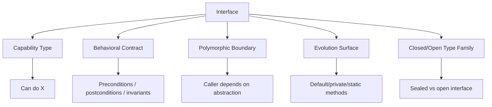
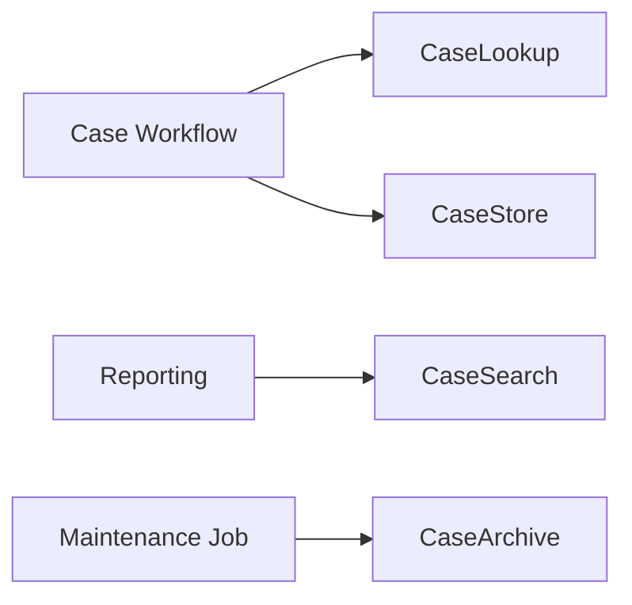

# Part 012 — Interface as Type, Capability & Contract

> Target part ini: memahami `interface` bukan sebagai “class tanpa implementation”, tetapi sebagai **tipe capability**, **kontrak perilaku**, dan **boundary substitusi**. Kita fokus pada interface sebagai alat desain type system, bukan sekadar syntax `implements`.

## 1. Interface Dalam Mental Model Java Type System

Interface declaration memperkenalkan reference type. Class, record, enum, dan bahkan annotation interface berinteraksi dengan interface sebagai bagian dari sistem subtype Java.

Mental model:



Pertanyaan utama saat melihat interface:

```text
Apa kemampuan yang dijanjikan?
Apa yang boleh diasumsikan caller?
Apa yang wajib dipenuhi implementor?
Apakah implementor boleh berasal dari mana saja?
Apakah keluarga implementasi harus terbuka atau tertutup?
Apakah interface ini stabil untuk API jangka panjang?
```

## 2. Interface Sebagai Capability Type

Interface paling kuat saat merepresentasikan kemampuan, bukan kategori taksonomi yang kabur.

```java
public interface Identified<T> {
    T id();
}
```

Tipe ini mengatakan: object ini memiliki identity yang bisa dibaca.

```java
public interface Auditable {
    AuditTrail auditTrail();
}
```

Tipe ini mengatakan: object ini menyediakan audit trail.

Capability type biasanya punya nama berbasis kemampuan:

| Capability | Nama Interface |
|---|---|
| Bisa divalidasi | `Validatable` |
| Bisa diaudit | `Auditable` |
| Bisa dijadwalkan | `Schedulable` |
| Bisa dieksekusi | `Executable` |
| Bisa dihitung biaya | `Chargeable` |
| Bisa diberi deadline | `DeadlineAware` |
| Bisa diidentifikasi | `Identified<T>` |

Namun jangan membuat interface hanya karena “mungkin nanti ada implementasi lain”. Interface harus mengurangi coupling atau memperjelas kontrak.

## 3. Interface Bukan Hanya Abstraksi Teknis

Bad interface:

```java
public interface CaseServiceInterface {
    void createCase(CaseDto dto);
    void updateCase(CaseDto dto);
    void deleteCase(String id);
}
```

Masalah:

1. nama tidak membawa domain capability;
2. suffix `Interface` noise;
3. metode CRUD generik, bukan language domain;
4. kontrak behavior tidak jelas;
5. tidak ada invariant/exception/nullability contract.

Better:

```java
public interface CaseIntake {
    CaseId submit(NewCaseSubmission submission);
}

public interface CaseAssignment {
    void assign(CaseId caseId, OfficerId officerId);
}
```

Interface yang baik membentuk vocabulary sistem.

## 4. Contract: Yang Tertulis dan Yang Tidak Tertulis

Interface method signature hanya sebagian kontrak.

```java
public interface DeadlinePolicy {
    Instant calculateDueAt(Instant receivedAt, CasePriority priority);
}
```

Signature tidak menjelaskan:

1. apakah `receivedAt` boleh null;
2. apakah result boleh sebelum `receivedAt`;
3. timezone/business calendar apa yang digunakan;
4. apakah weekend/holiday dihitung;
5. apakah method pure/deterministic;
6. exception apa yang dilempar;
7. apakah implementasi thread-safe.

Kontrak harus ditulis eksplisit.

```java
/**
 * Calculates the due timestamp for a case.
 *
 * Preconditions:
 * - receivedAt must not be null.
 * - priority must not be null.
 *
 * Postconditions:
 * - returned value is not null.
 * - returned value must not be before receivedAt.
 *
 * Implementations should be deterministic for the same policy configuration.
 */
public interface DeadlinePolicy {
    Instant calculateDueAt(Instant receivedAt, CasePriority priority);
}
```

Dalam sistem enterprise, documentation pada interface bukan hiasan. Ia adalah contract boundary.

## 5. Interface Segregation: Kecil, Koheren, Bisa Dipenuhi

Interface yang terlalu besar memaksa implementor menjanjikan hal yang tidak bisa dipenuhi.

Bad:

```java
public interface CaseRepository {
    Case findById(CaseId id);
    void save(Case c);
    void delete(CaseId id);
    List<Case> search(CaseSearchCriteria criteria);
    void exportToCsv(OutputStream out);
    void rebuildIndex();
    void archiveOldCases();
}
```

Masalah: persistence, search, export, maintenance, lifecycle policy tercampur.

Better:

```java
public interface CaseLookup {
    Optional<EnforcementCase> findById(CaseId id);
}

public interface CaseStore {
    void save(EnforcementCase enforcementCase);
}

public interface CaseSearch {
    List<CaseSummary> search(CaseSearchCriteria criteria);
}
```

Pecah berdasarkan capability dan caller need.



## 6. Interface dan Substitutability

Interface memungkinkan polymorphism, tetapi substitusi aman hanya jika semua implementasi memenuhi kontrak behavior.

```java
public interface RiskScoreProvider {
    RiskScore score(CaseSnapshot snapshot);
}
```

Jika satu implementasi mengembalikan score 0-100, implementasi lain 0.0-1.0, caller akan salah.

Solusi: buat type result lebih kuat.

```java
public final class RiskScore {
    private final int value; // 0..100

    public RiskScore(int value) {
        if (value < 0 || value > 100) {
            throw new IllegalArgumentException("risk score must be 0..100");
        }
        this.value = value;
    }
}
```

Interface contract dan data type contract harus saling memperkuat.

## 7. Interface Dengan Default Methods

Default methods memungkinkan interface menambahkan behavior tanpa memaksa semua implementor langsung berubah.

```java
public interface CaseView {
    CaseStatus status();

    default boolean isClosed() {
        return status() == CaseStatus.CLOSED;
    }
}
```

Gunakan default method untuk behavior yang benar-benar dapat diturunkan dari method abstrak interface.

Good:

```java
default boolean isOpen() {
    return status() == CaseStatus.OPEN;
}
```

Risky:

```java
default void close() {
    // tidak tahu invariant implementor
}
```

Default method berbahaya jika:

1. membuat asumsi state implementor;
2. mengubah semantic class lama secara tidak sengaja;
3. konflik dengan method di interface lain;
4. membawa dependency berat ke interface;
5. menjadi tempat logic orchestration.

## 8. Static dan Private Methods Dalam Interface

Interface bisa memiliki static methods. Ini berguna untuk utility/factory yang sangat dekat dengan interface.

```java
public interface CaseNumberParser {
    Optional<CaseNumber> parse(String input);

    static CaseNumberParser strict() {
        return input -> {
            try {
                return Optional.of(new CaseNumber(input));
            } catch (IllegalArgumentException ex) {
                return Optional.empty();
            }
        };
    }
}
```

Private methods di interface berguna untuk menghindari duplikasi antar default methods.

```java
public interface CaseView {
    CaseStatus status();

    default boolean isTerminal() {
        return isTerminalStatus(status());
    }

    private static boolean isTerminalStatus(CaseStatus status) {
        return status == CaseStatus.CLOSED || status == CaseStatus.REJECTED;
    }
}
```

Tetap jaga interface tidak berubah menjadi utility dumping ground.

## 9. Functional Interface Sebagai Behavior Value

Functional interface adalah interface dengan satu abstract method. Ia memungkinkan behavior diperlakukan sebagai value.

```java
@FunctionalInterface
public interface CasePredicate {
    boolean test(CaseSnapshot snapshot);
}
```

Bisa dipakai dengan lambda:

```java
CasePredicate highPriority = snapshot -> snapshot.priority() == CasePriority.HIGH;
```

Namun banyak kasus cukup memakai standard functional interfaces:

| Need | Standard Interface |
|---|---|
| transform T ke R | `Function<T, R>` |
| test T | `Predicate<T>` |
| consume T | `Consumer<T>` |
| produce T | `Supplier<T>` |
| compare T | `Comparator<T>` |

Buat custom functional interface jika:

1. nama domain menambah makna;
2. exception/contract berbeda;
3. generic standard terlalu kabur;
4. perlu annotation/metadata;
5. ingin method default domain-specific.

Contoh lebih bermakna:

```java
@FunctionalInterface
public interface DeadlineRule {
    Instant dueAt(CaseReceived event, BusinessCalendar calendar);
}
```

Lebih jelas daripada:

```java
BiFunction<CaseReceived, BusinessCalendar, Instant>
```

## 10. Marker Interface: Gunakan Sangat Selektif

Marker interface tidak punya method.

```java
public interface RegulatoryEvent { }
```

Ia bisa berguna untuk menandai family type, tetapi sering kalah oleh annotation atau sealed hierarchy.

Bad marker:

```java
public interface Important { }
```

Important menurut siapa? Untuk apa? Bagaimana caller menggunakannya?

Better jika ada behavior:

```java
public interface PriorityAware {
    CasePriority priority();
}
```

Atau annotation jika hanya metadata:

```java
@Retention(RetentionPolicy.RUNTIME)
@Target(ElementType.TYPE)
public @interface SensitiveData { }
```

## 11. Sealed Interface: Open vs Closed Type Family

Secara default, interface terbuka: class mana pun dapat mengimplementasikannya jika accessible. Sealed interface membatasi implementor yang diizinkan.

```java
public sealed interface CaseDecision
        permits AcceptedDecision, RejectedDecision, EscalatedDecision {
}

public record AcceptedDecision(OfficerId officerId) implements CaseDecision { }
public record RejectedDecision(RejectionReason reason) implements CaseDecision { }
public record EscalatedDecision(EscalationQueue queue) implements CaseDecision { }
```

Sealed interface cocok saat domain family tertutup dan kamu ingin compiler membantu exhaustiveness.

```java
String label(CaseDecision decision) {
    return switch (decision) {
        case AcceptedDecision accepted -> "accepted";
        case RejectedDecision rejected -> "rejected";
        case EscalatedDecision escalated -> "escalated";
    };
}
```

Gunakan sealed interface untuk:

1. command/result family;
2. domain event family internal;
3. state representation;
4. expression tree;
5. error/result algebraic style.

Jangan gunakan sealed jika plugin/external implementor harus bebas menambah subtype.

## 12. Interface vs Abstract Class

| Pertanyaan | Interface | Abstract Class |
|---|---|---|
| Multiple inheritance of type? | Ya | Tidak |
| Shared instance state? | Tidak | Ya |
| Capability across unrelated classes? | Cocok | Kurang cocok |
| Common implementation dengan protected hooks? | Bisa terbatas | Cocok |
| API evolution dengan default methods? | Ya, hati-hati | Ya |
| Closed hierarchy? | Sealed interface | Sealed abstract class juga bisa |

Rule praktis:

1. gunakan interface untuk capability/contract;
2. gunakan abstract class jika ada shared state atau template implementation yang kuat;
3. hindari abstract base class hanya untuk reuse helper method;
4. pilih composition jika inheritance membuat invariant sulit.

## 13. Interface dan Records

Record dapat mengimplementasikan interface. Ini sangat kuat untuk immutable data carriers yang punya kontrak behavior.

```java
public interface CaseEvent {
    CaseId caseId();
    Instant occurredAt();
}

public record CaseSubmitted(
        CaseId caseId,
        Instant occurredAt,
        OfficerId submittedBy
) implements CaseEvent { }
```

Caller bisa menerima `CaseEvent` tanpa peduli event subtype.

```java
void publish(CaseEvent event) { }
```

Kombinasi sealed interface + record sering sangat efektif untuk closed domain model.

```java
public sealed interface CaseCommand
        permits SubmitCase, AssignCase, CloseCase { }

public record SubmitCase(CaseNumber caseNumber) implements CaseCommand { }
public record AssignCase(CaseId caseId, OfficerId officerId) implements CaseCommand { }
public record CloseCase(CaseId caseId, Instant closedAt) implements CaseCommand { }
```

## 14. Interface dan Enum

Enum dapat mengimplementasikan interface. Ini berguna untuk finite strategy.

```java
public interface DeadlineAddition {
    Instant addTo(Instant receivedAt);
}

public enum StandardDeadline implements DeadlineAddition {
    LOW {
        public Instant addTo(Instant receivedAt) {
            return receivedAt.plus(Duration.ofDays(30));
        }
    },
    HIGH {
        public Instant addTo(Instant receivedAt) {
            return receivedAt.plus(Duration.ofDays(7));
        }
    }
}
```

Tetapi jangan sembunyikan policy kompleks di enum jika policy perlu data eksternal, calendar service, jurisdiction config, atau auditable versioning.

## 15. Interface Pada API Boundary

Interface bisa menjadi boundary antar layer:

```java
public interface CaseRepository {
    Optional<EnforcementCase> findById(CaseId id);
    void save(EnforcementCase enforcementCase);
}
```

Application service bergantung pada interface:

```java
public final class AssignCaseUseCase {
    private final CaseRepository repository;

    public AssignCaseUseCase(CaseRepository repository) {
        this.repository = Objects.requireNonNull(repository, "repository");
    }

    public void assign(CaseId caseId, OfficerId officerId) {
        EnforcementCase c = repository.findById(caseId)
                .orElseThrow(() -> new CaseNotFoundException(caseId));
        c.assignTo(officerId);
        repository.save(c);
    }
}
```

Infrastructure implements interface:

```java
public final class JdbcCaseRepository implements CaseRepository {
    public Optional<EnforcementCase> findById(CaseId id) { /* SQL */ }
    public void save(EnforcementCase enforcementCase) { /* SQL */ }
}
```

Penting: interface boundary bukan tujuan. Ia berguna jika:

1. ada dependency inversion nyata;
2. testing seam dibutuhkan;
3. implementasi bisa berganti;
4. layer domain/application tidak boleh tahu infrastructure;
5. module boundary perlu stabil.

Jika hanya ada satu class dan tidak ada boundary, interface bisa menjadi noise.

## 16. Anti-Pattern: Interface Untuk Setiap Class

Bad:

```java
public interface UserService { }
public class UserServiceImpl implements UserService { }
```

Jika interface hanya mirror class tanpa kontrak abstraksi, ia menambah ceremony tanpa value.

Tanda interface tidak berguna:

1. namanya sama dengan class + `Impl`;
2. hanya ada satu implementasi dan tidak ada boundary;
3. semua method persis CRUD teknis;
4. tidak ada documentation contract;
5. berubah setiap kali class berubah;
6. digunakan hanya karena framework lama.

Better: buat interface saat abstraction sudah jelas.

## 17. Generic Interface dan Type Safety

Interface generic bisa membawa domain type parameter.

```java
public interface Identifier<T> {
    String value();
}

public final class CaseId implements Identifier<EnforcementCase> {
    private final String value;
    public String value() { return value; }
}
```

Atau repository:

```java
public interface Repository<ID, AGGREGATE> {
    Optional<AGGREGATE> findById(ID id);
    void save(AGGREGATE aggregate);
}
```

Namun generic terlalu umum bisa menghapus bahasa domain.

```java
Repository<String, Object> repository; // type safety lemah
```

Untuk enterprise code, sering lebih jelas:

```java
public interface CaseRepository {
    Optional<EnforcementCase> findById(CaseId id);
    void save(EnforcementCase enforcementCase);
}
```

Generic interface kuat jika abstraction benar-benar reusable dan tidak mengaburkan domain meaning.

## 18. Interface dan Checked Exceptions

Exception pada interface adalah kontrak.

```java
public interface CaseExporter {
    void export(CaseId id, OutputStream out) throws IOException;
}
```

Jika interface berada di domain/application layer, exposing `IOException` mungkin membocorkan infrastructure detail. Lebih baik boundary adapter menerjemahkan.

```java
public interface CaseReportPublisher {
    void publish(CaseReport report);
}
```

Implementasi bisa menangkap `IOException` dan membungkus menjadi exception aplikasi yang sesuai.

Rule:

| Interface Layer | Exception Bias |
|---|---|
| Low-level IO adapter | checked `IOException` masuk akal |
| Domain policy | hindari infrastructure exception |
| Application use case | domain/application exception |
| Public library | checked jika caller bisa recover secara meaningful |

## 19. Interface, Nullability, dan Optional

Interface harus jelas soal null.

Bad:

```java
Case findById(CaseId id);
```

Apakah null berarti not found? error? unauthorized?

Better:

```java
Optional<EnforcementCase> findById(CaseId id);
```

Namun jangan gunakan `Optional` untuk semua hal. Untuk collection:

```java
List<CaseSummary> search(CaseSearchCriteria criteria);
```

Return empty list, bukan `Optional<List<...>>`, kecuali absence list itu punya makna domain berbeda dari empty list.

## 20. Interface dan Time/Clock Dependency

Interface yang menyembunyikan waktu harus eksplisit.

Bad:

```java
public interface DeadlinePolicy {
    Instant dueAt(CasePriority priority);
}
```

Method diam-diam memakai current time.

Better:

```java
public interface DeadlinePolicy {
    Instant dueAt(Instant receivedAt, CasePriority priority);
}
```

Atau inject `Clock` pada implementasi:

```java
public final class StandardDeadlinePolicy implements DeadlinePolicy {
    private final BusinessCalendar calendar;

    public Instant dueAt(Instant receivedAt, CasePriority priority) {
        return calendar.addBusinessDays(receivedAt, daysFor(priority));
    }
}
```

Waktu yang implisit membuat testing, replay, audit, dan determinisme sulit.

## 21. Interface Evolution

Mengubah interface publik bisa merusak implementor.

Perubahan yang berisiko:

1. menambah abstract method;
2. mengubah method signature;
3. mengubah return type secara incompatible;
4. memperketat precondition;
5. melemahkan postcondition;
6. mengubah exception behavior;
7. mengubah default method semantic.

Default method bisa membantu evolusi, tetapi bukan solusi universal.

```java
public interface CaseView {
    CaseStatus status();

    default boolean isTerminal() {
        return status() == CaseStatus.CLOSED || status() == CaseStatus.REJECTED;
    }
}
```

Jika implementor lama punya status tambahan yang dianggap terminal, default method bisa salah. Jadi default harus hanya menggunakan kontrak yang benar-benar diketahui.

## 22. Interface Design Untuk Regulatory Workflow

Misal kita model enforcement lifecycle. Capability boundaries:

```java
public interface CaseIntake {
    CaseId submit(NewCaseSubmission submission);
}

public interface CaseTriage {
    TriageDecision triage(CaseId caseId, OfficerId officerId);
}

public interface EscalationPolicy {
    EscalationDecision evaluate(CaseSnapshot snapshot);
}

public interface DeadlinePolicy {
    Instant dueAt(CaseReceived event, CasePriority priority);
}

public interface AuditSink {
    void append(AuditEvent event);
}
```

Setiap interface punya satu reason to change:

| Interface | Reason to Change |
|---|---|
| `CaseIntake` | submission protocol berubah |
| `CaseTriage` | triage workflow berubah |
| `EscalationPolicy` | escalation rule berubah |
| `DeadlinePolicy` | SLA/calendar rule berubah |
| `AuditSink` | audit append contract berubah |

Ini lebih reviewable daripada satu `CaseService` besar.

## 23. Testing Interface Contract

Jika banyak implementasi, buat contract test.

```java
public interface DeadlinePolicyContract {
    DeadlinePolicy policy();

    @Test
    default void dueAtMustNotBeBeforeReceivedAt() {
        Instant receivedAt = Instant.parse("2026-01-01T00:00:00Z");
        Instant dueAt = policy().dueAt(receivedAt, CasePriority.NORMAL);
        assertFalse(dueAt.isBefore(receivedAt));
    }
}
```

Implementasi test:

```java
class StandardDeadlinePolicyTest implements DeadlinePolicyContract {
    public DeadlinePolicy policy() {
        return new StandardDeadlinePolicy(/* calendar */);
    }
}
```

Contract test membantu memastikan substitutability bukan asumsi.

## 24. Production Failure Modes

### 24.1 Interface Terlalu Umum Membocorkan Domain

```java
interface Processor<T> {
    void process(T input);
}
```

Dipakai untuk payment, case assignment, audit, notification. Akhirnya logging, retry, idempotency, dan exception semantics tidak jelas.

Refactor:

```java
interface AuditEventPublisher {
    void publish(AuditEvent event);
}
```

### 24.2 Default Method Mengubah Behavior Implementasi Lama

Interface lama:

```java
interface CaseView {
    CaseStatus status();
}
```

Ditambah:

```java
default boolean isActive() {
    return status() != CaseStatus.CLOSED;
}
```

Ternyata `REJECTED` juga harus non-active. Bug muncul di report.

Lesson: default method adalah behavior rollout. Treat it like production change.

### 24.3 Interface Repository Mengembalikan Null

```java
Case findById(CaseId id);
```

Satu implementasi return null, yang lain throw exception. Caller inconsistent.

Refactor:

```java
Optional<EnforcementCase> findById(CaseId id);
```

Lalu document authorization/not-found distinction.

## 25. Review Checklist Untuk Interface

```text
[ ] Apakah nama interface merepresentasikan capability/contract yang jelas?
[ ] Apakah interface terlalu besar?
[ ] Apakah setiap method punya precondition/postcondition yang jelas?
[ ] Apakah nullability return dan parameter eksplisit?
[ ] Apakah exception contract tidak membocorkan layer yang salah?
[ ] Apakah interface benar-benar mengurangi coupling atau hanya ceremony?
[ ] Apakah ada lebih dari satu reasonable implementation atau boundary yang nyata?
[ ] Apakah default method hanya bergantung pada kontrak yang pasti?
[ ] Apakah generic parameter memperkuat atau mengaburkan domain?
[ ] Apakah interface harus open atau sealed?
[ ] Apakah contract test diperlukan?
[ ] Apakah implementor bisa memenuhi kontrak tanpa method palsu/throw UnsupportedOperationException?
```

## 26. Latihan 20 Jam ala Kaufman Untuk Part Ini

| Durasi | Latihan |
|---:|---|
| 30 menit | Ambil 10 interface di codebase, klasifikasikan capability vs ceremony |
| 45 menit | Pecah satu interface besar menjadi 2-4 capability kecil |
| 45 menit | Tulis contract documentation untuk satu interface penting |
| 60 menit | Buat contract test untuk dua implementasi interface yang sama |
| 60 menit | Refactor `ServiceInterface/ServiceImpl` menjadi boundary yang punya nama domain |
| 60 menit | Model satu result family menggunakan sealed interface + record |

Target self-correction: kamu bisa melihat interface dan cepat menjawab **apa kemampuan yang dijanjikan, siapa caller-nya, siapa implementor-nya, dan apakah substitusi aman**.

## 27. Ringkasan

Interface adalah alat type system untuk menyatakan capability dan kontrak perilaku. Interface yang baik:

1. kecil dan koheren;
2. punya nama berbasis domain/capability;
3. punya precondition dan postcondition yang jelas;
4. tidak membocorkan detail layer bawah;
5. mendukung substitusi aman;
6. bisa dievolusi dengan hati-hati;
7. open atau sealed secara sengaja;
8. bisa diuji lewat contract test.

Interface yang buruk hanya menambah indirection. Interface yang baik membuat desain lebih stabil, testable, dan jelas secara domain.

## 28. Referensi

- Java Language Specification, Java SE 25 Edition — Chapter 9: Interfaces.
- Java Language Specification, Java SE 25 Edition — Chapter 8: Classes.
- Java Language Specification, Java SE 25 Edition — Chapter 13: Binary Compatibility.
- Java SE 25 API Documentation — `java.lang.FunctionalInterface`, `java.util.function`, `java.util.Optional`.
