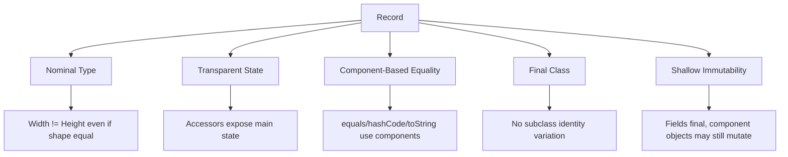
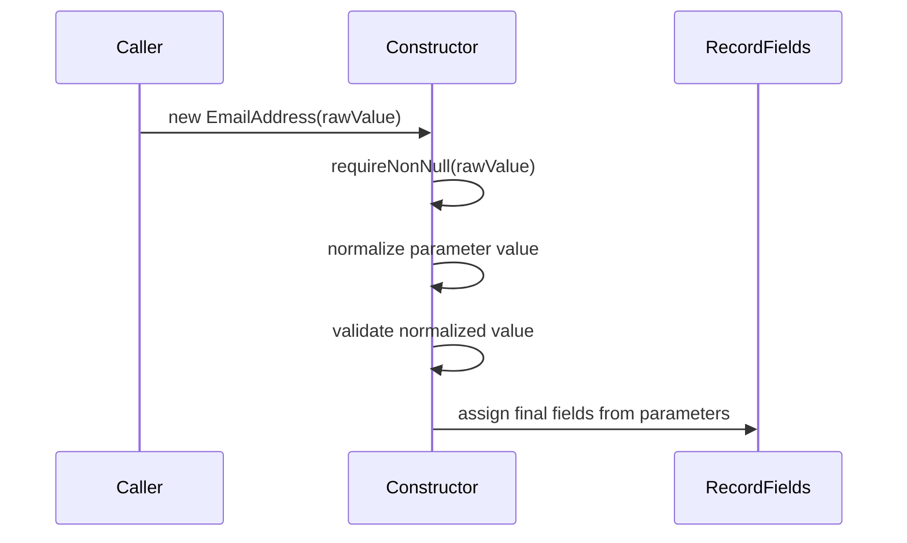
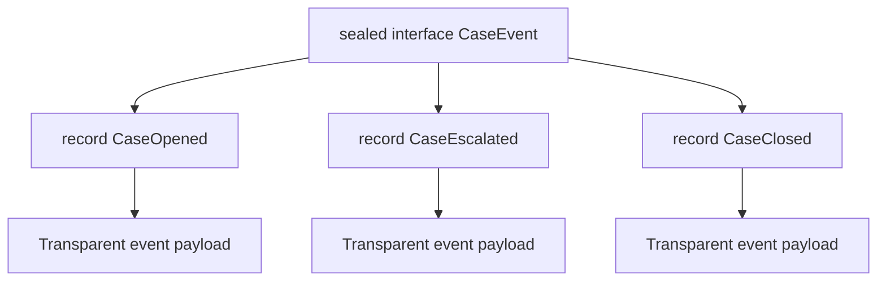

# Part 013 — Records as Transparent Nominal Data Carriers

> Target part ini: memahami `record` bukan sebagai “class pendek”, tetapi sebagai **nominal transparent data carrier**: tipe bernama yang sengaja mengekspos state utamanya sebagai komponen, punya equality berbasis komponen, dan ideal untuk data yang bentuknya lebih penting daripada lifecycle identity.

## 1. Kenapa Record Ada?

Sebelum record, Java developer sering menulis class data seperti ini:

```java
public final class CustomerId {
    private final String value;

    public CustomerId(String value) {
        this.value = Objects.requireNonNull(value);
    }

    public String value() {
        return value;
    }

    @Override
    public boolean equals(Object o) {
        if (this == o) return true;
        if (!(o instanceof CustomerId that)) return false;
        return value.equals(that.value);
    }

    @Override
    public int hashCode() {
        return value.hashCode();
    }

    @Override
    public String toString() {
        return "CustomerId[value=" + value + "]";
    }
}
```

Dengan record:

```java
public record CustomerId(String value) {
    public CustomerId {
        Objects.requireNonNull(value, "value");
        if (value.isBlank()) {
            throw new IllegalArgumentException("CustomerId must not be blank");
        }
    }
}
```

Record menghapus boilerplate, tetapi tujuan utamanya bukan hanya ringkas. Record membuat kontrak desain menjadi eksplisit:

```text
Nama tipe penting.
Daftar komponen penting.
Equality berbasis komponen penting.
State utama sengaja transparan.
Object identity bukan bagian dari domain semantics.
```

## 2. Mental Model: Record Sebagai Product Type Nominal

Record mirip product type: satu nilai dibentuk dari beberapa komponen.

```java
public record Money(BigDecimal amount, Currency currency) {}
```

Secara mental:

```text
Money = amount × currency
```

Namun record tetap **nominal**, bukan structural.

```java
public record Width(int value) {}
public record Height(int value) {}
```

Meskipun bentuknya sama-sama satu `int`, keduanya tipe berbeda:

```java
Width w = new Width(10);
Height h = new Height(10);

// Tidak assignable:
// Width x = h;
```

Ini penting untuk menghindari primitive obsession.



## 3. Apa Yang Dihasilkan Oleh Record Declaration?

Deklarasi berikut:

```java
public record CaseKey(String tenantId, String caseNumber) {}
```

Membuat beberapa elemen penting:

| Elemen | Efek |
|---|---|
| Record class | `CaseKey` adalah class final yang extends `java.lang.Record` |
| Components | `tenantId`, `caseNumber` |
| Private final fields | Satu field untuk setiap component |
| Public accessors | `tenantId()` dan `caseNumber()` |
| Canonical constructor | Constructor dengan parameter semua components |
| `equals` | Equality berbasis semua components |
| `hashCode` | Hash berbasis semua components |
| `toString` | Representasi string berbasis nama record dan components |

Contoh pemakaian:

```java
CaseKey a = new CaseKey("tenant-a", "CASE-001");
CaseKey b = new CaseKey("tenant-a", "CASE-001");

System.out.println(a.equals(b)); // true
System.out.println(a == b);      // false
System.out.println(a.tenantId());
```

Record tetap object. Dua instance berbeda bisa equal secara logis.

## 4. Record Bukan “Struct Java” Secara Mentah

Kesalahan umum: menganggap record sebagai struct publik.

Record tetap class:

```java
public record UserName(String value) {
    public String normalized() {
        return value.trim().toLowerCase(Locale.ROOT);
    }
}
```

Record bisa punya:

| Fitur | Boleh? | Catatan |
|---|---:|---|
| Instance method | Ya | Cocok untuk behavior yang derived dari components |
| Static method | Ya | Factory/helper |
| Static field | Ya | Constant/cache stateless |
| Instance field tambahan | Tidak | State record harus berasal dari components |
| Implement interface | Ya | Bagus untuk capability type |
| Extend class eksplisit | Tidak | Record sudah extends `java.lang.Record` |
| Subclass | Tidak | Record implicitly final |

Record bukan replacement semua class. Record cocok ketika state utama adalah kontrak publik tipe.

## 5. Canonical Constructor

Canonical constructor adalah constructor yang menerima semua components record.

```java
public record EmailAddress(String value) {
    public EmailAddress(String value) {
        Objects.requireNonNull(value, "value");
        String normalized = value.trim().toLowerCase(Locale.ROOT);
        if (!normalized.contains("@")) {
            throw new IllegalArgumentException("Invalid email address");
        }
        this.value = normalized;
    }
}
```

Constructor ini explicit canonical constructor.

Gunakan saat ingin assignment eksplisit atau parameter annotation/visibility tertentu.

## 6. Compact Constructor

Compact constructor adalah bentuk lebih idiomatis untuk validasi dan normalisasi ringan.

```java
public record EmailAddress(String value) {
    public EmailAddress {
        Objects.requireNonNull(value, "value");
        value = value.trim().toLowerCase(Locale.ROOT);

        if (!value.contains("@")) {
            throw new IllegalArgumentException("Invalid email address");
        }
    }
}
```

Dalam compact constructor, Java akan mengisi field component setelah body constructor selesai. Reassign parameter boleh dipakai untuk normalisasi.

Mental model:



Aturan desain:

```text
Compact constructor cocok untuk:
- requireNonNull
- trim/normalize sederhana
- range check
- cross-component invariant

Compact constructor buruk untuk:
- query database
- call remote service
- publish event
- mutate external object
- long business workflow
```

Constructor record harus menjaga invariant lokal, bukan menjalankan use case.

## 7. Component Order Itu Bagian Dari Kontrak

Record equality, hash, constructor parameter order, destructuring/pattern usage, dan generated `toString` mengikuti component list.

```java
public record DateRange(LocalDate startInclusive, LocalDate endExclusive) {}
```

Urutan ini bermakna.

Mengubah dari:

```java
public record DateRange(LocalDate startInclusive, LocalDate endExclusive) {}
```

menjadi:

```java
public record DateRange(LocalDate endExclusive, LocalDate startInclusive) {}
```

adalah perubahan kontrak serius meskipun tipe component sama.

Risiko:

```java
new DateRange(start, end); // tetap compile jika urutan tipe sama, tetapi makna rusak
```

Checklist review:

```text
Apakah dua component berurutan punya tipe sama?
Apakah constructor call raw mudah tertukar?
Apakah perlu static factory bernama?
Apakah perlu wrapper type lebih spesifik?
```

Contoh mitigasi:

```java
public record DateRange(LocalDate startInclusive, LocalDate endExclusive) {
    public static DateRange between(LocalDate startInclusive, LocalDate endExclusive) {
        return new DateRange(startInclusive, endExclusive);
    }
}
```

Lebih kuat lagi:

```java
public record StartDate(LocalDate value) {}
public record EndDate(LocalDate value) {}

public record DateRange(StartDate startInclusive, EndDate endExclusive) {}
```

## 8. Shallow Immutability

Record fields final, tetapi object yang direferensikan component bisa mutable.

```java
public record OrderLines(List<String> lines) {}
```

Masalah:

```java
List<String> list = new ArrayList<>();
list.add("A");

OrderLines orderLines = new OrderLines(list);
list.add("B");

System.out.println(orderLines.lines()); // [A, B]
```

Record ini tidak benar-benar immutable secara domain.

Solusi:

```java
public record OrderLines(List<String> lines) {
    public OrderLines {
        lines = List.copyOf(lines);
    }
}
```

Namun accessor `lines()` tetap mengembalikan list immutable hasil copy.

Untuk array:

```java
public record Payload(byte[] bytes) {
    public Payload {
        bytes = bytes.clone();
    }

    @Override
    public byte[] bytes() {
        return bytes.clone();
    }
}
```

Array selalu mutable, jadi perlu copy pada constructor dan accessor.

## 9. Kapan Record Cocok?

Record cocok untuk data yang:

| Karakteristik | Contoh |
|---|---|
| Bentuk state utama jelas | `Money(amount, currency)` |
| Equality berbasis semua components | `CustomerId(value)` |
| Tidak butuh subclass | `DateRange(start, end)` |
| Invariant lokal bisa dicek di constructor | `Percentage(value)` |
| Cocok sebagai immutable message/command/query | `CreateCaseCommand(...)` |
| Cocok sebagai projection/read model | `CaseSummary(...)` |
| Cocok sebagai compound key | `TenantCaseKey(tenantId, caseNumber)` |

Contoh:

```java
public record TenantCaseKey(String tenantId, String caseNumber) {
    public TenantCaseKey {
        requireText(tenantId, "tenantId");
        requireText(caseNumber, "caseNumber");
    }

    private static void requireText(String value, String name) {
        Objects.requireNonNull(value, name);
        if (value.isBlank()) {
            throw new IllegalArgumentException(name + " must not be blank");
        }
    }
}
```

## 10. Kapan Record Tidak Cocok?

Record buruk ketika object punya identity lifecycle yang lebih penting daripada component equality.

Contoh entity mutable:

```java
public class CaseEntity {
    private final CaseId id;
    private CaseStatus status;
    private Instant updatedAt;

    public void escalate(Instant now) {
        if (status != CaseStatus.OPEN) {
            throw new IllegalStateException("Only OPEN cases can be escalated");
        }
        status = CaseStatus.ESCALATED;
        updatedAt = now;
    }
}
```

Jika dijadikan record:

```java
public record CaseEntity(CaseId id, CaseStatus status, Instant updatedAt) {}
```

Kita kehilangan owner behavior untuk lifecycle transition.

Gunakan class biasa ketika:

| Kondisi | Kenapa Record Tidak Ideal |
|---|---|
| Object punya lifecycle panjang | State berubah lewat command/method |
| Equality tidak berbasis semua field | Entity biasanya equal by id |
| Ada lazy-loaded state | Record transparansi bisa menyesatkan |
| Butuh inheritance class | Record final |
| State internal tidak boleh transparan | Record accessors mengekspos components |
| Invariant kompleks lintas aggregate | Constructor record menjadi terlalu berat |

## 11. Record Untuk Value Object

Record sangat cocok untuk value object kecil.

```java
public record Percentage(BigDecimal value) {
    public Percentage {
        Objects.requireNonNull(value, "value");
        if (value.compareTo(BigDecimal.ZERO) < 0 || value.compareTo(BigDecimal.valueOf(100)) > 0) {
            throw new IllegalArgumentException("Percentage must be between 0 and 100");
        }
        value = value.stripTrailingZeros();
    }

    public BigDecimal asRatio() {
        return value.divide(BigDecimal.valueOf(100), MathContext.DECIMAL64);
    }
}
```

Namun hati-hati dengan `BigDecimal.equals`.

```java
new BigDecimal("1.0").equals(new BigDecimal("1.00")); // false
```

Karena record equality memakai `equals` component, normalisasi scale bisa menjadi bagian invariant.

```java
public record Amount(BigDecimal value) {
    public Amount {
        Objects.requireNonNull(value, "value");
        value = value.setScale(2, RoundingMode.UNNECESSARY);
    }
}
```

## 12. Record Untuk DTO

Record juga cocok untuk DTO, tetapi jangan otomatis menyamakan DTO dengan domain type.

```java
public record CaseResponse(
    String id,
    String status,
    String assignedOfficer,
    Instant updatedAt
) {}
```

DTO boundary concerns:

```text
Apakah field boleh null?
Apakah enum dikirim sebagai string?
Apakah timestamp pakai Instant atau LocalDateTime?
Apakah numeric money dikirim sebagai number atau string?
Apakah field baru backward compatible?
```

Record membuat shape DTO eksplisit, tetapi tidak menyelesaikan versioning.

## 13. Record Untuk Command Dan Query

Record sangat baik untuk request internal yang immutable.

```java
public record EscalateCaseCommand(
    CaseId caseId,
    OfficerId requestedBy,
    EscalationReason reason,
    Instant requestedAt
) {
    public EscalateCaseCommand {
        Objects.requireNonNull(caseId, "caseId");
        Objects.requireNonNull(requestedBy, "requestedBy");
        Objects.requireNonNull(reason, "reason");
        Objects.requireNonNull(requestedAt, "requestedAt");
    }
}
```

Kelebihan:

```text
Command bisa divalidasi saat dibuat.
Semua dependency data eksplisit.
Tidak ada setter mutation di tengah pipeline.
Mudah dites.
Mudah dilog secara hati-hati.
```

Namun jangan masukkan dependency service ke record command.

Buruk:

```java
public record EscalateCaseCommand(CaseId caseId, CaseRepository repository) {}
```

Command harus membawa data, bukan behavior infrastructure.

## 14. Record Dan Equality

Record equality berbasis:

```text
same record class
and all corresponding components equal
```

Contoh:

```java
public record Point(int x, int y) {}

Point a = new Point(1, 2);
Point b = new Point(1, 2);

System.out.println(a.equals(b)); // true
```

Record berbeda tidak equal meskipun components sama.

```java
public record ScreenPoint(int x, int y) {}
public record MapPoint(int x, int y) {}

System.out.println(new ScreenPoint(1, 2).equals(new MapPoint(1, 2))); // false
```

Ini bagus: type name bagian dari semantics.

## 15. Jangan Override Equality Sembarangan

Secara teknis, record boleh mendeklarasikan explicit `equals`, `hashCode`, atau `toString`, tetapi ini harus sangat jarang.

Buruk:

```java
public record UserRecord(String id, String email) {
    @Override
    public boolean equals(Object o) {
        return o instanceof UserRecord that && id.equals(that.id);
    }
}
```

Ini membuat record terlihat seperti transparent component carrier, tetapi equality hanya memakai `id`.

Lebih baik gunakan class biasa jika equality tidak mengikuti semua components.

Rule:

```text
Jika equality tidak berbasis semua komponen utama, pertanyakan apakah tipe ini pantas menjadi record.
```

## 16. Record Dan Nullability

Record tidak otomatis non-null.

```java
public record PersonName(String firstName, String lastName) {}

PersonName name = new PersonName(null, null); // compile dan runtime valid tanpa validasi
```

Harus eksplisit:

```java
public record PersonName(String firstName, String lastName) {
    public PersonName {
        Objects.requireNonNull(firstName, "firstName");
        Objects.requireNonNull(lastName, "lastName");
    }
}
```

Untuk optional component, pilih semantics jelas:

```java
public record MiddleName(String value) {}

public record PersonName(
    String firstName,
    Optional<MiddleName> middleName,
    String lastName
) {
    public PersonName {
        Objects.requireNonNull(firstName, "firstName");
        middleName = Objects.requireNonNull(middleName, "middleName");
        Objects.requireNonNull(lastName, "lastName");
    }
}
```

Namun penggunaan `Optional` sebagai field masih kontroversial di banyak codebase. Alternatifnya modelkan absence dengan overloaded factory atau subtype sealed, tergantung boundary.

## 17. Record Dan Validation Placement

Validasi record sebaiknya menjaga invariant lokal yang selalu benar.

Bagus:

```java
public record DateRange(LocalDate startInclusive, LocalDate endExclusive) {
    public DateRange {
        Objects.requireNonNull(startInclusive, "startInclusive");
        Objects.requireNonNull(endExclusive, "endExclusive");
        if (!startInclusive.isBefore(endExclusive)) {
            throw new IllegalArgumentException("startInclusive must be before endExclusive");
        }
    }
}
```

Tidak ideal:

```java
public record CaseAssignment(OfficerId officerId, CaseId caseId) {
    public CaseAssignment {
        // Jangan call repository/service dari constructor value type.
        // Ini membuat construction mahal, nondeterministic, dan sulit dites.
    }
}
```

Pisahkan:

```text
Record constructor: invariant intrinsik data.
Application service: invariant yang butuh repository, permission, workflow, atau external system.
```

## 18. Record Dan Derived Behavior

Record boleh punya behavior, tetapi behavior harus natural terhadap data.

```java
public record DateRange(LocalDate startInclusive, LocalDate endExclusive) {
    public DateRange {
        Objects.requireNonNull(startInclusive, "startInclusive");
        Objects.requireNonNull(endExclusive, "endExclusive");
        if (!startInclusive.isBefore(endExclusive)) {
            throw new IllegalArgumentException("Invalid date range");
        }
    }

    public boolean contains(LocalDate date) {
        Objects.requireNonNull(date, "date");
        return !date.isBefore(startInclusive) && date.isBefore(endExclusive);
    }

    public Period lengthAsPeriod() {
        return Period.between(startInclusive, endExclusive);
    }
}
```

Behavior ini tidak mengubah identity/lifecycle. Ia derived dari components.

## 19. Record Dan Static Factory

Constructor record kadang terlalu positional.

```java
new Money(new BigDecimal("100.00"), Currency.getInstance("USD"));
```

Factory bisa memperjelas intent:

```java
public record Money(BigDecimal amount, Currency currency) {
    public Money {
        Objects.requireNonNull(amount, "amount");
        Objects.requireNonNull(currency, "currency");
        amount = amount.setScale(currency.getDefaultFractionDigits(), RoundingMode.UNNECESSARY);
    }

    public static Money usd(String amount) {
        return new Money(new BigDecimal(amount), Currency.getInstance("USD"));
    }
}
```

Factory juga bisa menghindari parameter tertukar.

## 20. Record Dan Interface

Record bisa implement interface.

```java
public interface DomainEvent {
    Instant occurredAt();
}

public record CaseEscalated(
    CaseId caseId,
    EscalationReason reason,
    Instant occurredAt
) implements DomainEvent {
    public CaseEscalated {
        Objects.requireNonNull(caseId, "caseId");
        Objects.requireNonNull(reason, "reason");
        Objects.requireNonNull(occurredAt, "occurredAt");
    }
}
```

Ini powerful untuk event, command, projection, dan closed domain model.

Dengan sealed interface:

```java
public sealed interface CaseEvent permits CaseOpened, CaseEscalated, CaseClosed {}

public record CaseOpened(CaseId caseId, Instant occurredAt) implements CaseEvent {}
public record CaseEscalated(CaseId caseId, Instant occurredAt) implements CaseEvent {}
public record CaseClosed(CaseId caseId, Instant occurredAt) implements CaseEvent {}
```

Mental model:



Ini membuat domain event family eksplisit.

## 21. Record Dan Pattern Matching

Di Java modern, record sangat cocok dengan pattern matching karena bentuk component-nya eksplisit.

Contoh konseptual:

```java
static String render(CaseEvent event) {
    return switch (event) {
        case CaseOpened(var caseId, var occurredAt) -> "opened " + caseId;
        case CaseEscalated(var caseId, var occurredAt) -> "escalated " + caseId;
        case CaseClosed(var caseId, var occurredAt) -> "closed " + caseId;
    };
}
```

Pelajaran penting:

```text
Record component list menjadi bagian dari matching surface.
Mengubah component list bisa berdampak ke caller yang melakukan deconstruction.
```

Karena itu, record yang dipakai sebagai API publik harus diperlakukan sebagai kontrak.

## 22. Record Dan Serialization Boundary

Record sering cocok untuk JSON DTO, tetapi ada risiko:

```java
public record CaseResponse(
    String id,
    String status,
    Instant updatedAt
) {}
```

Pertanyaan review:

```text
Apakah nama component adalah nama field JSON?
Apakah rename component berarti breaking API?
Apakah timestamp format stabil?
Apakah enum dikirim sebagai name, code, atau object?
Apakah null field boleh muncul?
Apakah constructor validation compatible dengan deserializer?
```

Jangan menganggap record otomatis aman untuk API publik. Ia membuat shape mudah terlihat, bukan versioning otomatis benar.

## 23. Record Dan Persistence Boundary

Record tidak selalu cocok sebagai ORM entity.

Alasan:

```text
ORM entity sering butuh identity lifecycle.
ORM sering memakai proxy/lazy loading.
ORM sering butuh no-arg constructor atau field mutation internal.
Record final dan transparan.
Record equality berbasis semua components.
```

Record lebih cocok sebagai:

| Use Case | Cocok? |
|---|---:|
| Query projection | Ya |
| Read model | Ya |
| Compound ID/value object | Sering ya |
| JPA entity mutable | Biasanya tidak |
| Immutable DTO hasil query | Ya |

Contoh projection:

```java
public record CaseSummary(
    CaseId id,
    CaseStatus status,
    OfficerId assignee,
    Instant updatedAt
) {}
```

## 24. Record Dan Binary/API Compatibility

Mengubah record component adalah perubahan besar.

| Perubahan | Risiko |
|---|---|
| Rename component | Accessor berubah; serialization name bisa berubah |
| Reorder component | Constructor positional berubah; pattern matching berubah |
| Add component | Canonical constructor berubah; equality/hash berubah |
| Remove component | Accessor hilang; equality/hash berubah |
| Change type component | Source/binary compatibility risk |
| Change validation | Runtime behavior berubah |

Untuk API internal kecil, ini mungkin acceptable. Untuk library/public API, perlu versioning.

## 25. Record Untuk Strong Typing

Record satu component sangat berguna untuk semantic typing.

```java
public record CaseId(String value) {
    public CaseId {
        Objects.requireNonNull(value, "value");
        if (value.isBlank()) {
            throw new IllegalArgumentException("CaseId must not be blank");
        }
    }
}

public record OfficerId(String value) {
    public OfficerId {
        Objects.requireNonNull(value, "value");
        if (value.isBlank()) {
            throw new IllegalArgumentException("OfficerId must not be blank");
        }
    }
}
```

Compiler sekarang mencegah tertukar:

```java
void assign(CaseId caseId, OfficerId officerId) {}

CaseId caseId = new CaseId("C-1");
OfficerId officerId = new OfficerId("O-1");

assign(caseId, officerId); // benar
// assign(officerId, caseId); // compile error
```

Ini sangat valuable pada regulatory/enforcement systems karena banyak ID memiliki representasi sama-sama `String`.

## 26. Record Anti-Patterns

### 26.1 Record Dengan Mutable Collection Tanpa Copy

```java
public record EvidenceBundle(List<EvidenceId> evidenceIds) {}
```

Risk: external mutation.

Better:

```java
public record EvidenceBundle(List<EvidenceId> evidenceIds) {
    public EvidenceBundle {
        evidenceIds = List.copyOf(evidenceIds);
    }
}
```

### 26.2 Record Sebagai Entity Lifecycle

```java
public record Case(CaseId id, CaseStatus status) {}
```

Jika status berubah melalui workflow, class dengan behavior mungkin lebih tepat.

### 26.3 Record Dengan Too Many Components

```java
public record CreateCaseRequest(
    String a, String b, String c, String d, String e,
    String f, String g, String h, String i, String j
) {}
```

Terlalu banyak components biasanya tanda model belum didecompose.

Refactor:

```java
public record SubjectInfo(...) {}
public record CaseMetadata(...) {}
public record CreateCaseRequest(SubjectInfo subject, CaseMetadata metadata) {}
```

### 26.4 Record Dengan Boolean Flag Banyak

```java
public record CaseView(boolean urgent, boolean confidential, boolean escalated, boolean closed) {}
```

Pertimbangkan enum/state object.

```java
public enum CaseVisibility { PUBLIC, CONFIDENTIAL, RESTRICTED }
public enum CaseLifecycleStatus { OPEN, ESCALATED, CLOSED }
```

### 26.5 Record Yang Menyimpan Derived Field

Buruk:

```java
public record PersonName(String firstName, String lastName, String fullName) {}
```

Jika `fullName` derived, jangan simpan kecuali ada alasan performa/compatibility kuat.

Better:

```java
public record PersonName(String firstName, String lastName) {
    public String fullName() {
        return firstName + " " + lastName;
    }
}
```

## 27. Testing Record

Test record bukan untuk generated boilerplate. Test invariant dan boundary.

```java
class DateRangeTest {
    @Test
    void rejectsEndBeforeStart() {
        LocalDate start = LocalDate.of(2026, 1, 10);
        LocalDate end = LocalDate.of(2026, 1, 1);

        assertThrows(IllegalArgumentException.class, () -> new DateRange(start, end));
    }

    @Test
    void containsStartButNotEndExclusive() {
        DateRange range = new DateRange(
            LocalDate.of(2026, 1, 1),
            LocalDate.of(2026, 1, 10)
        );

        assertTrue(range.contains(LocalDate.of(2026, 1, 1)));
        assertFalse(range.contains(LocalDate.of(2026, 1, 10)));
    }
}
```

Test checklist:

```text
Null rejection.
Range validation.
Cross-component invariant.
Normalization.
Defensive copy.
Equality if component has tricky equals.
Serialization/deserialization if used as API DTO.
```

## 28. Enterprise Review Checklist

Gunakan checklist ini saat review PR yang memperkenalkan record:

```text
1. Apakah tipe ini benar-benar transparent data carrier?
2. Apakah equality berbasis semua components memang benar?
3. Apakah component list stabil sebagai kontrak?
4. Apakah semua nullable component disengaja?
5. Apakah mutable components sudah defensive copied?
6. Apakah constructor hanya menjaga invariant lokal?
7. Apakah component order aman dan tidak raw/ambiguous?
8. Apakah record dipakai sebagai entity padahal butuh lifecycle behavior?
9. Apakah toString aman dari PII/secret leakage?
10. Apakah record ini melewati serialization/API boundary?
11. Apakah rename/add/remove component punya migration plan?
12. Apakah value object satu component lebih baik daripada raw primitive?
```

## 29. Latihan 20 Menit

Ambil class data lama dari codebase atau buat contoh ini:

```java
public final class CaseDeadline {
    private final String caseId;
    private final LocalDate dueDate;
    private final boolean businessDayOnly;

    // constructor, getter, equals, hashCode, toString...
}
```

Refactor menjadi record dengan aturan:

```text
1. `caseId` jangan raw String; bungkus menjadi `CaseId` record.
2. `businessDayOnly` jangan boolean jika semantics lebih kaya.
3. Tambahkan invariant: dueDate tidak boleh null.
4. Tambahkan method `isOverdue(LocalDate today)`.
5. Jelaskan apakah equality berbasis semua components benar.
```

Contoh arah solusi:

```java
public record CaseId(String value) {
    public CaseId {
        Objects.requireNonNull(value, "value");
        if (value.isBlank()) throw new IllegalArgumentException("blank case id");
    }
}

public enum DeadlineCalendarPolicy {
    CALENDAR_DAY,
    BUSINESS_DAY_ONLY
}

public record CaseDeadline(
    CaseId caseId,
    LocalDate dueDate,
    DeadlineCalendarPolicy calendarPolicy
) {
    public CaseDeadline {
        Objects.requireNonNull(caseId, "caseId");
        Objects.requireNonNull(dueDate, "dueDate");
        Objects.requireNonNull(calendarPolicy, "calendarPolicy");
    }

    public boolean isOverdue(LocalDate today) {
        Objects.requireNonNull(today, "today");
        return today.isAfter(dueDate);
    }
}
```

## 30. Ringkasan

Record adalah alat kuat untuk membuat tipe data yang:

```text
nominal,
transparan,
final,
berbasis komponen,
shallow immutable,
dan equality-nya jelas.
```

Gunakan record untuk value object, DTO, command, query, projection, event payload, dan compound key ketika component equality benar.

Jangan gunakan record hanya karena ingin kode pendek. Pertanyaan desainnya bukan “apakah bisa jadi record?”, tetapi:

```text
Apakah state utama tipe ini memang kontrak publik yang transparan?
Apakah equality semua components adalah semantics yang benar?
Apakah tipe ini tidak membutuhkan lifecycle identity yang tersembunyi?
```

Jika jawabannya ya, record sering menjadi bentuk paling bersih, defensible, dan type-safe.

## Official References

- Java Language Specification, Java SE 25 Edition — Records and Classes.
- Java SE 25 API Documentation — `java.lang.Record`.
- JEP 395 — Records.
- JEP 440 — Record Patterns.
