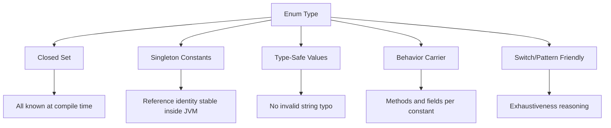
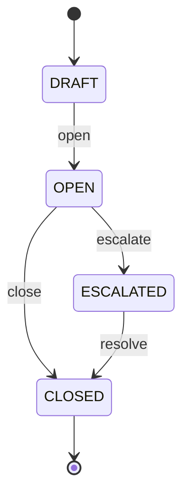
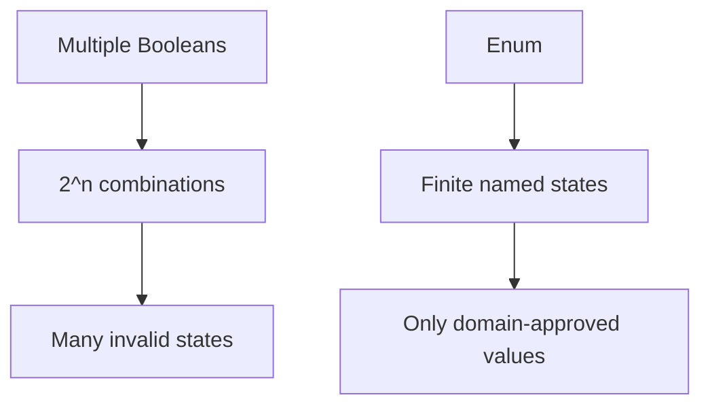

# Part 014 — Enums as Closed Domain Models

> Target part ini: memahami `enum` bukan sebagai “daftar constant”, tetapi sebagai **closed domain model**: himpunan nilai bernama yang terbatas, punya identity stabil di JVM, bisa membawa behavior, dan sangat cocok untuk state, category, policy, capability, dan protocol code yang domain-nya finite.

## 1. Enum Dalam Type Thinking

Tanpa enum, domain sering dimodelkan dengan string atau integer constant.

```java
public static final String STATUS_OPEN = "OPEN";
public static final String STATUS_CLOSED = "CLOSED";
```

Masalah:

```java
String status = "CLOESD"; // typo tetap compile
```

Dengan enum:

```java
public enum CaseStatus {
    OPEN,
    ESCALATED,
    CLOSED
}
```

Compiler membantu:

```java
CaseStatus status = CaseStatus.CLOSED;
// CaseStatus bad = "CLOESD"; // compile error
```

Mental model:

```text
Enum = named finite set of singleton instances
```



## 2. Enum Adalah Class Khusus

Enum declaration memperkenalkan enum class.

```java
public enum Priority {
    LOW,
    MEDIUM,
    HIGH
}
```

Secara bahasa, enum:

| Properti | Penjelasan |
|---|---|
| Reference type | Enum constant adalah object |
| Extends `java.lang.Enum<E>` | Tidak bisa extend class lain |
| Constructor private | Constant dibuat oleh runtime/compiler model |
| Constants singleton | Satu instance per constant per class loader |
| Type-safe | Hanya constant dari enum itu yang valid |
| Bisa implement interface | Cocok untuk polymorphic closed model |
| Bisa punya fields/methods | Behavior bisa dekat dengan data domain |

Enum constant bukan `int`. Ia object dengan identity.

```java
Priority p = Priority.HIGH;
System.out.println(p.name());    // HIGH
System.out.println(p.ordinal()); // posisi deklarasi, jangan untuk persistence
```

## 3. Identity Dan Equality

Enum boleh dibandingkan dengan `==`.

```java
if (status == CaseStatus.OPEN) {
    // safe
}
```

Kenapa aman?

```text
Setiap enum constant adalah singleton instance dari enum type tersebut.
```

`equals` pada enum juga final dan berbasis identity. Namun idiom Java untuk enum comparison adalah `==`.

Keuntungan `==`:

```java
CaseStatus status = null;

if (status == CaseStatus.OPEN) { // aman, false
}

// status.equals(CaseStatus.OPEN); // NPE
```

Tetap saja, null enum biasanya harus diperlakukan sebagai contract violation kecuali absence memang dimodelkan.

## 4. `name()` vs `toString()`

```java
public enum CaseStatus {
    OPEN,
    ESCALATED,
    CLOSED
}
```

```java
CaseStatus.OPEN.name();     // "OPEN"
CaseStatus.OPEN.toString(); // default juga "OPEN"
```

Namun `toString()` bisa dioverride.

```java
public enum CaseStatus {
    OPEN("Open"),
    ESCALATED("Escalated"),
    CLOSED("Closed");

    private final String label;

    CaseStatus(String label) {
        this.label = label;
    }

    @Override
    public String toString() {
        return label;
    }
}
```

Rule penting:

```text
Gunakan name() untuk identifier teknis jika memang enum name adalah kontrak.
Gunakan field eksplisit code jika butuh stable external code.
Gunakan toString() untuk display/debug, bukan persistence/API contract.
```

## 5. Jangan Persist `ordinal()`

`ordinal()` adalah posisi deklarasi constant.

```java
public enum CaseStatus {
    OPEN,       // 0
    ESCALATED,  // 1
    CLOSED      // 2
}
```

Jika disisipkan constant baru:

```java
public enum CaseStatus {
    OPEN,        // 0
    UNDER_REVIEW,// 1
    ESCALATED,   // 2
    CLOSED       // 3
}
```

Data lama yang menyimpan `1` bisa berubah makna dari `ESCALATED` menjadi `UNDER_REVIEW`.

Jangan lakukan:

```java
int stored = status.ordinal();
```

Gunakan code eksplisit:

```java
public enum CaseStatus {
    OPEN("OPEN"),
    ESCALATED("ESC"),
    CLOSED("CLS");

    private final String code;

    CaseStatus(String code) {
        this.code = code;
    }

    public String code() {
        return code;
    }

    public static CaseStatus fromCode(String code) {
        for (CaseStatus status : values()) {
            if (status.code.equals(code)) {
                return status;
            }
        }
        throw new IllegalArgumentException("Unknown CaseStatus code: " + code);
    }
}
```

## 6. `values()` Dan `valueOf()`

Compiler menyediakan method static:

```java
CaseStatus[] all = CaseStatus.values();
CaseStatus status = CaseStatus.valueOf("OPEN");
```

Catatan:

```text
values() mengembalikan array baru/copy agar caller tidak bisa merusak internal enum universe.
valueOf() memakai nama constant, bukan custom code atau label.
```

Untuk external code, buat parser sendiri.

```java
private static final Map<String, CaseStatus> BY_CODE = Arrays.stream(values())
    .collect(Collectors.toUnmodifiableMap(CaseStatus::code, Function.identity()));

public static CaseStatus fromCode(String code) {
    CaseStatus status = BY_CODE.get(code);
    if (status == null) {
        throw new IllegalArgumentException("Unknown CaseStatus code: " + code);
    }
    return status;
}
```

## 7. Enum Dengan Fields

Enum bisa menyimpan metadata.

```java
public enum Severity {
    LOW(1),
    MEDIUM(2),
    HIGH(3),
    CRITICAL(4);

    private final int rank;

    Severity(int rank) {
        this.rank = rank;
    }

    public int rank() {
        return rank;
    }

    public boolean atLeast(Severity other) {
        return this.rank >= other.rank;
    }
}
```

Ini lebih aman daripada membandingkan ordinal.

```java
if (severity.atLeast(Severity.HIGH)) {
    triggerEscalation();
}
```

## 8. Behavior-Rich Enum

Enum bisa membawa behavior berbeda per constant.

```java
public enum DeadlinePolicy {
    CALENDAR_DAYS {
        @Override
        public LocalDate add(LocalDate start, int days) {
            return start.plusDays(days);
        }
    },
    BUSINESS_DAYS {
        @Override
        public LocalDate add(LocalDate start, int days) {
            LocalDate date = start;
            int remaining = days;
            while (remaining > 0) {
                date = date.plusDays(1);
                if (!(date.getDayOfWeek() == DayOfWeek.SATURDAY || date.getDayOfWeek() == DayOfWeek.SUNDAY)) {
                    remaining--;
                }
            }
            return date;
        }
    };

    public abstract LocalDate add(LocalDate start, int days);
}
```

Ini mengganti switch berulang.

Buruk:

```java
switch (policy) {
    case CALENDAR_DAYS -> ...
    case BUSINESS_DAYS -> ...
}
```

Jika logic policy tersebar di banyak tempat, behavior-rich enum bisa menyatukan aturan.

Namun jangan berlebihan: enum bukan tempat untuk dependency injection berat, database access, atau workflow kompleks.

## 9. Enum Implement Interface

Enum bisa implement interface untuk closed strategy set.

```java
public interface RiskScorePolicy {
    int score(CaseFacts facts);
}

public enum StandardRiskPolicy implements RiskScorePolicy {
    LOW {
        @Override
        public int score(CaseFacts facts) {
            return 10;
        }
    },
    HIGH {
        @Override
        public int score(CaseFacts facts) {
            return 90;
        }
    };
}
```

Kapan cocok:

```text
Pilihan policy finite.
Tidak butuh runtime plugin.
Tidak butuh dependency eksternal.
Semua variasi diketahui oleh domain.
Behavior kecil dan deterministic.
```

Kapan tidak cocok:

```text
Policy berubah lewat configuration.
Policy butuh repository/service.
Policy harus extensible oleh modul lain.
Policy harus dimuat dinamis.
```

## 10. Enum Untuk State Model

Enum sering digunakan untuk lifecycle state.

```java
public enum CaseStatus {
    DRAFT,
    OPEN,
    ESCALATED,
    CLOSED
}
```

Namun enum status saja tidak menjamin transition valid.

Buruk:

```java
caseEntity.setStatus(CaseStatus.CLOSED);
```

Lebih baik:

```java
public final class CaseEntity {
    private CaseStatus status;

    public void open() {
        if (status != CaseStatus.DRAFT) {
            throw new IllegalStateException("Only DRAFT can be opened");
        }
        status = CaseStatus.OPEN;
    }

    public void escalate() {
        if (status != CaseStatus.OPEN) {
            throw new IllegalStateException("Only OPEN can be escalated");
        }
        status = CaseStatus.ESCALATED;
    }
}
```

Enum menyatakan state set. Entity/state machine menyatakan transition rules.



## 11. Enum Transition Table

Untuk transition kecil, enum bisa menyimpan allowed next states.

```java
public enum CaseStatus {
    DRAFT,
    OPEN,
    ESCALATED,
    CLOSED;

    private static final Map<CaseStatus, Set<CaseStatus>> ALLOWED = Map.of(
        DRAFT, EnumSet.of(OPEN),
        OPEN, EnumSet.of(ESCALATED, CLOSED),
        ESCALATED, EnumSet.of(CLOSED),
        CLOSED, EnumSet.noneOf(CaseStatus.class)
    );

    public boolean canTransitionTo(CaseStatus target) {
        return ALLOWED.get(this).contains(target);
    }
}
```

Gunakan `EnumSet` untuk set enum.

Namun jika transition punya command-specific side effects, authorization, audit, dan deadlines, pindahkan ke domain service/entity method.

## 12. EnumSet

`EnumSet` adalah set khusus untuk enum, biasanya sangat efisien karena dapat direpresentasikan sebagai bit vector.

```java
EnumSet<CaseStatus> activeStatuses = EnumSet.of(
    CaseStatus.OPEN,
    CaseStatus.ESCALATED
);
```

Lebih baik daripada:

```java
Set<CaseStatus> activeStatuses = new HashSet<>();
```

Gunakan untuk:

```text
permission flags,
status groups,
allowed transitions,
feature capability sets,
validation categories.
```

Contoh:

```java
public enum Permission {
    VIEW_CASE,
    EDIT_CASE,
    ESCALATE_CASE,
    CLOSE_CASE
}

public record Role(String name, EnumSet<Permission> permissions) {
    public Role {
        Objects.requireNonNull(name, "name");
        permissions = permissions.clone();
    }

    public boolean has(Permission permission) {
        return permissions.contains(permission);
    }

    @Override
    public EnumSet<Permission> permissions() {
        return permissions.clone();
    }
}
```

Karena `EnumSet` mutable, tetap perlu defensive copy jika disimpan di immutable type.

## 13. EnumMap

`EnumMap` adalah map khusus dengan enum key.

```java
EnumMap<CaseStatus, Integer> counts = new EnumMap<>(CaseStatus.class);
counts.put(CaseStatus.OPEN, 10);
counts.put(CaseStatus.CLOSED, 5);
```

Gunakan saat key adalah enum. Ini biasanya lebih efisien dan lebih jelas daripada `HashMap<Enum, V>`.

Contoh transition metadata:

```java
EnumMap<CaseStatus, String> labels = new EnumMap<>(CaseStatus.class);
labels.put(CaseStatus.OPEN, "Open");
labels.put(CaseStatus.ESCALATED, "Escalated");
labels.put(CaseStatus.CLOSED, "Closed");
```

Namun untuk stable label, field di enum bisa lebih dekat dengan domain.

## 14. Enum vs Boolean

Jika ada lebih dari dua state, jangan pakai boolean.

Buruk:

```java
boolean closed;
boolean escalated;
boolean rejected;
```

Kombinasi invalid mungkin muncul:

```text
closed=true, escalated=true, rejected=true
```

Lebih baik:

```java
public enum CaseStatus {
    OPEN,
    ESCALATED,
    REJECTED,
    CLOSED
}
```

Enum membuat impossible states lebih sulit.



## 15. Enum vs String Constant

Gunakan enum ketika set nilai dikontrol oleh codebase.

```java
public enum DocumentType {
    NOTICE,
    ORDER,
    EVIDENCE,
    DECISION
}
```

Gunakan string/code object ketika set nilai dikontrol external registry dan bisa berubah tanpa deployment.

```java
public record ExternalClassificationCode(String value) {}
```

Rule:

| Kondisi | Pilihan |
|---|---|
| Nilai finite dan stabil di code | Enum |
| Nilai finite tapi external dan sering berubah | Code object + registry |
| Nilai butuh behavior per value | Enum atau sealed hierarchy |
| Nilai tidak diketahui saat compile | String/code object |
| Butuh exhaustive switch | Enum/sealed type |

## 16. Enum vs Sealed Hierarchy

Enum cocok jika setiap value relatif sederhana.

```java
public enum PaymentStatus {
    PENDING,
    PAID,
    FAILED
}
```

Sealed hierarchy lebih cocok jika setiap variant membawa data berbeda.

```java
public sealed interface PaymentResult permits Paid, Failed, Pending {}

public record Paid(String transactionId, Instant paidAt) implements PaymentResult {}
public record Failed(String reasonCode, String message) implements PaymentResult {}
public record Pending(Instant expectedAt) implements PaymentResult {}
```

Jangan paksa enum membawa payload per occurrence. Enum constant singleton, bukan instance dinamis per event.

Buruk:

```java
// Enum constant tidak cocok menyimpan transactionId berbeda per payment.
```

## 17. Enum Dan Switch

Enum cocok untuk `switch`.

```java
String label = switch (status) {
    case OPEN -> "Open";
    case ESCALATED -> "Escalated";
    case CLOSED -> "Closed";
};
```

Untuk exhaustive reasoning, hindari `default` jika ingin compiler membantu saat enum bertambah.

Buruk:

```java
String label = switch (status) {
    case OPEN -> "Open";
    default -> "Other";
};
```

Jika nanti `ESCALATED` ditambahkan, `default` menyembunyikan kebutuhan handling eksplisit.

Gunakan `default` hanya jika memang ada fallback domain yang benar.

## 18. Enum Dan External Representation

Enum name bukan selalu external contract yang baik.

```java
public enum CaseStatus {
    OPEN,
    ESCALATED,
    CLOSED
}
```

Jika API mengirim:

```json
{"status":"ESCALATED"}
```

Maka rename enum constant adalah breaking change.

Lebih defensible:

```java
public enum CaseStatus {
    OPEN("open"),
    ESCALATED("escalated"),
    CLOSED("closed");

    private final String wireValue;

    CaseStatus(String wireValue) {
        this.wireValue = wireValue;
    }

    public String wireValue() {
        return wireValue;
    }
}
```

Review question:

```text
Apakah external consumers tergantung pada enum name?
Apakah code perlu stabil walaupun nama Java refactor?
Apakah unknown value dari future version harus ditoleransi?
```

## 19. Unknown Enum Values

Distributed systems harus memikirkan forward compatibility.

Service A versi baru mengirim:

```json
{"status":"SUSPENDED"}
```

Service B versi lama hanya tahu:

```java
OPEN, ESCALATED, CLOSED
```

Pilihan handling:

| Strategy | Kapan Dipakai |
|---|---|
| Fail fast | Internal invariant ketat; unknown berarti data corrupt |
| Map to `UNKNOWN` | Read-only display/analytics; toleransi forward compatibility |
| Preserve raw value | Proxy/gateway; jangan kehilangan informasi |
| Versioned contract | External API formal |

Enum dengan `UNKNOWN`:

```java
public enum ExternalCaseStatus {
    OPEN,
    ESCALATED,
    CLOSED,
    UNKNOWN
}
```

Namun hati-hati: `UNKNOWN` bisa menyembunyikan bug jika dipakai di domain core.

Core domain sering lebih baik fail fast; boundary adapter boleh menampung unknown.

## 20. Enum Dan Database

Dengan ORM, enum bisa disimpan sebagai ordinal atau string. Secara umum, string/code lebih aman daripada ordinal.

Risiko ordinal:

```text
Reorder enum merusak data.
Insert enum constant merusak data.
Makna angka tidak self-describing.
```

Risiko name string:

```text
Rename enum constant breaking.
DB value panjang/terikat nama Java.
External contract ikut refactor internal.
```

Pilihan kuat:

```java
public enum CaseStatus {
    OPEN("O"),
    ESCALATED("E"),
    CLOSED("C");

    private final String dbCode;

    CaseStatus(String dbCode) {
        this.dbCode = dbCode;
    }

    public String dbCode() {
        return dbCode;
    }

    public static CaseStatus fromDbCode(String code) {
        for (CaseStatus value : values()) {
            if (value.dbCode.equals(code)) return value;
        }
        throw new IllegalArgumentException("Unknown db code: " + code);
    }
}
```

Code eksplisit memisahkan Java name dari persistence contract.

## 21. Enum Dan API Compatibility

Perubahan enum tidak semuanya sama.

| Perubahan | Risiko |
|---|---|
| Add constant | Bisa break exhaustive switch consumer |
| Remove constant | Breaking untuk data lama dan consumer |
| Rename constant | Breaking jika name dipakai wire/db |
| Reorder constant | Breaking jika ordinal dipakai |
| Change code field | Breaking jika code external |
| Change behavior method | Runtime semantic change |
| Add field | Biasanya internal, kecuali serialized |

Untuk API publik, treat enum sebagai schema.

## 22. Enum Dalam Regulatory/Case Management System

Contoh domain:

```java
public enum EnforcementStage {
    INTAKE("intake"),
    ASSESSMENT("assessment"),
    INVESTIGATION("investigation"),
    DECISION("decision"),
    APPEAL("appeal"),
    CLOSED("closed");

    private final String code;

    EnforcementStage(String code) {
        this.code = code;
    }

    public String code() {
        return code;
    }
}
```

Pertanyaan penting:

```text
Apakah stage benar-benar closed set?
Apakah stage bisa dikonfigurasi per regulator/jurisdiction?
Apakah historical data harus preserve stage lama?
Apakah transition rules sama untuk semua case type?
Apakah stage hanya label atau punya behavior?
```

Jika stage berbeda per jurisdiction dan berubah lewat admin UI, enum mungkin terlalu kaku. Gunakan configuration-backed code object.

```java
public record StageCode(String value) {}
```

Namun jika stage adalah core invariant regulatory platform, enum bisa benar.

## 23. Enum Dengan Metadata Temporal

Kadang enum value punya lifecycle.

```java
public enum FilingChannel {
    ONLINE("online", true),
    COUNTER("counter", true),
    FAX("fax", false);

    private final String code;
    private final boolean active;

    FilingChannel(String code, boolean active) {
        this.code = code;
        this.active = active;
    }
}
```

Ini hanya cocok jika active/inactive berubah lewat deployment.

Jika active period tergantung tanggal/regulation:

```java
public record FilingChannelRule(
    FilingChannel channel,
    LocalDate validFrom,
    LocalDate validTo
) {}
```

Jangan taruh temporal policy dinamis di enum jika business ingin mengubah tanpa redeploy.

## 24. Enum Dan Localization

Jangan jadikan enum label sebagai localized text.

Buruk:

```java
public enum Status {
    OPEN("Terbuka"),
    CLOSED("Tertutup");
}
```

Jika aplikasi multi-locale, gunakan message key.

```java
public enum Status {
    OPEN("status.open"),
    CLOSED("status.closed");

    private final String messageKey;

    Status(String messageKey) {
        this.messageKey = messageKey;
    }

    public String messageKey() {
        return messageKey;
    }
}
```

Rendering localization adalah concern presentation layer.

## 25. Enum Dan Security/Authorization

Enum sering cocok untuk permission.

```java
public enum Permission {
    CASE_VIEW,
    CASE_EDIT,
    CASE_ASSIGN,
    CASE_ESCALATE,
    CASE_CLOSE
}
```

Role:

```java
public record Role(String name, Set<Permission> permissions) {
    public Role {
        Objects.requireNonNull(name, "name");
        permissions = Set.copyOf(permissions);
    }

    public boolean allows(Permission permission) {
        return permissions.contains(permission);
    }
}
```

Namun jika permission dikelola oleh IAM external dan bisa muncul tanpa code deployment, enum bisa terlalu ketat.

Pertanyaan:

```text
Apakah permission set owned by application code?
Apakah permission set owned by identity provider/configuration?
Apakah unknown permission harus ignored atau denied?
```

Security default biasanya deny unknown.

## 26. Enum Dan Bit Flags

EnumSet bisa menggantikan bit mask manual.

Buruk:

```java
static final int CAN_VIEW = 1;
static final int CAN_EDIT = 2;
static final int CAN_CLOSE = 4;

int permissions = CAN_VIEW | CAN_EDIT;
```

Lebih type-safe:

```java
EnumSet<Permission> permissions = EnumSet.of(
    Permission.CASE_VIEW,
    Permission.CASE_EDIT
);
```

Bit mask bisa tetap muncul di protocol low-level, tetapi di domain model gunakan enum set.

## 27. Enum Anti-Patterns

### 27.1 God Enum

```java
public enum CaseType {
    A, B, C, D, E, F, G, H, I, J
}
```

Jika setiap constant punya banyak metadata, transition, deadline, form, workflow, permission, dan rendering, enum bisa menjadi god object.

Pisahkan:

```text
Enum untuk stable identity.
Configuration/table/rule object untuk metadata yang berubah.
State machine untuk transition.
Policy object untuk behavior kompleks.
```

### 27.2 Enum Untuk Dynamic Catalog

Buruk:

```java
public enum CountryCode { ID, US, SG, ... }
```

Untuk catalog besar/dinamis, gunakan database/reference data atau `Locale`/standard library jika tersedia.

### 27.3 Enum Name Sebagai UI Label

```java
status.name().toLowerCase()
```

Ini bocor internal naming ke UI.

### 27.4 Ordinal Untuk Sorting Domain

Buruk:

```java
Comparator.comparing(Enum::ordinal)
```

Gunakan rank eksplisit.

```java
public enum Severity {
    LOW(10), MEDIUM(20), HIGH(30);

    private final int rank;

    Severity(int rank) { this.rank = rank; }
    public int rank() { return rank; }
}
```

### 27.5 `default` Switch Yang Menyembunyikan Constant Baru

```java
return switch (status) {
    case OPEN -> "open";
    default -> "other";
};
```

Jika domain butuh explicit handling, jangan pakai default.

## 28. Testing Enum

Test enum ketika ada behavior, parser, mapping, atau transition.

```java
class CaseStatusTest {
    @Test
    void parsesKnownCode() {
        assertEquals(CaseStatus.OPEN, CaseStatus.fromDbCode("O"));
    }

    @Test
    void rejectsUnknownCode() {
        assertThrows(IllegalArgumentException.class, () -> CaseStatus.fromDbCode("X"));
    }

    @Test
    void openCanTransitionToEscalated() {
        assertTrue(CaseStatus.OPEN.canTransitionTo(CaseStatus.ESCALATED));
    }
}
```

Jangan test bahwa `CaseStatus.OPEN.name()` mengembalikan `OPEN` kecuali name memang external contract yang ingin dikunci.

## 29. Production Failure Modes

| Failure | Root Cause | Prevention |
|---|---|---|
| Data lama berubah makna | Persist ordinal | Persist code eksplisit |
| Consumer gagal parse enum baru | No forward compatibility | Boundary parser strategy |
| UI label berubah karena rename | `name()` untuk display | Message key/label table |
| State invalid tetap terjadi | Enum tanpa transition guard | Entity method/state machine |
| Business ingin tambah value tanpa deploy | Enum untuk dynamic catalog | Code object/reference data |
| Switch diam-diam salah | `default` terlalu luas | Exhaustive explicit handling |
| Enum terlalu kompleks | God enum | Split metadata/rules/policies |
| API breaking saat rename | Enum name jadi wire contract | Stable wire code |

## 30. Review Checklist

Saat review enum baru, tanyakan:

```text
1. Apakah value set benar-benar finite dan owned by codebase?
2. Apakah constant bisa bertambah tanpa deployment?
3. Apakah enum name dipakai di DB/API/log/user interface?
4. Apakah perlu stable external code field?
5. Apakah ordinal dipakai? Jika ya, kenapa?
6. Apakah sorting memakai ordinal atau rank eksplisit?
7. Apakah switch harus exhaustive tanpa default?
8. Apakah unknown value perlu ditoleransi di boundary?
9. Apakah enum menyimpan behavior yang masih deterministic dan lokal?
10. Apakah behavior butuh dependency eksternal?
11. Apakah EnumSet/EnumMap lebih tepat daripada HashSet/HashMap?
12. Apakah enum ini sebenarnya dynamic reference data?
13. Apakah enum ini sebenarnya sealed hierarchy karena tiap variant butuh payload berbeda?
14. Apakah toString aman dan tidak dipakai sebagai persistence contract?
15. Apakah add/rename/remove constant punya migration plan?
```

## 31. Latihan 20 Menit

Ambil model berikut:

```java
public class CaseRecord {
    private String status;
    private boolean urgent;
    private boolean closed;
    private int severity;
}
```

Refactor:

```text
1. Ubah `status` menjadi enum `CaseStatus`.
2. Ubah `severity` menjadi enum dengan rank eksplisit.
3. Hilangkan boolean yang overlap dengan status jika mungkin.
4. Tambahkan transition rule dari OPEN -> ESCALATED -> CLOSED.
5. Tambahkan stable DB/API code.
```

Contoh arah solusi:

```java
public enum CaseStatus {
    OPEN("open"),
    ESCALATED("escalated"),
    CLOSED("closed");

    private final String code;

    CaseStatus(String code) {
        this.code = code;
    }

    public String code() {
        return code;
    }

    public boolean canTransitionTo(CaseStatus target) {
        return switch (this) {
            case OPEN -> target == ESCALATED || target == CLOSED;
            case ESCALATED -> target == CLOSED;
            case CLOSED -> false;
        };
    }
}

public enum Severity {
    LOW(10),
    MEDIUM(20),
    HIGH(30),
    CRITICAL(40);

    private final int rank;

    Severity(int rank) {
        this.rank = rank;
    }

    public boolean atLeast(Severity other) {
        return this.rank >= other.rank;
    }
}
```

## 32. Ringkasan

Enum adalah pilihan kuat ketika domain memiliki set nilai yang:

```text
finite,
known at compile time,
type-safe,
sering dipakai untuk branching,
dan sebaiknya tidak menerima nilai arbitrary.
```

Gunakan enum untuk status, severity, small policy set, permission internal, protocol mode, dan category yang benar-benar closed.

Jangan gunakan enum untuk dynamic catalog, external registry yang berubah tanpa deploy, atau variant yang membawa payload berbeda per occurrence.

Pertanyaan desain utamanya:

```text
Apakah ini closed set milik codebase?
Apakah external representation-nya stabil?
Apakah future value harus ditoleransi?
Apakah behavior-nya cukup lokal untuk tinggal di enum?
```

Jika jawabannya jelas, enum adalah salah satu alat Java paling sederhana tetapi paling kuat untuk membuat invalid state lebih sulit muncul.

## Official References

- Java Language Specification, Java SE 25 Edition — Enum Classes.
- Java SE 25 API Documentation — `java.lang.Enum`.
- Java SE 25 API Documentation — `java.util.EnumSet` and `java.util.EnumMap`.
