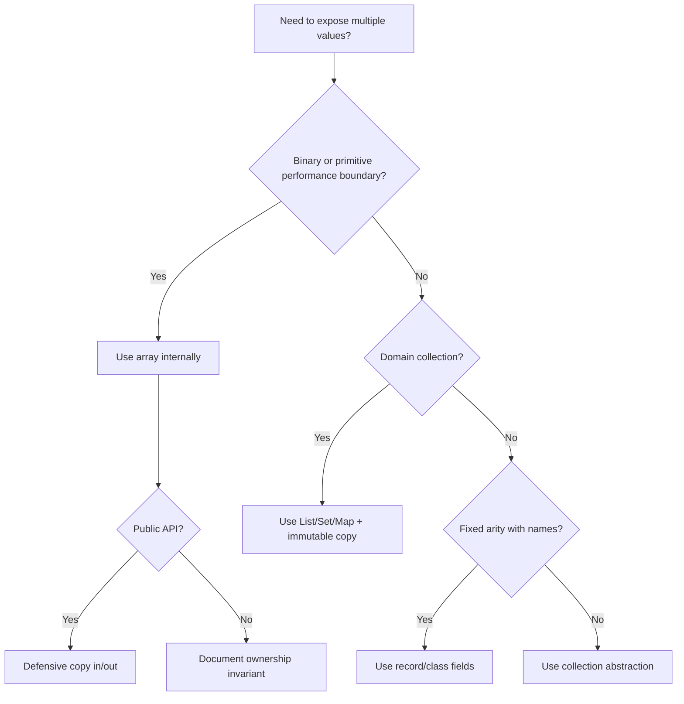

# Part 015 — Arrays, Reified Types, Covariance & Boundary Risks

> Target part ini: memahami array bukan sekadar “list bawaan Java”, tetapi **mutable fixed-length object** dengan runtime component type yang reified. Array efisien dan sangat dekat dengan VM, tetapi juga membawa risiko aliasing, covariance, shallow copying, `ArrayStoreException`, dan boundary leak.

## 1. Mental Model Utama

Array di Java adalah object.

```java
int[] scores = new int[3];
String[] names = new String[2];
```

`int[]` dan `String[]` adalah reference type. Variable `scores` dan `names` menyimpan reference value ke array object.

```text
array variable -> reference value -> array object
```

Array object punya:

| Properti | Makna |
|---|---|
| Fixed length | Panjang ditentukan saat dibuat dan tidak bisa berubah |
| Indexed storage | Elemen diakses dengan index `0..length-1` |
| Runtime component type | Array tahu tipe komponennya saat runtime |
| Mutable elements | Elemen bisa diganti selama reference dapat diakses |
| Object identity | Array punya identity dan bisa dibandingkan dengan `==` |
| Default element values | Elemen otomatis diisi default value sesuai tipe |

Diagram:

```mermaid
graph TD
    A[Variable: String[] names] --> B[Reference Value]
    B --> C[Array Object]
    C --> D[length = 3]
    C --> E[runtime component type = String]
    C --> F[index 0]
    C --> G[index 1]
    C --> H[index 2]
```

Mental model yang harus tertanam:

```text
Array = fixed-size mutable object with reified component type
```

Bukan:

```text
Array = resizable collection
Array = value
Array = immutable data block
Array = generic-safe List substitute
```

## 2. Kenapa Array Penting Untuk Engineer Senior

Array muncul di area yang dekat dengan performance, interoperability, dan boundary:

- binary protocol: `byte[]`
- cryptography: keys, nonces, signatures, digests
- database driver internals
- serializer/deserializer
- image/audio/network buffer
- batch processing
- primitive-heavy computation
- framework reflection
- varargs
- JVM bytecode-level structures

Namun bug array biasanya mahal karena:

- mutation-nya mudah tersembunyi
- copy sering shallow
- equality default-nya identity-based
- covariance memberi ilusi type safety yang baru gagal runtime
- exposing array field membocorkan internal state
- `byte` signedness membuat binary boundary rawan salah

## 3. Deklarasi, Allocation, Initialization

Deklarasi:

```java
int[] a;
String[] b;
```

Allocation:

```java
a = new int[3];
b = new String[3];
```

Initialization literal:

```java
int[] primes = {2, 3, 5, 7};
String[] roles = new String[] {"ADMIN", "REVIEWER"};
```

Array length fixed:

```java
int[] values = new int[2];
values[0] = 10;
values[1] = 20;
// values[2] = 30; // ArrayIndexOutOfBoundsException
```

`length` adalah field final khusus array, bukan method:

```java
int size = values.length;
```

Bandingkan dengan collection:

```java
list.size(); // method
array.length; // field
```

## 4. Default Values Di Array

Elemen array otomatis diinisialisasi.

```java
int[] ints = new int[3];          // [0, 0, 0]
boolean[] flags = new boolean[2]; // [false, false]
String[] texts = new String[2];   // [null, null]
```

Default value penting karena bisa menyembunyikan bug domain.

Contoh buruk:

```java
int[] approvalCounts = new int[10];

// Apakah 0 berarti belum dihitung, tidak ada approval, atau error parsing?
```

Jika `0` punya banyak arti, array primitive menjadi terlalu lemah sebagai model domain.

Solusi tergantung kebutuhan:

```java
record ApprovalCounter(int value, boolean computed) {}
```

Atau gunakan struktur domain yang eksplisit:

```java
enum ComputationState { NOT_COMPUTED, COMPUTED }

record ApprovalMetric(ComputationState state, int count) {}
```

## 5. Primitive Array vs Reference Array

Primitive array menyimpan primitive value.

```java
int[] numbers = {1, 2, 3};
```

Reference array menyimpan reference value.

```java
Customer[] customers = {c1, c2, c3};
```

Perbedaannya fundamental:

```mermaid
graph TD
    A[int[]] --> B[Array object]
    B --> C[1]
    B --> D[2]
    B --> E[3]

    F[Customer[]] --> G[Array object]
    G --> H[ref -> Customer A]
    G --> I[ref -> Customer B]
    G --> J[ref -> Customer C]
```

Konsekuensi:

| Area | Primitive Array | Reference Array |
|---|---|---|
| Elemen | Value langsung | Reference value |
| Null element | Tidak bisa | Bisa |
| Locality | Biasanya lebih compact | Object target tersebar |
| Equality element | Primitive comparison | `equals` jika pakai `Arrays.equals` |
| Default | `0`, `false`, etc. | `null` |
| Mutation risk | Elemen bisa diganti | Elemen dan object target bisa berubah |

Reference array punya dua level mutability:

```java
Customer[] customers = {alice};
customers[0] = bob;       // mutate array slot
customers[0].rename(...); // mutate target object, jika mutable
```

## 6. Array Adalah Reified

Array menyimpan informasi component type saat runtime.

```java
String[] names = new String[2];
System.out.println(names.getClass());
System.out.println(names.getClass().getComponentType()); // class java.lang.String
```

Reified berarti runtime tahu bahwa object itu `String[]`, bukan sekadar “array of something”.

Ini berbeda dari generic type parameter yang mengalami type erasure.

```java
List<String> names = new ArrayList<>();
System.out.println(names.getClass()); // class java.util.ArrayList
// runtime object tidak menyimpan List<String> sebagai concrete parameterization
```

Reification memberi safety runtime untuk array store.

```java
Object[] objects = new String[1];
objects[0] = "ok";
objects[0] = 123; // ArrayStoreException
```

Compile-time melihat `objects` sebagai `Object[]`, tetapi runtime array object tahu dirinya `String[]`.

## 7. Covariance: Kenapa `String[]` Bisa Jadi `Object[]`

Array Java covariant.

```java
String[] strings = new String[2];
Object[] objects = strings; // allowed
```

Artinya:

```text
Jika String subtype dari Object,
maka String[] subtype dari Object[]
```

Ini terlihat nyaman, tapi berbahaya.

```java
String[] strings = new String[1];
Object[] objects = strings;
objects[0] = 42; // runtime failure: ArrayStoreException
```

Compiler mengizinkan karena `objects[0]` secara static terlihat bisa menerima `Object`.
Runtime menolak karena array object sebenarnya hanya bisa menyimpan `String`.

Diagram:

```mermaid
graph TD
    A[String[] actual object] --> B[component type: String]
    C[Object[] variable] --> A
    C --> D[store Integer]
    D --> E{Runtime component type check}
    E -->|Integer is not String| F[ArrayStoreException]
```

Pelajaran desain:

```text
Array covariance = compile-time flexibility + runtime store check
```

Jangan jadikan covariance sebagai mekanisme desain API. Gunakan interface collection, generic bound, atau copy boundary yang jelas.

## 8. Generics Invariant, Array Covariant

Generic collection umumnya invariant.

```java
List<String> strings = new ArrayList<>();
// List<Object> objects = strings; // compile error
```

Ini mencegah bug yang pada array baru muncul runtime.

Kalau butuh membaca dari list subtype:

```java
void printAll(List<? extends Object> values) {
    for (Object value : values) {
        System.out.println(value);
    }
}
```

Kalau butuh menulis object:

```java
void addDefaults(List<? super String> values) {
    values.add("UNKNOWN");
}
```

Perbedaan besar:

| Fitur | Array | Generics |
|---|---|---|
| Variance default | Covariant | Invariant |
| Runtime type info | Reified component type | Erased type parameter |
| Wrong store | Runtime exception | Biasanya compile error |
| Primitive support | Ya | Tidak langsung, perlu wrapper |
| Fixed length | Ya | Tidak selalu |

## 9. Kenapa Tidak Bisa Membuat Generic Array Dengan Aman

Kode ini tidak boleh:

```java
// T[] values = new T[10]; // illegal
```

Dan ini juga tidak boleh:

```java
// List<String>[] groups = new List<String>[10]; // illegal
```

Alasannya: array butuh runtime component type yang reified, sedangkan `T` atau `List<String>` tidak tersedia sebagai runtime component type yang tepat karena erasure.

Workaround sering terlihat seperti ini:

```java
@SuppressWarnings("unchecked")
T[] values = (T[]) new Object[10];
```

Ini harus dibatasi di area internal yang sangat kecil, karena cast ini tidak benar-benar membuat `T[]`. Ia membuat `Object[]` yang dipaksa secara static.

Lebih baik gunakan `List<T>` untuk struktur generic umum.

```java
final class Buffer<T> {
    private final List<T> values = new ArrayList<>();
}
```

Jika benar-benar perlu array karena performance/internal implementation, sembunyikan detail-nya:

```java
final class RingBuffer<T> {
    private final Object[] elements;

    RingBuffer(int capacity) {
        this.elements = new Object[capacity];
    }

    @SuppressWarnings("unchecked")
    T get(int index) {
        return (T) elements[index];
    }
}
```

Invariant internal harus jelas:

```text
Only T values are stored into elements.
```

## 10. Varargs Adalah Array

Method varargs:

```java
void log(String... messages) {
    System.out.println(messages.length);
}
```

Secara mekanik, parameter `messages` adalah `String[]`.

Pemanggilan:

```java
log("a", "b", "c");
```

Diterjemahkan secara konsep menjadi array creation.

```java
log(new String[] {"a", "b", "c"});
```

Konsekuensi:

- varargs bisa mengalokasikan array baru
- parameter varargs mutable di dalam method
- varargs dengan generic bisa memunculkan heap pollution warning
- exposing varargs array ke luar sama dengan exposing mutable array

Contoh buruk:

```java
final class AuditTags {
    private final String[] tags;

    AuditTags(String... tags) {
        this.tags = tags; // bad: caller array can be mutated after construction
    }
}
```

Perbaikan:

```java
final class AuditTags {
    private final String[] tags;

    AuditTags(String... tags) {
        this.tags = tags.clone();
    }

    String[] toArray() {
        return tags.clone();
    }
}
```

Untuk API modern, lebih baik expose immutable list jika tidak ada alasan array-specific.

```java
record AuditTags(List<String> values) {
    AuditTags {
        values = List.copyOf(values);
    }
}
```

## 11. Generic Varargs Dan Heap Pollution

Generic varargs rawan karena varargs direpresentasikan sebagai array, sementara generic type parameter erased.

```java
@SafeVarargs
static <T> List<T> listOf(T... values) {
    return List.of(values);
}
```

`@SafeVarargs` bukan “matikan warning karena malas”. Annotation ini adalah janji bahwa method tidak melakukan operasi tidak aman terhadap varargs array.

Contoh tidak aman secara konsep:

```java
static void unsafe(List<String>... lists) {
    Object[] array = lists;
    array[0] = List.of(123); // heap pollution
    String value = lists[0].get(0); // ClassCastException later
}
```

Rule praktis:

```text
Generic varargs aman hanya jika method tidak menulis elemen berbahaya ke varargs array dan tidak membocorkan array tersebut.
```

Checklist untuk `@SafeVarargs`:

- method `static`, `final`, atau constructor/private method yang eligible
- tidak assign varargs ke `Object[]` untuk ditulis
- tidak menyimpan varargs array ke field mutable
- tidak mengembalikan varargs array langsung
- hanya membaca atau membuat copy defensif

## 12. Array Access Dan Bounds Check

Array access melakukan bounds check.

```java
int[] values = {10, 20};
int x = values[1]; // ok
int y = values[2]; // ArrayIndexOutOfBoundsException
```

Bounds check adalah bagian safety Java. Engineer senior tidak “menghilangkan bounds check” secara manual dengan trik prematur. Tugas kita adalah menulis loop yang jelas sehingga JIT punya peluang melakukan optimisasi seperti bounds-check elimination ketika aman.

Loop yang idiomatik:

```java
int sum = 0;
for (int i = 0; i < values.length; i++) {
    sum += values[i];
}
```

Enhanced for:

```java
for (int value : values) {
    sum += value;
}
```

Hati-hati ketika index punya arti domain.

```java
int[] countsByStatusOrdinal = new int[CaseStatus.values().length];
countsByStatusOrdinal[status.ordinal()]++;
```

Ini cepat, tetapi coupling ke `ordinal()` berbahaya jika enum berubah. Untuk domain code, biasanya `EnumMap` lebih defensible.

```java
EnumMap<CaseStatus, Integer> counts = new EnumMap<>(CaseStatus.class);
```

## 13. Multidimensional Array Itu Array Of Arrays

Java tidak punya true rectangular multidimensional array seperti beberapa bahasa lain. Java punya array yang elemennya array.

```java
int[][] matrix = new int[2][3];
```

Secara konsep:

```text
int[][] = array of int[]
```

Jagged array valid:

```java
int[][] rows = new int[3][];
rows[0] = new int[2];
rows[1] = new int[5];
rows[2] = new int[1];
```

Diagram:

```mermaid
graph TD
    A[int[][] rows] --> B[outer array]
    B --> C[int[] length 2]
    B --> D[int[] length 5]
    B --> E[int[] length 1]
```

Konsekuensi:

- setiap row bisa punya panjang berbeda
- row bisa `null` jika belum dialokasi
- locality tidak sama dengan flat rectangular memory
- copy outer array tidak otomatis copy inner arrays

Contoh shallow clone:

```java
int[][] original = {{1, 2}, {3, 4}};
int[][] copy = original.clone();

copy[0][0] = 99;
System.out.println(original[0][0]); // 99
```

Deep copy manual:

```java
int[][] deep = new int[original.length][];
for (int i = 0; i < original.length; i++) {
    deep[i] = original[i].clone();
}
```

## 14. Copying: `clone`, `System.arraycopy`, `Arrays.copyOf`

Array copy sering shallow.

```java
String[] a = {"x", "y"};
String[] b = a.clone();
```

Slot array dicopy, object target tidak diduplikasi.

Untuk immutable elements seperti `String`, shallow copy biasanya cukup. Untuk mutable elements, tidak.

```java
MutableAddress[] addresses = {address};
MutableAddress[] copy = addresses.clone();
copy[0].changeCity("Jakarta");
// original[0] melihat perubahan yang sama
```

Pilihan copy:

| API | Kegunaan |
|---|---|
| `array.clone()` | Copy array dengan length sama |
| `Arrays.copyOf` | Copy dengan length baru atau sama |
| `Arrays.copyOfRange` | Copy subset |
| `System.arraycopy` | Low-level bulk copy |

Contoh:

```java
int[] source = {1, 2, 3};
int[] same = source.clone();
int[] bigger = Arrays.copyOf(source, 5); // [1,2,3,0,0]
int[] middle = Arrays.copyOfRange(source, 1, 3); // [2,3]
```

Untuk reference elements yang mutable, deep copy butuh copy constructor/factory per element.

```java
Address[] copy = Arrays.stream(addresses)
        .map(Address::copy)
        .toArray(Address[]::new);
```

## 15. Equality: Array `equals` Bukan Element Equality

Array tidak override `Object.equals` untuk element-wise equality.

```java
int[] a = {1, 2};
int[] b = {1, 2};

System.out.println(a == b);      // false
System.out.println(a.equals(b)); // false
```

Gunakan `Arrays.equals`:

```java
System.out.println(Arrays.equals(a, b)); // true
```

Untuk nested arrays:

```java
int[][] x = {{1, 2}};
int[][] y = {{1, 2}};

System.out.println(Arrays.equals(x, y));     // false, compares inner array refs
System.out.println(Arrays.deepEquals(x, y)); // true
```

Untuk hash:

```java
int hash = Arrays.hashCode(a);
int deepHash = Arrays.deepHashCode(new Object[] {x});
```

Production bug umum:

```java
record Digest(byte[] bytes) {}

Digest d1 = new Digest(new byte[] {1, 2});
Digest d2 = new Digest(new byte[] {1, 2});

System.out.println(d1.equals(d2)); // false, karena record equals memanggil equals komponen
```

Record dengan array component membutuhkan desain khusus.

```java
public final class Digest {
    private final byte[] bytes;

    public Digest(byte[] bytes) {
        this.bytes = bytes.clone();
    }

    public byte[] bytes() {
        return bytes.clone();
    }

    @Override
    public boolean equals(Object other) {
        return other instanceof Digest d && Arrays.equals(bytes, d.bytes);
    }

    @Override
    public int hashCode() {
        return Arrays.hashCode(bytes);
    }
}
```

## 16. `Arrays.asList` Bukan Resizable List

```java
String[] values = {"a", "b"};
List<String> list = Arrays.asList(values);
```

List hasil `Arrays.asList` fixed-size dan backed by array.

```java
list.set(0, "x");
System.out.println(values[0]); // x

// list.add("c"); // UnsupportedOperationException
```

Jika butuh list mutable independen:

```java
List<String> mutable = new ArrayList<>(Arrays.asList(values));
```

Jika butuh immutable snapshot:

```java
List<String> snapshot = List.copyOf(Arrays.asList(values));
```

Atau:

```java
List<String> snapshot = List.of(values);
```

Namun hati-hati untuk primitive array:

```java
int[] nums = {1, 2, 3};
List<int[]> oneElement = List.of(nums); // satu elemen: int[]
```

Bukan `List<Integer>`.

## 17. Defensive Boundary: Jangan Expose Mutable Array

Contoh buruk:

```java
public final class ApiKey {
    private final byte[] value;

    public ApiKey(byte[] value) {
        this.value = value;
    }

    public byte[] value() {
        return value;
    }
}
```

Caller bisa mengubah state internal:

```java
byte[] raw = {1, 2, 3};
ApiKey key = new ApiKey(raw);
raw[0] = 99;

key.value()[1] = 88;
```

Perbaikan minimal:

```java
public final class ApiKey {
    private final byte[] value;

    public ApiKey(byte[] value) {
        this.value = Objects.requireNonNull(value, "value").clone();
    }

    public byte[] value() {
        return value.clone();
    }
}
```

Untuk data sensitif, copy saja tidak cukup. Perhatikan lifecycle dan zeroization.

```java
Arrays.fill(secret, (byte) 0);
```

Namun jangan menganggap zeroization selalu sempurna di managed runtime karena copy internal, optimizer, string interning, dan framework buffering bisa membuat salinan lain. Untuk secret handling, minimalkan exposure dan gunakan library/security API yang tepat.

## 18. Array Dan API Design

Gunakan array jika:

- butuh primitive storage compact
- berurusan dengan binary data
- API Java/JDK/framework memang mengharuskan array
- size fixed natural dalam domain
- performance hotspot sudah terukur
- varargs ergonomics di public API memang berguna

Gunakan `List` jika:

- koleksi domain-level
- ukuran dinamis
- ingin abstraction lebih kuat
- butuh immutability via `List.copyOf`
- ingin menghindari covariance runtime failure
- ingin interop lebih baik dengan collection pipeline

Gunakan value object jika elemen punya invariant domain.

```java
record ReviewerAssignments(List<ReviewerId> reviewerIds) {
    ReviewerAssignments {
        reviewerIds = List.copyOf(reviewerIds);
        if (reviewerIds.isEmpty()) {
            throw new IllegalArgumentException("reviewerIds must not be empty");
        }
    }
}
```

Gunakan `ByteBuffer` atau abstraction lain jika:

- butuh cursor/position/limit
- butuh endian-aware protocol parsing
- butuh direct buffer/off-heap integration
- butuh slicing/view semantics

## 19. Byte Array Untuk Binary Boundary

`byte[]` sangat umum untuk binary payload.

```java
byte[] payload = socket.readNBytes(1024);
```

Namun `byte` di Java signed: `-128..127`.

Jika byte merepresentasikan unsigned octet, convert eksplisit.

```java
int unsigned = payload[i] & 0xFF;
```

Jangan ubah binary payload ke `String` tanpa charset.

```java
// bad
String text = new String(payload);

// better
String text = new String(payload, StandardCharsets.UTF_8);
```

Jangan gunakan `String` untuk arbitrary binary data.

```java
byte[] digest = messageDigest.digest(input);
String wrong = new String(digest, StandardCharsets.UTF_8); // invalid model
```

Gunakan hex/base64 untuk textual representation.

```java
String encoded = Base64.getEncoder().encodeToString(digest);
```

## 20. Array Di Persistence/Serialization Boundary

Array sering melewati boundary:

- JSON array
- SQL array/blob
- protobuf repeated field
- CSV row
- binary packet
- file content

Pertanyaan review:

| Pertanyaan | Kenapa penting |
|---|---|
| Apakah order punya makna? | Array/list berarti ordered sequence |
| Apakah duplicate valid? | Array mengizinkan duplicate |
| Apakah empty berbeda dari missing? | Boundary contract harus jelas |
| Apakah element nullable? | JSON dapat membawa null, primitive array tidak |
| Apakah array immutable setelah diterima? | Perlu copy/snapshot |
| Apakah length dibatasi? | Mencegah memory abuse |
| Apakah index punya arti domain? | Lebih baik map/object jika field punya nama |

Contoh kontrak yang lebih jelas:

```java
record EvidenceUploadRequest(
        CaseId caseId,
        List<EvidenceFile> files
) {
    EvidenceUploadRequest {
        files = List.copyOf(files);
        if (files.isEmpty()) {
            throw new IllegalArgumentException("files must not be empty");
        }
    }
}
```

Daripada:

```java
record EvidenceUploadRequest(String caseId, byte[][] files) {}
```

## 21. Production Failure Modes

### 21.1 Exposed Internal Array

```java
class Token {
    private final byte[] bytes;

    Token(byte[] bytes) {
        this.bytes = bytes;
    }

    byte[] bytes() {
        return bytes;
    }
}
```

Failure:

- token berubah setelah dibuat
- cache key tidak stabil
- audit hash mismatch
- security boundary bocor

Fix:

```java
this.bytes = bytes.clone();
return bytes.clone();
```

### 21.2 Record Dengan Array Component

```java
record Signature(byte[] value) {}
```

Failure:

- `equals` membandingkan array identity
- `hashCode` identity-based
- component mutable

Fix:

- gunakan class manual
- gunakan immutable list of boxed bytes hanya jika size kecil dan semantics domain lebih penting dari performance
- gunakan wrapper value object dengan `Arrays.equals/hashCode`

### 21.3 `Arrays.asList` Backing Leak

```java
String[] roles = {"USER"};
List<String> list = Arrays.asList(roles);
roles[0] = "ADMIN";
```

Failure:

- authorization list berubah dari luar

Fix:

```java
List<String> list = List.copyOf(Arrays.asList(roles));
```

### 21.4 Covariance Runtime Failure

```java
Number[] numbers = new Integer[1];
numbers[0] = 1.5; // ArrayStoreException
```

Fix:

- hindari array covariance di public API
- gunakan `List<? extends Number>` untuk read-only polymorphic source
- copy ke array dengan component type yang benar

### 21.5 Shallow Copy Multidimensional Array

```java
byte[][] original = ...;
byte[][] copy = original.clone();
copy[0][0] = 99;
```

Failure:

- original ikut berubah

Fix:

```java
byte[][] deep = new byte[original.length][];
for (int i = 0; i < original.length; i++) {
    deep[i] = original[i].clone();
}
```

## 22. Mermaid: Array Boundary Decision



## 23. Type Review Checklist

Gunakan checklist ini saat melihat array di PR.

### Shape

- Apakah array benar-benar dibutuhkan, atau `List` lebih tepat?
- Apakah length punya invariant?
- Apakah index punya arti domain tersembunyi?
- Apakah order dan duplicate jelas?

### Safety

- Apakah array field dicopy saat masuk constructor?
- Apakah getter mengembalikan copy?
- Apakah nested array dicopy deep?
- Apakah element object mutable?
- Apakah null element valid?

### Type Semantics

- Apakah covariance bisa menyebabkan `ArrayStoreException`?
- Apakah generic varargs aman?
- Apakah ada unchecked cast dari `Object[]` ke `T[]`?
- Apakah component runtime type sesuai ekspektasi?

### Equality

- Apakah array dipakai dalam `equals/hashCode`?
- Apakah record punya array component?
- Apakah `Arrays.equals`/`hashCode` digunakan?
- Apakah nested array membutuhkan `deepEquals`?

### Boundary

- Apakah byte array dikonversi ke text dengan charset eksplisit?
- Apakah binary data direpresentasikan sebagai base64/hex saat keluar ke text protocol?
- Apakah ukuran array dibatasi saat input eksternal?
- Apakah ownership array setelah method call jelas?

## 24. Latihan Deliberate Practice

### Latihan 1 — Predict Runtime Failure

Prediksi hasil kode ini.

```java
String[] strings = new String[1];
Object[] objects = strings;
objects[0] = new Object();
```

Jawaban: compile berhasil, runtime `ArrayStoreException`.

### Latihan 2 — Fix Mutable Boundary

Kode awal:

```java
record FileDigest(byte[] sha256) {}
```

Tugas:

- ubah menjadi class immutable
- copy input/output
- implement `equals/hashCode`
- validasi length 32 bytes

Solusi referensi:

```java
public final class FileDigest {
    private static final int SHA256_LENGTH = 32;
    private final byte[] sha256;

    public FileDigest(byte[] sha256) {
        Objects.requireNonNull(sha256, "sha256");
        if (sha256.length != SHA256_LENGTH) {
            throw new IllegalArgumentException("sha256 must be 32 bytes");
        }
        this.sha256 = sha256.clone();
    }

    public byte[] bytes() {
        return sha256.clone();
    }

    @Override
    public boolean equals(Object other) {
        return other instanceof FileDigest that
                && Arrays.equals(this.sha256, that.sha256);
    }

    @Override
    public int hashCode() {
        return Arrays.hashCode(sha256);
    }

    @Override
    public String toString() {
        return "FileDigest[sha256=" + Base64.getEncoder().encodeToString(sha256) + "]";
    }
}
```

### Latihan 3 — Shallow vs Deep Copy

Tulis test yang membuktikan:

```java
int[][] copy = original.clone();
```

hanya copy outer array.

### Latihan 4 — Replace Index Semantics

Kode awal:

```java
int[] counts = new int[4];
counts[0] = open;
counts[1] = assigned;
counts[2] = escalated;
counts[3] = closed;
```

Refactor menjadi:

```java
record CaseStatusCounts(
        int open,
        int assigned,
        int escalated,
        int closed
) {}
```

Atau jika status dinamis:

```java
EnumMap<CaseStatus, Integer> counts = new EnumMap<>(CaseStatus.class);
```

## 25. Mini Capstone: Evidence Batch Boundary

Desain type untuk upload evidence:

Requirement:

- satu request punya `caseId`
- minimal 1 file
- maksimal 10 file
- setiap file punya name, content type, dan bytes
- byte array tidak boleh bocor
- equality evidence file tidak berdasarkan array identity

Sketch:

```java
public record EvidenceBatch(CaseId caseId, List<EvidenceFile> files) {
    public EvidenceBatch {
        Objects.requireNonNull(caseId, "caseId");
        files = List.copyOf(files);
        if (files.isEmpty() || files.size() > 10) {
            throw new IllegalArgumentException("files size must be 1..10");
        }
    }
}

public final class EvidenceFile {
    private final String fileName;
    private final String contentType;
    private final byte[] content;

    public EvidenceFile(String fileName, String contentType, byte[] content) {
        this.fileName = requireNonBlank(fileName, "fileName");
        this.contentType = requireNonBlank(contentType, "contentType");
        this.content = Objects.requireNonNull(content, "content").clone();
        if (this.content.length == 0) {
            throw new IllegalArgumentException("content must not be empty");
        }
    }

    public String fileName() {
        return fileName;
    }

    public String contentType() {
        return contentType;
    }

    public byte[] content() {
        return content.clone();
    }

    @Override
    public boolean equals(Object other) {
        return other instanceof EvidenceFile that
                && fileName.equals(that.fileName)
                && contentType.equals(that.contentType)
                && Arrays.equals(content, that.content);
    }

    @Override
    public int hashCode() {
        int result = Objects.hash(fileName, contentType);
        result = 31 * result + Arrays.hashCode(content);
        return result;
    }

    private static String requireNonBlank(String value, String name) {
        Objects.requireNonNull(value, name);
        if (value.isBlank()) {
            throw new IllegalArgumentException(name + " must not be blank");
        }
        return value;
    }
}
```

Review:

- `EvidenceBatch` memakai `List.copyOf` agar collection boundary immutable.
- `EvidenceFile` memakai defensive copy untuk `byte[]`.
- Equality tidak bergantung pada array identity.
- Domain invariant ada di construction boundary.

## 26. Ringkasan

Array adalah tool yang kuat, tetapi low-level dibanding collection domain-level.

Prinsip utama:

1. Array adalah object mutable fixed-length.
2. Array menyimpan runtime component type.
3. Array covariant, sehingga wrong store bisa gagal runtime.
4. Primitive array efisien, reference array menyimpan reference value.
5. Copy array biasanya shallow.
6. Array equality default adalah identity equality.
7. Jangan expose mutable array dari object yang mengklaim immutable.
8. Varargs adalah array; generic varargs butuh perhatian heap pollution.
9. `byte[]` di boundary harus diperlakukan sebagai binary data, bukan text.
10. Jika index punya arti domain, pertimbangkan record, enum map, atau value object.

> Top 1% engineer tidak menghindari array. Mereka tahu kapan array tepat, kapan array terlalu rendah level, dan bagaimana mencegah array menjadi mutation leak di boundary sistem.

## 27. Referensi Resmi

- Java Language Specification, Java SE 25, Chapter 10: Arrays
- Java Language Specification, Java SE 25, Chapter 4: Types, Values, and Variables
- Java Language Specification, Java SE 25, Chapter 5: Conversions and Contexts
- Java SE 25 API: `java.util.Arrays`
- Java SE 25 API: `java.lang.ArrayStoreException`
