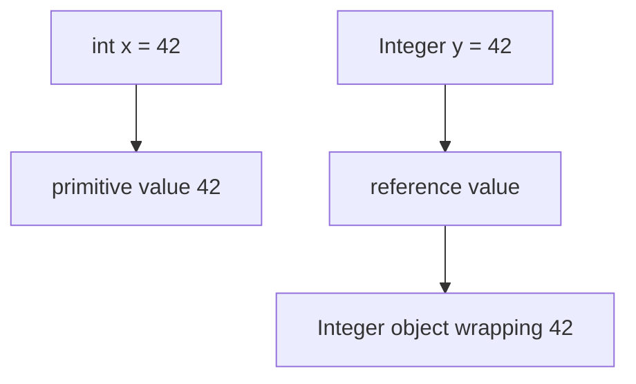
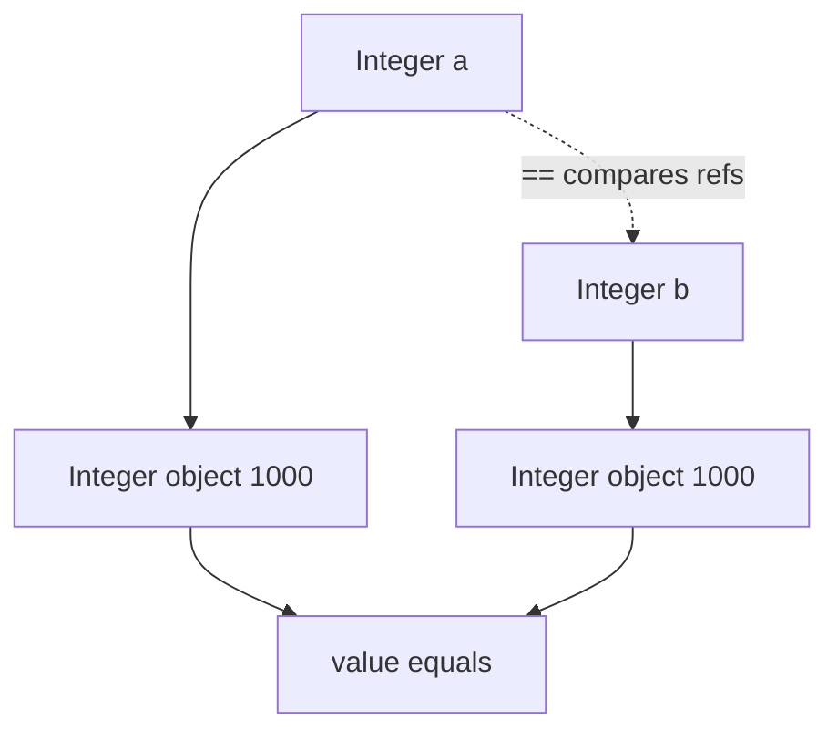
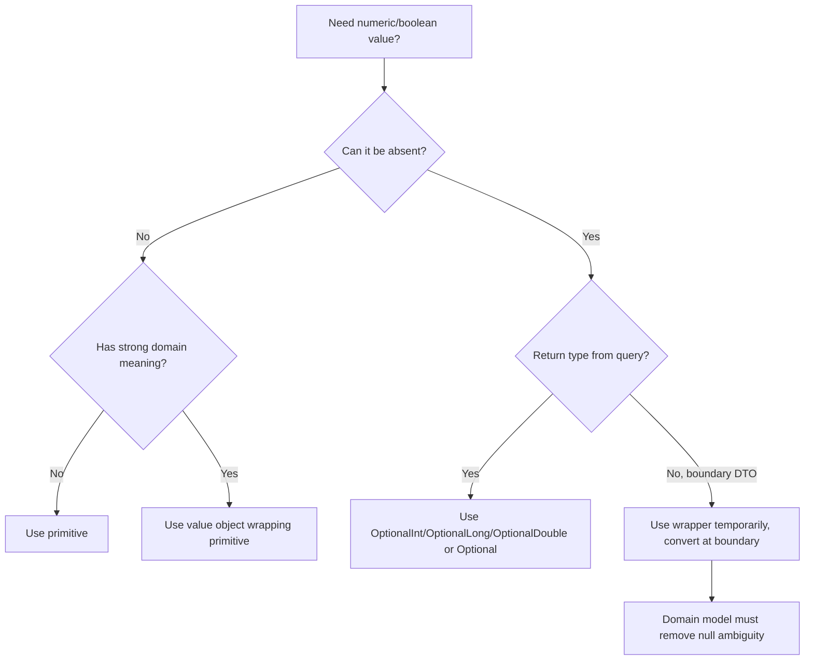

# Part 016 — Boxing, Unboxing & Wrapper Classes

> Target part ini: memahami autoboxing bukan sebagai “fitur convenience” saja, tetapi sebagai conversion mechanism yang mengubah primitive value menjadi object wrapper dan sebaliknya. Salah memahami boxing/unboxing menghasilkan bug identity, NPE tersembunyi, overload surprise, allocation overhead, dan contract yang ambigu antara “0” dan “absent”.

## 1. Mental Model Utama

Java punya primitive types:

```java
int count = 10;
boolean active = true;
double ratio = 0.25;
```

Dan wrapper classes:

```java
Integer count = 10;
Boolean active = true;
Double ratio = 0.25;
```

Primitive value bukan object. Wrapper adalah object.

```text
int       = primitive value
Integer   = reference to object wrapping an int value
```

Diagram:



Autoboxing membuat konversi tampak halus:

```java
Integer x = 42; // boxing
int y = x;      // unboxing
```

Namun secara desain, ini tetap crossing boundary:

```text
primitive world <-> object world
```

## 2. Wrapper Classes

Mapping primitive ke wrapper:

| Primitive | Wrapper |
|---|---|
| `boolean` | `Boolean` |
| `byte` | `Byte` |
| `short` | `Short` |
| `char` | `Character` |
| `int` | `Integer` |
| `long` | `Long` |
| `float` | `Float` |
| `double` | `Double` |
| `void` | `Void` |

Wrapper class berguna untuk:

- collection generic: `List<Integer>`
- nullable representation: `Integer countOrNull`
- reflection API
- method reference dan functional interface tertentu
- parsing/conversion helper: `Integer.parseInt`, `Long.toUnsignedString`
- object-based APIs yang tidak menerima primitive

Tetapi wrapper bukan replacement gratis untuk primitive.

```java
int a = 1;
Integer b = 1;
```

`a` dan `b` punya semantics berbeda:

| Area | Primitive | Wrapper |
|---|---|---|
| Null | Tidak bisa | Bisa `null` |
| Identity | Tidak punya object identity | Punya reference identity |
| Memory | Compact | Object/reference overhead |
| Generic | Tidak bisa langsung | Bisa |
| Equality | `==` value comparison | `==` reference comparison |
| Default field value | `0`, `false`, etc. | `null` |

## 3. Boxing Conversion

Boxing conversion mengubah primitive value menjadi wrapper object.

```java
int primitive = 100;
Integer boxed = primitive;
```

Secara konseptual:

```java
Integer boxed = Integer.valueOf(primitive);
```

Gunakan `valueOf`, bukan constructor wrapper.

```java
Integer good = Integer.valueOf(100);
// Integer bad = new Integer(100); // constructor wrapper lama sudah tidak dianjurkan
```

Autoboxing terjadi di context tertentu, misalnya assignment atau method invocation.

```java
Integer a = 10;
List<Integer> values = new ArrayList<>();
values.add(10);
```

`values.add(10)` membutuhkan `Integer`, sehingga `10` dibox.

## 4. Unboxing Conversion

Unboxing conversion mengubah wrapper menjadi primitive value.

```java
Integer boxed = Integer.valueOf(100);
int primitive = boxed;
```

Secara konseptual:

```java
int primitive = boxed.intValue();
```

Masalah utama: unboxing `null` menghasilkan `NullPointerException`.

```java
Integer maybeCount = null;
int count = maybeCount; // NullPointerException
```

Bug ini sering tersembunyi:

```java
Boolean enabled = config.getFeatureEnabled();

if (enabled) { // unboxing; NPE jika enabled null
    activate();
}
```

Lebih eksplisit:

```java
if (Boolean.TRUE.equals(enabled)) {
    activate();
}
```

Atau desain contract agar null tidak mungkin:

```java
record FeatureConfig(boolean enabled) {}
```

## 5. Wrapper Identity Trap

Jangan pakai `==` untuk membandingkan wrapper value.

```java
Integer a = 1000;
Integer b = 1000;

System.out.println(a == b);      // bisa false
System.out.println(a.equals(b)); // true
```

Kenapa?

`a` dan `b` adalah reference ke object wrapper. `==` pada reference membandingkan identity, bukan numeric value.



Beberapa wrapper value kecil bisa terlihat “aman” karena caching.

```java
Integer x = 127;
Integer y = 127;
System.out.println(x == y); // true pada implementasi umum dan range wajib tertentu

Integer p = 128;
Integer q = 128;
System.out.println(p == q); // sering false
```

Lesson:

```text
Wrapper caching is an implementation/contract detail for efficiency, not a domain equality model.
```

Rule sederhana:

```java
Objects.equals(a, b); // null-safe wrapper equality
```

Untuk numeric comparison, unbox dengan null policy eksplisit.

```java
int left = requireNonNull(a, "a");
int right = requireNonNull(b, "b");
return Integer.compare(left, right);
```

## 6. Boolean Wrapper Trap

`Boolean` sering digunakan untuk tiga state:

```java
Boolean approved;
```

Mungkin artinya:

- `true`: approved
- `false`: rejected
- `null`: not reviewed

Ini valid jika memang tri-state domain, tetapi sering muncul tanpa sengaja karena framework/persistence/JSON.

Kode berbahaya:

```java
if (approved) {
    publish();
}
```

Jika `approved == null`, terjadi NPE.

Lebih jelas dengan enum:

```java
enum ReviewDecision {
    NOT_REVIEWED,
    APPROVED,
    REJECTED
}
```

Atau dengan result type:

```java
record ReviewState(ReviewDecision decision, Instant decidedAt) {}
```

Gunakan `Boolean` hanya jika:

- boundary memang nullable
- null punya arti eksplisit
- semua consumer tahu policy-nya
- conversion ke domain type dilakukan sedini mungkin

## 7. Primitive Default vs Wrapper Default

Field primitive punya default value.

```java
class Metrics {
    int count;       // 0
    boolean enabled; // false
}
```

Wrapper field punya default `null`.

```java
class Metrics {
    Integer count;   // null
    Boolean enabled; // null
}
```

Perbedaan ini mempengaruhi framework binding.

Misalnya JSON request:

```json
{}
```

Jika bind ke:

```java
record Request(int limit) {}
```

Missing `limit` bisa menjadi `0` tergantung framework/constructor binding strategy.

Jika bind ke:

```java
record Request(Integer limit) {}
```

Missing bisa terlihat sebagai `null`, tetapi sekarang setiap usage harus punya null policy.

Desain lebih defensible:

```java
record PageRequest(int limit) {
    PageRequest {
        if (limit < 1 || limit > 100) {
            throw new IllegalArgumentException("limit must be 1..100");
        }
    }
}
```

Atau explicit optional boundary:

```java
record RawPageRequest(Integer limit) {}

record PageRequest(int limit) {
    static PageRequest from(RawPageRequest raw) {
        int resolved = raw.limit() == null ? 50 : raw.limit();
        return new PageRequest(resolved);
    }
}
```

## 8. Boxing Dalam Collections

Generic collections tidak bisa langsung memakai primitive type parameter.

```java
// List<int> invalid
List<Integer> values = new ArrayList<>();
values.add(1); // boxing
int first = values.get(0); // unboxing
```

Ini nyaman tetapi punya cost:

- object allocation atau cached wrapper reuse
- reference indirection
- memory overhead
- null element risk
- unboxing NPE risk
- GC pressure pada workload besar

Untuk data kecil/domain-level, `List<Integer>` baik-baik saja.
Untuk numeric hotspot besar, primitive array sering lebih tepat.

```java
int[] values = new int[size];
```

Untuk stream primitive, gunakan primitive specialization.

```java
IntStream.range(0, 1_000_000).sum();
```

Daripada:

```java
Stream.iterate(0, i -> i + 1)
        .limit(1_000_000)
        .mapToInt(Integer::intValue)
        .sum();
```

## 9. Boxing Dalam Streams

Ada dua keluarga stream:

```java
Stream<Integer> objectStream;
IntStream intStream;
LongStream longStream;
DoubleStream doubleStream;
```

Gunakan primitive stream untuk operasi numeric intensif.

```java
int total = orders.stream()
        .mapToInt(Order::itemCount)
        .sum();
```

Ini lebih tepat daripada:

```java
Integer total = orders.stream()
        .map(Order::itemCount) // Stream<Integer>
        .reduce(0, Integer::sum);
```

Bukan karena setiap boxing pasti buruk, tetapi karena numeric aggregation secara natural primitive.

Boundary umum:

```java
List<Integer> ids = IntStream.rangeClosed(1, 100)
        .boxed()
        .toList();
```

`boxed()` adalah crossing dari primitive stream ke object stream. Gunakan saat memang perlu collection of wrappers.

## 10. Boxing Dalam Overload Resolution

Autoboxing dapat mempengaruhi method overload.

```java
void handle(int value) {
    System.out.println("int");
}

void handle(Integer value) {
    System.out.println("Integer");
}

handle(1); // int
```

Exact primitive match lebih spesifik daripada boxing.

Contoh lain:

```java
void handle(long value) {
    System.out.println("long");
}

void handle(Integer value) {
    System.out.println("Integer");
}

handle(1); // long, widening primitive lebih dipilih daripada boxing
```

Varargs bisa membuat lebih rumit:

```java
void f(Integer value) {}
void f(int... values) {}

f(1); // Integer overload biasanya lebih specific daripada varargs
```

Desain API guideline:

- jangan menyediakan overload primitive dan wrapper kecuali sangat perlu
- jangan gabungkan primitive/wrapper/varargs overload yang ambigu
- gunakan nama method berbeda jika semantics berbeda
- test overload behavior dengan compile-time examples

## 11. Arithmetic Dengan Wrapper

Wrapper dalam arithmetic akan di-unbox.

```java
Integer a = 10;
Integer b = 20;
Integer c = a + b;
```

Konseptual:

```java
Integer c = Integer.valueOf(a.intValue() + b.intValue());
```

Ada unboxing dan boxing lagi.

Jika `a` null:

```java
Integer a = null;
int b = a + 1; // NPE
```

Compound operations juga unbox/box.

```java
Integer count = 0;
count++; // unbox, increment, box
```

Dalam loop panas:

```java
Integer sum = 0;
for (int value : values) {
    sum += value;
}
```

Lebih baik:

```java
int sum = 0;
for (int value : values) {
    sum += value;
}
```

## 12. Wrapper Dalam Map dan Cache Key

Wrapper sering dipakai sebagai key.

```java
Map<Integer, CaseRecord> casesById = new HashMap<>();
```

Ini valid, tetapi perhatikan:

- null key mungkin valid di `HashMap`, tetapi biasanya buruk untuk domain ID
- `Integer` bukan domain type; `CaseId` lebih defensible
- numeric range dan source harus jelas

Lebih baik:

```java
record CaseId(long value) {
    CaseId {
        if (value <= 0) {
            throw new IllegalArgumentException("CaseId must be positive");
        }
    }
}

Map<CaseId, CaseRecord> casesById = new HashMap<>();
```

Boxing menyelesaikan kebutuhan object key, tetapi tidak menyelesaikan semantic correctness.

## 13. Wrapper Equality Dengan Floating Point

`Double` dan `Float` punya semantics khusus karena floating point punya NaN dan signed zero.

```java
Double a = Double.NaN;
Double b = Double.NaN;

System.out.println(a == b);      // reference comparison
System.out.println(a.equals(b)); // true for Double equals semantics
```

Primitive comparison berbeda:

```java
System.out.println(Double.NaN == Double.NaN); // false
```

Signed zero juga harus hati-hati.

```java
Double p = 0.0;
Double n = -0.0;
System.out.println(p.equals(n)); // false
```

Rule:

- jangan gunakan `Double` sebagai domain equality key tanpa memahami NaN/signed zero
- untuk measurement, simpan unit dan precision policy
- untuk money, gunakan `BigDecimal` atau domain money type, bukan `Double`

## 14. Parsing: Wrapper vs Primitive Utility

Wrapper class menyediakan parsing.

```java
int limit = Integer.parseInt("100");      // returns int
Integer boxed = Integer.valueOf("100");   // returns Integer
```

Gunakan `parseXxx` jika butuh primitive.

```java
long id = Long.parseLong(rawId);
```

Gunakan `valueOf` jika butuh wrapper.

```java
Long id = Long.valueOf(rawId);
```

Jangan biarkan `NumberFormatException` bocor sebagai domain error jika input berasal dari user/API.

```java
static CaseId parseCaseId(String raw) {
    try {
        return new CaseId(Long.parseLong(raw));
    } catch (NumberFormatException ex) {
        throw new IllegalArgumentException("caseId must be a valid integer", ex);
    }
}
```

## 15. Optional Primitive Types

Java menyediakan primitive optional untuk beberapa tipe:

```java
OptionalInt maybeInt;
OptionalLong maybeLong;
OptionalDouble maybeDouble;
```

Gunakan saat absence perlu dimodelkan tanpa wrapper null.

```java
OptionalInt score = findScore(userId);
int resolved = score.orElse(0);
```

Namun jangan pakai optional field secara sembarangan untuk domain entity. Optional paling kuat sebagai return type untuk query yang mungkin tidak menemukan hasil.

Contoh baik:

```java
OptionalInt findRetryAfterSeconds(Response response) { ... }
```

Contoh yang perlu dipertimbangkan ulang:

```java
record Policy(OptionalInt maxAttempts) {}
```

Sering lebih jelas:

```java
enum AttemptPolicyKind { UNLIMITED, LIMITED }

record AttemptPolicy(AttemptPolicyKind kind, int maxAttempts) {}
```

Atau:

```java
sealed interface AttemptPolicy permits UnlimitedAttempts, LimitedAttempts {}
record UnlimitedAttempts() implements AttemptPolicy {}
record LimitedAttempts(int maxAttempts) implements AttemptPolicy {}
```

## 16. API Design: Primitive, Wrapper, Optional, atau Value Object?

Gunakan primitive jika:

- value selalu ada
- tidak butuh null
- domain invariant sederhana
- performance/compactness penting

```java
record RetryPolicy(int maxAttempts) {
    RetryPolicy {
        if (maxAttempts < 1) {
            throw new IllegalArgumentException("maxAttempts must be positive");
        }
    }
}
```

Gunakan wrapper jika:

- API/framework membutuhkan object
- generic collection membutuhkan type parameter
- boundary raw data perlu membedakan missing dari explicit value
- null policy dikonversi cepat ke domain type

```java
record RawRequest(Integer limit) {}
```

Gunakan `OptionalInt`/`OptionalLong`/`OptionalDouble` jika:

- method return mungkin absent
- caller harus memilih default/error path
- tidak ingin nullable wrapper

```java
OptionalLong findLastProcessedOffset(StreamId streamId);
```

Gunakan value object jika:

- angka punya arti domain
- ada invariant
- unit penting
- equality harus semantic
- API butuh self-documenting type

```java
record TimeoutMillis(long value) {
    TimeoutMillis {
        if (value < 0) {
            throw new IllegalArgumentException("timeout must not be negative");
        }
    }
}
```

Decision diagram:



## 17. Performance Mental Model

Autoboxing can be optimized by JIT in some contexts, but source-level design must not assume optimization always removes cost.

Boxing can cost:

- allocation
- object header
- reference storage
- pointer chasing
- cache misses
- GC pressure
- unboxing checks

Example:

```java
List<Integer> values = new ArrayList<>();
for (int i = 0; i < 1_000_000; i++) {
    values.add(i); // many boxed Integers
}
```

For hot numeric storage:

```java
int[] values = new int[1_000_000];
for (int i = 0; i < values.length; i++) {
    values[i] = i;
}
```

But do not overfit all domain code to primitive arrays. Maintainability and semantic correctness matter.

Cost model:

```text
Domain correctness first.
Measured hotspot optimization second.
Primitive storage when data volume or loop intensity justifies it.
```

## 18. Boxing Dalam Logging Dan Varargs

Logging API sering menerima `Object...`.

```java
logger.info("processed {} records", count);
```

Jika `count` primitive, ia bisa dibox karena varargs object array membutuhkan `Object`.

Biasanya ini acceptable untuk normal logging, tetapi di hot loop debug-heavy code, cost bisa muncul.

```java
for (int i = 0; i < records.length; i++) {
    logger.debug("record index {}", i); // boxing if executed
}
```

Gunakan level guard jika expensive argument construction terjadi.

```java
if (logger.isDebugEnabled()) {
    logger.debug("record index {} payload {}", i, expensivePayloadSummary(record));
}
```

Boxing integer kecil mungkin bukan bottleneck utama; expensive string/object construction sering lebih besar. Tetap pahami bahwa `Object...` adalah crossing ke object world.

## 19. Concurrency: Wrapper Bukan Mutable Counter

Wrapper immutable.

```java
Integer count = 0;
count++; // creates/reuses another Integer reference conceptually
```

Jangan gunakan wrapper sebagai mutable shared counter.

```java
class Counter {
    Integer value = 0;

    void increment() {
        value++; // not atomic
    }
}
```

Gunakan primitive dengan synchronization jika sesuai:

```java
class Counter {
    private int value;

    synchronized void increment() {
        value++;
    }
}
```

Atau concurrency primitive:

```java
AtomicInteger counter = new AtomicInteger();
counter.incrementAndGet();
```

Untuk high-contention metrics:

```java
LongAdder adder = new LongAdder();
adder.increment();
```

Wrapper membantu representasi object, bukan atomicity.

## 20. Boundary Anti-Patterns

### 20.1 Nullable Wrapper Dalam Domain Core

```java
record CasePolicy(Integer escalationDays) {}
```

Masalah:

- null berarti apa?
- unlimited?
- default?
- missing config?
- not applicable?

Lebih baik:

```java
sealed interface EscalationPolicy permits NoEscalation, TimedEscalation {}
record NoEscalation() implements EscalationPolicy {}
record TimedEscalation(int days) implements EscalationPolicy {
    TimedEscalation {
        if (days < 1) {
            throw new IllegalArgumentException("days must be positive");
        }
    }
}
```

### 20.2 Wrapper `==`

```java
if (caseId == otherCaseId) { ... }
```

Jika `caseId` adalah `Long`, ini reference comparison.

Fix:

```java
if (Objects.equals(caseId, otherCaseId)) { ... }
```

Lebih baik:

```java
record CaseId(long value) {}
```

### 20.3 Accidental NPE In Condition

```java
Boolean allowed = permissionService.isAllowed(user, action);
if (allowed) { ... }
```

Fix:

```java
if (Boolean.TRUE.equals(allowed)) { ... }
```

Lebih baik ubah service contract:

```java
enum AuthorizationDecision { ALLOW, DENY, INDETERMINATE }
```

### 20.4 Hot Loop Boxing

```java
Integer total = 0;
for (Order order : orders) {
    total += order.amountInCents();
}
```

Fix:

```java
long total = 0;
for (Order order : orders) {
    total += order.amountInCents();
}
```

Lebih baik domain:

```java
record MoneyCents(long value) {}
```

## 21. Testing Boxing Bugs

Tambahkan test untuk boundary null.

```java
@Test
void nullBooleanDoesNotMeanFalseSilently() {
    Boolean enabled = null;
    assertThrows(NullPointerException.class, () -> {
        if (enabled) {
            throw new AssertionError();
        }
    });
}
```

Test wrapper equality.

```java
@Test
void wrapperIdentityIsNotValueEquality() {
    Integer a = 1000;
    Integer b = 1000;

    assertNotSame(a, b);
    assertEquals(a, b);
}
```

Test mapper/default semantics.

```java
@Test
void rawLimitMissingResolvesToDefault() {
    RawPageRequest raw = new RawPageRequest(null);
    PageRequest request = PageRequest.from(raw);
    assertEquals(50, request.limit());
}
```

## 22. Review Checklist

### Primitive vs Wrapper

- Apakah value bisa absent?
- Jika absent, apakah null policy eksplisit?
- Apakah primitive default `0/false` bisa menyembunyikan missing input?
- Apakah wrapper default `null` bisa menghasilkan NPE?

### Equality

- Apakah ada `==` pada wrapper?
- Apakah `Objects.equals` lebih tepat?
- Apakah floating wrapper dipakai sebagai key?
- Apakah domain ID masih `Long/Integer`, bukan value object?

### Performance

- Apakah boxing terjadi di hot loop?
- Apakah `List<Integer>` dipakai untuk jutaan angka?
- Apakah stream object bisa diganti primitive stream?
- Apakah logging varargs di hot path menghasilkan boxing/array allocation?

### API Surface

- Apakah overload primitive/wrapper membingungkan?
- Apakah nullable wrapper bocor dari DTO ke domain core?
- Apakah `OptionalInt` lebih tepat untuk return absence?
- Apakah value object lebih tepat daripada primitive/wrapper?

### Boundary

- Apakah JSON missing vs explicit null vs zero dibedakan?
- Apakah database nullable column dipetakan ke domain type dengan jelas?
- Apakah default value diterapkan di satu boundary, bukan tersebar?
- Apakah validation terjadi sebelum unboxing?

## 23. Latihan Deliberate Practice

### Latihan 1 — Predict Output

```java
Integer a = 127;
Integer b = 127;
Integer c = 128;
Integer d = 128;

System.out.println(a == b);
System.out.println(c == d);
System.out.println(c.equals(d));
```

Expected reasoning:

- `a == b` sering/wajib true untuk cached small values sesuai range tertentu
- `c == d` jangan diasumsikan true
- `c.equals(d)` true

Rule yang harus dibawa:

```text
Never use wrapper identity as domain equality.
```

### Latihan 2 — Remove Nullable Boolean

Kode awal:

```java
record Review(Boolean approved) {}
```

Refactor menjadi:

```java
enum ReviewDecision {
    NOT_REVIEWED,
    APPROVED,
    REJECTED
}

record Review(ReviewDecision decision) {
    Review {
        Objects.requireNonNull(decision, "decision");
    }
}
```

### Latihan 3 — DTO Boundary Conversion

Raw request:

```java
record RawSearchRequest(Integer limit, Integer offset) {}
```

Domain request:

```java
record SearchRequest(int limit, int offset) {
    SearchRequest {
        if (limit < 1 || limit > 100) {
            throw new IllegalArgumentException("limit must be 1..100");
        }
        if (offset < 0) {
            throw new IllegalArgumentException("offset must not be negative");
        }
    }

    static SearchRequest from(RawSearchRequest raw) {
        int limit = raw.limit() == null ? 20 : raw.limit();
        int offset = raw.offset() == null ? 0 : raw.offset();
        return new SearchRequest(limit, offset);
    }
}
```

Tambahkan test untuk:

- missing limit
- explicit limit 0
- explicit null offset
- negative offset

### Latihan 4 — Replace Hot Loop Boxing

Kode awal:

```java
Integer total = 0;
for (int amount : amounts) {
    total += amount;
}
```

Refactor:

```java
int total = 0;
for (int amount : amounts) {
    total += amount;
}
```

Kemudian pertimbangkan overflow:

```java
long total = 0;
for (int amount : amounts) {
    total += amount;
}
```

Atau:

```java
int total = 0;
for (int amount : amounts) {
    total = Math.addExact(total, amount);
}
```

## 24. Mini Capstone: Type-Safe Pagination

Problem:

API menerima query parameter:

```text
limit: optional integer
page: optional integer
```

Requirement:

- default `limit = 50`
- max `limit = 200`
- default `page = 1`
- page minimal 1
- domain core tidak boleh menerima nullable wrapper

DTO:

```java
record RawPagination(Integer limit, Integer page) {}
```

Domain:

```java
record PageNumber(int value) {
    PageNumber {
        if (value < 1) {
            throw new IllegalArgumentException("page must be >= 1");
        }
    }
}

record PageLimit(int value) {
    private static final int MAX = 200;

    PageLimit {
        if (value < 1 || value > MAX) {
            throw new IllegalArgumentException("limit must be 1.." + MAX);
        }
    }
}

record Pagination(PageLimit limit, PageNumber page) {
    static Pagination from(RawPagination raw) {
        Objects.requireNonNull(raw, "raw");
        int limit = raw.limit() == null ? 50 : raw.limit();
        int page = raw.page() == null ? 1 : raw.page();
        return new Pagination(new PageLimit(limit), new PageNumber(page));
    }
}
```

Mengapa ini lebih kuat?

- wrapper hanya hidup di boundary DTO
- default policy terpusat
- domain type tidak nullable
- `PageLimit` dan `PageNumber` tidak bisa tertukar dengan mudah
- validation terjadi sebelum business logic

## 25. Ringkasan

Boxing/unboxing membuat Java nyaman menghubungkan primitive dan object world, tetapi convenience ini punya harga semantik.

Prinsip utama:

1. Primitive value bukan object.
2. Wrapper adalah reference type dan bisa `null`.
3. Boxing mengubah primitive menjadi wrapper.
4. Unboxing wrapper `null` menghasilkan NPE.
5. `==` pada wrapper membandingkan reference identity.
6. Wrapper caching tidak boleh dijadikan equality model.
7. Collections generic memakai wrapper, bukan primitive.
8. Numeric hot path perlu memperhatikan boxing cost.
9. Nullable wrapper harus dibatasi di boundary dan dikonversi ke domain type.
10. Value object sering lebih kuat daripada primitive/wrapper telanjang.

> Top 1% engineer tidak hanya tahu bahwa `Integer` membungkus `int`. Mereka tahu kapan wrapper memperjelas boundary, kapan wrapper mencemari domain, kapan unboxing bisa meledak, dan kapan primitive/value object adalah model yang lebih defensible.

## 26. Referensi Resmi

- Java Language Specification, Java SE 25, §5.1.7 Boxing Conversion
- Java Language Specification, Java SE 25, §5.1.8 Unboxing Conversion
- Java Language Specification, Java SE 25, Chapter 5: Conversions and Contexts
- Java SE 25 API: `java.lang` package summary and wrapper classes
- Java SE 25 API: `java.util.OptionalInt`, `OptionalLong`, `OptionalDouble`
