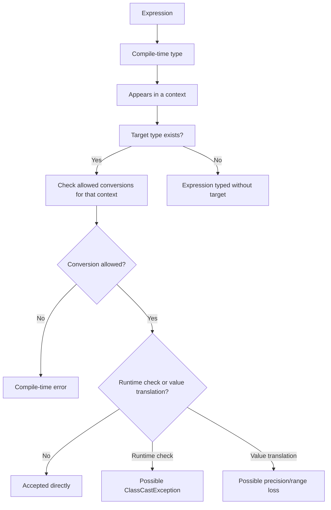
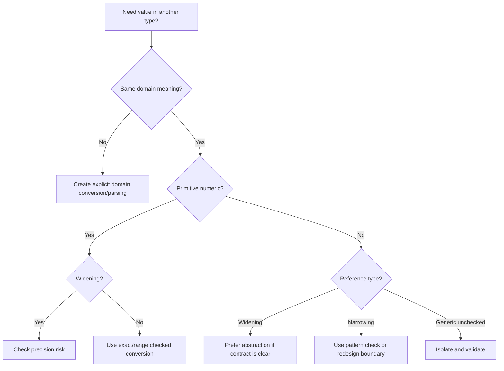

# Part 017 — Conversions, Contexts & Casting Rules

> Target part ini: memahami aturan konversi Java sebagai sistem constraint, bukan sekadar “cast kalau error”. Engineer senior harus bisa membaca ekspresi Java dan langsung tahu: tipe compile-time-nya apa, target type-nya apa, context-nya apa, konversi apa yang diizinkan, apakah ada runtime check, apakah data bisa hilang, dan apakah API sedang menyembunyikan desain yang lemah.

## 1. Mental Model Utama

Setiap ekspresi Java punya tipe compile-time.

```java
int x = 10;
long y = x;
```

Ekspresi `x` bertipe `int`. Variable `y` bertipe `long`. Karena ekspresi `int` muncul di assignment context dengan target type `long`, Java memperbolehkan widening primitive conversion.

Modelnya:

```text
expression type -> target type -> context -> allowed conversion -> compile-time/runtime effect
```

Diagram:



Konversi di Java bukan berarti semua hal bisa berubah menjadi semua hal lain. Konversi selalu dibatasi oleh context.

Contoh:

```java
long a = 10;       // OK: int literal assignment conversion to long
byte b = 10;       // OK: constant narrowing allowed in assignment context
byte c = (byte) a; // OK only because explicit cast is present
```

Salah satu skill penting adalah membedakan tiga pertanyaan:

1. Apakah source type dan target type kompatibel?
2. Apakah context ini mengizinkan conversion tersebut?
3. Apakah conversion itu aman secara domain?

Java hanya menjawab 1 dan 2 secara formal. Engineer harus menjawab 3.

## 2. Kenapa Ini Penting di Engineering Nyata

Conversion bug biasanya tidak terlihat sebagai syntax problem. Ia muncul sebagai:

- jumlah uang berubah karena `double` ke `long`;
- ID 64-bit terpotong saat masuk sistem lama yang memakai `int`;
- `Boolean` null meledak karena unboxing;
- overload yang dipilih bukan method yang developer kira;
- cast generic terlihat valid tetapi menghasilkan warning yang diabaikan;
- JSON number masuk sebagai `Integer`, `Long`, `Double`, atau `BigDecimal` tergantung parser;
- API publik menerima `Object`, lalu menunda type error ke runtime.

Dalam sistem enterprise, conversion adalah salah satu titik rawan boundary.

```text
HTTP/JSON -> DTO -> domain model -> persistence -> event -> consumer
```

Di setiap panah ada potensi konversi.

## 3. Kategori Konversi Java

| Conversion | Makna Praktis | Risk Utama |
|---|---|---|
| Identity conversion | Tipe tetap sama | Biasanya tidak berisiko |
| Widening primitive | Primitive ke primitive yang lebih luas | Bisa kehilangan precision pada integral ke floating |
| Narrowing primitive | Primitive ke primitive yang lebih sempit | Bisa kehilangan range, precision, sign |
| Widening reference | Subtype ke supertype | Kehilangan akses compile-time ke API subtype |
| Narrowing reference | Supertype/interface ke subtype | Runtime check, `ClassCastException` |
| Boxing | Primitive ke wrapper | Allocation/identity/nullability model berubah |
| Unboxing | Wrapper ke primitive | `NullPointerException` jika wrapper null |
| Unchecked conversion | Raw/parameterized generic boundary | Heap pollution, warning yang tidak boleh diabaikan |
| Capture conversion | Wildcard generic internal typing | Kompleksitas generic API |
| String conversion | Value ke `String` dalam string context | Diagnostic vs serialization confusion |
| Forbidden conversion | Tidak diizinkan | Compile-time error |

Mental model sederhananya:

```text
widening  = usually easier, often implicit
narrowing = dangerous, usually explicit
boxing    = primitive enters object world
unboxing  = object value extracted into primitive world
reference cast = static promise with possible runtime verification
```

## 4. Conversion Contexts

Konversi tidak terjadi di ruang hampa. Java memiliki beberapa context utama.

| Context | Contoh | Karakter |
|---|---|---|
| Assignment context | `long x = intValue;` | Binding expression ke variable |
| Strict invocation context | `m(intValue)` saat memilih method tanpa boxing/varargs | Method/constructor argument yang cocok melalui identity/widening |
| Loose invocation context | `m(Integer.valueOf(1))` atau `m(1)` ke wrapper | Invocation yang memperbolehkan boxing/unboxing setelah strict gagal |
| String context | `"x=" + value` | Mengubah operand ke `String` |
| Casting context | `(Target) expr` | Explicit conversion, paling luas tapi berisiko |
| Numeric context | `a + b`, `-x`, `~x` | Numeric promotion |
| Testing context | `obj instanceof String s` | Pattern compatibility/checking |

Kunci: context menentukan konversi mana yang boleh terjadi secara implisit.

## 5. Assignment Conversion

Assignment conversion terjadi saat value expression dibind ke variable, field, array component, atau parameter-like target lain.

```java
int i = 10;
long l = i;       // widening primitive
Object o = "abc"; // widening reference
Integer n = i;    // boxing
```

Assignment context cukup permisif, tetapi tetap tidak sembarang.

```java
int i = 10;
Long x = i; // compile-time error
```

Kenapa?

`int` tidak otomatis menjadi `long`, lalu diboxing menjadi `Long` dalam assignment. Java tidak mengizinkan chain `widening primitive -> boxing` untuk menghasilkan wrapper berbeda.

Yang valid:

```java
Long a = 10L;       // long literal -> boxing to Long
long b = 10;        // int literal -> widening to long
Number c = 10;      // int -> Integer -> Number? allowed by boxing then widening reference
Object d = 10;      // int -> Integer -> Object
```

### 5.1 Constant Narrowing in Assignment

Java memperbolehkan narrowing untuk constant expression tertentu jika nilainya representable.

```java
byte b1 = 100;       // OK
short s1 = 1000;     // OK
char c1 = 65;        // OK

byte b2 = 128;       // compile-time error
```

Tapi ini hanya untuk constant expression.

```java
int x = 100;
byte b = x;          // compile-time error
byte c = (byte) x;   // explicit cast
```

Jangan salah tafsir: `byte b = 100;` bukan bukti bahwa `int` bebas masuk ke `byte`. Itu special rule untuk constant expression.

## 6. Widening Primitive Conversion

Widening primitive conversion sering dianggap “safe”. Ini tidak selalu benar.

```java
int i = 1_234_567_890;
float f = i;
System.out.println(i);
System.out.println((int) f);
```

`int -> float` adalah widening primitive conversion, tetapi bisa kehilangan precision.

Rule penting:

| From | To | Catatan |
|---|---|---|
| `byte` | `short`, `int`, `long`, `float`, `double` | Magnitude preserved, floating biasanya cukup |
| `short` | `int`, `long`, `float`, `double` | Mirip byte |
| `char` | `int`, `long`, `float`, `double` | Zero extension |
| `int` | `long`, `float`, `double` | `int -> float` bisa kehilangan precision |
| `long` | `float`, `double` | Bisa kehilangan precision |
| `float` | `double` | Value set lebih luas, tapi bukan decimal exactness |

Guideline:

```text
widening primitive preserves compile-time legality, not always business exactness
```

Untuk ID, counter, money minor unit, dan sequence number, jangan asal widen ke floating type.

## 7. Narrowing Primitive Conversion

Narrowing primitive conversion biasanya butuh explicit cast.

```java
long l = 1_000_000_000_000L;
int i = (int) l;
```

Cast membuat compiler diam, bukan membuat data aman.

Contoh kehilangan data:

```java
int x = 255;
byte b = (byte) x;
System.out.println(b); // -1
```

Floating ke integral lebih berbahaya:

```java
System.out.println((int) 12.9);          // 12
System.out.println((int) -12.9);         // -12
System.out.println((int) Double.NaN);    // 0
System.out.println((int) Double.POSITIVE_INFINITY); // 2147483647
```

Prinsip:

```text
cast is not validation
cast is not rounding policy
cast is not overflow protection
```

Jika conversion adalah business decision, buat policy eksplisit.

```java
static int toIntExact(long value) {
    return Math.toIntExact(value);
}
```

Untuk floating rounding:

```java
static long toMinorUnits(BigDecimal amount) {
    return amount.movePointRight(2)
            .setScale(0, RoundingMode.HALF_UP)
            .longValueExact();
}
```

## 8. Widening Reference Conversion

Widening reference conversion terjadi saat subtype diperlakukan sebagai supertype.

```java
String s = "abc";
CharSequence cs = s;
Object o = s;
```

Tidak ada runtime check khusus karena compiler bisa membuktikan bahwa semua `String` adalah `CharSequence` dan `Object`.

Kelebihan:

- API lebih abstrak;
- coupling turun;
- testability naik;
- implementation bisa diganti.

Risiko:

- kehilangan operasi spesifik subtype;
- object tetap mutable jika subtype mutable;
- abstraction terlalu luas bisa menyembunyikan invariant.

Contoh boundary yang baik:

```java
void render(CharSequence text) {
    // can accept String, StringBuilder, etc.
}
```

Contoh boundary yang terlalu lebar:

```java
void process(Object input) {
    // type error delayed to runtime
}
```

## 9. Narrowing Reference Conversion

Narrowing reference conversion adalah cast dari type yang lebih umum ke type yang lebih spesifik.

```java
Object o = "abc";
String s = (String) o;
```

Ini runtime check. Jika gagal:

```java
Object o = 123;
String s = (String) o; // ClassCastException
```

Narrowing reference conversion berarti developer membuat klaim:

```text
I know more than the static type currently says.
```

Di codebase enterprise, klaim seperti ini harus jarang, lokal, dan mudah diaudit.

### 9.1 Prefer Pattern Matching for instanceof

Daripada:

```java
if (input instanceof String) {
    String s = (String) input;
    return s.trim();
}
```

Gunakan:

```java
if (input instanceof String s) {
    return s.trim();
}
```

Ini mengurangi double mention dan risiko cast salah.

### 9.2 Cast Tidak Memperbaiki Desain Boundary

Bad smell:

```java
void handle(Object event) {
    if (event instanceof CaseClosedEvent e) {
        handleClosed(e);
    } else if (event instanceof CaseEscalatedEvent e) {
        handleEscalated(e);
    }
}
```

Lebih baik jika domain mengizinkan:

```java
sealed interface CaseEvent permits CaseClosedEvent, CaseEscalatedEvent {}

record CaseClosedEvent(String caseId) implements CaseEvent {}
record CaseEscalatedEvent(String caseId, String reason) implements CaseEvent {}
```

Kemudian boundary bisa memakai polymorphism, visitor, pattern matching switch, atau dispatcher yang typed.

## 10. Boxing and Unboxing in Conversion Contexts

Boxing:

```java
Integer x = 10;
```

Unboxing:

```java
Integer x = 10;
int y = x;
```

NPE tersembunyi:

```java
Integer maybeCount = null;
int count = maybeCount; // NullPointerException
```

Autoboxing tampak seperti syntactic sugar, tetapi ia mengubah model:

```text
primitive value <-> nullable object reference
```

### 10.1 Boxing Followed by Widening Reference

Ini valid:

```java
Object o = 10;   // int -> Integer -> Object
Number n = 10;   // int -> Integer -> Number
```

Tapi ini tidak valid:

```java
Long l = 10;     // int cannot box to Long
```

`10` bertipe `int`. Boxing-nya adalah `Integer`, bukan `Long`.

Yang valid:

```java
Long l = 10L;
```

### 10.2 Unboxing Followed by Widening Primitive

Ini valid:

```java
Integer i = 10;
long l = i; // Integer -> int -> long
```

Tetapi hati-hati dengan null:

```java
Integer i = null;
long l = i; // NPE before widening
```

## 11. String Conversion

String conversion sering muncul dalam concatenation.

```java
int count = 3;
String message = "count=" + count;
```

Aturannya nyaman, tetapi jangan samakan dengan serialization policy.

```java
Instant now = Instant.now();
String audit = "at=" + now;
```

Untuk log diagnostic, ini biasanya cukup. Untuk API contract, gunakan formatter/serializer eksplisit.

Bad API contract:

```java
String dueDate = "" + localDate;
```

Better:

```java
String dueDate = localDate.format(DateTimeFormatter.ISO_LOCAL_DATE);
```

String conversion juga bisa memanggil `toString()` object. Ini berarti:

- jangan masukkan PII ke `toString()`;
- jangan gunakan `toString()` untuk stable persistence format kecuali memang dikontrak;
- jangan rely pada `Object.toString()` default untuk business semantics.

## 12. Unchecked Conversion and Generic Boundaries

Unchecked conversion biasanya muncul saat raw type bertemu parameterized type.

```java
List raw = new ArrayList();
raw.add("abc");

List<Integer> numbers = raw; // unchecked warning
Integer n = numbers.get(0);  // ClassCastException later
```

Warning ini bukan noise. Ia menunjukkan compiler tidak bisa membuktikan type safety.

Guideline:

```text
@SuppressWarnings("unchecked") boleh hanya di boundary kecil, dengan validasi/isolasi jelas.
```

Contoh lebih baik:

```java
static List<String> stringsOnly(List<?> input) {
    List<String> result = new ArrayList<>();
    for (Object item : input) {
        if (!(item instanceof String s)) {
            throw new IllegalArgumentException("Expected only strings");
        }
        result.add(s);
    }
    return List.copyOf(result);
}
```

## 13. Capture Conversion

Capture conversion adalah mekanisme compiler untuk menangani wildcard.

```java
void reverse(List<?> list) {
    reverseCaptured(list);
}

private <T> void reverseCaptured(List<T> list) {
    Collections.reverse(list);
}
```

Engineer tidak biasanya “memanggil” capture conversion secara sadar, tetapi harus paham gejalanya:

```java
void broken(List<?> list) {
    Object first = list.get(0); // OK
    // list.set(0, first);      // compile-time error
}
```

`List<?>` artinya list dari some unknown type. Compiler tidak boleh menerima `Object` dimasukkan ke list tersebut karena element type aslinya bisa `String`, `Integer`, atau type lain.

## 14. Testing Contexts and Pattern Compatibility

Testing context muncul di pattern matching.

```java
if (input instanceof String s) {
    System.out.println(s.length());
}
```

Ini bukan assignment biasa dan bukan cast biasa. Pattern harus compatible dengan expression yang diuji.

Pattern matching membuat narrowing lebih aman karena:

- check dan binding berada dalam satu operasi;
- variable pattern hanya hidup di scope yang aman;
- compiler bisa melakukan flow-sensitive analysis.

Contoh:

```java
static String describe(Object value) {
    if (value instanceof Integer i && i > 0) {
        return "positive int";
    }
    if (value instanceof String s && !s.isBlank()) {
        return "non-blank string";
    }
    return "other";
}
```

## 15. Casting Contexts

Casting context lebih luas daripada assignment/invocation context, tetapi bukan bebas risiko.

```java
int x = (int) 10L;
String s = (String) object;
List<String> names = (List<String>) raw;
```

Tiga jenis risk:

| Cast | Compile-Time | Runtime |
|---|---|---|
| Primitive narrowing | Diizinkan eksplisit | Data bisa berubah tanpa exception |
| Reference narrowing | Diizinkan jika plausible | Bisa `ClassCastException` |
| Unchecked generic cast | Warning | Bisa gagal jauh setelah cast |

### 15.1 Cast as Documentation

Kadang cast dipakai untuk memperjelas overload atau numeric intent.

```java
double ratio = (double) completed / total;
```

Ini cast yang masuk akal karena menjelaskan numeric policy.

Bandingkan dengan:

```java
int count = (int) repository.count();
```

Ini mencurigakan jika `repository.count()` mengembalikan `long`. Apakah count memang pasti muat dalam `int`? Jika iya, gunakan `Math.toIntExact`.

```java
int count = Math.toIntExact(repository.count());
```

## 16. Conversion Matrix Praktis

| Source | Target | Biasanya Implicit? | Catatan |
|---|---:|---:|---|
| `byte` | `int` | Yes | Widening |
| `int` | `byte` | No | Cast atau constant narrowing |
| `int` | `long` | Yes | Safe range-wise |
| `long` | `int` | No | Gunakan `Math.toIntExact` jika harus safe |
| `int` | `float` | Yes | Bisa kehilangan precision |
| `long` | `double` | Yes | Bisa kehilangan precision |
| `double` | `int` | No | Round toward zero, NaN jadi 0 |
| `int` | `Integer` | Yes | Boxing |
| `Integer` | `int` | Yes | Unboxing, NPE jika null |
| `int` | `Object` | Yes | Boxing lalu widening reference |
| `int` | `Long` | No | Tidak ada int -> long -> Long otomatis |
| `String` | `Object` | Yes | Widening reference |
| `Object` | `String` | No | Cast/pattern check |
| `List` | `List<String>` | Warning | Unchecked conversion |
| `String` | `int` | No | Parsing bukan conversion bahasa |

## 17. Parsing Bukan Conversion Bahasa

Ini penting untuk boundary eksternal.

```java
int x = Integer.parseInt("123");
UUID id = UUID.fromString("...");
LocalDate date = LocalDate.parse("2026-06-30");
```

Parsing adalah library operation, bukan language conversion. Ia bisa gagal, punya policy, format, locale, timezone, dan error handling.

Jangan menyamakan:

```text
conversion = compile-time language rule
parsing    = runtime interpretation of external representation
```

## 18. Serialization Boundary Bukan Conversion Context

JSON mapper, JDBC driver, message broker serializer, dan ORM punya aturan sendiri.

```java
record Request(long caseId, BigDecimal amount, Instant submittedAt) {}
```

Ketika payload JSON masuk, Java language conversion tidak langsung bekerja. Yang bekerja adalah deserializer.

Risiko:

- JSON number terlalu besar untuk `long`;
- decimal dibaca sebagai `double`;
- timestamp tanpa timezone dibaca sebagai local time;
- enum string tidak dikenal;
- absent field jadi default/null;
- nullable wrapper di-unbox di domain layer.

Boundary harus punya validasi eksplisit.

```java
record CreatePaymentRequest(
    String amount,
    String currency,
    String submittedAt
) {}
```

Kemudian parse ke domain type dengan policy yang jelas.

## 19. Failure Modes

### 19.1 Silent Truncation

```java
long externalId = 9_000_000_000L;
int internalId = (int) externalId;
```

Bug: ID berubah, data link rusak, audit trail tidak cocok.

Mitigation:

```java
int internalId = Math.toIntExact(externalId);
```

### 19.2 Unboxing Null

```java
Boolean approved = dto.approved();
if (approved) {
    // NPE if approved is null
}
```

Mitigation:

```java
if (Boolean.TRUE.equals(approved)) {
    // explicit three-state handling
}
```

Atau modelkan state:

```java
enum ApprovalState {
    APPROVED, REJECTED, NOT_REVIEWED
}
```

### 19.3 Wrong Reference Cast

```java
CaseEvent event = loadEvent();
CaseClosedEvent closed = (CaseClosedEvent) event;
```

Mitigation:

```java
if (event instanceof CaseClosedEvent closed) {
    handle(closed);
} else {
    throw new IllegalStateException("Expected closed event but got " + event.getClass().getName());
}
```

### 19.4 Generic Heap Pollution

```java
List raw = List.of("a");
List<Integer> ints = raw;
Integer first = ints.get(0);
```

Mitigation: isolate raw boundary and validate elements.

### 19.5 String Conversion as Contract

```java
String exported = "" + amount;
```

Mitigation: use explicit formatter/serializer with tests.

## 20. Enterprise API Design Rules

### Rule 1: Do Not Accept `Object` Unless You Are Building Infrastructure

Bad:

```java
void submit(Object command) {}
```

Better:

```java
void submit(CreateCaseCommand command) {}
```

If multiple command types are valid:

```java
sealed interface CaseCommand permits CreateCaseCommand, EscalateCaseCommand {}
```

### Rule 2: Use Explicit Conversion Methods at Boundaries

```java
final class CaseId {
    private final long value;

    private CaseId(long value) {
        if (value <= 0) throw new IllegalArgumentException("caseId must be positive");
        this.value = value;
    }

    static CaseId of(long value) {
        return new CaseId(value);
    }

    long asLong() {
        return value;
    }
}
```

### Rule 3: Prefer Exact Methods for Risky Numeric Narrowing

```java
int size = Math.toIntExact(count);
```

### Rule 4: Treat Warning as Design Feedback

Unchecked warnings should be rare and isolated.

```java
@SuppressWarnings("unchecked")
private static <T> List<T> trustedCastList(Object value, Class<T> elementType) {
    if (!(value instanceof List<?> list)) {
        throw new IllegalArgumentException("Expected list");
    }

    for (Object element : list) {
        if (!elementType.isInstance(element)) {
            throw new IllegalArgumentException("Unexpected element type");
        }
    }

    return (List<T>) list;
}
```

Even here, the suppression is localized and defended.

### Rule 5: Do Not Use Cast to Hide an Invariant Problem

Bad:

```java
int age = (int) request.age();
```

Better:

```java
Age age = Age.of(request.age());
```

Where `Age.of` validates range, unit, and domain meaning.

## 21. Conversion Review Checklist

Saat review code, tanyakan:

- Apakah conversion ini implicit atau explicit?
- Apakah conversion ini terjadi karena assignment, invocation, cast, numeric operator, string concat, atau pattern?
- Apakah ada narrowing primitive?
- Apakah ada conversion integral ke floating?
- Apakah ada unboxing dari nullable wrapper?
- Apakah ada cast reference dari `Object`, raw type, atau interface luas?
- Apakah warning generic diabaikan?
- Apakah `toString()` dipakai sebagai contract, bukan diagnostic?
- Apakah parsing external string diperlakukan seperti conversion internal?
- Apakah boundary punya validation dan error model?
- Apakah conversion seharusnya menjadi method domain eksplisit?

## 22. Latihan 20 Menit

### Latihan 1 — Prediksi Compile-Time vs Runtime

Tentukan mana yang compile, mana yang gagal compile, mana yang compile tapi runtime risk.

```java
int i = 10;
long l = i;
float f = l;
Long boxedLong = i;
Object o = i;
Integer boxedInt = null;
int n = boxedInt;
String s = (String) o;
```

Expected reasoning:

```text
long l = i;          OK, widening primitive
float f = l;         OK, widening primitive, precision risk
Long boxedLong = i;  compile-time error
Object o = i;        boxing + widening reference
int n = boxedInt;    compile OK, runtime NPE
String s = (String)o compile OK, runtime ClassCastException because o is Integer
```

### Latihan 2 — Replace Cast with Domain Conversion

Refactor:

```java
record PaymentRequest(long amountInCents) {}

int amount = (int) request.amountInCents();
```

Menjadi:

```java
int amount = Math.toIntExact(request.amountInCents());
```

Lalu diskusikan: apakah `int` memang tipe domain yang tepat? Jika amount bisa besar, mungkin `long` atau `BigDecimal` lebih benar.

### Latihan 3 — Isolate Unchecked Conversion

Ambil code ini:

```java
List raw = load();
List<String> names = raw;
```

Ubah menjadi function boundary yang memvalidasi setiap element.

## 23. Mini Decision Tree



## 24. Ringkasan

Java conversion system adalah gabungan dari type safety, convenience, dan historical compatibility. Banyak konversi dibuat nyaman agar kode tidak terlalu verbose, tetapi kenyamanan itu bisa menyembunyikan risiko domain.

Pegangan utama:

```text
implicit conversion answers: is this legal Java?
explicit domain conversion answers: is this correct for this business meaning?
```

Engineer top-tier tidak hanya bertanya “apakah compiler menerima ini?”, tetapi “apakah conversion ini mempertahankan invariant, precision, range, identity, nullability, dan contract lintas boundary?”

## 25. Referensi Resmi

- Java Language Specification, Java SE 25 — Chapter 5: Conversions and Contexts.
- Java Language Specification, Java SE 25 — Chapter 15: Expressions.
- Java Platform API Documentation, Java SE 25 — `java.lang`, wrapper classes, and object contracts.
