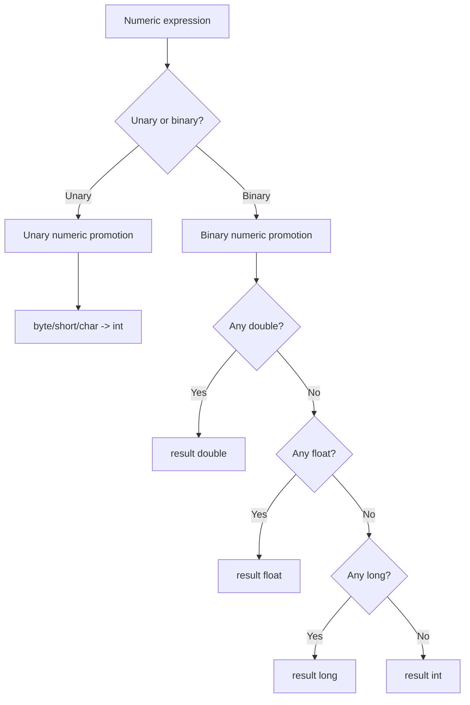
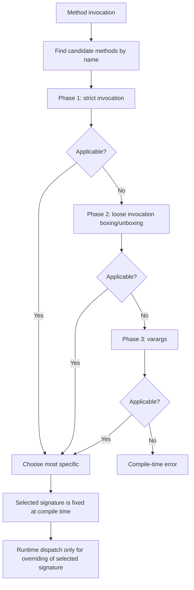
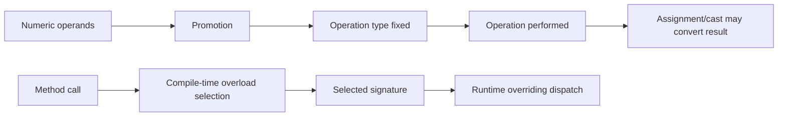

# Part 018 — Numeric Promotion, Overload Resolution & Surprising Expressions

> Target part ini: memahami bagaimana Java menentukan tipe hasil ekspresi numerik dan method overload yang dipanggil. Banyak bug Java tidak muncul karena developer tidak tahu operator `+`, tetapi karena ia salah menebak tipe hasil `byte + byte`, `int / int`, `char + int`, `long * int`, conditional expression, compound assignment, atau overload antara primitive, wrapper, varargs, dan reference type.

## 1. Mental Model Utama

Java arithmetic tidak selalu menghasilkan tipe operand yang terlihat di source code.

```java
byte a = 1;
byte b = 2;
// byte c = a + b; // compile-time error
int c = a + b;     // result is int
```

Kenapa? Karena binary numeric promotion.

Rule praktis:

```text
small integral types do arithmetic as int
```

Tipe `byte`, `short`, dan `char` sering dipromosikan ke `int` sebelum operasi.

Diagram:



## 2. Numeric Context

Numeric promotion terjadi dalam numeric context, misalnya:

- unary operators: `+x`, `-x`, `~x`;
- binary arithmetic: `a + b`, `a - b`, `a * b`, `a / b`, `a % b`;
- comparison tertentu;
- shift operators dengan aturan khusus;
- conditional expression dengan numeric operands;
- compound assignment secara implisit melakukan operasi dan narrowing ke tipe kiri.

Numeric promotion menjawab:

```text
what type should this numeric operation use?
```

Bukan:

```text
is this operation domain-safe?
```

## 3. Unary Numeric Promotion

Unary numeric promotion berlaku pada operator seperti unary plus, unary minus, dan bitwise complement.

```java
byte b = 1;
int x = +b;
int y = -b;
int z = ~b;
```

`b` dipromosikan ke `int`.

Contoh surprise:

```java
byte b = 1;
// byte c = -b; // compile-time error
byte c = (byte) -b;
```

Walaupun nilai `-1` muat di `byte`, ekspresi `-b` bertipe `int` karena `b` bukan constant expression bertipe compile-time constant yang bisa langsung dinarrow ke `byte` tanpa cast.

Untuk literal:

```java
byte x = -1; // OK: constant expression representable
```

## 4. Binary Numeric Promotion

Binary numeric promotion berlaku untuk banyak operator dua operand.

Rule umum:

1. Jika salah satu operand `double`, operand lain dikonversi ke `double`, hasil `double`.
2. Jika tidak, jika salah satu operand `float`, operand lain dikonversi ke `float`, hasil `float`.
3. Jika tidak, jika salah satu operand `long`, operand lain dikonversi ke `long`, hasil `long`.
4. Jika tidak, kedua operand dikonversi ke `int`, hasil `int`.

Contoh:

```java
int a = 10;
long b = 20L;
var r1 = a + b;     // long

float f = 1.5f;
double d = 2.5;
var r2 = f + d;     // double

short s1 = 1;
short s2 = 2;
var r3 = s1 + s2;   // int
```

Gunakan `var` dengan hati-hati dalam materi numeric. `var` tidak membuat tipe “fleksibel”; ia mengunci tipe hasil inference.

```java
var total = 0; // int
```

Jika aggregator harus `long`:

```java
var total = 0L; // long
```

## 5. `byte`, `short`, dan `char` Arithmetic

Small integral types dipakai untuk storage, protocol, dan interop. Tetapi arithmetic-nya umumnya `int`.

```java
byte a = 100;
byte b = 20;
// byte c = a + b; // compile-time error
int c = a + b;
```

Ini desain yang mencegah silent overflow di ekspresi kecil, tetapi tetap bisa mengejutkan.

Untuk `char`:

```java
char ch = 'A';
int code = ch + 1;       // 66
char next = (char) (ch + 1);
```

`char` bukan “character abstraction lengkap”. Ia adalah 16-bit unsigned code unit. Arithmetic `char` adalah numeric operation, bukan Unicode-aware text operation.

## 6. Integer Division Trap

```java
int completed = 1;
int total = 2;

double ratio = completed / total;
System.out.println(ratio); // 0.0
```

Kenapa? `completed / total` dievaluasi sebagai `int / int`, hasil `int` yaitu `0`, lalu baru widening ke `double`.

Yang benar:

```java
double ratio = (double) completed / total;
```

Atau:

```java
double ratio = completed / (double) total;
```

Guideline:

```text
cast before division, not after division
```

Salah:

```java
double ratio = (double) (completed / total); // too late
```

## 7. Overflow Before Widening

```java
int a = 1_500_000_000;
int b = 2;

long result = a * b;
System.out.println(result);
```

`a * b` adalah `int * int`, hasil `int`, bisa overflow sebelum assignment ke `long`.

Yang benar:

```java
long result = (long) a * b;
```

Atau:

```java
long result = Math.multiplyExact((long) a, b);
```

Rule:

```text
target type of assignment does not control arithmetic type unless operand is converted before operation
```

Ini bug umum di quota, billing, pagination, byte-size calculation, SLA duration, dan rate limiting.

## 8. Compound Assignment Surprise

```java
byte b = 1;
b = (byte) (b + 1); // explicit
b += 1;             // compile OK
```

`b += 1` terlihat seperti arithmetic `byte`, tetapi secara konsep mirip:

```java
b = (byte) (b + 1);
```

Kiri dievaluasi sekali, operasi terjadi dengan numeric promotion, lalu hasil di-cast kembali ke tipe kiri.

Konsekuensi:

```java
byte b = 127;
b += 1;
System.out.println(b); // -128
```

Compound assignment bisa menyembunyikan narrowing.

Guideline:

```text
avoid compound assignment when overflow/narrowing matters
```

Untuk counter domain-critical, lebih eksplisit:

```java
int next = Math.addExact(current, delta);
```

## 9. Constant Expressions and Narrowing

Java memperlakukan compile-time constant expression secara khusus.

```java
byte a = 1 + 2; // OK
```

Tapi:

```java
int x = 1;
int y = 2;
// byte b = x + y; // compile-time error
```

Jika nilai constant expression representable dalam target type, assignment narrowing bisa terjadi.

```java
final int x = 1;
final int y = 2;
byte b = x + y; // OK because x and y are constant variables
```

Namun hati-hati dengan public constants. Inlining compile-time constants bisa menjadi binary compatibility trap, sudah dibahas di Part 008.

## 10. Shift Operators

Shift operator punya aturan khusus.

```java
byte b = 1;
int x = b << 2; // left operand promoted to int
```

Right operand tidak menentukan tipe hasil. Untuk shift:

- left operand dipromosikan;
- hasil bertipe tipe promoted left operand;
- right operand menentukan jarak shift;
- untuk `int`, shift distance efektif memakai 5 bit bawah;
- untuk `long`, shift distance efektif memakai 6 bit bawah.

Contoh:

```java
int x = 1 << 31;
int y = 1 << 32; // same as 1 << 0
long z = 1L << 32;
```

`1 << 32` bukan 2^32. Karena `1` adalah `int`, shift distance 32 efektif menjadi 0 untuk `int`.

Yang benar untuk 2^32:

```java
long value = 1L << 32;
```

Guideline:

```text
use L suffix intentionally in bitmask code
```

## 11. String Concatenation and Numeric `+`

Operator `+` punya dua wajah:

- numeric addition;
- string concatenation.

```java
System.out.println(1 + 2 + "x"); // "3x"
System.out.println("x" + 1 + 2); // "x12"
```

Evaluasi kiri ke kanan.

Dalam logging dan message building, ini biasanya harmless. Dalam protocol string atau key generation, buat format eksplisit.

```java
String key = userId + ":" + caseId;
```

Jika `userId` atau `caseId` bisa mengandung delimiter, ini bukan sekadar issue string concat; ini issue encoding contract.

## 12. Conditional Expression Numeric Surprise

Ternary operator bisa memengaruhi tipe hasil.

```java
boolean flag = true;
var x = flag ? 1 : 2L;   // long
var y = flag ? 1 : 2.0;  // double
```

Dengan wrappers dan null, lebih berbahaya:

```java
Integer a = null;
int b = 1;

// var x = flag ? a : b; // may unbox a depending on type rules and runtime path
```

Guideline:

```text
do not mix primitive, wrapper, and null casually in conditional expressions
```

Lebih jelas:

```java
Integer result = flag ? a : Integer.valueOf(b);
```

Atau modelkan absence secara eksplisit.

## 13. Overload Resolution Mental Model

Overload resolution memilih method pada compile-time berdasarkan static types argument, bukan runtime class argument.

```java
void print(Object o) { System.out.println("Object"); }
void print(String s) { System.out.println("String"); }

Object value = "abc";
print(value); // Object
```

Walaupun runtime object adalah `String`, overload yang dipilih adalah `print(Object)` karena variable `value` bertipe compile-time `Object`.

Diagram:



## 14. Overload Phases: Strict, Loose, Varargs

### 14.1 Widening Beats Boxing

```java
static void m(long x) {
    System.out.println("long");
}

static void m(Integer x) {
    System.out.println("Integer");
}

m(10); // long
```

`int -> long` works in strict invocation. Boxing is considered in a later phase, so `m(long)` wins.

### 14.2 Boxing Beats Varargs

```java
static void m(Integer x) {
    System.out.println("Integer");
}

static void m(int... x) {
    System.out.println("varargs");
}

m(10); // Integer
```

Fixed arity with boxing is considered before varargs.

### 14.3 Widening Reference After Boxing

```java
static void m(Object x) {
    System.out.println("Object");
}

m(10); // Object, via int -> Integer -> Object
```

Boxing can be followed by widening reference in invocation contexts.

### 14.4 No Widening Primitive Then Boxing to Different Wrapper

```java
static void m(Long x) {}

m(10); // compile-time error
```

`int` does not become `long` and then `Long` for this call.

Use:

```java
m(10L);
```

## 15. Most Specific Method

Jika beberapa method applicable, compiler memilih yang paling specific.

```java
static void m(CharSequence x) {
    System.out.println("CharSequence");
}

static void m(String x) {
    System.out.println("String");
}

m("abc"); // String
```

Namun dengan `null`, bisa ambigu.

```java
static void m(Integer x) {}
static void m(String x) {}

// m(null); // ambiguous
```

Karena `null` bisa menjadi `Integer` atau `String`, dan tidak ada yang lebih specific dari yang lain.

Jika harus, cast eksplisit:

```java
m((String) null);
```

Tetapi lebih baik hindari overload yang membuat `null` ambigu di API publik.

## 16. Overloading vs Overriding

Overloading dipilih compile-time. Overriding dipilih runtime setelah signature dipilih.

```java
class Parent {
    void handle(Object x) {
        System.out.println("Parent Object");
    }
}

class Child extends Parent {
    void handle(Object x) {
        System.out.println("Child Object");
    }

    void handle(String x) {
        System.out.println("Child String");
    }
}

Parent p = new Child();
Object value = "abc";
p.handle(value); // Child Object
```

Kenapa bukan `Child String`?

1. Compile-time type receiver adalah `Parent`.
2. Candidate method pada `Parent` adalah `handle(Object)`.
3. Signature terpilih: `handle(Object)`.
4. Runtime dispatch memilih override `Child.handle(Object)`.

Overload `Child.handle(String)` tidak ikut karena tidak terlihat dari compile-time receiver type `Parent`.

## 17. Varargs and Boxing Pitfalls

```java
static void m(Integer... values) {
    System.out.println("Integer...");
}

static void m(int... values) {
    System.out.println("int...");
}

// m(); // ambiguous
```

Varargs overload dengan primitive dan wrapper bisa membingungkan.

Contoh lain:

```java
static void log(Object... values) {}
static void log(String message, Object... values) {}

log(null); // can be surprising/ambiguous depending overload set
```

Guideline:

```text
avoid overload sets that differ only by primitive/wrapper/varargs shape in public APIs
```

## 18. Surprising Expression Catalog

### 18.1 `byte + byte` is `int`

```java
byte a = 1;
byte b = 2;
int c = a + b;
```

### 18.2 `char + char` is `int`

```java
char a = 'A';
char b = 1;
int c = a + b; // 66
```

### 18.3 `int / int` is `int`

```java
double x = 1 / 2; // 0.0
```

### 18.4 Overflow Before Assignment

```java
long x = 2_000_000_000 * 2; // overflow as int first
```

Use:

```java
long x = 2_000_000_000L * 2;
```

### 18.5 Compound Assignment Narrows

```java
short s = 32767;
s += 1; // -32768
```

### 18.6 Floating Equality Is Usually Wrong

```java
double x = 0.1 + 0.2;
System.out.println(x == 0.3); // false
```

This is numeric representation, not Java being random.

### 18.7 `Math.abs(Integer.MIN_VALUE)`

```java
int x = Math.abs(Integer.MIN_VALUE);
System.out.println(x); // still negative
```

Because positive counterpart cannot be represented in `int`.

Mitigate with wider type or exact domain checks.

### 18.8 `Long` Comparison by `==`

```java
Long a = 1000L;
Long b = 1000L;
System.out.println(a == b); // false usually
```

This is wrapper identity, not numeric equality.

Use:

```java
Objects.equals(a, b)
```

or unbox safely if null impossible.

## 19. API Design: Avoid Ambiguous Overload Sets

Bad public API:

```java
void setTimeout(int millis) {}
void setTimeout(long millis) {}
void setTimeout(Duration timeout) {}
```

This can be usable, but it invites unit ambiguity and overload confusion.

Better enterprise API:

```java
void setTimeout(Duration timeout) {}
```

If primitive overload exists for performance/internal reasons, keep it private or very carefully named.

```java
private void setTimeoutMillis(long millis) {}
```

Bad:

```java
void publish(String topic, Object payload) {}
void publish(String topic, byte[] payload) {}
void publish(String topic, String payload) {}
```

Potential confusion: string payload vs serialized bytes vs domain event object.

Better:

```java
void publishText(String topic, String payload) {}
void publishBytes(String topic, byte[] payload) {}
void publishEvent(String topic, DomainEvent event) {}
```

Names can be better than overloads when semantics differ.

## 20. Numeric Domain Rules

### 20.1 Counters

Use `long` for counters that can grow beyond local memory assumptions.

```java
long totalRows = repository.count();
```

Convert to `int` only at APIs that require `int`, with exact conversion:

```java
int pageSize = Math.toIntExact(validatedPageSize);
```

### 20.2 Money

Do not use binary floating point for money.

```java
BigDecimal amount = new BigDecimal("10.25");
```

Or use minor units if domain supports it:

```java
long cents = 1025;
```

### 20.3 Percentages and Rates

Distinguish:

```java
record Percentage(BigDecimal value) {}
record RatePerSecond(BigDecimal value) {}
record Ratio(BigDecimal numerator, BigDecimal denominator) {}
```

A `double` can be useful for telemetry and approximation. It should not silently become financial truth.

### 20.4 Byte Sizes

Use suffixes intentionally.

```java
long oneGiB = 1L << 30;
```

Avoid:

```java
int broken = 1024 * 1024 * 1024 * 4; // overflow
```

## 21. Testing Strategy for Numeric Expressions

### 21.1 Boundary Tests

Test around:

- `0`;
- `1`;
- `-1`;
- max/min primitive values;
- values just above/below cast target range;
- large powers of two;
- decimal fractions like `0.1`;
- `NaN`, `Infinity`, `-0.0` if floating point accepted.

### 21.2 Property Tests

For conversion functions:

```java
int safe = toIntExact(value);
```

Properties:

- accepts all values within int range;
- rejects values outside int range;
- never silently wraps.

### 21.3 Golden Tests for API Boundaries

For JSON/DB/event boundary:

- exact large integer round-trip;
- decimal scale preserved;
- timestamp precision preserved;
- enum code not ordinal;
- null wrapper not unboxed accidentally.

## 22. Refactoring Patterns

### 22.1 Replace Numeric Primitive with Domain Type

Before:

```java
void approve(long caseId, int priority, double riskScore) {}
```

After:

```java
void approve(CaseId caseId, Priority priority, RiskScore riskScore) {}
```

### 22.2 Replace Overload with Named Method

Before:

```java
void search(String query) {}
void search(int caseId) {}
void search(UUID id) {}
```

After:

```java
void searchByText(String query) {}
void searchByNumericCaseId(long caseId) {}
void searchByExternalId(UUID id) {}
```

### 22.3 Replace Cast with Exact Conversion

Before:

```java
int count = (int) total;
```

After:

```java
int count = Math.toIntExact(total);
```

### 22.4 Replace Integer Division with Ratio Method

Before:

```java
double completionRate = completed / total;
```

After:

```java
double completionRate = ratio(completed, total);

static double ratio(long completed, long total) {
    if (total == 0) {
        throw new IllegalArgumentException("total must not be zero");
    }
    return (double) completed / total;
}
```

## 23. Review Checklist

Saat melihat ekspresi numerik atau overload:

- Apakah `byte`, `short`, atau `char` terlibat dalam arithmetic?
- Apakah `int / int` tidak sengaja menghasilkan integer division?
- Apakah overflow terjadi sebelum assignment ke `long`?
- Apakah ada compound assignment yang menyembunyikan narrowing?
- Apakah literal butuh suffix `L`, `f`, atau `d`?
- Apakah `var` mengunci tipe yang lebih kecil dari niat desain?
- Apakah conditional expression mencampur primitive, wrapper, dan null?
- Apakah overload berbeda hanya pada primitive vs wrapper?
- Apakah overload berbeda hanya pada `int` vs `long` tapi domain sebenarnya unit berbeda?
- Apakah `null` membuat overload ambigu?
- Apakah runtime class disangka memengaruhi overload?
- Apakah method name lebih jelas daripada overload?

## 24. Latihan 20 Menit

### Latihan 1 — Prediksi Tipe Hasil

Tentukan tipe hasil:

```java
byte b = 1;
short s = 2;
char c = 'A';
int i = 3;
long l = 4L;
float f = 5.0f;
double d = 6.0;

var r1 = b + s;
var r2 = c + i;
var r3 = i + l;
var r4 = l + f;
var r5 = f + d;
```

Expected:

```text
r1 -> int
r2 -> int
r3 -> long
r4 -> float
r5 -> double
```

### Latihan 2 — Cari Overflow

```java
int users = 1_500_000_000;
int sessionsPerUser = 3;
long sessions = users * sessionsPerUser;
```

Fix:

```java
long sessions = (long) users * sessionsPerUser;
```

Untuk domain critical:

```java
long sessions = Math.multiplyExact((long) users, sessionsPerUser);
```

### Latihan 3 — Overload Prediction

```java
static void m(long x) { System.out.println("long"); }
static void m(Integer x) { System.out.println("Integer"); }
static void m(Object x) { System.out.println("Object"); }

m(1);
```

Expected: `long`, because widening primitive in strict invocation beats boxing.

### Latihan 4 — Runtime Dispatch

```java
class A {
    void f(Object x) { System.out.println("A Object"); }
}

class B extends A {
    void f(Object x) { System.out.println("B Object"); }
    void f(String x) { System.out.println("B String"); }
}

A a = new B();
Object x = "hello";
a.f(x);
```

Expected: `B Object`.

## 25. Mermaid Summary



Key idea:

```text
assignment target does not retroactively change operation type
runtime class does not retroactively change overload selection
```

## 26. Ringkasan

Numeric promotion dan overload resolution adalah dua sistem “tersembunyi” yang banyak bekerja di balik ekspresi Java.

Pegangan utama:

```text
small integral arithmetic becomes int
target assignment type does not control arithmetic unless operands are converted first
widening beats boxing
boxing beats varargs
overloading is compile-time
overriding is runtime
```

Kedewasaan engineering terlihat dari kemampuan menghindari ekspresi yang “pintar tapi rapuh”. Dalam code enterprise, clarity biasanya menang atas cleverness.

## 27. Referensi Resmi

- Java Language Specification, Java SE 25 — Chapter 5: Conversions and Contexts.
- Java Language Specification, Java SE 25 — Chapter 15: Expressions.
- Java Language Specification, Java SE 25 — Method invocation, overload resolution, numeric contexts, and expression typing.
