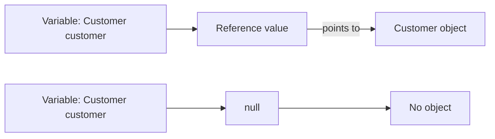
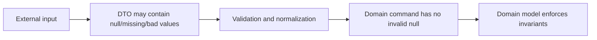
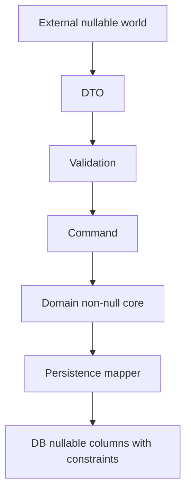
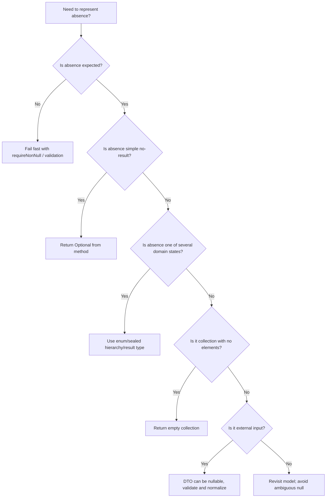

# Part 019 — Nullability, Absence & Optional

> Target part ini: memahami `null` bukan sebagai detail kecil, tetapi sebagai bagian dari desain tipe. Kita akan membedakan absence, unknown, not applicable, not loaded, forbidden, failed, pending, dan default. Kita juga akan memakai `Optional` secara tepat: kuat di return boundary, lemah sebagai field, parameter, atau pengganti desain domain.

## 1. Kenapa Nullability Layak Mendapat Satu Part Sendiri

Di Java, `null` adalah salah satu sumber bug paling mahal karena ia terlihat seperti "nilai biasa" tetapi sebenarnya merepresentasikan ketiadaan reference ke object.

Masalah utamanya bukan hanya `NullPointerException`.

Masalah sebenarnya adalah:

```text
null collapses multiple meanings into one token
```

Satu `null` bisa berarti:

- belum diisi;
- tidak ditemukan;
- tidak berlaku;
- belum dimuat dari database;
- user tidak punya akses melihat value;
- terjadi error tapi error ditelan;
- value sengaja dihapus;
- value default belum dihitung;
- dependency belum diinjeksi;
- feature belum tersedia;
- legacy API tidak bisa membedakan absence dan empty.

Compiler Java memperbolehkan semua reference variable bernilai `null`, kecuali kita menggunakan discipline tambahan seperti annotation, static analysis, runtime guard, atau type modeling.

## 2. Mental Model Utama

Pegangan paling penting:

```text
null is not a value of your domain;
null is a reference-level absence marker.
```

Ketika kita menulis:

```java
Customer customer = null;
```

Kita tidak membuat `Customer` kosong. Kita membuat variable bertipe `Customer` yang menyimpan reference value khusus yang tidak menunjuk ke object manapun.

Diagram:



Konsekuensinya:

```java
customer.name();
```

membutuhkan object target. Jika reference value adalah `null`, tidak ada target method dispatch.

## 3. Null Type dalam Java

Secara formal, Java memiliki `null type`. Tipe ini tidak bisa dinamai oleh programmer.

```java
var x = null; // compile-time error: cannot infer type for local variable
```

Kenapa?

Karena `null` literal punya null type, tetapi `var` membutuhkan target type yang bisa diinfer.

Contoh valid:

```java
String s = null;
Object o = null;
List<String> names = null;
```

`null` bisa dikonversi ke reference type manapun.

```text
null type is assignable to every reference type
```

Tetapi bukan ke primitive type:

```java
int x = null;      // compile-time error
Integer y = null;  // valid
```

Ini salah satu alasan wrapper type berbahaya ketika diperlakukan seperti primitive.

## 4. Null Bukan Object

Kesalahan mental model yang umum:

```text
null is an empty object
```

Itu salah.

`null` bukan instance dari class apapun.

```java
String s = null;

System.out.println(s instanceof String); // false
```

`instanceof` terhadap `null` selalu `false`.

Konsekuensi desain:

- jangan memanggil method pada `null`;
- jangan menganggap `null` punya behavior default;
- jangan memodelkan state domain penting hanya dengan `null`;
- jangan mencampur `null`, empty string, empty list, zero, dan false sebagai satu konsep.

## 5. The Absence Taxonomy

Engineer senior tidak bertanya:

```text
Should this be null?
```

Pertanyaan yang lebih tepat:

```text
What exact kind of absence is this?
```

Tabel:

| Situation | Meaning | Better Model |
|---|---|---|
| No row found | Query berhasil, data tidak ada | `Optional<T>` atau `NotFound` result |
| Field optional by domain | Data memang tidak wajib | nullable field dengan explicit contract atau value object |
| Field not applicable | Tidak berlaku untuk subtype/state tertentu | subtype, sealed hierarchy, enum state, atau separate type |
| Field not loaded | Lazy/projection boundary | projection type berbeda |
| Access forbidden | Ada data tapi user tidak boleh lihat | authorization result, redacted value |
| Computation failed | Ada error | `Result<T, E>`, exception, error response |
| Pending | Belum selesai diproses | explicit state |
| Deleted | Pernah ada, sekarang dihapus | tombstone/status field |
| Empty collection | Ada collection, ukurannya nol | empty collection, bukan null |
| Empty text | Ada string kosong | `""`, value object, atau validation error |

Jika semua ini dimodelkan dengan `null`, maka codebase kehilangan informasi.

## 6. Null Sebagai Lossy Encoding

`null` adalah encoding yang sangat murah tetapi lossy.

```java
String rejectionReason = null;
```

Apa artinya?

- case belum direview?
- case disetujui, jadi tidak ada alasan penolakan?
- case ditolak tapi alasan belum diinput?
- alasan disembunyikan karena permission?
- data corrupt?

Jika domain penting, gunakan model eksplisit.

```java
sealed interface ReviewOutcome permits Approved, Rejected, PendingReview {
}

record Approved() implements ReviewOutcome {
}

record Rejected(NonBlankText reason) implements ReviewOutcome {
}

record PendingReview() implements ReviewOutcome {
}
```

Dengan model ini, tidak ada ruang untuk `rejectionReason = null` yang ambigu.

## 7. Null di Parameter

Parameter nullable adalah kontrak paling berbahaya karena caller dan callee harus punya interpretasi yang sama.

Buruk:

```java
void searchCases(String ownerId, String status, LocalDate from, LocalDate to) {
    // null means no filter?
    // null means invalid?
    // null means current user?
}
```

Lebih baik:

```java
record CaseSearchCriteria(
        Optional<OwnerId> owner,
        Optional<CaseStatus> status,
        Optional<LocalDate> from,
        Optional<LocalDate> to
) {
}
```

Namun untuk public API Java, menggunakan `Optional` sebagai field/parameter tidak selalu ideal. Alternatif yang sering lebih bersih:

```java
record CaseSearchCriteria(
        OwnerFilter owner,
        StatusFilter status,
        DateRangeFilter submittedDate
) {
}

sealed interface OwnerFilter permits AnyOwner, SpecificOwner {
}

record AnyOwner() implements OwnerFilter {
}

record SpecificOwner(OwnerId ownerId) implements OwnerFilter {
}
```

Model ini lebih verbose tetapi lebih defensible.

## 8. Null di Return Value

Return nullable sering menjadi sumber bug karena caller mudah lupa melakukan check.

Buruk:

```java
Customer findCustomer(CustomerId id) {
    return repository.find(id); // may return null
}
```

Lebih baik:

```java
Optional<Customer> findCustomer(CustomerId id) {
    return repository.find(id);
}
```

Return `Optional<T>` memberi sinyal kuat:

```text
the absence is expected and must be handled
```

Namun `Optional` bukan pengganti error handling.

```java
Optional<Customer> findCustomer(CustomerId id);
```

Berarti:

- query valid;
- sistem berhasil mencari;
- customer mungkin tidak ada.

Bukan berarti:

- database down;
- caller tidak authorized;
- request invalid;
- schema corrupt.

Untuk situasi itu, gunakan exception atau result type yang membawa error.

## 9. Optional: Apa yang Ia Modelkan

`Optional<T>` adalah container yang mungkin berisi non-null value atau empty.

```java
Optional<Customer> maybeCustomer = customerRepository.findById(id);
```

Mental model:

```text
Optional<T> = expected absence at method return boundary
```

Bagus untuk:

- repository lookup yang mungkin tidak menemukan row;
- parser yang mungkin gagal tanpa error detail;
- lookup map yang membedakan not found;
- optional result dari expensive calculation;
- stream terminal operation seperti `findFirst`;
- API internal yang ingin memaksa caller menangani absence.

Kurang bagus untuk:

- field entity JPA;
- DTO JSON publik;
- method parameter default;
- collection element;
- serialization contract;
- mengganti domain state yang lebih kaya;
- error handling detail.

## 10. Optional Tidak Boleh Null

Anti-pattern:

```java
Optional<Customer> customer = null;
```

Ini menggagalkan tujuan `Optional`.

Benar:

```java
Optional<Customer> customer = Optional.empty();
```

Rule:

```text
Optional variable should never be null
```

Jika suatu API bisa mengembalikan `null` untuk `Optional<T>`, API itu rusak.

Tambahkan guard di boundary:

```java
Optional<Customer> safeFind(CustomerId id) {
    return Objects.requireNonNull(repository.find(id), "repository returned null Optional");
}
```

## 11. Optional.of vs Optional.ofNullable

```java
Optional<String> a = Optional.of("x");
Optional<String> b = Optional.ofNullable(value);
Optional<String> c = Optional.empty();
```

Perbedaan:

| Method | Jika value null | Use case |
|---|---|---|
| `Optional.of(value)` | throw `NullPointerException` | value wajib non-null |
| `Optional.ofNullable(value)` | return empty | adapt legacy nullable boundary |
| `Optional.empty()` | empty | explicit absence |

Gunakan `of` saat invariant mewajibkan non-null.

```java
record CustomerName(String value) {
    CustomerName {
        Objects.requireNonNull(value, "value");
    }

    Optional<String> asOptional() {
        return Optional.of(value);
    }
}
```

Gunakan `ofNullable` saat menormalisasi input legacy.

```java
Optional<String> middleName = Optional.ofNullable(legacyCustomer.getMiddleName());
```

## 12. Optional.get adalah Smell

```java
Customer customer = repository.findById(id).get();
```

Ini hampir sama seperti nullable return tanpa check.

Lebih baik:

```java
Customer customer = repository.findById(id)
        .orElseThrow(() -> new CustomerNotFoundException(id));
```

Atau:

```java
repository.findById(id)
        .ifPresent(customer -> audit.logViewed(customer.id()));
```

Atau:

```java
return repository.findById(id)
        .map(CustomerResponse::from)
        .orElseGet(CustomerResponse::notFound);
```

Rule:

```text
get() is acceptable only after local proof of presence
```

Contoh local proof:

```java
Optional<Customer> maybe = repository.findById(id);
if (maybe.isPresent()) {
    Customer customer = maybe.get(); // acceptable but still less expressive
}
```

Tetapi ini biasanya bisa diganti dengan `map`, `orElseThrow`, atau pattern lain.

## 13. orElse vs orElseGet

Perbedaan penting:

```java
Customer c1 = maybeCustomer.orElse(loadDefaultCustomer());
Customer c2 = maybeCustomer.orElseGet(() -> loadDefaultCustomer());
```

`orElse(...)` mengevaluasi argument sebelum method dipanggil.

`orElseGet(...)` mengevaluasi supplier hanya jika empty.

Bug:

```java
Customer customer = repository.findById(id)
        .orElse(createGuestCustomer()); // createGuestCustomer always executed
```

Jika default mahal atau punya side effect, gunakan `orElseGet`.

```java
Customer customer = repository.findById(id)
        .orElseGet(this::createGuestCustomer);
```

## 14. Optional.map vs flatMap

`map` dipakai saat mapper mengembalikan value biasa.

```java
Optional<String> email = maybeCustomer.map(Customer::email);
```

`flatMap` dipakai saat mapper mengembalikan `Optional`.

```java
Optional<EmailAddress> verifiedEmail = maybeCustomer
        .flatMap(Customer::verifiedEmail);
```

Jika memakai `map` pada mapper yang sudah return Optional:

```java
Optional<Optional<EmailAddress>> nested = maybeCustomer.map(Customer::verifiedEmail);
```

Biasanya ini bukan yang kita inginkan.

## 15. Optional dalam Field

Secara umum, hindari `Optional` sebagai field domain object.

```java
record Customer(Optional<EmailAddress> email) {
}
```

Masalah:

- object bisa dibuat dengan `email = null`;
- banyak serializer/framework tidak memperlakukan Optional field sebagai domain primitive;
- `Optional` adalah container API-level, bukan selalu data-modeling type;
- nested absence menjadi membingungkan;
- JPA dan JSON binding sering punya behavior khusus.

Alternatif 1: nullable private field dengan accessor Optional.

```java
final class Customer {
    private final EmailAddress email; // nullable internal representation

    Customer(EmailAddress email) {
        this.email = email;
    }

    Optional<EmailAddress> email() {
        return Optional.ofNullable(email);
    }
}
```

Alternatif 2: explicit domain type.

```java
sealed interface ContactEmail permits NoEmail, ProvidedEmail {
}

record NoEmail() implements ContactEmail {
}

record ProvidedEmail(EmailAddress value) implements ContactEmail {
    ProvidedEmail {
        Objects.requireNonNull(value, "value");
    }
}
```

Untuk domain penting, alternatif 2 lebih kuat.

## 16. Optional dalam Parameter

Parameter `Optional` sering membuat caller lebih verbose tanpa memperjelas domain.

```java
void updateEmail(CustomerId id, Optional<EmailAddress> email) {
}
```

Caller:

```java
updateEmail(id, Optional.empty());
```

Apa artinya?

- hapus email?
- jangan update email?
- set email menjadi unknown?

Lebih jelas:

```java
sealed interface EmailUpdate permits KeepEmail, RemoveEmail, ReplaceEmail {
}

record KeepEmail() implements EmailUpdate {
}

record RemoveEmail() implements EmailUpdate {
}

record ReplaceEmail(EmailAddress value) implements EmailUpdate {
}
```

Command:

```java
record UpdateCustomerEmailCommand(CustomerId id, EmailUpdate emailUpdate) {
}
```

Ini jauh lebih eksplisit.

## 17. Optional Collection vs Empty Collection

Jangan return `null` untuk collection.

Buruk:

```java
List<Case> findCases(Filter filter) {
    return null; // no cases?
}
```

Baik:

```java
List<Case> findCases(Filter filter) {
    return List.of();
}
```

Apakah perlu `Optional<List<Case>>`?

Biasanya tidak.

```java
Optional<List<Case>> findCases(Filter filter); // smell
```

Karena list kosong sudah menyatakan no elements.

Namun ada exception:

```text
Optional<List<T>> can be valid when absence of the list itself differs from an empty known list.
```

Contoh:

- data belum dimuat;
- caller tidak authorized melihat collection;
- feature tidak berlaku untuk entity ini.

Tetapi jika begitu, lebih baik modelkan secara eksplisit.

```java
sealed interface CaseListView permits CasesVisible, CasesHidden, CasesNotLoaded {
}

record CasesVisible(List<CaseSummary> cases) implements CaseListView {
}

record CasesHidden() implements CaseListView {
}

record CasesNotLoaded() implements CaseListView {
}
```

## 18. Empty String Bukan Null

```java
String middleName = "";
String middleName = null;
```

Keduanya berbeda.

| Representation | Meaning yang masuk akal |
|---|---|
| `null` | tidak diketahui/tidak ada reference |
| `""` | string ada, panjang nol |
| blank string | string ada, hanya whitespace |
| missing JSON field | field tidak dikirim |
| JSON `null` | field dikirim dengan null |

Untuk input user, bedakan validation dan normalization.

```java
record NonBlankText(String value) {
    NonBlankText {
        Objects.requireNonNull(value, "value");
        if (value.isBlank()) {
            throw new IllegalArgumentException("value must not be blank");
        }
    }
}
```

Jika domain memperbolehkan absence:

```java
record PersonName(
        NonBlankText firstName,
        Optional<NonBlankText> middleName,
        NonBlankText lastName
) {
}
```

Namun untuk serialization boundary, pertimbangkan DTO terpisah.

## 19. Null Object Pattern: Kapan Masuk Akal

Null Object berarti membuat object yang merepresentasikan behavior default.

```java
interface AuditSink {
    void record(AuditEvent event);
}

final class NoopAuditSink implements AuditSink {
    @Override
    public void record(AuditEvent event) {
        // intentionally no-op
    }
}
```

Bagus jika:

- behavior no-op benar secara domain;
- caller tidak perlu tahu absence;
- tidak menyembunyikan error;
- observability tetap memadai.

Berbahaya jika:

```java
final class MissingCustomer extends Customer {
    // pretend customer exists
}
```

Ini bisa menyembunyikan data integrity problem.

Rule:

```text
Null Object is good for optional behavior, not for missing critical data.
```

## 20. Objects.requireNonNull

`Objects.requireNonNull` adalah alat murah untuk memperjelas invariant.

```java
record CaseId(String value) {
    CaseId {
        Objects.requireNonNull(value, "value");
        if (value.isBlank()) {
            throw new IllegalArgumentException("value must not be blank");
        }
    }
}
```

Gunakan di:

- constructor;
- factory;
- command handler boundary;
- adapter dari legacy API;
- public method yang tidak menerima null;
- sebelum menyimpan state ke object.

Jangan gunakan sebagai substitusi desain domain.

```java
Objects.requireNonNull(reason);
```

Ini hanya membuktikan non-null, bukan valid secara domain.

## 21. Fail Fast vs Tolerant Boundary

Di internal domain, fail fast sering benar.

```java
record EnforcementCase(CaseId id, CaseStatus status) {
    EnforcementCase {
        Objects.requireNonNull(id, "id");
        Objects.requireNonNull(status, "status");
    }
}
```

Di external boundary, tolerant parsing kadang perlu.

```java
record IncomingCaseRequest(String id, String status) {
}

ValidationResult<CreateCaseCommand> parse(IncomingCaseRequest request) {
    // collect all field errors, do not throw on first null
}
```

Model:



Rule:

```text
Be tolerant at input boundary, strict inside domain core.
```

## 22. Nullability Annotation

Java standard library tidak punya universal built-in nullability type system seperti Kotlin.

Di enterprise Java, tim biasanya memakai annotation dan static analysis:

```java
@NonNull CustomerId id
@Nullable String middleName
```

Annotation ecosystem berbeda-beda:

- Checker Framework;
- NullAway;
- Error Prone;
- SpotBugs annotations;
- JetBrains annotations;
- JSpecify;
- Spring nullability annotations;
- Jakarta/Bean Validation annotations seperti `@NotNull` untuk runtime validation.

Poin penting:

```text
nullability annotation is a contract, not magic
```

Ia perlu:

- convention yang konsisten;
- static analysis di CI;
- boundary adapter;
- suppression policy;
- migration plan;
- review discipline.

## 23. @NotNull vs @NonNull

Jangan campur konsep compile-time nullness dan runtime validation.

| Annotation style | Tujuan |
|---|---|
| `@Nullable` / `@NonNull` | static analysis / developer contract |
| Bean Validation `@NotNull` | runtime validation constraint |

Contoh DTO:

```java
record CreateCaseRequest(
        @NotNull String caseType,
        String description
) {
}
```

`@NotNull` biasanya divalidasi oleh framework pada runtime.

Contoh internal API:

```java
void assign(@NonNull CaseId caseId, @NonNull OfficerId officerId) {
}
```

`@NonNull` berguna jika toolchain memahami annotation tersebut.

Dalam materi ini, kita fokus ke mental model, bukan vendor annotation tertentu.

## 24. Null dari Framework dan Reflection

Banyak framework bisa mengisi object dengan cara yang tidak melewati constructor biasa:

- ORM;
- serializer/deserializer;
- reflection;
- proxy;
- dependency injection;
- testing/mocking framework.

Karena itu, jangan hanya mengandalkan field final dan constructor jika framework melakukan hydration khusus.

Contoh risiko:

```java
class CaseEntity {
    private String status;

    CaseStatus status() {
        return CaseStatus.valueOf(status); // status might be null from DB row
    }
}
```

Solusi:

- validasi database constraint;
- validasi entity lifecycle callback jika perlu;
- mapping entity ke domain object dengan guard;
- jangan bocorkan entity mentah sebagai domain object;
- gunakan projection type untuk data parsial.

## 25. Null dan JSON Boundary

JSON punya perbedaan penting:

```json
{}
```

versus:

```json
{"middleName": null}
```

versus:

```json
{"middleName": ""}
```

Di PATCH API, perbedaannya sangat penting:

| Payload | Meaning possible |
|---|---|
| field missing | do not change |
| field null | clear value |
| field empty string | set to empty string or invalid |

Jangan pakai `Optional<String>` mentah tanpa policy jelas.

Better command model:

```java
sealed interface PatchField<T> permits Unchanged, Clear, Replace {
}

record Unchanged<T>() implements PatchField<T> {
}

record Clear<T>() implements PatchField<T> {
}

record Replace<T>(T value) implements PatchField<T> {
    Replace {
        Objects.requireNonNull(value, "value");
    }
}
```

DTO mapper menentukan:

```text
missing -> Unchanged
null -> Clear
value -> Replace(value)
```

## 26. Null dan Database Boundary

Database `NULL` bukan selalu Java `null` secara domain.

Contoh:

```sql
closed_at timestamp null
```

Bisa berarti:

- case belum closed;
- migration lama belum punya data;
- status corrupt karena `closed_at` null tetapi status CLOSED;
- field tidak applicable untuk case tertentu.

Domain model yang lebih kuat:

```java
sealed interface CaseClosure permits OpenCase, ClosedCase {
}

record OpenCase() implements CaseClosure {
}

record ClosedCase(Instant closedAt, OfficerId closedBy) implements CaseClosure {
    ClosedCase {
        Objects.requireNonNull(closedAt, "closedAt");
        Objects.requireNonNull(closedBy, "closedBy");
    }
}
```

Mapping DB harus memvalidasi kombinasi column, bukan hanya field per field.

## 27. Null dan Lazy Loading

Salah satu bug enterprise klasik:

```java
case.getAssignments() == null
```

Apakah artinya tidak ada assignment, belum dimuat, atau lazy loading gagal?

Lebih baik gunakan projection berbeda.

```java
record CaseSummary(CaseId id, CaseStatus status) {
}

record CaseDetails(
        CaseId id,
        CaseStatus status,
        List<Assignment> assignments
) {
    CaseDetails {
        assignments = List.copyOf(assignments);
    }
}
```

Dengan ini, `CaseSummary` tidak berpura-pura punya assignment list.

## 28. Null dan Authorization

Jangan mengembalikan `null` untuk menyembunyikan forbidden data jika caller perlu tahu perbedaannya.

Buruk:

```java
Document getDocument(User user, DocumentId id) {
    if (!canView(user, id)) {
        return null;
    }
    return documentRepository.get(id);
}
```

Lebih baik:

```java
sealed interface DocumentAccessResult permits DocumentVisible, DocumentForbidden, DocumentMissing {
}

record DocumentVisible(Document document) implements DocumentAccessResult {
}

record DocumentForbidden(DocumentId id) implements DocumentAccessResult {
}

record DocumentMissing(DocumentId id) implements DocumentAccessResult {
}
```

Kenapa?

Karena audit, security, dan UX butuh keputusan yang berbeda.

## 29. Null dan Concurrency

Null sering muncul sebagai marker state dalam concurrent code.

```java
private volatile Config config;

Config current() {
    if (config == null) {
        config = loadConfig();
    }
    return config;
}
```

Risiko:

- double initialization;
- partially constructed visibility jika publikasi salah;
- null sebagai state marker tidak cukup untuk loading/error/reload;
- race antara clear dan read.

Model lebih baik:

```java
sealed interface ConfigState permits NotLoaded, Loading, Loaded, LoadFailed {
}

record NotLoaded() implements ConfigState {
}

record Loading() implements ConfigState {
}

record Loaded(Config config) implements ConfigState {
}

record LoadFailed(Throwable cause) implements ConfigState {
}
```

Untuk concurrency serius, gabungkan dengan atomic reference, lock, atau initialization-on-demand holder sesuai kebutuhan.

## 30. Null dan Exception Handling

Jangan return `null` setelah menangkap exception.

Buruk:

```java
Customer load(CustomerId id) {
    try {
        return remoteClient.fetch(id);
    } catch (IOException e) {
        return null;
    }
}
```

Ini mengubah failure menjadi absence.

Lebih baik:

```java
Customer load(CustomerId id) {
    try {
        return remoteClient.fetch(id);
    } catch (IOException e) {
        throw new CustomerLoadException(id, e);
    }
}
```

Atau result type:

```java
sealed interface LoadCustomerResult permits CustomerLoaded, CustomerMissing, CustomerLoadFailed {
}

record CustomerLoaded(Customer customer) implements LoadCustomerResult {
}

record CustomerMissing(CustomerId id) implements LoadCustomerResult {
}

record CustomerLoadFailed(CustomerId id, String reason) implements LoadCustomerResult {
}
```

## 31. Null dan Primitive Wrapper

Wrapper nullable sering menciptakan unboxing NPE.

```java
Integer count = null;
int next = count + 1; // NullPointerException
```

Untuk domain count, pilih:

```java
int count;
```

Jika absence valid:

```java
OptionalInt count;
```

Atau domain type:

```java
sealed interface CountValue permits CountKnown, CountUnknown {
}

record CountKnown(int value) implements CountValue {
}

record CountUnknown() implements CountValue {
}
```

Untuk public domain object, value object sering lebih jelas dibanding wrapper nullable.

## 32. OptionalInt, OptionalLong, OptionalDouble

Java punya primitive optional variants:

```java
OptionalInt maybeCount = OptionalInt.empty();
OptionalLong maybeSequence = OptionalLong.of(42L);
OptionalDouble maybeScore = OptionalDouble.of(0.75);
```

Kelebihan:

- menghindari boxing;
- jelas untuk primitive result;
- cocok untuk stream numeric.

Kekurangan:

- API tidak generic;
- tidak ada `OptionalBoolean`;
- tidak cocok untuk domain absence yang kaya;
- kadang membuat API tidak konsisten.

Gunakan jika absence sederhana dan value primitive.

## 33. Null-Safe Equality

Gunakan `Objects.equals` saat dua operand bisa nullable.

```java
Objects.equals(a, b)
```

Equivalent logic:

```java
(a == b) || (a != null && a.equals(b))
```

Namun jangan gunakan ini untuk menyembunyikan desain nullable yang tidak jelas.

Buruk:

```java
if (Objects.equals(case.status(), "CLOSED")) {
}
```

Lebih baik:

```java
if (case.status() == CaseStatus.CLOSED) {
}
```

Jika status bisa null, masalahnya ada di model case.

## 34. Null-Safe toString

`String.valueOf(object)` aman terhadap null.

```java
String text = String.valueOf(value); // "null" if value is null
```

Ini berguna untuk logging tertentu, tetapi berbahaya jika output dipakai sebagai data.

```java
String customerId = String.valueOf(request.customerId());
```

Jika `customerId` null, string literal `"null"` bisa masuk ke database atau outbound API.

Rule:

```text
null-safe formatting is not null-safe domain conversion
```

## 35. Null dan Logging

Jangan log null tanpa konteks.

Buruk:

```java
log.info("customer={} status={}", customerId, status);
```

Jika output:

```text
customer=null status=null
```

Tidak jelas apakah ini input bug, authorization, missing mapping, atau branch valid.

Lebih baik:

```java
log.warn("Rejecting create-case command: missing required customerId; correlationId={}", correlationId);
```

Atau gunakan validation error structure.

## 36. Null Policy per Layer

Buat policy sederhana per layer.

| Layer | Policy |
|---|---|
| External DTO | boleh nullable/missing, wajib divalidasi |
| Mapper | normalisasi null ke domain concept |
| Domain model | prefer non-null invariant |
| Repository internal | `Optional` untuk not found, exception untuk failure |
| Service API | hindari nullable return |
| Controller response | explicit response shape |
| Database | constraint dan mapping consistency |
| Test fixture | jangan menyembunyikan null invalid |

Diagram:



## 37. Nullability Review Checklist

Saat review API, tanyakan:

1. Apakah parameter ini boleh `null`?
2. Jika boleh, apa tepatnya arti `null`?
3. Apakah return value bisa `null`?
4. Jika bisa, apakah caller dipaksa menangani absence?
5. Apakah absence berbeda dari failure?
6. Apakah absence berbeda dari forbidden?
7. Apakah absence berbeda dari not loaded?
8. Apakah empty collection cukup?
9. Apakah empty string valid?
10. Apakah `Optional` digunakan di tempat yang tepat?
11. Apakah `Optional` sendiri bisa `null`?
12. Apakah field nullable punya invariant lintas field?
13. Apakah serializer/ORM bisa membuat state null yang tidak mungkin di constructor?
14. Apakah test mencakup missing/null/empty secara terpisah?
15. Apakah logs membedakan null invalid vs expected absence?

## 38. Anti-Pattern Catalog

### 38.1 Nullable Boolean

```java
Boolean approved;
```

Mungkin berarti:

- true;
- false;
- not reviewed;
- not applicable.

Lebih baik:

```java
enum ApprovalStatus {
    PENDING,
    APPROVED,
    REJECTED,
    NOT_APPLICABLE
}
```

### 38.2 Null Means Default

```java
void createReport(TimeZone zone) {
    if (zone == null) {
        zone = TimeZone.getDefault();
    }
}
```

Lebih baik:

```java
void createReport(ZoneId zone) {
    Objects.requireNonNull(zone, "zone");
}

void createReportUsingSystemZone() {
    createReport(ZoneId.systemDefault());
}
```

### 38.3 Null Means Skip

```java
void update(String name, String email, String phone) {
    if (name != null) updateName(name);
    if (email != null) updateEmail(email);
    if (phone != null) updatePhone(phone);
}
```

Lebih baik gunakan patch field model.

### 38.4 Null Means Error

```java
return null;
```

di catch block adalah error handling yang buruk.

### 38.5 Null Collection

```java
return null;
```

untuk no elements hampir selalu salah.

### 38.6 Optional Everywhere

```java
record Person(Optional<String> firstName, Optional<String> lastName) {
}
```

Ini bukan domain modeling; ini memindahkan problem null ke container.

## 39. Practical Refactoring: Dari Nullable API ke Explicit Contract

Legacy:

```java
Case getCase(String id, Boolean includeClosed, String assignedOfficerId) {
    // null includeClosed means false
    // null assignedOfficerId means any officer
    // null return means not found
}
```

Step 1: buat input type.

```java
record GetCaseQuery(
        CaseId caseId,
        ClosedCaseFilter closedCaseFilter,
        OfficerFilter officerFilter
) {
}
```

Step 2: modelkan filters.

```java
enum ClosedCaseFilter {
    INCLUDE_CLOSED,
    EXCLUDE_CLOSED
}

sealed interface OfficerFilter permits AnyOfficer, AssignedToOfficer {
}

record AnyOfficer() implements OfficerFilter {
}

record AssignedToOfficer(OfficerId officerId) implements OfficerFilter {
}
```

Step 3: return `Optional` untuk not found.

```java
Optional<Case> getCase(GetCaseQuery query) {
}
```

Step 4: jika authorization dan not found harus dibedakan, gunakan result type.

```java
sealed interface GetCaseResult permits CaseFound, CaseNotFound, CaseForbidden {
}

record CaseFound(CaseDetails details) implements GetCaseResult {
}

record CaseNotFound(CaseId id) implements GetCaseResult {
}

record CaseForbidden(CaseId id) implements GetCaseResult {
}
```

## 40. Testing Nullability

Test nullability bukan hanya test NPE.

Test categories:

| Test | Purpose |
|---|---|
| constructor rejects null | invariant |
| mapper handles missing field | boundary |
| mapper handles JSON null | patch semantics |
| empty collection returned | no null collection |
| not found returns Optional.empty | absence contract |
| failure throws/result error | absence vs failure |
| forbidden distinguished | security correctness |
| null from legacy dependency guarded | adapter robustness |

Example:

```java
@Test
void rejectsNullCaseId() {
    assertThrows(NullPointerException.class, () -> new CaseId(null));
}

@Test
void repositoryReturnsEmptyWhenCaseMissing() {
    Optional<Case> result = repository.findById(new CaseId("missing"));

    assertTrue(result.isEmpty());
}
```

## 41. Nullability dalam Regulatory Systems

Dalam sistem enforcement/regulatory case management, nullability harus defensible.

Contoh field:

```java
Instant deadlineAt;
Instant submittedAt;
Instant approvedAt;
Instant closedAt;
String rejectionReason;
OfficerId assignedOfficer;
```

Nullable field bisa mengubah meaning hukum/proses.

Model yang lebih aman:

```java
sealed interface CaseLifecycle permits DraftCase, SubmittedCase, ApprovedCase, RejectedCase, ClosedCase {
}

record DraftCase(CaseId id) implements CaseLifecycle {
}

record SubmittedCase(CaseId id, Instant submittedAt) implements CaseLifecycle {
}

record ApprovedCase(CaseId id, Instant approvedAt, OfficerId approvedBy) implements CaseLifecycle {
}

record RejectedCase(CaseId id, Instant rejectedAt, OfficerId rejectedBy, NonBlankText reason)
        implements CaseLifecycle {
}

record ClosedCase(CaseId id, Instant closedAt, OfficerId closedBy) implements CaseLifecycle {
}
```

Keuntungan:

- field yang wajib hanya ada di state relevan;
- tidak ada `approvedAt = null` yang ambigu;
- transition lebih mudah diaudit;
- API response lebih defensible;
- test bisa fokus ke state valid.

## 42. Decision Framework

Gunakan decision tree ini:



## 43. Practice Drill

Ambil API berikut:

```java
Report generate(String caseId, String officerId, Boolean includeDrafts, LocalDate from, LocalDate to) {
    return null;
}
```

Tugas:

1. Tentukan arti `null` untuk setiap parameter.
2. Bedakan default, absence, invalid, dan not authorized.
3. Buat `GenerateReportCommand`.
4. Buat explicit filter types.
5. Tentukan return type: `Report`, `Optional<Report>`, exception, atau result hierarchy.
6. Tulis minimal 8 test untuk null/missing/empty/failure.

Contoh arah refactor:

```java
record GenerateReportCommand(
        CaseScope caseScope,
        OfficerScope officerScope,
        DraftInclusion draftInclusion,
        DateRange dateRange
) {
}

sealed interface CaseScope permits AllCases, SpecificCase {
}
record AllCases() implements CaseScope {
}
record SpecificCase(CaseId caseId) implements CaseScope {
}

enum DraftInclusion {
    INCLUDE_DRAFTS,
    EXCLUDE_DRAFTS
}
```

## 44. Ringkasan

Nullability adalah desain kontrak, bukan detail syntax.

Pegangan utama:

```text
null is acceptable only when its meaning is explicit, local, guarded, and cheaper than a richer model.
```

Gunakan `Optional` untuk return method ketika absence adalah expected no-result. Gunakan empty collection untuk no elements. Gunakan explicit domain type untuk absence yang punya meaning bisnis. Gunakan validation dan `requireNonNull` untuk menjaga invariant internal. Jangan ubah failure, forbidden, not loaded, pending, dan not applicable menjadi `null` yang sama.

Engineer top-tier tidak hanya menghindari NPE. Ia mencegah hilangnya meaning.

## 45. Referensi Resmi

- Java Language Specification, Java SE 25 — Chapter 4: Types, Values, and Variables.
- Java Platform API Documentation, Java SE 25 — `java.util.Optional`.
- Java Platform API Documentation, Java SE 25 — `java.util.Objects`.
- Java Platform API Documentation, Java SE 25 — Collections and unmodifiable collection factories.
