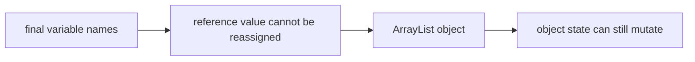
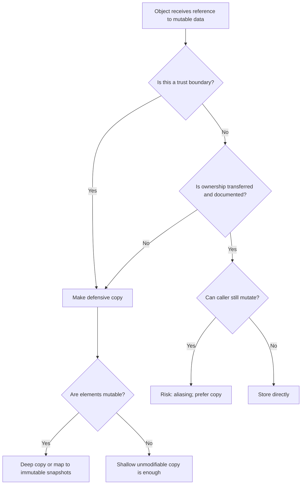

# Part 020 — Immutability, Mutability & Defensive Copying

> Target part ini: memahami mutability bukan sekadar `final` atau tidak `final`. Kita akan membedakan reference immutability, object immutability, deep immutability, unmodifiable view, snapshot copy, ownership transfer, safe publication, dan boundary design. Fokusnya adalah menjaga invariant data agar tidak berubah diam-diam setelah divalidasi.

## 1. Masalah yang Sering Tidak Terlihat

Banyak bug Java bukan terjadi karena object salah dibuat, tetapi karena object yang tadinya valid berubah setelah melewati boundary.

Contoh:

```java
List<String> permissions = new ArrayList<>();
permissions.add("CASE_READ");

UserRole role = new UserRole("officer", permissions);
permissions.clear();

// role sekarang mungkin kehilangan permission tanpa melalui method role
```

Jika constructor hanya menyimpan reference, maka invariant bisa dirusak dari luar.

Problem utama:

```text
validation without ownership is not a durable invariant
```

Kalau object menerima mutable input, memvalidasi input itu tidak cukup. Ia harus menentukan siapa pemilik data setelah construction.

## 2. Mental Model: Reference, Object, Ownership

```java
final List<String> names = new ArrayList<>();
names.add("A");
```

`final` di sini hanya berarti variable `names` tidak bisa direassign.

```java
names = List.of("B"); // compile-time error
```

Tetapi object list tetap bisa berubah.

```java
names.add("B"); // valid
```

Diagram:



Rule:

```text
final reference is not immutable object
```

## 3. Jenis-Jenis Immutability

| Concept | Meaning | Example |
|---|---|---|
| Reference immutability | variable tidak bisa direassign | `final List<T> list` |
| Shallow object immutability | field tidak berubah, tapi object referensi di dalamnya mungkin mutable | record dengan `List<T>` tanpa copy |
| Deep immutability | seluruh object graph tidak bisa berubah | value object dengan immutable components |
| Unmodifiable view | wrapper menolak mutation lewat view, tapi backing object bisa berubah | `Collections.unmodifiableList(list)` |
| Unmodifiable copy | collection baru tidak bisa dimutasi, snapshot dari input | `List.copyOf(list)` |
| Persistent data structure | mutation menghasilkan structure baru dengan sharing internal | beberapa library functional collections |

Jangan menyamakan semuanya.

## 4. Mutability sebagai Capability

Mutability adalah capability: siapa yang boleh mengubah object?

Pertanyaan desain:

```text
Who is allowed to mutate this data, through which method, under which invariant?
```

Contoh buruk:

```java
class CaseFile {
    private final List<Document> documents = new ArrayList<>();

    List<Document> documents() {
        return documents;
    }
}
```

Caller bisa melakukan:

```java
caseFile.documents().clear();
```

Ini melewati semua business rule.

Lebih baik:

```java
class CaseFile {
    private final List<Document> documents = new ArrayList<>();

    List<Document> documents() {
        return List.copyOf(documents);
    }

    void attach(Document document) {
        Objects.requireNonNull(document, "document");
        if (documents.size() >= 100) {
            throw new IllegalStateException("too many documents");
        }
        documents.add(document);
    }
}
```

Mutation hanya lewat method yang menjaga invariant.

## 5. Defensive Copying

Defensive copy adalah teknik membuat copy agar object tidak berbagi mutable state dengan caller.

Constructor copy:

```java
record CaseAssignmentHistory(List<Assignment> assignments) {
    CaseAssignmentHistory {
        assignments = List.copyOf(assignments);
    }
}
```

Accessor copy:

```java
final class CaseAssignmentHistory {
    private final List<Assignment> assignments;

    CaseAssignmentHistory(List<Assignment> assignments) {
        this.assignments = List.copyOf(assignments);
    }

    List<Assignment> assignments() {
        return assignments;
    }
}
```

Karena `List.copyOf` menghasilkan unmodifiable list, accessor bisa return field jika element juga aman.

Namun hati-hati: ini shallow copy.

## 6. Shallow Copy vs Deep Copy

```java
record Assignment(OfficerId officerId, List<String> notes) {
    Assignment {
        notes = List.copyOf(notes);
    }
}

record History(List<Assignment> assignments) {
    History {
        assignments = List.copyOf(assignments);
    }
}
```

`History` melakukan shallow copy atas list assignment. Ia tidak clone setiap `Assignment`.

Jika `Assignment` immutable, itu cukup.

Jika element mutable:

```java
record History(List<MutableAssignment> assignments) {
    History {
        assignments = assignments.stream()
                .map(MutableAssignment::copy)
                .toList();
    }
}
```

Rule:

```text
copy the container if the container is mutable;
copy the elements if the elements are mutable and shared.
```

## 7. Unmodifiable View vs Copy

Unmodifiable view:

```java
List<String> raw = new ArrayList<>();
List<String> view = Collections.unmodifiableList(raw);

raw.add("A");
System.out.println(view); // [A]
```

`view` tidak bisa dimutasi melalui `view`, tetapi tetap melihat perubahan backing list.

Unmodifiable copy:

```java
List<String> raw = new ArrayList<>();
List<String> snapshot = List.copyOf(raw);

raw.add("A");
System.out.println(snapshot); // []
```

Decision:

| Need | Use |
|---|---|
| read-only live view | unmodifiable view |
| stable snapshot | `List.copyOf` |
| internal mutable aggregate | private mutable list + snapshot accessor |
| immutable value object | copy in constructor |

## 8. `final` Field Tidak Cukup

```java
final class Report {
    private final List<String> rows;

    Report(List<String> rows) {
        this.rows = rows;
    }
}
```

Class ini belum immutable karena list masih bisa dimutasi dari luar.

```java
List<String> rows = new ArrayList<>();
Report report = new Report(rows);
rows.add("corrupt");
```

Benar:

```java
final class Report {
    private final List<String> rows;

    Report(List<String> rows) {
        this.rows = List.copyOf(rows);
    }

    List<String> rows() {
        return rows;
    }
}
```

Tetapi jika `String` diganti `StringBuilder`, belum deep immutable.

## 9. Records dan Shallow Immutability

Record sering disalahpahami sebagai immutable otomatis.

```java
record CaseView(List<String> tags) {
}
```

Record component `tags` final, tetapi list object bisa mutable.

```java
List<String> tags = new ArrayList<>();
CaseView view = new CaseView(tags);
tags.add("urgent");
System.out.println(view.tags()); // [urgent]
```

Gunakan compact constructor:

```java
record CaseView(List<String> tags) {
    CaseView {
        tags = List.copyOf(tags);
    }
}
```

Jika element mutable, copy element juga.

## 10. Canonical Constructor dan Reassignment Record Component

Dalam compact constructor record:

```java
record CaseView(List<String> tags) {
    CaseView {
        tags = List.copyOf(tags);
    }
}
```

Assignment ke parameter `tags` akan dipakai untuk field initialization implicit.

Ini berbeda dari constructor class biasa.

Equivalent concept:

```java
record CaseView(List<String> tags) {
    public CaseView(List<String> tags) {
        this.tags = List.copyOf(tags);
    }
}
```

Gunakan pattern ini untuk normalisasi.

## 11. Immutable Value Object

Value object harus stabil setelah dibuat.

```java
record Money(BigDecimal amount, Currency currency) {
    Money {
        Objects.requireNonNull(amount, "amount");
        Objects.requireNonNull(currency, "currency");
        amount = amount.setScale(currency.getDefaultFractionDigits(), RoundingMode.UNNECESSARY);
    }
}
```

Karakteristik:

- no identity-based meaning;
- equality berdasarkan value;
- valid saat dibuat;
- tidak berubah setelah dibuat;
- aman sebagai key map jika components immutable;
- aman disebarkan ke banyak thread setelah construction benar.

## 12. Mutable Entity vs Immutable Value Object

Dalam domain enterprise, tidak semua object harus immutable.

| Type | Bias desain |
|---|---|
| Value object | immutable |
| Command | immutable |
| Event | immutable |
| DTO input | bisa mutable karena framework, lalu dimap ke immutable command |
| Aggregate root | bisa mutable internal, tapi mutation guarded |
| Entity ORM | sering mutable karena framework, jangan bocorkan sebagai domain contract |
| Builder | mutable sementara, tidak dishare |
| Cache entry | prefer immutable |

Entity bisa mutable, tetapi mutation harus terkendali.

```java
final class EnforcementCase {
    private CaseStatus status;
    private final List<Assignment> assignments = new ArrayList<>();

    void assignTo(OfficerId officerId, Instant assignedAt) {
        Objects.requireNonNull(officerId, "officerId");
        Objects.requireNonNull(assignedAt, "assignedAt");
        if (status == CaseStatus.CLOSED) {
            throw new IllegalStateException("closed case cannot be assigned");
        }
        assignments.add(new Assignment(officerId, assignedAt));
    }

    List<Assignment> assignments() {
        return List.copyOf(assignments);
    }
}
```

Mutable internal state, immutable boundary.

## 13. Ownership Transfer

Kadang copying mahal. Alternatifnya ownership transfer.

```java
final class BatchPayload {
    private final byte[] bytes;

    private BatchPayload(byte[] bytes) {
        this.bytes = bytes;
    }

    static BatchPayload takeOwnership(byte[] bytes) {
        Objects.requireNonNull(bytes, "bytes");
        return new BatchPayload(bytes);
    }
}
```

Namun ini butuh kontrak kuat:

```text
caller must not mutate array after passing it
```

Di Java, compiler tidak menegakkan ownership. Jadi ownership transfer raw biasanya berbahaya untuk API umum.

Lebih aman:

```java
static BatchPayload copyOf(byte[] bytes) {
    return new BatchPayload(Arrays.copyOf(bytes, bytes.length));
}
```

Gunakan ownership transfer hanya untuk boundary internal yang jelas dan terukur.

## 14. Mutable Arrays

Array selalu mutable.

```java
record Digest(byte[] bytes) {
}
```

Bug:

```java
byte[] raw = {1, 2, 3};
Digest digest = new Digest(raw);
raw[0] = 9;
```

Fix:

```java
record Digest(byte[] bytes) {
    Digest {
        bytes = Arrays.copyOf(bytes, bytes.length);
    }

    @Override
    public byte[] bytes() {
        return Arrays.copyOf(bytes, bytes.length);
    }
}
```

Kenapa accessor perlu copy? Karena array tetap mutable meskipun field final.

## 15. Byte Array Boundary

`byte[]` umum dipakai untuk:

- hash;
- signature;
- encrypted payload;
- file content;
- network packet;
- serialized data;
- binary identifier.

Untuk value object security-sensitive, selalu copy.

```java
final class SignatureValue {
    private final byte[] bytes;

    SignatureValue(byte[] bytes) {
        Objects.requireNonNull(bytes, "bytes");
        if (bytes.length != 64) {
            throw new IllegalArgumentException("signature must be 64 bytes");
        }
        this.bytes = Arrays.copyOf(bytes, bytes.length);
    }

    byte[] bytes() {
        return Arrays.copyOf(bytes, bytes.length);
    }
}
```

Jika performance sangat kritis, expose `ByteBuffer` read-only atau custom view, tetapi tetap audit aliasing.

## 16. ByteBuffer Mutability

`ByteBuffer` juga punya state mutable: position, limit, mark, dan content.

```java
ByteBuffer buffer = ByteBuffer.wrap(bytes);
buffer.get(); // changes position
```

Read-only buffer:

```java
ByteBuffer readOnly = buffer.asReadOnlyBuffer();
```

Namun read-only buffer bisa tetap berbagi content dengan backing buffer jika backing content berubah.

Snapshot membutuhkan copy bytes.

```java
static ByteBuffer snapshot(ByteBuffer source) {
    ByteBuffer duplicate = source.asReadOnlyBuffer();
    byte[] copy = new byte[duplicate.remaining()];
    duplicate.get(copy);
    return ByteBuffer.wrap(copy).asReadOnlyBuffer();
}
```

Rule:

```text
read-only view prevents mutation through that view; it does not always prove snapshot isolation.
```

## 17. Collection Factories

Modern Java menyediakan factory:

```java
List<String> list = List.of("a", "b");
Set<String> set = Set.of("a", "b");
Map<String, Integer> map = Map.of("a", 1);
```

Karakteristik penting:

- unmodifiable;
- tidak menerima null;
- value-based, jangan sinkronisasi pada identity instance;
- element mutable masih bisa berubah;
- order untuk set/map tidak boleh diasumsikan kecuali documented.

`List.copyOf(collection)` berguna untuk snapshot unmodifiable.

```java
this.items = List.copyOf(items);
```

## 18. `Stream.toList()` vs `Collectors.toList()`

Di Java modern, perhatikan perbedaan:

```java
List<String> a = stream.toList();
List<String> b = stream.collect(Collectors.toList());
```

`Stream.toList()` menghasilkan unmodifiable list.

`Collectors.toList()` tidak menjamin mutability, serializability, atau thread-safety tertentu; implementasi saat ini sering `ArrayList`, tetapi jangan jadikan kontrak.

Untuk kontrak jelas:

```java
List<String> immutable = stream.collect(Collectors.toUnmodifiableList());
List<String> mutable = stream.collect(Collectors.toCollection(ArrayList::new));
```

Rule:

```text
Choose collection terminal operation based on contract, not habit.
```

## 19. Copy Cost Model

Defensive copy punya biaya.

Biaya utama:

- allocation;
- element reference copy;
- deep element copy jika perlu;
- GC pressure;
- CPU cache effect;
- latency pada hot path.

Tetapi tidak copy juga punya biaya:

- invariant corruption;
- data race;
- cache key mutation;
- audit failure;
- security bug;
- production incident.

Decision harus berbasis boundary.

```text
copy at trust boundary; avoid repeated copy inside trusted core if ownership is clear
```

## 20. Snapshot Semantics

Jika method mengembalikan list, caller perlu tahu apakah itu snapshot atau live view.

```java
List<Assignment> assignments();
```

Ambigu.

Document atau naming bisa membantu:

```java
List<Assignment> assignmentSnapshot();
```

Atau buat type eksplisit:

```java
record AssignmentHistory(List<Assignment> assignments) {
    AssignmentHistory {
        assignments = List.copyOf(assignments);
    }
}
```

Snapshot penting untuk:

- audit report;
- regulatory deadline calculation;
- event payload;
- cache key;
- async processing;
- retry payload;
- outbox event.

## 21. Live View Semantics

Live view bisa valid untuk internal object graph atau monitoring.

```java
Map<CaseStatus, Long> liveCountsView() {
    return Collections.unmodifiableMap(counts);
}
```

Tetapi caller akan melihat perubahan.

Gunakan hanya jika:

- caller memahami live semantics;
- mutation berasal dari owner jelas;
- thread-safety dijamin;
- tidak dipakai sebagai snapshot audit;
- dokumentasi eksplisit.

Untuk API umum, snapshot lebih aman.

## 22. Mutability dan Hash-Based Collections

Mutable object sebagai key sangat berbahaya.

```java
class CaseKey {
    String id;

    @Override
    public boolean equals(Object o) { /* uses id */ }

    @Override
    public int hashCode() { return Objects.hash(id); }
}

Map<CaseKey, String> map = new HashMap<>();
CaseKey key = new CaseKey("A");
map.put(key, "case");
key.id = "B";

System.out.println(map.get(key)); // likely null
```

Key hash berubah setelah masuk map.

Rule:

```text
objects used as Map keys or Set elements must have stable equality and hash code while contained
```

Value object immutable adalah solusi terbaik.

## 23. Mutability dan Caching

Cache membutuhkan key dan value yang stabil.

Bad cache value:

```java
cache.put(caseId, mutableCaseDetails);
```

Caller mengambil value lalu mengubahnya:

```java
CaseDetails details = cache.get(caseId);
details.documents().clear();
```

Solusi:

- cache immutable DTO/value;
- copy on read/write;
- expose read-only view;
- keep mutable aggregate outside cache;
- define cache ownership.

```java
record CaseDetailsSnapshot(
        CaseId id,
        CaseStatus status,
        List<DocumentSummary> documents
) {
    CaseDetailsSnapshot {
        documents = List.copyOf(documents);
    }
}
```

## 24. Mutability dan Events

Domain event harus immutable.

```java
record CaseAssignedEvent(
        CaseId caseId,
        OfficerId officerId,
        Instant assignedAt,
        List<String> tags
) {
    CaseAssignedEvent {
        tags = List.copyOf(tags);
    }
}
```

Kenapa?

- event merepresentasikan fakta masa lalu;
- event bisa disimpan di outbox;
- event bisa retry;
- event bisa dikirim async;
- mutation setelah publish merusak audit.

Rule:

```text
event payload must be a snapshot, not a live view
```

## 25. Mutability dan Commands

Command sebaiknya immutable.

```java
record AssignCaseCommand(
        CaseId caseId,
        OfficerId officerId,
        Instant requestedAt
) {
}
```

Command adalah intent yang sudah dinormalisasi.

Jika command mutable, handler bisa melihat state berubah saat diproses.

Untuk long-running workflow, immutable command memudahkan:

- retry;
- idempotency;
- logging;
- validation;
- testing;
- audit trail.

## 26. Builder Pattern dan Mutability Sementara

Builder boleh mutable karena scope-nya sempit.

```java
final class CaseReportBuilder {
    private final List<Row> rows = new ArrayList<>();

    CaseReportBuilder add(Row row) {
        rows.add(Objects.requireNonNull(row, "row"));
        return this;
    }

    CaseReport build() {
        return new CaseReport(rows);
    }
}

record CaseReport(List<Row> rows) {
    CaseReport {
        rows = List.copyOf(rows);
    }
}
```

Rule:

```text
mutable builders are fine if they produce immutable results and are not shared
```

## 27. Defensive Copying di Constructor

Constructor adalah gatekeeper invariant.

Buruk:

```java
record DateRange(LocalDate start, LocalDate end) {
    DateRange {
        if (end.isBefore(start)) {
            throw new IllegalArgumentException("end before start");
        }
    }
}
```

`LocalDate` immutable, jadi aman.

Tetapi:

```java
record Schedule(List<LocalDate> dates) {
    Schedule {
        if (dates.isEmpty()) {
            throw new IllegalArgumentException("dates required");
        }
    }
}
```

Belum aman.

```java
record Schedule(List<LocalDate> dates) {
    Schedule {
        dates = List.copyOf(dates);
        if (dates.isEmpty()) {
            throw new IllegalArgumentException("dates required");
        }
    }
}
```

Copy sebelum atau sesudah validation?

Biasanya:

1. require non-null;
2. copy/normalize;
3. validate copied/normalized data;
4. assign.

## 28. Order Copy dan Validation

```java
record Schedule(List<LocalDate> dates) {
    Schedule {
        Objects.requireNonNull(dates, "dates");
        dates = List.copyOf(dates);
        if (dates.isEmpty()) {
            throw new IllegalArgumentException("dates required");
        }
    }
}
```

Kenapa copy sebelum validate size?

Karena collection input bisa mutable dan secara ekstrem bisa berubah antar operasi jika dishare antar thread.

Untuk single-threaded code biasa, risiko kecil. Namun pattern copy-then-validate lebih robust.

Jika validasi perlu pesan error detail atas input, boleh validasi dulu, tapi jangan lupa copy sebelum simpan.

## 29. Defensive Copying di Accessor

Jika field menyimpan mutable object internal, accessor harus copy atau read-only view.

```java
final class MutableSchedule {
    private final List<LocalDate> dates = new ArrayList<>();

    List<LocalDate> dates() {
        return List.copyOf(dates);
    }
}
```

Jika field sudah unmodifiable snapshot:

```java
record Schedule(List<LocalDate> dates) {
    Schedule {
        dates = List.copyOf(dates);
    }
}
```

Accessor record aman mengembalikan list tersebut sejauh element immutable.

## 30. Deep Immutability dan Object Graph

```java
record CaseSnapshot(List<Document> documents) {
    CaseSnapshot {
        documents = List.copyOf(documents);
    }
}

class Document {
    private String title;
    void rename(String title) { this.title = title; }
}
```

`CaseSnapshot` belum deep immutable karena `Document` mutable.

Solusi:

```java
record DocumentSnapshot(DocumentId id, String title) {
}

record CaseSnapshot(List<DocumentSnapshot> documents) {
    CaseSnapshot {
        documents = List.copyOf(documents);
    }
}
```

Jangan snapshot dengan entity mutable. Buat snapshot DTO/value.

## 31. Temporal Coupling

Mutability menciptakan temporal coupling: hasil method tergantung kapan dipanggil.

```java
List<Document> docs = caseFile.documents();
caseFile.attach(new Document("new"));
process(docs);
```

Apakah `docs` harus memuat document baru?

Jika `documents()` mengembalikan live view, ya. Jika snapshot, tidak.

Temporal coupling buruk untuk:

- async processing;
- audit;
- testing;
- retry;
- stream pipeline panjang;
- event publishing.

Snapshot mengurangi temporal coupling.

## 32. Safe Publication Basics

Immutable object lebih mudah aman dipakai antar thread.

```java
final class Config {
    private final Map<String, String> values;

    Config(Map<String, String> values) {
        this.values = Map.copyOf(values);
    }

    String get(String key) {
        return values.get(key);
    }
}
```

Jika object dibangun dengan benar, field final membantu visibility setelah construction.

Namun jangan bocorkan `this` dari constructor.

Buruk:

```java
final class Config {
    Config(EventBus bus) {
        bus.register(this); // this escapes during construction
    }
}
```

Rule:

```text
immutability helps thread safety only when construction and publication are correct
```

## 33. Mutable Shared State dan Data Race

```java
class Counter {
    int value;

    void increment() {
        value++;
    }
}
```

Jika dishare antar thread tanpa synchronization, ini data race.

Immutability alternative:

```java
record CounterValue(int value) {
    CounterValue incremented() {
        return new CounterValue(value + 1);
    }
}
```

Atau concurrency primitive:

```java
AtomicInteger counter = new AtomicInteger();
counter.incrementAndGet();
```

Data type design tidak menggantikan concurrency control, tetapi bisa mengurangi shared mutable state.

## 34. Copy-on-Write Mindset

Untuk state jarang berubah tapi sering dibaca:

```java
final class RoutingTable {
    private volatile Map<RouteKey, Route> routes = Map.of();

    Route find(RouteKey key) {
        return routes.get(key);
    }

    synchronized void replaceRoutes(Map<RouteKey, Route> newRoutes) {
        routes = Map.copyOf(newRoutes);
    }
}
```

Reader melihat immutable snapshot.

Writer mengganti seluruh map.

Cocok untuk:

- config;
- routing rules;
- feature flags;
- regulatory policy table;
- reference data.

Tidak cocok untuk high-frequency mutation besar tanpa analisis cost.

## 35. Mutability dan ORM

ORM entity biasanya mutable.

```java
@Entity
class CaseEntity {
    @Id
    private String id;
    private String status;
}
```

Jangan anggap entity ORM sebagai immutable domain object.

Better boundary:

```java
record CaseSnapshot(CaseId id, CaseStatus status) {
}

CaseSnapshot toSnapshot(CaseEntity entity) {
    return new CaseSnapshot(new CaseId(entity.id()), CaseStatus.valueOf(entity.status()));
}
```

Entity bisa berubah karena:

- persistence context;
- dirty checking;
- lazy loading;
- proxy;
- reflection;
- transaction scope.

Pisahkan persistence model dan domain snapshot saat correctness penting.

## 36. Mutability dan Serialization

Serializer bisa membuat object tanpa melewati constructor normal atau bisa mengisi field mutable.

DTO untuk input boleh sederhana:

```java
record CreateCaseRequest(String type, List<String> tags) {
}
```

Mapper harus membuat command aman:

```java
record CreateCaseCommand(CaseType type, List<Tag> tags) {
    CreateCaseCommand {
        tags = List.copyOf(tags);
    }
}
```

Jangan percaya bahwa JSON array yang masuk otomatis aman. Setelah deserialization, list bisa mutable.

## 37. Mutability dan API Response

API response object harus snapshot.

```java
record CaseResponse(
        String id,
        String status,
        List<DocumentResponse> documents
) {
    CaseResponse {
        documents = List.copyOf(documents);
    }
}
```

Jika response dibangun dari mutable entity dan entity berubah sebelum serialization selesai, output bisa inconsistent.

Snapshot response mengurangi risiko.

## 38. Mutability dan Validation

Validation harus terjadi pada data yang akan disimpan.

Buruk:

```java
class RuleSet {
    private final List<Rule> rules;

    RuleSet(List<Rule> rules) {
        validate(rules);
        this.rules = rules;
    }
}
```

Caller bisa mutate setelah validation.

Benar:

```java
class RuleSet {
    private final List<Rule> rules;

    RuleSet(List<Rule> rules) {
        List<Rule> copy = List.copyOf(rules);
        validate(copy);
        this.rules = copy;
    }
}
```

Rule:

```text
validate the owned representation, not a borrowed mutable representation
```

## 39. Mutability dan Invariant Lintas Field

```java
record DateWindow(LocalDate start, LocalDate end, List<LocalDate> holidays) {
    DateWindow {
        holidays = List.copyOf(holidays);
        if (end.isBefore(start)) {
            throw new IllegalArgumentException("end before start");
        }
        for (LocalDate holiday : holidays) {
            if (holiday.isBefore(start) || holiday.isAfter(end)) {
                throw new IllegalArgumentException("holiday outside window");
            }
        }
    }
}
```

Jika `holidays` tidak dicopy, caller bisa menambahkan holiday di luar window setelah construction.

Invariant lintas field sering rusak karena aliasing.

## 40. Mutability dan Equality

Record equality membandingkan component dengan `equals`.

```java
record CaseTags(List<String> tags) {
    CaseTags {
        tags = List.copyOf(tags);
    }
}
```

Aman jika list unmodifiable dan elements immutable.

Tanpa copy:

```java
List<String> tags = new ArrayList<>(List.of("a"));
CaseTags x = new CaseTags(tags);
CaseTags y = new CaseTags(List.of("a"));

System.out.println(x.equals(y)); // true

tags.add("b");
System.out.println(x.equals(y)); // false
```

Equality berubah seiring waktu. Itu buruk untuk key, set, cache, dan audit.

## 41. Mutability dan Sorting

Jika object immutable berisi list yang urutannya meaningful, normalisasi order bisa memperkuat equality.

```java
record PermissionSet(List<Permission> permissions) {
    PermissionSet {
        permissions = permissions.stream()
                .distinct()
                .sorted()
                .toList();
    }
}
```

Namun hati-hati: `toList()` menghasilkan unmodifiable list, tetapi element harus immutable/stable.

Jika order tidak meaningful, pertimbangkan `Set`.

```java
record PermissionSet(Set<Permission> permissions) {
    PermissionSet {
        permissions = Set.copyOf(permissions);
    }
}
```

## 42. Mutability dan Normalization

Constructor sering harus melakukan:

- null check;
- trim;
- case normalization;
- collection copy;
- sorting;
- deduplication;
- range validation;
- conversion ke domain type.

Contoh:

```java
record Tag(String value) implements Comparable<Tag> {
    Tag {
        Objects.requireNonNull(value, "value");
        value = value.trim().toLowerCase(Locale.ROOT);
        if (value.isBlank()) {
            throw new IllegalArgumentException("blank tag");
        }
    }

    @Override
    public int compareTo(Tag other) {
        return value.compareTo(other.value);
    }
}

record TagSet(List<Tag> tags) {
    TagSet {
        tags = tags.stream()
                .distinct()
                .sorted()
                .toList();
    }
}
```

Normalization harus menghasilkan representation yang stabil.

## 43. Exposing Internal Mutable State

Smell:

```java
Map<String, Object> attributes() {
    return attributes;
}
```

Bahkan jika caller "seharusnya" tidak mutate, API memberinya capability.

Lebih baik:

```java
Map<String, Object> attributes() {
    return Map.copyOf(attributes);
}
```

Atau typed accessor:

```java
Optional<AttributeValue> attribute(AttributeKey key) {
    return Optional.ofNullable(attributes.get(key));
}
```

Typed accessor mengurangi exposure.

## 44. Defensive Copying untuk Map

```java
record PolicyTable(Map<PolicyKey, PolicyRule> rules) {
    PolicyTable {
        rules = Map.copyOf(rules);
    }
}
```

Jika `PolicyRule` mutable, belum deep immutable.

```java
record PolicyTable(Map<PolicyKey, PolicyRuleSnapshot> rules) {
    PolicyTable {
        rules = rules.entrySet().stream()
                .collect(Collectors.toUnmodifiableMap(
                        Map.Entry::getKey,
                        entry -> PolicyRuleSnapshot.from(entry.getValue())
                ));
    }
}
```

Perhatikan duplicate key dan null behavior sesuai collector/factory yang dipilih.

## 45. Defensive Copying untuk Set

```java
record Role(Set<Permission> permissions) {
    Role {
        permissions = Set.copyOf(permissions);
        if (permissions.isEmpty()) {
            throw new IllegalArgumentException("role must have at least one permission");
        }
    }
}
```

`Set.copyOf` cocok jika duplicate tidak penting karena input sudah collection. Jika ingin detect duplicate dari list input, jangan langsung convert tanpa check.

```java
static Role fromPermissionList(List<Permission> permissions) {
    Set<Permission> unique = Set.copyOf(permissions);
    if (unique.size() != permissions.size()) {
        throw new IllegalArgumentException("duplicate permissions");
    }
    return new Role(unique);
}
```

## 46. Defensive Copying untuk Date/Time

`java.time` types seperti `Instant`, `LocalDate`, `ZonedDateTime`, `Duration`, dan `Period` immutable.

Jadi tidak perlu defensive copy.

```java
record Deadline(Instant dueAt) {
    Deadline {
        Objects.requireNonNull(dueAt, "dueAt");
    }
}
```

Tetapi legacy date/time mutable.

```java
Date date = new Date();
```

Jika menerima `Date`, copy:

```java
final class LegacyDeadline {
    private final Date dueAt;

    LegacyDeadline(Date dueAt) {
        this.dueAt = new Date(Objects.requireNonNull(dueAt, "dueAt").getTime());
    }

    Date dueAt() {
        return new Date(dueAt.getTime());
    }
}
```

Better: convert ke `Instant` di boundary.

## 47. Mutability dan Security

Security-sensitive state harus tidak bisa dimutasi dari luar.

Examples:

- roles/permissions;
- signed payload;
- request claims;
- token scopes;
- hash/signature bytes;
- authorization decision;
- audit event.

Buruk:

```java
record Principal(String userId, List<String> roles) {
}
```

Benar:

```java
record Principal(UserId userId, Set<Role> roles) {
    Principal {
        Objects.requireNonNull(userId, "userId");
        roles = Set.copyOf(roles);
    }

    boolean hasRole(Role role) {
        return roles.contains(role);
    }
}
```

Jangan expose mutable role list.

## 48. Mutability dan Regulatory Defensibility

Dalam sistem enforcement, data tertentu harus historical dan defensible.

Contoh event:

```java
record NoticeServedEvent(
        CaseId caseId,
        PartyId partyId,
        Instant servedAt,
        List<AttachmentDigest> attachments
) {
    NoticeServedEvent {
        attachments = List.copyOf(attachments);
    }
}
```

Jika attachments bisa berubah setelah event dibuat, audit trail rusak.

Regulatory rule:

```text
facts of record should be immutable snapshots
```

Mutable aggregate boleh ada untuk current state, tetapi setiap fact/event/report harus snapshot.

## 49. Performance Trade-Offs

Jangan copy secara buta di hot loop.

Buruk:

```java
for (int i = 0; i < 1_000_000; i++) {
    process(List.copyOf(items));
}
```

Solusi:

- copy once at boundary;
- pass immutable value internally;
- use primitive arrays internally if needed;
- document ownership for hot path;
- benchmark dengan JMH jika kritis;
- profile allocation.

Architecture rule:

```text
copy at boundary, not at every internal call
```

## 50. Decision Tree



## 51. Design Checklist

Saat membuat type baru, tanyakan:

1. Apakah type ini value object, command, event, snapshot, entity, atau builder?
2. Apakah object harus berubah setelah dibuat?
3. Jika berubah, siapa satu-satunya owner mutation?
4. Apakah constructor menerima mutable collection/array/date/buffer?
5. Apakah field final cukup atau perlu defensive copy?
6. Apakah accessor mengekspos mutable state?
7. Apakah collection return adalah snapshot atau live view?
8. Apakah element collection immutable?
9. Apakah object dipakai sebagai map key/set element?
10. Apakah equality/hashCode bisa berubah?
11. Apakah object akan dishare antar thread?
12. Apakah object akan dipublish sebagai event/response/cache value?
13. Apakah copy cost signifikan?
14. Apakah boundary ownership terdokumentasi?
15. Apakah test membuktikan caller mutation tidak merusak invariant?

## 52. Testing Immutability

Test defensive copy secara eksplisit.

```java
@Test
void constructorDefensivelyCopiesTags() {
    List<String> tags = new ArrayList<>(List.of("urgent"));
    CaseView view = new CaseView(tags);

    tags.add("external-mutation");

    assertEquals(List.of("urgent"), view.tags());
}
```

Test accessor:

```java
@Test
void accessorDoesNotExposeMutableArray() {
    byte[] raw = {1, 2, 3};
    Digest digest = new Digest(raw);

    byte[] exposed = digest.bytes();
    exposed[0] = 9;

    assertArrayEquals(new byte[] {1, 2, 3}, digest.bytes());
}
```

Test map key stability:

```java
@Test
void valueObjectCanBeUsedAsMapKey() {
    CaseId id = new CaseId("CASE-1");
    Map<CaseId, String> map = Map.of(id, "found");

    assertEquals("found", map.get(new CaseId("CASE-1")));
}
```

## 53. Common Failure Modes

| Failure | Root Cause | Prevention |
|---|---|---|
| validated list later invalid | stored borrowed mutable list | `List.copyOf` in constructor |
| record unexpectedly changes | mutable component | copy component |
| audit event changes after publish | event holds entity/list | snapshot DTO/value |
| hash map lookup fails | mutable key | immutable key |
| cached value corrupted | caller mutates cached object | immutable cache value/copy |
| roles changed externally | exposed role list | `Set.copyOf`, typed method |
| byte signature corrupted | exposed `byte[]` | copy in/out |
| live view mistaken as snapshot | unmodifiable view | use copy or document live semantics |
| race on shared list | shared mutable collection | immutable snapshot/concurrency control |
| ORM entity leak | mutable persistence object exposed | map to domain snapshot |

## 54. Practical Refactoring Example

Legacy:

```java
class CaseDto {
    String id;
    String status;
    List<String> tags;
    Date submittedAt;
}
```

Problem:

- mutable fields;
- nullable everything;
- mutable list;
- mutable `Date`;
- stringly typed status;
- no invariant.

Refactor boundary:

```java
record CaseSnapshot(
        CaseId id,
        CaseStatus status,
        TagSet tags,
        Instant submittedAt
) {
    CaseSnapshot {
        Objects.requireNonNull(id, "id");
        Objects.requireNonNull(status, "status");
        Objects.requireNonNull(tags, "tags");
        Objects.requireNonNull(submittedAt, "submittedAt");
    }
}

record TagSet(Set<Tag> tags) {
    TagSet {
        tags = Set.copyOf(tags);
    }
}

record Tag(String value) {
    Tag {
        Objects.requireNonNull(value, "value");
        value = value.trim().toLowerCase(Locale.ROOT);
        if (value.isBlank()) {
            throw new IllegalArgumentException("blank tag");
        }
    }
}
```

Mapper:

```java
CaseSnapshot toSnapshot(CaseDto dto) {
    return new CaseSnapshot(
            new CaseId(dto.id),
            CaseStatus.valueOf(dto.status),
            new TagSet(dto.tags.stream().map(Tag::new).collect(Collectors.toSet())),
            dto.submittedAt.toInstant()
    );
}
```

Di production, mapper harus mengumpulkan validation errors, bukan selalu throw satu-satu. Tetapi core idea tetap: DTO mutable di boundary, domain snapshot immutable di core.

## 55. Mini Capstone Drill

Design type untuk regulatory notice package.

Requirements:

- punya `NoticeId`;
- punya party recipient;
- punya list attachment;
- setiap attachment punya filename, content type, digest bytes;
- package setelah dibuat tidak boleh berubah;
- attachment list tidak boleh kosong;
- digest bytes tidak boleh bisa diubah dari luar;
- package akan masuk outbox event dan audit log.

Skeleton:

```java
record NoticePackage(
        NoticeId noticeId,
        PartyId recipient,
        List<NoticeAttachment> attachments
) {
    NoticePackage {
        Objects.requireNonNull(noticeId, "noticeId");
        Objects.requireNonNull(recipient, "recipient");
        attachments = List.copyOf(attachments);
        if (attachments.isEmpty()) {
            throw new IllegalArgumentException("at least one attachment required");
        }
    }
}

record NoticeAttachment(
        FileName fileName,
        ContentType contentType,
        Digest digest
) {
}

final class Digest {
    private final byte[] bytes;

    Digest(byte[] bytes) {
        Objects.requireNonNull(bytes, "bytes");
        this.bytes = Arrays.copyOf(bytes, bytes.length);
    }

    byte[] bytes() {
        return Arrays.copyOf(bytes, bytes.length);
    }
}
```

Exercise:

1. Tambahkan validation digest length.
2. Tambahkan equality/hashCode untuk `Digest` berbasis bytes.
3. Tambahkan test constructor copy.
4. Tambahkan test accessor copy.
5. Tambahkan event `NoticePackageCreated` sebagai immutable snapshot.

## 56. Ringkasan

Mutability adalah soal ownership dan invariant.

Pegangan utama:

```text
An object is safe only if its invariants cannot be broken through aliases it does not control.
```

Gunakan immutable value object untuk data yang harus stabil. Gunakan mutable aggregate hanya jika mutation lewat behavior yang menjaga invariant. Copy di trust boundary. Bedakan unmodifiable view dan snapshot. Jangan expose array mutable. Jangan pakai mutable object sebagai key. Buat event, command, cache value, dan regulatory fact sebagai immutable snapshot.

Engineer top-tier tidak hanya bertanya “apakah field ini final?”, tetapi “apakah ada alias di luar object ini yang masih bisa mengubah meaning-nya?”

## 57. Referensi Resmi

- Java Platform API Documentation, Java SE 25 — `java.util.List`, `Set`, `Map`, `Collections`.
- Java Platform API Documentation, Java SE 25 — `java.util.Arrays`.
- Java Platform API Documentation, Java SE 25 — `java.nio.ByteBuffer`.
- Java Language Specification, Java SE 25 — records, final fields, arrays, and object semantics.
