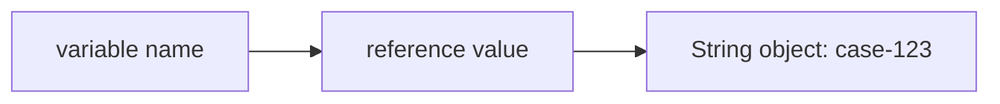
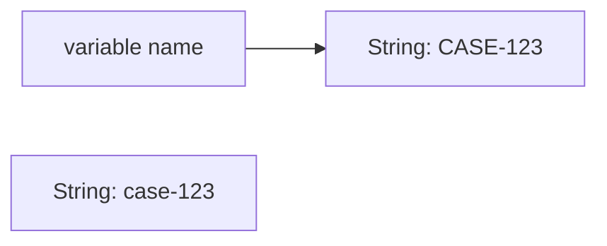
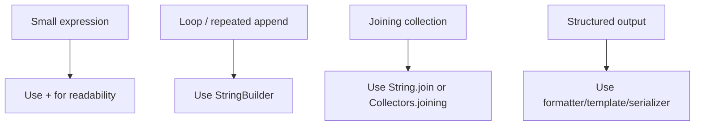

# Part 021 — String, StringBuilder, StringBuffer & Text Model

> Target part ini: memahami `String` bukan hanya sebagai “tipe teks”, tetapi sebagai immutable reference type dengan identity, equality, pooling, representasi internal, boundary risk, dan cost model. Kita juga akan membedakan kapan memakai `String`, `StringBuilder`, `StringBuffer`, dan `CharSequence` dalam desain API enterprise.

## 1. Kenapa Text Model Penting?

Di sistem enterprise, text hampir selalu muncul di boundary:

- HTTP request/response.
- JSON/XML payload.
- SQL query dan parameter.
- log, audit trail, trace context.
- user input.
- identifier eksternal.
- policy code, reason code, status code.
- template email/SMS/notification.
- file name dan path.
- message broker payload.

Bug text jarang terlihat sebagai bug tipe pada awalnya. Biasanya muncul sebagai:

- duplicate key karena whitespace atau normalization berbeda.
- authorization bypass karena case-insensitive comparison salah.
- cache miss karena `String` dibandingkan dengan `==`.
- memory pressure karena concatenation atau retention log yang tidak terkontrol.
- PII leak karena `toString()` mencetak terlalu banyak data.
- data corruption karena text/byte boundary salah charset.

Mental model dasar:

```text
String is not just characters.
String is an immutable object representing a sequence of UTF-16 code units,
used as a semantic boundary in APIs.
```

Part ini fokus ke `String` dan builder. Unicode/charset/encoding akan dibahas lebih dalam di Part 022.

## 2. Positioning dalam Framework Kaufman

Dalam gaya Josh Kaufman, skill ini kita pecah menjadi subskill kecil:

| Subskill | Yang Harus Bisa Dilakukan |
|---|---|
| Membaca object semantics | Menentukan kapan `String` baru dibuat, kapan reference sama, kapan value sama |
| Memilih abstraction | Memilih `String`, `StringBuilder`, `StringBuffer`, atau `CharSequence` sesuai boundary |
| Menganalisis cost | Membaca allocation, copying, concatenation, capacity growth, dan memory pressure |
| Menjaga correctness | Menghindari `==`, locale trap, normalization trap, unsafe logging, mutable `CharSequence` |
| Mendesain API | Menentukan apakah API menerima raw string, value object, enum, atau structured type |

Tujuan 20 jam praktik bukan menghafal semua method `String`, tetapi bisa membuat keputusan desain yang benar secara konsisten.

## 3. `String` sebagai Immutable Reference Type

`String` adalah class final dan immutable.

```java
String name = "case-123";
```

Variable `name` menyimpan reference value ke object `String`, bukan menyimpan karakter langsung.



Ketika kita melakukan:

```java
name = name.toUpperCase();
```

object lama tidak berubah. Variable `name` sekarang mengarah ke object lain.



Konsekuensi:

- `String` aman dibagikan antar object karena isinya tidak berubah.
- method seperti `trim`, `replace`, `toLowerCase`, `substring` mengembalikan `String` baru atau object existing yang setara secara internal.
- `final String x` hanya mencegah variable direassign; immutability sudah ada di object `String` itu sendiri.

Contoh bug umum:

```java
String status = " pending ";
status.trim();

if (status.equals("pending")) {
    approve();
}
```

`trim()` tidak mengubah `status`.

Perbaikan:

```java
String status = " pending ";
status = status.trim();

if (status.equals("pending")) {
    approve();
}
```

Rule:

```text
Every String transformation must be captured, returned, or intentionally ignored.
```

## 4. Equality: `equals`, Bukan `==`

`==` pada reference type membandingkan reference identity.

```java
String a = "OPEN";
String b = new String("OPEN");

System.out.println(a == b);      // false, generally
System.out.println(a.equals(b)); // true
```

Untuk text domain, hampir selalu gunakan `equals`.

```java
if ("APPROVED".equals(status)) {
    // null-safe constant-first comparison
}
```

`==` hanya valid jika kita memang sedang bertanya apakah dua reference menunjuk object yang sama. Untuk `String`, itu jarang menjadi domain question.

### 4.1 String Pool dan Interning

String literal dapat mengarah ke pooled/interned string.

```java
String a = "CASE";
String b = "CASE";

System.out.println(a == b); // true, karena literal yang sama biasanya interned
```

Namun jangan menjadikan ini dasar correctness.

```java
String c = new String("CASE");
System.out.println(a == c); // false
```

`intern()` mengembalikan canonical representation dari string pool.

```java
String x = new String("CASE").intern();
String y = "CASE";
System.out.println(x == y); // true
```

Tetapi `intern()` bukan default tool untuk desain domain. Ia berguna pada kasus sangat spesifik seperti deduplication controlled di high-cardinality text, dan tetap perlu profiling.

Rule:

```text
Use equals for semantic equality. Treat interning as an optimization detail,
not a correctness mechanism.
```

## 5. String Literal, Compile-Time Constant, dan Runtime Value

```java
String a = "case";
String b = "ca" + "se";
System.out.println(a == b); // true, compile-time constant folding
```

Karena `"ca"` dan `"se"` keduanya compile-time constant, compiler bisa melipatnya menjadi satu literal.

Namun:

```java
String prefix = "ca";
String c = prefix + "se";
System.out.println(a == c); // false, generally runtime concatenation
```

Correctness tetap pakai:

```java
a.equals(c)
```

Kaitan dengan Part 008:

- `String` literal dapat menjadi constant expression.
- `static final String` yang merupakan compile-time constant bisa di-inline ke class client.
- Mengubah public string constant di library tanpa recompile client dapat menimbulkan binary compatibility surprise.

## 6. Concatenation: Dari Readability ke Cost Model

Concatenation sederhana boleh:

```java
String message = "caseId=" + caseId + ", status=" + status;
```

Untuk beberapa operand dalam satu expression, compiler/JDK modern dapat mengoptimalkan dengan baik.

Masalah muncul di loop:

```java
String csv = "";
for (String item : items) {
    csv += item + ",";
}
```

Karena `String` immutable, setiap iterasi berpotensi membuat object baru dan menyalin konten lama.

Perbaikan:

```java
StringBuilder csv = new StringBuilder();
for (String item : items) {
    if (!csv.isEmpty()) {
        csv.append(',');
    }
    csv.append(item);
}
String result = csv.toString();
```

Atau gunakan API yang lebih semantik:

```java
String result = String.join(",", items);
```

### 6.1 Mental Model Concatenation



Rule:

```text
Use + for local readability. Use builders or joining APIs for repeated accumulation.
```

## 7. `StringBuilder`: Mutable Text Buffer

`StringBuilder` adalah mutable sequence of characters.

```java
StringBuilder sb = new StringBuilder();
sb.append("caseId=");
sb.append(caseId);
sb.append(", status=");
sb.append(status);

String line = sb.toString();
```

Berbeda dari `String`, `StringBuilder` berubah di tempat.

```java
StringBuilder sb = new StringBuilder("A");
String before = sb.toString();

sb.append("B");
String after = sb.toString();

System.out.println(before); // A
System.out.println(after);  // AB
```

### 7.1 Builder Tidak Cocok Disimpan sebagai Field Shared

Anti-pattern:

```java
class AuditLineRenderer {
    private final StringBuilder sb = new StringBuilder();

    String render(AuditEvent event) {
        sb.setLength(0);
        sb.append(event.id()).append('|').append(event.action());
        return sb.toString();
    }
}
```

Masalah:

- Tidak thread-safe.
- State method call sebelumnya bisa bocor jika lupa reset.
- Reentrancy rusak.
- Testing paralel bisa flaky.

Lebih aman:

```java
class AuditLineRenderer {
    String render(AuditEvent event) {
        return new StringBuilder(64)
                .append(event.id())
                .append('|')
                .append(event.action())
                .toString();
    }
}
```

Rule:

```text
StringBuilder is usually a local implementation detail, not part of object state.
```

## 8. Capacity dan Allocation Awareness

`StringBuilder` memiliki capacity. Jika append melebihi capacity, ia perlu memperbesar buffer internal dan menyalin isi.

```java
StringBuilder sb = new StringBuilder(1024);
```

Pre-sizing berguna jika ukuran output dapat diperkirakan.

```java
static String buildCsvLine(List<String> columns) {
    int estimated = columns.stream().mapToInt(String::length).sum()
            + Math.max(0, columns.size() - 1);

    StringBuilder sb = new StringBuilder(estimated);
    for (int i = 0; i < columns.size(); i++) {
        if (i > 0) sb.append(',');
        sb.append(columns.get(i));
    }
    return sb.toString();
}
```

Namun jangan over-engineer pre-sizing untuk string kecil. Fokus pada hot path, loop besar, atau message rendering intensif.

## 9. `StringBuffer`: Mutable dan Synchronized

`StringBuffer` mirip `StringBuilder`, tetapi method pentingnya synchronized.

```java
StringBuffer buffer = new StringBuffer();
buffer.append("A");
buffer.append("B");
```

Gunakan `StringBuffer` ketika:

- API lama membutuhkan `StringBuffer`.
- Ada shared mutable text buffer yang benar-benar harus disinkronisasi di object yang sama.

Namun dalam desain modern, sering lebih baik:

- membuat `StringBuilder` lokal per method.
- menghindari shared mutable buffer.
- menggunakan queue/stream/collector yang lebih jelas ownership-nya.

`StringBuffer` membuat operasi individual synchronized, tetapi tidak otomatis membuat workflow multi-step menjadi atomic secara domain.

```java
if (buffer.length() == 0) {
    buffer.append("first");
}
```

Dua thread bisa sama-sama melihat length 0 sebelum append jika check dan append tidak dibungkus lock yang sama dari sisi caller.

Rule:

```text
StringBuffer gives method-level synchronization, not domain-level consistency.
```

## 10. `CharSequence`: API Flexibility dengan Risiko Mutability

`String`, `StringBuilder`, dan `StringBuffer` mengimplementasikan `CharSequence`.

```java
void write(CharSequence text) {
    // accepts String, StringBuilder, StringBuffer, etc.
}
```

`CharSequence` bagus untuk input sementara yang hanya dibaca langsung.

Namun jangan menyimpan `CharSequence` mentah ke field jika object membutuhkan snapshot.

Anti-pattern:

```java
final class AuditMessage {
    private final CharSequence message;

    AuditMessage(CharSequence message) {
        this.message = message;
    }

    String message() {
        return message.toString();
    }
}
```

Caller bisa melakukan:

```java
StringBuilder sb = new StringBuilder("APPROVED");
AuditMessage msg = new AuditMessage(sb);

sb.setLength(0);
sb.append("DELETED");

System.out.println(msg.message()); // DELETED
```

Perbaikan:

```java
final class AuditMessage {
    private final String message;

    AuditMessage(CharSequence message) {
        this.message = Objects.requireNonNull(message).toString();
    }

    String message() {
        return message;
    }
}
```

Rule:

```text
Accept CharSequence for flexibility. Store String for immutability.
```

## 11. `String` Constructor dan Copy Semantics

Sering terlihat:

```java
String s = new String("hello");
```

Biasanya ini tidak perlu. Literal sudah merupakan `String`.

```java
String s = "hello";
```

Constructor dari `StringBuilder` atau `StringBuffer` membuat snapshot dari isi saat itu.

```java
StringBuilder builder = new StringBuilder("OPEN");
String snapshot = new String(builder);

builder.setLength(0);
builder.append("CLOSED");

System.out.println(snapshot); // OPEN
```

Ini penting untuk boundary: jika menerima mutable char sequence, ubah menjadi `String` untuk snapshot.

## 12. Text Blocks

Text block membantu literal multi-line.

```java
String sql = """
        SELECT id, status, created_at
        FROM cases
        WHERE status = ?
        ORDER BY created_at DESC
        """;
```

Gunakan text block untuk:

- SQL template statis.
- JSON contoh di test.
- XML kecil.
- multiline message template.
- documentation snippet.

Hati-hati:

- indentation semantics.
- trailing newline.
- embedded secrets.
- SQL injection jika text block dipakai untuk concat parameter.

Anti-pattern:

```java
String sql = """
        SELECT * FROM cases WHERE officer = '%s'
        """.formatted(officerName);
```

Lebih aman:

```java
String sql = """
        SELECT * FROM cases WHERE officer = ?
        """;
```

Parameter tetap harus lewat prepared statement atau binding mechanism framework.

## 13. Formatting dan Template Text

`String.format` berguna, tetapi punya cost dan locale implication.

```java
String line = String.format("case=%s status=%s", caseId, status);
```

Untuk hot path logging, lebih umum memakai logger parameterized message:

```java
log.info("case={} status={}", caseId, status);
```

Untuk user-facing text, jangan hardcode string assembly di domain logic.

Anti-pattern:

```java
return "Your case " + caseId + " was rejected because " + reason;
```

Lebih baik pisahkan:

- domain event berisi structured data.
- message template berada di presentation/notification layer.
- localization ditangani oleh message source/resource bundle.

## 14. `String` sebagai Domain Type: Primitive Obsession

Raw `String` terlalu fleksibel.

```java
void assign(String caseId, String officerId, String reasonCode) { }
```

Semua parameter bertipe sama. Caller bisa tertukar.

```java
assign(reasonCode, caseId, officerId); // compile, salah domain
```

Gunakan value object/record kecil:

```java
record CaseId(String value) {
    CaseId {
        Objects.requireNonNull(value);
        if (!value.matches("CASE-[0-9]{8}")) {
            throw new IllegalArgumentException("Invalid case id");
        }
    }
}

record OfficerId(String value) {
    OfficerId {
        Objects.requireNonNull(value);
        if (value.isBlank()) {
            throw new IllegalArgumentException("Officer id must not be blank");
        }
    }
}

record ReasonCode(String value) {
    ReasonCode {
        Objects.requireNonNull(value);
        if (!value.matches("[A-Z_]+")) {
            throw new IllegalArgumentException("Invalid reason code");
        }
    }
}

void assign(CaseId caseId, OfficerId officerId, ReasonCode reasonCode) { }
```

Rule:

```text
Use String for text. Use domain-specific types for identifiers, codes, and constrained values.
```

## 15. Blank, Empty, Null, Missing

Jangan campuradukkan:

| Value | Meaning |
|---|---|
| `null` | tidak ada reference / unknown / not provided, tergantung kontrak |
| `""` | empty string, ada value tapi length 0 |
| `"   "` | whitespace-only string |
| missing field | field tidak dikirim dalam payload |

Java menyediakan:

```java
s.isEmpty(); // length == 0
s.isBlank(); // empty atau hanya whitespace
```

Contoh normalisasi input:

```java
static Optional<String> normalizeUserText(String raw) {
    if (raw == null) {
        return Optional.empty();
    }
    String normalized = raw.strip();
    return normalized.isEmpty() ? Optional.empty() : Optional.of(normalized);
}
```

`strip()` berbeda dari `trim()` karena berbasis Unicode whitespace. Untuk sistem modern, `strip()` sering lebih benar daripada `trim()`.

Namun jangan selalu normalisasi diam-diam. Untuk beberapa domain, whitespace adalah data signifikan:

- password: jangan `trim()` diam-diam.
- legal name: whitespace internal bisa bermakna.
- code field: biasanya perlu canonicalization ketat.
- free text statement: jangan ubah konten tanpa alasan audit.

## 16. Case Conversion dan Locale Trap

```java
String key = input.toLowerCase();
```

Ini memakai default locale. Untuk identifier/protocol/domain code, gunakan `Locale.ROOT`.

```java
String key = input.toLowerCase(Locale.ROOT);
```

Untuk user-facing text, gunakan locale user yang eksplisit.

```java
String display = title.toUpperCase(userLocale);
```

Rule:

```text
Protocol/domain canonicalization uses Locale.ROOT. Human-facing transformation uses explicit user locale.
```

## 17. Splitting, Joining, dan Regex Surprise

`String.split` menerima regex, bukan plain delimiter.

```java
"a.b.c".split("."); // surprising: . means any character
```

Perbaikan:

```java
"a.b.c".split("\\.");
```

Atau gunakan `Pattern.quote` untuk delimiter dinamis:

```java
String[] parts = input.split(Pattern.quote(delimiter));
```

Untuk join:

```java
String csv = String.join(",", values);
```

Untuk stream:

```java
String csv = values.stream()
        .map(String::valueOf)
        .collect(Collectors.joining(","));
```

Jangan membuat CSV production hanya dengan `join` jika value bisa mengandung comma, quote, newline, atau escape rule khusus. Gunakan library CSV.

## 18. `String.valueOf` vs `toString`

```java
String a = object.toString();      // NPE jika object null
String b = String.valueOf(object); // "null" jika object null
```

`String.valueOf` berguna untuk logging atau diagnostic rendering, tetapi jangan pakai `"null"` sebagai domain value tanpa sadar.

```java
String externalId = String.valueOf(request.externalId());
repository.findByExternalId(externalId); // mencari id literal "null"
```

Lebih baik:

```java
String externalId = Objects.requireNonNull(request.externalId(), "externalId");
```

Rule:

```text
String.valueOf is a rendering tool, not a validation tool.
```

## 19. Logging dan PII Boundary

`String` sering menjadi jalan bocor PII.

Anti-pattern:

```java
log.info("request={}", requestBody);
```

Problem:

- body mungkin berisi nama, alamat, nomor identitas, token, password.
- `String` immutable, jadi data sensitif tidak bisa dihapus dari memory secara deterministik.
- log retention sering lebih lama dari data operational.

Lebih aman:

```java
log.info("caseId={} operation={} actorId={}", caseId, operation, actorId);
```

Gunakan redaction object:

```java
record RedactedText(String value) {
    @Override
    public String toString() {
        return "[REDACTED]";
    }
}
```

Namun jangan terlalu percaya `toString()` untuk security. Redaction sebaiknya enforced di logging policy/filter/serializer.

## 20. Secrets dalam `String`

Karena `String` immutable, kita tidak bisa membersihkan isinya secara reliable.

```java
String password = request.password();
```

Untuk secret yang benar-benar sensitif, prefer API yang mendukung mutable buffer atau secret holder yang lifecycle-nya jelas.

```java
char[] password = readPassword();
try {
    authenticate(password);
} finally {
    Arrays.fill(password, '\0');
}
```

Tetapi realitas enterprise:

- banyak framework HTTP/JSON tetap menghasilkan `String`.
- TLS termination, logs, tracing, exception message, dan heap dump juga bisa bocor.
- solusinya bukan hanya `char[]`, tetapi end-to-end secret handling policy.

Rule:

```text
Do not put secrets into String unless framework boundary forces it; if forced,
prevent logging, tracing, caching, and long retention.
```

## 21. Compact Strings dan Internal Representation

Sejak JDK 9, HotSpot mengimplementasikan compact strings: internal storage `String` dapat memakai byte array plus encoding flag untuk menghemat memory saat konten bisa direpresentasikan sebagai Latin-1. Ini adalah implementation detail, bukan kontrak bahasa.

Konsekuensi desain:

- Jangan mengasumsikan `String` selalu menyimpan `char[]`.
- Jangan menggunakan reflection/unsafe untuk mengakses field internal `String`.
- Fokus pada API contract: immutable sequence of characters/code units.

Rule:

```text
Optimize against public semantics and measured behavior, not private String internals.
```

## 22. `substring` dan Retention Myth

Pada JDK lama, `substring` pernah terkenal bisa mempertahankan backing array besar. Di JDK modern, jangan membangun desain berdasarkan detail historis itu.

Yang tetap benar:

- `substring` menghasilkan `String` dengan isi sesuai range.
- range memakai index `char`/UTF-16 code unit, bukan grapheme cluster.
- banyak substring tetap bisa menyebabkan allocation dan memory pressure.

Untuk parsing intensif, pertimbangkan:

- streaming parser.
- `CharSequence` view yang controlled.
- parser library.
- benchmark berbasis JMH.

## 23. API Design: Return `String`, Accept Apa?

Guideline praktis:

| Situation | Prefer |
|---|---|
| Object menyimpan text immutable | `String` field |
| Method menerima text lalu langsung baca | `CharSequence` bisa diterima |
| Method menerima identifier/domain code | value object, bukan raw `String` |
| Method menghasilkan final text | `String` return |
| Internal repeated assembly | local `StringBuilder` |
| Legacy synchronized mutable text | `StringBuffer` hanya jika diperlukan |

Contoh API yang baik:

```java
record CaseComment(String value) {
    CaseComment(CharSequence value) {
        this(snapshotAndValidate(value));
    }

    private static String snapshotAndValidate(CharSequence value) {
        String text = Objects.requireNonNull(value, "value").toString();
        if (text.isBlank()) {
            throw new IllegalArgumentException("Comment must not be blank");
        }
        if (text.length() > 4_000) {
            throw new IllegalArgumentException("Comment too long");
        }
        return text;
    }
}
```

## 24. Text as State vs Text as Representation

Text bisa berarti dua hal:

1. **state/domain data**: `reasonCode`, `caseId`, `policyCode`.
2. **representation/rendering**: audit line, display message, log message.

Jangan simpan rendering sebagai sumber kebenaran jika data structured masih tersedia.

Anti-pattern:

```java
record AuditLog(String message) { }
```

Lebih defensible:

```java
record AuditLog(
        CaseId caseId,
        ActorId actorId,
        AuditAction action,
        Instant occurredAt,
        Map<String, String> attributes
) { }
```

Rendering dilakukan saat query/presentation:

```java
String render(AuditLog log) {
    return "%s %s case %s at %s".formatted(
            log.actorId(), log.action(), log.caseId(), log.occurredAt());
}
```

Rule:

```text
Store structured facts. Render text at the edge.
```

## 25. Failure Mode Catalog

| Failure Mode | Root Cause | Prevention |
|---|---|---|
| `==` string comparison | Membandingkan identity, bukan value | Gunakan `equals`/`equalsIgnoreCase` dengan aturan eksplisit |
| Transformation ignored | `String` immutable | Capture return value |
| Loop concatenation lambat | Repeated allocation/copy | `StringBuilder`, `String.join`, collector |
| Shared `StringBuilder` race | Mutable object disimpan sebagai state | Builder lokal per call |
| `CharSequence` stored | Mutable implementation bocor | Snapshot ke `String` |
| Locale bug | Default locale dipakai untuk domain key | `Locale.ROOT` untuk canonicalization |
| Regex split surprise | Delimiter dianggap regex | Escape atau `Pattern.quote` |
| PII leak | Raw string logging | Structured logging + redaction |
| Secret retention | Secret disimpan di immutable `String` | Secret handling policy, avoid logging/caching |
| Primitive obsession | Banyak `String` untuk domain berbeda | Value object/enum/structured type |

## 26. Review Checklist

Gunakan checklist ini saat code review:

- Apakah `String` dibandingkan dengan `equals`, bukan `==`?
- Apakah hasil `trim`/`strip`/`replace`/`toLowerCase` ditangkap?
- Apakah concat di loop memakai builder/joining API?
- Apakah `StringBuilder` hanya local dan tidak shared?
- Apakah `CharSequence` disnapshot sebelum disimpan?
- Apakah domain identifier/code masih raw `String` padahal bisa value object?
- Apakah case conversion memakai locale eksplisit?
- Apakah `split` sengaja memakai regex?
- Apakah text block digunakan tanpa mencampur SQL/command injection?
- Apakah log message berpotensi mencetak PII/secret?
- Apakah empty/blank/null/missing dibedakan secara kontrak?
- Apakah rendering text dipisahkan dari domain facts?

## 27. Latihan Deliberate Practice

### Latihan 1 — Refactor Raw String Parameters

Ubah API ini:

```java
void reject(String caseId, String officerId, String reasonCode, String comment) { }
```

Menjadi API dengan:

- `CaseId`.
- `OfficerId`.
- `ReasonCode`.
- `CaseComment`.

Tambahkan validasi di constructor masing-masing.

### Latihan 2 — Fix Mutable `CharSequence` Leak

Temukan bug:

```java
record Notification(CharSequence body) { }
```

Buat versi yang menyimpan snapshot immutable.

### Latihan 3 — Build Audit Line Efficiently

Buat renderer audit line untuk 10.000 event. Bandingkan:

- `+` di loop.
- `StringBuilder`.
- `String.join` setelah map ke list.

Jangan tebak performa. Ukur.

### Latihan 4 — Locale-Safe Canonicalization

Buat function:

```java
String canonicalCode(String raw)
```

Kontrak:

- reject null.
- strip whitespace.
- reject blank.
- convert uppercase dengan locale yang benar untuk domain code.
- hanya izinkan `[A-Z0-9_]+`.

## 28. Mini Case Study: Regulatory Reason Code

Misal sistem menerima reason code dari UI:

```json
{
  "reasonCode": " late_submission "
}
```

Naive approach:

```java
String reasonCode = request.reasonCode().trim().toUpperCase();
```

Masalah:

- `trim()` ASCII-ish, bukan Unicode-aware.
- `toUpperCase()` memakai default locale.
- raw string bisa bocor ke domain tanpa validasi.
- tidak ada semantic type.

Lebih baik:

```java
record ReasonCode(String value) {
    ReasonCode {
        Objects.requireNonNull(value, "value");
        value = value.strip().toUpperCase(Locale.ROOT);
        if (!value.matches("[A-Z0-9_]+")) {
            throw new IllegalArgumentException("Invalid reason code");
        }
    }

    static ReasonCode parse(String raw) {
        return new ReasonCode(raw);
    }
}
```

Lalu domain menerima:

```java
void rejectCase(CaseId caseId, OfficerId officerId, ReasonCode reasonCode) { }
```

Keuntungan:

- canonicalization terpusat.
- invalid value gagal di boundary.
- parameter tidak mudah tertukar.
- audit lebih defensible.

## 29. Kesimpulan

`String` adalah tipe yang terlihat sederhana tetapi berada di hampir semua boundary sistem. Engineer senior tidak hanya tahu method `String`, tetapi memahami:

- `String` immutable dan reference-based.
- equality harus semantic, bukan identity.
- builder adalah implementation detail lokal untuk assembly.
- `CharSequence` fleksibel tetapi bisa mutable.
- raw string sering perlu dinaikkan menjadi value object.
- text rendering harus dipisahkan dari structured domain facts.
- logging dan secret handling harus treated as data governance boundary.

Mental model final:

```text
String is the safest representation for immutable text,
but not always the safest representation for domain meaning.
```

## 30. Referensi Resmi

- Java SE 25 API — `String`
- Java SE 25 API — `StringBuilder`
- Java SE 25 API — `StringBuffer`
- Java SE 25 API — `CharSequence`
- JLS Java SE 25 — Literals, string literals, text blocks, and string conversion
- OpenJDK JEP 254 — Compact Strings
- OpenJDK JEP 280 — Indify String Concatenation
