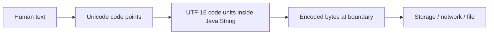
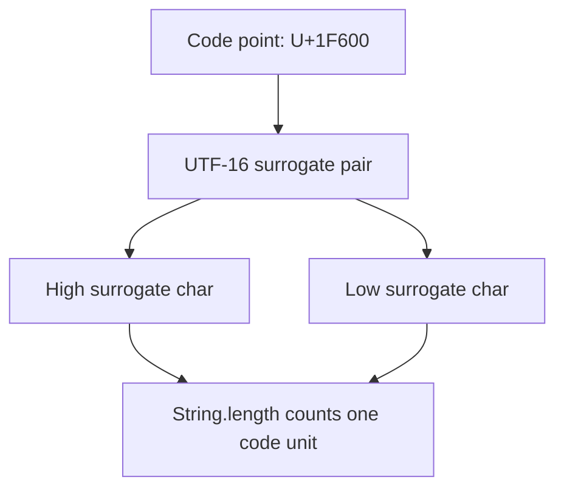
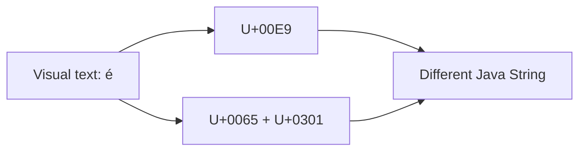

# Part 022 — Unicode, Charset, Encoding & Text Boundaries

> Target part ini: memahami perbedaan text, character, code point, code unit, glyph, grapheme cluster, charset, encoding, bytes, dan normalization. Fokusnya bukan teori Unicode murni, tetapi correctness di boundary Java enterprise: HTTP, JSON, file, database, message broker, logs, search, identity, dan audit.

## 1. Masalah Fundamental

Banyak engineer memperlakukan text seperti ini:

```text
text == array of char == array of bytes
```

Itu salah.

Model yang lebih benar:



Di Java:

- `String` merepresentasikan sequence of UTF-16 code units.
- `char` adalah 16-bit code unit, bukan selalu “satu karakter manusia”.
- byte boundary membutuhkan charset eksplisit.
- Unicode equality tidak selalu sama dengan Java `String.equals` jika normalization berbeda.

Core rule:

```text
Text correctness fails when we confuse user-perceived characters,
Unicode code points, UTF-16 code units, and encoded bytes.
```

## 2. Positioning dalam Framework Kaufman

Subskill yang harus dikuasai:

| Subskill | Kemampuan Praktis |
|---|---|
| Unicode mental model | Menjelaskan perbedaan code point, code unit, grapheme cluster |
| Java string indexing | Menghindari bug karena `length()` dan `charAt()` berbasis UTF-16 code unit |
| Charset boundary | Selalu encode/decode dengan charset eksplisit |
| Error handling | Menentukan apakah invalid byte harus reject, replace, atau report |
| Normalization | Menentukan kapan text harus NFC/NFD/canonicalized |
| Locale correctness | Memisahkan domain canonicalization dari human language behavior |
| Enterprise boundary | Mendesain kontrak API/DB/file/message yang tidak merusak text |

## 3. Vocabulary yang Harus Rapi

| Istilah | Arti Praktis |
|---|---|
| Character | Istilah ambigu; bisa berarti huruf manusia, code point, atau code unit tergantung konteks |
| Code point | Nomor Unicode abstract, misalnya U+0041 untuk `A` |
| Code unit | Unit storage encoding; di UTF-16 ukurannya 16 bit |
| `char` Java | 16-bit unsigned value, satu UTF-16 code unit |
| Surrogate pair | Dua UTF-16 code unit untuk merepresentasikan satu code point di luar BMP |
| Grapheme cluster | Satu karakter yang dirasakan user, bisa terdiri dari beberapa code point |
| Glyph | Bentuk visual yang dirender font |
| Charset | Mapping antara Unicode characters/code units dan bytes |
| Encoding | Proses merepresentasikan text sebagai bytes dengan charset tertentu |
| Decoding | Proses membaca bytes menjadi text dengan charset tertentu |
| Normalization | Mengubah representasi Unicode menjadi bentuk canonical/compatible tertentu |

Jika vocabulary ini kacau, API design ikut kacau.

## 4. Java `char` Bukan “Karakter Manusia”

```java
String s = "A";
System.out.println(s.length());  // 1
System.out.println(s.charAt(0)); // A
```

Ini terlihat sederhana.

Sekarang gunakan emoji:

```java
String s = "😀";
System.out.println(s.length()); // 2
System.out.println(s.codePointCount(0, s.length())); // 1
```

Kenapa `length()` bernilai 2? Karena emoji tersebut direpresentasikan sebagai surrogate pair di UTF-16.



Rule:

```text
String.length() counts UTF-16 code units, not user-perceived characters.
```

## 5. `charAt` dan Surrogate Pair

Anti-pattern:

```java
String s = "😀";
char first = s.charAt(0);
System.out.println(first); // bukan emoji lengkap
```

Gunakan code point API:

```java
String s = "😀";
int cp = s.codePointAt(0);
System.out.println(Integer.toHexString(cp)); // 1f600
```

Iterasi code point:

```java
String text = "A😀B";
text.codePoints().forEach(cp -> {
    System.out.println(Integer.toHexString(cp));
});
```

Atau manual:

```java
for (int i = 0; i < text.length(); ) {
    int cp = text.codePointAt(i);
    System.out.println(Integer.toHexString(cp));
    i += Character.charCount(cp);
}
```

Rule:

```text
Use char-level APIs only when you intentionally operate on UTF-16 code units.
```

## 6. Code Point Bukan Grapheme Cluster

Code point juga belum tentu sama dengan “satu karakter yang dilihat user”.

Contoh:

```java
String e1 = "é";        // precomposed: U+00E9
String e2 = "e\u0301"; // e + combining acute accent

System.out.println(e1.equals(e2)); // false
System.out.println(e1.length());   // 1
System.out.println(e2.length());   // 2
```

Secara visual keduanya bisa tampak sama: `é`.

Model:



Untuk user-perceived character boundaries, problemnya lebih kompleks:

- emoji dengan skin tone modifier.
- family emoji dengan zero-width joiner.
- huruf + combining marks.
- flag emoji yang terdiri dari regional indicators.

Jika domain membutuhkan grapheme-aware counting/truncation/display, jangan hanya pakai `length()` atau `substring()`.

## 7. Safe Truncation

Anti-pattern:

```java
String shortText = text.substring(0, 10);
```

Risiko:

- memotong surrogate pair.
- memotong combining mark.
- menghasilkan tampilan rusak.
- membuat text invalid secara semantik walau Java `String` masih object valid.

Lebih baik untuk code point boundary:

```java
static String truncateByCodePoints(String text, int maxCodePoints) {
    Objects.requireNonNull(text, "text");
    if (maxCodePoints < 0) {
        throw new IllegalArgumentException("maxCodePoints must be >= 0");
    }
    int count = text.codePointCount(0, text.length());
    if (count <= maxCodePoints) {
        return text;
    }
    int end = text.offsetByCodePoints(0, maxCodePoints);
    return text.substring(0, end);
}
```

Untuk grapheme cluster boundary, gunakan library atau API text boundary yang memang dirancang untuk internationalized text. Jangan membuat parser Unicode sendiri kecuali memang domain library Anda.

## 8. Normalization

Unicode memungkinkan beberapa representasi untuk text yang tampak sama.

```java
String composed = "é";
String decomposed = "e\u0301";

System.out.println(composed.equals(decomposed)); // false
```

Gunakan `java.text.Normalizer`:

```java
String a = Normalizer.normalize(composed, Normalizer.Form.NFC);
String b = Normalizer.normalize(decomposed, Normalizer.Form.NFC);

System.out.println(a.equals(b)); // true
```

Empat bentuk umum:

| Form | Meaning Praktis |
|---|---|
| NFC | Canonical composition; sering cocok untuk storage/search equality umum |
| NFD | Canonical decomposition; sering muncul di beberapa filesystem/input |
| NFKC | Compatibility composition; lebih agresif, bisa mengubah semantic appearance |
| NFKD | Compatibility decomposition; lebih agresif lagi |

Jangan sembarang memakai NFKC/NFKD untuk data legal atau identifier tanpa threat model, karena compatibility normalization dapat menyamakan karakter yang secara domain mungkin harus dibedakan.

Rule:

```text
Normalize intentionally at boundary. Do not normalize blindly inside core domain.
```

## 9. Case Folding, Case Conversion, dan Locale

```java
String key = input.toLowerCase();
```

Ini memakai default locale.

Untuk machine/domain identifier:

```java
String key = input.toLowerCase(Locale.ROOT);
```

Untuk user-facing display:

```java
String title = input.toUpperCase(userLocale);
```

Case-insensitive comparison:

```java
boolean same = a.equalsIgnoreCase(b);
```

Namun untuk security-sensitive identifier, lebih baik canonicalize sekali dengan aturan eksplisit lalu bandingkan canonical representation.

```java
record UsernameKey(String value) {
    UsernameKey {
        Objects.requireNonNull(value, "value");
        value = Normalizer.normalize(value.strip(), Normalizer.Form.NFC)
                .toLowerCase(Locale.ROOT);
        if (value.isBlank()) {
            throw new IllegalArgumentException("blank username");
        }
    }
}
```

Untuk username global production, ini masih belum cukup. Anda perlu policy tentang allowed scripts, confusables, spoofing, dan display name vs login key.

## 10. Confusable Characters dan Spoofing

Unicode punya banyak karakter yang terlihat mirip.

Contoh konseptual:

```text
A  Latin capital A
А  Cyrillic capital A
```

Keduanya bisa terlihat mirip tetapi code point berbeda.

Risiko:

- user impersonation.
- phishing identifier.
- duplicate account yang terlihat sama.
- policy code yang tampak valid tapi bukan ASCII.

Untuk machine identifiers, gunakan whitelist ketat.

```java
static String canonicalAsciiCode(String raw) {
    String value = Objects.requireNonNull(raw, "raw")
            .strip()
            .toUpperCase(Locale.ROOT);

    if (!value.matches("[A-Z0-9_]+")) {
        throw new IllegalArgumentException("Invalid code");
    }
    return value;
}
```

Rule:

```text
Human names can be Unicode-rich. Machine codes should usually be restricted and canonicalized.
```

## 11. Charset: Boundary antara Text dan Bytes

`String` adalah text. `byte[]` adalah bytes. Untuk berpindah, butuh charset.

Anti-pattern:

```java
byte[] bytes = text.getBytes();
String decoded = new String(bytes);
```

Ini memakai default charset environment. Jangan bergantung pada default untuk kontrak data.

Gunakan charset eksplisit:

```java
byte[] bytes = text.getBytes(StandardCharsets.UTF_8);
String decoded = new String(bytes, StandardCharsets.UTF_8);
```

Rule:

```text
Every text-byte boundary must name its charset explicitly.
```

## 12. StandardCharsets

Gunakan constants:

```java
StandardCharsets.UTF_8
StandardCharsets.UTF_16
StandardCharsets.ISO_8859_1
StandardCharsets.US_ASCII
```

Untuk sistem modern, default kontrak eksternal biasanya sebaiknya UTF-8, kecuali protokol/legacy system menyatakan lain.

Contoh file write:

```java
Files.writeString(path, content, StandardCharsets.UTF_8);
```

Contoh file read:

```java
String content = Files.readString(path, StandardCharsets.UTF_8);
```

Contoh stream:

```java
try (Reader reader = new InputStreamReader(inputStream, StandardCharsets.UTF_8)) {
    // read text
}
```

## 13. Encoding dan Decoding Error

Tidak semua byte sequence valid untuk charset tertentu.

Naive:

```java
String text = new String(bytes, StandardCharsets.UTF_8);
```

Constructor ini dapat mengganti malformed input dengan replacement character, tergantung mekanisme decode. Untuk data yang harus strict, gunakan decoder dengan error action.

```java
CharsetDecoder decoder = StandardCharsets.UTF_8.newDecoder()
        .onMalformedInput(CodingErrorAction.REPORT)
        .onUnmappableCharacter(CodingErrorAction.REPORT);

try {
    String text = decoder.decode(ByteBuffer.wrap(bytes)).toString();
} catch (CharacterCodingException e) {
    throw new IllegalArgumentException("Invalid UTF-8 payload", e);
}
```

Pilih policy:

| Boundary | Suggested Policy |
|---|---|
| Regulated audit input | Reject/report invalid bytes |
| User free-text import | Report with row/field error; jangan silent corruption |
| Logging fallback | Replacement bisa diterima jika original bytes tidak critical |
| Security token | Reject strict |
| Legacy migration | Track replacement count dan source record |

Rule:

```text
Replacement is a data-loss policy. Use it only when data loss is acceptable and observable.
```

## 14. Byte Order Mark dan UTF-8

Beberapa file text memiliki BOM. UTF-8 tidak membutuhkan BOM, tetapi file dari beberapa tools bisa menyertakannya.

Gejala:

```text
first header becomes "\uFEFFid" instead of "id"
```

Contoh handling sederhana:

```java
static String removeUtf8BomIfPresent(String text) {
    if (!text.isEmpty() && text.charAt(0) == '\uFEFF') {
        return text.substring(1);
    }
    return text;
}
```

Jangan hapus `U+FEFF` secara global di seluruh text tanpa alasan. Treat sebagai boundary concern di awal file/payload.

## 15. HTTP, JSON, dan Charset Contract

Untuk HTTP text payload, kontrak harus eksplisit.

Contoh response header:

```text
Content-Type: application/json; charset=utf-8
```

JSON modern secara praktik sangat erat dengan Unicode/UTF-8, tetapi boundary implementation tetap harus konsisten:

- request body dibaca dengan charset yang benar.
- response body di-encode dengan charset yang benar.
- signature/hash dihitung atas bytes canonical yang disepakati, bukan atas `String` ambigu.

Anti-pattern:

```java
String payload = requestBodyAsString();
byte[] signed = payload.getBytes(); // default charset
```

Perbaikan:

```java
byte[] signed = payload.getBytes(StandardCharsets.UTF_8);
```

Atau lebih baik, sign original bytes jika protokol mensyaratkan byte-exact signature.

## 16. Database Boundary

Database text correctness bergantung pada:

- column type.
- database encoding/collation.
- JDBC driver behavior.
- normalization policy.
- case sensitivity/collation.
- index length limit.

Java side saja tidak cukup.

Contoh bug:

```java
String a = "é";
String b = "e\u0301";
```

Java `equals` false. Database collation tertentu bisa menganggap sama atau berbeda. Index unique bisa behave berbeda dari service validation.

Rule:

```text
Service equality, database equality, and search equality must be intentionally aligned.
```

Checklist DB:

- Apakah DB memakai UTF-8 compatible encoding?
- Apakah collation case-sensitive atau case-insensitive?
- Apakah accent-sensitive atau accent-insensitive?
- Apakah service melakukan normalization sebelum persist?
- Apakah unique constraint mengikuti canonical form yang sama?
- Apakah max length dihitung bytes, chars, code points, atau DB-specific units?

## 17. Length: Character Count, Code Point Count, Byte Count

`String.length()` bukan byte count.

```java
String s = "é😀";

int codeUnits = s.length();
int codePoints = s.codePointCount(0, s.length());
int utf8Bytes = s.getBytes(StandardCharsets.UTF_8).length;
```

Ketiganya bisa berbeda.

| Requirement | Ukur Dengan |
|---|---|
| Java internal index | UTF-16 code unit index |
| Unicode scalar count | `codePointCount` |
| Payload/network/storage limit | encoded byte length |
| User-visible character limit | grapheme cluster aware logic |
| DB varchar limit | sesuai DB semantics |

Anti-pattern:

```java
if (comment.length() <= 255) {
    save(comment);
}
```

Pertanyaan yang benar:

```text
255 what? UTF-16 code units? code points? bytes? grapheme clusters? DB characters?
```

## 18. Designing Length Constraints

Untuk comment field:

```java
record CaseComment(String value) {
    private static final int MAX_CODE_POINTS = 2_000;
    private static final int MAX_UTF8_BYTES = 8_000;

    CaseComment {
        Objects.requireNonNull(value, "value");
        value = Normalizer.normalize(value.strip(), Normalizer.Form.NFC);

        if (value.isBlank()) {
            throw new IllegalArgumentException("blank comment");
        }
        if (value.codePointCount(0, value.length()) > MAX_CODE_POINTS) {
            throw new IllegalArgumentException("comment too long");
        }
        if (value.getBytes(StandardCharsets.UTF_8).length > MAX_UTF8_BYTES) {
            throw new IllegalArgumentException("comment exceeds byte limit");
        }
    }
}
```

Ini lebih defensible daripada hanya `value.length() <= 2000`.

## 19. Filesystem Boundary

File name dan path punya Unicode/normalization/case behavior yang berbeda antar OS/filesystem.

Risiko:

- file yang terlihat sama tetapi berbeda Unicode form.
- case-insensitive filesystem vs case-sensitive server.
- path traversal dengan karakter aneh.
- log sulit dibaca karena control characters.

Guideline:

- Jangan gunakan raw user text langsung sebagai file name.
- Generate server-side safe name.
- Simpan original display name sebagai metadata.
- Normalize dan validate path segment.
- Gunakan `Path` API, bukan string concatenation untuk path.

Contoh:

```java
Path target = baseDir.resolve(safeGeneratedName).normalize();
if (!target.startsWith(baseDir)) {
    throw new SecurityException("Invalid path");
}
```

## 20. Control Characters

Text input bisa mengandung control characters:

- newline.
- carriage return.
- tab.
- escape.
- null-like character.
- bidirectional control characters.

Risiko:

- log injection.
- CSV injection.
- terminal escape injection.
- misleading source/display.
- audit trail confusion.

Contoh log injection:

```java
String user = "alice\nrole=admin";
log.info("user={}", user);
```

Log bisa terlihat seperti dua field berbeda.

Mitigation:

```java
static String singleLineForLog(String raw) {
    return raw
            .replace("\r", "\\r")
            .replace("\n", "\\n")
            .replace("\t", "\\t");
}
```

Untuk high-security logs, gunakan structured logging encoder yang melakukan escaping otomatis.

## 21. CSV, XML, HTML, SQL: Encoding Bukan Escaping

Charset encoding menjawab:

```text
How do we turn text into bytes?
```

Escaping menjawab:

```text
How do we represent text safely inside another syntax?
```

Jangan campur.

Contoh HTML:

```java
String html = "<p>" + userInput + "</p>"; // unsafe
```

Masalahnya bukan UTF-8. Masalahnya HTML escaping.

Contoh SQL:

```java
String sql = "SELECT * FROM users WHERE name = '" + name + "'"; // unsafe
```

Masalahnya bukan charset. Masalahnya query construction dan parameter binding.

Rule:

```text
Encoding protects byte representation. Escaping/binding protects syntax context.
```

## 22. Search dan Canonical Text

Search biasanya membutuhkan canonicalization berbeda dari storage.

Storage:

```text
Preserve original user text as entered, possibly normalized minimally.
```

Search key:

```text
Normalize + case fold + remove accents? Depends on product/domain.
```

Contoh:

```java
record PersonName(String display, String searchKey) {
    static PersonName of(String raw) {
        String display = Normalizer.normalize(raw.strip(), Normalizer.Form.NFC);
        String searchKey = Normalizer.normalize(display, Normalizer.Form.NFD)
                .replaceAll("\\p{M}+", "")
                .toLowerCase(Locale.ROOT);
        return new PersonName(display, searchKey);
    }
}
```

Catatan: remove diacritics bisa salah untuk beberapa bahasa/domain. Gunakan hanya jika requirement jelas.

## 23. Regulatory/Audit Text Boundary

Untuk sistem regulasi, text sering menjadi evidence.

Prinsip:

- Jangan silently mutate user statement.
- Simpan raw input jika dibutuhkan forensik.
- Simpan normalized/canonical form untuk indexing jika perlu.
- Log transformation policy.
- Pastikan rendering audit tidak mengubah makna.

Model:

```java
record CapturedText(
        String raw,
        String normalized,
        Instant capturedAt,
        String source,
        String normalizationPolicyVersion
) { }
```

Dengan model ini, Anda bisa menjawab:

- Apa yang dikirim user?
- Apa yang dipakai sistem untuk search/matching?
- Policy normalisasi versi berapa yang digunakan?
- Apakah ada perubahan perilaku setelah policy berubah?

## 24. Hashing dan Signature Boundary

Hash/signature harus jelas menghitung apa:

- raw bytes dari request?
- decoded string lalu UTF-8 encoded lagi?
- normalized canonical string?
- JSON canonical form?

Contoh bug:

```java
String body = decode(bytes, UTF_8);
String normalized = Normalizer.normalize(body, NFC);
byte[] signed = normalized.getBytes(UTF_8);
```

Ini tidak sama dengan menandatangani original bytes. Untuk signature protocol, gunakan exact byte sequence yang didefinisikan protokol.

Rule:

```text
Sign bytes when protocol is byte-exact.
Sign canonical representation only when canonicalization is part of the protocol.
```

## 25. Designing a Text Boundary Object

Contoh value object untuk external text payload:

```java
record Utf8Text(String value) {
    Utf8Text {
        Objects.requireNonNull(value, "value");
    }

    static Utf8Text decodeStrict(byte[] bytes) {
        Objects.requireNonNull(bytes, "bytes");
        CharsetDecoder decoder = StandardCharsets.UTF_8.newDecoder()
                .onMalformedInput(CodingErrorAction.REPORT)
                .onUnmappableCharacter(CodingErrorAction.REPORT);
        try {
            return new Utf8Text(decoder.decode(ByteBuffer.wrap(bytes)).toString());
        } catch (CharacterCodingException e) {
            throw new IllegalArgumentException("Invalid UTF-8", e);
        }
    }

    byte[] encode() {
        return value.getBytes(StandardCharsets.UTF_8);
    }
}
```

Ini membuat charset policy explicit dan testable.

## 26. Failure Mode Catalog

| Failure Mode | Root Cause | Prevention |
|---|---|---|
| Emoji terpotong | `substring` berbasis code unit | Truncate code point/grapheme-aware |
| Wrong length validation | `length()` dianggap karakter/byte | Tentukan unit limit |
| Mojibake | Decode dengan charset salah | Charset eksplisit |
| Silent replacement | Invalid bytes diganti diam-diam | Decoder `REPORT` untuk boundary strict |
| Duplicate visible key | Normalization berbeda | Normalize canonical key |
| Locale bug | Default locale untuk domain code | `Locale.ROOT` |
| Confusable spoofing | Unicode unrestricted identifier | Whitelist/script policy |
| Signature mismatch | Re-encode string bukan original bytes | Sign agreed byte/canonical form |
| Log injection | Control characters di text | Structured escaping |
| DB equality mismatch | Collation berbeda dari service | Align service/DB/search equality |

## 27. Review Checklist

Gunakan checklist ini saat code review:

- Apakah semua `getBytes()` memakai charset eksplisit?
- Apakah semua `new String(bytes)` memakai charset eksplisit?
- Apakah invalid bytes harus reject, bukan replacement?
- Apakah `String.length()` digunakan untuk limit yang benar?
- Apakah substring/truncate aman untuk surrogate pair?
- Apakah equality perlu normalization?
- Apakah canonicalization memakai `Locale.ROOT` untuk machine key?
- Apakah user-facing text memakai locale user?
- Apakah machine identifier membatasi allowed character set?
- Apakah DB collation/equality sejalan dengan service equality?
- Apakah log/output melakukan escaping control characters?
- Apakah hashing/signature menghitung representation yang benar?
- Apakah raw text dan normalized text perlu disimpan terpisah untuk audit?

## 28. Latihan Deliberate Practice

### Latihan 1 — Detect Length Confusion

Buat test untuk string berikut:

```java
List<String> samples = List.of(
        "A",
        "é",
        "e\u0301",
        "😀",
        "👨‍👩‍👧‍👦"
);
```

Cetak:

- `length()`.
- `codePointCount`.
- UTF-8 byte length.

Jelaskan perbedaannya.

### Latihan 2 — Strict UTF-8 Decoder

Implementasikan:

```java
String decodeUtf8Strict(byte[] bytes)
```

Kontrak:

- reject null.
- reject malformed input.
- tidak silently replace invalid bytes.

### Latihan 3 — Canonical Domain Code

Implementasikan:

```java
record DomainCode(String value) { }
```

Kontrak:

- strip.
- uppercase `Locale.ROOT`.
- normalize NFC.
- hanya allow `[A-Z0-9_]+`.
- reject blank.

### Latihan 4 — Audit Captured Text

Modelkan object:

```java
CapturedText(raw, normalized, policyVersion, capturedAt)
```

Buat method factory yang tidak menghilangkan raw input.

## 29. Mini Case Study: Import CSV Regulasi

Scenario:

- File CSV dikirim oleh lembaga eksternal.
- Harus UTF-8 strict.
- Header pertama kadang punya BOM.
- Field `reason_code` harus ASCII uppercase.
- Field `comment` boleh Unicode dan harus disimpan untuk audit.

Boundary design:

```java
record ImportedRow(
        ReasonCode reasonCode,
        CapturedText comment
) { }
```

Decoder:

```java
String fileText = decodeUtf8Strict(bytes);
fileText = removeUtf8BomIfPresent(fileText);
```

Reason code:

```java
record ReasonCode(String value) {
    ReasonCode {
        Objects.requireNonNull(value, "value");
        value = Normalizer.normalize(value.strip(), Normalizer.Form.NFC)
                .toUpperCase(Locale.ROOT);
        if (!value.matches("[A-Z0-9_]+")) {
            throw new IllegalArgumentException("Invalid reason code");
        }
    }
}
```

Comment:

```java
record CapturedText(String raw, String normalized, String policyVersion) {
    static CapturedText capture(String raw) {
        Objects.requireNonNull(raw, "raw");
        String normalized = Normalizer.normalize(raw, Normalizer.Form.NFC);
        return new CapturedText(raw, normalized, "unicode-nfc-v1");
    }
}
```

Keuntungan:

- CSV bytes tidak silently rusak.
- reason code aman sebagai machine identifier.
- comment tetap mempertahankan raw evidence.
- normalization policy auditable.

## 30. Kesimpulan

Java text correctness membutuhkan pemisahan mental model:

```text
human text != Unicode code point != UTF-16 code unit != encoded byte
```

Engineer top-tier tidak hanya memakai `String`, tetapi bisa menjawab:

- unit length apa yang sedang diukur?
- representation apa yang sedang dibandingkan?
- charset apa yang dipakai di boundary?
- invalid bytes harus ditolak atau diganti?
- normalization dilakukan kapan dan untuk field apa?
- apakah identifier ini boleh Unicode penuh atau harus restricted?
- apakah audit membutuhkan raw text dan normalized text terpisah?

Rule final:

```text
Text is data with representation layers. Make every layer explicit at system boundaries.
```

## 31. Referensi Resmi

- Java SE 25 API — `String`
- Java SE 25 API — `Character`
- Java SE 25 API — `java.nio.charset`
- Java SE 25 API — `StandardCharsets`
- Java SE 25 API — `CharsetDecoder`, `CharsetEncoder`, `CodingErrorAction`
- Java SE 25 API — `java.text.Normalizer`
- JLS Java SE 25 — Lexical Structure and Unicode input
- Unicode Standard Annex #15 — Unicode Normalization Forms
