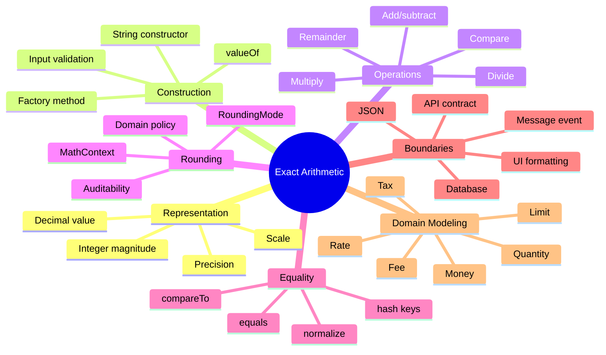
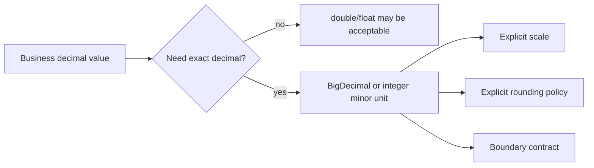
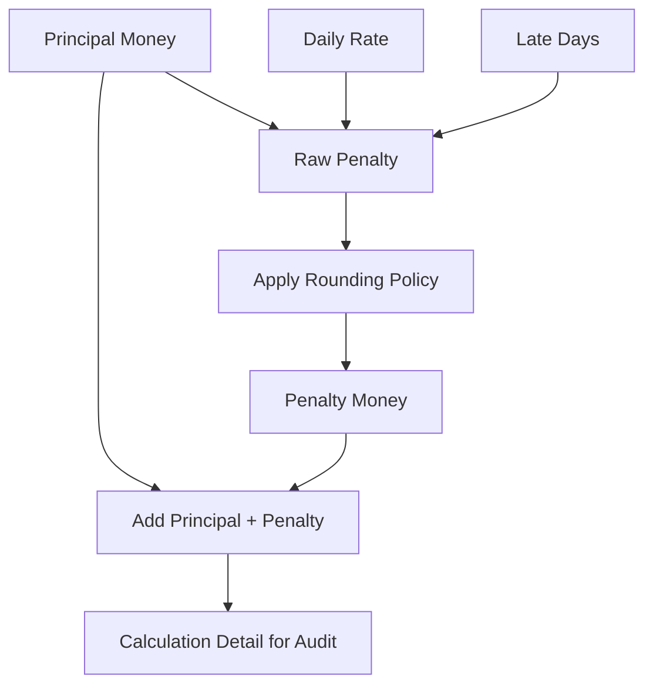
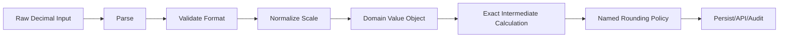

# Part 023 — BigDecimal, BigInteger & Exact Arithmetic

> Target part ini: memahami kapan Java primitive numeric type tidak cukup, bagaimana `BigDecimal` dan `BigInteger` bekerja secara semantik, dan bagaimana mendesain numeric domain yang defensible untuk uang, pajak, denda, rate, kuantitas, limit, scoring, dan audit.

Part ini bukan sekadar “pakai `BigDecimal` untuk uang”. Itu terlalu dangkal. Engineer senior harus tahu:

- kenapa `double` gagal untuk decimal business value;
- apa bedanya **precision**, **scale**, **rounding**, dan **representation**;
- kenapa `new BigDecimal(0.1)` hampir selalu salah;
- kenapa `BigDecimal.equals()` dapat mengejutkan;
- kenapa `divide()` bisa melempar `ArithmeticException`;
- kapan `BigInteger` tepat, dan kapan justru membuat model buruk;
- bagaimana membuat policy rounding yang eksplisit dan bisa diaudit.

---

## 1. Kaufman Skill Map

Mengikuti pendekatan Josh Kaufman, kita pecah skill “exact arithmetic” menjadi subskill yang bisa dilatih cepat.



### Latihan 20 Jam yang Relevan

Untuk topik ini, deliberate practice tidak perlu berupa 20 jam membaca dokumentasi. Latihan yang tepat:

| Jam | Fokus | Output |
|---:|---|---|
| 1–2 | `BigDecimal` construction | Buat daftar input valid/invalid dan hasil representasi |
| 3–4 | scale/precision | Eksperimen `scale()`, `precision()`, `stripTrailingZeros()` |
| 5–6 | rounding | Implement `MoneyPolicy` dengan beberapa rounding mode |
| 7–8 | equality trap | Uji `equals`, `compareTo`, `HashSet`, `TreeSet` |
| 9–10 | division trap | Uji non-terminating decimal expansion |
| 11–12 | DB boundary | Mapping `DECIMAL(p,s)` ke domain object |
| 13–14 | JSON boundary | Pastikan angka tidak berubah jadi floating point di frontend |
| 15–16 | domain modeling | Buat `Money`, `Rate`, `Quantity`, `Percentage` |
| 17–18 | failure modeling | Simulasi bug rounding pajak dan audit mismatch |
| 19–20 | capstone | Buat pricing/fine calculation engine kecil yang fully tested |

---

## 2. Masalah Fundamental: Binary Floating Point Bukan Decimal Business Arithmetic

`double` adalah binary floating-point. Banyak angka decimal sederhana tidak bisa direpresentasikan persis dalam binary.

```java
double x = 0.1 + 0.2;
System.out.println(x); // 0.30000000000000004
```

Untuk domain seperti uang, pajak, denda, bunga, kuota, fee, dan threshold legal, hasil seperti ini bukan sekadar “tidak cantik”. Ia dapat menjadi defect.

### Model Mental



Gunakan `double` untuk approximate measurement: koordinat, sensor, statistik, machine learning, grafis, probabilitas kasar.

Gunakan `BigDecimal` atau integer minor unit untuk exact business value: uang, pajak, tagihan, settlement, regulatory threshold, scoring yang harus dapat direkonstruksi.

---

## 3. BigDecimal: Apa yang Direpresentasikan?

Secara konsep, `BigDecimal` merepresentasikan angka decimal arbitrary precision dengan dua komponen penting:

```text
unscaled value × 10^(-scale)
```

Contoh:

```java
BigDecimal a = new BigDecimal("123.45");

System.out.println(a.unscaledValue()); // 12345
System.out.println(a.scale());         // 2
System.out.println(a.precision());     // 5
```

Artinya:

```text
12345 × 10^-2 = 123.45
```

### Precision vs Scale

| Konsep | Arti | Contoh `123.45` |
|---|---|---:|
| unscaled value | integer internal | `12345` |
| scale | digit di kanan decimal point | `2` |
| precision | total significant digits | `5` |
| value | nilai numeric | `123.45` |

Precision bukan jumlah digit setelah koma. Scale bukan jumlah digit total.

---

## 4. Konstruksi BigDecimal yang Benar

### 4.1 Gunakan String untuk Decimal Literal

```java
BigDecimal amount = new BigDecimal("0.10");
```

Ini mempertahankan decimal representation yang dimaksud.

### 4.2 Hindari `new BigDecimal(double)`

```java
BigDecimal wrong = new BigDecimal(0.1);
System.out.println(wrong);
// 0.1000000000000000055511151231257827021181583404541015625
```

Masalahnya bukan `BigDecimal` gagal. Masalahnya input `double` sudah membawa approximate binary representation.

### 4.3 `BigDecimal.valueOf(double)` Lebih Aman, Tetapi Tetap Perlu Hati-Hati

```java
BigDecimal better = BigDecimal.valueOf(0.1);
System.out.println(better); // 0.1
```

`valueOf(double)` menggunakan representasi canonical string dari `double`. Ini lebih baik daripada constructor `double`, tetapi untuk domain uang tetap lebih baik menerima input sebagai `String`, integer minor unit, atau parsing formal dari boundary.

### 4.4 Factory Method Domain

Jangan sebarkan konstruksi `BigDecimal` mentah ke seluruh codebase.

```java
public record Money(BigDecimal amount, Currency currency) {
    public Money {
        Objects.requireNonNull(amount, "amount");
        Objects.requireNonNull(currency, "currency");

        if (amount.scale() > currency.defaultFractionDigits()) {
            throw new IllegalArgumentException("Too many fraction digits for " + currency);
        }
    }

    public static Money of(String amount, Currency currency) {
        return new Money(new BigDecimal(amount), currency);
    }
}
```

Yang penting bukan syntax record-nya, tetapi keputusan bahwa boundary decimal dibuat eksplisit.

---

## 5. Scale: Bukan Detail Formatting

Banyak engineer menganggap scale hanya urusan tampilan. Itu salah.

```java
BigDecimal a = new BigDecimal("1.0");
BigDecimal b = new BigDecimal("1.00");

System.out.println(a.scale()); // 1
System.out.println(b.scale()); // 2
```

Secara numeric, keduanya sama. Secara representasi, keduanya berbeda.

### Scale Bisa Bermakna Domain

| Domain | Scale Bermakna? | Contoh |
|---|---:|---|
| Money | ya | USD biasanya 2, JPY 0 |
| Interest rate | ya | 0.0525 = 5.25% |
| Tax percentage | ya | 11.00% vs 11% dapat bermakna audit berbeda |
| Scientific measurement | ya | precision measurement |
| UI display | ya, tapi tidak boleh mencampur domain arithmetic |

### Normalize dengan Hati-Hati

```java
BigDecimal x = new BigDecimal("1.2300");
BigDecimal y = x.stripTrailingZeros();

System.out.println(y);        // 1.23
System.out.println(y.scale()); // 2
```

Tetapi:

```java
BigDecimal z = new BigDecimal("1000").stripTrailingZeros();
System.out.println(z);         // 1E+3
System.out.println(z.scale());  // -3
```

Scale negatif valid. Jangan asumsi scale selalu `>= 0`.

---

## 6. Equality Trap: `equals()` vs `compareTo()`

Ini salah satu jebakan paling mahal.

```java
BigDecimal a = new BigDecimal("1.0");
BigDecimal b = new BigDecimal("1.00");

System.out.println(a.equals(b));    // false
System.out.println(a.compareTo(b)); // 0
```

`equals()` mempertimbangkan value dan scale. `compareTo()` membandingkan nilai numeric.

### Dampak ke Collection

```java
Set<BigDecimal> hashSet = new HashSet<>();
hashSet.add(new BigDecimal("1.0"));
hashSet.add(new BigDecimal("1.00"));

System.out.println(hashSet.size()); // 2

Set<BigDecimal> treeSet = new TreeSet<>();
treeSet.add(new BigDecimal("1.0"));
treeSet.add(new BigDecimal("1.00"));

System.out.println(treeSet.size()); // 1
```

Ini dapat menghasilkan inkonsistensi jika domain tidak menetapkan canonical representation.

### Rule of Thumb

| Kebutuhan | Gunakan |
|---|---|
| Numeric ordering | `compareTo()` |
| Zero check | `compareTo(BigDecimal.ZERO) == 0` |
| Hash key stable | canonicalize scale dulu |
| Domain equality | bungkus dalam value object |
| Raw `BigDecimal` sebagai key | hindari kecuali scale policy jelas |

### Contoh Canonical Money

```java
public record Money(BigDecimal amount, Currency currency) {
    public Money {
        Objects.requireNonNull(amount);
        Objects.requireNonNull(currency);

        int scale = currency.defaultFractionDigits();
        amount = amount.setScale(scale, RoundingMode.UNNECESSARY);
    }
}
```

`RoundingMode.UNNECESSARY` berguna sebagai guard: input harus sudah sesuai policy, bukan diam-diam dibulatkan.

---

## 7. Rounding: Policy, Bukan Detail Teknis

Rounding adalah keputusan bisnis.

```java
BigDecimal value = new BigDecimal("10.005");
System.out.println(value.setScale(2, RoundingMode.HALF_UP));   // 10.01
System.out.println(value.setScale(2, RoundingMode.HALF_EVEN)); // 10.00
```

Keduanya valid secara teknis. Yang salah adalah tidak menetapkan policy.

### RoundingMode Umum

| Mode | Ringkas | Kapan Dipakai |
|---|---|---|
| `UP` | menjauh dari zero | penalti konservatif tertentu |
| `DOWN` | menuju zero | truncation eksplisit |
| `CEILING` | menuju positive infinity | minimum charge positif |
| `FLOOR` | menuju negative infinity | lower bound tertentu |
| `HALF_UP` | .5 naik | common commercial rounding |
| `HALF_DOWN` | .5 turun | jarang, tapi explicit |
| `HALF_EVEN` | ke neighbor genap | mengurangi bias agregasi |
| `UNNECESSARY` | tidak boleh rounding | invariant/checking |

### Jadikan Rounding Policy Eksplisit

```java
public enum MoneyRoundingPolicy {
    COMMERCIAL(2, RoundingMode.HALF_UP),
    BANKERS(2, RoundingMode.HALF_EVEN),
    EXACT(2, RoundingMode.UNNECESSARY);

    private final int scale;
    private final RoundingMode roundingMode;

    MoneyRoundingPolicy(int scale, RoundingMode roundingMode) {
        this.scale = scale;
        this.roundingMode = roundingMode;
    }

    public BigDecimal apply(BigDecimal value) {
        return value.setScale(scale, roundingMode);
    }
}
```

### Jangan Membulatkan Terlalu Cepat

```java
// Buruk: rounding setiap baris dapat membuat total meleset.
BigDecimal total = BigDecimal.ZERO;
for (Line line : lines) {
    total = total.add(line.net().multiply(taxRate).setScale(2, HALF_UP));
}

// Lebih defensible: hitung exact intermediate, round pada boundary yang ditentukan policy.
BigDecimal tax = lines.stream()
    .map(line -> line.net().multiply(taxRate))
    .reduce(BigDecimal.ZERO, BigDecimal::add)
    .setScale(2, HALF_UP);
```

Mana yang benar tergantung regulasi/domain. Yang penting: policy-nya eksplisit, diuji, dan diaudit.

---

## 8. MathContext: Precision-Level Rounding

`setScale()` mengatur digit di kanan decimal point.

`MathContext` mengatur precision total dan rounding mode.

```java
BigDecimal x = new BigDecimal("12345.6789");

System.out.println(x.round(new MathContext(5, RoundingMode.HALF_UP)));
// 12346
```

### Scale vs MathContext

| Operasi | Mengatur | Contoh |
|---|---|---|
| `setScale(2, mode)` | fraction digits | money amount |
| `round(new MathContext(5, mode))` | significant digits | scientific/financial precision |
| `divide(divisor, scale, mode)` | result scale | exact decimal output |
| `divide(divisor, mc)` | result precision | approximate decimal with bounded precision |

### Enterprise Rule

Untuk uang biasa, sering lebih jelas memakai `setScale` di boundary. Untuk calculation engine yang memerlukan significant digits, gunakan `MathContext` yang diberi nama domain.

```java
public final class RiskScoreMath {
    public static final MathContext SCORE_CONTEXT = new MathContext(10, RoundingMode.HALF_EVEN);

    private RiskScoreMath() {}
}
```

Jangan buat `new MathContext(10)` tersebar di banyak tempat tanpa nama domain.

---

## 9. Division Trap

Pembagian decimal tidak selalu punya hasil decimal finite.

```java
BigDecimal one = BigDecimal.ONE;
BigDecimal three = new BigDecimal("3");

one.divide(three); // ArithmeticException: Non-terminating decimal expansion
```

Solusinya bukan menangkap exception lalu mengabaikan. Solusinya menetapkan precision/scale/rounding.

```java
BigDecimal result = one.divide(three, 10, RoundingMode.HALF_UP);
System.out.println(result); // 0.3333333333
```

### Checklist Division

Sebelum menulis `.divide(...)`, jawab:

1. Apakah hasil harus exact?
2. Kalau tidak exact, scale output berapa?
3. Rounding mode mana?
4. Apakah divisor bisa zero?
5. Apakah rounding dilakukan per item atau per aggregate?
6. Apakah policy berubah per currency, product, jurisdiction, atau date?

---

## 10. BigInteger: Arbitrary Precision Integer

`BigInteger` merepresentasikan integer arbitrary precision. Ia tepat untuk angka integer yang dapat melampaui `long`.

```java
BigInteger n = new BigInteger("123456789012345678901234567890");
BigInteger squared = n.multiply(n);
```

### Kapan BigInteger Tepat?

| Use Case | Cocok? | Catatan |
|---|---:|---|
| Cryptography primitive | ya | sering sudah dipakai library |
| Very large combinatorics | ya | factorial, binomial, etc. |
| Arbitrary precision counters | kadang | periksa kebutuhan real |
| Database sequence ID | biasanya tidak | `long` sering cukup |
| Money minor unit | kadang | biasanya `long` cukup, tapi domain besar bisa butuh |
| User-facing account number | biasanya tidak | account number sering identifier string, bukan angka |

### Jangan Menggunakan BigInteger Karena Takut Overflow Tanpa Model

Kalau domain punya maximum legal amount, modelkan maximum itu.

```java
public record CaseNumber(String value) {
    public CaseNumber {
        if (!value.matches("[A-Z]{3}-\\d{8}")) {
            throw new IllegalArgumentException("Invalid case number");
        }
    }
}
```

Jangan jadikan identifier sebagai `BigInteger` hanya karena terlihat numeric.

---

## 11. Money Modeling: BigDecimal Saja Tidak Cukup

`BigDecimal` bukan `Money`. Ia hanya angka decimal.

Money minimal punya:

- amount;
- currency;
- scale policy;
- rounding policy;
- arithmetic rules;
- serialization contract;
- equality semantics.

### Buruk

```java
public void charge(BigDecimal amount) {
    // currency? scale? rounding? negative allowed?
}
```

### Lebih Baik

```java
public record Money(BigDecimal amount, Currency currency) {
    public Money {
        Objects.requireNonNull(amount, "amount");
        Objects.requireNonNull(currency, "currency");

        int fractionDigits = currency.defaultFractionDigits();
        amount = amount.setScale(fractionDigits, RoundingMode.UNNECESSARY);
    }

    public static Money of(String amount, Currency currency) {
        return new Money(new BigDecimal(amount), currency);
    }

    public Money plus(Money other) {
        requireSameCurrency(other);
        return new Money(amount.add(other.amount), currency);
    }

    public Money minus(Money other) {
        requireSameCurrency(other);
        return new Money(amount.subtract(other.amount), currency);
    }

    public Money multiply(BigDecimal multiplier, RoundingMode roundingMode) {
        return new Money(
            amount.multiply(multiplier).setScale(currency.defaultFractionDigits(), roundingMode),
            currency
        );
    }

    private void requireSameCurrency(Money other) {
        if (!currency.equals(other.currency)) {
            throw new IllegalArgumentException("Currency mismatch: " + currency + " vs " + other.currency);
        }
    }
}
```

### Currency Scale Tidak Selalu 2

Jangan hardcode `2` sebagai skala global.

```java
Currency usd = Currency.getInstance("USD");
Currency jpy = Currency.getInstance("JPY");

System.out.println(usd.getDefaultFractionDigits()); // 2
System.out.println(jpy.getDefaultFractionDigits()); // 0
```

Namun untuk beberapa domain, currency default fraction digits juga belum cukup. Ada instrumen, crypto asset, loyalty point, komoditas, atau aturan settlement yang punya scale policy sendiri.

---

## 12. Integer Minor Unit Alternative

Untuk money, alternatif populer adalah menyimpan minor unit sebagai `long`.

```java
public record MoneyMinor(long cents, Currency currency) {
    public BigDecimal toMajorUnit() {
        return BigDecimal.valueOf(cents, currency.defaultFractionDigits());
    }
}
```

`BigDecimal.valueOf(long unscaledVal, int scale)` membuat decimal dari unscaled value dan scale.

### BigDecimal vs Minor Unit

| Model | Kelebihan | Risiko |
|---|---|---|
| `BigDecimal` amount | natural untuk decimal business rules | scale/equality/rounding harus disiplin |
| `long` minor unit | exact, cepat, equality sederhana | currency scale, overflow, fractional policy rumit |
| `BigInteger` minor unit | sangat besar | lebih berat, biasanya overkill |
| `double` | cepat, sederhana | tidak cocok untuk exact decimal money |

### Decision Rule

Gunakan minor unit jika:

- semua amount punya fixed minor unit;
- arithmetic relatif sederhana;
- performance dan storage penting;
- tidak banyak intermediate decimal rate.

Gunakan `BigDecimal` jika:

- banyak rate, tax, discount, ratio;
- scale bervariasi;
- audit membutuhkan intermediate decimal;
- input/output business memang decimal.

---

## 13. Percentage, Rate, Ratio: Jangan Disamakan

`0.11`, `11`, dan `11%` sering tercampur.

```java
public record Rate(BigDecimal value) {
    public Rate {
        Objects.requireNonNull(value);
        if (value.compareTo(BigDecimal.ZERO) < 0) {
            throw new IllegalArgumentException("Rate must not be negative");
        }
    }

    public static Rate percent(String percent) {
        return new Rate(new BigDecimal(percent).movePointLeft(2));
    }

    public BigDecimal applyTo(BigDecimal base) {
        return base.multiply(value);
    }
}
```

```java
Rate vat = Rate.percent("11");
BigDecimal tax = vat.applyTo(new BigDecimal("100000"));
System.out.println(tax); // 11000.00 depending scale propagation
```

### Naming Matters

| Nama | Semantik |
|---|---|
| `rate` | multiplier fraction, misalnya `0.11` |
| `percentage` | human-facing percent, misalnya `11%` |
| `basisPoints` | 1/100 of percent |
| `ratio` | relation between two quantities |
| `multiplier` | factor, misalnya `1.11` |

Jangan gunakan `BigDecimal value` tanpa nama domain.

---

## 14. Quantity and Measurement

`BigDecimal` juga sering dipakai untuk quantity: berat, volume, energi, bandwidth, kapasitas, skor.

Masalahnya: angka tanpa unit mudah salah.

```java
public record Quantity(BigDecimal amount, Unit unit) {
    public Quantity {
        Objects.requireNonNull(amount);
        Objects.requireNonNull(unit);
    }
}

enum Unit {
    KILOGRAM,
    GRAM,
    LITER,
    MILLILITER
}
```

Untuk domain besar, unit conversion harus punya policy rounding sendiri.

```java
public Quantity toGram() {
    if (unit != Unit.KILOGRAM) {
        throw new IllegalStateException("Only kilogram supported");
    }
    return new Quantity(amount.multiply(new BigDecimal("1000")), Unit.GRAM);
}
```

---

## 15. Database Boundary

Database decimal type biasanya memiliki precision dan scale.

```sql
amount DECIMAL(19, 4)
```

Artinya biasanya total 19 digit, dengan 4 digit di kanan decimal point.

### Boundary Questions

1. Apakah Java object scale harus sama dengan DB scale?
2. Apakah DB melakukan rounding/truncation diam-diam?
3. Apakah ORM mengubah scale saat membaca?
4. Apakah migration mengubah precision/scale?
5. Apakah query aggregation mengubah scale?
6. Apakah index dan sort sesuai numeric semantics?

### Defensive Mapping

```java
public static BigDecimal requireScale(BigDecimal value, int scale) {
    return value.setScale(scale, RoundingMode.UNNECESSARY);
}
```

Pakai saat masuk domain, bukan setelah data rusak.

```java
Money amount = new Money(requireScale(row.amount(), 2), row.currency());
```

### Jangan Simpan Money Tanpa Currency

```sql
-- Buruk
amount DECIMAL(19, 2) NOT NULL

-- Lebih baik
amount DECIMAL(19, 2) NOT NULL,
currency_code CHAR(3) NOT NULL
```

Namun untuk multi-currency dengan variable scale, desain bisa butuh:

```sql
amount_unscaled NUMERIC(38, 0) NOT NULL,
amount_scale INT NOT NULL,
currency_code CHAR(3) NOT NULL
```

Ini lebih kompleks, tetapi eksplisit.

---

## 16. JSON and API Boundary

JSON number tidak membawa precision/scale policy yang kaya. Banyak JavaScript client juga memakai binary floating point.

### Berbahaya

```json
{
  "amount": 12345678901234567890.12
}
```

Client dapat kehilangan precision.

### Lebih Defensible

```json
{
  "amount": "12345678901234567890.12",
  "currency": "IDR"
}
```

Atau minor unit:

```json
{
  "amountMinor": 1234567890123456789012,
  "scale": 2,
  "currency": "IDR"
}
```

### API Contract Checklist

| Pertanyaan | Harus Dijawab |
|---|---|
| Apakah amount dikirim sebagai string atau number? | eksplisit di schema |
| Scale fixed atau variable? | tulis constraint |
| Rounding dilakukan di client atau server? | server biasanya source of truth |
| Currency wajib? | hampir selalu ya untuk money |
| Apakah trailing zeros dipertahankan? | penting untuk display/audit |
| Apakah exponent notation boleh? | tentukan |

---

## 17. Serialization Trap: Scale and String Form

```java
BigDecimal x = new BigDecimal("1000").stripTrailingZeros();
System.out.println(x.toString());      // 1E+3
System.out.println(x.toPlainString()); // 1000
```

Untuk API human/domain, `toPlainString()` sering lebih aman.

Tapi jangan ubah semua ke string tanpa schema. String value tetap harus punya validation.

```java
public static BigDecimal parsePlainDecimal(String input) {
    if (!input.matches("-?\\d+(\\.\\d+)?")) {
        throw new IllegalArgumentException("Invalid decimal format");
    }
    return new BigDecimal(input);
}
```

Di production, regex decimal harus disesuaikan dengan domain: sign, leading zero, max digit, scale, exponent, locale.

---

## 18. Formatting Bukan Arithmetic

Jangan menggunakan `NumberFormat` untuk arithmetic. Ia untuk rendering/parsing human locale.

```java
NumberFormat format = NumberFormat.getCurrencyInstance(Locale.US);
System.out.println(format.format(new BigDecimal("1234.50")));
```

Parsing human money harus dipisah dari API machine contract.

| Boundary | Format |
|---|---|
| Internal domain | `BigDecimal`/value object |
| Machine API | string decimal canonical atau minor unit |
| Database | DECIMAL/NUMERIC dengan precision/scale |
| UI display | locale-specific formatted text |
| Audit log | canonical decimal + currency + policy metadata |

---

## 19. BigDecimal Performance Model

`BigDecimal` immutable. Setiap operasi menghasilkan object baru.

```java
BigDecimal total = BigDecimal.ZERO;
for (BigDecimal amount : amounts) {
    total = total.add(amount);
}
```

Ini benar, tetapi untuk hot path high-volume, cost-nya perlu diperhatikan.

### Jangan Optimisasi Prematur

Untuk payment, billing, enforcement fine, tax, settlement: correctness biasanya lebih penting daripada micro-performance.

Tetapi pahami cost:

- object allocation;
- arbitrary precision arithmetic;
- scale alignment;
- parsing string;
- serialization/deserialization;
- collection key canonicalization.

### Optimization yang Aman

1. Gunakan minor unit `long` jika domain memungkinkan.
2. Hindari parsing berulang di hot path.
3. Canonicalize di boundary.
4. Simpan constants sebagai `static final BigDecimal` dari string.
5. Hindari `BigDecimal` dalam inner loop numerik approximate.
6. Ukur dengan benchmark, bukan asumsi.

---

## 20. Constants

### Buruk

```java
private static final BigDecimal TAX_RATE = new BigDecimal(0.11);
```

### Baik

```java
private static final BigDecimal TAX_RATE = new BigDecimal("0.11");
private static final BigDecimal ONE_HUNDRED = new BigDecimal("100");
```

Atau:

```java
private static final BigDecimal TAX_RATE = BigDecimal.valueOf(11, 2); // 0.11
```

### Jangan Gunakan `BigDecimal.TEN.divide(...)` Tanpa Policy

```java
BigDecimal ratio = BigDecimal.ONE.divide(new BigDecimal("3"), 10, RoundingMode.HALF_UP);
```

---

## 21. Error Handling

`BigDecimal` bisa melempar:

- `NumberFormatException` saat parsing invalid string;
- `ArithmeticException` saat division non-terminating tanpa rounding;
- `ArithmeticException` saat `RoundingMode.UNNECESSARY` tetapi rounding diperlukan;
- `NullPointerException` jika argument null ke method tertentu;
- `IllegalArgumentException` dari domain wrapper.

### Parsing Boundary

```java
public static Either<ParseError, BigDecimal> parseAmount(String input) {
    try {
        return Either.right(new BigDecimal(input));
    } catch (NumberFormatException ex) {
        return Either.left(new ParseError("Invalid amount"));
    }
}
```

Di Java tanpa Either library, gunakan result object sederhana.

```java
public sealed interface AmountParseResult {
    record Success(BigDecimal value) implements AmountParseResult {}
    record Failure(String message) implements AmountParseResult {}
}
```

---

## 22. Testing Strategy

Exact arithmetic perlu testing yang berbeda dari primitive arithmetic.

### Test Cases Minimal

| Area | Cases |
|---|---|
| Construction | `"0.1"`, `"0.10"`, invalid string, exponent notation |
| Scale | too many fraction digits, trailing zeros, negative scale |
| Equality | `1.0` vs `1.00`, HashSet behavior |
| Rounding | half up/even/down boundary |
| Division | `1/3`, `10/4`, zero divisor |
| Aggregation | round per line vs round total |
| DB | max precision, max scale, overflow |
| JSON | string decimal, large number, exponent notation |
| Negative | refund, reversal, penalty, credit |

### Golden Master untuk Regulatory Calculation

Untuk calculation engine yang diaudit, buat golden case:

```text
input invoice lines
+ policy version
+ rate table version
+ calculation timestamp
= expected output detail
```

Jangan hanya test total. Test intermediate yang diwajibkan audit.

---

## 23. Failure Modes di Production

### 23.1 Floating Point Masuk ke Money

```java
BigDecimal amount = new BigDecimal(request.getAmountAsDouble());
```

Akibat:

- amount berubah sedikit;
- reconciliation mismatch;
- audit log tidak sama dengan input customer;
- rounding error menumpuk.

### 23.2 Scale Tidak Distandarkan

```java
Map<BigDecimal, Rule> rules = new HashMap<>();
rules.put(new BigDecimal("1.0"), ruleA);
rules.get(new BigDecimal("1.00")); // null
```

Akibat:

- rule lookup gagal;
- fee tidak diterapkan;
- discount salah;
- duplicate entry.

### 23.3 Rounding Di Tempat yang Salah

Rounding per item vs per total dapat beda.

```java
BigDecimal rate = new BigDecimal("0.075");
List<BigDecimal> bases = List.of(
    new BigDecimal("0.05"),
    new BigDecimal("0.05"),
    new BigDecimal("0.05")
);
```

Jika setiap line dibulatkan ke 2 decimal, hasil bisa berbeda dari aggregate.

### 23.4 DB Truncation Diam-Diam

Application mengirim `123.4567`, kolom `DECIMAL(10,2)` menyimpan `123.46` atau `123.45` tergantung DB/config.

Akibat:

- application log tidak sama dengan DB;
- dispute sulit diselesaikan;
- replay calculation tidak identik.

### 23.5 JSON Number Precision Loss

Frontend menerima amount besar sebagai number, lalu mengirim balik value yang sudah berubah.

Akibat:

- ID-like numeric amount rusak;
- total tidak match;
- digital signature gagal.

---

## 24. Design Pattern Lokal: Numeric Policy Object

Daripada menyebar `RoundingMode.HALF_UP`, buat policy.

```java
public record DecimalPolicy(
    int scale,
    RoundingMode roundingMode,
    boolean allowNegative
) {
    public BigDecimal normalize(BigDecimal value) {
        Objects.requireNonNull(value, "value");

        BigDecimal normalized = value.setScale(scale, roundingMode);
        if (!allowNegative && normalized.signum() < 0) {
            throw new IllegalArgumentException("Negative value is not allowed");
        }
        return normalized;
    }
}
```

Lalu domain object memakai policy, bukan angka mentah.

```java
public record FineAmount(BigDecimal value) {
    private static final DecimalPolicy POLICY =
        new DecimalPolicy(2, RoundingMode.HALF_UP, false);

    public FineAmount {
        value = POLICY.normalize(value);
    }
}
```

Keuntungan:

- policy bisa diberi nama;
- test lebih mudah;
- audit lebih jelas;
- migration policy bisa dikelola;
- code review lebih mudah.

---

## 25. Type-Driven API Design

Bandingkan dua API berikut.

### Primitive/Raw Decimal API

```java
BigDecimal calculate(BigDecimal base, BigDecimal rate, BigDecimal penalty);
```

Masalah:

- base apa?
- rate decimal atau percent?
- penalty money atau percentage?
- rounding di mana?
- currency apa?

### Type-Driven API

```java
FineAssessment assess(
    PrincipalAmount principal,
    PenaltyRate penaltyRate,
    AssessmentDate assessmentDate,
    Jurisdiction jurisdiction
);
```

Lebih verbose, tetapi constraint menjadi terlihat.

Dalam enterprise system, tipe bukan hanya compile-time safety. Tipe adalah dokumentasi operasional.

---

## 26. Worked Example: Enforcement Fine Calculation

Misal domain:

- base fine dalam currency tertentu;
- daily penalty rate;
- jumlah hari keterlambatan;
- rounding dilakukan pada total penalty, bukan per hari;
- output harus menyimpan calculation detail.

```java
public record PrincipalAmount(Money money) {}

public record DailyPenaltyRate(BigDecimal value) {
    public DailyPenaltyRate {
        Objects.requireNonNull(value);
        if (value.signum() < 0) {
            throw new IllegalArgumentException("Penalty rate must not be negative");
        }
        value = value.setScale(6, RoundingMode.UNNECESSARY);
    }

    public static DailyPenaltyRate percent(String percent) {
        return new DailyPenaltyRate(new BigDecimal(percent).movePointLeft(2));
    }
}

public record FineCalculationDetail(
    Money principal,
    DailyPenaltyRate rate,
    int lateDays,
    Money penalty,
    Money total
) {}
```

```java
public final class FineCalculator {
    public FineCalculationDetail calculate(
        PrincipalAmount principal,
        DailyPenaltyRate rate,
        int lateDays
    ) {
        if (lateDays < 0) {
            throw new IllegalArgumentException("lateDays must not be negative");
        }

        Money base = principal.money();
        BigDecimal rawPenalty = base.amount()
            .multiply(rate.value())
            .multiply(BigDecimal.valueOf(lateDays));

        Money penalty = new Money(
            rawPenalty.setScale(base.currency().defaultFractionDigits(), RoundingMode.HALF_UP),
            base.currency()
        );

        Money total = base.plus(penalty);

        return new FineCalculationDetail(base, rate, lateDays, penalty, total);
    }
}
```

### Diagram Alur Calculation



Yang penting: output tidak hanya total. Output menyimpan detail sehingga calculation bisa dijelaskan.

---

## 27. Review Checklist

Gunakan checklist ini saat review PR yang menyentuh numeric business logic.

### Construction

- [ ] Tidak ada `new BigDecimal(double)`.
- [ ] Decimal literal dibuat dari `String`, `long + scale`, atau validated input.
- [ ] Constants tidak dibuat dari floating point.
- [ ] Input decimal divalidasi di boundary.

### Scale and Precision

- [ ] Scale policy jelas.
- [ ] Precision DB/API/domain konsisten.
- [ ] Tidak ada asumsi scale selalu 2.
- [ ] `stripTrailingZeros()` tidak menyebabkan negative scale bug.

### Equality

- [ ] Tidak menggunakan `equals()` untuk numeric equality kecuali scale memang bagian domain.
- [ ] BigDecimal sebagai map key sudah canonical.
- [ ] Hash-based dan sort-based behavior tidak inkonsisten.

### Rounding

- [ ] Semua division punya rounding/scale/MathContext jika hasil bisa non-terminating.
- [ ] Rounding mode diberi nama domain.
- [ ] Rounding point jelas: per line, per group, atau total.
- [ ] Rounding policy diuji di boundary `.005` dan negative value.

### Money and Domain

- [ ] Money tidak direpresentasikan sebagai raw `BigDecimal` saja.
- [ ] Currency hadir di boundary dan persistence.
- [ ] Rate, percentage, multiplier, amount tidak dicampur.
- [ ] Negative amount policy eksplisit.

### Integration

- [ ] JSON tidak menyebabkan precision loss.
- [ ] DB DECIMAL precision/scale cocok dengan domain.
- [ ] UI formatting tidak dipakai untuk arithmetic.
- [ ] Audit log menyimpan input, policy version, dan output.

---

## 28. Practice Set

### Exercise 1 — BigDecimal Construction

Tulis test untuk membandingkan:

```java
new BigDecimal("0.1")
new BigDecimal(0.1)
BigDecimal.valueOf(0.1)
BigDecimal.valueOf(1, 1)
```

Jelaskan perbedaan output dan kapan masing-masing boleh dipakai.

### Exercise 2 — Scale Canonicalization

Buat `CanonicalDecimal` yang menerima `BigDecimal` dan fixed scale, lalu gunakan sebagai key di `HashMap`.

### Exercise 3 — Rounding Matrix

Untuk nilai:

```text
1.004, 1.005, 1.006, -1.005
```

Bandingkan `HALF_UP`, `HALF_EVEN`, `DOWN`, `UP` pada scale 2.

### Exercise 4 — Division Policy

Buat service `RatioCalculator` yang tidak boleh melakukan `.divide()` tanpa policy object.

### Exercise 5 — Money Capstone

Buat `Money`, `Rate`, dan `FineCalculator` dengan:

- currency-aware scale;
- no raw `BigDecimal` public API kecuali factory;
- calculation detail;
- golden tests.

---

## 29. Mental Model Ringkas



Rule paling penting:

> `BigDecimal` memberi alat exact decimal arithmetic. Ia tidak otomatis memberi domain correctness.

Domain correctness datang dari:

- type yang tepat;
- scale yang eksplisit;
- rounding policy yang bernama;
- boundary contract yang jelas;
- tests yang merekonstruksi kasus bisnis.

---

## 30. Sumber Resmi yang Perlu Dibaca

Baca dokumentasi resmi ini setelah menyelesaikan part:

- `java.math.BigDecimal`
- `java.math.BigInteger`
- `java.math.MathContext`
- `java.math.RoundingMode`
- `java.util.Currency`
- JLS bagian numeric conversions dan expressions

Tujuannya bukan menghafal semua method, tetapi memastikan mental model sesuai kontrak platform.

---

## 31. Penutup

Setelah part ini, kamu harus bisa membaca bug numeric bukan sebagai “salah rumus”, tetapi sebagai kombinasi dari:

```text
representation + scale + precision + rounding + equality + boundary + domain policy
```

Inilah level berpikir yang membedakan engineer biasa dari engineer yang dapat dipercaya menangani billing, settlement, penalty, tax, enforcement, dan regulatory calculation.

Part berikutnya akan membahas `java.time`: representasi waktu, timeline vs calendar, timezone, DST, duration, period, clock abstraction, dan boundary persistence/API.
