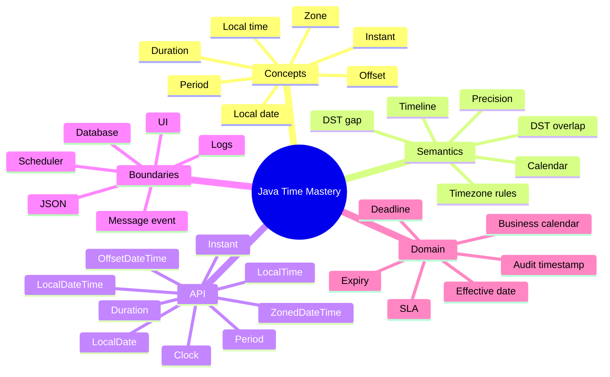
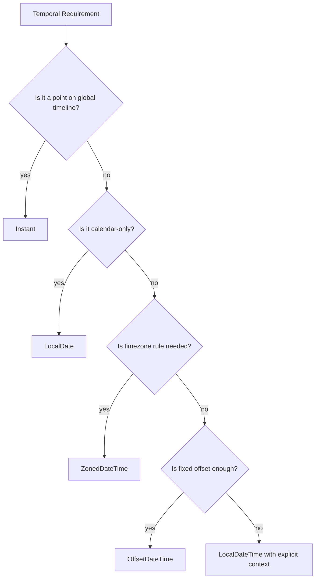
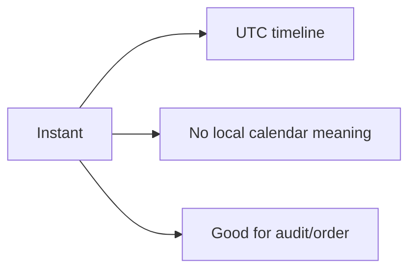
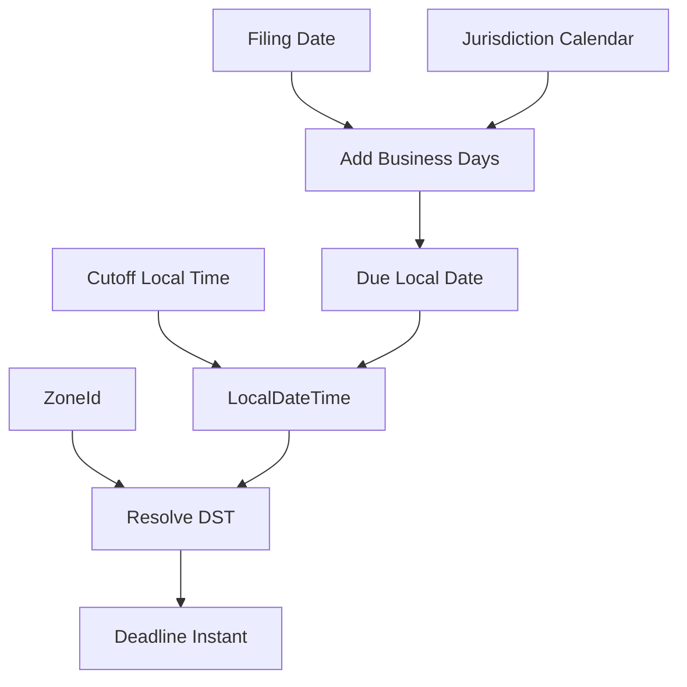
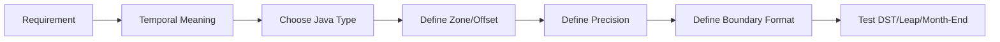

# Part 024 — Date/Time: Instant, Local, Zoned, Duration, Period

> Target part ini: memahami `java.time` sebagai model temporal, bukan sekadar API tanggal. Kita akan membedakan instant, local date-time, offset date-time, zoned date-time, duration, period, clock, timezone, DST, formatting, persistence, API boundary, dan failure modes enterprise.

Waktu adalah salah satu tipe data paling berbahaya di sistem enterprise. Ia terlihat sederhana:

```java
LocalDateTime.now()
```

Tetapi di production, waktu adalah gabungan dari:

- timeline global;
- kalender lokal;
- timezone rules;
- daylight saving time;
- business day;
- legal deadline;
- storage precision;
- ordering;
- auditability;
- replayability;
- distributed system clock skew.

---

## 1. Kaufman Skill Map



### Latihan 20 Jam yang Relevan

| Jam | Fokus | Output |
|---:|---|---|
| 1–2 | `Instant`, `LocalDate`, `LocalDateTime` | Bedakan timeline vs calendar |
| 3–4 | `ZoneId`, `ZoneOffset`, `ZonedDateTime` | Konversi antar zone |
| 5–6 | DST gap/overlap | Reproduce kasus jam hilang/berulang |
| 7–8 | `Duration` vs `Period` | Test penambahan hari/bulan/jam |
| 9–10 | `Clock` | Buat service testable tanpa `now()` langsung |
| 11–12 | formatting/parsing | Pakai `DateTimeFormatter` secara eksplisit |
| 13–14 | DB mapping | Mapping timestamp/date/time dengan benar |
| 15–16 | JSON contract | ISO format, offset, zone, precision |
| 17–18 | scheduler/deadline | Buat SLA/deadline calculator |
| 19–20 | capstone | Temporal model untuk enforcement lifecycle |

---

## 2. Masalah Fundamental: “Tanggal” Bukan Satu Konsep

Banyak bug muncul karena semua hal diberi tipe `Date`, `Timestamp`, atau `LocalDateTime`.

Padahal pertanyaannya berbeda:

| Pertanyaan | Tipe yang Mungkin Tepat |
|---|---|
| Kapan event terjadi di timeline global? | `Instant` |
| Tanggal lahir seseorang? | `LocalDate` |
| Jam kerja toko lokal? | `LocalTime` |
| Meeting jam 09:00 di Jakarta? | `ZonedDateTime` atau local + zone |
| Timestamp dengan offset eksplisit? | `OffsetDateTime` |
| Durasi timeout 30 detik? | `Duration` |
| Periode kontrak 3 bulan? | `Period` |
| Hari kerja berikutnya? | domain `BusinessCalendar` |

### Diagram Mental Model



---

## 3. `java.time` Design Principles

Modern Java date-time API dirancang dengan prinsip:

- immutable;
- thread-safe;
- explicit type separation;
- ISO calendar default;
- timezone rules via `ZoneId`;
- clear distinction antara machine time dan human calendar time.

Ini berbeda dari legacy `java.util.Date` dan `Calendar` yang mutable, confusing, dan banyak method deprecated.

---

## 4. Instant: Titik di Timeline Global

`Instant` merepresentasikan point di timeline UTC.

```java
Instant now = Instant.now();
System.out.println(now); // 2026-06-30T...
```

Gunakan `Instant` untuk:

- event happened at;
- audit timestamp;
- created/updated timestamp;
- message produced at;
- log event time;
- ordering global;
- expiry absolute;
- distributed tracing timestamp.

### Instant Tidak Punya Kalender Lokal

`Instant` tidak tahu:

- hari Senin atau Selasa lokal;
- jam 09:00 di Jakarta;
- tanggal akhir bulan;
- business day;
- DST local transition.

Ia hanya titik timeline.



### Convert Instant ke Local View

```java
Instant instant = Instant.parse("2026-06-30T02:00:00Z");
ZoneId jakarta = ZoneId.of("Asia/Jakarta");
ZonedDateTime localView = instant.atZone(jakarta);

System.out.println(localView);
```

Satu instant bisa punya banyak tampilan lokal tergantung zone.

---

## 5. LocalDate: Tanggal Tanpa Timezone

`LocalDate` merepresentasikan date tanpa time dan tanpa timezone.

```java
LocalDate birthDate = LocalDate.of(1990, 5, 20);
LocalDate filingDate = LocalDate.parse("2026-06-30");
```

Gunakan untuk:

- birth date;
- filing date;
- business date;
- effective date berbasis kalender;
- due date yang didefinisikan sebagai tanggal lokal;
- holiday calendar.

### LocalDate Bukan Midnight Instant

Jangan otomatis menganggap `LocalDate` sebagai `00:00 UTC`.

```java
LocalDate date = LocalDate.of(2026, 6, 30);
Instant wrong = date.atStartOfDay(ZoneOffset.UTC).toInstant();
Instant jakartaStart = date.atStartOfDay(ZoneId.of("Asia/Jakarta")).toInstant();
```

Start of day tergantung zone. Bahkan dalam zone tertentu, start of day bisa terdampak DST rules.

---

## 6. LocalTime: Jam Tanpa Tanggal dan Timezone

`LocalTime` merepresentasikan time-of-day.

```java
LocalTime opening = LocalTime.of(9, 0);
LocalTime closing = LocalTime.of(17, 30);
```

Gunakan untuk:

- jam operasional;
- daily cutoff local;
- recurring schedule local;
- SLA daily window.

Jangan gunakan `LocalTime` untuk durasi.

```java
Duration lunchBreak = Duration.ofMinutes(45); // benar
LocalTime lunchBreakWrong = LocalTime.of(0, 45); // salah model
```

---

## 7. LocalDateTime: Local Calendar Date-Time Tanpa Zone

`LocalDateTime` adalah date + time tanpa timezone/offset.

```java
LocalDateTime appointment = LocalDateTime.of(2026, 6, 30, 9, 0);
```

Ia tidak cukup untuk menentukan instant global.

```java
LocalDateTime local = LocalDateTime.of(2026, 6, 30, 9, 0);

Instant jakartaInstant = local.atZone(ZoneId.of("Asia/Jakarta")).toInstant();
Instant londonInstant = local.atZone(ZoneId.of("Europe/London")).toInstant();
```

Keduanya berbeda.

### Kapan LocalDateTime Tepat?

| Use Case | Tepat? | Catatan |
|---|---:|---|
| Form input “2026-06-30 09:00” sebelum user memilih timezone | ya | masih incomplete |
| Meeting global | tidak sendiri | butuh zone/offset |
| DB audit timestamp | biasanya tidak | pakai `Instant`/`OffsetDateTime` |
| Local business event | kadang | simpan zone context juga |
| Cron schedule local | ya, dengan zone | local time + zone rules |

### Anti-Pattern

```java
LocalDateTime createdAt = LocalDateTime.now();
```

Untuk audit, ini kehilangan zone/offset. Lebih baik:

```java
Instant createdAt = clock.instant();
```

---

## 8. ZoneOffset vs ZoneId

`ZoneOffset` adalah fixed offset dari UTC, seperti `+07:00`.

`ZoneId` adalah timezone region/rules, seperti `Asia/Jakarta`, `Europe/Paris`, `America/New_York`.

```java
ZoneOffset offset = ZoneOffset.of("+07:00");
ZoneId zone = ZoneId.of("Asia/Jakarta");
```

### Perbedaan Penting

| Konsep | Contoh | Punya DST/rules? |
|---|---|---:|
| `ZoneOffset` | `+07:00` | tidak |
| `ZoneId` | `Asia/Jakarta` | ya, berdasarkan rules |

Offset adalah fakta pada saat tertentu. Zone adalah aturan historis/future untuk lokasi.

Untuk jadwal masa depan, simpan zone ID jika aturan lokal penting.

---

## 9. OffsetDateTime

`OffsetDateTime` adalah local date-time + fixed offset.

```java
OffsetDateTime timestamp = OffsetDateTime.parse("2026-06-30T09:00:00+07:00");
Instant instant = timestamp.toInstant();
```

Gunakan untuk:

- API timestamp dengan offset;
- event time yang membawa offset;
- DB timestamp with offset, tergantung database/driver;
- interoperability.

Batasannya: offset bukan timezone region. `+07:00` tidak memberi tahu apakah event berasal dari Jakarta, Bangkok, atau tempat lain.

---

## 10. ZonedDateTime

`ZonedDateTime` adalah local date-time + zone rules.

```java
ZonedDateTime meeting = ZonedDateTime.of(
    2026, 6, 30, 9, 0, 0, 0,
    ZoneId.of("Asia/Jakarta")
);
```

Gunakan untuk:

- meeting/schedule lokal;
- deadline lokal dengan zone;
- recurring event;
- conversion ke instant;
- UI display yang butuh timezone name/rules.

### Same Instant vs Same Local Time

```java
ZonedDateTime jakarta = ZonedDateTime.of(
    2026, 6, 30, 9, 0, 0, 0,
    ZoneId.of("Asia/Jakarta")
);

ZonedDateTime londonSameInstant = jakarta.withZoneSameInstant(ZoneId.of("Europe/London"));
ZonedDateTime londonSameLocal = jakarta.withZoneSameLocal(ZoneId.of("Europe/London"));
```

| Method | Makna |
|---|---|
| `withZoneSameInstant` | instant tetap, local time berubah |
| `withZoneSameLocal` | local date-time tetap, instant berubah |

Ini sering menentukan benar/salahnya reschedule.

---

## 11. DST Gap and Overlap

Daylight Saving Time membuat local time tertentu bisa:

- tidak ada;
- terjadi dua kali.

### Gap

Saat clock maju, local time tertentu hilang.

```java
ZoneId paris = ZoneId.of("Europe/Paris");
LocalDateTime gap = LocalDateTime.of(2026, 3, 29, 2, 30);
ZonedDateTime zdt = gap.atZone(paris);
System.out.println(zdt);
```

`02:30` lokal mungkin tidak valid pada hari transisi DST.

### Overlap

Saat clock mundur, local time terjadi dua kali.

```java
ZoneId paris = ZoneId.of("Europe/Paris");
LocalDateTime overlap = LocalDateTime.of(2026, 10, 25, 2, 30);
ZonedDateTime zdt = overlap.atZone(paris);
```

`02:30` bisa merujuk ke dua instant berbeda.

### Production Impact

| Area | Risiko |
|---|---|
| Scheduler | job skipped atau double-run |
| SLA | deadline salah 1 jam |
| Billing | duration salah |
| Logs | ordering membingungkan |
| Recurring event | meeting shift |
| Legal deadline | dispute |

### Rule

Untuk event happened, simpan `Instant`.

Untuk schedule future local, simpan local date-time + zone ID + resolution policy.

```java
public enum DstResolutionPolicy {
    SHIFT_FORWARD,
    REJECT_INVALID_LOCAL_TIME,
    EARLIER_OFFSET,
    LATER_OFFSET
}
```

---

## 12. Duration vs Period

`Duration` adalah amount berbasis seconds/nanos.

`Period` adalah amount berbasis date units: years, months, days.

```java
Duration timeout = Duration.ofSeconds(30);
Period subscription = Period.ofMonths(1);
```

### Jangan Campur

| Kebutuhan | Tipe |
|---|---|
| HTTP timeout 5s | `Duration` |
| Cache TTL 15m | `Duration` |
| SLA response 4h | `Duration`, kecuali business hours |
| Contract valid 1 year | `Period` |
| Add 1 calendar month | `Period` |
| Age calculation | `Period` |

### Contoh Perbedaan

```java
ZonedDateTime beforeDst = ZonedDateTime.of(
    2026, 3, 28, 12, 0, 0, 0,
    ZoneId.of("Europe/Paris")
);

ZonedDateTime plusOneDayPeriod = beforeDst.plus(Period.ofDays(1));
ZonedDateTime plus24HoursDuration = beforeDst.plus(Duration.ofHours(24));
```

Di sekitar DST, “1 day” dan “24 hours” dapat berbeda secara local-time semantics.

---

## 13. Clock: Waktu Harus Injectable

Jangan panggil `Instant.now()` langsung di domain service.

### Buruk

```java
public boolean isExpired(Instant expiresAt) {
    return Instant.now().isAfter(expiresAt);
}
```

### Baik

```java
public final class ExpiryService {
    private final Clock clock;

    public ExpiryService(Clock clock) {
        this.clock = Objects.requireNonNull(clock);
    }

    public boolean isExpired(Instant expiresAt) {
        return clock.instant().isAfter(expiresAt);
    }
}
```

Test:

```java
Clock fixed = Clock.fixed(
    Instant.parse("2026-06-30T00:00:00Z"),
    ZoneOffset.UTC
);

ExpiryService service = new ExpiryService(fixed);
```

### Rule

- Application composition boleh membuat `Clock.systemUTC()`.
- Domain service menerima `Clock`.
- Test menggunakan `Clock.fixed()`.
- Jangan menyebarkan `now()` di business logic.

---

## 14. Parsing and Formatting

Gunakan `DateTimeFormatter`, bukan string concat manual.

```java
DateTimeFormatter formatter = DateTimeFormatter.ISO_OFFSET_DATE_TIME;
OffsetDateTime value = OffsetDateTime.parse("2026-06-30T09:00:00+07:00", formatter);
```

### Formatting Boundary

| Boundary | Format Recommendation |
|---|---|
| Machine timestamp | ISO-8601 with offset or UTC instant |
| Local date | `yyyy-MM-dd` ISO date |
| UI display | locale-specific formatter |
| Audit log | UTC instant + original zone if relevant |
| Schedule input | local date-time + zone ID |

### Jangan Pakai Default Locale/Zone Diam-Diam

```java
LocalDateTime parsed = LocalDateTime.parse(input); // okay if input ISO and contract says so
```

Tapi untuk UI human text:

```java
DateTimeFormatter.ofPattern("dd MMM uuuu", locale);
```

Locale harus eksplisit.

---

## 15. Precision: Millis, Micros, Nanos

`Instant` mendukung nanosecond precision, tetapi database, broker, dan API mungkin tidak.

```java
Instant now = Instant.now();
System.out.println(now.getNano());
```

### Boundary Risk

| System | Common Precision |
|---|---|
| Java `Instant` | nanosecond component |
| Many databases | microsecond/millisecond depending type/config |
| JSON string | arbitrary text, but parser may truncate |
| Kafka/event payload | depends on schema |
| Logs | often millis/nanos depending framework |

Jika timestamp dipakai sebagai equality key, precision mismatch bisa membuat bug.

### Safer Boundary

```java
Instant truncated = instant.truncatedTo(ChronoUnit.MILLIS);
```

Tapi truncation juga policy. Jangan lakukan diam-diam tanpa alasan.

---

## 16. Legacy Interop

Kadang harus berinteraksi dengan legacy `Date`.

```java
Date date = Date.from(instant);
Instant instantAgain = date.toInstant();
```

`java.sql.Date`, `java.sql.Time`, dan `java.sql.Timestamp` punya sejarah dan behavior yang perlu hati-hati. Untuk code baru, prefer JDBC driver yang mendukung `java.time` type.

### Migration Rule

| Legacy | Modern |
|---|---|
| `java.util.Date` event timestamp | `Instant` |
| `java.sql.Date` SQL DATE | `LocalDate` |
| `java.sql.Time` SQL TIME | `LocalTime` |
| `java.sql.Timestamp` SQL TIMESTAMP | `LocalDateTime`/`Instant` depending DB semantics |
| `Calendar` | `ZonedDateTime` or `Instant + ZoneId` |

---

## 17. Database Boundary

Database temporal types berbeda antar vendor. Jangan asumsi satu mapping universal.

### Common Mapping Intention

| Domain Meaning | Java Type | DB Type Intention |
|---|---|---|
| audit event timestamp | `Instant` | timestamp UTC / timestamp with time zone semantics |
| local business date | `LocalDate` | DATE |
| local time of day | `LocalTime` | TIME |
| local appointment | `LocalDateTime + ZoneId` | TIMESTAMP + zone column |
| offset timestamp | `OffsetDateTime` | TIMESTAMP WITH TIME ZONE if semantics match |

### Jangan Simpan Future Schedule sebagai Instant Saja

Misal meeting “setiap hari jam 09:00 Asia/Jakarta”. Jika hanya disimpan sebagai instant pertama + interval 24 jam, local schedule bisa salah di zone dengan DST.

Simpan:

```sql
scheduled_local_date_time TIMESTAMP NOT NULL,
zone_id VARCHAR(64) NOT NULL
```

Lalu resolve ke instant saat eksekusi dengan policy.

### Audit Timestamp

Untuk audit event, simpan instant.

```java
public record AuditStamp(
    Instant occurredAt,
    String actorId,
    String source
) {}
```

Jika local legal interpretation penting, simpan juga zone atau jurisdiction.

---

## 18. JSON/API Boundary

### Instant as ISO String

```json
{
  "occurredAt": "2026-06-30T02:00:00Z"
}
```

### Local Date

```json
{
  "filingDate": "2026-06-30"
}
```

### Scheduled Local Date-Time with Zone

```json
{
  "scheduledAt": "2026-06-30T09:00:00",
  "zoneId": "Asia/Jakarta"
}
```

### Offset Timestamp

```json
{
  "submittedAt": "2026-06-30T09:00:00+07:00"
}
```

### API Contract Checklist

- [ ] Apakah field adalah instant, local date, local time, offset date-time, atau zoned date-time?
- [ ] Apakah format ISO-8601?
- [ ] Apakah offset wajib?
- [ ] Apakah zone ID wajib?
- [ ] Apakah precision dibatasi?
- [ ] Apakah timezone default dilarang?
- [ ] Apakah DST invalid/ambiguous time punya policy?

---

## 19. Deadline Modeling

Deadline bukan hanya timestamp.

Contoh rule:

> “Response due 5 business days after filing date, by 17:00 local jurisdiction time, unless holiday.”

Ini membutuhkan:

- filing date;
- jurisdiction;
- business calendar;
- local cutoff time;
- zone ID;
- holiday rules;
- extension rules;
- final instant for enforcement.

### Domain Model

```java
public record Jurisdiction(String code, ZoneId zoneId) {}

public interface BusinessCalendar {
    boolean isBusinessDay(LocalDate date, Jurisdiction jurisdiction);

    LocalDate plusBusinessDays(LocalDate start, int days, Jurisdiction jurisdiction);
}

public record Deadline(
    LocalDate dueDate,
    LocalTime cutoffTime,
    Jurisdiction jurisdiction
) {
    public Instant toInstant(DstResolutionPolicy policy) {
        LocalDateTime local = LocalDateTime.of(dueDate, cutoffTime);
        return resolve(local, jurisdiction.zoneId(), policy).toInstant();
    }

    private static ZonedDateTime resolve(
        LocalDateTime local,
        ZoneId zone,
        DstResolutionPolicy policy
    ) {
        // Simplified. Real implementation should inspect ZoneRules.
        return local.atZone(zone);
    }
}
```

### Diagram



---

## 20. SLA and Duration Modeling

SLA kadang duration murni, kadang business duration.

### Duration SLA

```java
public record ResponseSla(Duration duration) {
    public Instant dueAt(Instant start) {
        return start.plus(duration);
    }
}
```

### Business SLA

```java
public record BusinessSla(int businessHours, Jurisdiction jurisdiction) {}
```

Business SLA tidak bisa diwakili `Duration` saja jika harus melewati jam kerja, weekend, libur, dan pause/resume.

---

## 21. Effective Date vs Transaction Time

Dalam sistem regulasi, “waktu” sering punya beberapa dimensi:

| Dimensi | Makna | Tipe Umum |
|---|---|---|
| occurred time | kapan event terjadi | `Instant` |
| recorded time | kapan sistem mencatat | `Instant` |
| effective date | kapan aturan berlaku | `LocalDate` |
| valid period | kapan fakta valid | `LocalDate`/interval |
| transaction time | kapan database mengetahui | `Instant` |
| decision time | kapan keputusan dibuat | `Instant` + actor/context |

Jangan campur `effectiveDate` dengan `createdAt`.

```java
public record RegulationRule(
    String ruleId,
    LocalDate effectiveFrom,
    Optional<LocalDate> effectiveTo,
    Instant recordedAt
) {}
```

---

## 22. Intervals and Ranges

Java standard library tidak punya universal `Interval` di `java.time`. Kita sering membuat sendiri.

```java
public record InstantRange(Instant startInclusive, Instant endExclusive) {
    public InstantRange {
        Objects.requireNonNull(startInclusive);
        Objects.requireNonNull(endExclusive);
        if (!startInclusive.isBefore(endExclusive)) {
            throw new IllegalArgumentException("start must be before end");
        }
    }

    public boolean contains(Instant instant) {
        return !instant.isBefore(startInclusive) && instant.isBefore(endExclusive);
    }
}
```

### Prefer Half-Open Interval

```text
[startInclusive, endExclusive)
```

Alasan:

- menghindari precision boundary problem;
- mudah concatenate;
- umum di query time range;
- tidak perlu “23:59:59.999”.

### Buruk

```java
LocalDateTime endOfDay = date.atTime(23, 59, 59, 999_000_000);
```

### Lebih Baik

```java
Instant start = date.atStartOfDay(zone).toInstant();
Instant endExclusive = date.plusDays(1).atStartOfDay(zone).toInstant();
```

---

## 23. Timezone Default Trap

```java
ZoneId.systemDefault()
```

Boleh di application edge, tetapi berbahaya di domain logic.

Masalah:

- berubah antar environment;
- container base image berbeda;
- developer laptop berbeda;
- test flaky;
- batch job hasil berbeda;
- audit sulit direplay.

### Rule

- Store/config zone eksplisit.
- Inject `Clock` dengan zone jika perlu.
- Jangan parse/format dengan default zone tanpa contract.
- Test minimal di dua zone berbeda.

```java
@ParameterizedTest
@ValueSource(strings = {"UTC", "Asia/Jakarta", "Europe/Paris", "America/New_York"})
void deadlineIsStableAcrossZones(String zoneId) {
    // test boundary behavior
}
```

---

## 24. Ordering and Comparison

Untuk ordering global, compare `Instant`.

```java
boolean late = submittedAtInstant.isAfter(deadlineInstant);
```

Jangan compare local date-time dari zone berbeda.

```java
LocalDateTime a = LocalDateTime.of(2026, 6, 30, 9, 0);
LocalDateTime b = LocalDateTime.of(2026, 6, 30, 8, 0);
```

Tanpa zone, kamu tidak tahu mana lebih dulu secara global.

### Equality

| Type | Equality Meaning |
|---|---|
| `Instant` | same point on timeline |
| `LocalDate` | same date fields |
| `LocalDateTime` | same local fields, not same instant |
| `OffsetDateTime` | same local date-time and offset for equals; compare instant separately when needed |
| `ZonedDateTime` | includes local date-time, offset, zone; same instant requires `toInstant()` comparison |

Jangan asumsikan semua temporal equality berarti “same real-world moment”.

---

## 25. Testing Temporal Logic

### Core Rules

- Inject `Clock`.
- Test DST gap.
- Test DST overlap.
- Test leap year.
- Test month-end.
- Test timezone conversion.
- Test precision truncation.
- Test serialization round-trip.
- Test DB round-trip.

### Leap Year

```java
LocalDate feb29 = LocalDate.of(2024, 2, 29);
System.out.println(feb29.plusYears(1)); // 2025-02-28
```

This behavior may be correct, but only if the domain accepts it.

### Month-End

```java
LocalDate jan31 = LocalDate.of(2026, 1, 31);
System.out.println(jan31.plusMonths(1)); // 2026-02-28
```

Subscription billing, deadline extension, and recurring schedule must define month-end policy.

---

## 26. Failure Modes di Production

### 26.1 CreatedAt sebagai LocalDateTime

```java
LocalDateTime createdAt = LocalDateTime.now();
```

Akibat:

- tidak bisa compare global;
- ambiguous saat data lintas region;
- audit replay sulit;
- migration timezone kacau.

### 26.2 Deadline Disimpan sebagai Date Tanpa Zone

Deadline “30 Juni jam 17:00 local jurisdiction time” disimpan hanya sebagai `2026-06-30T17:00`.

Akibat:

- jurisdiction tidak diketahui;
- instant deadline tidak bisa dihitung ulang;
- dispute legal.

### 26.3 Scheduler Berbasis 24 Jam untuk Local Daily Event

Job “setiap hari jam 09:00 local” dijadwalkan dengan `lastRun.plus(Duration.ofHours(24))`.

Akibat:

- DST dapat menggeser jam lokal;
- job skip/double-run.

### 26.4 DB Precision Mismatch

Java menyimpan `Instant` nanos, DB truncate ke millis, lalu equality gagal.

### 26.5 System Default Zone

Test pass di laptop Jakarta, fail di CI UTC.

---

## 27. Design Patterns Lokal

### 27.1 AuditClock

```java
public interface AuditClock {
    Instant now();
}

public final class SystemAuditClock implements AuditClock {
    private final Clock clock;

    public SystemAuditClock(Clock clock) {
        this.clock = clock;
    }

    @Override
    public Instant now() {
        return clock.instant();
    }
}
```

Ini menghindari domain terlalu tergantung pada API global.

### 27.2 Temporal Value Object

```java
public record FilingDate(LocalDate value) {
    public FilingDate {
        Objects.requireNonNull(value);
    }
}

public record SubmissionTime(Instant value) {
    public SubmissionTime {
        Objects.requireNonNull(value);
    }
}
```

`FilingDate` dan `SubmissionTime` tidak boleh ditukar walaupun sama-sama temporal.

### 27.3 DeadlinePolicy

```java
public interface DeadlinePolicy {
    Deadline calculate(FilingDate filingDate, Jurisdiction jurisdiction);
}
```

Policy diberi nama dan bisa versioned.

---

## 28. Worked Example: Case Response Deadline

Rule:

- deadline = 5 business days setelah filing date;
- cutoff = 17:00 local jurisdiction time;
- holiday/weekend dilewati;
- output menyimpan local due date dan instant deadline.

```java
public record CaseFiling(
    String caseId,
    LocalDate filingDate,
    Jurisdiction jurisdiction
) {}

public record CaseDeadline(
    String caseId,
    LocalDate dueDate,
    LocalTime cutoffTime,
    ZoneId zoneId,
    Instant dueInstant
) {}
```

```java
public final class CaseDeadlineCalculator {
    private final BusinessCalendar businessCalendar;

    public CaseDeadlineCalculator(BusinessCalendar businessCalendar) {
        this.businessCalendar = Objects.requireNonNull(businessCalendar);
    }

    public CaseDeadline calculate(CaseFiling filing) {
        LocalDate dueDate = businessCalendar.plusBusinessDays(
            filing.filingDate(),
            5,
            filing.jurisdiction()
        );

        LocalTime cutoff = LocalTime.of(17, 0);
        ZoneId zone = filing.jurisdiction().zoneId();

        ZonedDateTime zonedDue = ZonedDateTime.of(dueDate, cutoff, zone);

        return new CaseDeadline(
            filing.caseId(),
            dueDate,
            cutoff,
            zone,
            zonedDue.toInstant()
        );
    }
}
```

### Kenapa Menyimpan Keduanya?

- `dueDate`, `cutoffTime`, dan `zoneId` menjelaskan legal/business meaning.
- `dueInstant` memudahkan comparison global dan scheduler.

Ini bukan duplikasi bodoh. Ini penyimpanan dua representasi dengan semantik berbeda.

---

## 29. Review Checklist

### Type Choice

- [ ] Event timestamp memakai `Instant` atau tipe yang membawa offset/zone.
- [ ] Date-only memakai `LocalDate`.
- [ ] Time-only memakai `LocalTime`.
- [ ] Schedule masa depan menyimpan zone ID jika local meaning penting.
- [ ] `LocalDateTime` tidak dipakai untuk audit global tanpa context.

### Clock

- [ ] Business logic tidak memanggil `now()` langsung.
- [ ] `Clock` atau abstraction di-inject.
- [ ] Tests memakai fixed clock.

### Timezone

- [ ] Tidak ada `ZoneId.systemDefault()` di domain logic.
- [ ] Zone ID eksplisit di config/domain.
- [ ] DST gap/overlap punya policy.
- [ ] Test minimal mencakup zone dengan DST.

### Duration/Period

- [ ] Timeout memakai `Duration`.
- [ ] Calendar period memakai `Period`.
- [ ] Business-day logic tidak direduksi ke `Duration.ofDays(...)`.

### Persistence/API

- [ ] DB temporal type cocok dengan domain meaning.
- [ ] JSON format eksplisit.
- [ ] Precision timestamp jelas.
- [ ] Round-trip serialization diuji.

### Domain

- [ ] Deadline menyimpan local meaning dan instant jika keduanya diperlukan.
- [ ] Effective date tidak dicampur dengan createdAt.
- [ ] Interval memakai half-open range.
- [ ] Holiday/business calendar diberi model eksplisit.

---

## 30. Practice Set

### Exercise 1 — Instant vs LocalDateTime

Buat dua `LocalDateTime` yang sama di dua zone berbeda. Konversikan ke `Instant`. Jelaskan perbedaannya.

### Exercise 2 — Clock Injection

Refactor service yang memakai `Instant.now()` menjadi service dengan `Clock` injectable.

### Exercise 3 — DST Gap

Cari zone dengan DST dan buat test untuk local time yang invalid. Tentukan policy: reject atau shift forward.

### Exercise 4 — Duration vs Period

Bandingkan `plus(Duration.ofHours(24))` dan `plus(Period.ofDays(1))` di sekitar DST.

### Exercise 5 — Deadline Calculator

Implement `BusinessCalendar` sederhana yang melewati Sabtu/Minggu. Buat calculator deadline 5 business days by 17:00 local zone.

### Exercise 6 — API Contract

Desain JSON untuk:

- audit event timestamp;
- date of birth;
- scheduled meeting;
- SLA duration;
- legal effective date.

Jelaskan tipe Java untuk masing-masing.

---

## 31. Mental Model Ringkas



Rule utama:

> Jangan mulai dari “tipe tanggal apa yang biasa dipakai?”. Mulai dari “makna waktu apa yang sedang dimodelkan?”.

---

## 32. Sumber Resmi yang Perlu Dibaca

Baca dokumentasi resmi ini setelah menyelesaikan part:

- `java.time` package summary
- `Instant`
- `LocalDate`
- `LocalTime`
- `LocalDateTime`
- `OffsetDateTime`
- `ZonedDateTime`
- `Duration`
- `Period`
- `Clock`
- `DateTimeFormatter`
- `ZoneId`
- `ZoneOffset`

Tujuannya bukan menghafal semua method, tetapi memahami grammar konseptual waktu modern Java.

---

## 33. Penutup

Setelah part ini, kamu harus bisa melihat bug temporal sebagai kombinasi dari:

```text
timeline + calendar + zone + offset + duration/period + precision + boundary + domain rule
```

Top 1% engineer tidak hanya tahu `LocalDateTime` dan `Instant`. Mereka tahu kapan masing-masing salah.

Part berikutnya akan melanjutkan ke temporal modeling enterprise: effective date, valid time, transaction time, regulatory deadlines, SLA, business calendar, lifecycle state, dan audit defensibility.
