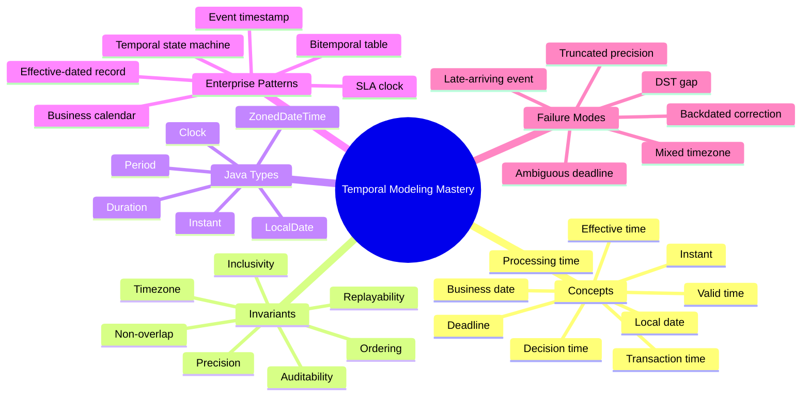
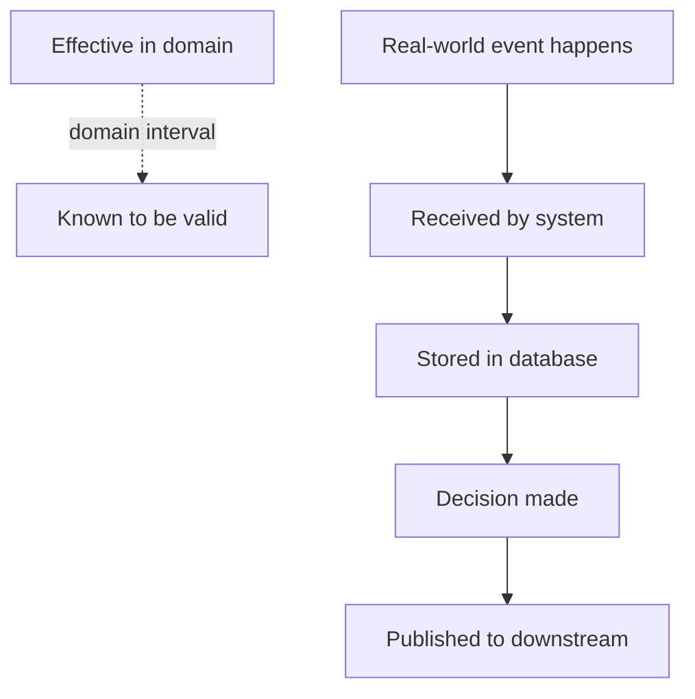
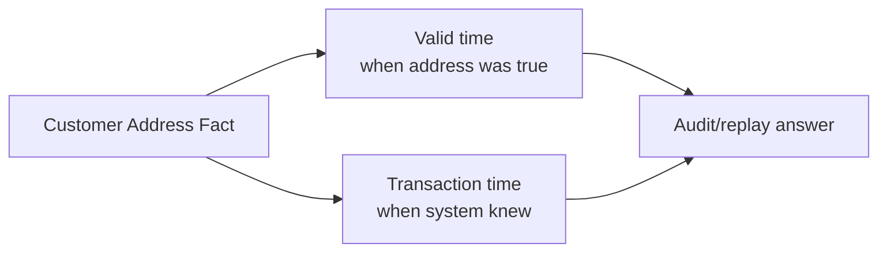
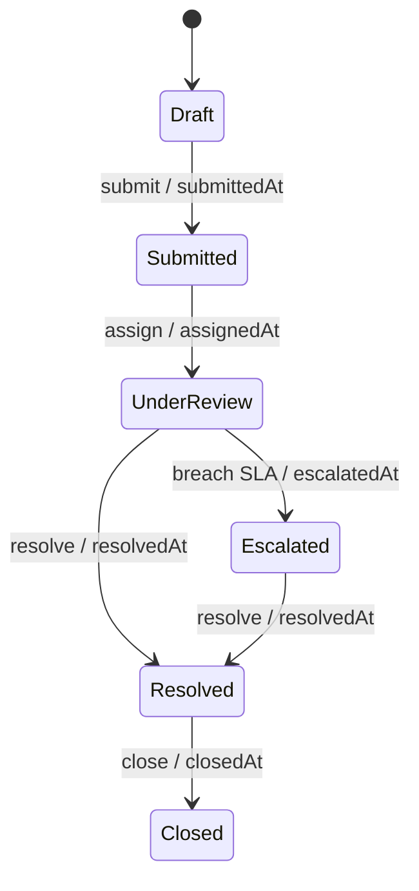
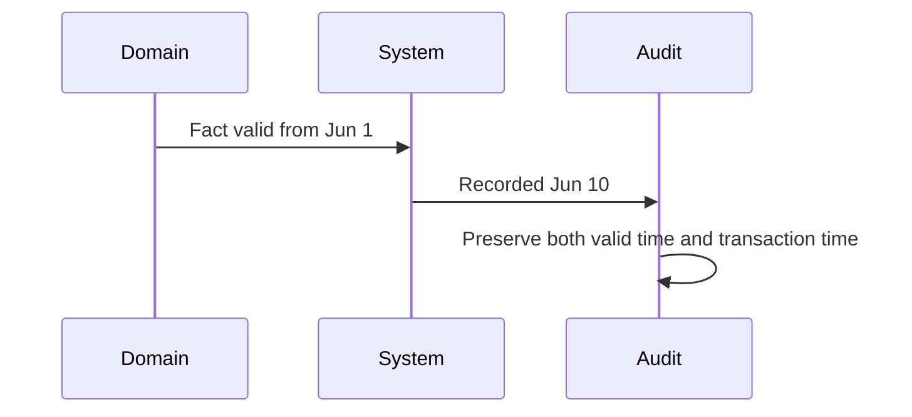

# Part 025 — Temporal Modeling for Enterprise Systems

> Target part ini: naik dari “menggunakan `java.time`” menjadi “mendesain model waktu yang benar untuk sistem enterprise”. Fokusnya adalah effective time, valid time, transaction time, processing time, business calendar, deadline, SLA, audit, replay, dan temporal invariant.

Pada part sebelumnya kita membedakan `Instant`, `LocalDate`, `LocalDateTime`, `OffsetDateTime`, `ZonedDateTime`, `Duration`, `Period`, dan `Clock`.

Part ini menjawab pertanyaan yang lebih sulit:

> “Waktu apa yang sebenarnya sedang kita modelkan?”

Di sistem enterprise, terutama regulatory, banking, insurance, telecom, marketplace, dan case management, bug temporal jarang disebabkan karena developer tidak tahu cara memanggil `Instant.now()`. Bug biasanya muncul karena satu field bernama `createdDate`, `effectiveDate`, `deadline`, atau `updatedAt` dipakai untuk beberapa makna temporal sekaligus.

---

## 1. Kaufman Skill Map



### Skill deconstruction

Untuk menjadi kuat dalam temporal modeling, pecah skill menjadi lima kemampuan:

| Subskill | Pertanyaan yang harus bisa dijawab |
|---|---|
| Semantic classification | Field ini mewakili waktu apa? Event time, processing time, valid time, atau business date? |
| Java type selection | Harus memakai `Instant`, `LocalDate`, `ZonedDateTime`, `Duration`, `Period`, atau tipe domain custom? |
| Boundary design | Bagaimana waktu dikirim lewat API, disimpan di DB, dibaca dari UI, dan diaudit? |
| Invariant design | Apakah interval boleh overlap? Apakah end inclusive? Apa timezone otoritatifnya? |
| Failure modeling | Apa yang terjadi saat DST, late event, correction, replay, clock skew, dan timezone berubah? |

### 20-hour deliberate practice untuk part ini

| Jam | Latihan |
|---:|---|
| 1–3 | Inventaris semua field waktu di satu domain dan klasifikasikan maknanya. |
| 4–6 | Refactor satu model yang memakai `LocalDateTime` generik menjadi tipe temporal eksplisit. |
| 7–10 | Desain effective-dated policy/rule table dengan non-overlap invariant. |
| 11–14 | Desain deadline/SLA dengan business calendar. |
| 15–17 | Buat test DST gap, DST overlap, end-of-month, leap year, dan timezone berbeda. |
| 18–20 | Buat postmortem untuk bug temporal hipotetis dan checklist pencegahannya. |

---

## 2. Mental Model: Waktu Bukan Satu Dimensi

Waktu di aplikasi sering terlihat seperti satu garis:

```text
past ------------------ now ------------------ future
```

Tetapi sistem enterprise biasanya punya beberapa garis waktu sekaligus:



Contoh sederhana:

> Nasabah pindah alamat pada 1 Juni. Bank baru menerima dokumen pada 5 Juni. Operator memasukkan data pada 6 Juni. Sistem koreksi audit pada 10 Juni karena dokumen ternyata berlaku sejak 31 Mei.

Apakah `address.updatedAt` berarti:

- kapan nasabah pindah?
- kapan dokumen berlaku?
- kapan bank menerima dokumen?
- kapan operator input?
- kapan DB row berubah?
- kapan keputusan compliance dibuat?

Jika semuanya disimpan dalam satu kolom, sistem kehilangan kemampuan menjawab audit.

---

## 3. Vocabulary Temporal yang Wajib Dibedakan

| Konsep | Makna | Java type umum | Contoh |
|---|---|---|---|
| Instant / event time | Titik waktu global pada timeline UTC-ish | `Instant` | event diterima message broker pada `2026-06-30T10:15:30Z` |
| Local date | Tanggal kalender tanpa jam dan timezone | `LocalDate` | tanggal lahir, tanggal berlaku pajak lokal |
| Local date-time | Tanggal + jam tanpa zone | `LocalDateTime` | input jadwal lokal sebelum zone diketahui |
| Zoned time | Local date-time + zone rules | `ZonedDateTime` | hearing dijadwalkan di `Asia/Jakarta` |
| Offset time | Date-time + fixed offset, tanpa zone rules penuh | `OffsetDateTime` | timestamp API dengan `+07:00` |
| Duration | Panjang waktu berbasis detik/nano | `Duration` | timeout 30 detik, SLA 4 jam aktual |
| Period | Selisih kalender berbasis tahun/bulan/hari | `Period` | masa berlaku 1 bulan |
| Business date | Tanggal menurut kalender bisnis tertentu | custom wrapper atas `LocalDate` | hari kerja regulator |
| Effective time | Kapan aturan/status mulai berlaku di domain | `LocalDate` / `Instant` / interval domain | tarif berlaku mulai 1 Juli |
| Valid time | Kapan fakta benar di dunia nyata/domain | interval | alamat valid dari 1 Juni sampai 10 Agustus |
| Transaction time | Kapan sistem mengetahui/menyimpan fakta | `Instant` | row inserted at 6 Juni 09:00 UTC |
| Processing time | Kapan pipeline memproses event | `Instant` | consumer processed at 09:05 UTC |
| Decision time | Kapan keputusan bisnis/regulatory dibuat | `Instant` + actor/context | case escalated at 14:32 |
| Publication time | Kapan perubahan dipublikasikan | `Instant` | event emitted to Kafka |

Rule sederhana:

> Jika dua orang bisa berbeda pendapat tentang “sekarang” karena timezone, business calendar, dokumen telat, atau koreksi audit, berarti Anda sedang menangani lebih dari satu dimensi waktu.

---

## 4. Taxonomy Field Waktu

Jangan mulai dari nama field. Mulai dari pertanyaan domain.

### 4.1 Event timestamp

```java
record DomainEvent(
    String eventId,
    Instant occurredAt,
    Instant recordedAt,
    String type
) {}
```

- `occurredAt`: kapan peristiwa domain terjadi.
- `recordedAt`: kapan sistem merekamnya.

Keduanya bisa berbeda karena late event, batch import, mobile offline, manual backfill, atau integrasi eksternal.

### 4.2 Audit timestamp

```java
record AuditStamp(
    Instant createdAt,
    String createdBy,
    Instant lastModifiedAt,
    String lastModifiedBy
) {}
```

Audit timestamp menjawab pertanyaan sistem:

- siapa mengubah?
- kapan sistem menerima perubahan?
- perubahan apa yang dilakukan?

Audit timestamp tidak otomatis sama dengan effective date domain.

### 4.3 Effective date

```java
record PricePolicy(
    String policyId,
    LocalDate effectiveFrom,
    LocalDate effectiveToExclusive,
    BigDecimal rate
) {}
```

Effective date menjawab:

> “Mulai kapan rule ini dipakai untuk keputusan domain?”

Dalam banyak sistem, effective date berbasis `LocalDate`, bukan `Instant`, karena aturan berlaku menurut kalender bisnis, bukan detik UTC.

### 4.4 Deadline

```java
record Deadline(
    ZonedDateTime dueAt,
    ZoneId governingZone,
    DeadlineBasis basis
) {}

enum DeadlineBasis {
    CALENDAR_TIME,
    BUSINESS_TIME,
    REGULATORY_DAY_END,
    COURT_DAY_END
}
```

Deadline bukan hanya timestamp. Deadline butuh basis:

- kalender apa?
- timezone apa?
- apakah weekend dihitung?
- apakah hari libur regulator dihitung?
- apakah due at end-of-day atau exact clock time?

---

## 5. Java Type Selection Matrix

| Use case | Hindari | Prefer |
|---|---|---|
| Audit event timestamp | `LocalDateTime` | `Instant` |
| Deadline dengan timezone hukum | `Instant` saja | `ZonedDateTime` + `ZoneId` governing zone |
| Tanggal lahir | `Instant` | `LocalDate` |
| Bulan tagihan | `LocalDateTime` | `YearMonth` |
| Masa berlaku 30 hari aktual | `Period.ofDays(30)` jika harus detik aktual | `Duration.ofDays(30)` |
| Masa berlaku 1 bulan kalender | `Duration.ofDays(30)` | `Period.ofMonths(1)` |
| UI input jam lokal sebelum timezone fix | `Instant` prematur | `LocalDateTime` + zone selection |
| Business day | raw `LocalDate` | `BusinessDate` / `BusinessCalendar` abstraction |
| Effective-dated rule | single `updatedAt` | `[effectiveFrom, effectiveTo)` interval |
| Bitemporal fact | single row | valid interval + transaction interval |

### Dangerous default

```java
LocalDateTime now = LocalDateTime.now(); // suspicious in server-side enterprise code
```

Kenapa suspicious?

- Tidak membawa zone.
- Tidak bisa dibandingkan secara global tanpa konteks.
- Mudah disimpan sebagai timestamp ambigu.
- Sulit direplay dengan deterministic clock.

Lebih eksplisit:

```java
Instant now = clock.instant();
```

atau untuk aturan lokal:

```java
LocalDate businessDate = LocalDate.now(regulatorZone);
```

---

## 6. Interval Modeling: Gunakan Half-Open Interval

Untuk periode berlaku, pola paling aman biasanya:

```text
[startInclusive, endExclusive)
```

Artinya:

- mulai termasuk;
- akhir tidak termasuk.

```java
record EffectivePeriod(LocalDate fromInclusive, LocalDate toExclusive) {
    EffectivePeriod {
        if (fromInclusive == null || toExclusive == null) {
            throw new IllegalArgumentException("Period boundaries are required");
        }
        if (!fromInclusive.isBefore(toExclusive)) {
            throw new IllegalArgumentException("fromInclusive must be before toExclusive");
        }
    }

    boolean contains(LocalDate date) {
        return !date.isBefore(fromInclusive) && date.isBefore(toExclusive);
    }

    boolean overlaps(EffectivePeriod other) {
        return this.fromInclusive.isBefore(other.toExclusive)
            && other.fromInclusive.isBefore(this.toExclusive);
    }
}
```

Kenapa end-exclusive?

- Menghindari `23:59:59.999` hack.
- Cocok untuk date, timestamp, dan database range.
- Komposisi interval menjadi lebih bersih.

```text
[2026-01-01, 2026-02-01)
[2026-02-01, 2026-03-01)
```

Tidak ada overlap, tidak ada gap.

---

## 7. Effective-Dated Record Pattern

Effective-dated record dipakai ketika policy/rule/value berubah dari waktu ke waktu, tetapi keputusan historis harus bisa direkonstruksi.

```java
record EffectiveValue<T>(
    T value,
    EffectivePeriod period,
    AuditStamp audit
) {}
```

Contoh pricing/rate:

```java
record InterestRatePolicy(
    String productCode,
    BigDecimal annualRate,
    EffectivePeriod effectivePeriod,
    String approvedBy,
    Instant approvedAt
) {}
```

Lookup:

```java
final class EffectiveValueCatalog<T> {
    private final List<EffectiveValue<T>> values;

    EffectiveValueCatalog(List<EffectiveValue<T>> values) {
        this.values = List.copyOf(values);
        ensureNoOverlap(this.values);
    }

    T valueAt(LocalDate date) {
        return values.stream()
            .filter(v -> v.period().contains(date))
            .findFirst()
            .orElseThrow(() -> new IllegalStateException("No effective value at " + date))
            .value();
    }

    private static <T> void ensureNoOverlap(List<EffectiveValue<T>> values) {
        for (int i = 0; i < values.size(); i++) {
            for (int j = i + 1; j < values.size(); j++) {
                if (values.get(i).period().overlaps(values.get(j).period())) {
                    throw new IllegalArgumentException("Overlapping effective periods");
                }
            }
        }
    }
}
```

### Invariant utama

Untuk setiap key domain:

- tidak boleh ada interval overlap;
- boleh/tidak boleh ada gap harus diputuskan eksplisit;
- interval harus punya timezone/calendar basis jika berbasis tanggal bisnis;
- historical decision harus menyimpan rule version yang dipakai, bukan hanya menghitung ulang dari rule terbaru.

---

## 8. Bitemporal Modeling

Bitemporal model membedakan:

- **valid time**: kapan fakta benar di domain/dunia nyata;
- **transaction time**: kapan sistem mengetahui/mencatat fakta itu.



Contoh:

```java
record BitemporalAddress(
    String customerId,
    Address address,
    LocalDate validFrom,
    LocalDate validToExclusive,
    Instant transactionFrom,
    Instant transactionToExclusive
) {}
```

Dengan model ini, sistem bisa menjawab dua pertanyaan berbeda:

1. “Alamat customer pada 1 Juni apa?”
2. “Pada 5 Juni, sistem percaya alamat customer apa?”

Tanpa transaction time, pertanyaan kedua tidak bisa dijawab secara defensible.

### Query mental model

```text
validFrom <= targetBusinessDate < validToExclusive
AND
transactionFrom <= asOfSystemTime < transactionToExclusive
```

Ini penting untuk:

- regulatory audit;
- dispute resolution;
- historical replay;
- backdated correction;
- legal defensibility;
- model explainability.

---

## 9. Business Calendar

`LocalDate.plusDays(1)` bukan selalu “next business day”.

```java
interface BusinessCalendar {
    boolean isBusinessDay(LocalDate date);
    LocalDate nextBusinessDay(LocalDate date);
    LocalDate addBusinessDays(LocalDate startInclusive, int days);
}
```

Implementasi sederhana:

```java
final class WeekendOnlyBusinessCalendar implements BusinessCalendar {
    @Override
    public boolean isBusinessDay(LocalDate date) {
        DayOfWeek day = date.getDayOfWeek();
        return day != DayOfWeek.SATURDAY && day != DayOfWeek.SUNDAY;
    }

    @Override
    public LocalDate nextBusinessDay(LocalDate date) {
        LocalDate candidate = date.plusDays(1);
        while (!isBusinessDay(candidate)) {
            candidate = candidate.plusDays(1);
        }
        return candidate;
    }

    @Override
    public LocalDate addBusinessDays(LocalDate startInclusive, int days) {
        if (days < 0) {
            throw new IllegalArgumentException("days must be non-negative");
        }
        LocalDate current = startInclusive;
        int remaining = days;
        while (remaining > 0) {
            current = nextBusinessDay(current);
            remaining--;
        }
        return current;
    }
}
```

### Production reality

Business calendar bisa bergantung pada:

- negara;
- regulator;
- market;
- branch;
- product;
- contract;
- emergency holiday;
- cutoff time;
- event category.

Karena itu, business calendar sering harus menjadi dependency eksplisit, bukan utility global statis.

---

## 10. Deadline Modeling

Deadline buruk:

```java
record CaseDeadline(LocalDateTime dueDate) {}
```

Masalah:

- timezone tidak jelas;
- apakah due at start atau end of day?
- apakah weekend dihitung?
- apakah ada cutoff?
- apakah clock time legal atau operasional?

Model lebih defensible:

```java
record CaseDeadline(
    ZonedDateTime dueAt,
    ZoneId governingZone,
    DeadlineComputation computation,
    Instant computedAt
) {}

record DeadlineComputation(
    LocalDate triggerDate,
    int businessDaysAllowed,
    String calendarId,
    String ruleVersion
) {}
```

Kenapa menyimpan computation metadata?

Karena 2 tahun kemudian auditor bisa bertanya:

> “Kenapa deadline case ini jatuh pada tanggal itu?”

Jawaban “karena code waktu itu menghitung begitu” tidak cukup.

---

## 11. SLA: Duration vs Business Time

SLA sering tampak seperti `Duration`:

```java
Duration responseSla = Duration.ofHours(4);
```

Tetapi ada dua jenis SLA:

| Jenis SLA | Contoh | Model |
|---|---|---|
| Elapsed time SLA | harus respond dalam 30 detik sejak request | `Duration` dari `Instant` ke `Instant` |
| Business time SLA | harus respond dalam 2 hari kerja | `BusinessCalendar` + `LocalDate`/`ZonedDateTime` |

Elapsed time:

```java
boolean breached(Instant startedAt, Instant now, Duration allowed) {
    return Duration.between(startedAt, now).compareTo(allowed) > 0;
}
```

Business time tidak boleh dihitung dengan `Duration.ofDays(n)` tanpa aturan kalender.

---

## 12. Temporal State Machine

Dalam case management, state transition sering memiliki waktu hukum/operasional.



Setiap transition timestamp harus punya makna:

- `submittedAt`: kapan user submit?
- `receivedAt`: kapan sistem menerima?
- `assignedAt`: kapan ownership berubah?
- `escalatedAt`: kapan breach terdeteksi atau kapan escalation berlaku?
- `resolvedAt`: kapan keputusan final dibuat atau kapan diberitahu ke user?
- `closedAt`: kapan lifecycle selesai administratif?

Model event lebih aman daripada hanya field mutable di aggregate:

```java
sealed interface CaseEvent permits CaseSubmitted, CaseAssigned, CaseEscalated, CaseResolved {
    String caseId();
    Instant recordedAt();
}

record CaseSubmitted(
    String caseId,
    Instant submittedAt,
    Instant recordedAt,
    String submittedBy
) implements CaseEvent {}

record CaseEscalated(
    String caseId,
    Instant breachedAt,
    Instant escalatedAt,
    Instant recordedAt,
    String reason
) implements CaseEvent {}
```

---

## 13. Clock Injection dan Determinism

Jangan panggil `Instant.now()` langsung di core domain logic.

```java
final class CaseService {
    private final Clock clock;

    CaseService(Clock clock) {
        this.clock = Objects.requireNonNull(clock);
    }

    CaseSubmitted submit(String caseId, String actor) {
        Instant now = clock.instant();
        return new CaseSubmitted(caseId, now, now, actor);
    }
}
```

Test:

```java
Clock fixed = Clock.fixed(
    Instant.parse("2026-06-30T10:15:30Z"),
    ZoneOffset.UTC
);

CaseService service = new CaseService(fixed);
```

Manfaat:

- test deterministic;
- replay event lebih mudah;
- simulasi DST/timezone;
- audit dan temporal debugging lebih jelas.

---

## 14. Persistence Boundary

### 14.1 Simpan `Instant` untuk event/audit timestamp

Untuk audit/event timestamp, simpan titik waktu global:

```java
Instant createdAt;
Instant updatedAt;
Instant receivedAt;
```

DB biasanya menyimpan sebagai `TIMESTAMP WITH TIME ZONE` atau representasi ekuivalen, tergantung engine. Yang penting: kontraknya eksplisit.

### 14.2 Simpan `LocalDate` untuk tanggal domain lokal

Untuk tanggal lahir, business date, effective date berbasis kalender:

```java
LocalDate effectiveFrom;
LocalDate effectiveToExclusive;
```

Jangan ubah `LocalDate` menjadi midnight UTC hanya untuk storage. Itu sering menciptakan off-by-one date saat tampil di timezone lain.

### 14.3 Simpan zone saat zone adalah bagian dari kontrak

```java
record ScheduledHearing(
    String hearingId,
    LocalDateTime localStart,
    ZoneId zoneId
) {
    ZonedDateTime zonedStart() {
        return localStart.atZone(zoneId);
    }
}
```

Jika event hukum terjadi di lokasi tertentu, `ZoneId` adalah bagian dari domain, bukan detail formatting.

---

## 15. API Boundary

### Bad API

```json
{
  "deadline": "2026-07-01 17:00"
}
```

Masalah:

- format tidak jelas;
- timezone tidak ada;
- makna deadline tidak ada;
- precision tidak jelas.

### Better API

```json
{
  "dueAt": "2026-07-01T17:00:00+07:00",
  "governingZone": "Asia/Jakarta",
  "basis": "REGULATORY_DAY_END",
  "calendarId": "ID-OJK-2026",
  "ruleVersion": "CASE-SLA-2026-01"
}
```

Untuk date-only:

```json
{
  "effectiveFrom": "2026-07-01",
  "effectiveToExclusive": "2026-08-01"
}
```

Jangan membuat semua field temporal sebagai timestamp jika domainnya sebenarnya date-only.

---

## 16. Precision dan Truncation

Bug umum:

```text
Java Instant precision: nanoseconds
Database timestamp precision: microseconds/milliseconds
JSON client precision: milliseconds
```

Jika sistem membuat signature, hash, idempotency key, optimistic locking, atau equality check berdasarkan timestamp, precision mismatch bisa merusak correctness.

Solusi:

- tetapkan precision boundary;
- truncate secara eksplisit sebelum persistence/API;
- jangan bergantung pada timestamp sebagai satu-satunya idempotency key;
- test roundtrip DB/API.

Contoh:

```java
Instant persistable = instant.truncatedTo(ChronoUnit.MILLIS);
```

Tetapi truncation juga domain decision. Jangan lakukan diam-diam di tempat acak.

---

## 17. Late-Arriving Event

Late event terjadi ketika `occurredAt` lebih lama daripada `recordedAt`.

```java
record ImportedPaymentEvent(
    String paymentId,
    Instant occurredAt,
    Instant receivedAt,
    Instant recordedAt
) {}
```

Policy yang harus jelas:

- Apakah event boleh mengubah state historis?
- Apakah perlu correction event?
- Apakah downstream harus diberi compensating event?
- Apakah report historis direstate?
- Apakah audit menyimpan alasan backdate?

---

## 18. Backdated Correction

Backdated correction adalah perubahan yang berlaku ke masa lalu.



Tanpa bitemporal thinking, backdated correction terlihat seperti update biasa. Padahal secara audit, ia adalah fakta baru tentang masa lalu.

Model event:

```java
record AddressCorrected(
    String customerId,
    Address newAddress,
    LocalDate validFrom,
    String correctionReason,
    Instant correctedAt,
    String correctedBy
) {}
```

---

## 19. Timezone Governance

Pertanyaan wajib:

1. Apa timezone default sistem?
2. Apa timezone user?
3. Apa timezone regulator?
4. Apa timezone lokasi event?
5. Apa timezone persistence?
6. Apa timezone reporting?

Jangan mengandalkan default JVM timezone di core logic.

```java
ZoneId zone = ZoneId.of("Asia/Jakarta");
LocalDate todayForRegulator = LocalDate.now(clock.withZone(zone));
```

Untuk multi-region system, zone harus eksplisit di domain atau context.

---

## 20. Temporal Invariant Catalog

| Invariant | Contoh |
|---|---|
| Start before end | `from < to` |
| Half-open interval | `[from, to)` |
| Non-overlap per key | satu policy aktif per product pada tanggal tertentu |
| No gap if required | coverage tarif harus continuous |
| Zone explicit | deadline hukum harus punya governing zone |
| Clock injected | domain service tidak memanggil `now()` langsung |
| Precision declared | API timestamp precision milliseconds |
| Valid vs transaction time separated | correction tidak overwrite history |
| Deadline basis declared | calendar vs business day |
| Business calendar versioned | holiday update tidak merusak historical computation |

---

## 21. Failure Modes

### 21.1 Effective date memakai `updatedAt`

Gejala:

- report historis berubah setelah data diedit;
- dispute tidak bisa dijawab;
- backdated correction merusak order.

Akar masalah:

- transaction time dicampur dengan valid/effective time.

### 21.2 Deadline off by one day

Gejala:

- due date user berbeda dari due date backend;
- case dianggap breach sebelum waktunya;
- branch di timezone berbeda melihat tanggal lain.

Akar masalah:

- date-only domain dikonversi ke midnight UTC;
- governing zone tidak eksplisit.

### 21.3 SLA salah saat weekend

Gejala:

- case Jumat sore dianggap breach Minggu;
- user support menolak hasil sistem.

Akar masalah:

- business SLA dihitung dengan `Duration` murni.

### 21.4 DST gap/overlap

Gejala:

- jadwal 02:30 tidak valid di beberapa zone;
- event muncul dua kali saat overlap.

Akar masalah:

- local date-time dianggap selalu valid dan unik.

### 21.5 Historical replay tidak deterministic

Gejala:

- replay event menghasilkan deadline berbeda;
- audit report berubah setelah holiday calendar diupdate.

Akar masalah:

- rule/calendar version tidak disimpan;
- `now()` dipakai saat replay.

---

## 22. Review Checklist

Gunakan checklist ini saat review model temporal:

- [ ] Setiap field waktu punya nama yang menjelaskan makna, bukan hanya tipe.
- [ ] `createdAt`/`updatedAt` tidak dipakai sebagai effective date.
- [ ] Event time dan recorded/processing time dipisah jika bisa berbeda.
- [ ] Date-only domain memakai `LocalDate`, bukan timestamp midnight.
- [ ] Deadline menyimpan governing zone dan basis perhitungan.
- [ ] SLA membedakan elapsed time dan business time.
- [ ] Business calendar adalah dependency eksplisit.
- [ ] Interval memakai `[startInclusive, endExclusive)` kecuali ada alasan kuat.
- [ ] Non-overlap/gap invariant diuji.
- [ ] Clock diinjeksi ke service yang butuh waktu sekarang.
- [ ] Precision storage/API diuji roundtrip.
- [ ] Late event dan backdated correction punya policy.
- [ ] Historical decision menyimpan rule/calendar version jika dibutuhkan audit.

---

## 23. Deliberate Practice

### Exercise 1 — Classify temporal fields

Ambil model ini:

```java
record Complaint(
    String id,
    LocalDateTime createdDate,
    LocalDateTime receivedDate,
    LocalDateTime dueDate,
    LocalDateTime resolvedDate,
    LocalDateTime updatedDate
) {}
```

Tugas:

1. Jelaskan makna setiap field.
2. Tentukan Java type yang lebih tepat.
3. Pisahkan event time, transaction time, dan business deadline.
4. Tambahkan timezone atau calendar jika perlu.

### Exercise 2 — Effective policy

Desain `EscalationPolicy` yang:

- berlaku per `caseType`;
- punya `effectiveFrom` dan `effectiveToExclusive`;
- tidak boleh overlap per `caseType`;
- menyimpan approval audit;
- bisa menjawab policy yang berlaku pada tanggal tertentu.

### Exercise 3 — Business deadline

Buat service:

```java
CaseDeadline computeDeadline(
    LocalDate triggerDate,
    int allowedBusinessDays,
    BusinessCalendar calendar,
    ZoneId governingZone,
    Clock clock
)
```

Test:

- trigger Jumat;
- weekend;
- hari libur custom;
- zone berbeda;
- replay dengan `Clock.fixed`.

### Exercise 4 — Bitemporal correction

Modelkan correction untuk alamat customer:

- address valid sejak 1 Juni;
- sistem baru tahu 10 Juni;
- correction kedua masuk 15 Juni untuk validFrom 5 Juni;
- query “apa yang sistem percaya pada 12 Juni?”;
- query “apa alamat valid pada 7 Juni menurut data terbaru?”.

---

## 24. Production Design Heuristics

1. **Nama field harus membawa makna temporal.** `timestamp` adalah nama buruk.
2. **`Instant` untuk timeline global; `LocalDate` untuk kalender domain; `ZonedDateTime` untuk event lokal dengan zone rules.**
3. **Deadline adalah object domain, bukan sekadar timestamp.**
4. **Business calendar harus versioned jika hasil historis harus defensible.**
5. **Jangan overwrite history jika audit membutuhkan replay.**
6. **Pisahkan “kapan terjadi” dari “kapan kita tahu”.**
7. **Jangan jadikan timezone default sebagai bagian tersembunyi dari domain.**
8. **Jangan hitung ulang historical decision dengan rule terbaru.**
9. **Test temporal edge case seperti test financial calculation.**
10. **Selalu desain untuk pertanyaan audit masa depan.**

---

## 25. Sumber Resmi dan Bacaan Lanjutan

- Java SE 25 API — `java.time` package: `https://docs.oracle.com/en/java/javase/25/docs/api/java.base/java/time/package-summary.html`
- Java SE 25 API — `Instant`: `https://docs.oracle.com/en/java/javase/25/docs/api/java.base/java/time/Instant.html`
- Java SE 25 API — `Clock`: `https://docs.oracle.com/en/java/javase/25/docs/api/java.base/java/time/Clock.html`
- Java SE 25 API — `ZonedDateTime`: `https://docs.oracle.com/en/java/javase/25/docs/api/java.base/java/time/ZonedDateTime.html`
- Java SE 25 API — `Duration`: `https://docs.oracle.com/en/java/javase/25/docs/api/java.base/java/time/Duration.html`
- Java SE 25 API — `Period`: `https://docs.oracle.com/en/java/javase/25/docs/api/java.base/java/time/Period.html`

---

## 26. Ringkasan

Temporal modeling enterprise bukan tentang memilih class tanggal yang terlihat nyaman. Ia adalah tentang menjaga makna waktu agar tidak bercampur.

Mental model utama:

- `Instant` menjawab “kapan di timeline global?”
- `LocalDate` menjawab “tanggal kalender apa?”
- `ZonedDateTime` menjawab “waktu lokal dengan aturan zone apa?”
- `Duration` menjawab “berapa lama elapsed time?”
- `Period` menjawab “berapa lama secara kalender?”
- effective time menjawab “kapan rule/fakta berlaku?”
- transaction time menjawab “kapan sistem tahu?”
- deadline menjawab “jatuh tempo menurut aturan siapa?”

Top 1% engineer tidak hanya menyimpan timestamp. Mereka mendesain temporal contract yang bisa diuji, diaudit, direplay, dan dipertahankan di depan domain expert.
