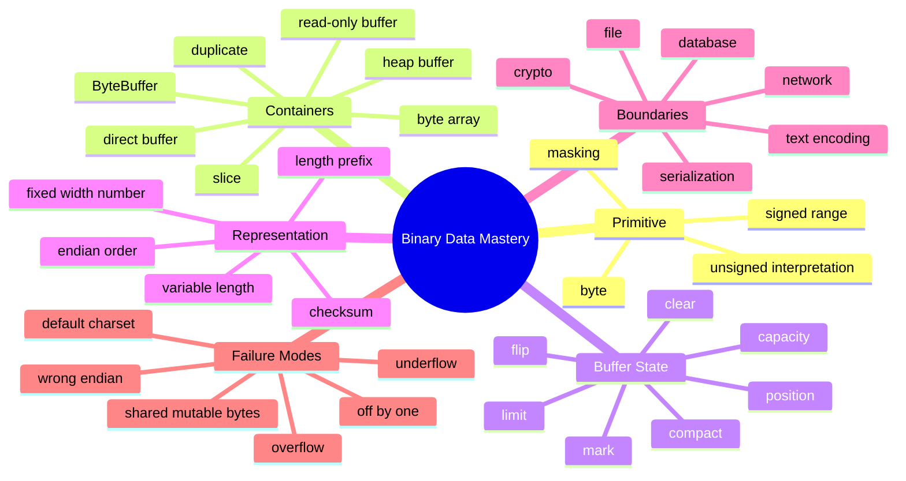
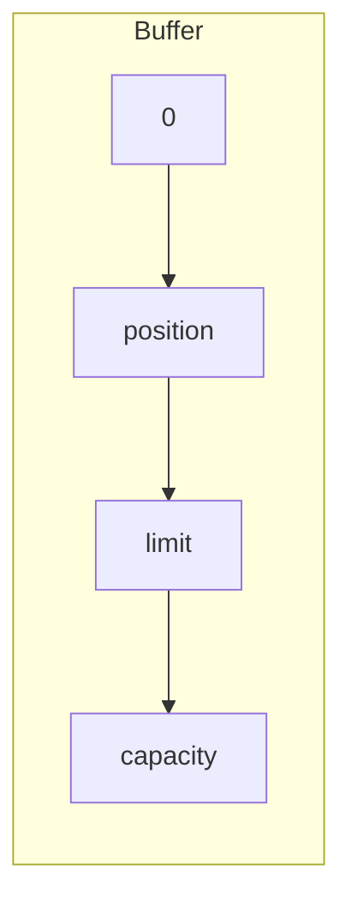
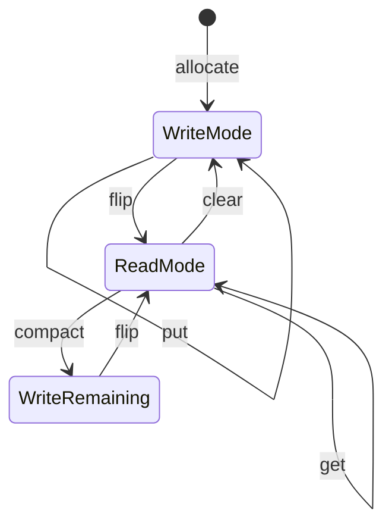
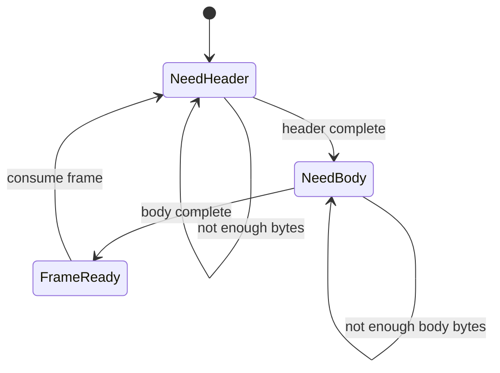

# Part 026 — Bytes, Buffers, Binary Data & Endianness

> Target part ini: memahami byte dan binary data sebagai tipe boundary paling rendah di Java: `byte`, `byte[]`, `ByteBuffer`, signedness, endianness, buffer position/limit/capacity, binary protocol, ownership, zero-copy thinking, dan konversi aman antara bytes, text, number, dan domain object.

Banyak engineer nyaman dengan `String`, JSON, object, dan DTO. Tetapi di boundary sistem, semua itu akhirnya menjadi bytes:

- HTTP request body;
- file;
- database wire protocol;
- Kafka payload;
- gRPC frame;
- TLS record;
- hash input;
- signature input;
- binary attachment;
- image/document;
- compressed payload;
- serialized object.

Jika salah memahami bytes, bug yang muncul biasanya mahal:

- signature mismatch;
- corrupted file;
- wrong integer decoding;
- memory copy berlebihan;
- encoding bug;
- off-by-one buffer;
- endianness mismatch;
- partial read bug;
- security issue karena mutable byte array bocor.

---

## 1. Kaufman Skill Map



### Skill deconstruction

| Subskill | Apa yang harus dikuasai |
|---|---|
| Byte semantics | `byte` Java signed, tetapi data binary sering unsigned. |
| Ownership | Siapa boleh mutate `byte[]` atau `ByteBuffer`? |
| Buffer state | `position`, `limit`, `capacity`, `mark`, `flip`, `clear`, `compact`. |
| Numeric representation | Bagaimana `int`, `long`, `short`, `float`, `double` disusun menjadi bytes. |
| Endianness | Urutan byte untuk multi-byte value. |
| Boundary conversion | Bytes ↔ text, bytes ↔ number, bytes ↔ domain object. |
| Failure modeling | Partial data, corrupt payload, incompatible schema, malicious input. |

---

## 2. `byte` di Java: Signed Primitive, Binary Intent

Java `byte` adalah integral primitive 8-bit signed dengan range:

```text
-128 .. 127
```

Tetapi binary protocols sering mendeskripsikan byte sebagai nilai unsigned:

```text
0 .. 255
```

Karena itu, interpretasi unsigned harus eksplisit.

```java
byte b = (byte) 0xFF;

System.out.println(b);          // -1
System.out.println(b & 0xFF);   // 255
```

Rule:

> `byte` adalah storage 8-bit. Makna signed/unsigned tergantung interpretasi.

Jangan jadikan nilai `byte` langsung sebagai integer domain jika data berasal dari protocol/file/network.

---

## 3. Byte Array: Mutable Raw Payload

`byte[]` adalah representasi raw paling umum.

```java
byte[] payload = {0x01, 0x02, 0x03};
```

Karakteristik:

- mutable;
- fixed length;
- identity object;
- equality default adalah identity equality;
- mudah bocor lewat getter;
- cocok untuk payload kecil/snapshot;
- tidak membawa charset, endian, schema, atau semantic type.

### Equality trap

```java
byte[] a = {1, 2, 3};
byte[] b = {1, 2, 3};

System.out.println(a.equals(b));          // false
System.out.println(Arrays.equals(a, b));  // true
```

### Defensive copy

```java
record BinaryPayload(byte[] bytes) {
    BinaryPayload {
        bytes = Arrays.copyOf(bytes, bytes.length);
    }

    public byte[] bytes() {
        return Arrays.copyOf(bytes, bytes.length);
    }
}
```

Tanpa defensive copy, caller bisa mengubah payload setelah object dibuat.

---

## 4. Byte Array Bukan Text

Ini salah:

```java
String text = new String(bytes); // uses default charset
byte[] out = text.getBytes();    // uses default charset
```

Lebih benar:

```java
String text = new String(bytes, StandardCharsets.UTF_8);
byte[] out = text.getBytes(StandardCharsets.UTF_8);
```

Rule:

> Bytes tidak punya encoding. Encoding adalah kontrak boundary.

Untuk signature, hash, idempotency key, dan protocol, default charset adalah bug waiting to happen.

---

## 5. ByteBuffer Mental Model

`ByteBuffer` adalah buffer byte dengan state:

- `capacity`: ukuran storage maksimum;
- `position`: indeks read/write berikutnya;
- `limit`: batas read/write aktif;
- `mark`: posisi tersimpan opsional.



Dalam write mode:

```text
position = lokasi tulis berikutnya
limit    = capacity
```

Setelah `flip()` untuk read mode:

```text
limit    = old position
position = 0
```

---

## 6. Buffer Lifecycle: write → flip → read

```java
ByteBuffer buffer = ByteBuffer.allocate(16);

buffer.putInt(42);
buffer.putShort((short) 7);

buffer.flip();

int value = buffer.getInt();
short code = buffer.getShort();
```

Diagram:



### `clear()` bukan menghapus data

```java
buffer.clear();
```

`clear()` mengatur ulang position/limit untuk write. Ia tidak zero-out memory.

### `flip()` bukan optional

Lupa `flip()` adalah bug klasik:

```java
ByteBuffer buffer = ByteBuffer.allocate(4);
buffer.putInt(123);

int x = buffer.getInt(); // BufferUnderflowException atau baca posisi salah
```

---

## 7. Relative vs Absolute Access

Relative access memakai dan mengubah `position`:

```java
int a = buffer.getInt();
int b = buffer.getInt();
```

Absolute access memakai index eksplisit dan tidak mengubah `position`:

```java
int header = buffer.getInt(0);
```

Rule:

- gunakan relative access untuk parsing sequential;
- gunakan absolute access untuk header/metadata random access;
- jangan campur tanpa alasan jelas.

---

## 8. Endianness

Endianness adalah urutan byte untuk multi-byte value.

Untuk integer `0x01020304`:

```text
Big endian:    01 02 03 04
Little endian: 04 03 02 01
```

`ByteBuffer` mendukung byte order:

```java
ByteBuffer buffer = ByteBuffer.allocate(4)
    .order(ByteOrder.BIG_ENDIAN);

buffer.putInt(0x01020304);
```

Jika protocol mengatakan little-endian:

```java
ByteBuffer buffer = ByteBuffer.wrap(bytes)
    .order(ByteOrder.LITTLE_ENDIAN);
```

Rule:

> Endianness adalah bagian dari binary contract. Jangan mengandalkan default tanpa menyatakannya.

---

## 9. Binary Protocol Example

Misalkan format payload:

```text
magic      : 2 bytes  = 0xCAFE
version    : 1 byte
flags      : 1 byte
requestId  : 8 bytes signed long
bodyLength : 4 bytes signed int
body       : N bytes UTF-8 JSON
```

Encoder:

```java
record MessageFrame(
    byte version,
    byte flags,
    long requestId,
    byte[] body
) {}

final class MessageFrameCodec {
    private static final short MAGIC = (short) 0xCAFE;
    private static final ByteOrder ORDER = ByteOrder.BIG_ENDIAN;

    byte[] encode(MessageFrame frame) {
        byte[] body = Arrays.copyOf(frame.body(), frame.body().length);
        ByteBuffer buffer = ByteBuffer
            .allocate(2 + 1 + 1 + 8 + 4 + body.length)
            .order(ORDER);

        buffer.putShort(MAGIC);
        buffer.put(frame.version());
        buffer.put(frame.flags());
        buffer.putLong(frame.requestId());
        buffer.putInt(body.length);
        buffer.put(body);

        return buffer.array();
    }
}
```

Decoder:

```java
final class MessageFrameDecoder {
    private static final short MAGIC = (short) 0xCAFE;
    private static final ByteOrder ORDER = ByteOrder.BIG_ENDIAN;

    MessageFrame decode(byte[] bytes) {
        ByteBuffer buffer = ByteBuffer.wrap(bytes).order(ORDER);

        requireRemaining(buffer, 2 + 1 + 1 + 8 + 4);

        short magic = buffer.getShort();
        if (magic != MAGIC) {
            throw new IllegalArgumentException("Invalid magic");
        }

        byte version = buffer.get();
        byte flags = buffer.get();
        long requestId = buffer.getLong();
        int bodyLength = buffer.getInt();

        if (bodyLength < 0) {
            throw new IllegalArgumentException("Negative body length");
        }
        requireRemaining(buffer, bodyLength);

        byte[] body = new byte[bodyLength];
        buffer.get(body);

        return new MessageFrame(version, flags, requestId, body);
    }

    private static void requireRemaining(ByteBuffer buffer, int required) {
        if (buffer.remaining() < required) {
            throw new IllegalArgumentException(
                "Incomplete frame: required=" + required + ", remaining=" + buffer.remaining()
            );
        }
    }
}
```

Key lessons:

- validate length before allocating;
- validate magic/version;
- set byte order explicitly;
- copy mutable body at boundary;
- treat input as untrusted;
- avoid reading beyond `remaining()`.

---

## 10. Signed Byte and Flags

Binary protocols often use bit flags.

```text
bit 0: urgent
bit 1: encrypted
bit 2: compressed
```

```java
record FrameFlags(byte raw) {
    boolean urgent() {
        return (raw & 0b0000_0001) != 0;
    }

    boolean encrypted() {
        return (raw & 0b0000_0010) != 0;
    }

    boolean compressed() {
        return (raw & 0b0000_0100) != 0;
    }

    int unsignedValue() {
        return raw & 0xFF;
    }
}
```

Jangan tulis:

```java
if (flags > 128) { ... } // wrong mental model for signed byte
```

Gunakan masking:

```java
int unsigned = flags & 0xFF;
```

---

## 11. Heap Buffer vs Direct Buffer

`ByteBuffer` bisa heap atau direct.

```java
ByteBuffer heap = ByteBuffer.allocate(1024);
ByteBuffer direct = ByteBuffer.allocateDirect(1024);
```

| Buffer | Karakteristik | Cocok untuk |
|---|---|---|
| Heap buffer | backing array di heap JVM | payload umum, mudah diakses sebagai array |
| Direct buffer | memory di luar heap Java biasa, dapat lebih efisien untuk native I/O tertentu | high-throughput I/O, native boundary |

Heuristic:

- gunakan heap buffer untuk mayoritas domain/application code;
- pertimbangkan direct buffer di I/O/performance-sensitive path;
- jangan gunakan direct buffer sebagai default tanpa profiling;
- pahami lifecycle dan memory pressure.

---

## 12. `array()`, `hasArray()`, dan Backing Array Trap

Tidak semua `ByteBuffer` punya accessible backing array.

```java
if (buffer.hasArray()) {
    byte[] array = buffer.array();
}
```

Trap:

- direct buffer tidak punya heap array;
- read-only buffer bisa menolak akses array;
- `array()` bisa mengekspos storage lebih besar dari `remaining()`;
- backing array offset bisa tidak nol.

Lebih aman untuk mengambil remaining bytes:

```java
byte[] copyRemaining(ByteBuffer source) {
    ByteBuffer duplicate = source.asReadOnlyBuffer();
    byte[] bytes = new byte[duplicate.remaining()];
    duplicate.get(bytes);
    return bytes;
}
```

---

## 13. `slice()`, `duplicate()`, `asReadOnlyBuffer()`

```java
ByteBuffer original = ByteBuffer.allocate(10);
ByteBuffer duplicate = original.duplicate();
ByteBuffer slice = original.slice();
ByteBuffer readOnly = original.asReadOnlyBuffer();
```

| Method | Sharing | Position/limit | Mutability |
|---|---|---|---|
| `duplicate()` | shares content | independent position/limit | same mutability |
| `slice()` | shares subrange content | independent position/limit over slice | same mutability |
| `asReadOnlyBuffer()` | shares content | independent position/limit | read-only view |

Important:

> Slice/duplicate/read-only buffer can still observe mutations made through another writable view.

Read-only is not immutable. It only prevents writes through that view.

---

## 14. Ownership Model

For binary data, always decide ownership.

```java
record UnsafePayload(byte[] bytes) {}
```

The caller owns the array and can mutate it.

Safer:

```java
record Payload(byte[] bytes) {
    Payload {
        bytes = Arrays.copyOf(bytes, bytes.length);
    }

    public byte[] bytes() {
        return Arrays.copyOf(bytes, bytes.length);
    }
}
```

For high-performance internal path, you may use ownership transfer:

```java
final class OwnedBytes {
    private byte[] bytes;

    OwnedBytes(byte[] bytes) {
        this.bytes = Objects.requireNonNull(bytes);
    }

    byte[] take() {
        byte[] result = bytes;
        bytes = null;
        return result;
    }
}
```

But ownership transfer must be documented and enforced. Otherwise, zero-copy becomes shared-mutable-data bug.

---

## 15. Zero-Copy Thinking

Zero-copy means avoiding unnecessary copying of bytes.

But there is a trade-off:

| Choice | Benefit | Risk |
|---|---|---|
| Copy | isolation, immutability boundary, simpler reasoning | CPU/memory overhead |
| Share | lower allocation/copy cost | mutation leak, lifetime coupling, security risk |

Rule:

- copy at trust boundary;
- share only inside controlled performance path;
- document ownership;
- prefer read-only view only when shared mutation is impossible or acceptable;
- benchmark before optimizing copies away.

---

## 16. ByteBuffer and Domain Boundary

Do not let `ByteBuffer` leak deep into domain model unless binary position/state is genuinely part of the domain.

Bad:

```java
record CustomerDocument(ByteBuffer content) {}
```

Better:

```java
record DocumentContent(byte[] bytes, String contentType, Digest digest) {
    DocumentContent {
        bytes = Arrays.copyOf(bytes, bytes.length);
    }

    public byte[] bytes() {
        return Arrays.copyOf(bytes, bytes.length);
    }
}
```

Even better for large files:

```java
record StoredDocumentRef(
    String objectKey,
    long size,
    String contentType,
    Digest digest
) {}
```

Domain usually needs identity, size, type, and digest, not arbitrary mutable buffer state.

---

## 17. Digest and Signature Boundary

Hash/signature must operate on exact bytes, not “equivalent text”.

```java
MessageDigest digest = MessageDigest.getInstance("SHA-256");
byte[] hash = digest.digest(payloadBytes);
```

Failure mode:

```java
String text = new String(payloadBytes, StandardCharsets.UTF_8);
byte[] canonical = text.getBytes(StandardCharsets.UTF_8);
```

This may change byte representation if input had invalid sequences, different normalization, line endings, or canonicalization mismatch.

Rule:

> Crypto signs bytes. If domain signs text, define canonicalization explicitly.

---

## 18. Length Prefix and Allocation Risk

Never trust length from untrusted binary input.

Bad:

```java
int length = buffer.getInt();
byte[] body = new byte[length];
buffer.get(body);
```

Better:

```java
int length = buffer.getInt();
if (length < 0 || length > maxFrameSize || length > buffer.remaining()) {
    throw new IllegalArgumentException("Invalid frame length: " + length);
}
byte[] body = new byte[length];
buffer.get(body);
```

Length field is an attack surface:

- negative length;
- huge allocation;
- incomplete frame;
- integer overflow in total size calculation;
- decompression bomb if compressed.

---

## 19. Binary Versioning

A binary format should reserve space for evolution.

```text
magic   : 2 bytes
version : 1 byte
flags   : 1 byte
length  : 4 bytes
body    : N bytes
```

Version handling:

```java
switch (version & 0xFF) {
    case 1 -> decodeV1(buffer);
    case 2 -> decodeV2(buffer);
    default -> throw new IllegalArgumentException("Unsupported version: " + (version & 0xFF));
}
```

Use unsigned interpretation for version byte.

---

## 20. Byte Order and Cross-Language Interop

When Java talks to C, Go, Python, Rust, database engine, or hardware, binary layout must be explicit:

- integer width;
- signedness;
- endian order;
- string encoding;
- floating-point representation;
- alignment/padding;
- length prefix size;
- null terminator or not;
- checksum algorithm;
- compression algorithm.

Do not assume Java object layout maps to binary layout.

Java object serialization is not a stable cross-language binary contract for enterprise APIs.

---

## 21. `ByteBuffer` State Bugs

### 21.1 Lupa `flip()`

```java
buffer.put(data);
channel.write(buffer); // writes from current position to limit, likely nothing useful
```

Fix:

```java
buffer.put(data);
buffer.flip();
channel.write(buffer);
```

### 21.2 Salah memakai `clear()` saat masih ada unread data

`clear()` discards state about unread data. Untuk menyimpan remaining bytes sebelum write lagi, gunakan `compact()`.

### 21.3 Membaca tanpa cek `remaining()`

```java
int length = buffer.getInt();
```

Jika data partial, `BufferUnderflowException` bisa terjadi. Untuk protocol parser, validasi `remaining()` dan return “need more data” jika frame belum lengkap.

### 21.4 Menyimpan `ByteBuffer` setelah caller mutate position

```java
record Frame(ByteBuffer payload) {}
```

Caller bisa mengubah `position`, `limit`, dan content. Gunakan copy atau read-only duplicate dengan ownership contract.

---

## 22. Parser State Machine for Partial Frames

Network/file streaming bisa memberikan partial data.



Jangan menulis parser yang mengasumsikan semua bytes datang sekaligus.

Pseudo-model:

```java
sealed interface DecodeResult permits NeedMoreData, DecodedFrame, CorruptFrame {}
record NeedMoreData(int requiredBytes) implements DecodeResult {}
record DecodedFrame(MessageFrame frame) implements DecodeResult {}
record CorruptFrame(String reason) implements DecodeResult {}
```

Ini lebih baik daripada langsung melempar exception untuk setiap partial read.

---

## 23. Binary Data in JSON/API

Jika harus mengirim binary lewat JSON, biasanya pakai Base64.

```json
{
  "contentType": "application/pdf",
  "sha256": "...",
  "contentBase64": "JVBERi0xLjQK..."
}
```

Design notes:

- simpan `contentType`;
- simpan `size`;
- simpan digest;
- batasi maximum size;
- jangan log payload;
- validasi Base64;
- pertimbangkan object storage reference untuk file besar.

---

## 24. Binary Data and Logging

Jangan log raw bytes sembarangan.

Bad:

```java
log.info("payload={}", Arrays.toString(bytes));
```

Problems:

- PII leakage;
- credential leakage;
- huge logs;
- binary corruption in log sink;
- compliance risk.

Better:

```java
log.info(
    "payload size={}, sha256={}, contentType={}",
    bytes.length,
    hex(sha256(bytes)),
    contentType
);
```

---

## 25. Hex Utilities

Untuk diagnostic, hex lebih aman daripada raw byte dump, tetapi tetap jangan dump sensitive data penuh.

```java
static String toHex(byte[] bytes, int maxBytes) {
    int length = Math.min(bytes.length, maxBytes);
    StringBuilder sb = new StringBuilder(length * 2);
    for (int i = 0; i < length; i++) {
        sb.append(Character.forDigit((bytes[i] >>> 4) & 0xF, 16));
        sb.append(Character.forDigit(bytes[i] & 0xF, 16));
    }
    if (bytes.length > maxBytes) {
        sb.append("...");
    }
    return sb.toString();
}
```

Catatan:

- `bytes[i] >>> 4` promotes `byte` to `int`, signed extension bisa memengaruhi bit atas;
- masking dengan `& 0xF` memastikan hanya nibble rendah yang dipakai.

---

## 26. Floating-Point in Binary

`ByteBuffer` bisa membaca/menulis `float` dan `double`.

```java
ByteBuffer buffer = ByteBuffer.allocate(8).order(ByteOrder.BIG_ENDIAN);
buffer.putDouble(12.34);
buffer.flip();
double value = buffer.getDouble();
```

Tetapi untuk money/financial exact value, jangan menyimpan `double` hanya karena format binary mendukungnya.

Binary representation harus mengikuti domain precision contract.

Alternatif untuk money:

```text
currency: 3 ASCII bytes, e.g. IDR
scale   : 1 byte
amount  : 8 bytes signed long minor/scaled units
```

Atau pakai decimal string/canonical decimal representation jika interop lebih penting daripada compactness.

---

## 27. Designing a Safe Binary Value Object

```java
public final class ImmutableBytes {
    private final byte[] bytes;

    private ImmutableBytes(byte[] bytes) {
        this.bytes = bytes;
    }

    public static ImmutableBytes copyOf(byte[] input) {
        return new ImmutableBytes(Arrays.copyOf(input, input.length));
    }

    public static ImmutableBytes fromRemaining(ByteBuffer source) {
        ByteBuffer duplicate = source.asReadOnlyBuffer();
        byte[] copy = new byte[duplicate.remaining()];
        duplicate.get(copy);
        return new ImmutableBytes(copy);
    }

    public int size() {
        return bytes.length;
    }

    public byte[] toByteArray() {
        return Arrays.copyOf(bytes, bytes.length);
    }

    public ByteBuffer asReadOnlyBuffer() {
        return ByteBuffer.wrap(bytes).asReadOnlyBuffer();
    }

    @Override
    public boolean equals(Object other) {
        return other instanceof ImmutableBytes that
            && Arrays.equals(this.bytes, that.bytes);
    }

    @Override
    public int hashCode() {
        return Arrays.hashCode(bytes);
    }
}
```

This class:

- copies input;
- hides mutable array;
- implements content equality;
- returns copy or read-only view;
- avoids exposing internal ownership.

---

## 28. Failure Modes

| Failure | Root cause | Prevention |
|---|---|---|
| Signature mismatch | default charset or text canonicalization mismatch | sign exact bytes, define canonicalization |
| Wrong integer value | endian mismatch | set `ByteOrder` explicitly |
| Negative version byte | signed byte interpretation | use `b & 0xFF` |
| BufferUnderflowException | read before checking remaining | validate length and remaining |
| Memory spike | untrusted length allocation | max frame size |
| Corrupted payload | shared mutable `byte[]` | defensive copy / ownership transfer |
| Empty write | forgot `flip()` | buffer lifecycle tests |
| Lost unread bytes | used `clear()` instead of `compact()` | state machine parser |
| API leak | logged raw bytes | log size/digest/metadata only |
| Cross-language bug | implicit binary layout | protocol spec with width/endian/encoding |

---

## 29. Review Checklist

- [ ] Is the data actually bytes, text, number, or domain object?
- [ ] Is charset explicit when converting bytes ↔ text?
- [ ] Is byte order explicit for multi-byte values?
- [ ] Are signed bytes interpreted correctly when protocol expects unsigned?
- [ ] Is mutable `byte[]` defensively copied at trust boundaries?
- [ ] Does the API expose buffer state accidentally?
- [ ] Are `position`, `limit`, and `capacity` handled correctly?
- [ ] Is `flip()`/`clear()`/`compact()` usage tested?
- [ ] Is untrusted length validated before allocation?
- [ ] Is max payload size enforced?
- [ ] Is binary versioning present?
- [ ] Are digest/signature computed over exact canonical bytes?
- [ ] Are logs free from raw sensitive bytes?
- [ ] Is large binary stored by reference instead of embedded in domain aggregate?
- [ ] Are partial frames handled without corrupting parser state?

---

## 30. Deliberate Practice

### Exercise 1 — Unsigned byte decoding

Write a method:

```java
int unsignedByte(byte b)
```

Test:

- `0x00 -> 0`
- `0x7F -> 127`
- `0x80 -> 128`
- `0xFF -> 255`

### Exercise 2 — Encode/decode a frame

Design binary frame:

```text
magic: 2 bytes
version: 1 byte
type: 1 byte
correlationId: 8 bytes
payloadLength: 4 bytes
payload: N bytes
```

Requirements:

- explicit endian;
- defensive copy;
- max payload size;
- unknown version handling;
- incomplete frame handling.

### Exercise 3 — ByteBuffer lifecycle tests

Create tests that prove:

- `flip()` changes write mode to read mode;
- `clear()` does not erase content;
- `duplicate()` shares content but has independent position;
- `asReadOnlyBuffer()` blocks writes through that view;
- mutation through original is visible in read-only view.

### Exercise 4 — Document payload value object

Create `DocumentContent` with:

- immutable bytes;
- content type;
- size;
- SHA-256 digest;
- no raw bytes in `toString()`;
- content equality based on digest and size.

---

## 31. Production Design Heuristics

1. **Bytes are not text.** Always specify charset.
2. **`byte` is signed in Java.** Mask when protocol wants unsigned.
3. **`byte[]` is mutable.** Copy at boundaries.
4. **`ByteBuffer` carries state.** Do not treat it as a plain array.
5. **Endianness is a contract.** Set it explicitly.
6. **Length fields are untrusted.** Validate before allocating.
7. **Read-only view is not immutable data.** It can observe external mutation.
8. **Crypto signs bytes.** Do not roundtrip through `String` unless canonicalization is defined.
9. **Log metadata, not payload.** Size/digest/content type are usually enough.
10. **Optimize copies only where ownership is clear and measured.**

---

## 32. Sumber Resmi dan Bacaan Lanjutan

- Java SE 25 API — `ByteBuffer`: `https://docs.oracle.com/en/java/javase/25/docs/api/java.base/java/nio/ByteBuffer.html`
- Java SE 25 API — `ByteOrder`: `https://docs.oracle.com/en/java/javase/25/docs/api/java.base/java/nio/ByteOrder.html`
- Java SE 25 API — `Buffer`: `https://docs.oracle.com/en/java/javase/25/docs/api/java.base/java/nio/Buffer.html`
- Java SE 25 API — `StandardCharsets`: `https://docs.oracle.com/en/java/javase/25/docs/api/java.base/java/nio/charset/StandardCharsets.html`
- Java SE 25 API — `MessageDigest`: `https://docs.oracle.com/en/java/javase/25/docs/api/java.base/java/security/MessageDigest.html`
- Java SE 25 JLS — Primitive Types and Values: `https://docs.oracle.com/javase/specs/jls/se25/html/jls-4.html#jls-4.2`

---

## 33. Ringkasan

Binary data adalah boundary paling mentah dari sistem Java. Sebelum data menjadi `String`, DTO, JSON, atau domain object, ia adalah bytes.

Mental model utama:

- `byte` Java adalah signed 8-bit, tetapi binary contract bisa unsigned.
- `byte[]` adalah mutable raw payload, bukan immutable value.
- `ByteBuffer` adalah stateful view atas bytes dengan `position`, `limit`, dan `capacity`.
- Endianness menentukan cara multi-byte number disusun.
- Charset menentukan cara bytes menjadi text.
- Binary parser harus memvalidasi length, version, remaining bytes, dan corruption.
- Zero-copy adalah optimization yang harus dibayar dengan ownership discipline.

Top 1% engineer memperlakukan bytes sebagai kontrak eksplisit: width, endian, charset, version, length, checksum, ownership, dan failure mode semuanya didesain, bukan diasumsikan.
