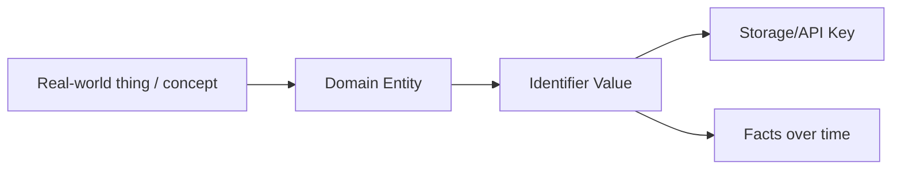
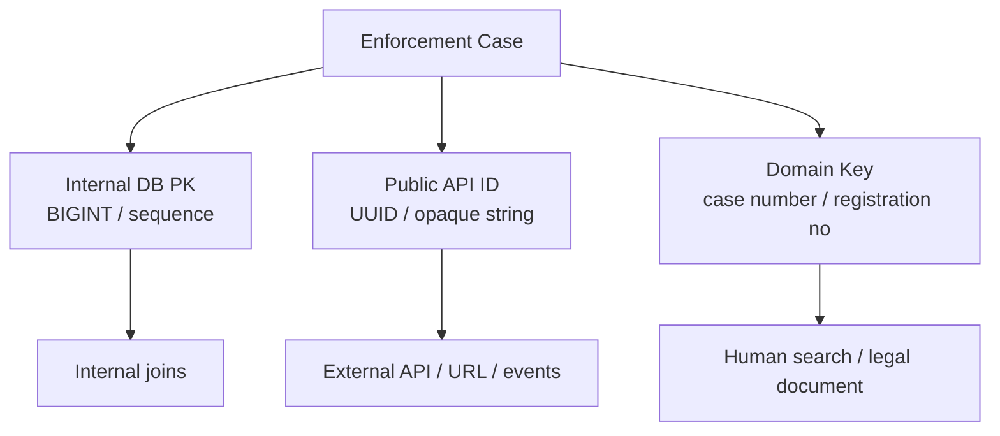
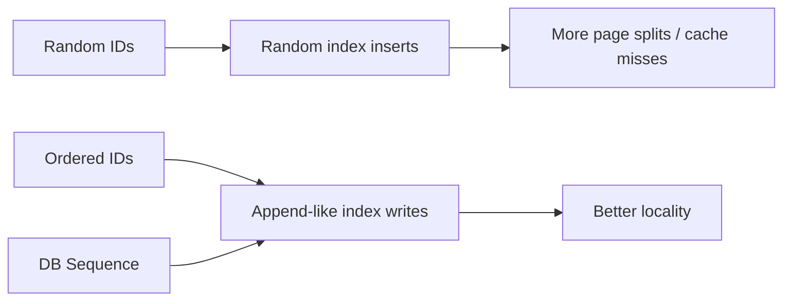
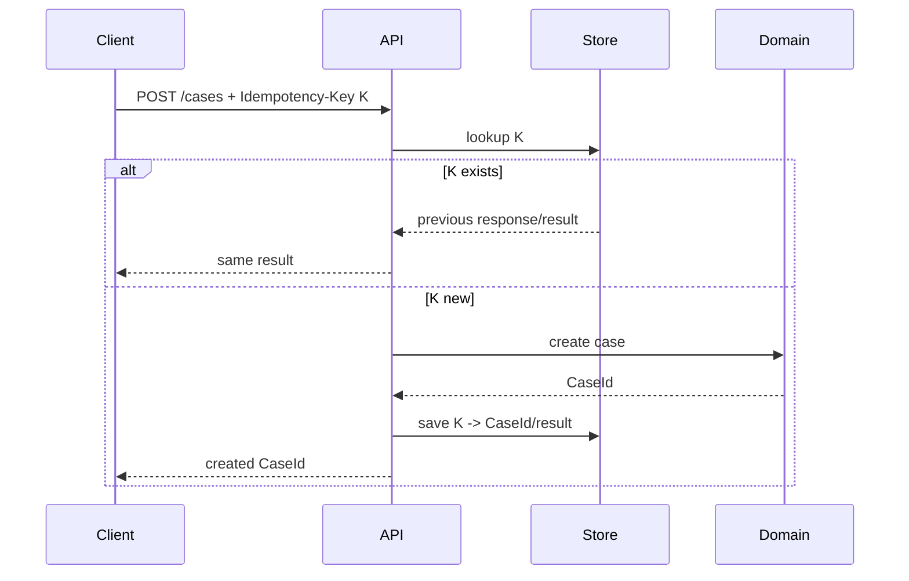
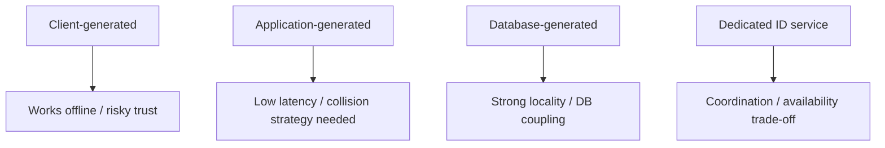

------
title: Learn Java Data Types, Type Semantics, Object Model & Data Representation - Part 027
description: Identifier modeling in Java: IDs, UUIDs, sequences, natural keys, surrogate keys, domain keys, idempotency keys, opaque references, and production-grade trade-offs.
series: learn-java-data-types
seriesTitle: Learn Java Data Types, Type Semantics, Object Model & Data Representation
order: 27
partTitle: Identifiers, IDs, UUIDs, Sequences & Domain Keys
tags:
- java
- data-types
- identifiers
- uuid
- domain-modeling
- api-design
- distributed-systems
date: 2026-06-30
---

# Part 027 — Identifiers, IDs, UUIDs, Sequences & Domain Keys

> **Target:** setelah part ini, kamu tidak hanya tahu cara memakai `long`, `UUID`, atau `String` sebagai ID. Kamu mampu memilih, membungkus, mengekspos, memvalidasi, menyimpan, dan mengoperasikan identifier berdasarkan constraint sistem: uniqueness, locality, privacy, ordering, sharding, idempotency, auditability, dan evolusi kontrak.

Part ini adalah kelanjutan natural dari pembahasan primitive, reference, equality, immutability, text, bytes, time, dan exact numbers. Identifier adalah **tipe kecil dengan konsekuensi besar**. Banyak sistem enterprise runtuh bukan karena algoritma rumit, tetapi karena ID yang salah: ID bocor, ID bisa ditebak, key berubah, equality salah, event tidak idempotent, database index membengkak, atau public API mengekspos primary key internal.

Kita akan memakai pendekatan Kaufman:

1. **Deconstruct the skill**: pecah skill identifier modeling menjadi subskill: konsep identity, key classification, generation authority, encoding, boundary, equality, privacy, observability, migration.
2. **Learn enough to self-correct**: punya checklist untuk mendeteksi ID yang salah sebelum production.
3. **Remove barriers to practice**: pakai template Java record/value object yang langsung bisa diterapkan.
4. **Deliberate practice**: latihan desain ID untuk entity, command, event, request, audit, dan integration boundary.

---

## 1. Core Mental Model

Identifier bukan sekadar nilai unik. Identifier adalah **handle stabil** untuk menghubungkan banyak fakta tentang sesuatu di sepanjang waktu.



Bedakan empat istilah ini:

| Istilah | Makna | Contoh |
|---|---|---|
| Identity | Keberlanjutan konsep/entity walau atribut berubah | case yang sama walau status berubah |
| Identifier | Nilai yang menunjuk identity | `CaseId`, `CustomerId`, `PaymentId` |
| Key | Identifier dalam konteks lookup/index/constraint | DB primary key, unique key, map key |
| Reference | Pointer/rujukan dari satu object/context ke identity lain | `caseId` di `EnforcementAction` |

Kesalahan paling umum: menganggap **identifier sama dengan identity**. Identifier hanyalah representasi. Identity adalah konsep domain.

```java
record CaseId(UUID value) {}

record EnforcementCase(
    CaseId id,
    CaseStatus status,
    Instant openedAt
) {}
```

`CaseId` bukan case. Ia adalah value yang menunjuk case. Ini penting karena `CaseId` bisa dikirim lewat event, audit log, URL, command, dan cache tanpa membawa seluruh object `EnforcementCase`.

---

## 2. Why Raw Primitive IDs Are Dangerous

Contoh buruk:

```java
void assignOfficer(long caseId, long officerId) {
    // ...
}

assignOfficer(officerId, caseId); // compiles, wrong semantics
```

Compiler melihat dua `long`. Domain melihat dua konsep berbeda.

Gunakan semantic wrapper:

```java
record CaseId(long value) {
    CaseId {
        if (value <= 0) {
            throw new IllegalArgumentException("case id must be positive");
        }
    }
}

record OfficerId(long value) {
    OfficerId {
        if (value <= 0) {
            throw new IllegalArgumentException("officer id must be positive");
        }
    }
}

void assignOfficer(CaseId caseId, OfficerId officerId) {
    // ...
}
```

Sekarang swap tidak compile:

```java
assignOfficer(officerId, caseId); // compile error
```

Ini adalah contoh **type-driven design** paling murah: membuat illegal states lebih sulit dibuat.

---

## 3. Identifier Design Dimensions

Sebelum memilih `long`, `UUID`, ULID-style string, sequence, atau external code, jawab dimensi berikut.

| Dimension | Pertanyaan desain | Dampak |
|---|---|---|
| Uniqueness scope | Unik global, tenant, table, aggregate, atau command? | Collision, sharding, merge data |
| Generation authority | DB, app, central service, client, partner? | Latency, offline mode, ordering |
| Sortability | Perlu chronological/orderable? | Index locality, pagination, event replay |
| Opacity | Boleh ditebak/dibaca manusia? | Security, enumeration, privacy |
| Stability | Apakah bisa berubah? | Foreign key, audit, event references |
| Size | 8 bytes, 16 bytes, 26 chars, 36 chars? | Index/storage/network cost |
| Human usability | Perlu dibacakan ke operator? | Support, call center, audit search |
| Compatibility | Akan muncul di public API/event? | Migration dan schema evolution |
| Semantics | ID membawa makna domain atau opaque? | Coupling dan leakage |
| Privacy | ID mengekspos volume, waktu, tenant, region? | Compliance dan threat model |

Rule praktis:

> **Internal primary key boleh optimized untuk storage. External identifier harus optimized untuk contract, privacy, dan stability. Jangan paksa satu ID melayani semua kebutuhan.**

---

## 4. Surrogate Key vs Natural Key vs Domain Key

### 4.1 Surrogate Key

Surrogate key tidak berasal dari domain. Ia dibuat sistem.

```sql
case_pk BIGINT PRIMARY KEY
```

Kelebihan:

- compact
- cepat untuk join/index
- tidak berubah ketika atribut domain berubah
- mudah sebagai foreign key internal

Risiko:

- kalau diekspos, bisa ditebak
- tidak punya makna domain
- bisa membuat developer lupa unique constraint domain yang sebenarnya

### 4.2 Natural Key

Natural key berasal dari domain.

Contoh:

- nomor registrasi resmi
- nomor izin
- kode lembaga
- nomor rekening
- tax ID

Kelebihan:

- bermakna bagi user/domain
- bisa dipakai deduplication
- punya legal/audit relevance

Risiko:

- bisa berubah karena koreksi atau regulasi
- bisa punya format berbeda per yurisdiksi
- bisa sensitif/PII
- bisa tidak benar-benar unik dalam data kotor

### 4.3 Domain Key

Domain key adalah key yang sistem anggap stabil untuk domain tertentu, walau tidak selalu primary key.

```java
record LicenseNumber(String value) {}
record InstitutionCode(String value) {}
record CaseNumber(String value) {}
```

Domain key biasanya perlu rule validasi, normalisasi, dan lifecycle sendiri.

---

## 5. A Better Enterprise Pattern: Internal PK + Public ID + Domain Key

Untuk sistem enterprise, sering lebih aman memakai beberapa identifier dengan tujuan berbeda.



Contoh Java:

```java
record CasePk(long value) {
    CasePk {
        if (value <= 0) throw new IllegalArgumentException("case pk must be positive");
    }
}

record CaseId(UUID value) {
    CaseId {
        if (value == null) throw new NullPointerException("value");
    }
}

record CaseNumber(String value) {
    CaseNumber {
        if (value == null || value.isBlank()) {
            throw new IllegalArgumentException("case number is required");
        }
        value = value.trim().toUpperCase(Locale.ROOT);
    }
}
```

Satu entity bisa punya:

- `CasePk`: internal relational/storage identity
- `CaseId`: stable public/API/event identity
- `CaseNumber`: human/legal domain reference

Ini bukan overengineering jika sistem memiliki API publik, audit, integrasi, atau lifecycle panjang.

---

## 6. Numeric Sequence IDs

Numeric ID berbasis sequence umum di database-backed enterprise systems.

```java
record CustomerId(long value) {
    CustomerId {
        if (value <= 0) throw new IllegalArgumentException("customer id must be positive");
    }
}
```

### 6.1 Strengths

- compact: `long` = 64 bit
- fast comparison
- bagus untuk B-tree locality jika incrementing
- mudah dibaca di log internal
- storage/index lebih kecil daripada string UUID

### 6.2 Weaknesses

- biasanya butuh central authority
- exposed sequential IDs memudahkan enumeration
- migration/sharding/merge bisa rumit
- reveal business volume atau chronology
- rentan coupling ke database implementation

### 6.3 When Numeric IDs Are Good

Gunakan numeric sequence untuk:

- internal DB primary key
- high-write relational joins
- private internal service boundary yang dipercaya
- table besar dengan index cost sensitif

Hindari expose numeric sequence di:

- public URL
- partner API
- mobile app
- untrusted client
- audit search yang bisa bocor ke pihak luar

---

## 7. UUID in Java

`java.util.UUID` adalah class immutable yang merepresentasikan 128-bit UUID. Ia `final`, `Serializable`, dan `Comparable<UUID>`.

```java
UUID id = UUID.randomUUID();
String external = id.toString();
UUID parsed = UUID.fromString(external);
```

Bungkus UUID dengan domain type:

```java
record PaymentId(UUID value) {
    PaymentId {
        if (value == null) throw new NullPointerException("value");
    }

    static PaymentId newId() {
        return new PaymentId(UUID.randomUUID());
    }

    static PaymentId parse(String raw) {
        return new PaymentId(UUID.fromString(raw));
    }

    @Override
    public String toString() {
        return value.toString();
    }
}
```

### 7.1 Why Not Use Raw `UUID` Everywhere?

Raw `UUID` loses semantics:

```java
void refund(UUID paymentId, UUID customerId) {
    // both are UUID; compiler cannot help
}
```

Better:

```java
void refund(PaymentId paymentId, CustomerId customerId) {
    // semantic types prevent accidental swap
}
```

### 7.2 UUID v4

`UUID.randomUUID()` returns a pseudo-randomly generated UUID. This is typically used when decentralized generation and opacity are more important than ordering.

Trade-offs:

| Aspect | UUID v4 |
|---|---|
| Uniqueness | Very strong probabilistic uniqueness |
| Generation | Decentralized |
| Sortability | Poor chronological locality |
| Privacy | Usually opaque |
| Index locality | Random insertion pattern can be costly |
| Human usability | Poor |

### 7.3 UUID Versions Beyond v4

Modern UUID work includes time-ordered variants such as UUIDv7 in RFC 9562. Java's standard `UUID` class can represent UUID values and expose version/variant information, but when you need a specific generation algorithm such as UUIDv7, verify the JDK/library support rather than assuming `UUID.randomUUID()` gives chronological order.

Rule:

> `UUID.randomUUID()` is not a sortable event/time ID strategy. If ordering matters, choose an explicit ordered identifier strategy.

---

## 8. ULID-Style IDs

ULID-style identifiers are commonly used because they are:

- 128-bit compatible in spirit with UUID-sized identifiers
- lexicographically sortable when generated correctly
- string-friendly
- URL-safe
- easier to copy than standard UUID text

Example wrapper if using a library:

```java
record EventId(String value) {
    private static final Pattern ULID_PATTERN =
        Pattern.compile("[0-9A-HJKMNP-TV-Z]{26}");

    EventId {
        if (value == null) throw new NullPointerException("value");
        value = value.trim().toUpperCase(Locale.ROOT);
        if (!ULID_PATTERN.matcher(value).matches()) {
            throw new IllegalArgumentException("invalid event id");
        }
    }
}
```

Do not implement ID randomness casually. The wrapper can validate shape, but generation should rely on a vetted implementation.

---

## 9. ID Locality and Database Index Behavior

Identifier choice affects storage performance.



This does not mean “UUID is bad”. It means ID choice is a workload decision.

Ask:

- Is this table write-heavy?
- Is primary key clustered?
- Are writes distributed across tenants?
- Is ID exposed publicly?
- Do we need pagination by creation order?
- Do we need offline generation?
- What is the index/storage budget?

For many systems:

- internal PK: sequence/identity/bigint
- public ID: UUID/ULID/opaque token
- event ID: ordered ID or UUID depending on replay/query needs

---

## 10. Opaque IDs vs Meaningful IDs

Meaningful IDs encode information:

```text
CASE-2026-JKT-00001234
```

This is useful for humans but risky as system identity.

Problems:

- leaks region/time/volume
- format changes become breaking changes
- parsing ID becomes business logic
- generation becomes coupled to regulatory rules
- correction becomes painful

Better separation:

```java
record CaseId(UUID value) {}
record CaseNumber(String value) {}
```

Use `CaseId` for identity. Use `CaseNumber` for human/legal reference.

---

## 11. ID as API Contract

Once an ID crosses an API/event boundary, it becomes contract.

```json
{
  "caseId": "b4d78b5c-5a35-4f5d-88af-6e5b1bd9e22e",
  "caseNumber": "CASE-2026-JKT-00001234"
}
```

Never promise properties you cannot maintain:

| Bad implicit promise | Why dangerous |
|---|---|
| ID is numeric and increasing | prevents sharding/migration |
| ID encodes region | region split/merge breaks format |
| ID can be parsed for date | timezone/correction/legacy issues |
| ID length fixed forever | migration to new scheme breaks clients |
| ID is case-insensitive | storage/search mismatch |

API recommendation:

- Treat public IDs as opaque strings from client perspective.
- Document format only if client must validate locally.
- Prefer server-side validation.
- Do not let clients infer authorization from ID shape.

---

## 12. Identifier Equality

ID equality must be boring.

```java
record CaseId(UUID value) {}
```

Record gives component-based equality:

```java
CaseId a = new CaseId(UUID.fromString("b4d78b5c-5a35-4f5d-88af-6e5b1bd9e22e"));
CaseId b = new CaseId(UUID.fromString("b4d78b5c-5a35-4f5d-88af-6e5b1bd9e22e"));

System.out.println(a.equals(b)); // true
```

Avoid mutable IDs:

```java
final class BadId {
    String value;
}
```

If used as `HashMap` key and mutated, lookup can break.

---

## 13. ID Normalization

String IDs need canonical form.

```java
record PartnerReference(String value) {
    PartnerReference {
        if (value == null) throw new NullPointerException("value");
        value = value.trim();
        if (value.isEmpty()) {
            throw new IllegalArgumentException("partner reference is required");
        }
    }
}
```

But be careful: not every string ID should be uppercased.

Safe normalization depends on contract:

| Operation | Safe only if contract says |
|---|---|
| trim | surrounding whitespace insignificant |
| uppercase | ID is case-insensitive |
| Unicode normalization | canonical equivalence expected |
| remove hyphen | formatting not semantic |
| parse to number | leading zero not semantic |

Example dangerous normalization:

```java
record AccountNumber(String value) {
    AccountNumber {
        value = String.valueOf(Long.parseLong(value)); // destroys leading zeros
    }
}
```

If leading zero is part of identifier representation, this corrupts data.

---

## 14. Idempotency Keys

Idempotency key is not entity ID. It identifies a **request intent** so retry does not duplicate side effects.

```java
record IdempotencyKey(String value) {
    IdempotencyKey {
        if (value == null || value.isBlank()) {
            throw new IllegalArgumentException("idempotency key is required");
        }
        value = value.trim();
        if (value.length() > 128) {
            throw new IllegalArgumentException("idempotency key too long");
        }
    }
}
```

Usage:

```java
record SubmitCaseCommand(
    IdempotencyKey idempotencyKey,
    ApplicantId applicantId,
    CasePayload payload
) {}
```

Mental model:



Design points:

- Scope idempotency key by actor/client/operation.
- Store request hash to detect key reuse with different payload.
- Define TTL based on business retry window.
- Never confuse idempotency key with final entity ID.

---

## 15. Correlation ID, Request ID, Event ID, Command ID

Different operational IDs have different semantics.

| ID Type | Identifies | Lifetime | Used for |
|---|---|---|---|
| Request ID | one inbound request | short | logs/tracing |
| Correlation ID | logical workflow across calls | workflow duration | distributed tracing/support |
| Command ID | requested business action | command processing | idempotency/dedup |
| Event ID | emitted fact | forever | event log/replay/dedup |
| Aggregate ID | domain entity | entity lifetime | state lookup |

Do not reuse one field for all of them.

```java
record RequestId(String value) {}
record CorrelationId(String value) {}
record CommandId(UUID value) {}
record EventId(String value) {}
record CaseId(UUID value) {}
```

This looks verbose, but it prevents entire classes of observability and consistency bugs.

---

## 16. Tenant-Aware IDs

In multi-tenant systems, uniqueness scope matters.

```java
record TenantId(String value) {}
record LocalCaseNumber(String value) {}

record TenantScopedCaseKey(TenantId tenantId, LocalCaseNumber caseNumber) {}
```

Do not assume local key is globally unique:

```java
Map<String, Case> byCaseNumber = new HashMap<>(); // wrong if case number is tenant-local
```

Better:

```java
Map<TenantScopedCaseKey, Case> byCaseKey = new HashMap<>();
```

Rule:

> If uniqueness is scoped, encode the scope in the type.

---

## 17. ID Generation Authority

Who is allowed to create an ID?



### 17.1 DB-generated

Good for internal PK:

```java
record CasePk(long value) {}
```

But domain object may not have PK until persisted.

### 17.2 Application-generated

Good for public ID and events:

```java
CaseId id = CaseId.newId();
```

You can emit events before persistence if consistency model allows it.

### 17.3 Client-generated

Useful for offline/mobile/idempotent workflows, but validate trust:

- enforce ownership
- reject duplicates
- scope by client/tenant
- never trust client ID for authorization

### 17.4 Dedicated ID service

Useful when global monotonic order or embedded topology is required. Trade-off: operational complexity and availability dependency.

---

## 18. Security and Privacy Failure Modes

### 18.1 Enumeration

Sequential ID in URL:

```text
GET /cases/10001
GET /cases/10002
GET /cases/10003
```

This invites enumeration. Authorization must still be enforced, but opaque IDs reduce attack surface.

### 18.2 Business Volume Leakage

If case number increments globally, external parties can infer volume.

### 18.3 Timestamp Leakage

Time-sortable IDs may reveal creation time. Sometimes acceptable; sometimes not.

### 18.4 Tenant Leakage

ID prefix like `BANK-A-...` may reveal tenant or regulated entity.

### 18.5 ID in Logs

Some IDs are sensitive even if not PII. Treat domain keys carefully.

---

## 19. ID and Authorization

Identifier lookup is not authorization.

Bad:

```java
Case c = repository.findById(caseId).orElseThrow();
return c;
```

Better:

```java
Case c = repository.findById(caseId).orElseThrow();
policy.requireCanView(user, c);
return c;
```

Even better for data minimization:

```java
Optional<Case> findVisibleCase(UserId userId, CaseId caseId);
```

But do not hide authorization rules inside repository so deeply that they become untestable. The key is explicit policy ownership.

---

## 20. ID Serialization Boundary

When serializing IDs:

```java
record CaseResponse(String caseId, String caseNumber) {}
```

Mapping:

```java
CaseResponse toResponse(Case c) {
    return new CaseResponse(
        c.id().toString(),
        c.caseNumber().value()
    );
}
```

Avoid exposing wrapper internals accidentally:

```json
{
  "caseId": {
    "value": "b4d78b5c-5a35-4f5d-88af-6e5b1bd9e22e"
  }
}
```

Unless that is your intended contract.

For public JSON, prefer stable scalar representation:

```json
{
  "caseId": "b4d78b5c-5a35-4f5d-88af-6e5b1bd9e22e"
}
```

---

## 21. ID in Persistence Boundary

Domain wrapper:

```java
record CaseId(UUID value) {}
```

Persistence entity may map as UUID or string depending on DB support:

```java
class CaseEntity {
    UUID caseId;
    Long pk;
    String caseNumber;
}
```

Do not let persistence concerns leak into all domain APIs:

```java
record CaseId(UUID value) {}
```

Better than:

```java
record CaseId(String databaseColumnText) {}
```

unless the canonical ID is truly textual.

---

## 22. ID Migration Strategy

ID schemes change. Plan for it.

Example migration from numeric public ID to UUID public ID:

1. Add new `public_id` column.
2. Backfill values.
3. Make new writes populate it.
4. Add unique constraint.
5. Read by both old and new identifiers temporarily.
6. Expose new ID in API response.
7. Deprecate old routes.
8. Remove old external usage after migration window.

Type wrappers help migration:

```java
record LegacyCaseId(long value) {}
record CaseId(UUID value) {}
```

Do not alias both as `String` or `long` and hope documentation is enough.

---

## 23. Common Anti-Patterns

### 23.1 Primitive Obsession for IDs

```java
String caseId;
String officerId;
String tenantId;
```

Everything is string. Compiler cannot help.

### 23.2 Parsing Meaning from Opaque ID

```java
String region = caseId.substring(5, 8);
```

If ID is not documented as structured, this is coupling to accident.

### 23.3 Public API Uses DB Primary Key

```text
/cases/12345
```

Maybe acceptable for internal admin. Dangerous for public API.

### 23.4 Mutable Key Object

```java
class CaseId {
    UUID value;
}
```

Never make IDs mutable.

### 23.5 `toString()` as Persistence Contract Without Discipline

If `toString()` is diagnostic, do not persist it. If it is canonical, document and test it.

```java
@Override
public String toString() {
    return value.toString(); // acceptable for canonical scalar wrapper
}
```

### 23.6 Optional ID on Persisted Entity

```java
record Case(Optional<CaseId> id, CaseData data) {}
```

This often indicates mixed lifecycle states. Prefer separate types:

```java
record NewCase(CaseData data) {}
record PersistedCase(CaseId id, CaseData data) {}
```

---

## 24. Production Failure Catalog

| Failure | Root cause | Prevention |
|---|---|---|
| User sees another tenant's case | ID lookup not scoped by tenant/auth | tenant-scoped query + policy check |
| Duplicate payment on retry | no idempotency key | command ID/idempotency store |
| Event replay duplicates state | no stable event ID | event ID + dedup log |
| Public URL enumeration | sequential exposed ID | opaque public ID + auth |
| Incorrect merge | natural key assumed unique globally | encode uniqueness scope |
| Index bloat | random string PK on huge table | separate internal PK/public ID |
| Partner integration breaks | ID format changed silently | versioned contract + parser tests |
| Map lookup fails | mutable ID used as key | immutable ID record |
| Audit cannot trace workflow | request ID reused as correlation ID incorrectly | distinct operational ID types |

---

## 25. Review Checklist

For every identifier type, ask:

- What does this ID identify exactly?
- What does it not identify?
- Is uniqueness global or scoped?
- Who generates it?
- Is it stable forever?
- Is it exposed outside the trust boundary?
- Can it be guessed?
- Does it leak time, tenant, volume, or region?
- Is ordering required or accidental?
- Is string comparison case-sensitive?
- Is normalization explicitly defined?
- Is equality value-based and immutable?
- Is it safe as `HashMap` key?
- Is it logged? Should it be redacted?
- Can the scheme be migrated?
- Is the type distinct from other IDs?

---

## 26. Deliberate Practice

### Exercise 1 — Replace Raw IDs

Before:

```java
record AssignmentRequest(long caseId, long officerId, String tenantId) {}
```

Refactor into semantic wrappers.

Expected direction:

```java
record TenantId(String value) {}
record CaseId(UUID value) {}
record OfficerId(UUID value) {}

record AssignmentRequest(
    TenantId tenantId,
    CaseId caseId,
    OfficerId officerId
) {}
```

Then add validation and parsing factories.

### Exercise 2 — Separate Internal and External Identity

Design these for `InspectionReport`:

- DB primary key
- public report ID
- human report number
- external partner reference
- event ID for report submitted

Explain which IDs cross API boundaries.

### Exercise 3 — Idempotent Command

Design `ApproveCaseCommand` with:

- command ID
- idempotency key
- actor ID
- case ID
- expected case version
- reason

Explain deduplication semantics.

### Exercise 4 — Tenant-Scoped Natural Key

A regulated institution code is unique only inside a country. Model it without relying on comments.

---

## 27. Part Summary

Identifier design is type design.

Key takeaways:

- Identifier is not identity; it is a stable handle for identity.
- Raw primitives make semantic mistakes compile.
- Use wrapper records for domain IDs.
- Separate internal PK, public ID, and domain key when their constraints differ.
- Numeric sequences are excellent internal keys but risky as external identifiers.
- UUIDs are useful, but version/generation strategy matters.
- Ordered IDs help some storage/query patterns but may leak time.
- Idempotency key, event ID, command ID, request ID, and correlation ID are different concepts.
- Public IDs are API contracts; treat them as long-lived.
- Good ID design prevents security, consistency, audit, and migration failures.

---

## References

- Java SE 25 API — `java.util.UUID`: https://docs.oracle.com/en/java/javase/25/docs/api/java.base/java/util/UUID.html
- RFC 9562 — Universally Unique IDentifiers: https://www.rfc-editor.org/info/rfc9562/
- ULID canonical specification: https://github.com/ulid/spec
- Java SE 25 API — `java.lang.Record`: https://docs.oracle.com/en/java/javase/25/docs/api/java.base/java/lang/Record.html
- Java Language Specification, Java SE 25: https://docs.oracle.com/javase/specs/jls/se25/html/index.html
